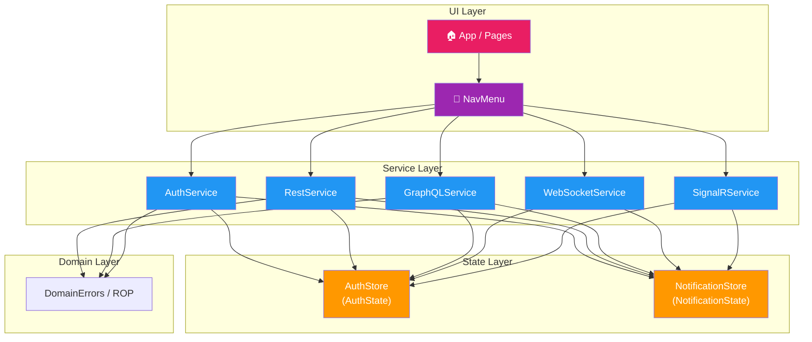
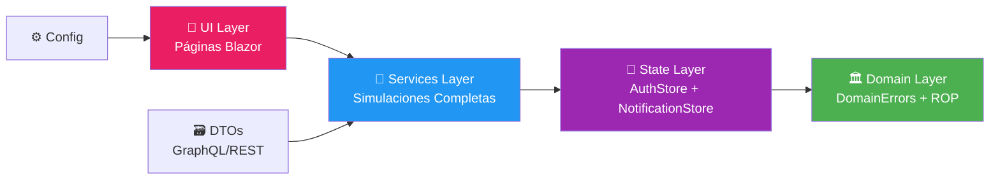
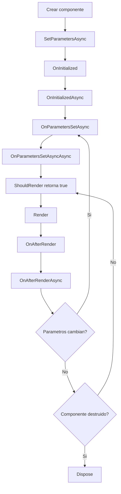
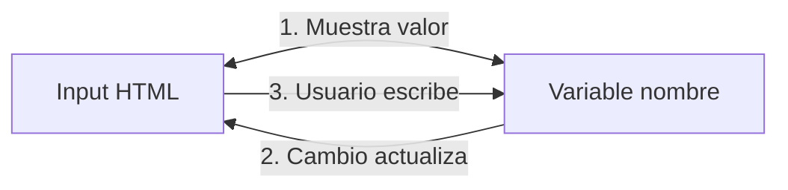
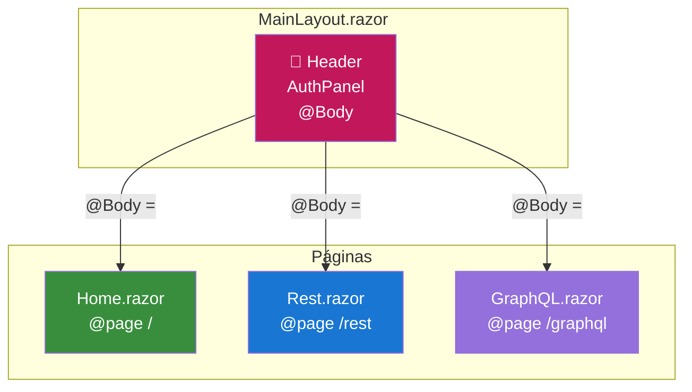
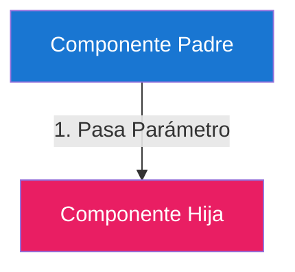
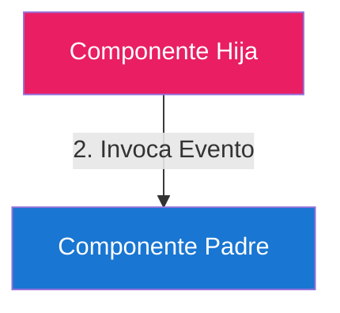
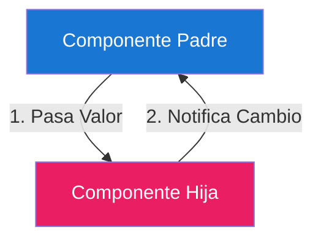
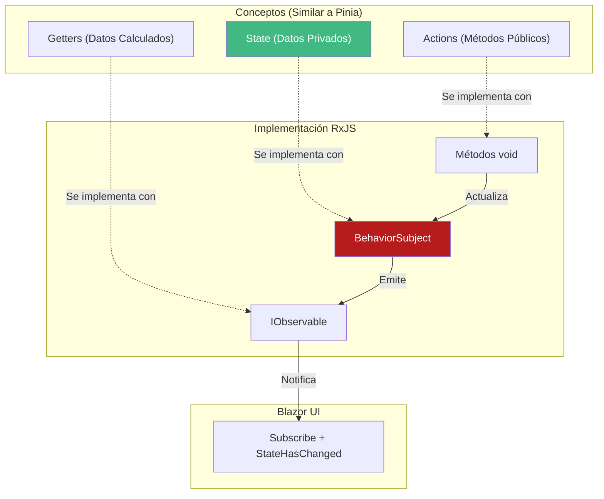
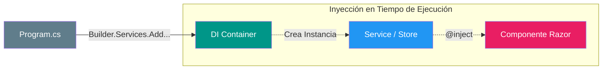

# 🎀 ClientBlazor - Cliente Completo para TiendaDAW API

Cliente **Blazor WebAssembly** con **4 protocolos de comunicación completamente simulados**: REST API, GraphQL, WebSocket y SignalR. **Arquitectura profesional** con Railway Oriented Programming, State Management Reactivo y tema Hello Kitty.

## 📋 Tabla de Contenidos

- [🎀 ClientBlazor](#-clientblazor)
- [✨ Características](#-características)
- [🏗️ Arquitectura](#️-arquitectura)
- [📁 Estructura del Proyecto](#-estructura-del-proyecto)
- [🔌 Servicios Implementados](#-servicios-implementados)
- [🎨 Interfaz de Usuario](#-interfaz-de-usuario)
- [🚀 Ejecución](#-ejecución)
- [📝 Credenciales Demo](#-credenciales-demo)

---

## ✨ Características

Cliente **Blazor WebAssembly** completo con **4 protocolos de comunicación completamente simulados**:

### 🔌 Protocolos Implementados
- 🏗️ **REST API** - CRUD completo con Railway Oriented Programming
- 🔗 **GraphQL** - Queries, mutations y subscriptions simuladas
- 🌐 **WebSocket** - Eventos en tiempo real automáticos
- 📡 **SignalR** - Hubs con autenticación y grupos

### 🎯 Funcionalidades Clave

- 🔐 **Autenticación JWT** persistida en localStorage
- 📡 **State Management Reactivo** con RxJS (patrón Pinia-like)
- 🎨 **Tema Hello Kitty** completamente personalizado
- 📱 **Interfaz Uniforme** en todos los protocolos
- ⚡ **Simulación Completa** sin backend real
- 🔔 **Sistema de Notificaciones** consistente
- 📖 **Código 100% Documentado** con XML Comments
- 🏗️ **Railway Oriented Programming** con CSharpFunctionalExtensions

---

## 🏗️ Arquitectura

### 🏛️ Patrón Arquitectónico



### 🏗️ Arquitectura por Capas



---

## 📁 Estructura del Proyecto


```
ClientBlazor/
├── 📁 ClientBlazor.Cliente/           # 🏠 Proyecto Blazor WASM
│   ├── 🎨 Components/
│   │   ├── App.razor                 # 🏠 Router principal
│   │   ├── 📱 Pages/                 # 📄 Páginas principales
│   │   │   ├── Home.razor           # 🏡 Dashboard
│   │   │   ├── Rest.razor           # 🏗️ REST API Client
│   │   │   ├── GraphQL.razor        # 🔗 GraphQL Client
│   │   │   ├── WebSocket.razor      # 🌐 WebSocket Client
│   │   │   └── SignalR.razor        # 📡 SignalR Client
│   │   └── 🤝 Shared/               # 🔧 Componentes compartidos
│   │       ├── NavMenu.razor        # 🧭 Navegación
│   │       ├── Login.razor          # 🔐 Autenticación
│   │       ├── AuthPanel.razor      # 👤 Usuario logueado
│   │       ├── TokenDisplay.razor   # 🎫 JWT Display
│   │       └── ToastPanel.razor     # 🔔 Notificaciones
│   ├── 🔌 Services/                 # ⚙️ Servicios simulados
│   │   ├── AuthService.cs          # 🔐 Login + JWT
│   │   ├── RestService.cs          # 🏗️ CRUD REST completo
│   │   ├── GraphQLService.cs       # 🔗 Queries + Mutations + Subs
│   │   ├── WebSocketService.cs     # 🌐 Eventos automáticos
│   │   └── SignalRService.cs       # 📡 Hubs con grupos
│   ├── 🗃️ DTOs/                    # 📋 Data Transfer Objects
│   │   ├── 📦 Productos/           # 🛍️ DTOs productos
│   │   ├── 📂 Categorias/          # 📁 DTOs categorías
│   │   ├── 🔗 GraphQL/            # 🔗 DTOs GraphQL
│   │   └── 🔐 Auth/                # 🔑 DTOs autenticación
│   ├── 🏛️ Domain/                  # 🏛️ Domain Layer
│   │   └── 🛡️ Errors/              # ⚠️ Errores tipados
│   │       └── DomainErrors.cs     # 🚂 Railway Oriented Programming
│   ├── 🏪 State/                   # 📡 State Management Reactivo
│   │   ├── AuthStore.cs           # 👤 Estado autenticación (RxJS)
│   │   └── NotificationStore.cs   # 🔔 Estado notificaciones
│   ├── ⚙️ Configuration/           # 🔧 Configuración
│   │   └── AppConfig.cs           # 🌐 Configuración app
│   ├── 🎨 wwwroot/                # 🌟 Assets estáticos
│   │   └── 🎨 css/                # 💖 Tema Hello Kitty
│   │       └── app.css            # 🎀 Estilos personalizados
│   └── 🚀 Program.cs              # 🏁 Entry point + DI
└── 📋 README.md                   # 📖 Esta documentación
```

---

## 🔌 Servicios Implementados

### 🏗️ REST API - Railway Oriented Programming

```csharp
// Servicio REST completamente simulado
public class RestService(AuthStore authStore)
{
    // CRUD completo con validación JWT
    public async Task<Result<PagedResult<ProductoDto>, DomainError>>
        GetProductosAsync(ProductoFilterDto filter)

    public async Task<Result<ProductoDto, DomainError>>
        CreateProductoAsync(ProductoRequestDto request)

    public async Task<Result<ProductoDto, DomainError>>
        UpdateProductoAsync(long id, ProductoRequestDto request)

    public async Task<Result<bool, DomainError>>
        DeleteProductoAsync(long id)
}
```

**Características:**
- ✅ CRUD completo productos/categorías
- 🔐 Validación JWT automática en POST/PUT/DELETE
- 📄 Paginación y filtros simulados
- 🚂 Railway Oriented Programming con `Result<T,E>`

### 🔗 GraphQL - Queries, Mutations & Subscriptions

```csharp
// Servicio GraphQL completamente simulado
public class GraphQLService(AuthStore authStore, NotificationStore notificationStore)
{
    // Queries públicas (sin auth)
    public async Task<Result<GraphQLResult<object>, DomainError>>
        ExecuteQueryAsync(string query)

    // Mutations requieren JWT
    public async Task<Result<GraphQLResult<object>, DomainError>>
        ExecuteMutationAsync(string mutation)

    // Subscriptions con eventos automáticos
    public async IAsyncEnumerable<object> SubscribeAsync(string subscriptionName)
}
```

**Endpoints GraphQL:**
- **Queries**: `productos`, `producto(id)`, `categorias`, `categoria(id)` *(públicos)*
- **Mutations**: `createProducto`, `updateProducto`, `deleteProducto` *(requieren JWT)*
- **Subscriptions**: `onProductoCreado`, `onProductoActualizado`, `onProductoEliminado`, `onStockBajo` *(automáticos)*

### 🌐 WebSocket - Eventos Automáticos

```csharp
// Servicio WebSocket completamente simulado
public class WebSocketService(AuthStore authStore, NotificationStore notificationStore)
{
    // Conexiones simuladas
    public async Task ConnectProductosAsync()  // Público
    public async Task ConnectPedidosAsync()    // Requiere JWT

    // Eventos llegan automáticamente al conectarse
    public event Action<string>? OnMessageReceived
}
```

**WebSocket Endpoints:**
- **Productos**: `ws://localhost:5000/ws/productos` *(público)*
- **Pedidos**: `ws://localhost:5000/ws/pedidos?token=JWT` *(requiere JWT)*

**Eventos Automáticos:**
- `ProductoCreado`, `ProductoActualizado`, `ProductoEliminado`, `StockBajo`
- `PedidoCreado`, `PedidoActualizado` (con JWT)

### 📡 SignalR - Hubs con Grupos

```csharp
// Servicio SignalR completamente simulado
public class SignalRService(AuthStore authStore, NotificationStore notificationStore)
{
    // Conexiones simuladas a Hubs
    public async Task ConnectProductosAsync()  // Público
    public async Task ConnectPedidosAsync()    // Requiere JWT

    // Eventos llegan automáticamente
    public event Action<string>? OnMessageReceived
}
```

**SignalR Hubs:**
- **Productos**: `http://localhost:5000/hubs/productos` *(público)*
- **Pedidos**: `http://localhost:5000/hubs/pedidos` *(requiere JWT)*

**Grupos Automáticos:**
- `user-{userId}` (usuarios normales ven sus pedidos)
- `admins` (administradores ven todos los pedidos)

**Eventos Automáticos:**
- Mismos eventos que WebSocket con formato JSON enriquecido

---

## 📡 Endpoints Completos

### 🏗️ REST API Endpoints

| Método | Endpoint | Descripción | Autenticación |
|--------|----------|-------------|---------------|
| `GET` | `/api/productos` | Listar productos (paginado) | ❌ Público |
| `GET` | `/api/productos/{id}` | Obtener producto por ID | ❌ Público |
| `POST` | `/api/productos` | Crear nuevo producto | ✅ JWT requerido |
| `PUT` | `/api/productos/{id}` | Actualizar producto | ✅ JWT requerido |
| `DELETE` | `/api/productos/{id}` | Eliminar producto | ✅ JWT requerido |
| `GET` | `/api/categorias` | Listar categorías | ❌ Público |
| `GET` | `/api/categorias/{id}` | Obtener categoría por ID | ❌ Público |
| `POST` | `/api/auth/signin` | Autenticación JWT | ❌ Público |

### 🔗 GraphQL Endpoints

| Tipo | Operación | Descripción | Autenticación |
|------|-----------|-------------|---------------|
| `Query` | `productos` | Listar productos | ❌ Público |
| `Query` | `producto(id)` | Obtener producto por ID | ❌ Público |
| `Query` | `categorias` | Listar categorías | ❌ Público |
| `Query` | `categoria(id)` | Obtener categoría por ID | ❌ Público |
| `Mutation` | `createProducto` | Crear producto | ✅ JWT requerido |
| `Mutation` | `updateProducto` | Actualizar producto | ✅ JWT requerido |
| `Mutation` | `deleteProducto` | Eliminar producto | ✅ JWT requerido |
| `Subscription` | `onProductoCreado` | Eventos creación | ❌ Automático |
| `Subscription` | `onProductoActualizado` | Eventos actualización | ❌ Automático |
| `Subscription` | `onProductoEliminado` | Eventos eliminación | ❌ Automático |
| `Subscription` | `onStockBajo` | Alertas stock bajo | ❌ Automático |

### 🌐 WebSocket Endpoints

| Endpoint | Protocolo | Descripción | Autenticación |
|----------|-----------|-------------|---------------|
| `ws://localhost:5000/ws/productos` | WebSocket | Eventos productos | ❌ Público |
| `ws://localhost:5000/ws/pedidos` | WebSocket | Eventos pedidos | ✅ JWT requerido |

**Eventos Automáticos:**
- `ProductoCreado`, `ProductoActualizado`, `ProductoEliminado`, `StockBajo`
- `PedidoCreado`, `PedidoActualizado` (con JWT)

### 📡 SignalR Hubs

| Hub | Endpoint | Descripción | Autenticación |
|-----|----------|-------------|---------------|
| `ProductosHub` | `http://localhost:5000/hubs/productos` | Eventos productos | ❌ Público |
| `PedidosHub` | `http://localhost:5000/hubs/pedidos` | Eventos pedidos | ✅ JWT requerido |

**Grupos Automáticos:**
- `user-{userId}` (pedidos del usuario)
- `admins` (todos los pedidos)

---
## 🎨 Interfaz de Usuario

### 🎯 Páginas Implementadas

| Página | Protocolo | Características |
|--------|-----------|----------------|
| 🏠 **Home** | N/A | Dashboard principal |
| 🏗️ **REST** | HTTP | CRUD completo con JWT |
| 🔗 **GraphQL** | HTTP/WebSocket | Queries + Mutations + Subs |
| 🌐 **WebSocket** | WS | Eventos automáticos |
| 📡 **SignalR** | WS | Hubs con grupos |

---


### 🎮 Uso Interactivo

1. **🔐 Login**: Usa credenciales demo
2. **🏗️ REST**: Prueba CRUD productos/categorías
3. **🔗 GraphQL**: Ejecuta queries/mutations/subscriptions
4. **🌐 WebSocket**: Conecta y recibe eventos automáticos
5. **📡 SignalR**: Conecta a hubs y recibe eventos

---

## 📝 Credenciales Demo

| Rol | Email | Password |
|-----|-------|----------|
| 👑 **Admin** | `admin@tienda.com` | `admin` |
| 👤 **User** | `userdaw@tienda.com` | `userdaw` |

---


**Estructura de un componente Razor (.razor):**

```razor
@* Seccion 1: Directivas *@
@page "/ruta"
@using ClientBlazor.Services
@inject Servicio MiServicio

@* Seccion 2: HTML *@
<div class="mi-componente">
    <h1>@Titulo</h1>
    <button @onclick="ManejarClick">Click</button>
</div>

@* Seccion 3: Codigo C# *@
@code {
    private string Titulo = "Hola";
    
    private void ManejarClick()
    {
        Titulo = "Adios";
        StateHasChanged(); // Notifica re-render
    }
}
```



**Métodos del ciclo de vida:**

```csharp
@code {
    // 1. Se ejecuta una vez al crear el componente
    protected override void OnInitialized()
    {
        // Inicializacion sincrona
    }

    protected override async Task OnInitializedAsync()
    {
        // Inicializacion asincrona (para API calls)
        await CargarDatos();
    }

    // 2. Se ejecuta cuando los parametros cambian
    protected override void OnParametersSet()
    {
        // Recargar datos cuando cambien los parametros de ruta
    }

    protected override async Task OnParametersSetAsync()
    {
        // Version asincrona
    }

    // 3. Control de renderizado
    protected override bool ShouldRender()
    {
        return true; //false para evitar re-renders
    }

    // 4. Se ejecuta despues de cada render
    protected override void OnAfterRender(bool firstRender)
    {
        // JSInterop aqui
    }

    protected override async Task OnAfterRenderAsync(bool firstRender)
    {
        // Version asincrona
    }

    // 5. Cleanup
    public void Dispose()
    {
        // Liberar recursos
    }
}
```

---

### 3. Estado del Componente

El estado se define como campos privados en la seccion `@code`:

```csharp
@code {
    private string nombre = "Juan";
    private int contador = 0;
    private bool activo = true;
    private List<string> items = new();
    private objeto? nullable = null;
}
```

**Renderizado reactivo:** Blazor detecta cambios de estado y re-renderiza automáticamente.

---

### 4. Eventos del Componente

**Evento onclick:**

```razor
<button @onclick="ManejarClick">Click</button>

@code {
    private void ManejarClick()
    {
        // Manejar click
    }
}
```

**Evento onchange:**

```razor
<input @bind="valor" @onchange="ManejarCambio" />

@code {
    private string valor = "";
    private void ManejarCambio(ChangeEventArgs e)
    {
        valor = e.Value?.ToString() ?? "";
    }
}
```

**Evento onmouseover:**

```razor
<div @onmouseover="ManejarHover">Hover me</div>
```

**Otros eventos comunes:**

```razor
@* Eventos de formulario *@
<input @oninput="ManejarInput" />              @* Cada pulsacion *@
<input @onblur="ManejarBlur" />                 @* Perder foco *@
<select @onchange="ManejarSelectChange">
    <option value="1">Opcion 1</option>
</select>
<textarea @onkeydown="ManejarKeyDown"></textarea>

@* Eventos de mouse *@
<div @onclick="ManejarClick"
     @ondblclick="ManejarDobleClick"
     @onmouseover="ManejarHover"
     @onmouseout="ManejarOut"
     @oncontextmenu="ManejarDerecho">
     Click derecho deshabilitado
</div>

@* Prevenir comportamiento por defecto *@
<a href="/pagina" @onclick:preventDefault>Enlace con preventDefault</a>
```

---

### 5. Reactividad

#### Unidireccional (One-way)

```razor
<h1>@titulo</h1>           @* Display de datos *@
<span>@contador</span>       @* Solo lectura *@
```

El HTML solo muestra el valor. Cambios en el código se reflejan en pantalla.

#### Bidireccional (Two-way) con @bind

La directiva `@bind` conecta un elemento HTML con una variable del estado:

```razor
@* Sintaxis basica: @bind="variable" *@
<input @bind="nombre" />

@code {
    private string nombre = "";  @* <-- La variable va aqui *@
}
```

**¿Qué hace `@bind`?**



**Ejemplo completo:**

```razor
<input @bind="nombre" placeholder="Escribe tu nombre" />
<p>Hola @nombre!</p>

@code {
    private string nombre = "";  @* @bind conecta input con esta variable *@
}
```

**Parámetros de `@bind`:**

```razor
@* Binding standard (onchange) *@
<input @bind="nombre" />

@* Binding en tiempo real (oninput) *@
<input @bind="nombre" @bind:event="oninput" />

@* Binding con formato *@
<input @bind="precio" @bind:format="C" />  @* Currency *@
<input @bind="fecha" @bind:format="dd/MM/yyyy" />

@* Binding con custom format *@
@{ 
    var formato = "es-ES"; 
}
<input @bind="precio" @bind:culture="new CultureInfo(formato)" />
```

**Binding a propiedades anidadas:**

```razor
<input @bind="producto.Nombre" />

@code {
    private Producto producto = new() { Nombre = "" };
}
```

**Binding condicional:**

```razor
<input @bind="valor" @bind:disabled="deshabilitado" />
<textarea @bind="comentario" @bind:readonly="soloLectura"></textarea>
```

---

### 6. Comunicación entre Componentes

#### Padre → Hija: Parámetros

**Componente hija:**

```razor
@* Hija.razor *@
@code {
    [Parameter]
    public string Titulo { get; set; } = "";
    
    [Parameter]
    public int Contador { get; set; }
    
    [Parameter]
    public EventCallback<int> OnIncrementar { get; set; }
}
```

**Componente padre:**

```razor
<Hija Titulo="Mi Titulo" 
      Contador="10" 
      OnIncrementar="ManejarIncremento" />

@code {
    private int valor = 10;
    
    private void ManejarIncremento(int nuevoValor)
    {
        valor = nuevoValor;
    }
}
```

#### Hija → Padre: Eventos con EventCallback

**Componente hija (ButtonCounter.razor):**

```razor
<button @onclick="ManejarClick">Incrementar</button>

@code {
    [Parameter]
    public EventCallback<int> OnClick { get; set; }
    
    private int count = 0;
    
    private void ManejarClick()
    {
        count++;
        OnClick.InvokeAsync(count);  @* Envia el valor al padre *@
    }
}
```

**Componente padre:**

```razor
<ButtonCounter OnClick="ManejarContador" />

<p>Contador: @contador</p>

@code {
    private int contador = 0;
    
    private void ManejarContador(int nuevoValor)
    {
        contador = nuevoValor;  @* Recibe el valor de la hija *@
    }
}
```

#### Comunicación con RenderFragment

**Componente con contenido hijo:**

```razor
@* Card.razor *@
<div class="card">
    <div class="card-header">@Titulo</div>
    <div class="card-body">
        @ChildContent
    </div>
</div>

@code {
    [Parameter]
    public string Titulo { get; set; } = "";
    
    [Parameter]
    public RenderFragment? ChildContent { get; set; }
}
```

**Uso:**

```razor
<Card Titulo="Mi Card">
    <p>Contenido de la card</p>
    <button>Accion</button>
</Card>
```

#### Layouts y @Body

Un **Layout** es un componente que define la estructura común de la aplicación (header, footer, menú). El marcador `@Body` indica dónde se renderiza el contenido de la página actual.

**Estructura:**
```
Layout (plantilla)
├── Elementos comunes (header, nav, footer)
├── @Body (agujero dinámico)
└── Elementos comunes (footer)
```

**Ejemplo de MainLayout.razor:**

```razor
@inherits LayoutComponentBase
@using ClientBlazor.Cliente.Components.Shared

<div class="container">
    <h1>ClientBlazor</h1>
    
    <AuthPanel />  @* Componente fijo en todas las páginas *@
    
    <div class="main-content">
        @Body  @* Aquí aparece el contenido de la página actual *@
    </div>
    
    <footer>Pie de página</footer>
</div>
```

**Cómo funciona:**



**Registro del Router:**

```csharp
@* App.razor *@
<Router AppAssembly="@typeof(App).Assembly">
    <Found Context="routeData">
        <RouteView RouteData="@routeData" DefaultLayout="@typeof(MainLayout)" />
    </Found>
</Router>
```

**Ventajas:**
- ** DRY** - Don't Repeat Yourself
- **Mantenimiento fácil** - Un solo lugar para cambiar UI
- **Composición** - Layout + Página = Página completa

**Analogía:**

```
┌─────────────────────────────────────────┐
│              SOBRE (Layout)             │
│  ┌─────────────────────────────────┐    │
│  │  📋 Header      🎀 AuthPanel    │   │
│  │                                 │    │
│  │  ████████ @Body ████████        │    │
│  │     (agujero dinámico)          │    │
│  │                                 │    │
│  │            Footer 🦶            │    │
│  └─────────────────────────────────┘    │
└─────────────────────────────────────────┘
```

**Registro del Layout en páginas:**

```razor
@* Cualquier página puede especificar su layout *@
@page "/"
@layout MainLayout

<h1>Página Principal</h1>
```

#### Diagramas: Comunicación entre Componentes

**1. Padre a Hija (Parámetros)**

El padre envía datos a la hija mediante propiedades decoradas con `[Parameter]`.

```razor
<!-- Padre.razor -->
<Hija Titulo="Hola Mundo" />

<!-- Hija.razor -->
@code {
    [Parameter] public string Titulo { get; set; }
}
```



**2. Hija a Padre (EventCallback)**

La hija notifica al padre mediante eventos `EventCallback`.

```razor
<!-- Padre.razor -->
<Hija OnClick="ManejarClick" />

<!-- Hija.razor -->
<button @onclick="() => OnClick.InvokeAsync()">Click</button>

@code {
    [Parameter] public EventCallback OnClick { get; set; }
}
```



**3. Binding Bidireccional (@bind)**

Sincronización automática de datos entre padre e hija.

```razor
<!-- Padre.razor -->
<Hija @bind-Valor="texto" />

<!-- Hija.razor -->
<input @bind="Valor" @oninput="Actualizar" />

@code {
    [Parameter] public string Valor { get; set; }
    [Parameter] public EventCallback<string> ValorChanged { get; set; }
    
    void Actualizar(ChangeEventArgs e) => ValorChanged.InvokeAsync(e.Value.ToString());
}
```



---

### 7. State Management Reactivo (Estilo Pinia)

Para la gestión del estado global utilizamos un enfoque reactivo con **Reactive Extensions (RxJS)**. Este patrón es arquitectónicamente **muy similar a Pinia de Vue.js**, dividiendo la lógica en Estado, Getters y Acciones.

#### 7.1 Arquitectura del Store



#### 7.2 Implementación (AuthStore)

El **Store** mantiene el estado de la aplicación de forma centralizada.

```csharp
// AuthStore.cs
public class AuthStore
{
    // 1. ESTADO (State)
    // Contenedor privado. BehaviorSubject retiene el último valor.
    private readonly BehaviorSubject<AuthState> _state = new(new AuthState());

    // 2. OBSERVABLES (Equivalente a Getters)
    // Flujos de datos públicos y de solo lectura.
    public IObservable<AuthState> State => _state.AsObservable();

    // Getter derivado: Solo notifica si cambia el estado de autenticación
    public IObservable<bool> IsAuthenticated => 
        _state.Select(s => !string.IsNullOrEmpty(s.Token)).DistinctUntilChanged();

    // 3. ACCIONES (Actions)
    // Métodos para mutar el estado.
    public void SetAuth(string token, User user)
    {
        var newState = _state.Value with { Token = token, User = user };
        _state.OnNext(newState); // Notifica a todos los suscriptores
    }

    public void Logout() => _state.OnNext(new AuthState());
}
```

#### 7.3 Consumo en Componentes

A diferencia de las propiedades normales de Blazor, los Observables requieren una suscripción manual y el uso de `StateHasChanged` para actualizar la UI, ya que Blazor no rastrea flujos RxJS automáticamente.

```razor
@inject AuthStore AuthStore
@implements IDisposable

@if (isAuthenticated)
{
    <button @onclick="Logout">Salir</button>
}

@code {
    private bool isAuthenticated;
    private IDisposable? subscription;

    protected override void OnInitialized()
    {
        // Nos suscribimos al cambio de estado
        subscription = AuthStore.IsAuthenticated.Subscribe(auth => 
        {
            isAuthenticated = auth;
            StateHasChanged(); // ⚠️ ¡Obligatorio para repintar!
        });
    }

    public void Logout() => AuthStore.Logout();

    public void Dispose() => subscription?.Dispose();
}
```

#### 7.4 Registro en Program.cs

```csharp
builder.Services.AddSingleton<AuthStore>();
builder.Services.AddSingleton<NotificationStore>();
```

---

### 9. Conceptos Avanzados

#### 9.1 Inyección de Dependencias (DI)

Blazor utiliza un contenedor de DI integrado para inyectar servicios en componentes. Esto desacopla la vista de la lógica de negocio.

**Ciclos de Vida en WebAssembly:**

| Ciclo | Comportamiento en Wasm | Uso Recomendado |
|-------|------------------------|-----------------|
| **Transient** | Nueva instancia cada vez que se solicita. | Servicios ligeros sin estado. |
| **Scoped** | Una instancia por "carga" de aplicación (similar a Singleton en Wasm). Se reinicia con F5. | Servicios, Repositorios, AuthState. |
| **Singleton** | Una única instancia para toda la vida de la pestaña. | Stores Globales (RxJS), Config, Cache. |



#### 9.2 Formularios y Validación

Para los CRUD (Crear/Editar productos), utilizamos el componente `EditForm` que se integra con las `DataAnnotations` de los DTOs.

```razor
@using System.ComponentModel.DataAnnotations

<EditForm Model="@modelo" OnValidSubmit="HandleValidSubmit">
    <!-- Habilita validación por atributos [Required], [StringLength] -->
    <DataAnnotationsValidator />
    
    <!-- Muestra resumen de errores -->
    <ValidationSummary />

    <div class="form-group">
        <label>Nombre:</label>
        <InputText @bind-Value="modelo.Nombre" class="form-control" />
        <ValidationMessage For="@(() => modelo.Nombre)" />
    </div>

    <button type="submit">Guardar</button>
</EditForm>

@code {
    private ProductoRequestDto modelo = new();

    private void HandleValidSubmit()
    {
        // Solo se ejecuta si el modelo es válido
        Console.WriteLine("Formulario válido enviado");
    }
}
```

---

### 10. Testing

El proyecto incluye una suite de pruebas robusta utilizando **NUnit**, **bUnit** (para componentes) y **FluentAssertions**.

#### 10.1 Testing de Componentes con bUnit

**bUnit** nos permite renderizar componentes Blazor en memoria, interactuar con ellos (clicks, inputs) y verificar su renderizado HTML.

**Conceptos Clave:**
*   `BunitContext`: Contexto aislado para cada test.
*   `Render<T>()`: Renderiza el componente bajo prueba (CUT - Component Under Test).
*   `Services.AddSingleton(...)`: Inyección de dependencias en el test (Stores, Servicios).
*   `cut.Find(".css-selector")`: Busca elementos en el DOM renderizado.
*   `cut.InvokeAsync(...)`: Ejecuta código en el hilo del Dispatcher (necesario para actualizaciones de estado).

**Ejemplo: Verificando reactividad en `TokenDisplay`**

```csharp
[TestFixture]
public class TokenDisplayTests
{
    private BunitContext _ctx = null!;
    private AuthStore _authStore = null!;

    [SetUp]
    public void Setup()
    {
        _ctx = new BunitContext();
        _authStore = new AuthStore();
        // Registramos el Store real para probar la integración
        _ctx.Services.AddSingleton(_authStore);
    }

    [TearDown]
    public void TearDown() => _ctx.Dispose();

    [Test]
    public void Should_Update_View_When_Store_Changes()
    {
        // Arrange
        var cut = _ctx.Render<TokenDisplay>();

        // Act: Modificamos el Store (dentro del Dispatcher)
        cut.InvokeAsync(() => _authStore.SetToken("mi-token-secreto"));

        // Assert: Esperamos y verificamos que el input muestre el valor
        cut.WaitForState(() => cut.Find("input").GetAttribute("value") == "mi-token-secreto");
        cut.Find("input").GetAttribute("value").Should().Be("mi-token-secreto");
    }
}
```

#### 10.2 Ejecución

Para ejecutar todos los tests (Unitarios y de Integración):

```bash
dotnet test ClientBlazor.Tests
```

#### 10.3 Testing E2E con Playwright

Para pruebas de extremo a extremo (End-to-End), utilizamos **Playwright** con NUnit. Estas pruebas simulan un navegador real interactuando con la aplicación.

**📝 Cómo escribir un Test E2E:**

1.  Hereda de `PageTest` para tener acceso al objeto `Page`.
2.  Usa `await Page.GotoAsync("/")` para navegar.
3.  Utiliza los selectores `TestId("id")` (configurados en el proyecto) para encontrar elementos robustos.
4.  Interactúa con `FillAsync()`, `ClickAsync()`, etc.
5.  Verifica el estado con `await Expect(...)`.

```csharp
[Test]
public async Task MiPrimerTestE2E()
{
    // 1. Navegar
    await Page.GotoAsync("/");

    // 2. Interactuar (usando data-testid)
    await Page.TestId("email-input").FillAsync("usuario@demo.com");
    await Page.TestId("login-btn").ClickAsync();

    // 3. Verificar (Aserción)
    await Expect(Page.TestId("auth-panel")).ToBeVisibleAsync();
}
```

**Características:**
*   **Videos y Screenshots:** Se generan automáticamente en `bin/Debug/net10.0/` tras la ejecución.
*   **Selectores Robustos:** Uso de `data-testid` y roles accesibles.
*   **Escenarios Cubiertos:** Login, Navegación, REST API y WebSocket en tiempo real.

**Ejecución:**

1.  **Iniciar la App:** (En una terminal aparte)
    ```bash
    dotnet run --project ClientBlazor.Cliente --urls "http://localhost:5400"
    ```

2.  **Instalar Navegadores:** (Solo primera vez)
    ```powershell
    pwsh ClientBlazor.E2E/bin/Debug/net10.0/playwright.ps1 install
    ```

3.  **Ejecutar Tests:**
    ```bash
    dotnet test ClientBlazor.E2E
    ```

---

## 🚀 Cómo Ejecutar

### Requisitos

- .NET 10.0
- Navegador moderno (Chrome, Firefox, Edge)

### Ejecución

```bash
# Desde la carpeta ClientBlazor
cd ClientBlazor.Cliente

# Restaurar paquetes
dotnet restore

# Compilar
dotnet build

# Ejecutar
dotnet run

# O con hot reload
dotnet watch
```

### Acceder a la aplicación

```
http://localhost:5000
```

---

## 📝 Credenciales Demo

| Rol | Email | Password |
|-----|-------|----------|
| Admin | admin@tienda.com | admin |
| User | userdaw@tienda.com | userdaw |

---

## 📄 Licencia

Este proyecto es educativo para la asignatura de Desarrollo Web en Entorno Servidor.

---

**Happy Coding!** 🎀✨
