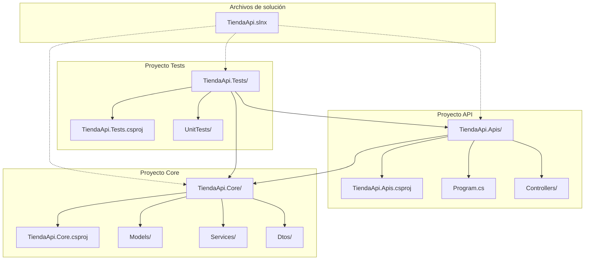
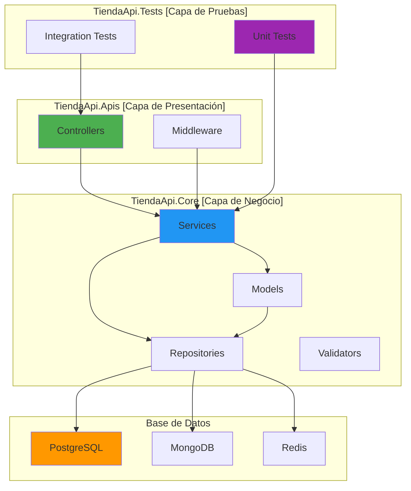
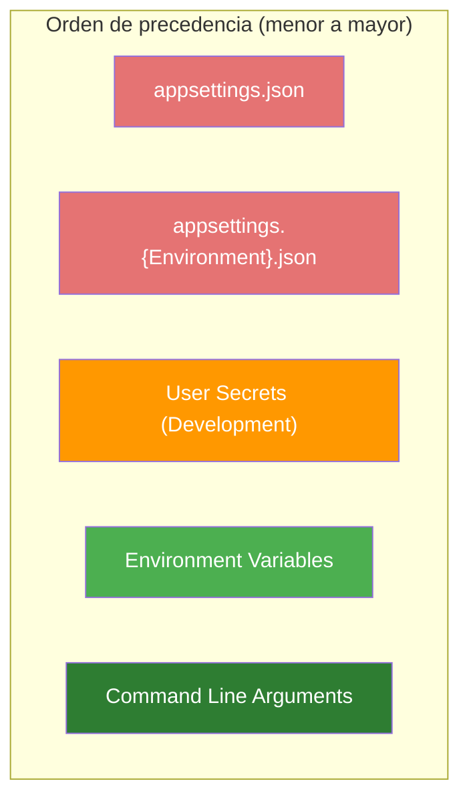
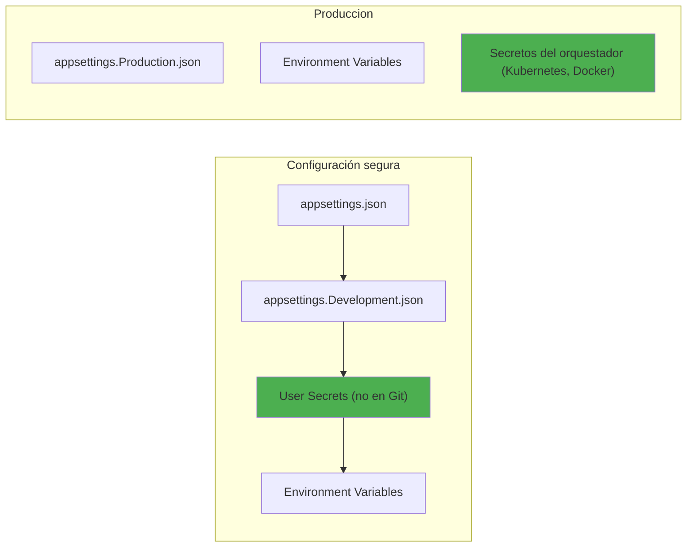
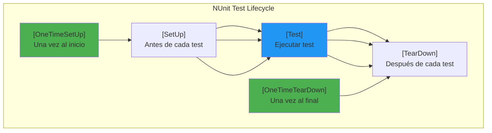
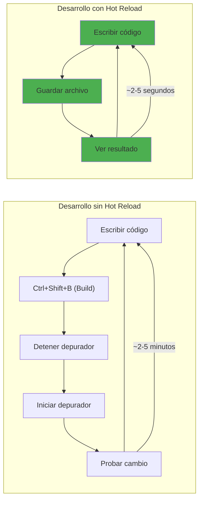

# 1. Configuración de Proyectos .NET

## Índice

[1. Configuración de Proyectos .NET](#1-configuración-de-proyectos-net)
  - [1.1. Creación de Soluciones y Proyectos](#11-creación-de-soluciones-y-proyectos)
  - [1.2. Instalación de Librerías con NuGet](#12-instalación-de-librerías-con-nuget)
  - [1.3. Estructura de Proyectos](#13-estructura-de-proyectos)
  - [1.4. Configuración con appsettings.json](#14-configuración-con-appsettingsjson)
  - [1.5. Variables de Entorno y Secrets de Usuario](#15-variables-de-entorno-y-secrets-de-usuario)
  - [1.6. Patrón de Opciones (IOptions<T>)](#16-patrón-de-opciones-ioptionst)
  - [1.7. Testing con NUnit](#17-testing-con-nunit)
  - [1.8. Hot Reload y dotnet watch run](#18-hot-reload-y-dotnet-watch-run)
  - [1.9. Resumen y Buenas Prácticas](#19-resumen-y-buenas-prácticas)

---

## 1.1. Creación de Soluciones y Proyectos

Una **solución** en .NET es un contenedor lógico que agrupa uno o más proyectos relacionados. Separar la solución del código fuente permite gestionar mejor las dependencias entre proyectos y facilita el trabajo en equipo. Cuando creas una solución, estás creando un archivo .sln que actúa como índice de todos los proyectos que forman parte de tu aplicación.

### ¿Por qué usar soluciones?

Imagina que tienes una aplicación de tienda con tres partes: la API que expone los endpoints, la lógica de negocio que contiene las reglas y entidades, y los tests que verifican que todo funcione. Cada una de estas partes es un proyecto independiente, pero están relacionadas entre sí. La solución actúa como el pegamento que las une, permitiéndote abrir todo el código en Visual Studio o Rider con un solo archivo.

### Crear la estructura desde cero

Abre tu terminal en la carpeta donde quieres crear el proyecto y ejecuta los siguientes comandos. Cada comando crea un proyecto diferente y lo añade automáticamente a la solución:

```bash
# Crear una solución vacía que contendrá todos los proyectos
dotnet new slnx -n TiendaApi

# Crear el proyecto de API (contiene controladores, middleware y configuración)
dotnet new webapi -n TiendaApi.Apis -o ./TiendaApi.Apis

# Crear el proyecto de Core (contiene entidades, servicios e interfaces)
dotnet new classlib -n TiendaApi.Core -o ./TiendaApi.Core

# Crear el proyecto de Tests con NUnit
dotnet new nunit -n TiendaApi.Tests -o ./TiendaApi.Tests

# Añadir cada proyecto a la solución
dotnet slnx add TiendaApi.Apis/TiendaApi.Apis.csproj
dotnet slnx add TiendaApi.Core/TiendaApi.Core.csproj
dotnet slnx add TiendaApi.Tests/TiendaApi.Tests.csproj
```

### Establecer referencias entre proyectos

Los proyectos necesitan "conocerse" entre sí para poder usar las clases definidas en otros. La API necesita acceder a Core, y los Tests necesitan acceder tanto a API como a Core para poder testearlos:

```bash
# La API referencia a Core porque necesita usar sus servicios
dotnet add TiendaApi.Apis/TiendaApi.Apis.csproj reference TiendaApi.Core/TiendaApi.Core.csproj

# Los Tests referencian a API y Core para poder testearlos
dotnet add TiendaApi.Tests/TiendaApi.Tests.csproj reference TiendaApi.Apis/TiendaApi.Apis.csproj
dotnet add TiendaApi.Tests/TiendaApi.Tests.csproj reference TiendaApi.Core/TiendaApi.Core.csproj
```

### Estructura de carpetas resultante



---

## 1.2. Instalación de Librerías con NuGet

NuGet es el gestor de paquetes de .NET. Cuando necesitas una funcionalidad que no viene incluida en el framework, como conectar con PostgreSQL o validar datos con FluentValidation, buscas el paquete correspondiente y lo instalas con un comando. Los paquetes se descargan desde nuget.org y se almacenan en caché en tu máquina.

### ¿Qué son los paquetes NuGet?

Piensa en NuGet como una biblioteca gigante donde desarrolladores de todo el mundo comparten código reusable. Entity Framework Core para acceder a bases de datos, AutoMapper para convertir entre objetos, o Serilog para registrar logs, todos son paquetes NuGet que puedes incorporar a tu proyecto con un solo comando.

### Instalación de paquetes essenciais

Estos son los paquetes más utilizados en el proyecto TiendaApi. Ejecuta estos comandos desde la carpeta de cada proyecto:

```bash
# ======= ENTITY FRAMEWORK CORE =======
# Paquete principal de EF Core
dotnet add TiendaApi.Core/TiendaApi.Core.csproj package Microsoft.EntityFrameworkCore

# Proveedor para PostgreSQL
dotnet add TiendaApi.Core/TiendaApi.Core.csproj package Npgsql.EntityFrameworkCore.PostgreSQL

# Herramientas de línea de comandos para migraciones
dotnet add TiendaApi.Apis/TiendaApi.Apis.csproj package Microsoft.EntityFrameworkCore.Tools

# ======= MAPPING Y VALIDACIÓN =======
# AutoMapper para transformar objetos automáticamente
dotnet add TiendaApi.Core/TiendaApi.Core.csproj package AutoMapper
dotnet add TiendaApi.Core/TiendaApi.Core.csproj package AutoMapper.Extensions.Microsoft.DependencyInjection

# FluentValidation para reglas de validación personalizadas
dotnet add TiendaApi.Core/TiendaApi.Core.csproj package FluentValidation
dotnet add TiendaApi.Core/TiendaApi.Core.csproj package FluentValidation.DependencyInjection

# ======= RESULT PATTERN =======
# CSharpFunctionalExtensions para el patrón Result
dotnet add TiendaApi.Core/TiendaApi.Core.csproj package CSharpFunctionalExtensions

# ======= AUTENTICACIÓN =======
# JWT Bearer para autenticación basada en tokens
dotnet add TiendaApi.Apis/TiendaApi.Apis.csproj package Microsoft.AspNetCore.Authentication.JwtBearer

# ======= CACHE =======
# StackExchange.Redis para cache distribuido
dotnet add TiendaApi.Core/TiendaApi.Core.csproj package StackExchange.Redis

# ======= BASE DE DATOS DOCUMENTAL =======
# Controlador oficial de MongoDB
dotnet add TiendaApi.Core/TiendaApi.Core.csproj package MongoDB.Driver

# ======= RESILIENCIA =======
# Polly para reintentos y circuit breaker
dotnet add TiendaApi.Core/TiendaApi.Core.csproj package Polly
dotnet add TiendaApi.Core/TiendaApi.Core.csproj package Polly.Extensions.Http

# ======= DOCUMENTACIÓN =======
# Swashbuckle para generar documentación OpenAPI/Swagger
dotnet add TiendaApi.Apis/TiendaApi.Apis.csproj package Swashbuckle.AspNetCore

# ======= TESTING =======
# NUnit como framework de testing
dotnet add TiendaApi.Tests/TiendaApi.Tests.csproj package NUnit
dotnet add TiendaApi.Tests/TiendaApi.Tests.csproj package NUnit3TestAdapter

# Moq para crear objetos simulados
dotnet add TiendaApi.Tests/TiendaApi.Tests.csproj package Moq

# FluentAssertions para aserciones más legibles
dotnet add TiendaApi.Tests/TiendaApi.Tests.csproj package FluentAssertions
```

### Comandos útiles de NuGet

```bash
# Restaurar todos los paquetes del proyecto
dotnet restore

# Listar los paquetes instalados en un proyecto
dotnet list package

# Ver versiones disponibles de un paquete
dotnet list package --all-versions | findstr AutoMapper

# Actualizar un paquete a la última versión
dotnet add package AutoMapper

# Actualizar a una versión específica
dotnet add package AutoMapper --version 12.0.0
```

---

## 1.3. Estructura de Proyectos

Una arquitectura bien organizada separa las responsabilidades en capas claramente definidas. Esto facilita el mantenimiento, las pruebas y la evolución del código. En este proyecto utilizamos una arquitectura por capas donde cada proyecto tiene una responsabilidad específica.

### ¿Por qué separar en proyectos?

Cuando estás desarrollando, es tentador poner todo en un solo proyecto para ir más rápido. Sin embargo, a medida que la aplicación crece, esta decisión se convierte en un problema. Los tests necesitan acceder a tu código sin arrastrar dependencias de servidor web, y quieres poder reutilizar la lógica de negocio en diferentes aplicaciones (web, móvil, CLI). Separar en proyectos te da esta flexibilidad.

### Estructura completa del proyecto

```
TiendaApi.sln
│
├── TiendaApi.Apis/                          # Capa de presentación: controladores, middleware y configuración Web
│   ├── Controllers/                          # Controladores REST (Auth, Users, Productos, etc.)
│   ├── Middleware/                           # Middlewares personalizados (Exception Handler, etc.)
│   ├── WebSockets/                           # Hubs de SignalR para tiempo real
│   ├── GraphQL/                              # Tipos y resolvers de GraphQL
│   ├── Program.cs                            # Punto de entrada y configuración
│   ├── appsettings.json                      # Configuración general
│   ├── appsettings.Development.json          # Configuración específica de desarrollo
│   └── TiendaApi.Apis.csproj                 # Archivo de proyecto
│
├── TiendaApi.Core/                           # Capa de negocio: entidades, servicios e interfaces
│   ├── Models/                               # Entidades de dominio (User, Producto, Pedido, etc.)
│   ├── Dtos/                                 # Data Transfer Objects para la API
│   │   ├── Common/                           # DTOs compartidos (PagedResult, etc.)
│   │   ├── Auth/                             # DTOs de autenticación
│   │   ├── Productos/                        # DTOs de productos
│   │   ├── Pedidos/                          # DTOs de pedidos
│   │   └── ...
│   ├── Mappers/                              # Perfiles de AutoMapper
│   ├── Services/                             # Servicios de negocio con lógica de dominio
│   │   ├── Auth/                             # AuthService, JwtService, etc.
│   │   ├── Productos/                        # ProductoService
│   │   ├── Pedidos/                          # PedidosService
│   │   └── ...
│   ├── Repositories/                         # Implementaciones de repositorios
│   │   ├── Productos/
│   │   ├── Pedidos/
│   │   └── ...
│   ├── Interfaces/                           # Contratos (interfaces) para inyección de dependencias
│   │   ├── IServices/
│   │   ├── IRepositories/
│   │   └── ...
│   ├── Validators/                           # Validadores de FluentValidation
│   ├── Errors/                               # Tipos de errores personalizados (DomainError, etc.)
│   ├── Exceptions/                           # Excepciones personalizadas
│   ├── Data/                                 # DbContext y configuración de datos
│   │   ├── Seed/                             # Seeders de datos iniciales
│   │   └── Interceptors/                     # Interceptors de EF Core
│   └── TiendaApi.Core.csproj
│
└── TiendaApi.Tests/                          # Capa de pruebas: unitarias y de integración
    ├── UnitTests/                            # Tests unitarios
    │   ├── Services/
    │   ├── Controllers/
    │   └── Mappers/
    ├── IntegrationTests/                     # Tests de integración
    ├── Fixtures/                             # Clases de configuración para tests
    └── TiendaApi.Tests.csproj
```

### Flujo de datos entre capas



---

## 1.4. Configuración con appsettings.json

El archivo `appsettings.json` es el método principal de configuración en ASP.NET Core. Permite definir valores que pueden cambiar entre entornos (desarrollo, producción) sin modificar el código. La configuración se carga en orden jerárquico, donde los valores de entornos más específicos sobrescriben los generales.

### ¿Cómo funciona la configuración?

Cuando inicias una aplicación ASP.NET Core, el framework lee automáticamente el archivo `appsettings.json` y lo fusiona con `appsettings.{Entorno}.json`. Luego añade las variables de entorno y otros orígenes, creando una jerarquía donde los valores más específicos tienen prioridad. Esto significa que puedes tener valores por defecto en el archivo general y sobrescribirlos específicamente para desarrollo o producción.

### Archivo appsettings.json básico

```json
{
  "Logging": {
    "LogLevel": {
      "Default": "Information",
      "Microsoft.AspNetCore": "Warning",
      "Microsoft.EntityFrameworkCore": "Warning"
    },
    "Console": {
      "IncludeScopes": true
    }
  },
  "AllowedHosts": "*",
  
  "ConnectionStrings": {
    "PostgreSQL": "Host=localhost;Database=TiendaDb;Username=postgres;Password=secret",
    "Redis": "localhost:6379",
    "MongoDB": "mongodb://localhost:27017"
  },
  
  "Jwt": {
    "SecretKey": "TuClaveSecretaMuyLargaYSegura123456789",
    "Issuer": "TiendaApi",
    "Audience": "TiendaApiClients",
    "ExpiryMinutes": 60,
    "RefreshExpiryDays": 7
  },
  
  "Storage": {
    "BasePath": "./wwwroot/uploads",
    "MaxFileSizeMb": 10,
    "AllowedExtensions": [".jpg", ".jpeg", ".png", ".gif", ".pdf"]
  },
  
  "Email": {
    "SmtpHost": "smtp.gmail.com",
    "SmtpPort": 587,
    "SenderEmail": "noreply@tienda.com",
    "SenderName": "Tienda DAW"
  },
  
  "Cache": {
    "DefaultExpirationMinutes": 5,
    "SlidingExpirationMinutes": 2
  },
  
  "Cors": {
    "AllowedOrigins": ["http://localhost:3000", "https://tienda.com"]
  }
}
```

### appsettings.Development.json

Este archivo contiene configuración específica para el entorno de desarrollo. En desarrollo quieres ver más información de logs, usar conexiones a bases de datos locales, y tener habilitado el hot reload:

```json
{
  "Logging": {
    "LogLevel": {
      "Default": "Debug",
      "Microsoft.AspNetCore": "Information",
      "Microsoft.EntityFrameworkCore": "Debug"
    }
  },
  "ConnectionStrings": {
    "PostgreSQL": "Host=localhost;Database=TiendaDb;Username=postgres;Password=postgres",
    "Redis": "localhost:6379",
    "MongoDB": "mongodb://localhost:27017"
  },
  "Jwt": {
    "SecretKey": "ClaveDeDesarrollo123456789012345678901234567890"
  },
  "DetailedErrors": true,
  "BrowserLink": true
}
```

### appsettings.Production.json

En producción quieres menos logs, conexiones a bases de datos remotas, y configuración optimizada para rendimiento:

```json
{
  "Logging": {
    "LogLevel": {
      "Default": "Warning",
      "Microsoft.AspNetCore": "Error",
      "Microsoft.EntityFrameworkCore": "Error"
    }
  },
  "ConnectionStrings": {
    "PostgreSQL": "Host=prod-db.example.com;Database=TiendaDb;Username=webuser;Password=${DB_PASSWORD}",
    "Redis": "prod-redis.example.com:6379"
  },
  "AllowedHosts": "tienda.com",
  "DetailedErrors": false
}
```

### Leer configuración en código

```csharp
var builder = WebApplication.CreateBuilder(args);

// Método 1: Acceso directo a configuración
var connectionString = builder.Configuration.GetConnectionString("PostgreSQL");
var jwtSecret = builder.Configuration["Jwt:SecretKey"];

// Método 2: Obtener una sección completa
var jwtConfig = builder.Configuration.GetSection("Jwt");
var secretKey = jwtConfig["SecretKey"];

// Método 3: Usando opciones patrón (recomendado para objetos complejos)
builder.Services.Configure<JwtOptions>(
    builder.Configuration.GetSection("Jwt"));

builder.Services.Configure<StorageOptions>(
    builder.Configuration.GetSection("Storage"));

// Método 4: Opciones con validación automática
builder.Services.AddOptions<ConnectionStrings>()
    .Bind(builder.Configuration.GetSection("ConnectionStrings"))
    .ValidateDataAnnotations()
    .ValidateOnStart();
```

### Jerarquía de configuración



---

## 1.5. Variables de Entorno y Secrets de Usuario

Las variables de entorno permiten configurar la aplicación sin modificar archivos de código, lo cual es esencial para el despliegue en producción donde no tienes acceso directo a los archivos de configuración. Los User Secrets son una forma segura de almacenar configuración sensible durante el desarrollo sin risk de accidentalmente commitearla al repositorio.

### ¿Cuándo usar cada método?

Las variables de entorno son ideales para configuración que cambia entre entornos: cadenas de conexión a bases de datos, URLs de servicios externos, y cualquier secreto que no quieras incluir en archivos de configuración versionados. Los User Secrets son específicos del desarrollo local y están diseñados para mantener la configuración sensible fuera del sistema de control de versiones.

### Variables de entorno en el sistema

```bash
# En Linux o macOS
export DOTNET_ENVIRONMENT=Production
export ConnectionStrings__PostgreSQL=Host=prod-server;Database=TiendaDb
export Jwt__SecretKey=SuperSecretKeyDeProduccion

# En Windows (Command Prompt)
set ConnectionStrings__PostgreSQL=Host=prod-server;Database=TiendaDb

# En Windows (PowerShell)
$env:ConnectionStrings__PostgreSQL = "Host=prod-server;Database=TiendaDb"
```

### Variables de entorno en Docker

En Docker Compose, las variables de entorno se definen en el archivo YAML de forma declarativa:

```yaml
services:
  api:
    image: tiendaapi:latest
    container_name: tiendaapi
    environment:
      - DOTNET_ENVIRONMENT=Production
      - ConnectionStrings__PostgreSQL=Host=db;Database=TiendaDb
      - ConnectionStrings__Redis=Host=redis
      - Jwt__SecretKey=${JWT_SECRET_KEY}
      - Jwt__Issuer=TiendaApi
      - Jwt__Audience=TiendaApiClients
    ports:
      - "5000:80"
    depends_on:
      - db
      - redis
    restart: unless-stopped

  db:
    image: postgres:15-alpine
    environment:
      - POSTGRES_DB=TiendaDb
      - POSTGRES_USER=postgres
      - POSTGRES_PASSWORD=${DB_PASSWORD}
    volumes:
      - postgres_data:/var/lib/postgresql/data

  redis:
    image: redis:7-alpine
    volumes:
      - redis_data:/data

volumes:
  postgres_data:
  redis_data:
```

### Secrets de Usuario para Desarrollo

Los User Secrets almacenan configuración en un archivo JSON especial fuera del directorio del proyecto, por lo que nunca se incluyen en el control de versiones:

```bash
# Desde el directorio del proyecto API
cd TiendaApi.Apis

# Inicializar User Secrets (crea un ID único en el csproj)
dotnet user-secrets init

# Establecer secretos
dotnet user-secrets set "Jwt:SecretKey" "MiClaveSecretaSoloParaDesarrollo"

dotnet user-secrets set "ConnectionStrings:PostgreSQL" "Host=localhost;Database=TiendaDb"

dotnet user-secrets set "ExternalServices:SendGridApiKey" "SG.xxxxxxx"

# Listar todos los secretos
dotnet user-secrets list

# Eliminar un secreto
dotnet user-secrets remove "ExternalServices:SendGridApiKey"

# Eliminar todos los secretos
dotnet user-secrets clear
```

### Contenido del archivo secrets.json

Los User Secrets se almacenan en una ubicación específica del sistema operativo y contienen la configuración sensible:

```json
{
  "Jwt": {
    "SecretKey": "MiClaveSecretaSoloParaDesarrollo12345678901234567890"
  },
  "ConnectionStrings": {
    "PostgreSQL": "Host=localhost;Database=TiendaDb;Username=postgres;Password=postgres"
  },
  "ExternalServices": {
    "SendGridApiKey": "SG.xxxxxxx"
  }
}
```

### Ubicación de User Secrets por sistema operativo

| Sistema Operativo | Ubicación                                                        |
| ----------------- | ---------------------------------------------------------------- |
| Windows           | `%APPDATA%\Microsoft\UserSecrets\<user_secrets_id>\secrets.json` |
| Linux             | `~/.microsoft/usersecrets/<user_secrets_id>/secrets.json`        |
| macOS             | `~/.microsoft/usersecrets/<user_secrets_id>/secrets.json`        |

### Configurar User Secrets en Program.cs

```csharp
var builder = WebApplication.CreateBuilder(args);

var environment = builder.Environment.EnvironmentName;

Console.WriteLine($"Entorno actual: {environment}");

// En desarrollo, añadir User Secrets a la configuración
if (environment == "Development")
{
    builder.Configuration.AddUserSecrets<Program>();
}

var app = builder.Build();
```



---

## 1.6. Patrón de Opciones (IOptions<T>)

El patrón de opciones proporciona acceso tipado y fuertemente tipado a la configuración. En lugar de leer configuraciones como strings con claves, puedes definir clases que representan tu configuración y acceder a sus propiedades directamente. Además, incluye soporte para validación y cambios en tiempo real.

### Beneficios del patrón de opciones

Al usar clases tipadas para la configuración, el compilador te ayuda a detectar errores: si escribes mal un nombre de propiedad, el código no compilará. También puedes agregar validación automática que garantice que la configuración necesaria está presente antes de iniciar la aplicación. Esto es mucho más seguro que acceder a configuraciones por strings que pueden fallar en tiempo de ejecución.

### Definir clases de opciones

```csharp
namespace TiendaApi.Apis.Configuration;

public class JwtOptions
{
    public const string Section = "Jwt";
    
    public string SecretKey { get; set; } = string.Empty;
    public string Issuer { get; set; } = string.Empty;
    public string Audience { get; set; } = string.Empty;
    public int ExpiryMinutes { get; set; } = 60;
    public int RefreshTokenExpiryDays { get; set; } = 7;
}

public class StorageOptions
{
    public const string Section = "Storage";
    
    public string BasePath { get; set; } = "./wwwroot/uploads";
    public long MaxFileSizeBytes { get; set; } = 10 * 1024 * 1024; // 10 MB
    public List<string> AllowedExtensions { get; set; } = new() 
        { ".jpg", ".jpeg", ".png", ".gif", ".pdf" };
}

public class CacheOptions
{
    public const string Section = "Cache";
    
    public int DefaultExpirationMinutes { get; set; } = 5;
    public int SlidingExpirationMinutes { get; set; } = 2;
}

public class PaginationOptions
{
    public const string Section = "Pagination";
    
    public int DefaultPageSize { get; set; } = 10;
    public int MaxPageSize { get; set; } = 100;
}
```

### Registrar opciones en Program.cs

```csharp
using TiendaApi.Apis.Configuration;

var builder = WebApplication.CreateBuilder(args);

// Registrar opciones con configuración
builder.Services.Configure<JwtOptions>(
    builder.Configuration.GetSection(JwtOptions.Section));

builder.Services.Configure<StorageOptions>(
    builder.Configuration.GetSection(StorageOptions.Section));

builder.Services.Configure<CacheOptions>(
    builder.Configuration.GetSection(CacheOptions.Section));

builder.Services.Configure<PaginationOptions>(
    builder.Configuration.GetSection(PaginationOptions.Section));

// Validación automática
builder.Services.AddOptions<JwtOptions>()
    .Bind(builder.Configuration.GetSection(JwtOptions.Section))
    .ValidateDataAnnotations()
    .ValidateOnStart();

// Configuración de conexión strings
builder.Services.Configure<ConnectionStrings>(
    builder.Configuration.GetSection("ConnectionStrings"));
```

### Consumir opciones en servicios

```csharp
using Microsoft.Extensions.Options;

namespace TiendaApi.Core.Services.Auth;

public class JwtService
{
    private readonly JwtOptions _jwtOptions;
    private readonly ILogger<JwtService> _logger;

    // Las opciones se inyectan como IOptions<T> o IOptionsSnapshot<T>
    public JwtService(
        IOptions<JwtOptions> jwtOptions,
        ILogger<JwtService> logger)
    {
        _jwtOptions = jwtOptions.Value;
        _logger = logger;
    }

    public string GenerateToken(User user)
    {
        if (string.IsNullOrEmpty(_jwtOptions.SecretKey))
        {
            throw new InvalidOperationException("JWT SecretKey no configurada");
        }

        var key = new SymmetricSecurityKey(
            Encoding.UTF8.GetBytes(_jwtOptions.SecretKey));

        var claims = new List<Claim>
        {
            new(ClaimTypes.NameIdentifier, user.Id.ToString()),
            new(ClaimTypes.Email, user.Email),
            new(ClaimTypes.Role, user.Role.ToString())
        };

        var token = new JwtSecurityToken(
            issuer: _jwtOptions.Issuer,
            audience: _jwtOptions.Audience,
            claims: claims,
            expires: DateTime.UtcNow.AddMinutes(_jwtOptions.ExpiryMinutes),
            signingCredentials: new SigningCredentials(key, SecurityAlgorithms.HmacSha256));

        return new JwtSecurityTokenHandler().WriteToken(token);
    }
}
```

### Diferencia entre IOptions, IOptionsSnapshot e IOptionsMonitor

```csharp
// IOptions<T>: Singleton, no cambia durante la vida de la aplicación
public class SingletonService(IOptions<JwtOptions> options)
{
    private readonly JwtOptions _options = options.Value;
    // El valor se lee una vez al inicio
}

// IOptionsSnapshot<T>: Scoped, cambia por cada request HTTP
public class RequestService(IOptionsSnapshot<JwtOptions> options)
{
    private readonly JwtOptions _options = options.Value;
    // Se recrea para cada request, útil para configuración que cambia
}

// IOptionsMonitor<T>: Singleton con soporte de callback para cambios
public class MonitorService(IOptionsMonitor<JwtOptions> options)
{
    public MonitorService()
    {
        // Callback cuando la configuración cambia
        options.OnChange(newOptions => 
        {
            Console.WriteLine($"Configuración actualizada: {newOptions.SecretKey}");
        });
    }
}
```

---

## 1.7. Testing con NUnit

NUnit es un framework de testing unitario ampliamente utilizado en .NET. Permite escribir pruebas automatizadas que verifican el comportamiento de tu código. NUnit usa atributos como `[Test]` y `[SetUp]` para definir pruebas y lógica de preparación, proporcionando una sintaxis clara y expresiva para organizar tus tests.

### ¿Por qué hacer tests?

Imagina que modificas el método de cálculo de precio total en un pedido. Sin tests, tendrías que probar manualmente todos los escenarios posibles: pedido vacío, un producto, múltiples productos, descuentos, impuestos. Con tests automatizados, puedes ejecutar cientos de pruebas en segundos cada vez que haces un cambio, garantizando que no has roto nada existente.

### Estructura básica de un test NUnit

```csharp
using NUnit.Framework;
using FluentAssertions;

namespace TiendaApi.Tests.Unit.Services;

[TestFixture]
public class ProductoServiceTests
{
    private Mock<IProductoRepository> _repositoryMock;
    private Mock<ILogger<ProductoService>> _loggerMock;
    private ProductoService _service;

    [SetUp]
    public void SetUp()
    {
        // Arrange: Preparar el contexto antes de cada test
        _repositoryMock = new Mock<IProductoRepository>();
        _loggerMock = new Mock<ILogger<ProductoService>>();
        _service = new ProductoService(
            _repositoryMock.Object,
            _loggerMock.Object);
    }

    [Test]
    public void GetById_ProductoExistente_ReturnsProducto()
    {
        // Arrange
        var productoId = 1L;
        var producto = new Producto { Id = productoId, Nombre = "Laptop" };
        _repositoryMock.Setup(r => r.FindByIdAsync(productoId))
            .ReturnsAsync(producto);

        // Act
        var result = _service.GetByIdAsync(productoId);

        // Assert
        result.Should().NotBeNull();
        result.Result.IsSuccess.Should().BeTrue();
        result.Result.Value.Nombre.Should().Be("Laptop");
    }

    [Test]
    public void GetById_ProductoNoExistente_ReturnsNotFound()
    {
        // Arrange
        var productoId = 999L;
        _repositoryMock.Setup(r => r.FindByIdAsync(productoId))
            .ReturnsAsync((Producto)null!);

        // Act
        var result = _service.GetByIdAsync(productoId);

        // Assert
        result.Result.IsSuccess.Should().BeFalse();
        result.Result.Error.Type.Should().Be(ErrorType.NotFound);
    }

    [TearDown]
    public void TearDown()
    {
        // Limpieza después de cada test
        _repositoryMock.VerifyNoOtherCalls();
    }
}
```

### Comandos para ejecutar tests

```bash
# Ejecutar todos los tests del proyecto
dotnet test

# Ejecutar tests con salida detallada
dotnet test -v normal

# Ejecutar un proyecto específico
dotnet test TiendaApi.Tests/TiendaApi.Tests.csproj

# Filtrar tests por nombre de clase o método
dotnet test --filter "FullyQualifiedName~ProductoServiceTests"
dotnet test --filter "DisplayName~GetById_ProductoExistente"

# Filtrar por categoría
dotnet test --filter "Category=Unit"
dotnet test --filter "Category!=Integration"

# Ejecutar en paralelo (más rápido)
dotnet test --parallel

# Generar reporte de cobertura de código
dotnet test --collect:"XPlat Code Coverage"

# Combinación de opciones
dotnet test -v normal --filter "Category=Unit" --parallel
```

### Configurar cobertura con Coverlet

Edita el archivo del proyecto de tests para habilitar la cobertura:

```xml
<!-- TiendaApi.Tests.csproj -->
<Project Sdk="Microsoft.NET.Sdk">

  <PropertyGroup>
    <TargetFramework>net8.0</TargetFramework>
    <ImplicitUsings>enable</ImplicitUsings>
    <Nullable>enable</Nullable>
    <IsPackable>false</IsPackable>
  </PropertyGroup>

  <ItemGroup>
    <PackageReference Include="Microsoft.NET.Test.Sdk" Version="17.8.0" />
    <PackageReference Include="NUnit" Version="3.14.0" />
    <PackageReference Include="NUnit3TestAdapter" Version="4.5.0" />
    <PackageReference Include="FluentAssertions" Version="6.12.0" />
    <PackageReference Include="Moq" Version="4.20.70" />
    <PackageReference Include="Microsoft.EntityFrameworkCore.InMemory" Version="8.0.0" />
    <PackageReference Include="Coverlet.Collector" Version="6.0.0">
      <PrivateAssets>all</PrivateAssets>
      <IncludeAssets>runtime; build; native; contentfiles; analyzers; buildtransitive</IncludeAssets>
    </PackageReference>
  </ItemGroup>

  <!-- Configuración de cobertura -->
  <PropertyGroup>
    <CollectCoverage>true</CollectCoverage>
    <CoverletOutputFormat>json,lcov</CoverletOutputFormat>
    <CoverletOutput>./coverage/</CoverletOutput>
    <Threshold>80</Threshold>
    <ThresholdType>line,branch</ThresholdType>
  </PropertyGroup>

</Project>
```

```bash
# Ejecutar tests con cobertura
dotnet test /p:CollectCoverage=true

# Ver reporte en formato HTML
dotnet reportgenerator -reports:coverage/coverage.json -targetdir:coverage/html -reporttypes:Html

# Ver cobertura mínima requerida
dotnet test /p:CollectCoverage=true /p:Threshold=80
```

### Atributos útiles de NUnit

```csharp
[TestFixture]           // Clase que contiene tests
public class Tests { }

[Test]                  // Método de test
public void Test() { }

[SetUp]                 // Se ejecuta antes de cada test
public void Setup() { }

[TearDown]              // Se ejecuta después de cada test
public void TearDown() { }

[OneTimeSetUp]          // Se ejecuta una vez antes de todos los tests
public void OneTimeSetup() { }

[OneTimeTearDown]       // Se ejecuta una vez después de todos los tests
public void OneTimeTearDown() { }

[TestCase(1, 2, 3)]     // Parámetros para el test
public void TestCase(int a, int b, int expected) { }

[TestCaseSource(nameof(SumaData))]  // Fuente externa de datos
public void TestWithData(int a, int b, int expected) { }

[Ignore("Razón por la que se ignora")]
public void IgnoredTest() { }

[Category("Unit")]      // Categoría para filtrado
public void CategorizedTest() { }

[Description("Descripción del test")]
public void DescribedTest() { }
```



---

## 1.8. Hot Reload y dotnet watch run

Hot Reload es una característica de .NET que permite ver los cambios en el código reflejados inmediatamente en la aplicación en ejecución, sin necesidad de detener y reiniciar el servidor. Esto acelera enormemente el ciclo de desarrollo, especialmente cuando estás ajustando la interfaz de usuario o depurando el comportamiento de un endpoint.

### ¿Cómo funciona Hot Reload?

Cuando ejecutas `dotnet watch run`, el CLI monitoriza los archivos de tu proyecto. Cuando detecta un cambio en un archivo C#, Razor o configuración, recompila solo los archivos modificados y actualiza la aplicación en ejecución. Dependiendo del tipo de cambio, puede que la actualización sea instantánea o requiera un breve reinicio del servidor de desarrollo.

### Uso básico de dotnet watch

```bash
# Iniciar la aplicación con hot reload habilitado
dotnet watch run

# Especificar entorno
dotnet watch run --environment Development

# Especificar URLs
dotnet watch run --urls "http://localhost:5000"

# Con argumentos adicionales
dotnet watch run -- --urls "http://localhost:5000" --environment Development

# Modo verbose para ver qué archivos se recompilan
dotnet watch run -v verbose
```

### Configurar Hot Reload en el proyecto

Edita el archivo `.csproj` para habilitar hot reload:

```xml
<PropertyGroup>
  <TargetFramework>net8.0</TargetFramework>
  <Nullable>enable</Nullable>
  <ImplicitUsings>enable</ImplicitUsings>
  <IsPackable>false</IsPackable>
</PropertyGroup>

<!-- Configuración de Hot Reload -->
<PropertyGroup>
  <EnableHotReload>true</EnableHotReload>
</PropertyGroup>
```

### Hot Reload con Docker Compose

Para desarrollo con Docker, puedes configurar hot reload mapeando el código fuente como volumen:

```dockerfile
# Dockerfile
FROM mcr.microsoft.com/dotnet/sdk:8.0 AS development
WORKDIR /src

# Copiar solo archivos de proyecto primero (para caché de Docker)
COPY ["TiendaApi.Apis/TiendaApi.Apis.csproj", "TiendaApi.Apis/"]
COPY ["TiendaApi.Core/TiendaApi.Core.csproj", "TiendaApi.Core/"]
COPY ["TiendaApi.Tests/TiendaApi.Tests.csproj", "TiendaApi.Tests/"]

RUN dotnet restore

# Copiar todo el código fuente
COPY . .

EXPOSE 80

# Iniciar con watch para hot reload
CMD ["dotnet", "watch", "run", "--urls", "http://0.0.0.0:80", "--environment", "Development"]
```

```yaml
# docker-compose.override.yml
services:
  api:
    build:
      context: .
      dockerfile: Dockerfile
      target: development
    volumes:
      - ./src:/src
      - ~/.nuget/packages:/root/.nuget/packages:ro
    environment:
      - DOTNET_ENVIRONMENT=Development
      - DOTNET_ENABLE_HOT_RELOAD=1
    ports:
      - "5000:80"
    tty: true
```

### Archivos monitorizados

Hot Reload detecta cambios en los siguientes tipos de archivos:

| Tipo de Archivo                    | ¿Recarga Automática?      |
| ---------------------------------- | ------------------------- |
| Archivos `.cs` (código C#)         | Sí, la mayoría de cambios |
| Archivos `.cshtml` (Razor)         | Sí, inmediato             |
| Archivos `.razor` (Blazor)         | Sí, inmediato             |
| Archivos `.json` (configuración)   | Sí, con reload automático |
| Archivos `.css`, `.js` (estáticos) | Sí, inmediato             |
| Archivos `.csproj` (proyecto)      | No, requiere reinicio     |

### Limitaciones de Hot Reload

Algunos cambios requieren un reinicio completo de la aplicación porque Hot Reload no puede aplicarlos dinámicamente:

```csharp
// Estos cambios requieren reinicio:
public class ProductoService : IProductoService  // Cambiar interfaz
{
    public void Metodo(int x, int y) {}           // Cambiar firma
    public string NuevaPropiedad { get; set; }    // Añadir propiedad
}

// Estos cambios se aplican en caliente:
public class ProductoService
{
    private readonly ILogger<ProductoService> _logger;  // Modificar implementación
    public async Task<Producto> GetById(long id)       // Modificar cuerpo
    {
        // changes apply automatically
    }
}
```

### Comparación de rendimiento



### Configurar en VS Code

```json
// .vscode/tasks.json
{
  "version": "2.0.0",
  "tasks": [
    {
      "label": "dotnet: watch run",
      "command": "dotnet",
      "args": ["watch", "run"],
      "type": "process",
      "problemMatcher": "$msCompile",
      "isBackground": true,
      "group": {
        "kind": "build",
        "isDefault": true
      },
      "options": {
        "env": {
          "DOTNET_ENVIRONMENT": "Development"
        }
      }
    },
    {
      "label": "dotnet: test",
      "command": "dotnet",
      "args": ["test", "--no-build", "--collect:XPlat Code Coverage"],
      "type": "process",
      "problemMatcher": "$msCompile",
      "group": {
        "kind": "test",
        "isDefault": true
      }
    }
  ]
}
```

```json
// .vscode/launch.json
{
  "version": "0.2.0",
  "configurations": [
    {
      "name": "Watch Run",
      "type": "dotnet",
      "request": "launch",
      "program": "${workspaceFolder}/TiendaApi.Apis/bin/Debug/net8.0/TiendaApi.Apis.dll",
      "args": [],
      "env": {
        "DOTNET_ENVIRONMENT": "Development"
      },
      "preLaunchTask": "dotnet: watch run"
    }
  ]
}
```

---

## 1.9. Resumen y Buenas Prácticas

A lo largo de este documento hemos aprendido a configurar un proyecto .NET desde cero. Estos son los puntos clave que debes recordar y las prácticas recomendadas que facilitarán tu trabajo diario.

### Puntos clave del módulo

La creación de soluciones y proyectos con la estructura adecuada es el primer paso para un proyecto mantenible. Separar la solución en proyectos con responsabilidades claras (API, Core, Tests) facilita el desarrollo a largo plazo. Los paquetes NuGet extienden la funcionalidad del framework de forma modular. La configuración jerárquica con appsettings.json, variables de entorno y User Secrets permite adaptar la aplicación a cada entorno. El patrón de opciones proporciona acceso tipado y validado a la configuración. NUnit te permite escribir tests automatizados que garantizan la calidad del código. Hot Reload acelera drásticamente el ciclo de desarrollo.

### Buenas prácticas

```mermaid
flowchart TB
    subgraph "Organización"
        A1["Separar proyectos por responsabilidad"]
        A2["API → Core → Tests"]
    end
    
    subgraph "Configuración"
        B1["Nunca commitear secrets"]
        B2["Usar User Secrets en desarrollo"]
        B3["Variables de entorno en producción"]
    end
    
    subgraph "Testing"
        C1["Escribir tests antes o junto al código"]
        C2["Mantener cobertura > 80%"]
        C3["NUnit + Moq + FluentAssertions"]
    end
    
    subgraph "Desarrollo"
        D1["Usar dotnet watch run"]
        D2["Configurar User Secrets"]
        D3["Separar appsettings por entorno"]
    end
    
    A1 --> A2
    B1 --> B2 --> B3
    C1 --> C2 --> C3
    D1 --> D2 --> D3
```



### Siguientes pasos

Con la configuración básica lista, el siguiente paso es entender cómo funciona el pipeline HTTP de ASP.NET Core y cómo se procesa una petición desde que llega al servidor hasta que se devuelve la respuesta. Esto te ayudará a comprender dónde insertar tu lógica de negocio y cómo estructurar tus controladores.

### Recursos adicionales

- Documentación oficial de .NET: https://docs.microsoft.com/dotnet
- Documentación de NUnit: https://docs.nunit.org
- Paquetes NuGet: https://www.nuget.org
- Hot Reload: https://docs.microsoft.com/dotnet/core/tools/dotnet-watch
