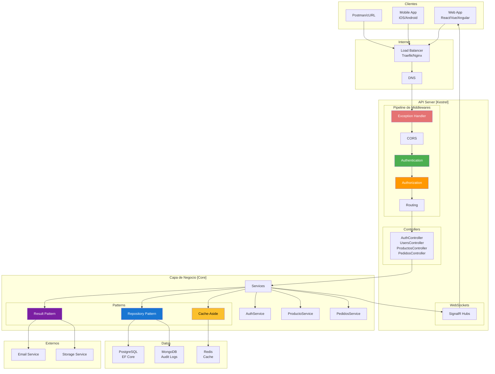
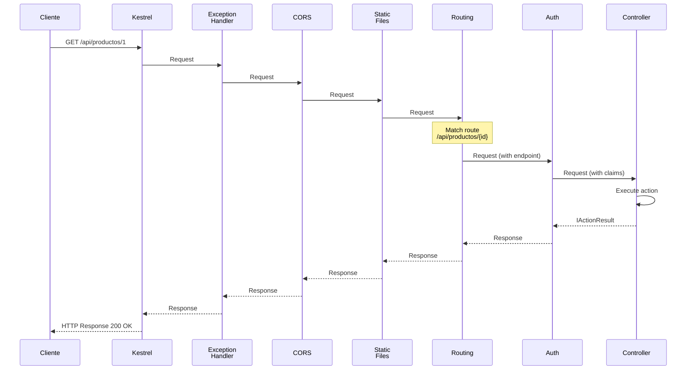
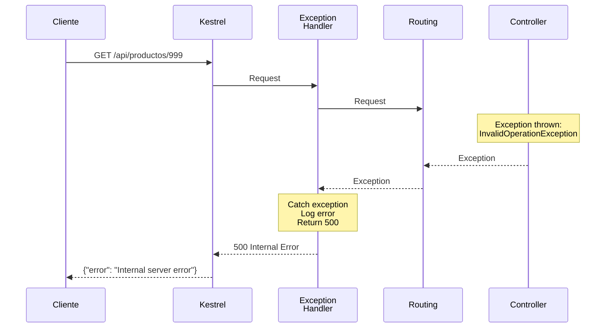
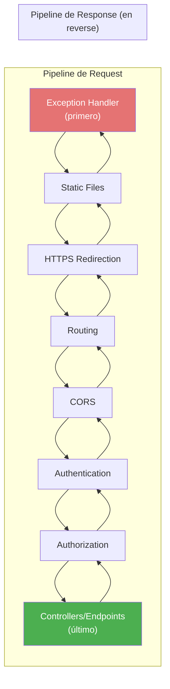
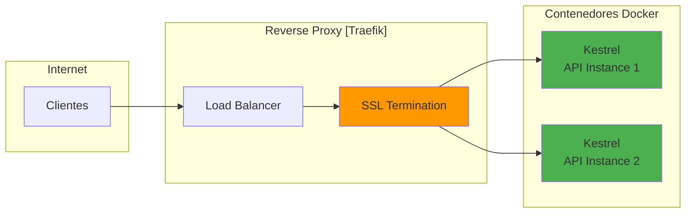
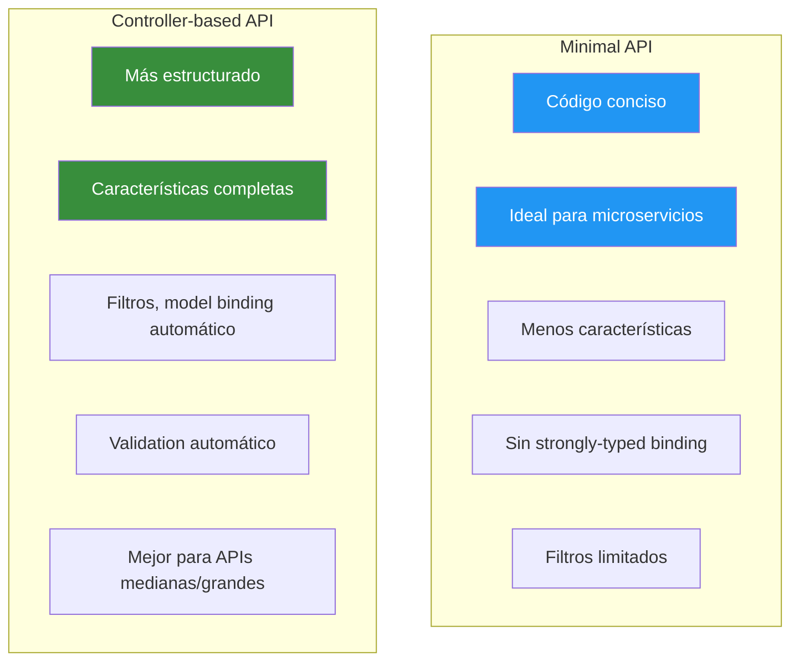
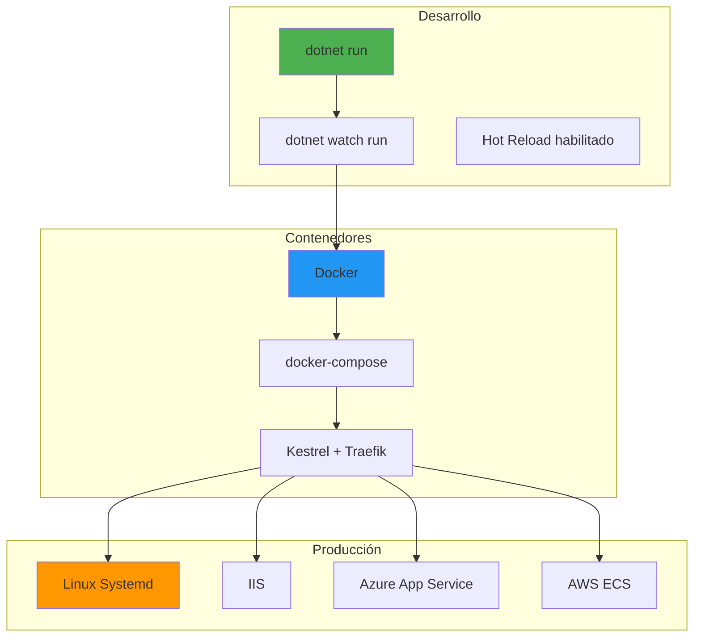

# 2. Arquitectura Pipeline HTTP

## Índice

[2. Arquitectura Global y Pipeline HTTP de ASP.NET Core](#2-arquitectura-global-y-pipeline-http-de-aspnet-core)
  - [2.1. Arquitectura Global del Sistema](#21-arquitectura-global-del-sistema)
  - [2.2. Pipeline HTTP de ASP.NET Core](#22-pipeline-http-de-aspnet-core)
  - [2.3. Middlewares: Orden y Funcionamiento](#23-middlewares-orden-y-funcionamiento)
  - [2.4. Kestrel como Servidor Web](#24-kestrel-como-servidor-web)
  - [2.5. Program.cs: Minimal API vs Controladores](#25-programcs-minimal-api-vs-controladores)
  - [2.6. Configuración de Hosting](#26-configuracin-de-hosting)
  - [2.7. Resumen y Buenas Prácticas](#27-resumen-y-buenas-prcticas)

---

## 2.1. Arquitectura Global del Sistema

Antes de entrar en los detalles del pipeline HTTP, es importante que tengas una visión clara de cómo se organiza el proyecto TiendaApi y cómo fluyen los datos a través de sus capas. Esta arquitectura por capas es un patrón probado que separa responsabilidades y facilita el mantenimiento y las pruebas del código.

### Componentes principales del sistema

El sistema TiendaApi está compuesto por varios componentes que trabajan juntos para procesar las peticiones de los clientes. Los controladores reciben las peticiones HTTP y delegan a los servicios de negocio. Los servicios contienen la lógica de aplicación y coordinan operaciones complejas. Los repositorios abstraen el acceso a datos, permitiendo cambiar entre PostgreSQL, MongoDB o cualquier otra base de datos sin afectar el código de negocio. La caché mejora el rendimiento almacenando resultados de operaciones costosas. Los WebSockets permiten comunicación bidireccional en tiempo real. Y los tests automatizados garantizan que todo funcione correctamente.

### Flujo de una petición típica

Cuando un cliente llama a la API para obtener un producto, la petición atraviesa varias capas antes de devolver la respuesta. El cliente envía una petición HTTP que llega al servidor Kestrel. Los middlewares procesan la petición en orden (exception handling, CORS, autenticación, etc.). El router determina qué controlador y acción debe ejecutarse. El controlador recibe la petición, valida los datos y llama al servicio correspondiente. El servicio ejecuta la lógica de negocio, consultando repositorios y caché según sea necesario. Finalmente, el resultado se mapea a un DTO y se devuelve como respuesta HTTP.

### Arquitectura detallada



### Tecnologías utilizadas en el proyecto

El proyecto TiendaApi utiliza un stack tecnológico moderno y bien probado. ASP.NET Core 8 proporciona el framework base con soporte para minimal APIs, controllers, y SignalR. Entity Framework Core actúa como ORM para PostgreSQL, gestionando las operaciones de base de datos de forma tipada y segura. MongoDB almacena datos de auditoría y logs que no requieren estructura relacional. Redis proporciona caché distribuido para mejorar el rendimiento. JWT Bearer maneja la autenticación stateless mediante tokens. SignalR habilita notificaciones en tiempo real a los clientes conectados. FluentValidation y Data Annotations proporcionan validación en múltiples capas. Polly gestiona la resiliencia con reintentos y circuit breaker.

---

## 2.2. Pipeline HTTP de ASP.NET Core

El pipeline HTTP es el corazón de ASP.NET Core. Es una secuencia de componentes (middlewares) que procesan cada petición HTTP en orden. Cada middleware puede examinar la petición, modificarla, pasarla al siguiente middleware, o incluso generar una respuesta directamente sin llegar a los controladores. Entender este pipeline es esencial para implementar funcionalidades transversales como logging, autenticación, manejo de errores y CORS.

### ¿Qué es un middleware?

Un middleware es un componente que se ejecuta en cada petición HTTP. Piensa en él como una tubería por donde pasa la petición: cada middleware puede inspeccionarla, modificarla, o decidir que la petición no debe continuar y devolver una respuesta directamente. Los middlewares se ejecutan en el orden en que están configurados, y cada uno decide si pasar la petición al siguiente middleware o cortocircuitar la cadena.

### Anatomía de un middleware

Un middleware en ASP.NET Core es simplemente un delegate que recibe el contexto de la petición y el siguiente middleware en la cadena. La estructura básica incluye tres partes: examinar la petición, opcionalmente modificarla, llamar al siguiente middleware, y opcionalmente examinar o modificar la respuesta antes de devolverla.

```csharp
// Middleware básico que mide el tiempo de ejecución
app.Use(async (context, next) =>
{
    // 1. Código antes de llamar a next (procesar request)
    var stopwatch = Stopwatch.StartNew();
    
    // 2. Llamar al siguiente middleware
    await next(context);
    
    // 3. Código después de next (procesar response)
    stopwatch.Stop();
    var elapsed = stopwatch.ElapsedMilliseconds;
    
    // Registrar tiempo solo para endpoints de API
    if (context.Request.Path.StartsWithSegments("/api"))
    {
        var logger = context.RequestServices.GetRequiredService<ILogger<TProgram>>();
        logger.LogInformation(
            "{Method} {Path} - {StatusCode} - {Elapsed}ms",
            context.Request.Method,
            context.Request.Path,
            context.Response.StatusCode,
            elapsed);
    }
});
```

### Middleware de extensión (patrón recomendado)

En lugar de escribir middleware inline, lo habitual es crear clases dedicadas que pueden configurarse mediante métodos de extensión:

```csharp
// TimingMiddleware.cs
public class TimingMiddleware
{
    private readonly RequestDelegate _next;
    private readonly ILogger<TimingMiddleware> _logger;

    public TimingMiddleware(
        RequestDelegate next,
        ILogger<TimingMiddleware> logger)
    {
        _next = next;
        _logger = logger;
    }

    public async Task InvokeAsync(HttpContext context)
    {
        var stopwatch = Stopwatch.StartNew();
        
        await _next(context);
        
        stopwatch.Stop();
        
        if (context.Request.Path.StartsWithSegments("/api"))
        {
            _logger.LogInformation(
                "{Method} {Path} responded {StatusCode} in {Elapsed}ms",
                context.Request.Method,
                context.Request.Path,
                context.Response.StatusCode,
                stopwatch.ElapsedMilliseconds);
        }
    }
}

// Extension method para facilitar el registro
public static class TimingMiddlewareExtensions
{
    public static IApplicationBuilder UseTiming(this IApplicationBuilder app)
    {
        return app.UseMiddleware<TimingMiddleware>();
    }
}

// Uso en Program.cs
app.UseTiming();
```

### Flujo del pipeline



### Pipeline con excepción



---

## 2.3. Middlewares: Orden y Funcionamiento

El orden de los middlewares en el pipeline es crítico. Un middleware configurado antes de la autenticación no tendrá acceso a la información del usuario, mientras que uno configurado después del routing no podrá influir en qué endpoint se ejecuta. A continuación se explica el orden recomendado y la función de cada middleware en el proyecto TiendaApi.

### Orden recomendado de middlewares

El orden de los middlewares debe seguir una lógica específica. Primero se configuran los middlewares que manejan excepciones, porque cualquier error debe capturarse lo antes posible. Luego van los middlewares de configuración del protocolo (HTTPS redirection). Los archivos estáticos van temprano porque son requests que no necesitan procesamiento adicional. El routing se configura antes de CORS si queremos que las opciones de CORS se manejen independientemente. La autenticación debe ir antes que la autorización. Finalmente, los endpoints (controladores, GraphQL, SignalR) van al final del pipeline.

### Middleware de manejo de excepciones

Este middleware debe ser el primero porque captura cualquier excepción que ocurra en cualquier parte del pipeline. Sin él, una excepción no capturada llegaría al cliente como un error 500 genérico y sin control.

```csharp
// Manejo de excepciones en desarrollo
if (app.Environment.IsDevelopment())
{
    app.UseDeveloperExceptionPage();
}

// Manejo de excepciones en producción
else
{
    app.UseExceptionHandler(errorApp =>
    {
        errorApp.Run(async context =>
        {
            context.Response.StatusCode = 500;
            context.Response.ContentType = "application/json";
            
            var error = context.Features.Get<IExceptionHandlerPathFeature>();
            
            var logger = context.RequestServices.GetRequiredService<ILogger<TProgram>>();
            logger.LogError(error.Error, "Unhandled exception");
            
            var response = new { error = "An unexpected error occurred" };
            
            await context.Response.WriteAsync(
                JsonSerializer.Serialize(response));
        });
    });
}
```

### Middleware de redirección HTTPS

En producción, todas las comunicaciones deben ser seguras. Este middleware redirige automáticamente las peticiones HTTP a HTTPS:

```csharp
// Forzar HTTPS en producción
app.UseHttpsRedirection();
```

### Middleware de archivos estáticos

Los archivos estáticos (HTML, CSS, JS, imágenes) no necesitan pasar por el pipeline completo. Este middleware los sirve directamente desde wwwroot:

```csharp
// Servir archivos estáticos desde wwwroot
app.UseStaticFiles();
```

### Middleware de routing

El middleware de routing examina la URL de la petición y determina qué endpoint debe ejecutarse:

```csharp
app.UseRouting();
```

Este middleware establece las propiedades `HttpContext.Request.RouteValues` que contienen los parámetros de la ruta (como `{id}` en `/api/productos/{id}`).

### Middleware de CORS

CORS (Cross-Origin Resource Sharing) controla qué dominios pueden acceder a tu API. Es esencial para APIs que serán consumidas por aplicaciones web o móviles:

```csharp
// Configurar CORS antes de authentication
app.UseCors("AllowSpecificOrigins");
```

### Middleware de autenticación

La autenticación valida las credenciales del usuario (típicamente un token JWT) y llena `HttpContext.User` con los claims del usuario:

```csharp
app.UseAuthentication();
```

### Middleware de autorización

La autorización verifica que el usuario autenticado tiene permisos para acceder al recurso solicitado:

```csharp
app.UseAuthorization();
```

### Configuración completa del pipeline

```csharp
var builder = WebApplication.CreateBuilder(args);

var app = builder.Build();

// === 1. Manejo de excepciones (PRIMERO) ===
if (app.Environment.IsDevelopment())
{
    app.UseDeveloperExceptionPage();
}
else
{
    app.UseExceptionHandler("/error");
    app.UseHsts(); // HTTP Strict Transport Security
}

// === 2. Archivos estáticos ===
app.UseStaticFiles();

// === 3. Redirección HTTPS ===
app.UseHttpsRedirection();

// === 4. Routing ===
app.UseRouting();

// === 5. CORS ===
app.UseCors("AllowAll"); // O política específica

// === 6. Autenticación ===
app.UseAuthentication();

// === 7. Autorización ===
app.UseAuthorization();

// === 8. Endpoints ===
app.MapControllers();           // REST API
app.MapGraphQL();               // GraphQL endpoint
app.MapHub<ProductoHub>("/ws/v1/productos");  // WebSockets

app.Run();
```

### Diagrama del orden de middlewares



### Errores comunes de orden

Un error frecuente es colocar UseAuthentication después de MapControllers. En este caso, los endpoints serán ejecutados antes de que el usuario sea autenticado, lo que significa que `[Authorize]` no funcionará correctamente porque el usuario aún no ha sido identificado cuando se decide si permitir o denegar el acceso al endpoint.

Otro error común es no usar UseRouting antes de los endpoints. Si configuras endpoints antes de especificar el routing, no funcionará el matching de rutas.

---

## 2.4. Kestrel como Servidor Web

Kestrel es el servidor web integrado en ASP.NET Core. Es ligero, rápido y multiplataforma, funcionando tanto en Windows como en Linux y macOS. En producción, típicamente se coloca detrás de un reverse proxy como Nginx o Traefik, pero para desarrollo y contenedores, Kestrel puede ser usado directamente.

### ¿Qué es Kestrel?

Kestrel es un servidor HTTP escrito en .NET que maneja las conexiones de red y traduce las peticiones HTTP en objetos que ASP.NET Core puede procesar. Es el equivalente a Node.js http server o Python WSGI, pero optimizado para .NET. Kestrel soporta HTTP/1.1 y HTTP/2, y puede servir millones de peticiones por segundo con los recursos adecuados.

### Configuración de Kestrel

Puedes personalizar el comportamiento de Kestrel en Program.cs o en un archivo de configuración dedicado:

```csharp
using Microsoft.AspNetCore.Server.Kestrel.Core;

var builder = WebApplication.CreateBuilder(args);

builder.WebHost.ConfigureKestrel(options =>
{
    // Configurar límites de tamaño de petición
    options.Limits.MaxRequestBodySize = 10 * 1024 * 1024; // 10 MB
    options.Limits.MaxRequestBufferSize = 10 * 1024 * 1024;
    
    // Configurar timeouts
    options.Limits.RequestHeadersTimeout = TimeSpan.FromSeconds(30);
    options.Limits.KeepAliveTimeout = TimeSpan.FromMinutes(#2);
    options.Limits.HeadersTimeout = TimeSpan.FromSeconds(30);
    
    // Configurar HTTP/2
    options.ListenLocalhost(5000, listenOptions =>
    {
        listenOptions.Protocols = HttpProtocols.Http1AndHttp2;
    });
    
    // Configurar HTTP/3 (experimental)
    options.ListenLocalhost(5001, listenOptions =>
    {
        listenOptions.Protocols = HttpProtocols.Http3;
        listenOptions.UseHttps();
    });
});

var app = builder.Build();
```

### Configuración mediante appsettings.json

```json
{
  "Kestrel": {
    "Endpoints": {
      "Http": {
        "Url": "http://0.0.0.0:5000"
      },
      "Https": {
        "Url": "https://0.0.0.0:5001",
        "Certificate": {
          "Path": "/etc/ssl/certs/cert.pem",
          "KeyPath": "/etc/ssl/private/key.pem"
        }
      }
    },
    "Limits": {
      "MaxRequestBodySize": 10485760,
      "KeepAliveTimeout": "00:02:00",
      "RequestHeadersTimeout": "00:00:30"
    }
  }
}
```

### Kestrel con Docker y Reverse Proxy

En producción, la arquitectura típica incluye Kestrel detrás de un reverse proxy. El reverse proxy (Traefik, Nginx) maneja SSL/TLS, balanceo de carga, y protección DDoS, mientras Kestrel se enfoca en procesar las peticiones de la aplicación.



```yaml
# docker-compose.prod.yml (extracto)
services:
  traefik:
    image: traefik:v3.0
    command:
      - "--providers.docker=true"
      - "--entrypoints.web.address=:80"
      - "--entrypoints.websecure.address=:443"
      - "--certificatesresolvers.myresolver.acme.tlschallenge=true"
      - "--certificatesresolvers.myresolver.acme.email=admin@tienda.com"
    ports:
      - "80:80"
      - "443:443"
    volumes:
      - /var/run/docker.sock:/var/run/docker.sock

  api:
    image: tiendaapi:latest
    labels:
      - "traefik.http.routers.api.rule=Host(localhost)"
      - "traefik.http.services.api.loadbalancer.server.port=80"
      - "traefik.http.routers.api.tls.certresolver=myresolver"
    expose:
      - "80"
```

### Ventajas de usar Kestrel

Kestrel ofrece varias ventajas sobre otros servidores web. Su integración nativa con ASP.NET Core significa que no hay fricción entre el servidor y el framework. El soporte para HTTP/2 y HTTP/3 proporciona rendimiento moderno con multiplexing de conexiones. La capacidad de ejecutarse multiplataforma permite desarrollo en cualquier sistema operativo. Y su ligereza lo hace ideal para contenedores Docker, donde cada milisegundo de startup cuenta.

---

## 2.5. Program.cs: Minimal API vs Controladores

ASP.NET Core ofrece dos estilos principales para crear APIs: Minimal APIs y Controller-based APIs. Minimal APIs son ideales para servicios pequeños y microservicios, mientras que Controller-based APIs proporcionan más características avanzadas como filtros, validación automática, y convenciones establecidas. El proyecto TiendaApi utiliza Controller-based APIs por su estructura y características avanzadas.

### ¿Qué es Minimal API?

Minimal API es un enfoque simplificado introducido en .NET 6 que permite crear endpoints con código mínimo. En lugar de crear clases Controller con atributos, defines los endpoints directamente con lambdas o métodos:

```csharp
var builder = WebApplication.CreateBuilder(args);
var app = builder.Build();

app.MapGet("/api/productos", () => Results.Ok(new { productos = new[] { "A", "B" } }));

app.MapGet("/api/productos/{id}", (int id) => 
{
    if (id == 0) return Results.NotFound();
    return Results.Ok(new { id, nombre = "Producto" });
});

app.MapPost("/api/productos", (ProductoDto dto) =>
{
    return Results.Created($"/api/productos/{dto.Id}", dto);
});

app.Run();
```

### ¿Qué es Controller-based API?

Controller-based API utiliza clases que heredan de ControllerBase o Controller. Este enfoque proporciona más estructura, características avanzadas, y es más familiar para desarrolladores que vienen de versiones anteriores de ASP.NET:

```csharp
[ApiController]
[Route("api/[controller]")]
public class ProductosController : ControllerBase
{
    private readonly IProductoService _service;
    
    public ProductosController(IProductoService service)
    {
        _service = service;
    }
    
    [HttpGet]
    public async Task<IActionResult> GetAll()
    {
        var productos = await _service.GetAllAsync();
        return Ok(productos);
    }
    
    [HttpGet("{id}")]
    public async Task<IActionResult> GetById(long id)
    {
        var resultado = await _service.GetByIdAsync(id);
        return resultado.Match(Ok, NotFound);
    }
    
    [HttpPost]
    public async Task<IActionResult> Create([FromBody] ProductoDto dto)
    {
        var resultado = await _service.CreateAsync(dto);
        return resultado.Match(
            created => CreatedAtAction(nameof(GetById), new { id = created.Id }, created),
            error => BadRequest(error)
        );
    }
}
```

### Comparación entre ambos enfoques



### ¿Por qué TiendaApi usa Controladores?

El proyecto TiendaApi utiliza Controller-based API por varias razones importantes. Los controladores permiten usar filtros para lógica transversal como logging, validación de modelo, y manejo de errores en un solo lugar. El modelo de binding automático con `[FromBody]`, `[FromQuery]`, etc., reduce código repetitivo. La integración con Swagger/OpenAPI genera documentación automáticamente más completa. Las convenciones de enrutamiento y nombrado facilitan el mantenimiento cuando el equipo crece. Y características como versionado de API, OData, y GraphQL están más maduras para controladores.

### Program.cs del proyecto TiendaApi

```csharp
using TiendaApi.Apis;
using TiendaApi.Apis.Configuration;

var builder = WebApplication.CreateBuilder(args);

// Configuración de servicios
builder.Services.AddControllers()
    .AddJsonOptions(options =>
    {
        options.JsonSerializerOptions.PropertyNamingPolicy = JsonNamingPolicy.CamelCase;
        options.JsonSerializerOptions.WriteIndented = builder.Environment.IsDevelopment();
    });

// Configuración de Swagger
builder.Services.AddEndpointsApiExplorer();
builder.Services.AddSwaggerGen(options =>
{
    options.SwaggerDoc("v1", new() { Title = "TiendaApi", Version = "v1" });
    options.AddSecurityDefinition("Bearer", new()
    {
        Type = Microsoft.OpenApi.Models.SecuritySchemeType.Http,
        Scheme = "bearer",
        BearerFormat = "JWT",
        Description = "JWT Authorization header using the Bearer scheme."
    });
    options.AddSecurityRequirement(new()
    {
        {
            new()
            {
                Reference = new() { Type = Microsoft.OpenApi.Models.ReferenceType.SecurityScheme, Id = "Bearer" }
            },
            Array.Empty<string>()
        }
    });
});

// Registro de servicios de aplicación
builder.Services
    .ConfigureJwt(builder.Configuration)
    .ConfigureCors(builder.Configuration)
    .ConfigureServices(builder.Configuration)
    .ConfigureData(builder.Configuration);

// Configuración del pipeline
var app = builder.Build();

// En desarrollo, usar Swagger
if (app.Environment.IsDevelopment())
{
    app.UseSwagger();
    app.UseSwaggerUI();
}

// Configurar pipeline HTTP
app.UseExceptionHandler("/error");
app.UseHttpsRedirection();
app.UseStaticFiles();
app.UseRouting();
app.UseCors("AllowAll");
app.UseAuthentication();
app.UseAuthorization();

app.MapControllers();
app.MapGraphQL();
app.MapHub<ProductoHub>("/ws/v1/productos");
app.MapHub<PedidoHub>("/ws/v1/pedidos");

app.Run();
```

### Hybrid Approach: Endpoints con Carter

Carter es una librería que combina lo mejor de ambos mundos: la concisión de Minimal API con las características de Controller-based API:

```csharp
// Usando Carter para endpoints modulares
public class ProductosModule : ICarterModule
{
    public void AddRoutes(IEndpointRouteBuilder app)
    {
        app.MapGet("/api/productos", async (IProductoService service) =>
        {
            var productos = await service.GetAllAsync();
            return Results.Ok(productos);
        });
        
        app.MapGet("/api/productos/{id}", async (long id, IProductoService service) =>
        {
            var result = await service.GetByIdAsync(id);
            return result.Match(Results.Ok, Results.NotFound);
        });
    }
}
```

---

## 2.6. Configuración de Hosting

La configuración de hosting determina cómo se ejecuta y despliega la aplicación. ASP.NET Core puede ejecutarse de forma self-contained, con el runtime instalado, o dentro de contenedores Docker. Cada opción tiene sus ventajas según el caso de uso.

### Modos de despliegue

**Framework-dependent deployment** requiere que el runtime de .NET esté instalado en el servidor de destino. Es la opción más común porque produce ejecutables más pequeños y permite actualizaciones del runtime sin recompilar la aplicación.

**Self-contained deployment** incluye el runtime dentro del ejecutable, resultando en archivos más grandes pero sin dependencias externas. Ideal para entornos donde no puedes instalar software adicional.

**Trimmer** analiza el código y elimina las partes del runtime y librerías que no se utilizan, reduciendo significativamente el tamaño de la aplicación self-contained.

### Configuración de IIS

Para desplegar en IIS, necesitas el módulo ASP.NET Core:

```xml
<!-- web.config -->
<?xml version="1.0" encoding="utf-8"?>
<configuration>
  <location path="." inheritInChildApplications="false">
    <system.webServer>
      <handlers>
        <add name="aspNetCore" 
             path="*" 
             verb="*" 
             modules="AspNetCoreModuleV2" 
             resourceType="Unspecified"/>
      </handlers>
      <aspNetCore processPath="dotnet" 
                  arguments=".\TiendaApi.Apis.dll" 
                  stdoutLogEnabled="false" 
                  stdoutLogFile=".\logs\stdout" 
                  hostingModel="inprocess"/>
    </system.webServer>
  </location>
</configuration>
```

### Configuración de Linux Systemd

Para ejecutar como servicio en Linux:

```ini
# /etc/systemd/system/tiendaapi.service
[Unit]
Description=TiendaApi ASP.NET Core Application
After=network.target

[Service]
WorkingDirectory=/var/www/tiendaapi
ExecStart=/usr/bin/dotnet /var/www/tiendaapi/TiendaApi.Apis.dll
Restart=always
RestartSec=10
KillSignal=SIGINT
SyslogIdentifier=tiendaapi
User=www-data
Environment=DOTNET_ROOT=/usr/share/dotnet
Environment=ASPNETCORE_ENVIRONMENT=Production
Environment=ConnectionStrings__PostgreSQL=Host=localhost;Database=TiendaDb

[Install]
WantedBy=multi-user.target
```

### Configuración de health checks

Los health checks permiten a orquestadores como Docker o Kubernetes verificar que la aplicación está funcionando correctamente:

```csharp
// En Program.cs
builder.Services.AddHealthChecks()
    .AddNpgSql(
        builder.Configuration.GetConnectionString("PostgreSQL")!,
        name: "postgresql",
        tags: new[] { "ready", "database" })
    .AddRedis(
        builder.Configuration.GetConnectionString("Redis")!,
        name: "redis",
        tags: new[] { "cache", "ready" });

// Configurar endpoint de health check
app.MapHealthChecks("/health");

// Health check UI (solo en desarrollo)
if (app.Environment.IsDevelopment())
{
    app.UseHealthChecksUI(options =>
    {
        options.UIPath = "/health-ui";
    });
}
```

### Resumen de arquitectura



---

## 2.7. Resumen y Buenas Prácticas

A lo largo de este documento hemos explorado la arquitectura global del sistema TiendaApi y el pipeline HTTP de ASP.NET Core. Estos conocimientos son fundamentales para desarrollar APIs robustas y mantenibles.

### Puntos clave del módulo

El pipeline HTTP es una cadena de middlewares que procesan cada petición en orden. El orden de los middlewares es crítico: Exception Handler primero, Authentication antes que Authorization, y Controllers al final. Kestrel es el servidor web integrado, ligero y multiplataforma. La arquitectura por capas separa responsabilidades y facilita el mantenimiento. Los controladores proporcionan más características que Minimal API, incluyendo filtros y binding automático.

### Buenas prácticas

```mermaid
flowchart TB
    subgraph "Pipeline"
        A1["Exception Handler primero"]
        A2["Authentication antes de Authorization"]
        A3["Endpoints al final"]
    end
    
    subgraph "Middleware"
        B1["Crear clases en vez de lambdas inline"]
        B2["Usar métodos de extensión para registro"]
        B3["Mantener middlewares simples y focados"]
    end
    
    subgraph "Configuración"
        C1["Usar appsettings por entorno"]
        C2["Nunca exponer secrets en código"]
        C3["Configurar health checks"]
    end
    
    subgraph "Rendimiento"
        D1["Archivos estáticos temprano"]
        D2["CORS después de routing"]
        D3["Kestrel detrás de reverse proxy en producción"]
    end
    
    A1 --> A2 --> A3
    B1 --> B2 --> B3
    C1 --> C2 --> C3
    D1 --> D2 --> D3
```



### Siguientes pasos

Con la comprensión del pipeline HTTP, el siguiente paso natural es aprender sobre inyección de dependencias, que es el mecanismo que ASP.NET Core usa para proporcionar las dependencias (servicios, repositorios, etc.) a tus controladores y servicios. Este patrón es fundamental para escribir código testable y mantenible.

### Recursos adicionales

- Documentación de ASP.NET Core: https://docs.microsoft.com/aspnet/core
- Kestrel: https://docs.microsoft.com/aspnet/core/fundamentals/servers/kestrel
- Middleware: https://docs.microsoft.com/aspnet/core/fundamentals/middleware/
