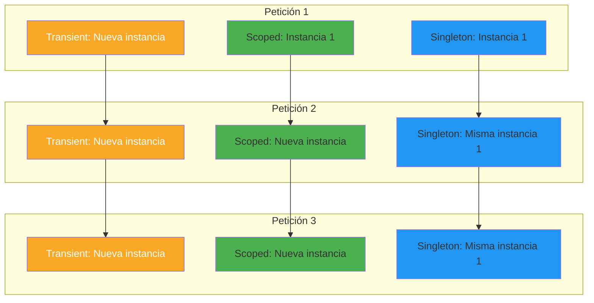
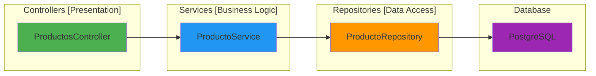
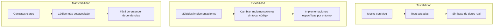

# 3. Inyección de Dependencias y Constructores Primarios

## Índice

[3. Inyección de Dependencias y Constructores Primarios](#3-inyección-de-dependencias-y-constructores-primarios)
  - [3.1. Qué es la Inyección de Dependencias](#31-qué-es-la-inyección-de-dependencias)
  - [3.2. Tiempos de Vida de Servicios](#32-tiempos-de-vida-de-servicios)
  - [3.3. Constructores Primarios de C# 14](#33-constructores-primarios-de-c-14)
  - [3.4. Registro de Servicios en Program.cs](#34-registro-de-servicios-en-programcs)
  - [3.5. Estructura del Proyecto: Controllers, Services, Repositories](#35-estructura-del-proyecto-controllers-services-repositories)
  - [3.6. Interfaces y Abstracciones](#36-interfaces-y-abstracciones)
  - [3.7. Resumen y Buenas Prácticas](#37-resumen-y-buenas-prácticas)

---

## 3.1. Qué es la Inyección de Dependencias

La inyección de dependencias es un patrón de diseño donde un objeto no crea sus propias dependencias, sino que las recibe desde el exterior. En lugar de que un servicio cree sus propios repositorios, el framework le proporciona las instancias necesarias. Esto desacopla el código, facilita el testing (puedes pasar mocks en lugar de implementaciones reales), y permite cambiar implementaciones sin modificar el código consumidor.

### El problema sin inyección de dependencias

Imagina que tienes un servicio de productos que necesita un repositorio, un logger, y un servicio de caché. Sin DI, el código se vería así: el servicio crearía sus dependencias internamente usando `new`, lo que acopla el código a implementaciones concretas, hace imposible cambiar la implementación sin modificar el servicio, y dificulta el testing porque no puedes substituir las dependencias.

```csharp
// PROBLEMA: Acoplamiento fuerte
public class ProductoService
{
    private readonly ProductoRepository _repository;
    private readonly Logger<ProductoService> _logger;
    private readonly RedisCacheService _cache;
    
    public ProductoService()
    {
        // El servicio crea sus propias dependencias
        _repository = new ProductoRepository("connection string");
        _logger = new Logger<ProductoService>();
        _cache = new RedisCacheService("redis connection");
    }
    
    public async Task<Producto> GetByIdAsync(long id)
    {
        _logger.LogInformation("Buscando producto {Id}", id);
        
        // Si necesitas cambiar la implementación, debes modificar esta clase
        var producto = await _repository.FindByIdAsync(id);
        return producto;
    }
}
```

### La solución con inyección de dependencias

Con DI, el servicio declara sus dependencias en el constructor, y el framework se encarga de proporcionar las instancias. El servicio no sabe ni le importa cómo se crean las dependencias, solo sabe que las recibirá. Esto permite fácilmente substituir implementaciones, pasar mocks en tests, y mantener el código desacoplado.

```csharp
// SOLUCIÓN: Dependencias inyectadas
public class ProductoService
{
    private readonly IProductoRepository _repository;
    private readonly ILogger<ProductoService> _logger;
    private readonly ICacheService _cache;
    
    // Las dependencias se reciben en el constructor
    public ProductoService(
        IProductoRepository repository,
        ILogger<ProductoService> logger,
        ICacheService cache)
    {
        _repository = repository;
        _logger = logger;
        _cache = cache;
    }
    
    public async Task<Producto> GetByIdAsync(long id)
    {
        _logger.LogInformation("Buscando producto {Id}", id);
        
        // El servicio usa las dependencias sin saber cómo fueron creadas
        var cached = await _cache.GetAsync($"producto_{id}");
        if (cached != null) return cached;
        
        var producto = await _repository.FindByIdAsync(id);
        await _cache.SetAsync($"producto_{id}", producto);
        
        return producto;
    }
}
```

### Beneficios de la inyección de dependencias

```mermaid
flowchart TB
    subgraph "Desacoplamiento"
        A1["Servicios no conocen implementaciones"]
        A2["Cambios localizados"]
        A3["Interfaces definen contratos"]
    end
    
    subgraph "Testabilidad"
        B1["Mocks/Stubs fácilmente"]
        B2["Tests aisladas"]
        B3["Sin base de datos real"]
    end
    
    subgraph "Mantenibilidad"
        C1["Código más limpio"]
        C2["Fácil de entender"]
        C3["Cambios seguros"]
    end
    
    subgraph "Flexibilidad"
        D1["Implementaciones intercambiables"]
        D2["Multiple implementations"]
        D3["Configurable por entorno"]
    end
    
    A1 --> A2 --> A3
    B1 --> B2 --> B3
    C1 --> C2 --> C3
    D1 --> D2 --> D3
```



---

## 3.2. Tiempos de Vida de Servicios

En ASP.NET Core, cada servicio registrado en el contenedor DI tiene un tiempo de vida que determina cuándo se crea y cuándo se destruye la instancia. Elegir el tiempo de vida correcto es crucial para el funcionamiento correcto de tu aplicación y para evitar bugs sutiles relacionados con el estado compartido.

### Los tres tiempos de vida

**Transient** crea una nueva instancia cada vez que el servicio es solicitado. Es ideal para servicios ligeros, sin estado, que deben ser independientes entre peticiones. Si solicitas el servicio dos veces en la misma petición, получишь dos instancias diferentes.

**Scoped** crea una nueva instancia una vez por petición HTTP. Todos los servicios Scoped dentro de la misma petición comparten la misma instancia. Es el tiempo de vida más común para servicios de negocio, DbContext, y cualquier cosa que deba ser específica de la petición actual.

**Singleton** crea una única instancia que se reutiliza durante toda la vida de la aplicación. Todos los usuarios y todas las peticiones comparten la misma instancia. Solo debe usarse para servicios verdaderamente globales como configuración, logging, o servicios de caché en memoria.

### Comparación visual de tiempos de vida



### Registro de servicios con diferentes tiempos de vida

```csharp
using Microsoft.Extensions.DependencyInjection;

var builder = WebApplication.CreateBuilder(args);

// === TRANSIENT ===
// Creado cada vez que se solicita
// Útil para servicios ligeros, sin estado
builder.Services.AddTransient<IEmailService, EmailService>();
builder.Services.AddTransient<IDtoValidator<ProductoDto>, ProductoValidator>();

// === SCOPED ===
// Creado una vez por petición HTTP
// El más común para servicios de negocio
builder.Services.AddScoped<IProductoService, ProductoService>();
builder.Services.AddScoped<IProductoRepository, ProductoRepository>();
builder.Services.AddScoped<ICategoriaService, CategoriaService>();

// DbContext SIEMPRE debe ser Scoped
builder.Services.AddScoped<TiendaDbContext>();

// === SINGLETON ===
// Creado una vez y reutilizado
// Para servicios verdaderamente globales
builder.Services.AddSingleton<ILoggerFactory, LoggerFactory>();
builder.Services.AddSingleton<IConfiguration>(builder.Configuration);

// Cache en memoria puede ser singleton
builder.Services.AddMemoryCache();

// Redis connection manager es singleton
builder.Services.AddSingleton<IConnectionMultiplexer>(sp =>
{
    var configuration = sp.GetRequiredService<IConfiguration>();
    var connectionString = configuration.GetConnectionString("Redis");
    return ConnectionMultiplexer.Connect(connectionString);
});

var app = builder.Build();
```

### Ejemplo práctico con tiempos de vida

```csharp
// Logger<T> es un factory que crea loggers.
// El LoggerFactory es singleton, pero cada ILogger<T> esTransient.
public class ProductoService
{
    private readonly IProductoRepository _repository;
    private readonly ILogger<ProductoService> _logger;
    private readonly ICacheService _cache;

    // IProductoRepository es Scoped: una instancia por request
    // ILogger<ProductoService> es Transient: nuevo cada vez
    // ICacheService podría ser Singleton (Redis) o Scoped (MemoryCache)
    public ProductoService(
        IProductoRepository repository,
        ILogger<ProductoService> logger,
        ICacheService cache)
    {
        _repository = repository;
        _logger = logger;
        _cache = cache;
    }
}
```

### Errores comunes con tiempos de vida

**Error 1: DbContext como Singleton**

Si registras DbContext como Singleton, múltiples peticiones compartirán la misma instancia, causando condiciones de carrera y errores de concurrencia:

```csharp
// ❌ INCORRECTO - DbContext no es thread-safe
builder.Services.AddSingleton<TiendaDbContext>();

// ✅ CORRECTO - DbContext debe ser Scoped
builder.Services.AddScoped<TiendaDbContext>();
```

**Error 2: Capturar Scope en Singleton**

Un servicio Singleton no debe inyectar servicios Scoped porque vivirían más tiempo que el scope que los creó:

```csharp
// ❌ INCORRECTO - Scoped dentro de Singleton
public class SingletonService
{
    private readonly TiendaDbContext _context;
    
    public SingletonService(TiendaDbContext context)  // Error!
    {
        _context = context;
    }
}

builder.Services.AddSingleton<SingletonService>();
builder.Services.AddScoped<TiendaDbContext>();

// ✅ CORRECTO - Usar IServiceScopeFactory
public class SingletonService
{
    private readonly IServiceScopeFactory _scopeFactory;
    
    public SingletonService(IServiceScopeFactory scopeFactory)
    {
        _scopeFactory = scopeFactory;
    }
    
    public void DoWork()
    {
        using var scope = _scopeFactory.CreateScope();
        var context = scope.ServiceProvider.GetRequiredService<TiendaDbContext>();
        // Usar context...
    }
}
```

---

## 3.3. Constructores Primarios de C# 14

Los constructores primarios son una característica de C# 14 (disponible en preview en .NET 8) que elimina el boilerplate de los constructores tradicionales. En lugar de declarar campos privados y asignarlos en el constructor, las dependencias se declaran directamente en la firma de la clase. Esto hace el código más conciso, legible y menos propenso a errores.

### Constructor tradicional vs Constructor primario

En versiones anteriores de C#, debías declarar cada dependencia como campo privado y asignarla en el constructor. Esto era repetitivo y propenso a errores si olvidabas asignar algún campo. Los constructores primarios eliminan esta repetición declarando los parámetros directamente en la firma de la clase.

```csharp
// Constructor tradicional (C# 12 y anteriores)
public class ProductoService : IProductoService
{
    private readonly IProductoRepository _repository;
    private readonly ILogger<ProductoService> _logger;
    private readonly ICacheService _cache;
    private readonly IMapper _mapper;

    public ProductoService(
        IProductoRepository repository,
        ILogger<ProductoService> logger,
        ICacheService cache,
        IMapper mapper)
    {
        _repository = repository;
        _logger = logger;
        _cache = cache;
        _mapper = mapper;
    }
    
    public async Task<ProductoDto> GetByIdAsync(long id)
    {
        _logger.LogInformation("Buscando producto {Id}", id);
        var producto = await _repository.FindByIdAsync(id);
        return _mapper.Map<ProductoDto>(producto);
    }
}
```

```csharp
// Constructor primario (C# 14)
public class ProductoService(
    IProductoRepository repository,
    ILogger<ProductoService> logger,
    ICacheService cache,
    IMapper mapper) : IProductoService
{
    private readonly IProductoRepository _repository = repository;
    private readonly ILogger<ProductoService> _logger = logger;
    private readonly ICacheService _cache = cache;
    private readonly IMapper _mapper = mapper;

    public async Task<ProductoDto> GetByIdAsync(long id)
    {
        _logger.LogInformation("Buscando producto {Id}", id);
        var producto = await _repository.FindByIdAsync(id);
        return _mapper.Map<ProductoDto>(producto);
    }
}
```

### Versión aún más concisa

En C# 14, los parámetros del constructor primario son automáticamente accesibles como campos readonly, sin necesidad de declararlos explícitamente:

```csharp
// Constructor primario ultra-conciso (C# 14)
public class ProductoService(
    IProductoRepository repository,
    ILogger<ProductoService> logger,
    ICacheService cache,
    IMapper mapper) : IProductoService
{
    // Los parámetros son automáticamente campos con el mismo nombre
    // No necesitas declararlos como private readonly

    public async Task<ProductoDto> GetByIdAsync(long id)
    {
        logger.LogInformation("Buscando producto {Id}", id);
        var producto = await repository.FindByIdAsync(id);
        return mapper.Map<ProductoDto>(producto);
    }
}
```

### Constructores primarios en controladores

Los controladores también se benefician de los constructores primarios, haciendo el código más limpio:

```csharp
// Constructor tradicional
public class ProductosController : ControllerBase
{
    private readonly IProductoService _productoService;
    private readonly ICategoriaService _categoriaService;
    private readonly ILogger<ProductosController> _logger;

    public ProductosController(
        IProductoService productoService,
        ICategoriaService categoriaService,
        ILogger<ProductosController> logger)
    {
        _productoService = productoService;
        _categoriaService = categoriaService;
        _logger = logger;
    }

    [HttpGet]
    public async Task<IActionResult> GetAll()
    {
        _logger.LogInformation("Obteniendo todos los productos");
        var productos = await _productoService.GetAllAsync();
        return Ok(productos);
    }
}
```

```csharp
// Constructor primario
public class ProductosController(
    IProductoService productoService,
    ICategoriaService categoriaService,
    ILogger<ProductosController> logger) : ControllerBase
{
    [HttpGet]
    public async Task<IActionResult> GetAll()
    {
        logger.LogInformation("Obteniendo todos los productos");
        var productos = await productoService.GetAllAsync();
        return Ok(productos);
    }
}
```

### Herencia con constructores primarios

Cuando una clase hereda de otra con constructor primario, debes llamar explícitamente al constructor base:

```csharp
public abstract class ServiceBase
{
    protected readonly ILogger _logger;

    protected ServiceBase(ILogger logger)
    {
        _logger = logger;
    }
}

// La clase derivada debe llamar al constructor base
public class ProductoService(
    IProductoRepository repository,
    ILogger<ProductoService> logger) : ServiceBase(logger)
{
    private readonly IProductoRepository _repository = repository;
    
    public async Task<Producto> GetByIdAsync(long id)
    {
        _logger.LogInformation("Buscando producto {Id}", id);
        return await _repository.FindByIdAsync(id);
    }
}
```

### Constructores primarios con propiedades adicionales

Si necesitas propiedades adicionales que no son dependencias, puedes declararlas normalmente:

```csharp
public class ProductoService(
    IProductoRepository repository,
    ILogger<ProductoService> logger,
    ICacheService cache) : IProductoService
{
    // Dependencia del constructor primario
    private readonly IProductoRepository _repository = repository;
    
    // Propiedad adicional (configuración)
    private readonly bool _useCache;
    
    // Inicialización en el cuerpo del constructor
    public ProductoService(
        IProductoRepository repository,
        ILogger<ProductoService> logger,
        ICacheService cache,
        bool useCache) : this(repository, logger, cache)
    {
        _useCache = useCache;
    }
    
    public async Task<Producto> GetByIdAsync(long id)
    {
        logger.LogInformation("Buscando producto {Id}", id);
        
        if (_useCache)
        {
            var cached = await cache.GetAsync($"producto_{id}");
            if (cached != null) return cached;
        }
        
        var producto = await _repository.FindByIdAsync(id);
        return producto;
    }
}
```

---

## 3.4. Registro de Servicios en Program.cs

El registro de servicios en el contenedor DI es donde defines qué implementación usar para cada interfaz. Este registro típicamente se hace en Program.cs o en métodos de extensión dedicados. Un registro bien organizado facilita el mantenimiento y la comprensión de las dependencias del proyecto.

### Registro básico de servicios

```csharp
var builder = WebApplication.CreateBuilder(args);

// Registrar servicios uno por uno
builder.Services.AddScoped<IProductoRepository, ProductoRepository>();
builder.Services.AddScoped<ICategoriaRepository, CategoriaRepository>();
builder.Services.AddScoped<IPedidoRepository, PedidoRepository>();

builder.Services.AddScoped<IProductoService, ProductoService>();
builder.Services.AddScoped<ICategoriaService, CategoriaService>();
builder.Services.AddScoped<IPedidosService, PedidosService>();

builder.Services.AddScoped<IUserRepository, UserRepository>();
builder.Services.AddScoped<IAuthService, AuthService>();
```

### Métodos de extensión para organizar el registro

En lugar de acumular todo en Program.cs, es recomendable crear métodos de extensión que agrupen el registro por módulo funcional. Esto hace el código más mantenible y permite ver de un vistazo todos los servicios registrados.

```csharp
// TiendaApi.Core/Configuration/ServiceConfiguration.cs
using Microsoft.Extensions.DependencyInjection;

namespace TiendaApi.Core.Configuration;

public static class ServiceConfiguration
{
    public static IServiceCollection ConfigureServices(
        this IServiceCollection services,
        IConfiguration configuration)
    {
        // Servicios de repositorios
        services.AddScoped<IProductoRepository, ProductoRepository>();
        services.AddScoped<ICategoriaRepository, CategoriaRepository>();
        services.AddScoped<IPedidoRepository, PedidoRepository>();
        services.AddScoped<IUserRepository, UserRepository>();

        // Servicios de negocio
        services.AddScoped<IProductoService, ProductoService>();
        services.AddScoped<ICategoriaService, CategoriaService>();
        services.AddScoped<IPedidosService, PedidosService>();
        services.AddScoped<IAuthService, AuthService>();
        services.AddScoped<IUserService, UserService>();

        // Servicios de infraestructura
        services.AddScoped<IStorageService, FileSystemStorageService>();
        services.AddSingleton<ICacheService, RedisCacheService>();
        
        return services;
    }

    public static IServiceCollection ConfigureData(
        this IServiceCollection services,
        IConfiguration configuration)
    {
        // DbContext
        var connectionString = configuration.GetConnectionString("PostgreSQL");
        services.AddDbContext<TiendaDbContext>(options =>
        {
            options.UseNpgsql(connectionString);
        });

        // MongoDB
        var mongoConnection = configuration.GetConnectionString("MongoDB");
        services.AddSingleton<IMongoClient>(sp =>
        {
            return new MongoClient(mongoConnection);
        });

        // Redis
        var redisConnection = configuration.GetConnectionString("Redis");
        services.AddSingleton<IConnectionMultiplexer>(sp =>
        {
            return ConnectionMultiplexer.Connect(redisConnection);
        });

        return services;
    }
}
```

```csharp
// Program.cs
using TiendaApi.Core.Configuration;

var builder = WebApplication.CreateBuilder(args);

// Registro organizado por módulos
builder.Services
    .ConfigureServices(builder.Configuration)
    .ConfigureData(builder.Configuration)
    .ConfigureJwt(builder.Configuration)
    .ConfigureCors(builder.Configuration);

var app = builder.Build();
```

### Registro condicional

A veces quieres registrar diferentes implementaciones según el entorno:

```csharp
// Registrar diferentes servicios según el entorno
if (builder.Environment.IsDevelopment())
{
    // En desarrollo, usar servicios que facilitan el debugging
    builder.Services.AddScoped<IEmailService, MemoryEmailService>();
    builder.Services.AddSingleton<ICacheService, MemoryCacheService>();
}
else
{
    // En producción, usar servicios de producción
    builder.Services.AddScoped<IEmailService, MailKitEmailService>();
    builder.Services.AddSingleton<ICacheService, RedisCacheService>();
}
```

### Registro con fábricas

Cuando la creación del servicio es compleja, puedes usar una fábrica:

```csharp
// Registro con fábrica personalizada
builder.Services.AddScoped<IMyService>(sp =>
{
    var logger = sp.GetRequiredService<ILogger<MyService>>();
    var repository = sp.GetRequiredService<IRepository>();
    var config = sp.GetRequiredService<IOptions<MyConfig>>();
    
    return new MyService(logger, repository, config.Value);
});
```

### Open Generics

Puedes registrar interfaces genéricas y sus implementaciones:

```csharp
// Registro de handler genérico
builder.Services.AddScoped(typeof(IRequestHandler<,>), typeof(MediatRHandler<,>));

// Registro de servicio genérico
builder.Services.AddScoped(typeof(IRepository<>), typeof(Repository<>));
```

### Desregistrar servicios (para testing)

```csharp
// En tests, puedes substituir servicios
builder.Services.AddScoped<IProductoRepository, MockProductoRepository>();
```

---

## 3.5. Estructura del Proyecto: Controllers, Services, Repositories

Una arquitectura bien organizada separa las responsabilidades en capas claramente definidas. Esta separación facilita el mantenimiento, permite que diferentes desarrolladores trabajen en diferentes partes del código sin conflictos, y hace que los tests sean más fáciles de escribir y mantener.

### Estructura de carpetas recomendada

```
TiendaApi.Core/
├── Interfaces/
│   ├── IServices/
│   │   ├── IAuthService.cs
│   │   ├── IProductoService.cs
│   │   └── IPedidosService.cs
│   ├── IRepositories/
│   │   ├── IProductoRepository.cs
│   │   └── IUserRepository.cs
│   └── IInfrastructure/
│       ├── IEmailService.cs
│       └── IStorageService.cs
│
├── Services/
│   ├── Auth/
│   │   ├── AuthService.cs
│   │   ├── JwtService.cs
│   │   └── JwtTokenExtractor.cs
│   ├── Productos/
│   │   ├── ProductoService.cs
│   │   └── IProductoService.cs
│   └── Pedidos/
│       ├── PedidosService.cs
│       └── IPedidosService.cs
│
├── Repositories/
│   ├── ProductoRepository.cs
│   └── UserRepository.cs
│
├── Models/
│   ├── User.cs
│   ├── Producto.cs
│   └── Pedido.cs
│
└── Dtos/
    ├── ProductoDto.cs
    └── PedidoDto.cs
```

### Flujo de dependencias entre capas



### Responsabilidades de cada capa

La capa de Controladores es responsable de recibir las peticiones HTTP, validar el modelo de entrada, llamar a los servicios apropiados, mapear los resultados a DTOs, y devolver las respuestas HTTP correctas. Los controladores no deben contener lógica de negocio, solo lógica de presentación.

La capa de Servicios contiene toda la lógica de negocio de la aplicación. Valida las reglas de negocio, coordina operaciones entre múltiples repositorios, aplica reglas de dominio, y usa el patrón Result para devolver éxito o fracaso. Los servicios dependen de interfaces de repositorios, no de implementaciones concretas.

La capa de Repositorios abstrae el acceso a datos. Proporciona métodos para CRUD (Create, Read, Update, Delete) y consultas específicas. Cada repositorio trabaja con una entidad específica y su DbContext correspondiente.

---

## 3.6. Interfaces y Abstracciones

Las interfaces definen contratos que las implementaciones deben cumplir. Usar interfaces permite fácilmente substituir implementaciones, facilita el testing con mocks, y desacopla el código de dependencias concretas.

### Definición de interfaces

```csharp
// IProductoService.cs - Contrato para el servicio de productos
using CSharpFunctionalExtensions;

namespace TiendaApi.Core.Interfaces.IServices;

public interface IProductoService
{
    Task<Result<ProductoDto, DomainError>> GetByIdAsync(long id);
    Task<Result<List<ProductoDto>, DomainError>> GetAllAsync();
    Task<Result<List<ProductoDto>, DomainError>> GetByCategoriaAsync(long categoriaId);
    Task<Result<ProductoDto, DomainError>> CreateAsync(ProductoCreateDto dto);
    Task<Result<ProductoDto, DomainError>> UpdateAsync(long id, ProductoUpdateDto dto);
    Task<UnitResult<DomainError>> DeleteAsync(long id);
}
```

```csharp
// IProductoRepository.cs - Contrato para el repositorio de productos
namespace TiendaApi.Core.Interfaces.IRepositories;

public interface IProductoRepository
{
    Task<Producto?> FindByIdAsync(long id);
    Task<List<Producto>> GetAllAsync();
    Task<List<Producto>> GetByCategoriaIdAsync(long categoriaId);
    Task<bool> ExistsByNombreAsync(string nombre);
    Task<Producto> SaveAsync(Producto producto);
    Task<Producto> UpdateAsync(Producto producto);
    Task<bool> DeleteAsync(long id);
}
```

### Implementación de interfaces

```csharp
// ProductoService.cs - Implementación del servicio
public class ProductoService(
    IProductoRepository repository,
    IMapper mapper,
    IValidator<ProductoCreateDto> createValidator,
    IValidator<ProductoUpdateDto> updateValidator,
    ILogger<ProductoService> logger) : IProductoService
{
    public async Task<Result<ProductoDto, DomainError>> GetByIdAsync(long id)
    {
        logger.LogInformation("Buscando producto {Id}", id);
        
        var producto = await repository.FindByIdAsync(id);
        if (producto == null)
            return Result.Failure<ProductoDto, DomainError>(
                DomainError.NotFound($"Producto {id} no encontrado"));
        
        return Result.Success<ProductoDto, DomainError>(
            mapper.Map<ProductoDto>(producto));
    }
    
    // Resto de métodos...
}
```

```csharp
// ProductoRepository.cs - Implementación del repositorio
public class ProductoRepository(
    TiendaDbContext context,
    ILogger<ProductoRepository> logger) : IProductoRepository
{
    private readonly TiendaDbContext _context = context;
    private readonly ILogger<ProductoRepository> _logger = logger;
    
    public async Task<Producto?> FindByIdAsync(long id)
    {
        _logger.LogDebug("Buscando producto por id {Id}", id);
        return await _context.Productos.FindAsync(id);
    }
    
    public async Task<List<Producto>> GetAllAsync()
    {
        _logger.LogDebug("Obteniendo todos los productos");
        return await _context.Productos.ToListAsync();
    }
    
    // Resto de métodos...
}
```

### Inyección de dependencias

```csharp
// Registro de interfaces e implementaciones
builder.Services.AddScoped<IProductoRepository, ProductoRepository>();
builder.Services.AddScoped<IProductoService, ProductoService>();
```

### Beneficios de usar interfaces



---

## 3.7. Resumen y Buenas Prácticas

A lo largo de este documento hemos explorado la inyección de dependencias, los tiempos de vida de servicios, los constructores primarios de C#, y cómo estructurar el proyecto con interfaces y abstracciones.

### Puntos clave del módulo

La inyección de dependencias desacopla el código y facilita el testing. Los tres tiempos de vida son Transient (nueva instancia cada vez), Scoped (una instancia por petición), y Singleton (una instancia global). Los constructores primarios de C# 14 eliminan el boilerplate de los constructores tradicionales. Las interfaces definen contratos que permiten facilmente substituir implementaciones. El registro organizado de servicios en métodos de extensión mejora la mantenibilidad.

### Buenas prácticas

```mermaid
flowchart TB
    subgraph "Tiempos de vida"
        A1["DbContext → Scoped"]
        A2["Servicios de negocio → Scoped"]
        A3["Logger → Transient"]
        A4["Cache/Config → Singleton"]
    end
    
    subgraph "Constructores"
        B1["Usar constructores primarios (C# 14)"]
        B2["Mantener dependencias explícitas"]
        B3["Solo dependencias necesarias"]
    end
    
    subgraph "Registro"
        C1["Agrupar en métodos de extensión"]
        C2["Usar interfaces para todo"]
        C3["Documentar decisiones de lifetime"]
    end
    
    subgraph "Testing"
        D1["Mocks para todas las dependencias"]
        D2["Tests unitarios rápidos"]
        D3["Coverage > 80%"]
    end
    
    A1 --> A2 --> A3 --> A4
    B1 --> B2 --> B3
    C1 --> C2 --> C3
    D1 --> D2 --> D3
```



### Errores comunes a evitar

No uses Singleton para DbContext porque causará condiciones de carrera. No mezcles tiempos de vida sin entender las consecuencias. No crees dependencias que no necesitas solo porque están disponibles. No uses clases concretas cuando una interfaz es suficiente.

### Siguientes pasos

Con la comprensión de la inyección de dependencias, el siguiente paso es aprender sobre controladores REST, donde aplicarás estos conocimientos para crear endpoints HTTP bien estructurados y testables.

### Recursos adicionales

- Documentación de DI en ASP.NET Core: https://docs.microsoft.com/aspnet/core/fundamentals/dependency-injection
- Tiempos de vida: https://docs.microsoft.com/aspnet/core/fundamentals/dependency-injection#service-lifetimes
- Constructores primarios: https://docs.microsoft.com/dotnet/csharp/whats-new/csharp-14#primary-constructors
