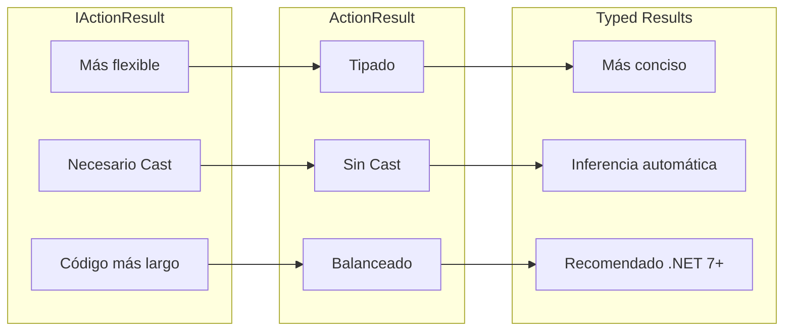

# 4. Controladores REST

## Índice

[4. Controladores REST](#4-controladores-rest)
  - [4.1. Anatomía de un Controlador](#41-anatomía-de-un-controlador)
  - [4.2. Routing por Atributos vs Convenciones](#42-routing-por-atributos-vs-convenciones)
  - [4.3. Verbos HTTP y Métodos de Acción](#43-verbos-http-y-métodos-de-acción)
  - [4.4. Model Binding: De la Petición al Objeto](#44-model-binding-de-la-petición-al-objeto)
  - [4.5. IActionResult vs ActionResult<T> vs Typed Results](#45-iactionresult-vs-actionresultt-vs-typed-results)
  - [4.6. Helpers de Respuesta](#46-helpers-de-respuesta)
  - [4.7. Headers, Status Codes y Content Negotiation](#47-headers-status-codes-y-content-negotiation)
  - [4.8. Filters en Controladores](#48-filters-en-controladores)
  - [4.9. Resumen y Buenas Prácticas](#49-resumen-y-buenas-prácticas)

---

## 4.1. Anatomía de un Controlador

Un controlador es una clase que hereda de ControllerBase (para APIs sin vistas) o Controller (para APIs con vistas MVC). En el proyecto TiendaApi usamos exclusivamente ControllerBase porque no necesitamos views, solo JSON APIs. Los controladores usan atributos para definir el routing, los verbos HTTP aceptados, y cómo bindear los parámetros de la petición.

### Estructura básica de un controlador

Un controlador típico tiene tres partes principales: la declaración de la clase con atributos de routing, los servicios inyectados vía constructor primario, y los métodos de acción que manejan las peticiones HTTP. El controlador no contiene lógica de negocio, solo coordina la llamada a servicios y formatea la respuesta.

```csharp
using Microsoft.AspNetCore.Mvc;
using TiendaApi.Core.Interfaces.IServices;

namespace TiendaApi.Apis.Controllers;

[ApiController]
[Route("api/[controller]")]
public class ProductosController(
    IProductoService productoService,
    ILogger<ProductosController> logger) : ControllerBase
{
    // Los servicios se injectan vía constructor primario
    private readonly IProductoService _productoService = productoService;
    private readonly ILogger<ProductosController> _logger = logger;

    // Los métodos de acción manejan las peticiones HTTP
    [HttpGet]
    public async Task<IActionResult> GetAll()
    {
        _logger.LogInformation("GET /api/productos - Obteniendo todos");
        
        var resultado = await _productoService.GetAllAsync();
        
        return resultado.Match(
            productos => Ok(productos),
            error => StatusCode(GetStatusCode(error), new { error.Message })
        );
    }
    
    private static int GetStatusCode(DomainError error)
    {
        return error.Type switch
        {
            ErrorType.NotFound => 404,
            ErrorType.Validation => 400,
            ErrorType.Unauthorized => 401,
            ErrorType.Forbidden => 403,
            ErrorType.Conflict => 409,
            _ => 500
        };
    }
}
```

### Partes del controlador

La primera parte es la declaración de la clase con sus atributos. El atributo `[ApiController]` activa comportamientos convenientes como la validación automática de modelos y el binding de parámetros especializado. El atributo `[Route("api/[controller]")] define la ruta base del controlador, donde `[controller]` se reemplaza por el nombre de la clase sin el sufijo "Controller".

La segunda parte son los servicios injectados en el constructor primario. Estos servicios contienen la lógica de negocio y son la única dependencia que un controlador debe tener.

La tercera parte son los métodos de acción marcados con atributos de verbo HTTP como `[HttpGet]`, `[HttpPost]`, `[HttpPut]`, `[HttpDelete]`. Cada método maneja un tipo específico de operación.

### Diferencia entre Controller y ControllerBase

ControllerBase es la clase base para APIs y proporciona todas las funcionalidades necesarias para responder a peticiones HTTP. Controller hereda de ControllerBase y añade soporte para Views (MVC), lo cual no necesitas para una API REST.

```csharp
// ✅ CORRECTO para API REST
[ApiController]
[Route("api/[controller]")]
public class ProductosController : ControllerBase
{
    // Solo métodos relacionados con API
}

// ❌ NO NECESARIO para API REST (pero funciona)
[ApiController]
[Route("api/[controller]")]
public class ProductosController : Controller
{
    // Hereda funcionalidad extra que no usas
}
```

---

## 4.2. Routing por Atributos vs Convenciones

ASP.NET Core soporta dos estilos de routing: routing por atributos (usando atributos en los métodos) y routing por convenciones (definiendo rutas en Program.cs). El proyecto TiendaApi usa routing por atributos porque es más explícito, fácil de entender, y se integra mejor con la documentación automática de Swagger.

### Routing por atributos

Con routing por atributos, cada método de acción tiene un atributo que define su ruta relativa. Esto hace el código auto-documentado porque la ruta está justo encima del método que la maneja.

```csharp
[ApiController]
[Route("api/[controller]")]
public class ProductosController : ControllerBase
{
    // GET /api/productos
    [HttpGet]
    public async Task<IActionResult> GetAll() { }
    
    // GET /api/productos/5
    [HttpGet("{id:long}")]
    public async Task<IActionResult> GetById(long id) { }
    
    // GET /api/productos/categoria/5
    [HttpGet("categoria/{categoriaId:long}")]
    public async Task<IActionResult> GetByCategoria(long categoriaId) { }
    
    // POST /api/productos
    [HttpPost]
    public async Task<IActionResult> Create([FromBody] ProductoDto dto) { }
    
    // PUT /api/productos/5
    [HttpPut("{id:long}")]
    public async Task<IActionResult> Update(long id, [FromBody] ProductoDto dto) { }
    
    // DELETE /api/productos/5
    [HttpDelete("{id:long}")]
    public async Task<IActionResult> Delete(long id) { }
}
```

### Templates de ruta

Los templates de ruta permiten definir parámetros, restricciones, y valores opcionales. Los parámetros se definen entre llaves `{}` y pueden tener restricciones para validar el formato.

```csharp
[ApiController]
[Route("api/[controller]")]
public class PedidosController : ControllerBase
{
    // Parámetro simple
    [HttpGet("{id:long}")]
    public async Task<IActionResult> GetById(long id) { }
    
    // Múltiples parámetros
    [HttpGet("cliente/{clienteId}/estado/{estado}")]
    public async Task<IActionResult> GetByClienteYEstado(long clienteId, string estado) { }
    
    // Parámetro opcional (con ?)
    [HttpGet("buscar")]
    public async Task<IActionResult> Search([FromQuery] string q, [FromQuery] int? page) { }
    
    // Ruta catch-all (captura segmentos múltiples)
    [HttpGet("archivos/{**path}")]
    public async Task<IActionResult> GetFile(string path) { }
}
```

### Restricciones de ruta

Las restricciones de ruta indican al framework qué tipos de valores acepta cada parámetro. Si un valor no cumple la restricción, el framework devuelve 404 en lugar de llamar al método.

```csharp
[ApiController]
[Route("api/[controller]")]
public class ProductosController : ControllerBase
{
    // long: solo números enteros
    [HttpGet("{id:long}")]
    public async Task<IActionResult> GetById(long id) { }
    
    // int: alias para long
    [HttpGet("int/{id:int}")]
    public async Task<IActionResult> GetByIntId(int id) { }
    
    // guid: UUIDs
    [HttpGet("uuid/{id:guid}")]
    public async Task<IActionResult> GetByGuid(Guid id) { }
    
    // min(length): mínimo de caracteres
    [HttpGet("buscar/{termino:minlength(3)}")]
    public async Task<IActionResult> Search(string termino) { }
    
    // range(min, max): rango numérico
    [HttpGet("precio/{precio:range(0, 1000000)}")]
    public async Task<IActionResult> GetByPrice(decimal precio) { }
    
    // regex: expresión regular
    [HttpGet("codigo/{codigo:regex(^[A-Z]{{3}}-\d{{4}}$)}")]
    public async Task<IActionResult> GetByCodigo(string codigo) { }
}
```

### Áreas (opcional)

Las áreas organizan controladores en grupos lógicos, útil para APIs grandes:

```csharp
// En Admin/ProductsController.cs
[Area("admin")]
[ApiController]
[Route("api/[area]/[controller]")]
public class ProductsController : ControllerBase
{
    // Ruta: /api/admin/products
}

// Registro de áreas
builder.Services.AddMvc()
    .AddApplicationPart(typeof(ProductsController).Assembly);
```

---

## 4.3. Verbos HTTP y Métodos de Acción

Los verbos HTTP indican la acción que se quiere realizar sobre un recurso. GET para obtener, POST para crear, PUT para reemplazar, PATCH para modificar parcialmente, y DELETE para eliminar. Usar el verbo correcto es fundamental para crear APIs RESTful correctas y predecibles.

### Verbos HTTP soportados

ASP.NET Core proporciona atributos para cada verbo HTTP estándar. Cada atributo corresponde a un método de acción que será llamado solo para ese verbo específico.

```csharp
[ApiController]
[Route("api/[controller]")]
public class ProductosController : ControllerBase
{
    // GET: Obtener recursos
    [HttpGet]
    public async Task<IActionResult> GetAll() { }
    
    [HttpGet("{id:long}")]
    public async Task<IActionResult> GetById(long id) { }
    
    // POST: Crear nuevo recurso
    [HttpPost]
    public async Task<IActionResult> Create([FromBody] ProductoCreateDto dto) { }
    
    // PUT: Reemplazar recurso completo
    [HttpPut("{id:long}")]
    public async Task<IActionResult> Put(long id, [FromBody] ProductoUpdateDto dto) { }
    
    // PATCH: Modificar parcialmente
    [HttpPatch("{id:long}")]
    public async Task<IActionResult> Patch(long id, [FromBody] JsonPatchDocument<ProductoUpdateDto> patch) { }
    
    // DELETE: Eliminar recurso
    [HttpDelete("{id:long}")]
    public async Task<IActionResult> Delete(long id) { }
}
```

### Cuándo usar cada verbo

GET debe usarse para obtener información sin modificar el estado del servidor. Debe ser idempotente (llamarlo múltiples veces tiene el mismo efecto que llamarlo una vez) y seguro (no modifica el recurso). Devuelve 200 OK con el recurso, 404 si no existe, o 400/500 para errores.

POST debe usarse para crear nuevos recursos. El servidor decide la URL del nuevo recurso (típicamente devolviendo Location header). No es idempotente (llamar dos veces crea dos recursos). Devuelve 201 Created con la ubicación del nuevo recurso, 400 para datos inválidos, o 409 si hay conflicto.

PUT debe usarse para reemplazar un recurso existente completamente. Es idempotente (llamar múltiples veces tiene el mismo efecto). Si el recurso existe, se reemplaza. Si no existe, puede crear uno nuevo (dependiendo de implementación). Devuelve 200/204 con el recurso actualizado.

PATCH debe usarse para modificar parcialmente un recurso. Envía un documento con los campos a cambiar. Es idempotente si se implementa correctamente. Devuelve 200/204 con el recurso modificado.

DELETE debe usarse para eliminar recursos. Es idempotente (eliminar algo que ya no existe devuelve éxito). Devuelve 204 No Content si se eliminó, 404 si no existía.

### Códigos de estado HTTP

```csharp
[ApiController]
[Route("api/[controller]")]
public class ProductosController : ControllerBase
{
    [HttpGet]
    public async Task<IActionResult> GetAll()
    {
        var productos = await _service.GetAllAsync();
        return Ok(productos);                    // 200 OK
    }
    
    [HttpGet("{id:long}")]
    public async Task<IActionResult> GetById(long id)
    {
        var resultado = await _service.GetByIdAsync(id);
        return resultado.Match(
            producto => Ok(producto),             // 200 OK
            error => error.Type switch
            {
                ErrorType.NotFound => NotFound(new { error.Message }),  // 404
                _ => BadRequest(new { error.Message })                  // 400
            });
    }
    
    [HttpPost]
    public async Task<IActionResult> Create([FromBody] ProductoCreateDto dto)
    {
        var resultado = await _service.CreateAsync(dto);
        return resultado.Match(
            producto => CreatedAtAction(          // 201 Created
                nameof(GetById),
                new { id = producto.Id },
                producto),
            error => error.Type switch
            {
                ErrorType.Validation => BadRequest(new { error.Message }),  // 400
                ErrorType.Conflict => Conflict(new { error.Message }),       // 409
                _ => StatusCode(500, new { error.Message })                  // 500
            });
    }
    
    [HttpDelete("{id:long}")]
    public async Task<IActionResult> Delete(long id)
    {
        var resultado = await _service.DeleteAsync(id);
        
        if (resultado.IsSuccess)
            return NoContent();                   // 204 No Content
        
        return NotFound();                        // 404
    }
}
```

### Tabla de códigos de estado comunes

| Código | Nombre | Uso |
|--------|--------|-----|
| 200 | OK | Petición exitosa, respuesta en body |
| 201 | Created | Recurso creado exitosamente |
| 204 | No Content | Petición exitosa, sin respuesta |
| 400 | Bad Request | Datos de entrada inválidos |
| 401 | Unauthorized | Autenticación requerida |
| 403 | Forbidden | Autenticado pero sin permisos |
| 404 | Not Found | Recurso no existe |
| 409 | Conflict | Conflicto con el estado actual |
| 422 | Unprocessable Entity | Datos válidos pero reglas de negocio fallan |
| 429 | Too Many Requests | Rate limiting |
| 500 | Internal Server Error | Error inesperado |

---

## 4.4. Model Binding: De la Petición al Objeto

El model binding es el proceso mediante el cual ASP.NET Core convierte los datos de la petición HTTP (JSON en el body, query parameters, route parameters, headers) en objetos .NET que puedes usar en tus controladores. Entender cómo funciona el binding es esencial para recibir datos correctamente desde los clientes.

### Fuentes de datos para binding

El binding puede tomar datos de cinco fuentes diferentes, en este orden de precedencia: 1) Formularios (from form), 2) Route values (de la URL), 3) Query strings (parámetros en la URL), 4) Headers, 5) Body (JSON/XML).

```csharp
[ApiController]
[Route("api/[controller]")]
public class ProductosController : ControllerBase
{
    // De la ruta: /api/productos/5
    [HttpGet("{id:long}")]
    public async Task<IActionResult> GetById(long id)
    {
        // id viene del template de ruta {id:long}
        var producto = await _service.GetByIdAsync(id);
        return Ok(producto);
    }
    
    // Del query string: /api/productos?categoria=electronica&pagina=1
    [HttpGet]
    public async Task<IActionResult> GetAll(
        [FromQuery] string categoria, 
        [FromQuery] int pagina = 1)
    {
        // categoria y pagina vienen de la query string
        var productos = await _service.GetByCategoriaAsync(categoria, pagina);
        return Ok(productos);
    }
    
    // Del body JSON: {"nombre": "Laptop", "precio": 999.99}
    [HttpPost]
    public async Task<IActionResult> Create([FromBody] ProductoCreateDto dto)
    {
        // dto viene del body de la petición
        var resultado = await _service.CreateAsync(dto);
        return Ok(resultado);
    }
    
    // De la ruta Y del body
    [HttpPut("{id:long}")]
    public async Task<IActionResult> Update(
        long id,                          // De la ruta
        [FromBody] ProductoUpdateDto dto) // Del body
    {
        var resultado = await _service.UpdateAsync(id, dto);
        return Ok(resultado);
    }
    
    // De headers
    [HttpGet("exportar")]
    public async Task<IActionResult> Exportar([FromHeader(Name = "Accept-Language")] string language)
    {
        // language viene del header Accept-Language
        var bytes = await _service.ExportarAsync(language);
        return File(bytes, "application/pdf");
    }
    
    // De formulario (multipart/form-data para uploads)
    [HttpPost("upload")]
    public async Task<IActionResult> Upload([FromForm] IFormFile archivo)
    {
        // archivo viene de un formulario multipart
        await _storage.SaveAsync(archivo);
        return Ok();
    }
}
```

### Binding de DTOs complejos

Cuando el body de la petición contiene JSON anidado, el binder automáticamente mapea las propiedades del JSON a las propiedades del DTO, siempre que los nombres coincidan (usando camelCase por convención).

```csharp
// DTO para crear un pedido
public class PedidoCreateDto
{
    public long ClienteId { get; set; }
    public DireccionDto DireccionEnvio { get; set; } = new();
    public List<PedidoItemDto> Items { get; set; } = new();
    public string? Notas { get; set; }
}

public class DireccionDto
{
    public string Calle { get; set; } = string.Empty;
    public string Ciudad { get; set; } = string.Empty;
    public string CodigoPostal { get; set; } = string.Empty;
    public string Pais { get; set; } = string.Empty;
}

public class PedidoItemDto
{
    public long ProductoId { get; set; }
    public int Cantidad { get; set; }
}
```

```json
// JSON que el cliente envía
{
  "clienteId": 123,
  "direccionEnvio": {
    "calle": "Calle Principal 123",
    "ciudad": "Madrid",
    "codigoPostal": "28001",
    "pais": "España"
  },
  "items": [
    { "productoId": 1, "cantidad": 2 },
    { "productoId": 5, "cantidad": 1 }
  ],
  "notas": "Entregar después de las 18:00"
}
```

### Personalizar el binding

A veces necesitas personalizar cómo se bindean los datos. Puedes usar el atributo `[FromQuery]` para forzar binding desde query string, `[FromRoute]` para forzar desde ruta, o `[FromBody]` para forzar desde el body.

```csharp
[ApiController]
[Route("api/[controller]")]
public class ReportesController : ControllerBase
{
    // Forzar desde query string aunque haya body
    [HttpGet("buscar")]
    public IActionResult Buscar([FromQuery] string termino)
    {
        return Ok(_service.Buscar(termino));
    }
    
    // Forzar desde ruta
    [HttpGet("cliente/{clienteId}/pedidos")]
    public IActionResult GetPedidos([FromRoute] long clienteId, [FromQuery] DateTime? desde)
    {
        return Ok(_service.GetPedidos(clienteId, desde));
    }
}
```

### Validación automática de modelos

Cuando usas `[ApiController]`, ASP.NET Core automáticamente valida los Data Annotations del modelo. Si la validación falla, devuelve 400 Bad Request con los errores sin que tengas que escribir código adicional.

```csharp
public class ProductoCreateDto
{
    [Required(ErrorMessage = "El nombre es obligatorio")]
    [StringLength(200, MinimumLength = 3, ErrorMessage = "El nombre debe tener entre 3 y 200 caracteres")]
    public string Nombre { get; set; } = string.Empty;
    
    [Required(ErrorMessage = "El precio es obligatorio")]
    [Range(0.01, 1000000, ErrorMessage = "El precio debe ser mayor a 0")]
    public decimal Precio { get; set; }
    
    [Required]
    public long CategoriaId { get; set; }
    
    public string? Descripcion { get; set; }
}

[HttpPost]
public async Task<IActionResult> Create([FromBody] ProductoCreateDto dto)
{
    // Si dto es null o las anotaciones fallan,
    // ASP.NET Core devuelve automáticamente 400 Bad Request
    // con los errores de validación
    var resultado = await _service.CreateAsync(dto);
    return Ok(resultado);
}
```

```json
// Respuesta cuando la validación falla
// HTTP 400 Bad Request
{
  "errors": {
    "Nombre": ["El nombre es obligatorio"],
    "Precio": ["El precio debe ser mayor a 0"]
  }
}
```

---

## 4.5. IActionResult vs ActionResult<T> vs Typed Results

ASP.NET Core ofrece varias formas de devolver respuestas desde los controladores. IActionResult es el tipo base más flexible, ActionResult<T> combina flexibilidad con tipado fuerte, y Typed Results (introducido en .NET 7) ofrece la sintaxis más concisa para respuestas tipadas.

### IActionResult (el tradicional)

IActionResult es una interfaz que representa cualquier resultado de acción. Es útil cuando necesitas devolver diferentes tipos de respuestas condicionalmente o cuando trabajas con código legacy.

```csharp
[HttpGet("{id:long}")]
public async Task<IActionResult> GetById(long id)
{
    var producto = await _service.GetByIdAsync(id);
    
    if (producto == null)
        return NotFound(new { message = $"Producto {id} no encontrado" });
    
    return Ok(producto);  // IActionResult
}
```

### ActionResult<T> (mezcla de tipos)

ActionResult<T> combina IActionResult con un tipo específico, permitiéndote devolver tanto resultados tipados como errores. Es ideal cuando la respuesta exitosa siempre tiene el mismo tipo.

```csharp
[HttpGet("{id:long}")]
public async Task<ActionResult<ProductoDto>> GetById(long id)
{
    var resultado = await _service.GetByIdAsync(id);
    
    return resultado.Match(
        producto => Ok(producto),  // ActionResult<ProductoDto>
        error => NotFound(new { error.Message })  // ActionResult<ProductoDto>
    );
}

[HttpGet]
public async Task<ActionResult<List<ProductoDto>>> GetAll()
{
    var productos = await _service.GetAllAsync();
    return Ok(productos);  // ActionResult<List<ProductoDto>>
}
```

### Typed Results (más conciso, .NET 7+)

Los Typed Results proporcionan métodos de extensión strongly-typed como Ok<T>(value), NotFound<T>(value), etc. Esto hace el código más limpio y permite inferencia de tipos.

```csharp
[ApiController]
[Route("api/[controller]")]
public class ProductosController : ControllerBase
{
    [HttpGet("{id:long}")]
    public async Task<ActionResult<ProductoDto>> GetById(long id)
    {
        var resultado = await _service.GetByIdAsync(id);
        
        return resultado.Match(
            producto => Ok(producto),
            error => NotFound(new { error.Message }));
    }
    
    [HttpGet]
    public async Task<ActionResult<List<ProductoDto>>> GetAll()
    {
        var productos = await _service.GetAllAsync();
        return Ok(productos);
    }
    
    [HttpPost]
    public async Task<ActionResult<ProductoDto>> Create([FromBody] ProductoCreateDto dto)
    {
        var resultado = await _service.CreateAsync(dto);
        
        return resultado.Match(
            producto => CreatedAtAction(
                nameof(GetById),
                new { id = producto.Id },
                producto),
            error => BadRequest(new { error.Message }));
    }
}
```

### Comparación de sintaxis



### Cuándo usar cada uno

Usa IActionResult cuando trabajes con código legacy o cuando necesites máxima flexibilidad para devolver tipos muy diferentes. Usa ActionResult<T> cuando quieras tipado fuerte pero flexibilidad para devolver errores. Usa Typed Results cuando puedas, porque es la sintaxis más limpia y moderna.

---

## 4.6. Helpers de Respuesta

ASP.NET Core proporciona métodos helper para devolver respuestas comunes. Estos métodos crean automáticamente el IActionResult apropiado con el código de estado y formato correctos.

### Métodos helper disponibles

```csharp
[ApiController]
[Route("api/[controller]")]
public class ProductosController : ControllerBase
{
    private readonly IProductoService _service;

    public ProductosController(IProductoService service)
    {
        _service = service;
    }

    // 200 OK - Respuesta exitosa
    [HttpGet]
    public async Task<ActionResult<List<ProductoDto>>> GetAll()
    {
        var productos = await _service.GetAllAsync();
        return Ok(productos);  // 200 con el objeto
    }
    
    // 201 Created - Recurso creado
    [HttpPost]
    public async Task<ActionResult<ProductoDto>> Create([FromBody] ProductoCreateDto dto)
    {
        var producto = await _service.CreateAsync(dto);
        return CreatedAtAction(
            nameof(GetById),
            new { id = producto.Id },
            producto);  // 201 con Location header
    }
    
    // 204 No Content - Sin contenido que devolver
    [HttpDelete("{id:long}")]
    public async Task<ActionResult> Delete(long id)
    {
        await _service.DeleteAsync(id);
        return NoContent();  // 204 sin body
    }
    
    // 400 Bad Request - Error del cliente
    [HttpPost]
    public async Task<ActionResult<ProductoDto>> CreateWithValidation([FromBody] ProductoCreateDto dto)
    {
        if (string.IsNullOrEmpty(dto.Nombre))
            return BadRequest(new { error = "El nombre es obligatorio" });
            
        var producto = await _service.CreateAsync(dto);
        return CreatedAtAction(nameof(GetById), new { id = producto.Id }, producto);
    }
    
    // 404 Not Found - Recurso no existe
    [HttpGet("{id:long}")]
    public async Task<ActionResult<ProductoDto>> GetById(long id)
    {
        var producto = await _service.GetByIdAsync(id);
        if (producto == null)
            return NotFound(new { error = $"Producto {id} no encontrado" });
            
        return Ok(producto);
    }
    
    // 401 Unauthorized - No autenticado
    [HttpGet("admin")]
    public async Task<ActionResult<string>> AdminOnly()
    {
        if (!User.IsInRole("Admin"))
            return Unauthorized(new { error = "Debes iniciar sesión" });
            
        return Ok("Datos sensibles");
    }
    
    // 403 Forbidden - Autenticado pero sin permisos
    [HttpDelete("{id:long}")]
    public async Task<ActionResult> DeleteWithPermission(long id)
    {
        if (!User.HasPermission("Producto.Delete"))
            return StatusCode(403, new { error = "No tienes permiso para eliminar" });
            
        await _service.DeleteAsync(id);
        return NoContent();
    }
    
    // 422 Unprocessable Entity - Reglas de negocio
    [HttpPost]
    public async Task<ActionResult<ProductoDto>> CreateWithBusiness([FromBody] ProductoCreateDto dto)
    {
        var resultado = await _service.CreateAsync(dto);
        
        return resultado.Match(
            producto => CreatedAtAction(nameof(GetById), new { id = producto.Id }, producto),
            error => error.Type switch
            {
                ErrorType.BusinessRule => UnprocessableEntity(new { error.Message }),
                ErrorType.Conflict => Conflict(new { error.Message }),
                _ => BadRequest(new { error.Message })
            });
    }
}
```

### CreatedAtAction y CreatedAtRoute

CreatedAtAction es especialmente útil para devolver 201 Created con un header Location que apunta al recurso creado. El cliente puede usar esta URL para obtener el recurso recién creado.

```csharp
[HttpPost]
public async Task<ActionResult<ProductoDto>> Create([FromBody] ProductoCreateDto dto)
{
    var producto = await _service.CreateAsync(dto);
    
    // Genera: Location: /api/productos/123
    return CreatedAtAction(
        actionName: nameof(GetById),
        routeValues: new { id = producto.Id },
        value: producto);
}
```

### Redirect y RedirectToAction

Para respuestas que redirigen a otras URLs:

```csharp
[HttpGet]
public IActionResult OldEndpoint()
{
    // Redirigir permanentemente (301)
    return RedirectToAction("NewEndpoint");
}

[HttpGet("new")]
public IActionResult NewEndpoint()
{
    return Ok("Nueva ubicación");
}

[HttpPost("create-redirect")]
public async Task<IActionResult> CreateAndRedirect([FromBody] ProductoCreateDto dto)
{
    var producto = await _service.CreateAsync(dto);
    
    // Redirigir a la página de detalle
    return RedirectToAction(nameof(GetById), new { id = producto.Id });
}
```

### File responses

Para descargar archivos:

```csharp
[HttpGet("exportar")]
public async Task<IActionResult> Exportar()
{
    var bytes = await _service.ExportarPdfAsync();
    
    return File(
        fileContents: bytes,
        contentType: "application/pdf",
        fileDownloadName: "reporte-productos.pdf");
}

[HttpGet("imagen/{id:long}")]
public async Task<IActionResult> GetImagen(long id)
{
    var bytes = await _storage.GetImagenAsync(id);
    
    return File(bytes, "image/jpeg");
}
```

---

## 4.7. Headers, Status Codes y Content Negotiation

Cuando devuelves respuestas HTTP, puedes personalizar los headers, elegir el código de estado apropiado, y configurar cómo se formatea el contenido. Estas opciones te permiten crear APIs más profesionales y usables.

### Headers personalizados

Los headers HTTP permiten pasar información adicional con la respuesta. Puedes añadirlos fácilmente a cualquier respuesta.

```csharp
[ApiController]
[Route("api/[controller]")]
public class ProductosController : ControllerBase
{
    [HttpGet]
    public async Task<ActionResult<List<ProductoDto>>> GetAll([FromHeader(Name = "X-Client-Version")] string? clientVersion)
    {
        // Leer header personalizado
        if (!string.IsNullOrEmpty(clientVersion))
        {
            _logger.LogInformation("Client version: {Version}", clientVersion);
        }
        
        var productos = await _service.GetAllAsync();
        
        // Añadir headers a la respuesta
        Response.Headers.Add("X-Total-Count", productos.Count.ToString());
        Response.Headers.Add("X-Cache-Status", "MISS");
        
        return Ok(productos);
    }
    
    [HttpGet("{id:long}")]
    public async Task<ActionResult<ProductoDto>> GetById(long id)
    {
        var producto = await _service.GetByIdAsync(id);
        
        if (producto == null)
            return NotFound();
        
        // Headers de caché
        Response.Headers.Add("Cache-Control", "public, max-age=300");
        Response.Headers.Add("ETag", $"\"{producto.Version}\"");
        
        return Ok(producto);
    }
}
```

### Códigos de estado personalizados

Aunque los helpers cubren los casos más comunes, a veces necesitas códigos de estado específicos:

```csharp
[HttpPost("procesar")]
public async Task<IActionResult> Procesar([FromBody] ProcesoDto dto)
{
    var resultado = await _service.ProcesarAsync(dto);
    
    return resultado.Match(
        completado =>
        {
            Response.StatusCode = 202;  // Accepted
            return new JsonResult(new { message = "Procesamiento iniciado", id = completado.Id });
        },
        error => StatusCode(GetHttpStatusCode(error), new { error.Message }));
}

private static int GetHttpStatusCode(DomainError error)
{
    return error.Type switch
    {
        ErrorType.Validation => 400,
        ErrorType.NotFound => 404,
        ErrorType.Unauthorized => 401,
        ErrorType.Forbidden => 403,
        ErrorType.Conflict => 409,
        ErrorType.BusinessRule => 422,
        _ => 500
    };
}
```

### Content Negotiation

Content negotiation permite que el cliente especifique qué formato quiere recibir. Aunque típicamente las APIs REST usan JSON, puedes configurar otros formatos.

```csharp
// En Program.cs - configurar formatos
builder.Services.AddControllers()
    .AddJsonOptions(options =>
    {
        // Nombres de propiedades en camelCase
        options.JsonSerializerOptions.PropertyNamingPolicy = JsonNamingPolicy.CamelCase;
        
        // Incluir propiedades nulas
        options.JsonSerializerOptions.DefaultIgnoreCondition = JsonIgnoreCondition.Never;
        
        // Formato de fecha
        options.JsonSerializerOptions.Converters.Add(new DateTimeConverter());
    })
    .AddXmlDataContractSerializerFormatters();  // Añadir soporte XML
```

```csharp
// El cliente puede especificar el formato
// Accept: application/json
// Accept: application/xml
[HttpGet("{id:long}")]
public async Task<ActionResult<ProductoDto>> GetById(long id)
{
    var producto = await _service.GetByIdAsync(id);
    return Ok(producto);
}
```

### Paginación con headers

Cuando devuelves listas paginadas, es buena práctica incluir información de paginación en headers además del body:

```csharp
[HttpGet]
public async Task<ActionResult<PagedResult<ProductoDto>>> GetAll(
    [FromQuery] int page = 1,
    [FromQuery] int pageSize = 10)
{
    var resultado = await _service.GetPagedAsync(page, pageSize);
    
    // Headers de paginación
    Response.Headers.Add("X-Total-Count", resultado.TotalCount.ToString());
    Response.Headers.Add("X-Page", resultado.Page.ToString());
    Response.Headers.Add("X-Page-Size", resultado.PageSize.ToString());
    Response.Headers.Add("X-Total-Pages", resultado.TotalPages.ToString());
    
    // Links para navegación
    var previousDisabled = resultado.Page <= 1 ? "disabled" : "";
    var nextDisabled = resultado.Page >= resultado.TotalPages ? "disabled" : "";
    
    Response.Headers.Add("Link", 
        $"<api/productos?page={resultado.Page - 1}>; rel=\"previous\"; title=\"Página anterior\", " +
        $"<api/productos?page={resultado.Page + 1}>; rel=\"next\"; title=\"Página siguiente\"");
    
    return Ok(resultado);
}
```

---

## 4.8. Filters en Controladores

Los filtros permiten ejecutar código antes o después de ciertas etapas del pipeline de procesamiento de la petición. Son ideales para lógica transversal como logging, manejo de errores, validación de permisos, y caché de respuestas.

### Tipos de filtros

Los filtros se ejecutan en un orden específico: Authorization filters primero (para verificar permisos), Resource filters después (para lógica que debe ejecutarse antes del binding), Action filters alrededor de la ejecución del método, y Exception filters para manejar excepciones.

```csharp
// Action Filter para logging
public class LoggingActionFilter : IActionInterceptor
{
    private readonly ILogger<LoggingActionFilter> _logger;

    public LoggingActionFilter(ILogger<LoggingActionFilter> logger)
    {
        _logger = logger;
    }

    public void OnActionExecuting(ActionExecutingContext context)
    {
        _logger.LogInformation(
            "Executing {Controller}.{Action} with parameters: {@Parameters}",
            context.Controller.GetType().Name,
            context.ActionDescriptor.DisplayName,
            context.ActionArguments);
    }

    public void OnActionExecuted(ActionExecutedContext context)
    {
        _logger.LogInformation(
            "Executed {Controller}.{Action} - Result: {Result}",
            context.Controller.GetType().Name,
            context.ActionDescriptor.DisplayName,
            context.Result);
    }
}

// Usage como atributo
[HttpGet("{id:long}")]
[LoggingActionFilter]
public async Task<ActionResult<ProductoDto>> GetById(long id)
{
    var producto = await _service.GetByIdAsync(id);
    return Ok(producto);
}
```

### Exception Filter global

```csharp
public class GlobalExceptionFilter : IExceptionFilter
{
    private readonly ILogger<GlobalExceptionFilter> _logger;

    public GlobalExceptionFilter(ILogger<GlobalExceptionFilter> logger)
    {
        _logger = logger;
    }

    public void OnException(ExceptionContext context)
    {
        _logger.LogError(context.Exception, "Unhandled exception");

        context.Result = new JsonResult(
            new { error = "An unexpected error occurred" })
        {
            StatusCode = 500
        };
    }
}

// Registro global en Program.cs
builder.Services.AddControllers(options =>
{
    options.Filters.Add<GlobalExceptionFilter>();
});
```

---

## 4.9. Resumen y Buenas Prácticas

A lo largo de este documento hemos explorado cómo crear controladores REST efectivos en ASP.NET Core, desde la estructura básica hasta patrones avanzados.

### Puntos clave del módulo

Los controladores deben ser delgados, delegando toda la lógica de negocio a los servicios. El routing por atributos hace el código auto-documentado. Usa el verbo HTTP correcto para cada operación. El model binding convierte automáticamente JSON a objetos. ActionResult<T> y Typed Results proporcionan sintaxis concisa. Los filtros permiten lógica transversal reusable.

### Buenas prácticas

```mermaid
flowchart TB
    subgraph "Estructura"
        A1["Controladores delgados"]
        A2["Lógica en servicios"]
        A3["Usa constructor primario"]
    end
    
    subgraph "Routing"
        B1["Atributos claros"]
        B2["Nombres descriptivos"]
        B3["Restricciones de tipo"]
    end
    
    subgraph "Respuestas"
        C1["Códigos de estado correctos"]
        C2["Documentación en Swagger"]
        C3["Errores consistentes"]
    end
    
    subgraph "Seguridad"
        D1["[Authorize] siempre"]
        D2["Validar input"]
        D3["No exponer datos sensibles"]
    end
    
    A1 --> A2 --> A3
    B1 --> B2 --> B3
    C1 --> C2 --> C3
    D1 --> D2 --> D3
```



### Siguientes pasos

Con los controladores dominados, el siguiente paso es aprender sobre validación en cascada, donde verás cómo implementar validación robusta combinando Data Annotations, FluentValidation, y el patrón Result.

### Recursos adicionales

- Documentación de controladores: https://docs.microsoft.com/aspnet/core/web-api/
- Model Binding: https://docs.microsoft.com/aspnet/core/mvc/models/model-binding
- Filters: https://docs.microsoft.com/aspnet/core/mvc/controllers/filters
