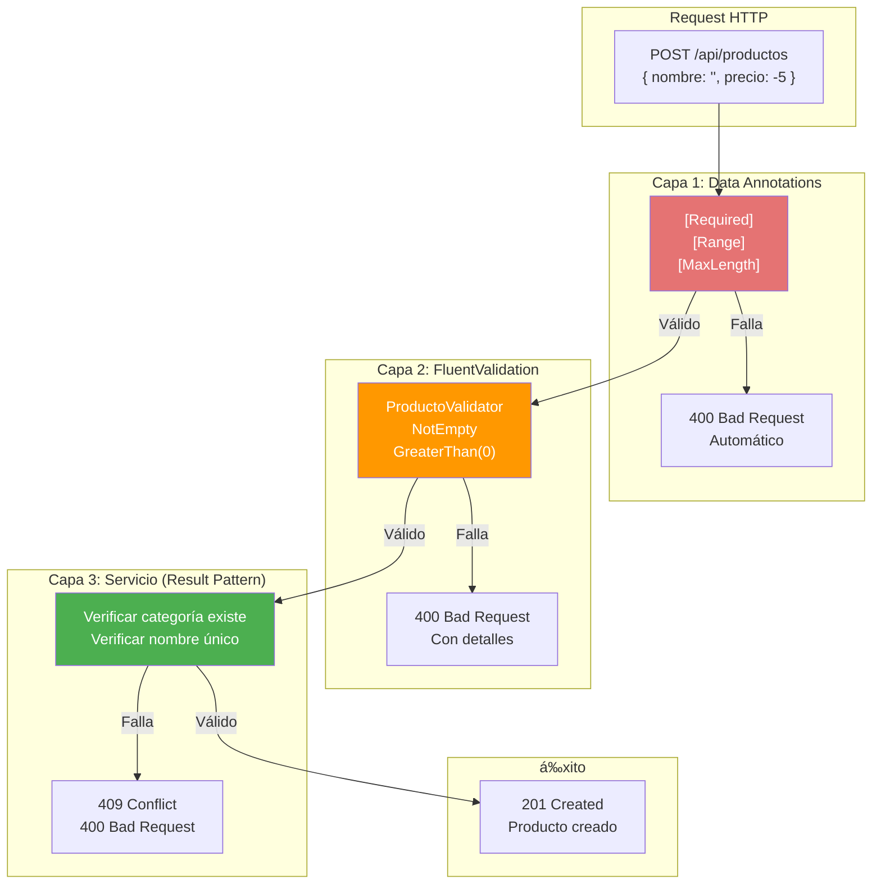
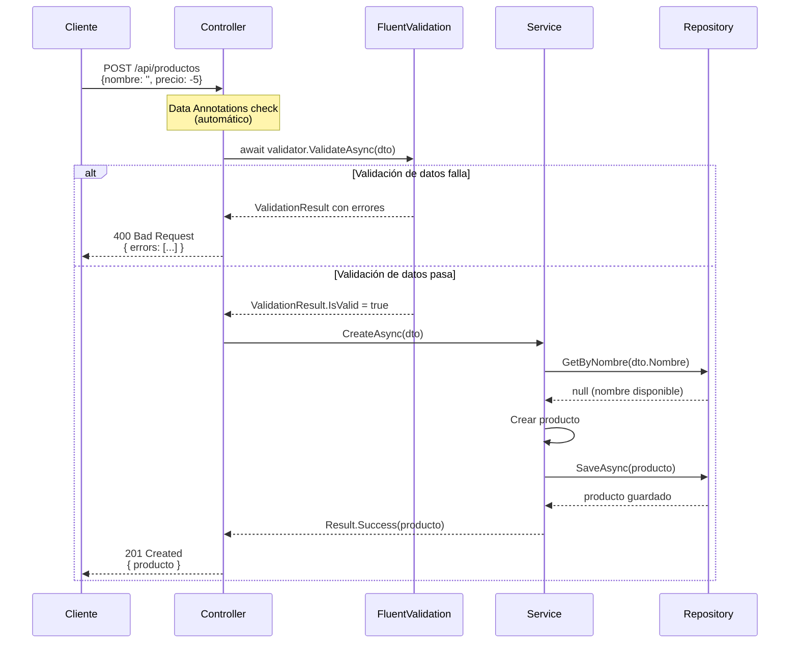
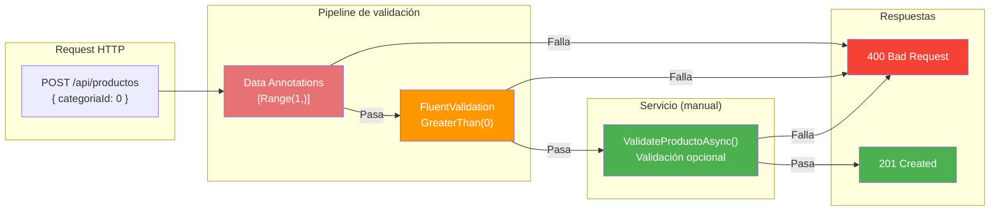
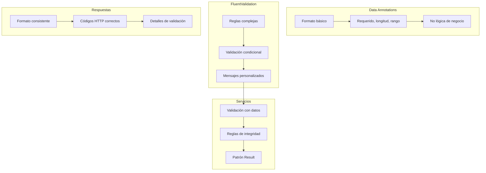

# 5. Validación en Cascada

## Índice

[5. Validación en Cascada: Data Annotations + FluentValidation](#5-validacin-en-cascada-data-annotations--fluentvalidation)
  - [5.1. Capas de Validación: Overview](#51-capas-de-validacin-overview)
  - [5.2. Data Annotations](#52-data-annotations)
  - [5.3. FluentValidation: Instalación y Validadores](#53-fluentvalidation-instalacin-y-validadores)
  - [5.4. Integración de FluentValidation con Controladores](#54-integracin-de-fluentvalidation-con-controladores)
  - [5.5. Cuándo Usar Cada Capa de Validación](#55-cundo-usar-cada-capa-de-validacin)
  - [5.6. Respuestas de Error Estandarizadas](#56-respuestas-de-error-estandarizadas)
  - [5.7. Resumen y Buenas Prácticas](#57-resumen-y-buenas-prcticas)

---

## 5.1. Capas de Validación: Overview

La validación en cascada significa que los datos pasan por múltiples capas de validación, cada una con un propósito específico. La primera capa (Data Annotations) valida el formato básico del JSON. La segunda capa (FluentValidation) valida reglas de negocio específicas. La tercera capa (servicio) verifica invariantes de negocio que requieren acceso a datos. Cada capa captura diferentes tipos de errores y proporciona mensajes apropiados.

### ¿Por qué múltiples capas de validación?

Cada capa de validación tiene responsabilidades diferentes. Data Annotations verifica que los campos requeridos estén presentes y que los tipos sean correctos. Esta validación es automática gracias a ASP.NET Core y no requiere código adicional. FluentValidation te permite escribir reglas complejas y personalizadas que no puedes expresar con atributos. Finalmente, el servicio verifica reglas que requieren acceso a la base de datos, como verificar si un email ya existe o si una categoría está activa.



### Flujo de validación completo



---

## 5.2. Data Annotations

Data Annotations son atributos que puedes aplicar a las propiedades de tus DTOs para especificar restricciones de validación. ASP.NET Core automáticamente valida estos atributos cuando el modelo es bindeado, devolviendo errores 400 Bad Request si la validación falla. Son ideales para reglas simples que no requieren lógica compleja.

### Atributos comunes

El atributo `[Required]` marca un campo como obligatorio. El campo no puede ser null, empty (para strings), o el valor default (para value types). El atributo `[StringLength]` limita la longitud de strings, especificando un máximo y opcionalmente un mínimo. El atributo `[Range]` verifica que un valor numérico esté dentro de un rango especificado. El atributo `[EmailAddress]` valida que el string sea un email válido. El atributo `[MinLength]` y `[MaxLength]` son alternativas a StringLength para solo máximo o mínimo. El atributo `[RegularExpression]` verifica que el string coincida con una expresión regular.

```csharp
using System.ComponentModel.DataAnnotations;

namespace TiendaApi.Core.Dtos.Productos;

public class ProductoCreateDto
{
    [Required(ErrorMessage = "El nombre del producto es obligatorio")]
    [StringLength(200, MinimumLength = 3, ErrorMessage = "El nombre debe tener entre 3 y 200 caracteres")]
    public string Nombre { get; set; } = string.Empty;
    
    [Required(ErrorMessage = "El precio es obligatorio")]
    [Range(0.01, 1000000, ErrorMessage = "El precio debe ser mayor a 0 y menor a 1,000,000")]
    public decimal Precio { get; set; }
    
    [Required(ErrorMessage = "La categoría es obligatoria")]
    public long CategoriaId { get; set; }
    
    [StringLength(2000, ErrorMessage = "La descripción no puede exceder 2000 caracteres")]
    public string? Descripcion { get; set; }
    
    [Url(ErrorMessage = "Debe ser una URL válida")]
    public string? ImagenUrl { get; set; }
    
    [RegularExpression(@"^[A-Z0-9]{5,10}$", ErrorMessage = "El SKU debe ser alfanumérico de 5-10 caracteres")]
    public string? Sku { get; set; }
    
    [Range(0, int.MaxValue, ErrorMessage = "El stock no puede ser negativo")]
    public int Stock { get; set; }
}
```

### Más atributos de validación

```csharp
using System.ComponentModel.DataAnnotations;

namespace TiendaApi.Core.Dtos.Usuarios;

public class UserRegisterDto
{
    [Required(ErrorMessage = "El email es obligatorio")]
    [EmailAddress(ErrorMessage = "Debe ser un email válido")]
    public string Email { get; set; } = string.Empty;
    
    [Required(ErrorMessage = "La contraseña es obligatoria")]
    [MinLength(8, ErrorMessage = "La contraseña debe tener al menos 8 caracteres")]
    [MaxLength(100, ErrorMessage = "La contraseña no puede exceder 100 caracteres")]
    public string Password { get; set; } = string.Empty;
    
    [Compare("Password", ErrorMessage = "Las contraseñas no coinciden")]
    public string ConfirmPassword { get; set; } = string.Empty;
    
    [Required(ErrorMessage = "El nombre es obligatorio")]
    [RegularExpression(@"^[a-zA-Z\s]+$", ErrorMessage = "El nombre solo puede contener letras")]
    public string Nombre { get; set; } = string.Empty;
    
    [Required(ErrorMessage = "Debes aceptar los términos")]
    public bool AceptaTerminos { get; set; }
}
```

### Validación automática en controladores

Cuando usas `[ApiController]`, ASP.NET Core automáticamente valida los Data Annotations antes de que el código del controlador se ejecute. Si la validación falla, devuelve 400 Bad Request con los errores en formato JSON.

```csharp
[ApiController]
[Route("api/[controller]")]
public class ProductosController : ControllerBase
{
    private readonly IProductoService _service;

    public ProductosController(IProductoService service)
    {
        _service = service;
    }

    [HttpPost]
    public async Task<ActionResult<ProductoDto>> Create([FromBody] ProductoCreateDto dto)
    {
        // Si Data Annotations fallan, esto NUNCA se ejecuta
        // ASP.NET Core devuelve 400 automáticamente
        var resultado = await _service.CreateAsync(dto);
        
        return resultado.Match(
            producto => CreatedAtAction(nameof(GetById), new { id = producto.Id }, producto),
            error => BadRequest(new { error.Message }));
    }
}
```

```json
// Respuesta cuando Data Annotations fallan
// HTTP 400 Bad Request
{
  "type": "https://tools.ietf.org/html/rfc9110#section-15.5.1",
  "title": "One or more validation errors occurred.",
  "status": 400,
  "errors": {
    "Nombre": ["El nombre del producto es obligatorio"],
    "Precio": ["El precio debe ser mayor a 0 y menor a 1,000,000"],
    "CategoriaId": ["La categoría es obligatoria"]
  }
}
```

### Custom Data Annotations

Puedes crear atributos de validación personalizados para reglas que se repiten en tu aplicación.

```csharp
// Validación de teléfono español
public class SpanishPhoneAttribute : ValidationAttribute
{
    protected override ValidationResult? IsValid(object? value, ValidationContext validationContext)
    {
        if (value == null)
            return ValidationResult.Success; // [Required] maneja null
        
        var phone = value.ToString();
        
        // Teléfono español: 9 dígitos, empieza por 6, 7, 8 o 9
        if (!System.Text.RegularExpressions.Regex.IsMatch(
            phone, @"^[6-9]\d{8}$"))
        {
            return new ValidationResult(
                "Debe ser un teléfono español válido (9 dígitos, starts por 6, 7, 8 o 9)",
                new[] { validationContext.MemberName });
        }
        
        return ValidationResult.Success;
    }
}

// Uso
public class ContactoDto
{
    [SpanishPhone]
    public string Telefono { get; set; } = string.Empty;
}
```

---

## 5.3. FluentValidation: Instalación y Validadores

FluentValidation es una librería que permite definir reglas de validación de forma fluida y expresiva, con soporte para reglas complejas, validación condicional, y mensajes de error personalizados. A diferencia de Data Annotations, las reglas se definen en clases separadas, manteniendo los DTOs limpios y focused en los datos.

### Instalación

```bash
dotnet add TiendaApi.Core package FluentValidation
dotnet add TiendaApi.Core package FluentValidation.DependencyInjection
```

### Registro en Program.cs

```csharp
using FluentValidation;

builder.Services.AddValidatorsFromAssemblyContaining<Program>();
// O especficar el assembly donde están los validadores
builder.Services.AddValidatorsFromAssembly(typeof(ProductoCreateDto).Assembly);
```

### Crear un validador básico

```csharp
using FluentValidation;

namespace TiendaApi.Core.Validators.Productos;

public class ProductoCreateDtoValidator : AbstractValidator<ProductoCreateDto>
{
    public ProductoCreateDtoValidator()
    {
        // Reglas para Nombre
        RuleFor(x => x.Nombre)
            .NotEmpty().WithMessage("El nombre es obligatorio")
            .Length(3, 200).WithMessage("El nombre debe tener entre 3 y 200 caracteres")
            .Must(nombre => !nombre.Contains("<script>"))
                .WithMessage("El nombre contiene caracteres inválidos");

        // Reglas para Precio
        RuleFor(x => x.Precio)
            .GreaterThan(0).WithMessage("El precio debe ser mayor a 0")
            .LessThanOrEqualTo(1000000)
                .WithMessage("El precio no puede exceder 1,000,000");

        // Reglas para Categoría
        RuleFor(x => x.CategoriaId)
            .GreaterThan(0).WithMessage("Debe seleccionar una categoría válida");

        // Reglas para Descripción
        RuleFor(x => x.Descripcion)
            .MaximumLength(2000).WithMessage("La descripción no puede exceder 2000 caracteres")
            .When(x => !string.IsNullOrEmpty(x.Descripcion));

        // Reglas para SKU (opcional pero si viene, debe ser válido)
        RuleFor(x => x.Sku)
            .Matches(@"^[A-Z0-9]{5,10}$")
                .WithMessage("El SKU debe ser alfanumérico, mayúsculas, 5-10 caracteres")
            .When(x => !string.IsNullOrEmpty(x.Sku));
    }
}
```

### Validador con reglas complejas

```csharp
using FluentValidation;

namespace TiendaApi.Core.Validators.Pedidos;

public class PedidoCreateDtoValidator : AbstractValidator<PedidoCreateDto>
{
    public PedidoCreateDtoValidator()
    {
        RuleFor(x => x.ClienteId)
            .GreaterThan(0).WithMessage("Debe especificar un cliente válido");

        // Colección con validación anidada
        RuleForEach(x => x.Items)
            .SetValidator(new PedidoItemDtoValidator());

        // Reglas condicionales
        RuleFor(x => x.DireccionEnvio)
            .NotNull().WithMessage("La dirección de envío es obligatoria")
            .When(x => x.TipoEntrega == TipoEntrega.Domicilio);

        // Regla que depende de otro campo
        RuleFor(x => x.Notas)
            .MaximumLength(#5)
            .When(x => x.TipoEntrega == TipoEntrega.Tienda);
    }
}

// Validador anidado para items
public class PedidoItemDtoValidator : AbstractValidator<PedidoItemDto>
{
    public PedidoItemDtoValidator()
    {
        RuleFor(x => x.ProductoId)
            .GreaterThan(0).WithMessage("Debe especificar un producto válido");

        RuleFor(x => x.Cantidad)
            .GreaterThan(0).WithMessage("La cantidad debe ser mayor a 0")
            .LessThanOrEqualTo(100).WithMessage("No se pueden pedir más de 100 unidades");
    }
}
```

### Mensajes de error personalizados

```csharp
public class ProductoCreateDtoValidator : AbstractValidator<ProductoCreateDto>
{
    public ProductoCreateDtoValidator()
    {
        RuleFor(x => x.Nombre)
            .NotEmpty().WithMessage("El nombre del producto es obligatorio")
            .Length(3, 200)
                .WithMessage("El nombre '{PropertyValue}' debe tener entre 3 y 200 caracteres. Actualmente tiene {TotalLength}.")
            .Must(nombre => !nombre.Contains("<script>"))
                .WithMessage("El nombre no puede contener etiquetas HTML");
                
        RuleFor(x => x.Precio)
            .GreaterThan(0)
                .WithMessage("El precio debe ser mayor a 0. Valor proporcionado: {PropertyValue}");
                
        // Mensaje con función lambda
        RuleFor(x => x.Stock)
            .GreaterThanOrEqualTo(0)
                .WithMessage(x => $"El stock no puede ser negativo. Valor proporcionado: {x.Stock}");
    }
}
```

---

## 5.4. Integración de FluentValidation con Controladores

Para que FluentValidation se ejecute automáticamente en cada petición, debes configurarlo en Program.cs usando `AddFluentValidationAutoValidation()`. Esto registra los validadores y activa la validación automática en el pipeline.

> **NOTA PARA EL ALUMNO**: La configuración de FluentValidation tiene dos partes:
> - `AddValidatorsFromAssemblyContaining<Program>()` → Registra los validadores en el contenedor DI (necesario)
> - `AddFluentValidationAutoValidation()` → Activa la validación automática en el pipeline
>
> Si solo usas la primera parte, la validación debe llamarse manualmente desde los servicios. Si usas ambas, la validación se ejecuta automáticamente antes de llegar al controller y devuelve 400 Bad Request si falla. Esta es la configuración recomendada para APIs REST.

> **NOTA PARA EL ALUMNO**: Data Annotations y FluentValidation son complementarios:
> - **Data Annotations** → Valida formato básico (requerido, rango, email, formato). Se define en el propio DTO.
> - **FluentValidation** → Valida reglas de negocio complejas (condicionales, múltiples campos, mensajes personalizados). Se define en clases separadas.
> - Ambos se ejecutan **antes** del controller. Si las reglas son simples (solo formato), no es necesario añadir FluentValidation; si hay reglas de negocio complejas, es muy recomendable.

### Configuración básica

```csharp
using FluentValidation;

var builder = WebApplication.CreateBuilder(args);

// =====================================================
// OPCIONES DE CONFIGURACIá“N DE FLUENTVALIDATION
// =====================================================

// --- OPCIá“N 1: Solo registrar validadores (sin ejecución automática) ---
// Los validadores se registran pero NO se ejecutan automáticamente.
// Debes llamar manualmente a validator.ValidateAsync() en el service.
builder.Services.AddValidatorsFromAssemblyContaining<Program>();

// --- OPCIá“N 2: Registrar + Validación automática (RECOMENDADO) ---
// Añade un filtro que ejecuta FluentValidation automáticamente.
// Si la validación falla, devuelve 400 Bad Request automáticamente.
builder.Services.AddValidatorsFromAssemblyContaining<Program>()
                .AddFluentValidationAutoValidation();

// --- OPCIá“N 3: Completo (API + validación cliente-side) ---
// Añade adapters para generar validación JavaScript (para Blazor/MVC).
builder.Services.AddValidatorsFromAssemblyContaining<Program>()
                .AddFluentValidationAutoValidation()
                .AddFluentValidationClientsideAdapters();

// =====================================================

var app = builder.Build();

app.MapControllers();
app.Run();
```

### Diagrama de flujo de validación



> **NOTA PARA EL ALUMNO**: Cuando usas `AddFluentValidationAutoValidation()`, la validación automática ocurre ANTES de que el request llegue al controller. Por tanto, la validación manual en el servicio (`ValidateProductoAsync()`) se convierte en **opcional** - ya no es necesaria porque la validación ya se ejecutó. Se deja la validación manual en el servicio con fines didácticos para mostrar cómo validar manualmente cuando se requiera (por ejemplo, en validaciones complejas que dependan de datos externos).

### Configuración global de ValidatorOptions

```csharp
using FluentValidation;

ValidatorOptions.Global.LanguageManager = new CustomLanguageManager();
ValidatorOptions.Global.DefaultRuleLevelCascadeMode = CascadeMode.Continue;
ValidatorOptions.Global.PropertyChainBehavior = ChainBehaviorBehavior.CamelCase;
```

### Personalizar respuesta de errores

```csharp
// ValidationExceptionFilter.cs
public class ValidationExceptionFilter : IExceptionFilter
{
    public void OnException(ExceptionContext context)
    {
        if (context.Exception is ValidationException validationException)
        {
            var errors = validationException.Errors
                .GroupBy(e => e.PropertyName)
                .ToDictionary(
                    g => g.Key,
                    g => g.Select(e => e.ErrorMessage).ToArray());

            context.Result = new BadRequestObjectResult(new
            {
                message = "Errores de validación",
                errors = errors
            });
            
            context.ExceptionHandled = true;
        }
    }
}

// Registrar en Program.cs
builder.Services.AddControllers(options =>
{
    options.Filters.Add<ValidationExceptionFilter>();
});
```

### Uso en controlador con Result Pattern

```csharp
[ApiController]
[Route("api/[controller]")]
public class ProductosController : ControllerBase
{
    private readonly IProductoService _service;
    private readonly IValidator<ProductoCreateDto> _createValidator;

    public ProductosController(
        IProductoService service,
        IValidator<ProductoCreateDto> createValidator)
    {
        _service = service;
        _createValidator = createValidator;
    }

    [HttpPost]
    public async Task<ActionResult<ProductoDto>> Create([FromBody] ProductoCreateDto dto)
    {
        // FluentValidation se ejecuta automáticamente
        // Si falla, el filtro devuelve 400 Bad Request
        
        var resultado = await _service.CreateAsync(dto);
        
        return resultado.Match(
            producto => CreatedAtAction(
                nameof(GetById),
                new { id = producto.Id },
                producto),
            error => error.Type switch
            {
                ErrorType.Validation => BadRequest(new { error.Message }),
                ErrorType.NotFound => NotFound(new { error.Message }),
                ErrorType.Conflict => Conflict(new { error.Message }),
                _ => StatusCode(#5, new { error.Message })
            });
    }
}
```

> **NOTA PARA EL ALUMNO (Validación en Servicios)**: La validación manual en los servicios (llamando a `ValidateProductoAsync()`) es **opcional** cuando usas `AddFluentValidationAutoValidation()`. En TiendaApi se deja esta validación manual con fines didácticos para:
> - Mostrar cómo validar manualmente en la capa de servicio cuando se requiera
> - Demostrar el patrón Result para manejar errores de validación
> - Permitir experimentar deshabilitándola y viendo el comportamiento
>
> Si decides usar validación automática, puedes eliminar las llamadas a `ValidateProductoAsync()` en los servicios y asumir que los DTOs ya fueron validados.

### Validación manual cuando es necesaria

A veces necesitas validar manualmente, por ejemplo en escenarios complejos o cuando la validación automática no está configurada:

```csharp
[ApiController]
[Route("api/[controller]")]
public class ProductosController : ControllerBase
{
    private readonly IValidator<ProductoCreateDto> _createValidator;

    public ProductosController(IValidator<ProductoCreateDto> createValidator)
    {
        _createValidator = createValidator;
    }

    [HttpPost("validate-only")]
    public async Task<IActionResult> ValidateOnly([FromBody] ProductoCreateDto dto)
    {
        // Validar solo, sin ejecutar la lógica de negocio
        var result = await _createValidator.ValidateAsync(dto);
        
        if (result.IsValid)
            return Ok(new { valid = true });
            
        return BadRequest(new
        {
            valid = false,
            errors = result.Errors
                .GroupBy(e => e.PropertyName)
                .ToDictionary(
                    g => g.Key,
                    g => g.Select(e => e.ErrorMessage).ToArray())
        });
    }
}
```

---

## 5.5. Cuándo Usar Cada Capa de Validación

Cada capa de validación tiene responsabilidades específicas. Usar la capa correcta para el tipo de error apropiado hace tu código más mantenible y las mensajes de error más claros para los clientes de tu API.

### Data Annotations para validación de formato

Data Annotations son perfectos para verificar el formato básico de los datos. Esto incluye campos requeridos, longitud de strings, rangos numéricos simples, formatos de email y URL, y expresiones regulares básicas. Data Annotations no deben contener lógica de negocio, solo verificación de formato.

```csharp
// ✅ CORRECTO: Validación de formato
public class ProductoCreateDto
{
    [Required]
    [StringLength(200, MinimumLength = 3)]
    public string Nombre { get; set; } = string.Empty;
    
    [Required]
    [Range(0.01, 1000000)]
    public decimal Precio { get; set; }
    
    [Required]
    public long CategoriaId { get; set; }
}

// ❌ INCORRECTO: Lógica de negocio en Data Annotations
public class ProductoCreateDto
{
    [Required]
    [CustomValidation(typeof(ProductoValidator), nameof(ProductoValidator.NombreUnico))]
    public string Nombre { get; set; } = string.Empty;  // NO
}
```

### FluentValidation para validación de negocio

FluentValidation es ideal para reglas que dependen de múltiples campos, validaciones condicionales basadas en otros valores, reglas que requieren acceso a servicios o configuración, y mensajes de error personalizados complejos.

```csharp
public class PedidoCreateDtoValidator : AbstractValidator<PedidoCreateDto>
{
    // ✅ CORRECTO: Reglas de negocio
    
    // Dependencia de múltiples campos
    RuleFor(x => x.FechaEntrega)
        .GreaterThan(DateTime.UtcNow)
            .WithMessage("La fecha de entrega debe ser futura")
        .When(x => x.TipoEntrega == TipoEntrega.Domicilio);
    
    // Regla que depende del valor de otro campo
    RuleFor(x => x.DireccionEnvio)
        .NotNull()
            .WithMessage("La dirección es obligatoria para entrega a domicilio")
        .When(x => x.TipoEntrega == TipoEntrega.Domicilio);
    
    // Colección con validación anidada
    RuleForEach(x => x.Items)
        .SetValidator(new PedidoItemValidator());
    
    // Validación condicional compleja
    RuleFor(x => x.CuponDescuento)
        .MustAsync(async (cupon, cancellation) =>
        {
            if (string.IsNullOrEmpty(cupon)) return true;
            return await _cuponService.EsValidoAsync(cupon);
        })
        .WithMessage("El cupón no es válido o ha expirado")
        .When(x => !string.IsNullOrEmpty(x.CuponDescuento));
}
```

### Servicio (Result Pattern) para validación que requiere datos

Algunas validaciones requieren acceso a la base de datos u otros servicios. Estas deben hacerse en el servicio, no en los validadores.

```csharp
public class ProductoService
{
    private readonly IProductoRepository _repository;
    private readonly ICategoriaRepository _categoriaRepository;

    public async Task<Result<ProductoDto, DomainError>> CreateAsync(ProductoCreateDto dto)
    {
        // ✅ CORRECTO: Validación que requiere acceso a datos
        
        // Verificar que la categoría existe
        var categoria = await _categoriaRepository.FindByIdAsync(dto.CategoriaId);
        if (categoria == null)
            return Result.Failure<ProductoDto, DomainError>(
                DomainError.NotFound($"Categoría {dto.CategoriaId} no encontrada"));
        
        // Verificar que el nombre no existe (único)
        var existente = await _repository.ExistsByNombreAsync(dto.Nombre);
        if (existente)
            return Result.Failure<ProductoDto, DomainError>(
                DomainError.Conflict($"Ya existe un producto con el nombre '{dto.Nombre}'"));
        
        // Crear el producto
        var producto = new Producto
        {
            Nombre = dto.Nombre,
            Precio = dto.Precio,
            CategoriaId = dto.CategoriaId
        };
        
        var guardado = await _repository.SaveAsync(producto);
        return Result.Success<ProductoDto, DomainError>(guardado.ToDto());
    }
}
```

### Tabla de responsabilidades

| Tipo de validación | Capa | Ejemplos |
|-------------------|------|----------|
| Formato de datos | Data Annotations | Required, StringLength, Range, Email |
| Reglas de negocio simples | FluentValidation | Mínimo 3 caracteres, precio positivo |
| Reglas condicionales | FluentValidation | Si tipo es X, campo Y es obligatorio |
| Validación con datos | Servicio + Result | Categoría existe, nombre único |
| Integridad referencial | Base de datos | Foreign keys, unique constraints |

---

## 5.6. Respuestas de Error Estandarizadas

Una API profesional devuelve errores en un formato consistente que los clientes pueden parsear fácilmente. Esto incluye un mensaje legible por humanos, un código de error específico para программирование, detalles de validación cuando aplica, y correlation ID para debugging.

### Formato de error estándar

```csharp
namespace TiendaApi.Apis.Models;

public class ErrorResponse
{
    public string Message { get; set; } = string.Empty;
    public string? Code { get; set; }
    public Dictionary<string, string[]>? ValidationErrors { get; set; }
    public string? TraceId { get; set; }
    public DateTime Timestamp { get; set; } = DateTime.UtcNow;
}
```

### Errores de validación (400)

```csharp
// Cuando Data Annotations o FluentValidation fallan
{
  "message": "Errores de validación",
  "code": "VALIDATION_ERROR",
  "validationErrors": {
    "nombre": ["El nombre es obligatorio", "El nombre debe tener entre 3 y 200 caracteres"],
    "precio": ["El precio debe ser mayor a 0"],
    "categoriaId": ["La categoría es obligatoria"]
  },
  "traceId": "0HN3J4F2K5Q2C:0000001",
  "timestamp": "2024-01-15T10:30:00Z"
}
```

### Errores de recurso no encontrado (404)

```csharp
// Cuando se busca un recurso que no existe
{
  "message": "Producto 999 no encontrado",
  "code": "PRODUCT_NOT_FOUND",
  "traceId": "0HN3J4F2K5Q2C:0000002",
  "timestamp": "2024-01-15T10:30:01Z"
}
```

### Errores de conflicto (409)

```csharp
// Cuando se viola una regla de negocio
{
  "message": "Ya existe un producto con el nombre 'iPhone 15'",
  "code": "PRODUCT_CONFLICT",
  "traceId": "0HN3J4F2K5Q2C:0000003",
  "timestamp": "2024-01-15T10:30:02Z"
}
```

### Errores de autenticación/autorización (401/403)

```csharp
// 401 Unauthorized
{
  "message": "Debe iniciar sesión para acceder a este recurso",
  "code": "UNAUTHORIZED",
  "traceId": "0HN3J4F2K5Q2C:0000004",
  "timestamp": "2024-01-15T10:30:03Z"
}

// 403 Forbidden
{
  "message": "No tiene permiso para eliminar productos",
  "code": "FORBIDDEN",
  "requiredRole": "Admin",
  "traceId": "0HN3J4F2K5Q2C:0000005",
  "timestamp": "2024-01-15T10:30:04Z"
}
```

### Errores internos (#5)

```csharp
// Error inesperado del servidor
{
  "message": "Ha ocurrido un error interno",
  "code": "INTERNAL_ERROR",
  "traceId": "0HN3J4F2K5Q2C:0000006",
  "timestamp": "2024-01-15T10:30:05Z"
}
```

### Implementación del global exception handler

```csharp
// GlobalExceptionHandler.cs
public class GlobalExceptionHandler : IExceptionHandler
{
    private readonly ILogger<GlobalExceptionHandler> _logger;

    public GlobalExceptionHandler(ILogger<GlobalExceptionHandler> logger)
    {
        _logger = logger;
    }

    public async ValueTask<bool> TryHandleAsync(
        HttpContext httpContext,
        Exception exception,
        CancellationToken cancellationToken)
    {
        var traceId = httpContext.TraceIdentifier;
        var timestamp = DateTime.UtcNow;

        var errorResponse = new ErrorResponse
        {
            TraceId = traceId,
            Timestamp = timestamp
        };

        switch (exception)
        {
            case ValidationException validationEx:
                errorResponse.Message = "Errores de validación";
                errorResponse.Code = "VALIDATION_ERROR";
                errorResponse.ValidationErrors = validationEx.Errors
                    .GroupBy(e => e.PropertyName)
                    .ToDictionary(g => g.Key, g => g.Select(e => e.ErrorMessage).ToArray());
                    
                httpContext.Response.StatusCode = 400;
                break;

            case NotFoundException notFoundEx:
                errorResponse.Message = notFoundEx.Message;
                errorResponse.Code = "NOT_FOUND";
                httpContext.Response.StatusCode = 404;
                break;

            case BusinessException businessEx:
                errorResponse.Message = businessEx.Message;
                errorResponse.Code = "BUSINESS_ERROR";
                httpContext.Response.StatusCode = 400;
                break;

            case UnauthorizedException:
                errorResponse.Message = "No autorizado";
                errorResponse.Code = "UNAUTHORIZED";
                httpContext.Response.StatusCode = 401;
                break;

            default:
                errorResponse.Message = "Ha ocurrido un error interno";
                errorResponse.Code = "INTERNAL_ERROR";
                _logger.LogError(exception, "Unhandled exception: {TraceId}", traceId);
                httpContext.Response.StatusCode = 500;
                break;
        }

        await httpContext.Response.WriteAsJsonAsync(errorResponse, cancellationToken);
        return true;
    }
}

// Registro en Program.cs
builder.Services.AddExceptionHandler<GlobalExceptionHandler>();
```

---

## 5.7. Resumen y Buenas Prácticas

A lo largo de este documento hemos explorado el sistema de validación en cascada de TiendaApi, combinando Data Annotations, FluentValidation, y validación en servicios.

### Puntos clave del módulo

La validación en cascada tiene tres capas: Data Annotations para formato, FluentValidation para reglas de negocio, y servicios para validación que requiere datos. Cada capa tiene responsabilidades específicas. Los errores deben devolverse en formato estandarizado para que los clientes puedan parsearlos fácilmente.

### Buenas prácticas



### Errores comunes a evitar

No pongas lógica de negocio en Data Annotations. No uses validadores que requieran acceso a datos (usa el servicio en su lugar). No devuelvas diferentes formatos de error para diferentes tipos de errores. No expongas información sensible en mensajes de error.

### Siguientes pasos

Con la validación dominada, el siguiente paso es aprender sobre el patrón Result, que es la base de cómo comunicamos éxito y fracaso en los servicios de TiendaApi.

### Recursos adicionales

- Data Annotations: https://docs.microsoft.com/dotnet/api/system.componentmodel.dataannotations
- FluentValidation: https://docs.fluentvalidation.net/
- API Validation: https://docs.microsoft.com/aspnet/core/web-api/?view=aspnetcore-8.0#validation
