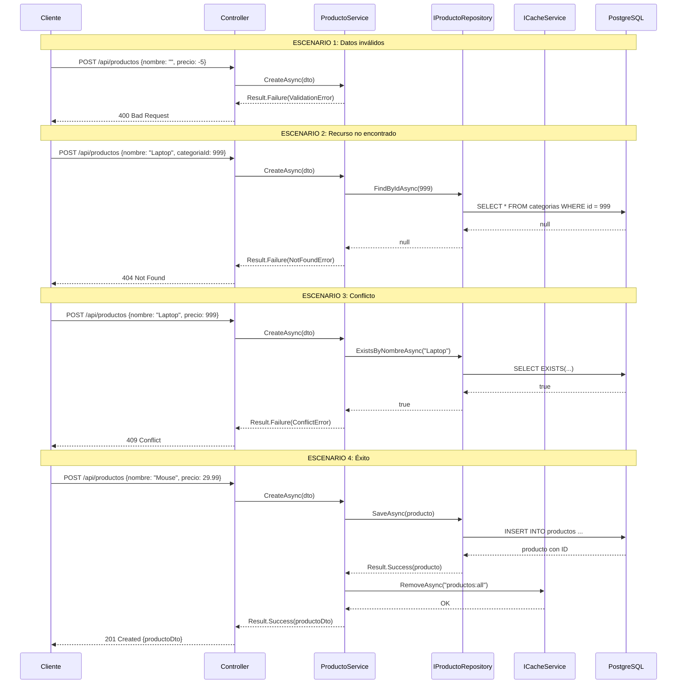
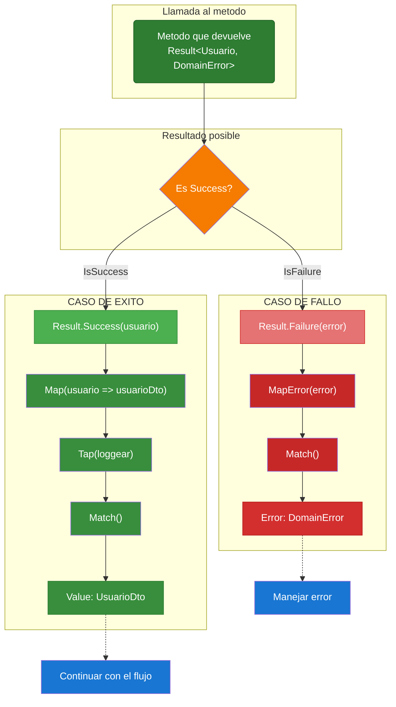
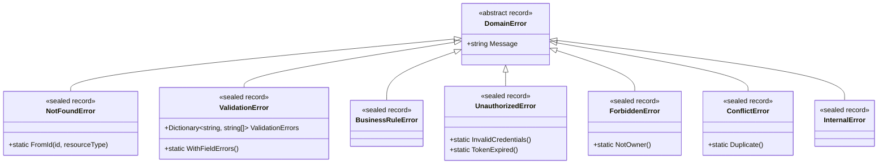
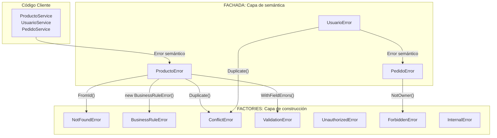
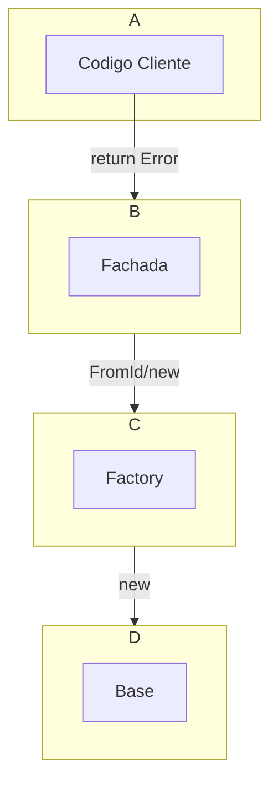
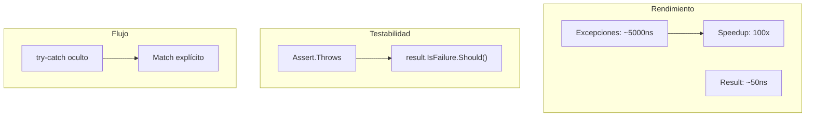
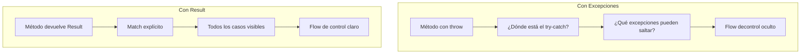

# 6. Patrón Result con CSharpFunctionalExtensions

## Índice

[6. Patrón Result con CSharpFunctionalExtensions](#6-patrón-result-con-csharpextensions)
  - [6.1. Por Qué Excepciones No Son Para Errores de Negocio](#61-por-qué-excepciones-no-son-para-errores-de-negocio)
  - [6.2. CSharpFunctionalExtensions: Result<T, Error>](#62-csharpextensions-resultt-error)
  - [6.3. DomainError y ErrorType Enum](#63-domainerror-y-errortype-enum)
  - [6.4. Result.Match() en Servicios](#64-resultmatch-en-servicios)
  - [6.5. UnitResult para Operaciones Sin Retorno](#65-unitresult-para-operaciones-sin-retorno)
  - [6.6. Integración Result + Controladores](#66-integración-result--controladores)
  - [6.7. Ventajas del Patrón Result](#67-ventajas-del-patrón-result)
  - [6.8. Resumen y Buenas Prácticas](#68-resumen-y-buenas-prácticas)

---

## 6.1. Por Qué Excepciones No Son Para Errores de Negocio

Las excepciones están diseñadas para situaciones excepcionales e inesperadas: un archivo que no existe, una conexión a base de datos que falla, un error de programación. Sin embargo, en una API de negocio, muchas situaciones que los clientes consideran "normales" requieren devolver un error: credenciales inválidas, recurso no encontrado, datos duplicados. Usar excepciones para estos casos hace el código más lento, más difícil de seguir, y oculta el flujo de control.

### El problema con las excepciones para errores de negocio

Imagina un método que valida el login de un usuario. Hay múltiples formas en que puede fallar: email vacío, email no válido, contraseña incorrecta, cuenta bloqueada. Si usas excepciones para cada caso, terminas con un try-catch gigante que no dice nada sobre los posibles caminos del código, el rendimiento se ve afectado porque las excepciones tienen overhead, y es fácil olvidar capturar una excepción y que el error llegue al cliente en un formato inesperado.

```csharp
// ❌ INCORRECTO: Excepciones para errores de negocio
public class AuthService
{
    public User Login(string email, string password)
    {
        if (string.IsNullOrEmpty(email))
            throw new ValidationException("Email es obligatorio");
        
        if (!IsValidEmail(email))
            throw new ValidationException("Email inválido");
        
        var user = _repository.FindByEmail(email);
        if (user == null)
            throw new NotFoundException("Usuario no encontrado");
        
        if (!VerifyPassword(password, user.PasswordHash))
            throw new UnauthorizedException("Contraseña incorrecta");
        
        if (user.IsLocked)
            throw new ForbiddenException("Cuenta bloqueada");
        
        return user;
    }
}

// El cliente tiene que capturar múltiples excepciones
try
{
    var user = authService.Login(email, password);
}
catch (ValidationException ex) { /* mostrar error de validación */ }
catch (NotFoundException ex) { /* mostrar usuario no encontrado */ }
catch (UnauthorizedException ex) { /* mostrar contraseña incorrecta */ }
catch (ForbiddenException ex) { /* mostrar cuenta bloqueada */ }
```

### La solución con el patrón Result

Con el patrón Result, cada método devuelve explícitamente si tuvo éxito o falló, junto con el valor o el error. Esto hace el código auto-documentado: puedes ver todos los posibles resultados leyendo la firma del método. No hay excepciones ocultas, el flujo de control es explícito, y el rendimiento es óptimo porque no hay overhead de stack trace.

```csharp
// ✅ CORRECTO: Result Pattern
public class AuthService
{
    public Result<User, DomainError> Login(string email, string password)
    {
        if (string.IsNullOrEmpty(email))
            return Result.Failure<User, DomainError>(
                DomainError.Validation("Email es obligatorio"));
        
        if (!IsValidEmail(email))
            return Result.Failure<User, DomainError>(
                DomainError.Validation("Email inválido"));
        
        var user = _repository.FindByEmail(email);
        if (user == null)
            return Result.Failure<User, DomainError>(
                DomainError.NotFound("Usuario no encontrado"));
        
        if (!VerifyPassword(password, user.PasswordHash))
            return Result.Failure<User, DomainError>(
                DomainError.Unauthorized("Contraseña incorrecta"));
        
        if (user.IsLocked)
            return Result.Failure<User, DomainError>(
                DomainError.Forbidden("Cuenta bloqueada"));
        
        return Result.Success<User, DomainError>(user);
    }
}

// El cliente usa Match para manejar ambos casos
var resultado = authService.Login(email, password);
resultado.Match(
    onSuccess: user => { /* usar el usuario */ },
    onFailure: error => { /* mostrar error */ });
```

### Comparación de rendimiento

Las excepciones son aproximadamente 100 veces más lentas que devolver un Result porque necesitan crear un stack trace, buscar catch blocks, y pueden causar presión en el recolector de basura. Para errores de negocio que son frecuentes y esperados, el overhead de excepciones es inaceptable.

### Flujo completo de una operación con Result Pattern



### Comparación visual

```mermaid
flowchart TB
    subgraph "Excepciones (para errores excepcionales)"
        A1["throw new Exception()"]
        A2["Stack trace completo"]
        A3["Búsqueda de catch blocks"]
        A4["~100x más lento"]
        A5["Para: Bugs, fallos de infraestructura"]
    end
    
    subgraph "Result Pattern (para errores de negocio)"
        B1["return Result.Failure()"]
        B2["Solo el mensaje de error"]
        B3["Match directo"]
        B4["Rendimiento óptimo"]
        B5["Para: Validación, no encontrado, conflictos"]
    end
    
    A1 --> A2 --> A3 --> A4 --> A5
    B1 --> B2 --> B3 --> B4 --> B5
```



---

## 6.2. CSharpFunctionalExtensions: Result<T, Error>

CSharpFunctionalExtensions es una librería que proporciona tipos funcionales como `Result`, `Maybe`, y `Either`. La librería maneja la complejidad de implementar el patrón Result manualmente y proporciona métodos útiles como `Map`, `Bind`, y `Match` para encadenar operaciones de forma funcional.

### Flujo del Patrón Result

El Result puede estar en uno de dos estados: **Success** (la operación fue exitosa y contiene un valor) o **Failure** (la operación falló y contiene un error). El método `Match` permite ejecutar código diferente según el estado, forzando al desarrollador a manejar ambos casos explícitamente.



### Instalación

```bash
dotnet add TiendaApi.Core package CSharpFunctionalExtensions
```

### Tipos básicos de Result

La librería proporciona varios tipos de Result dependiendo de lo que necesites. `Result<T, TError>` es para operaciones que devuelven un valor o un error. `UnitResult<TError>` es para operaciones que no devuelven valor pero pueden fallar. `Result<T>` es un atajo cuando solo te importa si tuvo éxito y el valor.

```csharp
using CSharpFunctionalExtensions;

// Result<T, TError> - Para operaciones que devuelven un valor
Result<User, string> loginResult = Result.Success<User, string>(user);
Result<User, string> errorResult = Result.Failure<User, string>("Email inválido");

// UnitResult<TError> - Para operaciones sin valor de retorno
UnitResult<string> deleteResult = UnitResult.Success<string>();
UnitResult<string> deleteError = UnitResult.Failure<string>("Usuario no encontrado");

// Result<T> - Simplified cuando solo te importa éxito/fracaso
Result<User> createResult = Result.Success(user);
Result<User> failureResult = Result.Failure("Error al crear");
```

### Métodos comunes de Result

El método `IsSuccess` y `IsFailure` permiten verificar el estado del Result. Las propiedades `Value` y `Error` acceden al valor o error. Los métodos `Map`, `Bind`, y `Tap` permiten transformar y encadenar Results.

```csharp
// Verificar estado
if (resultado.IsSuccess)
{
    var usuario = resultado.Value;
    // usar usuario
}
else
{
    var error = resultado.Error;
    // manejar error
}

// Map: transformar el valor si es éxito
Result<string, string> nombreResult = resultado
    .Map(user => user.Nombre);

// Bind: encadenar operaciones que pueden fallar
Result<User, string> validarResult = resultado
    .Bind(user => ValidarUsuario(user))
    .Bind(user => VerificarSuscripcion(user));

// Tap: ejecutar acción sin transformar
resultado
    .Tap(user => Log.Info($"Login exitoso: {user.Email}"))
    .TapError(error => Log.Warn($"Login fallido: {error}"));
```

### Combinar múltiples Results

A veces necesitas combinar varios Results, por ejemplo cuando múltiples validaciones deben pasar:

```csharp
// Combine: múltiples operations deben ser éxito
Result<(User user, Producto producto), string> combined = 
    Result.Combine(
        userResult,  // Result<User, string>
        productoResult,  // Result<Producto, string>
        (user, producto) => (user, producto)
    );

// Sequence: convertir List<Result<T>> en Result<List<T>>
var results = new List<Result<Producto, string>>
{
    Result.Success(producto1),
    Result.Success(producto2),
    Result.Success(producto3)
};

Result<List<Producto>, string> allProducts = results.Sequence();

// FirstFailureOrSuccess: obtener el primer error o el último éxito
var finalResult = Result.FirstFailureOrSuccess(result1, result2, result3);
```

---

## 6.3. DomainError: Factory + Fachada + Herencia

### Árbol de Herencia



### ¿Qué es un Factory Method? (Patrón Factory)

Un **Factory Method** es un método estático que encapsula la creación de objetos. Su función es:
- **Ocultar** la complejidad de creación
- **Estandarizar** el formato de los mensajes
- **Centralizar** la lógica de construcción

```csharp
// ❌ Sin factory: formato inconsistente, repetitivo
new NotFoundError("Recurso con ID 5 no encontrado")
new NotFoundError("Usuario 10 no existe")
new NotFoundError("El producto 7 no fue encontrado")

// ✅ Con factory: mensaje estandarizado
NotFoundError.FromId(5, "Producto")     // "Recurso con ID 5 no encontrado"
NotFoundError.FromId(10, "Usuario")     // "Recurso con ID 10 no encontrado"
NotFoundError.FromId(7, "Producto")     // "Recurso con ID 7 no encontrado"
```

| Aspecto | Sin Factory | Con Factory |
|---------|-------------|-------------|
| Formato | Inconsistente | Estándar |
| Mantenibilidad | Cambiar = buscar/reemplazar | Un solo lugar |
| Semántica | `new Error(...)` no explica qué hace | `FromId(...)` es autoexplicativo |

### Clase Base y Factory Methods

```csharp
// Errors/Base/DomainError.cs
public abstract record DomainError(string Message)
{
    public override string ToString() => $"{GetType().Name}: {Message}";
}

// Factory method en NotFoundError
public sealed record NotFoundError(string Message) : DomainError(Message)
{
    public static NotFoundError FromId(long id, string resourceType = "Unknown") =>
        new($"Recurso con ID {id} no encontrado");
}

// Factory method en ValidationError
public sealed record ValidationError(string Message, Dictionary<string, string[]> ValidationErrors)
    : DomainError(Message)
{
    public static ValidationError WithFieldErrors(Dictionary<string, string[]> fieldErrors) =>
        new("Errores de validación", fieldErrors);
}

// Factory method en ConflictError
public sealed record ConflictError(string Message) : DomainError(Message)
{
    public static ConflictError Duplicate(string resourceType, string value) =>
        new($"Ya existe un {resourceType} con el valor '{value}'");
}
```

### ¿Qué es una Fachada? (Patrón Fachada)

Una **Fachada** es una clase estática que actúa como punto de entrada único a un subsistema complejo. Su función es:
- **Centralizar** todos los errores de un dominio
- **Añadir semántica** específica del negocio
- **Delegar** a los factories base

```csharp
// ❌ Sinfachada: dispersión y duplicación
NotFoundError.FromId(5, "Producto")
ConflictError.Duplicate("email", "user@test.com")
new BusinessRuleError("No se puede eliminar el usuario 3")

// ✅ Confachada: organización y semántica
ProductoError.NotFound(5)                    // Delega a FromId()
UsuarioError.EmailExistente("user@test.com")  // Delega a Duplicate()
UsuarioError.NoSePuedeEliminarConPedidos(3)  // Crea BusinessRuleError con mensaje semántico
```

| Aspecto | Sin Fachada | Con Fachada |
|---------|-------------|-------------|
| Organización | Errores dispersos | Un archivo por dominio |
| Descubrimiento | Buscar en código | Ver la clase estática |
| Semántica | Genérica | Específica del negocio |

### Patrón Fachada por Dominio



```csharp
// Errors/Productos/ProductoError.cs
public static class ProductoError
{
    // Delega a NotFoundError.FromId()
    public static NotFoundError NotFound(long id) =>
        NotFoundError.FromId(id, "Producto");

    // Crea BusinessRuleError específico
    public static BusinessRuleError StockInsuficiente(string nombre, int disp, int sol) =>
        new($"Stock insuficiente para '{nombre}'. Disp: {disp}, Sol: {sol}");

    // Delega a ConflictError.Duplicate()
    public static ConflictError ProductoAdquirido(long id) =>
        new("El producto fue adquirido por otro usuario");

    // Delega a ValidationError.WithFieldErrors()
    public static ValidationError ValidacionConCampos(Dictionary<string, string[]> errores) =>
        ValidationError.WithFieldErrors(errores);
}

// Errors/Usuarios/UsuarioError.cs
public static class UsuarioError
{
    // Delega a ConflictError.Duplicate()
    public static ConflictError EmailExistente(string email) =>
        ConflictError.Duplicate("email", email);

    // Delega a UnauthorizedError.InvalidCredentials()
    public static UnauthorizedError CredencialesInvalidas() =>
        UnauthorizedError.InvalidCredentials();

    // Crea BusinessRuleError semántico
    public static BusinessRuleError NoSePuedeEliminarConPedidos(long id) =>
        new($"No se puede eliminar el usuario {id} porque tiene pedidos");
}
```

### Resumen: Capas de Abstracción



```csharp
// Errors/Productos/ProductoError.cs
public static class ProductoError
{
    public static NotFoundError NotFound(long id) =>
        NotFoundError.FromId(id, "Producto");

    public static BusinessRuleError StockInsuficiente(string nombre, int disp, int sol) =>
        new($"Stock insuficiente para '{nombre}'. Disp: {disp}, Sol: {sol}");

    public static ConflictError ProductoAdquirido(long id) =>
        new("El producto fue adquirido por otro usuario");

    public static ValidationError ValidacionConCampos(Dictionary<string, string[]> errores) =>
        ValidationError.WithFieldErrors(errores);
}

// Errors/Usuarios/UsuarioError.cs
public static class UsuarioError
{
    public static ConflictError EmailExistente(string email) =>
        ConflictError.Duplicate("email", email);

    public static UnauthorizedError CredencialesInvalidas() =>
        UnauthorizedError.InvalidCredentials();

    public static BusinessRuleError NoSePuedeEliminarConPedidos(long id) =>
        new($"No se puede eliminar el usuario {id} porque tiene pedidos");
}
```

### Uso en Servicios

```csharp
public async Task<Result<ProductoDto, DomainError>> FindByIdAsync(long id)
{
    var producto = await _repo.FindByIdAsync(id);
    if (producto == null)
        return Result.Failure<ProductoDto, DomainError>(
            ProductoError.NotFound(id));  // NotFoundError

    return Result.Success<ProductoDto, DomainError>(producto.ToDto());
}

public async Task<Result<ProductoDto, DomainError>> CreateAsync(ProductoRequestDto dto)
{
    var validation = await _validator.ValidateAsync(dto);
    if (!validation.IsValid)
        return Result.Failure<ProductoDto, DomainError>(
            ProductoError.ValidacionConCampos(errores));  // ValidationError

    if (_repo.ExistsByNombre(dto.Nombre))
        return Result.Failure<ProductoDto, DomainError>(
            UsuarioError.UsernameExistente(dto.Nombre));  // ConflictError

    // ... guardar y retornar Success
}
```

### Mapeo a HTTP

```csharp
private IActionResult GetHttpResult(DomainError error) => error switch
{
    NotFoundError => NotFound(new { error.Message }),
    ValidationError => BadRequest(new { error.Message }),
    BusinessRuleError => UnprocessableEntity(new { error.Message }),
    UnauthorizedError => Unauthorized(new { error.Message }),
    ForbiddenError => Forbid(),
    ConflictError => Conflict(new { error.Message }),
    InternalError => StatusCode(500, new { error.Message }),
    _ => StatusCode(500, new { error.Message })
};
```

### Comparativa: Excepciones vs Result



| Aspecto | Excepciones | Result |
|---------|-------------|--------|
| Rendimiento | ~100x más lento | Óptimo |
| Legibilidad | try-catch oculto | Explícito |
| Completitud | Se olvida capturar | Match fuerza manejo |
| Testabilidad | Assert.Throws | Tests directos |

---

## 6.4. Result.Match() en Servicios

El método `Match` es la forma principal de trabajar con Results. Permite ejecutar código diferente dependiendo de si el Result fue éxito o fracaso, de forma similar a cómo funcionan las expresiones switch pero para Results. Match fuerza al desarrollador a manejar ambos casos, haciendo el código más seguro.

### Sintaxis básica de Match

El método `Match` toma dos funciones: una para el caso de éxito y otra para el caso de fracaso. Ambas funciones deben devolver el mismo tipo, que es el tipo de retorno del Match.

```csharp
public class ProductoService
{
    public Result<ProductoDto, DomainError> GetById(long id)
    {
        var producto = _repository.FindById(id);
        
        // Usar Match para devolver el resultado
        return producto
            .Map(p => p.ToDto())
            .MapError(error => DomainError.NotFound($"Producto {id} no encontrado"));
    }

    public async Task<IActionResult> CreateAsync(ProductoCreateDto dto)
    {
        var resultado = await _service.CreateAsync(dto);
        
        // Match en el controlador
        return resultado.Match(
            onSuccess: producto => CreatedAtAction(
                nameof(GetById),
                new { id = producto.Id },
                producto),
            onFailure: error => error.Type switch
            {
                ErrorType.Validation => BadRequest(new { error.Message }),
                ErrorType.NotFound => NotFound(new { error.Message }),
                ErrorType.Conflict => Conflict(new { error.Message }),
                ErrorType.BusinessRule => UnprocessableEntity(new { error.Message }),
                _ => StatusCode(500, new { error.Message })
            });
    }
}
```

### Match con encadenamiento

Puedes encadenar operaciones con Map y Bind antes de hacer el Match final:

```csharp
public Result<OrderConfirmationDto, DomainError> ProcessOrder(OrderDto order)
{
    // Encadenar validaciones y transformaciones
    return ValidarOrden(order)
        .Bind(ord => CalcularTotal(ord))
        .Bind(ord => AplicarDescuentos(ord))
        .Bind(ord => ReservarInventario(ord))
        .Map(ord => ord.ToConfirmationDto())
        .Match(
            confirmation => Result.Success<OrderConfirmationDto, DomainError>(confirmation),
            error => Result.Failure<OrderConfirmationDto, DomainError>(error));
}
```

### Match con resultado diferente

A veces quieres que el Match devuelva un tipo diferente al del Result, como un IActionResult en un controlador:

```csharp
[HttpGet("{id:long}")]
public IActionResult GetById(long id)
{
    var resultado = _service.GetById(id);
    
    // Convertir Result a IActionResult
    return resultado.IsSuccess
        ? Ok(resultado.Value)
        : resultado.Error.Type switch
        {
            ErrorType.NotFound => NotFound(new { resultado.Error.Message }),
            ErrorType.Unauthorized => Unauthorized(new { resultado.Error.Message }),
            _ => BadRequest(new { resultado.Error.Message })
        };
}
```

---

## 6.5. UnitResult para Operaciones Sin Retorno

UnitResult es la versión de Result para operaciones que no devuelven un valor significativo, como operaciones de delete o update donde solo te importa si tuvieron éxito. Es análogo a usar `void` pero con soporte para errores.

### Cuándo usar UnitResult

Usa UnitResult cuando el método no necesita devolver ningún dato en caso de éxito, solo confirmar que la operación se completó. Ejemplos típicos son eliminar un recurso, actualizar un recurso (donde la respuesta es 204 No Content), y ejecutar una acción que no tiene valor de retorno.

```csharp
public interface IProductoService
{
    // Para operaciones con valor de retorno
    Result<ProductoDto, DomainError> GetById(long id);
    Result<List<ProductoDto>, DomainError> GetAll();
    Result<ProductoDto, DomainError> Create(ProductoCreateDto dto);
    
    // Para operaciones sin valor de retorno
    UnitResult<DomainError> Delete(long id);
    UnitResult<DomainError> UpdateStock(long id, int cantidad);
}
```

### Implementación con UnitResult

```csharp
public class ProductoService
{
    public UnitResult<DomainError> Delete(long id)
    {
        var producto = _repository.FindById(id);
        
        if (producto == null)
            return UnitResult.Failure<DomainError>(
                DomainError.NotFound($"Producto {id} no encontrado"));
        
        if (producto.TienePedidosPendientes)
            return UnitResult.Failure<DomainError>(
                DomainError.BusinessRule("No se puede eliminar un producto con pedidos pendientes"));
        
        _repository.Delete(producto);
        
        return UnitResult.Success<DomainError>();
    }

    public async Task<IActionResult> DeleteAsync(long id)
    {
        var resultado = await _service.DeleteAsync(id);
        
        if (resultado.IsSuccess)
            return NoContent();
        
        return resultado.Error.Type switch
        {
            ErrorType.NotFound => NotFound(new { resultado.Error.Message }),
            ErrorType.BusinessRule => UnprocessableEntity(new { resultado.Error.Message }),
            _ => StatusCode(500, new { resultado.Error.Message })
        };
    }
}
```

---

## 6.6. Integración Result + Controladores

La integración del patrón Result con controladores es natural una vez que entiendes cómo usar Match. El patrón típico es que los servicios devuelven Result, y los controladores usan Match para convertir esos Results en respuestas HTTP apropiadas.

### Controlador con Result Pattern

```csharp
[ApiController]
[Route("api/[controller]")]
public class ProductosController : ControllerBase
{
    private readonly IProductoService _service;

    public ProductosController(IProductoService service)
    {
        _service = service;
    }

    [HttpGet("{id:long}")]
    public async Task<IActionResult> GetById(long id)
    {
        var resultado = await _service.GetByIdAsync(id);
        
        return resultado.Match(
            producto => Ok(producto),
            error => GetHttpResult(error));
    }

    [HttpGet]
    public async Task<IActionResult> GetAll([FromQuery] int page = 1, [FromQuery] int pageSize = 10)
    {
        var resultado = await _service.GetPagedAsync(page, pageSize);
        
        return resultado.Match(
            paged => Ok(paged),
            error => GetHttpResult(error));
    }

    [HttpPost]
    public async Task<IActionResult> Create([FromBody] ProductoCreateDto dto)
    {
        var resultado = await _service.CreateAsync(dto);
        
        return resultado.Match(
            producto => CreatedAtAction(
                nameof(GetById),
                new { id = producto.Id },
                producto),
            error => GetHttpResult(error));
    }

    [HttpDelete("{id:long}")]
    public async Task<IActionResult> Delete(long id)
    {
        var resultado = await _service.DeleteAsync(id);
        
        return resultado.IsSuccess
            ? NoContent()
            : GetHttpResult(resultado.Error);
    }

    [HttpPut("{id:long}")]
    public async Task<IActionResult> Update(long id, [FromBody] ProductoUpdateDto dto)
    {
        var resultado = await _service.UpdateAsync(id, dto);
        
        return resultado.Match(
            producto => Ok(producto),
            error => GetHttpResult(error));
    }

    private IActionResult GetHttpResult(DomainError error)
    {
        return error.Type switch
        {
            ErrorType.Validation => BadRequest(new
            {
                message = error.Message,
                errors = error.ValidationErrors
            }),
            ErrorType.NotFound => NotFound(new { message = error.Message }),
            ErrorType.Unauthorized => Unauthorized(new { message = error.Message }),
            ErrorType.Forbidden => StatusCode(403, new { message = error.Message }),
            ErrorType.Conflict => Conflict(new { message = error.Message }),
            ErrorType.BusinessRule => UnprocessableEntity(new { message = error.Message }),
            _ => StatusCode(500, new { message = "Ha ocurrido un error interno" })
        };
    }
}
```

### Ayudante para errores de validación

Cuando hay múltiples errores de validación, es útil devolverlos en un formato estructurado:

```csharp
private IActionResult GetHttpResult(DomainError error)
{
    var response = new
    {
        message = error.Message,
        code = error.Type.ToString(),
        traceId = HttpContext.TraceIdentifier
    };

    return error.Type switch
    {
        ErrorType.Validation => BadRequest(new
        {
            response.message,
            response.code,
            response.traceId,
            errors = error.ValidationErrors != null
                ? error.ValidationErrors.Select((msg, i) => new { id = i, message = msg })
                : null
        }),
        ErrorType.NotFound => NotFound(response),
        ErrorType.Conflict => Conflict(response),
        ErrorType.BusinessRule => UnprocessableEntity(response),
        ErrorType.Unauthorized => Unauthorized(response),
        ErrorType.Forbidden => StatusCode(403, response),
        _ => StatusCode(500, new
        {
            message = "Ha ocurrido un error interno",
            code = "INTERNAL_ERROR",
            traceId = HttpContext.TraceIdentifier
        })
    };
}
```

---

## 6.7. Ventajas del Patrón Result

El patrón Result proporciona múltiples ventajas sobre el uso de excepciones para errores de negocio, desde rendimiento hasta mantenibilidad del código.

### Legibilidad y explicitud

El código con Result es más fácil de leer porque todos los posibles caminos están explícitos. No hay try-catch ocultos, no hay excepciones que "pueden" saltar. La firma del método dice exactamente qué puede salir mal, y el Match fuerza a manejar todos los casos.



### Testabilidad

Los tests con Result son más directos: solo necesitas verificar IsSuccess/IsFailure y los valores/error correspondientes. No try-catch en tests, no fear de perder excepciones.

```csharp
[Test]
public void GetById_ProductoNoExistente_ReturnsNotFound()
{
    // Arrange
    var service = new ProductoService(_repositoryMock.Object);
    _repositoryMock.Setup(r => r.FindById(999))
        .Returns((Producto)null!);
    
    // Act
    var resultado = service.GetById(999);
    
    // Assert
    resultado.IsSuccess.Should().BeFalse();
    resultado.Error.Type.Should().Be(ErrorType.NotFound);
    resultado.Error.Message.Should().Contain("999");
}

[Test]
public void Create_ProductoValido_ReturnsSuccess()
{
    // Arrange
    var dto = new ProductoCreateDto { Nombre = "Laptop", Precio = 999 };
    _repositoryMock.Setup(r => r.ExistsByNombre("Laptop"))
        .Returns(false);
    _repositoryMock.Setup(r => r.Save(It.IsAny<Producto>()))
        .Returns((Producto p) => p);
    
    // Act
    var resultado = _service.Create(dto);
    
    // Assert
    resultado.IsSuccess.Should().BeTrue();
    resultado.Value.Nombre.Should().Be("Laptop");
}
```

### Rendimiento

El Result no tiene el overhead de las excepciones: no stack trace, no búsqueda de catch blocks, no presión en el recolector de basura. Para errores frecuentes como validación de input, la diferencia de rendimiento es significativa.

### Tabla comparativa

| Aspecto | Excepciones | Result Pattern |
|---------|-------------|----------------|
| Legibilidad | Media (try-catch oculto) | Alta (explícito) |
| Rendimiento | Bajo (overhead ~100x) | Alto (sin overhead) |
| Completitud | Easy olvidar capturar | Match fuerza manejar todos |
| Testabilidad | Requiere Assert.Throws | Tests directos |
| Stack trace | Siempre presente | Opcional |

---

## 6.8. Resumen y Buenas Prácticas

A lo largo de este documento hemos explorado el patrón Result como alternativa a las excepciones para errores de negocio.

### Puntos clave del módulo

Las excepciones son para errores excepcionales e inesperados. Los errores de negocio son frecuentes y esperados, deben usar Result. CSharpFunctionalExtensions proporciona Result<T, Error> y UnitResult<TError>. DomainError encapsula mensaje, tipo y errores de validación. Match permite manejar ambos casos de forma explícita.

### Buenas prácticas

```mermaid
flowchart TB
    subgraph "Cuándo usar Result"
        A1["Errores de validación"]
        A2["Recursos no encontrados"]
        A3["Conflictos de negocio"]
        A4["Reglas de negocio violadas"]
    end
    
    subgraph "Cuándo usar Excepciones"
        B1["Errores de infraestructura"]
        B2["Bugs en el código"]
        B3["Fallos de conexión"]
        B4["Errores inesperados"]
    end
    
    subgraph "Implementación"
        C1["DomainError con ErrorType"]
        C2["Match siempre"]
        C3["Traducir a HTTP en Controller"]
        C4["UnitResult para operaciones void"]
    end
    
    A1 --> A2 --> A3 --> A4
    B1 --> B2 --> B3 --> B4
    C1 --> C2 --> C3 --> C4
```



### Siguientes pasos

Con el patrón Result dominado, el siguiente paso es aprender sobre el Repository Pattern, que abstrae el acceso a datos y trabaja naturalmente con Result.

### Recursos adicionales

- CSharpFunctionalExtensions: https://github.com/vkhorikov/CSharpFunctionalExtensions
- Error handling guidelines: https://docs.microsoft.com/azure/architecture/best-practices/api-design#error-response-problems
