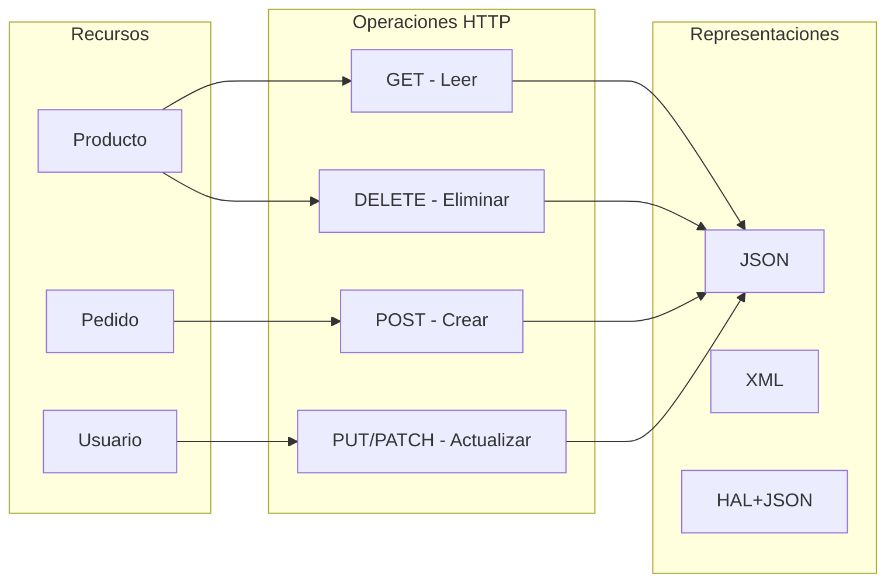
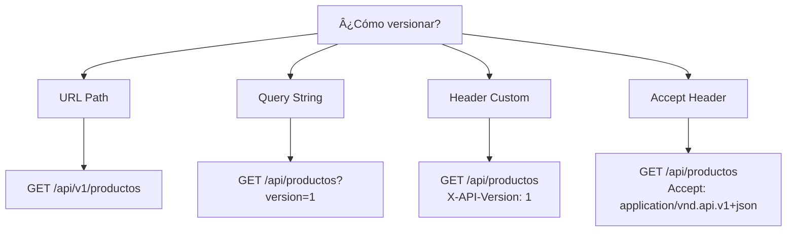
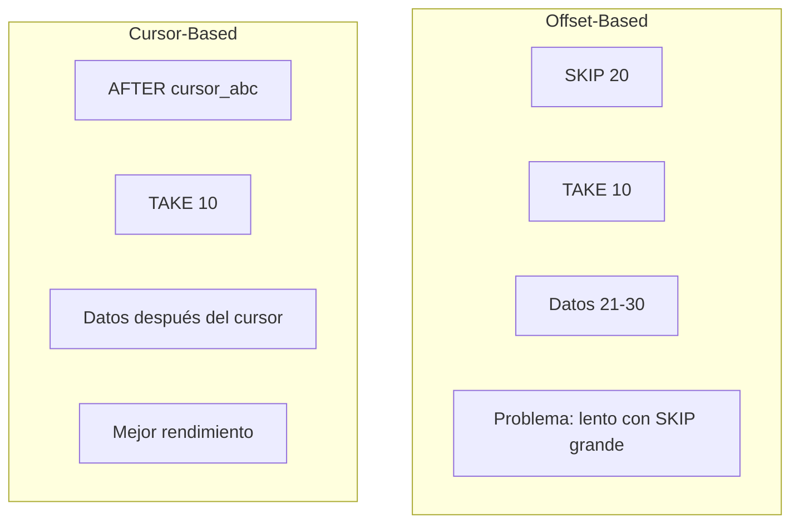
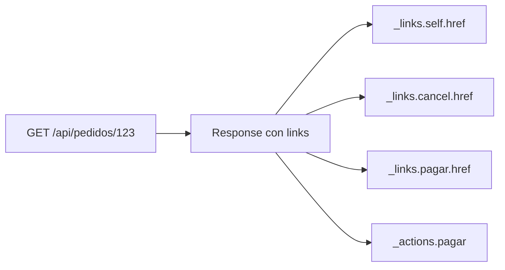
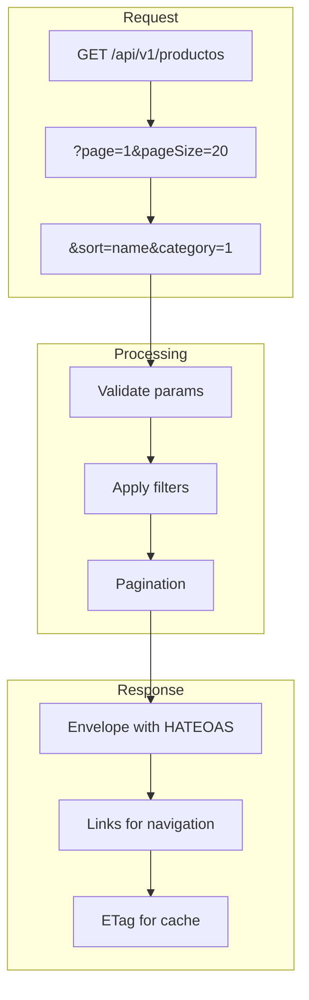

# 6. REST Best Practices

## Índice

[6. REST Best Practices](#6-rest-best-practices)
  - [6.1. Principios Fundamentales de REST](#61-principios-fundamentales-de-rest)
  - [6.2. Versionado de API](#62-versionado-de-api)
  - [6.3. Paginación](#63-paginacin)
  - [6.4. HATEOAS](#64-hateoas)
  - [6.5. Response Envelopes](#65-response-envelopes)
  - [6.6. Query Strings y Filtrado](#66-query-strings-y-filtrado)
  - [6.7. ETag para Cacheo](#67-etag-para-cacheo)
  - [6.8. Resumen](#68-resumen)

---

## 6.1. Principios Fundamentales de REST

REST (Representational State Transfer) es un estilo arquitectónico que usa HTTP de manera semántica. Una API REST bien diseñada es intuitiva, consistente y fácil de usar.



### Los 6 Principios de REST

| Principio | Descripción | Ejemplo |
|-----------|-------------|---------|
| **Recursos** | Todo es un recurso identificado por URI | `/api/productos/123` |
| **Operaciones uniformes** | Usar métodos HTTP correctamente | GET, POST, PUT, DELETE |
| **Representaciones** | Múltiples formatos de respuesta | JSON, XML |
| **Sin estado** | Cada request independiente | Sin sesiones en servidor |
| **HATEOAS** | Links para navegar la API | `_links.self`, `_links.next` |
| **Cacheo** | Respuestas cacheables cuando sea posible | Headers Cache-Control |

---

## 6.2. Versionado de API

El versionado permite evolucionar la API sin romper clientes existentes. Existen varias estrategias.

### Estrategias de Versionado



### Comparación de Estrategias

| Estrategia | Pros | Contras | Uso |
|------------|------|---------|-----|
| **URL Path** | Visible, fácil de cachear | Polluta URLs | Más común |
| **Query String** | URLs limpias | No visible en cache | APIs internas |
| **Header** | URLs limpias | Menos discoverable | APIs sofisticadas |
| **Accept** | Estándar HTTP | Complexidad | APIs enterprise |

### Implementación con URL Path

```csharp
// Program.cs
var builder = WebApplication.CreateBuilder(args);

builder.Services.AddApiVersioning(options =>
{
    options.DefaultApiVersion = new ApiVersion(1, 0);
    options.AssumeDefaultVersionWhenUnspecified = true;
    options.ReportApiVersions = true;
    options.ApiVersionReader = ApiVersionReader.Combine(
        new UrlSegmentApiVersionReader());
});

var app = builder.Build();

// Versionado por URL
app.MapGroup("/api/v{version:apiVersion}/productos")
   .MapProductsApiV1();

app.MapGroup("/api/v{version:apiVersion}/pedidos")
   .MapPedidosApiV1();

app.Run();
```

```csharp
// ProductsApiV1.cs
public static class ProductsApiV1
{
    public static RouteGroupBuilder MapProductsApiV1(this RouteGroupBuilder group)
    {
        group.MapGet("/", GetProducts);
        group.MapGet("/{id:long}", GetProduct);
        group.MapPost("/", CreateProduct);
        group.MapPut("/{id:long}", UpdateProduct);
        group.MapDelete("/{id:long}", DeleteProduct);
        
        return group;
    }

    private static async Task<Results<Ok<List<ProductoDto>>, NotFound>> 
        GetProducts([AsParameters] GetProductsQuery query)
    {
        // Implementación...
        return Ok(await _service.GetProductsAsync(query));
    }
}

// ProductsApiV2.cs (nueva versión con cambios)
public static class ProductsApiV2
{
    public static RouteGroupBuilder MapProductsApiV2(this RouteGroupBuilder group)
    {
        group.MapGet("/", GetProducts);
        // Nuevos endpoints o cambios...
        
        return group;
    }
}
```

### Deprecation Headers

```csharp
app.MapGet("/api/productos", () => Results.Ok(new { }))
    .AddEndpointFilter(async (context, next) =>
    {
        var response = await next(context);
        response.HttpContext.Response.Headers["Deprecation"] = "true";
        response.HttpContext.Response.Headers["Sunset"] = 
            "Thu, 31 Dec 2025 23:59:59 GMT";
        response.HttpContext.Response.Headers["Link"] = 
            "</api/v2/productos>; rel=\"alternate\"";
        return response;
    });
```

---

## 6.3. Paginación

La paginación es esencial para APIs que devuelven grandes conjuntos de datos.

### Tipos de Paginación



### Offset Paginación

```csharp
// Request con parámetros de paginación
public record GetProductsQuery(
    int Page = 1,
    int PageSize = 20,
    string? SortBy = "createdAt",
    string SortOrder = "desc",
    string? Search = null,
    long? CategoriaId = null,
    decimal? MinPrecio = null,
    decimal? MaxPrecio = null
);

// Response paginado
public record PagedResponse<T>(
    List<T> Items,
    int TotalItems,
    int Page,
    int PageSize,
    int TotalPages,
    bool HasNextPage,
    bool HasPreviousPage,
    PaginationLinks? Links
);

public record PaginationLinks(
    string? First,
    string? Previous,
    string? Next,
    string? Last
);

// Controller
[HttpGet]
public async Task<IActionResult> GetProducts([FromQuery] GetProductsQuery query)
{
    var result = await _productService.GetProductsAsync(query);
    
    var response = new PagedResponse<ProductoDto>(
        Items: result.Items.Select(p => p.ToDto()),
        TotalItems: result.TotalItems,
        Page: query.Page,
        PageSize: query.PageSize,
        TotalPages: (int)Math.Ceiling(result.TotalItems / (double)query.PageSize),
        HasNextPage: query.Page * query.PageSize < result.TotalItems,
        HasPreviousPage: query.Page > 1,
        Links: CreatePaginationLinks(query, result.TotalItems)
    );
    
    return Ok(response);
}

private PaginationLinks? CreatePaginationLinks(GetProductsQuery query, int totalItems)
{
    var baseUrl = "/api/productos";
    var totalPages = (int)Math.Ceiling(totalItems / (double)query.PageSize);
    
    return new PaginationLinks(
        First: $"{baseUrl}?page=1&pageSize={query.PageSize}",
        Previous: query.Page > 1 
            ? $"{baseUrl}?page={query.Page - 1}&pageSize={query.PageSize}" 
            : null,
        Next: query.Page < totalPages 
            ? $"{baseUrl}?page={query.Page + 1}&pageSize={query.PageSize}" 
            : null,
        Last: $"{baseUrl}?page={totalPages}&pageSize={query.PageSize}"
    );
}
```

### Cursor Paginación

```csharp
public record CursorPagedResponse<T>(
    List<T> Items,
    string? NextCursor,
    int? RemainingCount
);

// Implementación de cursor pagination
public async Task<CursorPagedResponse<ProductoDto>> GetProductsCursorAsync(
    string? cursor, int limit)
{
    IQueryable<Producto> query = _context.Productos;
    
    if (!string.IsNullOrEmpty(cursor))
    {
        var cursorValue = DecodeCursor(cursor);
        query = query.Where(p => p.Id > cursorValue);
    }
    
    var items = await query
        .OrderBy(p => p.Id)
        .Take(limit + 1)
        .ToListAsync();
    
    var hasMore = items.Count > limit;
    var resultItems = items.Take(limit).ToList();
    var nextCursor = hasMore ? EncodeCursor(resultItems.Last().Id) : null;
    
    return new CursorPagedResponse<ProductoDto>
    {
        Items = resultItems.Select(p => p.ToDto()),
        NextCursor = nextCursor,
        RemainingCount = hasMore ? await query.CountAsync() : null
    };
}
```

### PaginationLinksHelper

```csharp
public static class PaginationLinksHelper
{
    public static Dictionary<string, string?> GenerateLinks(
        string baseUrl,
        int currentPage,
        int totalPages,
        int pageSize,
        Dictionary<string, string?>? extraParams = null)
    {
        var queryParams = new Dictionary<string, string?>
        {
            ["pageSize"] = pageSize.ToString()
        };
        
        if (extraParams != null)
        {
            foreach (var param in extraParams)
            {
                if (!string.IsNullOrEmpty(param.Value))
                {
                    queryParams[param.Key] = param.Value;
                }
            }
        }
        
        var buildUrl = (int page) =>
        {
            queryParams["page"] = page.ToString();
            var query = string.Join("&", 
                queryParams.Select(kv => $"{kv.Key}={kv.Value}"));
            return $"{baseUrl}?{query}";
        };
        
        return new Dictionary<string, string?>
        {
            ["first"] = buildUrl(1),
            ["previous"] = currentPage > 1 ? buildUrl(currentPage - 1) : null,
            ["next"] = currentPage < totalPages ? buildUrl(currentPage + 1) : null,
            ["last"] = totalPages > 0 ? buildUrl(totalPages) : null,
            ["self"] = buildUrl(currentPage)
        };
    }
}
```

---

## 6.4. HATEOAS (Hypermedia as the Engine of Application State)

HATEOAS permite que los clientes descubcan las acciones disponibles a través de enlaces hypermedia.



### Implementación de HATEOAS

```csharp
// Response con HATEOAS
public record PedidoResponse(
    long Id,
    PedidoEstado Estado,
    decimal Total,
    DateTime CreatedAt,
    List<PedidoItemResponse> Items,
    Links? Links
);

public record Links(
    string Self,
    string? Cancel,
    string? Pagar,
    string? Factura,
    string? Tracking
);

// Builder de links
public class HateoasLinkBuilder
{
    private readonly HttpContext _httpContext;

    public HateoasLinkBuilder(HttpContext httpContext)
    {
        _httpContext = httpContext;
    }

    public Links BuildPedidoLinks(Pedido pedido)
    {
        var baseUrl = $"{_httpContext.Request.Scheme}://{_httpContext.Request.Host}";
        
        return new Links(
            Self: $"{baseUrl}/api/pedidos/{pedido.Id}",
            Cancel: pedido.Estado == PedidoEstado.Pendiente 
                ? $"{baseUrl}/api/pedidos/{pedido.Id}/cancelar" 
                : null,
            Pagar: pedido.Estado == PedidoEstado.Pendiente 
                ? $"{baseUrl}/api/pedidos/{pedido.Id}/pagar" 
                : null,
            Factura: pedido.Estado == PedidoEstado.Entregado 
                ? $"{baseUrl}/api/pedidos/{pedido.Id}/factura" 
                : null,
            Tracking: pedido.Estado == PedidoEstado.Enviado 
                ? $"{baseUrl}/api/pedidos/{pedido.Id}/tracking" 
                : null
        );
    }
}

// En el controller
[HttpGet("{id:long}")]
public async Task<IActionResult> GetPedido(long id)
{
    var pedido = await _pedidoService.GetByIdAsync(id);
    if (pedido == null)
        return NotFound();
    
    var linkBuilder = new HateoasLinkBuilder(HttpContext);
    var links = linkBuilder.BuildPedidoLinks(pedido);
    
    var response = new PedidoResponse(
        Id: pedido.Id,
        Estado: pedido.Estado,
        Total: pedido.Total,
        CreatedAt: pedido.CreatedAt,
        Items: pedido.Items.Select(i => new PedidoItemResponse(
            i.ProductoId, i.Cantidad, i.PrecioUnitario)).ToList(),
        Links: links
    );
    
    return Ok(response);
}
```

### Response con Actions

```csharp
public record Action(
    string Name,
    string Method,
    string Href,
    Dictionary<string, string>? Fields = null
);

public record PedidoResponseWithActions(
    long Id,
    PedidoEstado Estado,
    decimal Total,
    List<Action> Actions
);

// Ejemplo de response
{
    "id": 123,
    "estado": "pendiente",
    "total": 99.99,
    "actions": [
        {
            "name": "cancelar",
            "method": "DELETE",
            "href": "/api/pedidos/123"
        },
        {
            "name": "pagar",
            "method": "POST",
            "href": "/api/pedidos/123/pagar",
            "fields": [
                { "name": "metodoPago", "type": "string", "required": true }
            ]
        }
    ]
}
```

---

## 6.5. Response Envelopes

Los response envelopes estandarizan todas las respuestas de la API.

### Estructura del Envelope

```csharp
public record ApiResponse<T>(
    bool Success,
    T? Data,
    ApiError? Error,
    DateTime Timestamp,
    PaginationInfo? Pagination,
    Dictionary<string, string>? Meta
);

public record ApiError(
    string Code,
    string Message,
    string? Details,
    List<ValidationError>? ValidationErrors
);

public record ValidationError(
    string Field,
    string Message,
    string? Code
);

public record PaginationInfo(
    int Page,
    int PageSize,
    int TotalItems,
    int TotalPages
);
```

### Helper para crear responses

```csharp
public static class ApiResponseHelper
{
    public static ApiResponse<T> Ok<T>(T data, PaginationInfo? pagination = null)
    {
        return new ApiResponse<T>(
            Success: true,
            Data: data,
            Error: null,
            Timestamp: DateTime.UtcNow,
            Pagination: pagination,
            Meta: null
        );
    }

    public static ApiResponse<T> Error<T>(string code, string message, 
        string? details = null)
    {
        return new ApiResponse<T>(
            Success: false,
            Data: default,
            Error: new ApiError(code, message, details, null),
            Timestamp: DateTime.UtcNow,
            Pagination: null,
            Meta: null
        );
    }

    public static ApiResponse<T> ValidationError<T>(List<ValidationError> errors)
    {
        return new ApiResponse<T>(
            Success: false,
            Data: default,
            Error: new ApiError(
                "VALIDATION_ERROR",
                "La solicitud contiene errores de validación",
                null,
                errors),
            Timestamp: DateTime.UtcNow,
            Pagination: null,
            Meta: null
        );
    }
}
```

### En el Controller

```csharp
[HttpGet]
public async Task<IActionResult> GetProducts([FromQuery] GetProductsQuery query)
{
    var result = await _productService.GetProductsAsync(query);
    
    var pagination = new PaginationInfo(
        Page: query.Page,
        PageSize: query.PageSize,
        TotalItems: result.TotalItems,
        TotalPages: (int)Math.Ceiling(result.TotalItems / (double)query.PageSize)
    );
    
    return Ok(ApiResponseHelper.Ok(
        result.Items.Select(p => p.ToDto()),
        pagination));
}

[HttpPost]
public async Task<IActionResult> CreateProduct([FromBody] CreateProductRequest request)
{
    var result = await _productService.CreateAsync(request);
    
    return result.Match(
        producto => CreatedAtAction(
            nameof(GetProduct),
            new { id = producto.Id },
            ApiResponseHelper.Ok(producto.ToDto())),
        error => BadRequest(ApiResponseHelper.Error(
            error.Code, error.Message))
    );
}
```

### Ejemplo de Response

```json
{
  "success": true,
  "data": [
    {
      "id": 1,
      "nombre": "Producto 1",
      "precio": 29.99
    },
    {
      "id": 2,
      "nombre": "Producto 2",
      "precio": 49.99
    }
  ],
  "error": null,
  "timestamp": "2024-01-15T10:30:00Z",
  "pagination": {
    "page": 1,
    "pageSize": 20,
    "totalItems": 100,
    "totalPages": 5
  },
  "meta": null
}
```

---

## 6.6. Query Strings y Filtrado

### Parámetros de Filtrado

```csharp
// Filtros de producto
public record GetProductsQuery(
    [FromQuery] int Page = 1,
    [FromQuery] int PageSize = 20,
    [FromQuery] string SortBy = "createdAt",
    [FromQuery] string SortOrder = "desc",
    
    // Filtros
    [FromQuery] string? Search = null,
    [FromQuery] long? CategoriaId = null,
    [FromQuery] decimal? MinPrecio = null,
    [FromQuery] decimal? MaxPrecio = null,
    [FromQuery] bool? Activo = null,
    [FromQuery] List<long>? Tags = null
);

// Implementación del servicio
public async Task<PagedResult<ProductoDto>> GetProductsAsync(GetProductsQuery query)
{
    var queryable = _context.Productos.AsQueryable();
    
    // Búsqueda por texto
    if (!string.IsNullOrEmpty(query.Search))
    {
        var searchTerm = query.Search.ToLower();
        queryable = queryable.Where(p => 
            p.Nombre.ToLower().Contains(searchTerm) ||
            p.Descripcion.ToLower().Contains(searchTerm));
    }
    
    // Filtros exactos
    if (query.CategoriaId.HasValue)
        queryable = queryable.Where(p => p.CategoriaId == query.CategoriaId);
    
    if (query.MinPrecio.HasValue)
        queryable = queryable.Where(p => p.Precio >= query.MinPrecio);
    
    if (query.MaxPrecio.HasValue)
        queryable = queryable.Where(p => p.Precio <= query.MaxPrecio);
    
    if (query.Activo.HasValue)
        queryable = queryable.Where(p => p.Activo == query.Activo);
    
    // Filtro por lista (tags)
    if (query.Tags != null && query.Tags.Any())
    {
        queryable = queryable.Where(p => 
            p.ProductoTags.Any(pt => query.Tags.Contains(pt.TagId)));
    }
    
    // Ordenamiento
    queryable = query.SortOrder.ToLower() == "asc"
        ? queryable.OrderBy(p => EF.Property<object>(p, query.SortBy))
        : queryable.OrderByDescending(p => EF.Property<object>(p, query.SortBy));
    
    // Conteo total
    var totalItems = await queryable.CountAsync();
    
    // Paginación
    var items = await queryable
        .Skip((query.Page - 1) * query.PageSize)
        .Take(query.PageSize)
        .ToDtoAsync();
    
    return new PagedResult<ProductoDto>(
        Items: items,
        TotalItems: totalItems,
        Page: query.Page,
        PageSize: query.PageSize);
}
```

### Filtrado Avanzado con Specifications

```csharp
// Specification para filtros
public class ProductFilterSpecification : Specification<Producto>
{
    private readonly GetProductsQuery _query;

    public ProductFilterSpecification(GetProductsQuery query)
    {
        _query = query;
    }

    public override void ApplyCriteria(IQueryable<Producto> queryable)
    {
        if (!string.IsNullOrEmpty(_query.Search))
        {
            var search = _query.Search.ToLower();
            queryable = queryable.Where(p => 
                p.Nombre.ToLower().Contains(search) ||
                p.Descripcion.ToLower().Contains(search));
        }

        if (_query.CategoriaId.HasValue)
            queryable = queryable.Where(p => p.CategoriaId == _query.CategoriaId);

        if (_query.MinPrecio.HasValue)
            queryable = queryable.Where(p => p.Precio >= _query.MinPrecio);

        if (_query.MaxPrecio.HasValue)
            queryable = queryable.Where(p => p.Precio <= _query.MaxPrecio);

        if (_query.Activo.HasValue)
            queryable = queryable.Where(p => p.Activo == _query.Activo);

        // Ordenamiento
        queryable = _query.SortOrder.ToLower() == "asc"
            ? queryable.OrderBy(p => EF.Property<object>(p, _query.SortBy))
            : queryable.OrderByDescending(p => EF.Property<object>(p, _query.SortBy));
    }
}
```

---

## 6.7. ETag para Cacheo

```csharp
[HttpGet("{id:long}")]
[ProducesResponseType(typeof(ProductoDto), StatusCodes.Status200OK)]
[ProducesResponseType(StatusCodes.Status304NotModified)]
[ProducesResponseType(StatusCodes.Status404NotFound)]
public async Task<IActionResult> GetProduct(long id)
{
    var producto = await _productService.GetByIdAsync(id);
    if (producto == null)
        return NotFound();
    
    var dto = producto.ToDto();
    var etag = $"\"{producto.Version}\"";
    
    // Verificar If-None-Match
    if (Request.Headers.IfNoneMatch.Contains(etag))
    {
        return StatusCode(StatusCodes.Status304NotModified);
    }
    
    Response.Headers.ETag = etag;
    Response.Headers.CacheControl = "public, max-age=300";
    
    return Ok(dto);
}
```

---

## 6.8. Resumen

### Arquitectura de API REST



### Checklist de Best Practices

| Práctica | Implementado |
|----------|--------------|
| Versionado en URL | ✅ |
| Paginación | ✅ |
| HATEOAS links | ✅ |
| Response envelope | ✅ |
| Filtrado flexible | ✅ |
| ETag cacheo | ✅ |
| Documentación Swagger | ⬜ |

### Siguientes Pasos

Con REST best practices dominado, el siguiente paso es aprender sobre GraphQL.

### Recursos Adicionales

- REST API Design: https://RESTfulapi.net/
- HATEOAS: https://restfulapi.net/hateoas/
- RFC 5789 (PATCH): https://tools.ietf.org/html/rfc5789
