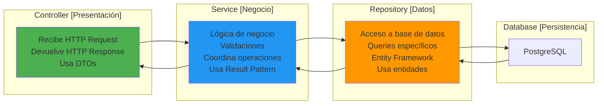

# 7. Repository Pattern

## Índice

[7. Repository Pattern](#7-repository-pattern)
  - [7.1. Qué es el Repository Pattern](#71-qué-es-el-repository-pattern)
  - [7.2. Contratos: Definición de Interfaces](#72-contratos-definición-de-interfaces)
  - [7.3. Implementación con Entity Framework Core](#73-implementación-con-entity-framework-core)
  - [7.4. Unit of Work Implícito](#74-unit-of-work-implícito)
  - [7.5. Separación de Responsabilidades](#75-separación-de-responsabilidades)
  - [7.6. Resumen y Buenas Prácticas](#76-resumen-y-buenas-prácticas)

---

## 7.1. Qué es el Repository Pattern

Imagina que tienes un servicio de productos que necesita obtener datos de la base de datos. Sin un repositorio, el servicio tendría que conocer los detalles de Entity Framework, las cadenas de conexión, y cómo construir queries. Esto acopla tu lógica de negocio a una tecnología específica de persistencia. El repositorio actúa como una capa intermedia que expone métodos simples como "obtener por ID" o "buscar por nombre", ocultando la complejidad del acceso a datos.

### El problema sin Repository Pattern

Sin un repositorio, los servicios contienen lógica de acceso a datos mezclada con lógica de negocio. Esto hace el código difícil de testear porque no puedes facilmente substituir el acceso a base de datos. También hace que cambiar la tecnología de persistencia requiera modificar código en múltiples lugares.

```csharp
// ❌ INCORRECTO: Lógica de datos en el servicio
public class ProductoService
{
    private readonly TiendaDbContext _context;
    
    public ProductoService(TiendaDbContext context)
    {
        _context = context;
    }
    
    public async Task<Producto?> GetById(long id)
    {
        // El servicio conoce detalles de EF Core
        return await _context.Productos.FindAsync(id);
    }
    
    public async Task<List<Producto>> GetByCategoria(long categoriaId)
        // El servicio construye queries manualmente
        => await _context.Productos
            .Where(p => p.CategoriaId == categoriaId)
            .Include(p => p.Categoria)
            .ToListAsync();
    
    public async Task<bool> ExistsByNombre(string nombre)
        // El servicio sabe cómo verificar duplicados
        => await _context.Productos.AnyAsync(p => p.Nombre == nombre);
}
```

### La solución con Repository Pattern

Con el Repository Pattern, el servicio solo conoce la interfaz del repositorio, no su implementación. El repositorio encapsula todo el acceso a datos, exponiendo métodos claros y específicos. Esto hace los servicios más simples, más testables, y la persistencia fácilmente substituible.

```csharp
// ✅ CORRECTO: Repository con interfaz
public interface IProductoRepository
{
    Task<Producto?> FindById(long id);
    Task<List<Producto>> GetAll();
    Task<List<Producto>> GetByCategoriaId(long categoriaId);
    Task<bool> ExistsByNombre(string nombre);
    Task<Producto> Save(Producto producto);
    Task<bool> Delete(long id);
}

public class ProductoRepository : IProductoRepository
{
    private readonly TiendaDbContext _context;
    
    public ProductoRepository(TiendaDbContext context)
    {
        _context = context;
    }
    
    public async Task<Producto?> FindById(long id)
    {
        return await _context.Productos.FindAsync(id);
    }
    
    // Implementación encapsulada aquí...
}

public class ProductoService
{
    private readonly IProductoRepository _repository;
    
    // El servicio solo conoce la interfaz
    public ProductoService(IProductoRepository repository)
    {
        _repository = repository;
    }
    
    public async Task<Producto?> GetById(long id)
    {
        return await _repository.FindById(id);
    }
}
```

### Beneficios del Repository Pattern

```mermaid
flowchart TB
    subgraph "Desacoplamiento"
        A1["Servicios no conocen persistencia"]
        A2["Cambio de base de datos fácil"]
        A3["Interfaces definen contratos"]
    end
    
    subgraph "Testabilidad"
        B1["Mocks/Stubs fácilmente"]
        B2["Tests sin base de datos real"]
        B3["Tests más rápidos"]
    end
    
    subgraph "Mantenibilidad"
        C1["Métodos específicos por entidad"]
        C2["Lógica de queries encapsulada"]
        C3["Código más limpio"]
    end
    
    subgraph "Reusabilidad"
        D1["Queries reutilizables"]
        D2["Lógica de datos centralizada"]
        D3["Consistencia entre servicios"]
    end
    
    A1 --> A2 --> A3
    B1 --> B2 --> B3
    C1 --> C2 --> C3
    D1 --> D2 --> D3
```



---

## 7.2. Contratos: Definición de Interfaces

La interfaz del repositorio define qué operaciones están disponibles para una entidad, sin revelar cómo se implementan. Una buena interfaz es específica para la entidad, tiene métodos con nombres claros, y devuelve tipos que se integran naturalmente con el patrón Result.

### Interfaz de repositorio básico

```csharp
using CSharpFunctionalExtensions;

namespace TiendaApi.Core.Interfaces.IRepositories;

public interface IProductoRepository
{
    // Consultas
    Task<Producto?> FindById(long id);
    Task<List<Producto>> GetAll();
    Task<List<Producto>> GetByCategoriaId(long categoriaId);
    Task<List<Producto>> GetByIds(IEnumerable<long> ids);
    
    // Verificaciones
    Task<bool> ExistsById(long id);
    Task<bool> ExistsByNombre(string nombre);
    Task<bool> ExistsBySku(string sku);
    
    // Búsqueda
    Task<Result<Producto, DomainError>> FindByNombre(string nombre);
    Task<List<Producto>> Search(string termino, int limite = 10);
    
    // Modificación
    Task<Producto> Save(Producto producto);
    Task<Producto> Update(Producto producto);
    Task<bool> Delete(long id);
}
```

### Interfaz con Result Pattern

```csharp
namespace TiendaApi.Core.Interfaces.IRepositories;

public interface IProductoRepository
{
    // Métodos que pueden fallar devuelven Result
    Task<Result<Producto, DomainError>> FindByIdAsync(long id);
    Task<Result<Producto, DomainError>> FindByNombreAsync(string nombre);
    
    // Colecciones con Result
    Task<Result<List<Producto>, DomainError>> GetByCategoriaIdAsync(long categoriaId);
    
    // Verificaciones
    Task<bool> ExistsByIdAsync(long id);
    Task<bool> ExistsByNombreAsync(string nombre);
    
    // Modificación
    Task<Result<Producto, DomainError>> SaveAsync(Producto producto);
    Task<Result<Producto, DomainError>> UpdateAsync(Producto producto);
    Task<UnitResult<DomainError>> DeleteAsync(long id);
}
```

### Interfaz genérica de repositorio

Para evitar repetición, puedes crear un repositorio genérico con las operaciones CRUD básicas:

```csharp
namespace TiendaApi.Core.Interfaces.IRepositories;

public interface IRepository<T> where T : class
{
    Task<T?> FindById(long id);
    Task<List<T>> GetAll();
    Task<T> Save(T entity);
    Task<T> Update(T entity);
    Task<bool> Delete(long id);
}

public interface IProductoRepository : IRepository<Producto>
{
    // Métodos específicos de Producto
    Task<List<Producto>> GetByCategoriaId(long categoriaId);
    Task<List<Producto>> GetByIds(IEnumerable<long> ids);
    Task<bool> ExistsByNombre(string nombre);
    Task<bool> ExistsBySku(string sku);
}
```

---

## 7.3. Implementación con Entity Framework Core

La implementación del repositorio usa Entity Framework Core para interactuar con PostgreSQL. EF Core proporciona métodos asíncronos, change tracking, y queries LINQ que facilitan la implementación.

### Implementación básica del repositorio

```csharp
using Microsoft.EntityFrameworkCore;
using TiendaApi.Core.Interfaces.IRepositories;

namespace TiendaApi.Core.Repositories;

public class ProductoRepository : IProductoRepository
{
    private readonly TiendaDbContext _context;
    private readonly ILogger<ProductoRepository> _logger;

    public ProductoRepository(
        TiendaDbContext context,
        ILogger<ProductoRepository> logger)
    {
        _context = context;
        _logger = logger;
    }

    public async Task<Producto?> FindById(long id)
    {
        _logger.LogDebug("Buscando producto por ID: {Id}", id);
        return await _context.Productos.FindAsync(id);
    }

    public async Task<Result<Producto, DomainError>> FindByIdAsync(long id)
    {
        _logger.LogDebug("Buscando producto por ID: {Id}", id);
        
        var producto = await _context.Productos.FindAsync(id);
        
        if (producto == null)
            return Result.Failure<Producto, DomainError>(
                DomainError.NotFound($"Producto {id} no encontrado"));
        
        return Result.Success<Producto, DomainError>(producto);
    }

    public async Task<List<Producto>> GetAll()
    {
        _logger.LogDebug("Obteniendo todos los productos");
        return await _context.Productos.ToListAsync();
    }

    public async Task<List<Producto>> GetByCategoriaId(long categoriaId)
    {
        _logger.LogDebug("Obteniendo productos por categoría: {CategoriaId}", categoriaId);
        
        return await _context.Productos
            .Where(p => p.CategoriaId == categoriaId)
            .ToListAsync();
    }

    public async Task<bool> ExistsById(long id)
    {
        return await _context.Productos.AnyAsync(p => p.Id == id);
    }

    public async Task<bool> ExistsByNombre(string nombre)
    {
        return await _context.Productos.AnyAsync(p => p.Nombre == nombre);
    }

    public async Task<Result<Producto, DomainError>> SaveAsync(Producto producto)
    {
        _logger.LogInformation("Guardando producto: {Nombre}", producto.Nombre);
        
        _context.Productos.Add(producto);
        
        try
        {
            await _context.SaveChangesAsync();
            return Result.Success<Producto, DomainError>(producto);
        }
        catch (DbUpdateException ex)
        {
            _logger.LogError(ex, "Error al guardar producto: {Nombre}", producto.Nombre);
            return Result.Failure<Producto, DomainError>(
                DomainError.Internal("Error al guardar el producto"));
        }
    }

    public async Task<Result<Producto, DomainError>> UpdateAsync(Producto producto)
    {
        _logger.LogInformation("Actualizando producto: {Id}", producto.Id);
        
        _context.Productos.Update(producto);
        
        try
        {
            await _context.SaveChangesAsync();
            return Result.Success<Producto, DomainError>(producto);
        }
        catch (DbUpdateConcurrencyException ex)
        {
            _logger.LogError(ex, "Concurrencia al actualizar producto: {Id}", producto.Id);
            return Result.Failure<Producto, DomainError>(
                DomainError.Conflict("El producto fue modificado por otro usuario"));
        }
    }

    public async Task<UnitResult<DomainError>> DeleteAsync(long id)
    {
        _logger.LogInformation("Eliminando producto: {Id}", id);
        
        var producto = await _context.Productos.FindAsync(id);
        if (producto == null)
            return UnitResult.Failure<DomainError>(
                DomainError.NotFound($"Producto {id} no encontrado"));
        
        _context.Productos.Remove(producto);
        
        try
        {
            await _context.SaveChangesAsync();
            return UnitResult.Success<DomainError>();
        }
        catch (DbUpdateException ex)
        {
            _logger.LogError(ex, "Error al eliminar producto: {Id}", id);
            return UnitResult.Failure<DomainError>(
                DomainError.Internal("Error al eliminar el producto"));
        }
    }
}
```

### Implementación con consultas complejas

```csharp
public class ProductoRepository : IProductoRepository
{
    public async Task<List<Producto>> GetByCategoriaId(long categoriaId)
    {
        return await _context.Productos
            .Where(p => p.CategoriaId == categoriaId)
            .Include(p => p.Categoria)  // Cargar categoría relacionada
            .OrderBy(p => p.Nombre)
            .ToListAsync();
    }

    public async Task<List<Producto>> GetConStock()
    {
        return await _context.Productos
            .Where(p => p.Stock > 0)
            .OrderBy(p => p.Nombre)
            .ToListAsync();
    }

    public async Task<decimal> GetPrecioPromedio()
    {
        return await _context.Productos
            .AverageAsync(p => p.Precio);
    }

    public async Task<Dictionary<long, int>> GetStockPorCategoria()
    {
        return await _context.Productos
            .GroupBy(p => p.CategoriaId)
            .ToDictionaryAsync(
                g => g.Key,
                g => g.Sum(p => p.Stock));
    }

    public async Task<PagedResult<Producto>> GetPaged(int page, int pageSize)
    {
        var total = await _context.Productos.CountAsync();
        var items = await _context.Productos
            .OrderBy(p => p.Id)
            .Skip((page - 1) * pageSize)
            .Take(pageSize)
            .ToListAsync();
        
        return new PagedResult<Producto>(items, total, page, pageSize);
    }

    public async Task<List<Producto>> Search(string termino, int limite = 10)
    {
        return await _context.Productos
            .Where(p => p.Nombre.Contains(termino) || 
                       p.Descripcion != null && p.Descripcion.Contains(termino))
            .Take(limite)
            .ToListAsync();
    }
}
```

---

## 7.4. Unit of Work Implícito

Entity Framework Core ya implementa el patrón Unit of Work a través del DbContext. El DbContext mantiene un tracker de cambios y SaveChangesAsync persiste todas las modificaciones pendientes en una sola transacción. Esto significa que no necesitas implementar Unit of Work manualmente.

### Cómo DbContext implementa Unit of Work

```csharp
// DbContext actúa como Unit of Work
public class TiendaDbContext : DbContext
{
    public DbSet<Producto> Productos { get; set; } = null!;
    public DbSet<Categoria> Categorias { get; set; } = null!;
    public DbSet<Pedido> Pedidos { get; set; } = null!;
    public DbSet<User> Users { get; set; } = null!;
    
    // SaveChangesAsync() persiste todos los cambios pendientes
    // en una transacción atómica
}
```

```csharp
public class PedidosService
{
    private readonly TiendaDbContext _context;
    
    public PedidosService(TiendaDbContext context)
    {
        _context = context;
    }
    
    public async Task<Pedido> CrearPedido(PedidoCreateDto dto)
    {
        // Múltiples operaciones en una transacción implícita
        var pedido = new Pedido { ClienteId = dto.ClienteId };
        _context.Pedidos.Add(pedido);
        
        foreach (var item in dto.Items)
        {
            var producto = await _context.Productos.FindAsync(item.ProductoId);
            producto!.Stock -= item.Cantidad;
            _context.PedidoItems.Add(new PedidoItem
            {
                Pedido = pedido,
                ProductoId = item.ProductoId,
                Cantidad = item.Cantidad,
                PrecioUnitario = producto.Precio
            });
        }
        
        // SaveChangesAsync persite TODO en una transacción
        await _context.SaveChangesAsync();
        
        return pedido;
    }
}
```

### Transacciones explícitas cuando son necesarias

Aunque DbContext usa transacciones implícitas, a veces necesitas transacciones explícitas que abarquen múltiples operaciones:

```csharp
public class PedidosService
{
    private readonly TiendaDbContext _context;

    public async Task<Pedido> CrearPedidoConTransaccion(PedidoCreateDto dto)
    {
        // Iniciar transacción explícita
        using var transaction = await _context.Database.BeginTransactionAsync();
        
        try
        {
            var pedido = new Pedido { ClienteId = dto.ClienteId };
            _context.Pedidos.Add(pedido);
            
            foreach (var item in dto.Items)
            {
                var producto = await _context.Productos.FindAsync(item.ProductoId);
                producto!.Stock -= item.Cantidad;
            }
            
            await _context.SaveChangesAsync();
            
            // Confirmar transacción
            await transaction.CommitAsync();
            
            return pedido;
        }
        catch (Exception)
        {
            // Revertir si algo falla
            await transaction.RollbackAsync();
            throw;
        }
    }
}
```

---

## 7.5. Separación de Responsabilidades

El Repository Pattern ayuda a mantener claras las responsabilidades de cada capa. Los controladores reciben y devuelven DTOs, los servicios contienen lógica de negocio, y los repositorios encapsulan el acceso a datos. Esta separación hace el código más mantenible y testable.

### Flujo de responsabilidades



### Ejemplo de separación

```csharp
// === CONTROLLER ===
[HttpPost]
public async Task<IActionResult> Create([FromBody] ProductoCreateDto dto)
{
    // El controlador no sabe de base de datos
    var resultado = await _service.CreateAsync(dto);
    
    return resultado.Match(
        producto => CreatedAtAction(nameof(GetById), new { id = producto.Id }, producto),
        error => BadRequest(error));
}

// === SERVICE ===
public async Task<Result<ProductoDto, DomainError>> CreateAsync(ProductoCreateDto dto)
{
    // El servicio no sabe cómo se guarda en la base de datos
    if (await _repository.ExistsByNombreAsync(dto.Nombre))
        return Result.Failure<ProductoDto, DomainError>(
            DomainError.Conflict("Ya existe un producto con ese nombre"));
    
    var producto = dto.ToEntity();
    var resultado = await _repository.SaveAsync(producto);
    
    return resultado.Map(p => p.ToDto());
}

// === REPOSITORY ===
public async Task<Result<Producto, DomainError>> SaveAsync(Producto producto)
{
    // El repositorio no sabe de lógica de negocio
    _context.Productos.Add(producto);
    await _context.SaveChangesAsync();
    return producto;
}
```

---

## 7.6. Resumen y Buenas Prácticas

A lo largo de este documento hemos explorado el Repository Pattern y cómo implementarlo en TiendaApi.

### Puntos clave del módulo

El Repository Pattern abstrae el acceso a datos, desacoplando servicios de la persistencia. Las interfaces definen contratos claros que los servicios consumen. EF Core ya implementa Unit of Work con DbContext. La separación de responsabilidades facilita el testing y mantenimiento.

### Buenas prácticas

```mermaid
flowchart TB
    subgraph "Diseño de Interfaces"
        A1["Métodos específicos por entidad"]
        A2["Nombres claros y descriptivos"]
        A3["Integración con Result Pattern"]
    end
    
    subgraph "Implementación"
        B1["EF Core para persistencia"]
        B2["Métodos asíncronos"]
        B3["Logging de operaciones"]
    end
    
    subgraph "Transacciones"
        C1["DbContext como Unit of Work"]
        C2["Transacciones explícitas cuando necesario"]
        C3["SaveChangesAsync atómico"]
    end
    
    subgraph "Testing"
        D1["Mocks de repositorios"]
        D2["Tests sin base de datos real"]
        D3["Integración con EF Core In-Memory"]
    end
    
    A1 --> A2 --> A3
    B1 --> B2 --> B3
    C1 --> C2 --> C3
    D1 --> D2 --> D3
```



### Siguientes pasos

Con el Repository Pattern dominado, el siguiente paso es aprender sobre los Servicios de Negocio, donde verás cómo organizar la lógica de negocio que coordina repositorios, validación, y Result Pattern.

### Recursos adicionales

- Repository Pattern: https://docs.microsoft.com/previous-versions/msp-n-p/ff649690(v=vs.90)
- EF Core: https://docs.microsoft.com/ef/core/
- Unit of Work: https://docs.microsoft.com/previous-versions/ms179184(v=vs.90)
