# 8. CQRS: Commands y Queries con MediatR

## Índice

[8. CQRS: Commands y Queries con MediatR](#8-cqrs-commands-y-queries-con-mediatr)
  - [8.1. El Problema: Un Servicio que Hace de Todo](#81-el-problema-un-servicio-que-hace-de-todo)
  - [8.2. Qué es CQRS y Por Qué Funciona](#82-qué-es-cqrs-y-por-qué-funciona)
  - [8.3. La Metáfora del Restaurante](#83-la-metáfora-del-restaurante)
  - [8.4. Commands vs Queries: La División Fundamental](#84-commands-vs-queries-la-división-fundamental)
  - [8.5. Anatomía Completa de una Query](#85-anatomía-completa-de-una-query)
  - [8.6. Anatomía Completa de un Command](#86-anatomía-completa-de-un-command)
  - [8.7. Notifications: Efectos Secundarios Desacoplados](#87-notifications-efectos-secundarios-desacoplados)
  - [8.8. El Patrón Mediador: El Camarero del Restaurante](#88-el-patrón-mediador-el-camarero-del-restaurante)
  - [8.9. MediatR en Nuestro Proyecto](#89-mediatr-en-nuestro-proyecto)
  - [8.10. Integración con el Patrón Result](#810-integración-con-el-patrón-result)
  - [8.11. Validación dentro del Handler](#811-validación-dentro-del-handler)
  - [8.12. Cuándo Usar CQRS y Cuándo No](#812-cuándo-usar-cqrs-y-cuándo-no)
  - [8.13. Ventajas y Desventajas Reales](#813-ventajas-y-desventajas-reales)
  - [8.14. Resumen y Siguientes Pasos](#814-resumen-y-siguientes-pasos)
  - [8.15. CQRS con Múltiples Bases de Datos (Teórico)](#815-cqrs-con-múltiples-bases-de-datos-teórico)

---

## 8.1. El Problema: Un Servicio que Hace de Todo

Imaginemos que eres el gerente de un restaurante y contratas a un chef que hace absolutely todo: preparar los platos, limpiar la cocina, hacer la compra, atender a los clientes, cobrar las cuentas y gestionar la nómina. Parece absurdo, ¿verdad? Sin embargo, esto es exactamente lo que ocurre en muchos proyectos de software cuando tenemos un `ProductoService` gigante que hace de todo.

### El típico Service Layer que crece sin control

En un proyecto tradicional, nuestro `ProductoService` podría tener 30, 40, incluso 50 métodos:

```csharp
public class ProductoService
{
    // Métodos de consulta
    Task<List<ProductoDto>> GetAllAsync();
    Task<ProductoDto?> GetByIdAsync(long id);
    Task<List<ProductoDto>> GetByCategoriaAsync(long categoriaId);
    Task<List<ProductoDto>> GetByNombreAsync(string nombre);
    Task<PagedResult<ProductoDto>> GetPagedAsync(int page, int size);
    Task<List<ProductoDto>> GetConStockAsync();
    Task<List<ProductoDto>> GetSinStockAsync();
    Task<bool> ExistsByNombreAsync(string nombre);
    
    // Métodos de escritura
    Task<ProductoDto> CreateAsync(ProductoCreateDto dto);
    Task<ProductoDto> UpdateAsync(long id, ProductoUpdateDto dto);
    Task<ProductoDto> UpdateStockAsync(long id, int cantidad);
    Task<ProductoDto> UpdatePrecioAsync(long id, decimal precio);
    Task<ProductoDto> UpdateImageAsync(long id, string imagen);
    Task DeleteAsync(long id);
    Task RestoreAsync(long id);
    
    // Métodos mixtos
    Task<ProductoDto> CreateWithValidationAsync(ProductoCreateDto dto);
    Task<List<ProductoDto>> BuscarYFiltrarAsync(ProductoFilterDto filter);
    Task<decimal> CalcularTotalAsync(List<long> productoIds);
}
```

### Los problemas que esto genera

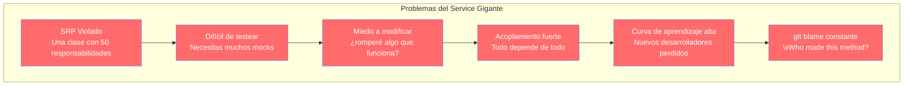

**Problema 1**: Cada método tiene diferentes dependencias. Para testear `GetById` necesitas solo el repositorio, pero para `CreateAsync` necesitas repositorio, validador, mapper, cache, signalR, email... ¡30 mocks para un solo test!

**Problema 2**: Cuando modificas `UpdateStockAsync` para оптимизировать el rendimiento, ¿cómo sabes que no estás rompiendo algo en `CreateAsync` que usa el mismo método internamente?

**Problema 3**: Un nuevo desarrollador tiene que entender los 50 métodos antes de hacer su primer cambio. "¿Qué hace este método? ¿Por qué tiene esta dependencia? ¿Puedo cambiarlo?"

### El antipatrón del "Methioditis"

Este fenómeno tiene un nombre en la comunidad: el **Service Class Anti-Pattern** o como algunos llaman, "Methioditis" - la enfermedad de tener mil métodos en una clase. Es como tener un cajón donde guardas calcetines, llaves, documentos, cargadores y comida leftover. Cuando necesitas algo, tienes que rebuscar entre todo.

---

## 8.2. Qué es CQRS y Por Qué Funciona

**CQRS** son las siglas de **Command Query Responsibility Segregation** (Segregación de Responsabilidad de Comandos y Consultas). El nombre suena a concepto académico sofisticado, pero la idea es sorprendentemente simple: **separar las operaciones de lectura de las operaciones de escritura**.

### La revelación simple

En lugar de tener un servicio que haga todo, vamos a tener:

- **Commands** (Comandos): operaciones que cambian el estado del sistema (crear, actualizar, eliminar)
- **Queries** (Consultas): operaciones que solo leen el estado del sistema (obtener, buscar, filtrar)

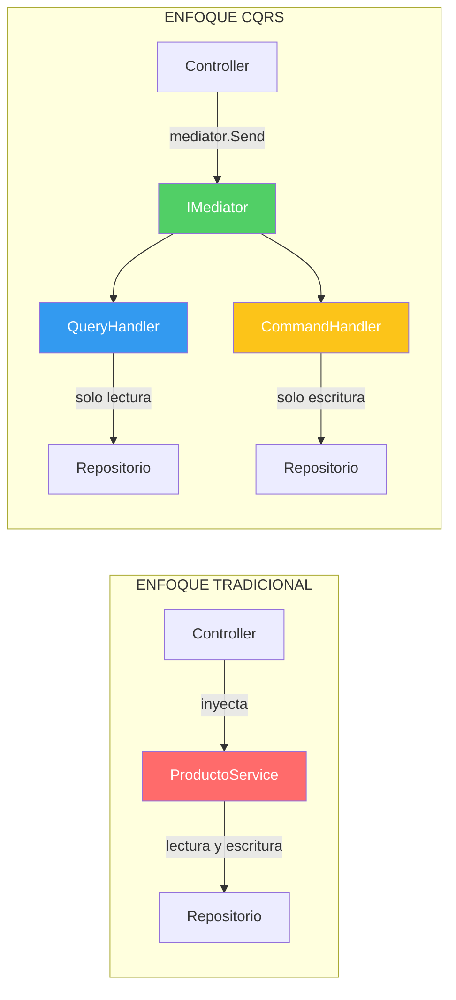

### ¿Por qué funciona? El principio de única responsabilidad

Cada handler hace **exactamente una cosa**. El `GetProductoByIdQueryHandler` solo sabe cómo obtener un producto por su ID. No le importa validar, no le importa enviar emails, no le importa actualizar el stock. Solo eso.

Cuando algo falla o necesita modificación, sabes exactamente dónde buscar. ¿El problema está en obtener productos? Vas a `GetProductoByIdQueryHandler`. ¿El problema está en crear productos? Vas a `CreateProductoCommandHandler`.

### La regla de oro: Commands no pueden devolver datos

Un command puede ejecutarse correctamente o fallar, pero **nunca** debe devolver datos de lectura. Esta regla parece restrictiva, pero tiene una razón profunda: si necesitas datos después de un command, probablemente sea porque deberías haber hecho primero una query.

```csharp
// ❌ INCORRECTO: Command que devuelve datos
public record CreateProductoCommand(ProductoDto Dto)
    : IRequest<ProductoDto>;  // NO HACER ESTO

// ✅ CORRECTO: Command sin retorno (o con ID mínimo)
public record CreateProductoCommand(ProductoDto Dto)
    : IRequest<Result<ProductoDto, DomainError>>;  // Devuelve el DTO creado
    
// O si solo necesitas saber si funcionó:
public record DeleteProductoCommand(long Id)
    : IRequest<UnitResult<DomainError>>;  // Solo indica éxito/fracaso
```

---

## 8.3. La Metáfora del Restaurante

Permíteme explicarte CQRS con una metáfora que uso en clase y que los estudiantes siempre entienden.

### El restaurante tradicional

En un restaurante pequeño (tu aplicación Monolithic tradicional), el chef hace de todo:

- Cocina los platos
- Prepara las bebidas
- Lava los platos
- Recibe a los clientes
- Cobra las cuentas

Funciona mientras el restaurante sea pequeño. Pero cuando crece, el chef seburnout y el servicio empeora.

### El restaurante con CQRS (especialización)

En un restaurante bien organizado, cada persona tiene un rol claro:

- **Camareros** (Queries): Solo atienden a los clientes, les traen el menú, anotan pedidos, traen la comida. No cocinan, no lavan.
- **Cocineros** (Commands): Solo cocinan. Reciben la orden del camarero, preparan la comida, la entregan. No cobran, no limpian.
- **Cajas** (resultado del command): Solo procesan el pago al final.

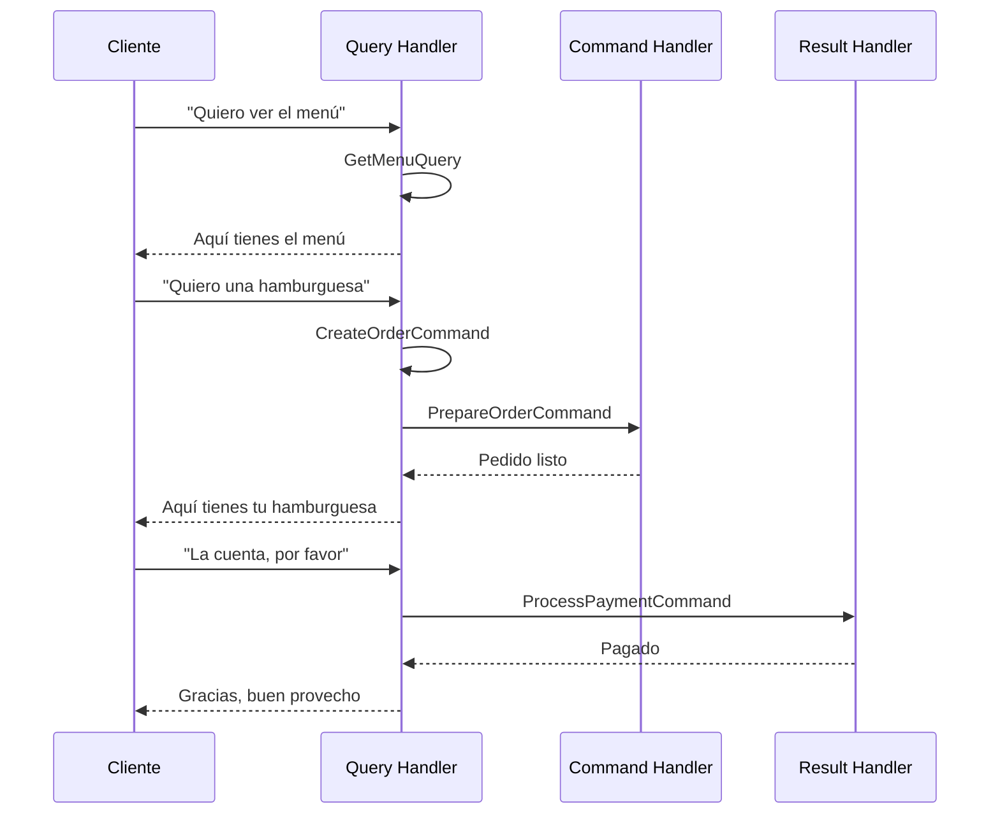

### ¿Por qué es mejor así?

1. **Si el chef está enfermo**: Los camareros siguen atendiendo. Los clientes pueden ver el menú y hacer pedidos (que se guardan para después). Tu aplicación sigue funcionando.

2. **Si necesitas optimizar**: Puedes poner más cocineros para pedidos rápidos, pero seguir con los mismos camareros si la velocidad no es crítica.

3. **Si algo falla**: Si un cliente se queja de la comida, sabes exactamente a quién preguntar. No tienes que investigar qué persona hizo qué.

4. **Si quieres escalar**: Puedes poner más servidores paraQueries (lectura) que para Commands (escritura) si tus clientes leen más de lo que escriben.

---

## 8.4. Commands vs Queries: La División Fundamental

Vamos a formalizar la diferencia entre Commands y Queries, porque es el corazón de CQRS.

### Commands: Operaciones que modifican el estado

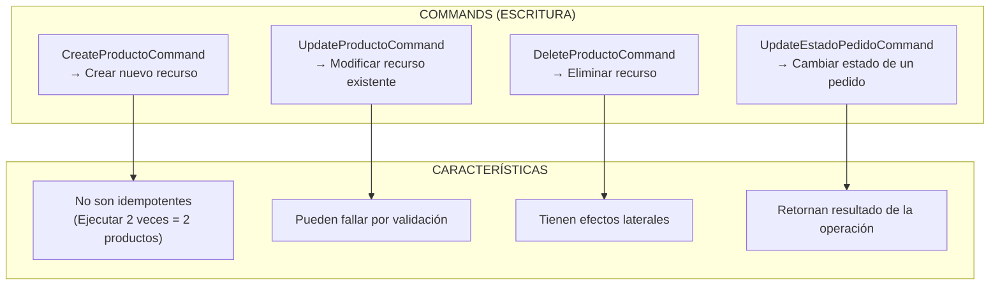

**Características de los Commands**:
- **C**: Create (crear)
- **U**: Update (actualizar)
- **D**: Delete (eliminar)
- Pueden ejecutar lógica de negocio
- Deben validar datos antes de proceder
- Pueden tener efectos secundarios (enviar email, actualizar cache, notificar por SignalR)
- Retornan el recurso creado/modificado o un error

### Queries: Operaciones que solo leen el estado

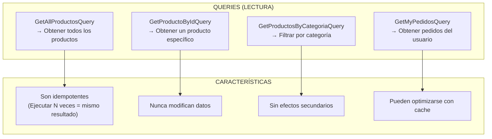

**Características de las Queries**:
- **R**: Read (leer)
- Siempre devuelven datos, nunca modifican
- Se pueden ejecutar N veces sin efectos adversos
- Pueden usar `AsNoTracking()` en EF Core (optimización)
- Se pueden cachear agresivamente

### Tabla comparativa rápida

| Aspecto | Command | Query |
|---------|---------|-------|
| **Propósito** | Cambiar estado | Leer estado |
| **Idempotencia** | No (generalmente) | Sí |
| **Efectos secundarios** | Sí | No |
| **Retorno** | Result con datos o error | Datos o vacío |
| **Optimización** | Transacciones | Cache, índices |
| **Errores** | Validación, negocio | No encontrado |

---

## 8.5. Anatomía Completa de una Query

Ahora vamos a ver una Query real de nuestro proyecto, paso a paso, para entender cómo funciona en la práctica.

### Estructura de una Query

```csharp
// 1. LA PETICIÓN (el "qué quiero")
// Un record simple que representa la solicitud
public record GetProductoByIdQuery(long Id)
    : IRequest<Result<ProductoDto, DomainError>>;

// 2. EL HANDLER (el "cómo lo get")
// Implementa IRequestHandler<Request, Response>
public class GetProductoByIdQueryHandler(
    IProductoRepository repository,
    ILogger<GetProductoByIdQueryHandler> logger)
    : IRequestHandler<GetProductoByIdQuery, Result<ProductoDto, DomainError>>
{
    public async Task<Result<ProductoDto, DomainError>> Handle(
        GetProductoByIdQuery request,
        CancellationToken cancellationToken)
    {
        logger.LogInformation("Buscando producto con ID: {Id}", request.Id);
        
        var producto = await repository.FindByIdAsync(request.Id);
        
        return producto is null
            ? Result.Failure<ProductoDto, DomainError>(ProductoError.NotFound(request.Id))
            : Result.Success<ProductoDto, DomainError>(producto.ToDto());
    }
}
```

### Partes de la Query

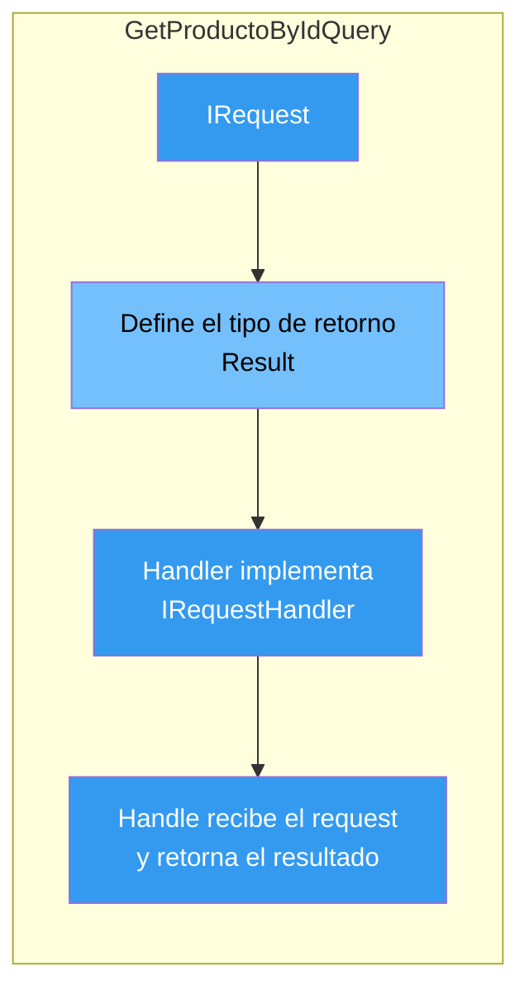

### Query con filtros complejos

Las Queries también pueden recibir filtros complejos:

```csharp
// Query con filtros para paginación y búsqueda
public record GetAllProductosQuery(ProductoFilterDto Filter)
    : IRequest<Result<PagedResult<ProductoDto>, DomainError>>;

public class GetAllProductosQueryHandler(
    IProductoRepository repository,
    ICacheService cache,
    ILogger<GetAllProductosQueryHandler> logger)
    : IRequestHandler<GetAllProductosQuery, Result<PagedResult<ProductoDto>, DomainError>>
{
    public async Task<Result<PagedResult<ProductoDto>, DomainError>> Handle(
        GetAllProductosQuery request,
        CancellationToken cancellationToken)
    {
        // Construir clave de cache basada en filtros
        var cacheKey = $"productos:{request.Filter.Page}:{request.Filter.Size}";
        
        // Intentar obtener de cache
        var cached = await cache.GetAsync<PagedResult<ProductoDto>>(cacheKey);
        if (cached is not null)
            return Result.Success<PagedResult<ProductoDto>, DomainError>(cached);
        
        // Query a base de datos con filtros
        var productos = await repository.GetAllAsync(request.Filter);
        
        // Guardar en cache
        await cache.SetAsync(cacheKey, productos, TimeSpan.FromMinutes(5));
        
        return Result.Success<PagedResult<ProductoDto>, DomainError>(productos);
    }
}
```

### Secuencia de ejecución de una Query

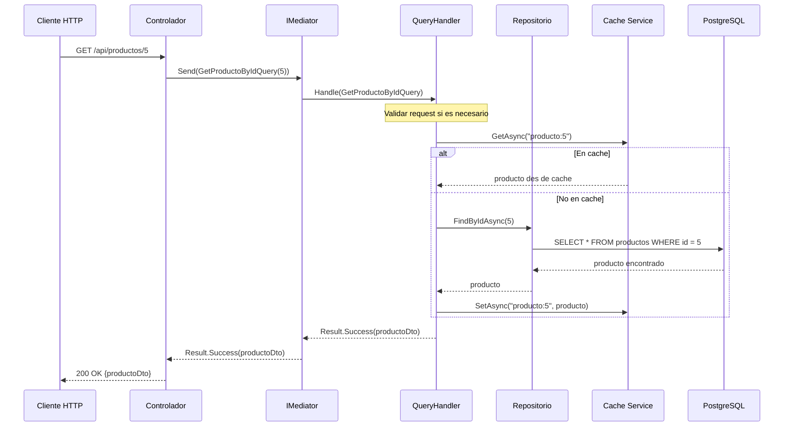

---

## 8.6. Anatomía Completa de un Command

Los Commands son más complejos porque incluyen validación, lógica de negocio, y posiblemente efectos secundarios.

### Estructura de un Command

```csharp
// 1. LA PETICIÓN (datos necesarios para la operación)
public record CreateProductoCommand(ProductoRequestDto Dto)
    : IRequest<Result<ProductoDto, DomainError>>;

// 2. EL HANDLER (lógica completa de creación)
public class CreateProductoCommandHandler(
    IProductoRepository repository,
    IValidator<ProductoRequestDto> validator,
    IMediator mediator,
    ILogger<CreateProductoCommandHandler> logger)
    : IRequestHandler<CreateProductoCommand, Result<ProductoDto, DomainError>>
{
    public async Task<Result<ProductoDto, DomainError>> Handle(
        CreateProductoCommand request,
        CancellationToken cancellationToken)
    {
        // Paso 1: Validar los datos de entrada
        var validationResult = await validator.ValidateAsync(request.Dto, cancellationToken);
        
        if (!validationResult.IsValid)
        {
            var errores = validationResult.Errors
                .GroupBy(e => e.PropertyName)
                .ToDictionary(g => g.Key, g => g.Select(e => e.ErrorMessage).ToArray());
            
            return Result.Failure<ProductoDto, DomainError>(
                ProductoError.ValidacionConCampos(errores));
        }
        
        // Paso 2: Verificar reglas de negocio
        var existente = await repository.ExistsByNombreAsync(request.Dto.Nombre);
        if (existente)
        {
            return Result.Failure<ProductoDto, DomainError>(
                ProductoError.NombreDuplicado(request.Dto.Nombre));
        }
        
        // Paso 3: Ejecutar la operación
        var producto = request.Dto.ToEntity();
        var saved = await repository.SaveAsync(producto);
        
        // Paso 4: Publicar evento (efecto secundario)
        await mediator.Publish(new ProductoCreadoNotification(saved.ToDto()), cancellationToken);
        
        logger.LogInformation("Producto creado: {Nombre}", saved.Nombre);
        
        // Paso 5: Retornar resultado
return Result.Success<ProductoDto, DomainError>(saved.ToDto());
    }
}
```

## 8.7. Notifications: Efectos Secundarios Desacoplados

La magia de CQRS está en separar los efectos secundarios usando **Notifications** (también llamados **Eventos de Dominio**).

### ⚠️ Antes de continuar: ¿Notifications o Eventos?

Esta es una pregunta común: "¿Son lo mismo Notifications y Eventos?"

**La respuesta corta**: Sí, son fundamentalmente lo mismo. La diferencia es solo de terminología:

| Término | Origen | En este documento |
|---------|--------|-------------------|
| **Domain Events / Eventos de Dominio** | Concepto de DDD (Domain-Driven Design) | El concepto/teoría |
| **Notifications** | Nombre específico de MediatR | La implementación práctica |

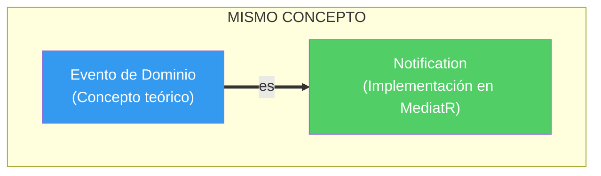

En la práctica:
- Cuando uso `ProductoCreadoNotification`, estoy creando un **Evento de Dominio**
- MediatR lo llama "Notification", pero su propósito es exactamente el mismo que los Domain Events en DDD

Así que cuando veas "Notification" en este documento, piensa: "es un Evento de Dominio implementado con MediatR".

---

### ¿Qué es una Notification / Evento de Dominio?

Una **Notification** (o Evento de Dominio) representa **"algo que ocurrió"** en el sistema que puede ser interesante para otras partes del código.

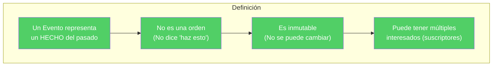

**Ejemplos concretos**:

| Notification | Representa | ¿Quién la crea? |
|-------------|-------------|------------------|
| `UsuarioRegistradoNotification` | "El usuario se registró" | CreateUserCommandHandler |
| `ProductoCreadoNotification` | "El producto fue creado" | CreateProductoCommandHandler |
| `PedidoCanceladoNotification` | "El pedido fue cancelado" | UpdatePedidoCommandHandler |

**Nombre correcto**: Los eventos siempre se nombran en **pasado** (ya que representan algo que ocurrió).

```csharp
// ✅ CORRECTO: Nombre en pasado
public record ProductoCreadoNotification
public record PedidoCanceladoNotification

// ❌ INCORRECTO: Nombre en presente/futuro (parece un comando)
public record ProductoCreateNotification
public record CancelPedidoNotification
```

---

### ¿Por qué existen? El problema que resuelven

Imagina que al crear un producto quieres hacer varias cosas:

```csharp
// ❌ PROBLEMA: Handler con efectos secundarios acoplados
public class CreateProductoCommandHandler
{
    public async Task Handle(CreateProductoCommand cmd)
    {
        // 1. Guardar el producto (lógica principal)
        await _repository.SaveAsync(cmd.Dto.ToEntity());
        
        // 2. Enviar email al admin (efecto secundario)
        await _emailService.SendAsync(...);
        
        // 3. Notificar por SignalR (efecto secundario)
        await _hubContext.Clients.All.SendAsync(...);
        
        // 4. Invalidar cache (efecto secundario)
        await _cache.RemoveAsync("productos");
        
        // 5. Registrar métricas (efecto secundario)
        await _metrics.RecordAsync("producto_creado");
    }
}
```

**Problemas de este enfoque**:
- El handler conoce 5 servicios diferentes ✅
- Si agregas WhatsApp, tienes que modificar este handler ❌
- Para testear, necesitas mockear 5 servicios ❌
- Si el email falla, falla todo el comando ❌

**La solución con Notifications**:

```csharp
// ✅ SOLUCIÓN: Handler solo hace lo principal
public class CreateProductoCommandHandler
{
    public async Task Handle(CreateProductoCommand cmd, CancellationToken ct)
    {
        await _repository.SaveAsync(cmd.Dto.ToEntity());
        
        // Solo publica un evento, NO llama a servicios directamente
        await _mediator.Publish(new ProductoCreadoNotification(producto), ct);
    }
}
```

```csharp
// Los efectos secundarios están en handlers SEPARADOS

// Handler 1: Email
public class ProductoCreadoEmailHandler : INotificationHandler<ProductoCreadoNotification>
{
    public Task Handle(...) => await _emailService.SendAsync(...);
}

// Handler 2: SignalR
public class ProductoCreadoSignalRHandler : INotificationHandler<ProductoCreadoNotification>
{
    public Task Handle(...) => await _hubContext.Clients.All.SendAsync(...);
}

// Handler 3: Cache
public class ProductoCreadoCacheHandler : INotificationHandler<ProductoCreadoNotification>
{
    public Task Handle(...) => await _cache.RemoveAsync(...);
}

// Handler 4: WhatsApp (AGREGAR SIN MODIFICAR NADA EXISTENTE)
public class ProductoCreadoWhatsAppHandler : INotificationHandler<ProductoCreadoNotification>
{
    public Task Handle(...) => await _whatsApp.SendAsync(...);
}
```

---

### ¿Cuándo usar Notifications?

Usa una notification cuando:

| Situación | Ejemplo |
|-----------|---------|
| **Algo se creó** | Usuario registrado, Pedido creado |
| **Algo se actualizó** | Estado de pedido cambiado |
| **Algo se eliminó** | Producto dado de baja |
| **Algo significativo ocurrió** | Login fallido, Stock bajo |

**NO uses** notifications para:
- Cosas que el usuario espera como respuesta directa
- Operaciones que deben completar dentro de la misma transacción

---

### Diagrama: Importancia de los Eventos de Dominio en MediatR

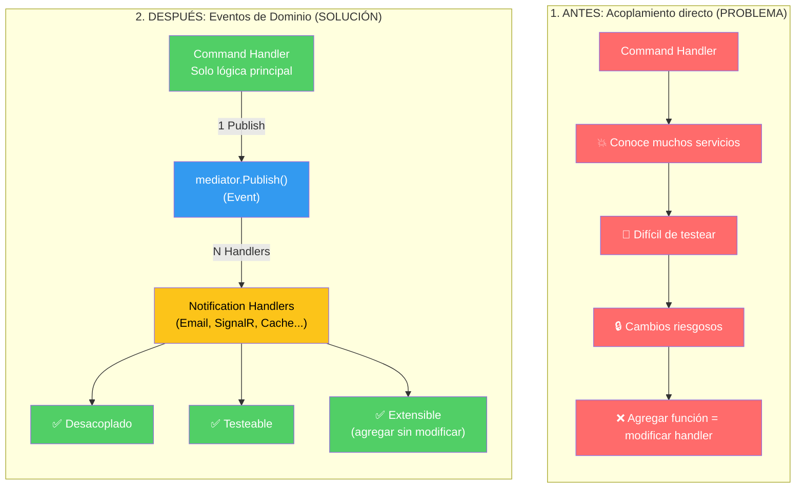

---

### Diagrama: Cómo funcionan los Eventos en MediatR

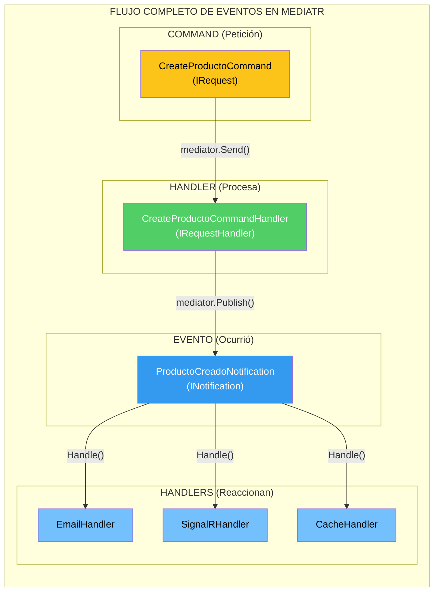

---

### Diagrama de Secuencia: El flujo completo

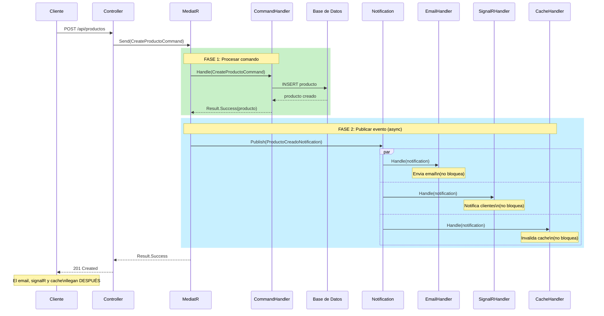

---

### Diferencia clave: Request vs Notification

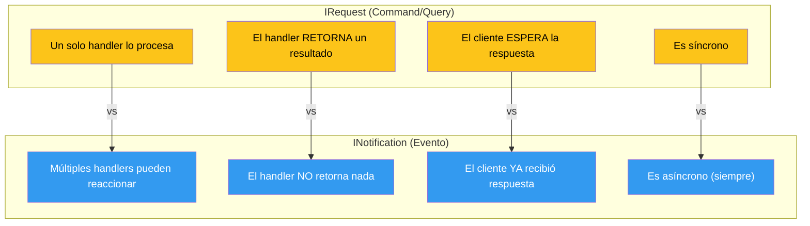

---

### Ejemplo real de la vida: El sistema de pedidos

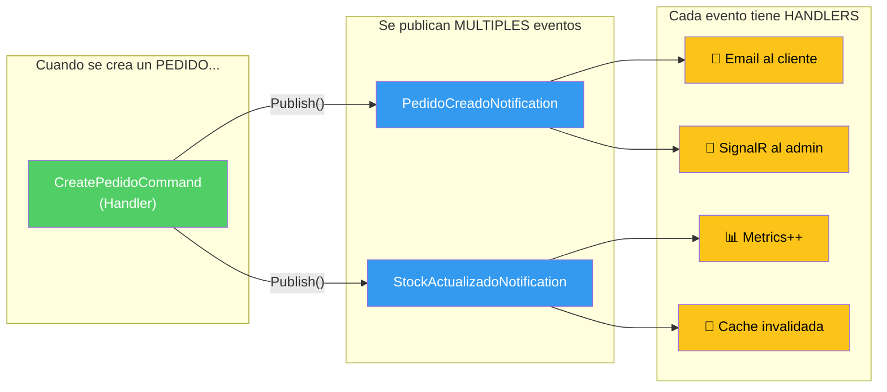

**Cada notificación es independiente**: Si quieres agregar WhatsApp, solo agregas un nuevo handler, NO tocas nada del CommandHandler ni de los otros handlers.

---

### Resumen: Effects secundarios con Notifications

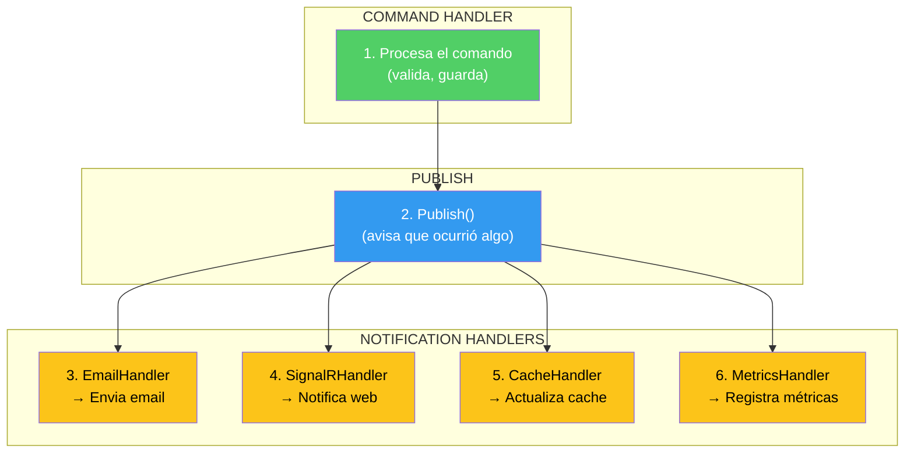

**Puntos clave**:
1. El handler **no conoce** los efectos secundarios
2. Cada notification handler **es independiente**
3. Los handlers **se ejecutan en paralelo** (no bloquean)
4. Agregar nuevos efectos = **crear nuevo archivo**, no modificar handler

---

### Secuencia de ejecución de un Command

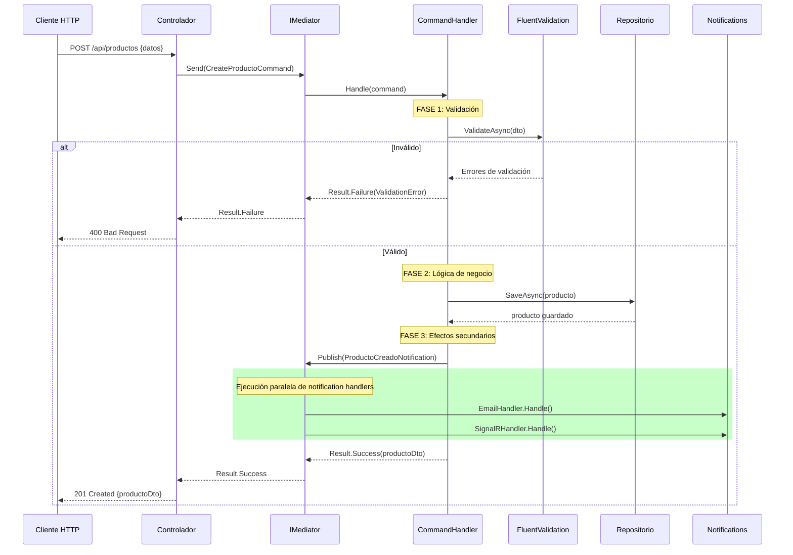

---

## 8.8. El Patrón Mediador: El Camarero del Restaurante

Ahora entiendes por qué existe el patrón mediador: es el "camarero" que recibe pedidos de los clientes y los lleva a los cocineros sin que el cliente necesite saber quién cocina qué.

### ¿Qué es el patrón Mediador?

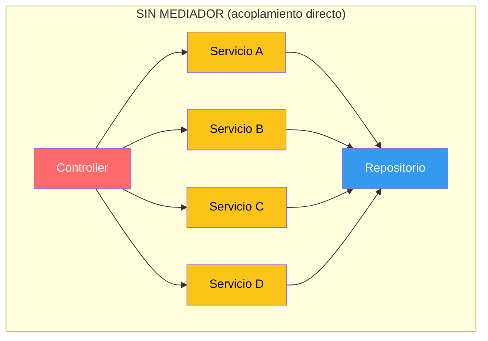

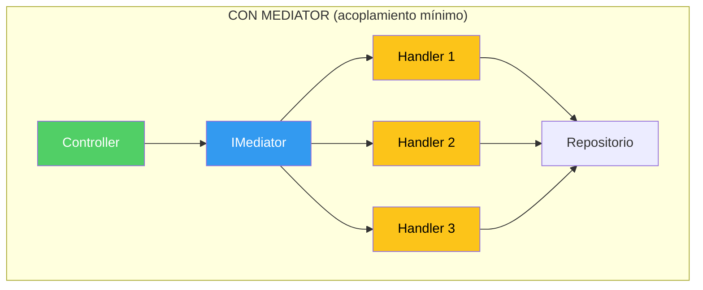

El controlador **no conoce** a los handlers. Solo conoce al mediador. El mediador sabe qué handler debe recibir cada tipo de mensaje.

### ¿Por qué es útil el mediador?

**Beneficio 1**: Desacoplamiento total

```csharp
// El controlador NO sabe qué servicios existen
// Solo sabe que puede enviar mensajes al mediador
public class ProductosController(IMediator mediator) : ControllerBase
{
    [HttpPost]
    public async Task<IActionResult> Create([FromBody] ProductoRequestDto dto)
    {
        // Solo envía el comando, no conoce el handler
        var result = await mediator.Send(new CreateProductoCommand(dto));
        
        return result.Match(
            onSuccess: p => CreatedAtAction(nameof(GetById), new { id = p.Id }, p),
            onFailure: e => BadRequest(new { message = e.Message })
        );
    }
}
```

**Beneficio 2**: Fácil de testear

```csharp
// Test: solo necesitas mockear IMediator
[Fact]
public async Task Create_ValidData_ReturnsCreated()
{
    // Arrange
    var mockMediator = new Mock<IMediator>();
    var controller = new ProductosController(mockMediator.Object);
    
    // Configurar el mock para retornar éxito
    mockMediator
        .Setup(m => m.Send(It.IsAny<CreateProductoCommand>(), It.IsAny<CancellationToken>()))
        .ReturnsAsync(Result.Success<ProductoDto, DomainError>(new ProductoDto { Id = 1 }));
    
    // Act
    var result = await controller.Create(new ProductoRequestDto { Nombre = "Test" });
    
    // Assert
    Assert.IsType<CreatedAtActionResult>(result);
}
```

**Beneficio 3**: Pipeline behaviors

Puedes agregar comportamientos que se ejecutan antes/después de TODOS los handlers:

```csharp
// Ejemplo: Logging Behavior
public class LoggingBehavior<TRequest, TResponse>
    : IPipelineBehavior<TRequest, TResponse>
    where TRequest : notnull
{
    private readonly ILogger<LoggingBehavior<TRequest, TResponse>> _logger;
    
    public async Task<TResponse> Handle(
        TRequest request,
        RequestHandlerDelegate<TResponse> next,
        CancellationToken cancellationToken)
    {
        var requestName = typeof(TRequest).Name;
        
        _logger.LogInformation("Iniciando request: {RequestName}", requestName);
        
        var startTime = DateTime.UtcNow;
        
        var response = await next();
        
        var duration = DateTime.UtcNow - startTime;
        _logger.LogInformation("Request {RequestName} completada en {Duration}ms", 
            requestName, duration.TotalMilliseconds);
        
        return response;
    }
}
```

---

## 8.9. MediatR en Nuestro Proyecto

Veamos cómo está configurado MediatR en nuestra aplicación y cómo usarlo correctamente.

### Instalación

```bash
dotnet add package MediatR
```

### Configuración en Program.cs

```csharp
// Infrastructures/MediatRConfig.cs
public static class MediatRConfig
{
    public static IServiceCollection AddMediatRHandlers(this IServiceCollection services)
    {
        // Registra todos los handlers del ensamblado automáticamente
        services.AddMediatR(cfg =>
            cfg.RegisterServicesFromAssemblyContaining<Program>());
        
        return services;
    }
}
```

### Registro en Program.cs

```csharp
var builder = WebApplication.CreateBuilder(args);

// ... otras configuraciones ...

builder.Services.AddMediatRHandlers();

var app = builder.Build();
```

### Estructura de archivos recomendada

```
Features/
├── Productos/
│   ├── Commands/
│   │   ├── CreateProductoCommand.cs
│   │   ├── UpdateProductoCommand.cs
│   │   └── DeleteProductoCommand.cs
│   ├── Queries/
│   │   ├── GetAllProductosQuery.cs
│   │   ├── GetProductoByIdQuery.cs
│   │   └── GetProductosByCategoriaQuery.cs
│   └── Notifications/
│       ├── ProductoCreadoNotification.cs
│       └── ProductoEliminadoNotification.cs
├── Pedidos/
│   ├── Commands/
│   ├── Queries/
│   └── Notifications/
└── Usuarios/
    ├── Commands/
    ├── Queries/
    └── Notifications/
```

### Convención de nombres

| Tipo | Naming Convention | Ejemplo |
|------|-------------------|---------|
| Request (Command) | `Create{Entidad}Command` | `CreateProductoCommand` |
| Request (Query) | `Get{Entidad}Query` | `GetProductoByIdQuery` |
| Handler (Command) | `{Request}Handler` | `CreateProductoCommandHandler` |
| Handler (Query) | `{Request}Handler` | `GetProductoByIdQueryHandler` |
| Notification | `{Evento}Notification` | `ProductoCreadoNotification` |

---

## 8.10. Integración con el Patrón Result

Los handlers de MediatR trabajan perfectamente con el Patrón Result que aprendimos en el capítulo anterior. Esta combinación es poderosa porque:

1. El handler puede retornar éxito o fracaso de forma explícita
2. El controlador puede usar `Match` para convertir el resultado en respuestas HTTP
3. Los errores están tipados y son fáciles de manejar

### Handler con Result

```csharp
public class GetProductoByIdQueryHandler(
    IProductoRepository repository)
    : IRequestHandler<GetProductoByIdQuery, Result<ProductoDto, DomainError>>
{
    public async Task<Result<ProductoDto, DomainError>> Handle(
        GetProductoByIdQuery request,
        CancellationToken cancellationToken)
    {
        var producto = await repository.FindByIdAsync(request.Id);
        
        // Retorna Success o Failure explícitamente
        return producto is null
            ? Result.Failure<ProductoDto, DomainError>(ProductoError.NotFound(request.Id))
            : Result.Success<ProductoDto, DomainError>(producto.ToDto());
    }
}
```

### Controller con Match

```csharp
public class ProductosController(IMediator mediator) : ControllerBase
{
    [HttpGet("{id}")]
    public async Task<IActionResult> GetById(long id)
    {
        var resultado = await mediator.Send(new GetProductoByIdQuery(id));
        
        // Match convierte Result a IActionResult
        return resultado.Match(
            onSuccess: producto => Ok(producto),
            onFailure: error => error switch
            {
                NotFoundError => NotFound(new { message = error.Message }),
                _ => StatusCode(500, new { message = "Error interno" })
            }
        );
    }
}
```

### Tipos de retorno en handlers

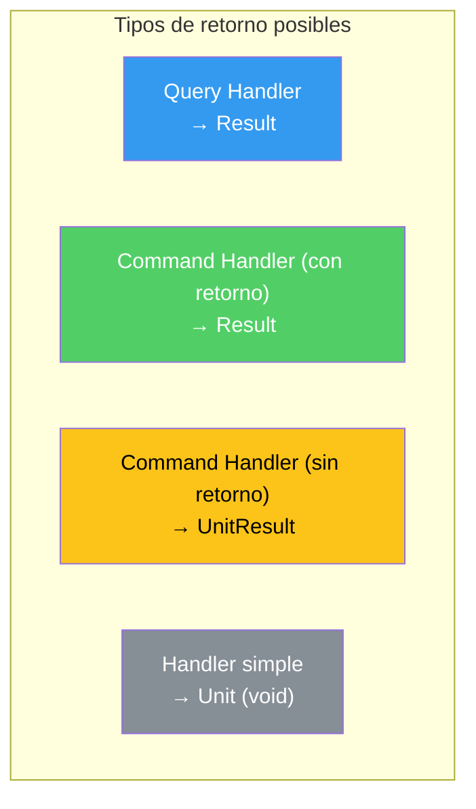

---

## 8.11. Validación dentro del Handler

Una de las ventajas de CQRS es que la validación puede vivir junto al command, haciendo el código más coherente.

### Con FluentValidation

```csharp
public class CreateProductoCommandValidator
    : AbstractValidator<ProductoRequestDto>
{
    public CreateProductoCommandValidator()
    {
        RuleFor(x => x.Nombre)
            .NotEmpty().WithMessage("El nombre es obligatorio")
            .MaximumLength(200).WithMessage("El nombre no puede exceder 200 caracteres");
            
        RuleFor(x => x.Precio)
            .GreaterThan(0).WithMessage("El precio debe ser mayor que cero")
            .LessThan(999999).WithMessage("El precio no puede exceder 999999");
            
        RuleFor(x => x.Stock)
            .GreaterThanOrEqualTo(0).WithMessage("El stock no puede ser negativo");
            
        RuleFor(x => x.CategoriaId)
            .GreaterThan(0).WithMessage("La categoría es obligatoria");
    }
}

// En el handler, se usa automáticamente si está registrado
public class CreateProductoCommandHandler(
    IProductoRepository repository,
    IValidator<ProductoRequestDto> validator)  // Inyectado automáticamente
    : IRequestHandler<CreateProductoCommand, Result<ProductoDto, DomainError>>
{
    public async Task<Result<ProductoDto, DomainError>> Handle(
        CreateProductoCommand request,
        CancellationToken cancellationToken)
    {
        // El validator se inyecta y usa
        var validationResult = await validator.ValidateAsync(request.Dto, cancellationToken);
        
        if (!validationResult.IsValid)
        {
            // Convertir errores de FluentValidation a nuestro formato
            var errores = validationResult.Errors
                .GroupBy(e => e.PropertyName)
                .ToDictionary(g => g.Key, g => g.Select(e => e.ErrorMessage).ToArray());
                
            return Result.Failure<ProductoDto, DomainError>(
                ProductoError.ValidacionConCampos(errores));
        }
        
        // Continuar con la lógica...
    }
}
```

### Por qué la validación en el handler es mejor

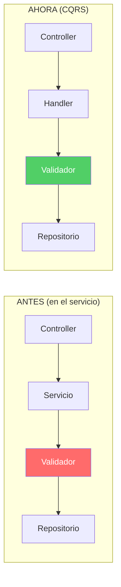

| Aspecto | Validación en Servicio | Validación en Handler |
|---------|------------------------|----------------------|
| **Ubicación** | Lejos del command | Junto al command |
| **Descubrimiento** | ¿Dónde está la validación de esta operación? | Todo en el mismo archivo |
| **Reutilización** | Diferentes servicios pueden tener diferentes reglas | Cada command tiene sus reglas |
| **Testing** | Necesitas testear el servicio completo | Solo testear el handler |

---

## 8.12. Cuándo Usar CQRS y Cuándo No

CQRS no es la solución perfecta para todo. Vamos a ser honestos sobre cuándo usarlo y cuándo no.

### Cuándo SÍ usar CQRS

✅ **Sistema con múltiples operaciones complejas**
Si tienes operaciones que incluyen validación, reglas de negocio, y efectos secundarios, CQRS ayuda a organizarlo.

✅ **Equipo grande trabajando en el mismo código**
Cuando 10 desarrolladores modifican el mismo código, la separación clara de responsabilidades reduce conflictos.

✅ **Necesidad de escalar lecturas y escrituras independientemente**
Si tu aplicación tiene 90% lecturas y 10% escrituras, puedes optimizar cada parte por separado.

✅ **Sistema con múltiples efectos secundarios**
Cuando una operación necesita enviar emails, notifications, actualizar cache, logs, etc.

✅ **Necesidad de auditoría**
Cada command es una operación atómica que se puede rastrear fácilmente.

### Cuándo NO usar CQRS

❌ **CRUD simple**
Si tu aplicación es básica Create/Read/Update/Delete sin lógica compleja, CQRS añade complejidad innecesaria.

❌ **Prototipo o proyecto pequeño**
Para una prueba de concepto o proyecto con 3-4 endpoints, el overhead de CQRS no vale la pena.

❌ **Equipo sin experiencia en patrones**
Si el equipo no está familiarizado con CQRS, la curva de aprendizaje puede ser un problema.

❌ **Sistema con requisitos simples**
 "¿Para qué necesito mediador si mi endpoint hace un simple INSERT?"

### La regla del pulgar

> "Si tienes que explicar CQRS a tu cliente, probablemente no lo necesitas para ese proyecto."

CQRS es una herramienta, no un objetivo. El objetivo es escribir código mantenible y testeable. A veces, un buen Service Layer tradicional es suficiente.

---

## 8.13. Ventajas y Desventajas Reales

Vamos a ser justos y balanceados: esto es lo que realmente experimentas usando CQRS.

### Ventajas reales

```mermaid
flowchart TB
    subgraph "VENTAJAS"
        V1[Responsabilidad única\nCada handler hace una cosa]
        V2[Testabilidad\nMocks mínimos por test]
        V3[Descubrimiento\n.archivos por operación]
        V4[Extensibilidad\nAgregar features sin tocar existentes]
        V5[Debugging\nSabes exactamente dónde buscar]
        V6[Pipeline Behaviors\nLogging, métricas, cache centralizados]
    end
    
    style V1 fill:#51cf66,color:#fff
    style V2 fill:#51cf66,color:#fff
    style V3 fill:#51cf66,color:#fff
    style V4 fill:#51cf66,color:#fff
    style V5 fill:#51cf66,color:#fff
    style V6 fill:#51cf66,color:#fff
```

**1. Responsabilidad única real**
Cada archivo hace exactamente una cosa. Modificar la creación de productos no afecta cómo se obtienen.

**2. Testing más fácil**
Un test de `CreateProductoCommandHandler` solo necesita mockear: repositorio, validador, mediator (para notifications). No 15 dependencias como un service tradicional.

**3. Navegación rápida**
CTRL+P, escribes "CreateProd", ahí está el archivo. No tienes que buscar en un archivo gigante.

**4. Agregar funcionalidad sin miedo**
Puedes agregar un nuevo command sin tocar los existentes. El miedo a "romper algo" disminuye.

**5. Pipeline centralizado**
Un solo lugar para logging, métricas, validación global, manejo de errores.

### Desventajas reales

```mermaid
flowchart TB
    subgraph "DESVENTAJAS"
        D1[Más archivos en el proyecto]
        D2[Curva de aprendizaje inicial]
        D3[Overhead de rendimiento leve]
        D4[Posible repetición de código]
        D5[Configuración inicial]
        D6[Exceso de abstracción para CRUD simple]
    end
    
    style D1 fill:#ff6b6b,color:#fff
    style D2 fill:#ff6b6b,color:#fff
    style D3 fill:#ff6b6b,color:#fff
    style D4 fill:#ff6b6b,color:#fff
    style D5 fill:#ff6b6b,color:#fff
    style D6 fill:#ff6b6b,color:#fff
```

**1. Muchos archivos**
Sí, tienes más archivos. Pero son archivos pequeños y enfocados.

**2. Curva de aprendizaje**
Los nuevos desarrolladores necesitan entender el patrón. Invierte tiempo en documentación interna.

**3. Rendimiento (mínima diferencia)**
MediatR añade una capa de direccionamiento. En benchmarks, es ~10% más lento que llamada directa, pero la diferencia es irrelevante para la mayoría de aplicaciones.

**4. Repetición de código**
Si no tienes cuidado, puedes repetir lógica entre commands. Usa helpers y abstracciones cuando sea necesario.

**5. Overengineering para proyectos pequeños**
Para un simple CRUD, CQRS es como usar un cañón para matar moscas.

### La verdad sobre el "rendimiento"

Sobre el mito de que "MediatR es 52x más lento":

> Los benchmarks que muestran diferencias dramáticas comparan el caso más extremo (llamada directa vs mediación). En aplicaciones reales con red, base de datos, y operaciones IO, la diferencia es imperceptible (<5%). Los beneficios de mantenibilidad superan el costo.

---

## 8.14. Resumen y Siguientes Pasos

### Puntos clave del capítulo

1. **CQRS divide las operaciones en Commands (escritura) y Queries (lectura)**
   - Commands modifican estado, pueden tener efectos secundarios
   - Queries solo leen estado, son idempotentes

2. **MediatR es el patrón Mediador aplicado**
   - El controlador solo conoce `IMediator`, no los handlers
   - Desacoplamiento total entre capas HTTP y lógica de negocio

3. **Cada handler es una responsabilidad única**
   - Archivos pequeños y focalizados
   - Fáciles de testear, modificar, y entender

4. **Los Effects secundarios se convierten en Notifications**
   - El handler no llama directamente a servicios externos
   - Publica una notificación y múltiples handlers reaccionan

5. **CQRS no es para todo proyecto**
   - Ideal para sistemas complejos con lógica de negocio
   - Excesivo para CRUD simple

### Siguientes pasos

Con CQRS dominado, el siguiente paso es aprender sobre **Notificaciones y Eventos de Dominio**, donde profundizamos en cómo los handlers pueden comunicarse entre sí de forma desacoplada.

### Recursos adicionales

- Documentación oficial de MediatR: https://github.com/jbogard/MediatR
- CQRS Pattern - Microsoft: https://docs.microsoft.com/azure/architecture/patterns/cqrs
- Artículo de Isaac Ojeda que inspiró este capítulo: https://dev.to/isaacojeda/parte-1-cqrs-y-mediatr-implementando-cqrs-en-aspnet-56oe

---

## 8.15. CQRS con Múltiples Bases de Datos (Teórico)

En teoría, CQRS propone tener **bases de datos separadas** para Commands y Queries:

```
┌─────────────────┐     ┌─────────────────┐
│   Write DB      │     │   Read DB       │
│  (PostgreSQL)   │     │   (MongoDB)     │
│                 │     │                 │
│ - Entidades     │     │ - Vistas        │
│ - Relaciones    │     │ - Proyecciones  │
└────────┬────────┘     └────────┬────────┘
         │ sincronización        │
         ▼                       ▼
    (Eventos/CDC)          (Proyecciones)
```

### Patrones de Sincronización

| Patrón | Cómo funciona | Pros | Contras |
|--------|---------------|------|---------|
| **Event Sourcing** | Guardar eventos, reconstruir estado | Trazabilidad completa | Complejo |
| **Dual Write** | Escribir en ambas BD simultáneamente | Simple | Riesgo de inconsistencia |
| **CDC (Change Data Capture)** | Debezium lee el WAL de PostgreSQL | Sin cambios en app | Requiere infraestructura extra |
| **Message Queue** | Publicar eventos → Consumidor actualiza Read DB | Escalable | Consistencia eventual |

### Nuestro Proyecto: Enfoque Práctico

Este proyecto utiliza un **enfoque híbrido**:

- PostgreSQL para datos relacionales (Users, Categorías, Productos)
- MongoDB para documentos transaccionales (Pedidos con items embebidos)
- Redis para caché

Esto **no es CQRS puro** (tenemos una sola fuente de verdad), pero es un patrón válido y más simple para proyectos educativos. La separaciónCQRS se aplica a nivel de código (Commands/Queries), no a nivel de base de datos.

### Cuándo merecía la pena ir a CQRS puro

- Sistemas con alta carga de lectura vs escritura diferenciadas
- Necesidad de vistas completamente diferentes entre write y read
- Equipos grandes que necesitan aislar dominios

Para este proyecto, el enfoque actual es suficiente y más mantenible.