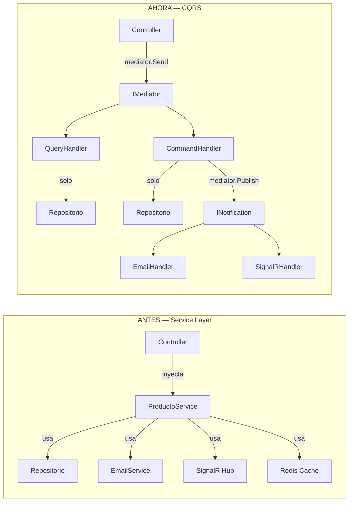
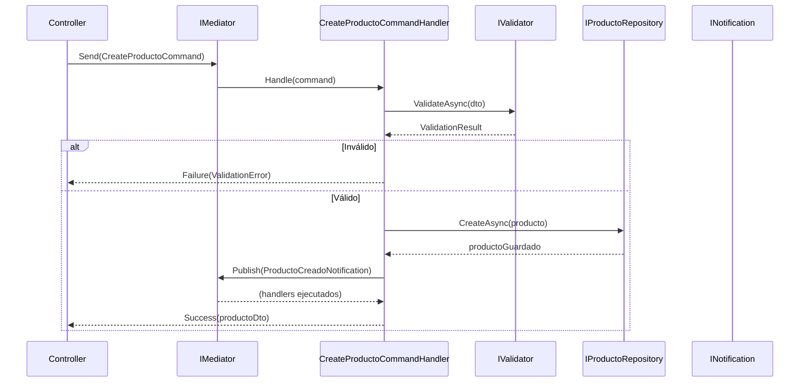

# 08. CQRS: Commands y Queries con MediatR

## ¿Qué es CQRS?

CQRS (Command Query Responsibility Segregation) separa lectura y escritura. En el enfoque clásico de Service Layer un mismo servicio (`ProductoService`) leía, validaba, escribía y lanzaba efectos laterales. Con CQRS cada caso de uso queda aislado en un `QueryHandler` o `CommandHandler`.

| Antes | Ahora |
|---|---|
| Controller -> Service con muchas responsabilidades | Controller -> IMediator -> Handler específico |
| Un servicio mezcla lectura, escritura y efectos laterales | Cada handler hace una sola cosa |
| Más difícil de testear | Tests pequeños y centrados |



## Anatomía de una Query

Código real simplificado de `GetProductoByIdQuery.cs`:

```csharp
public record GetProductoByIdQuery(long Id)
    : IRequest<Result<ProductoDto, DomainError>>;

public class GetProductoByIdQueryHandler(IProductoRepository repository)
    : IRequestHandler<GetProductoByIdQuery, Result<ProductoDto, DomainError>>
{
    public async Task<Result<ProductoDto, DomainError>> Handle(
        GetProductoByIdQuery request, CancellationToken cancellationToken)
    {
        var producto = await repository.FindByIdAsync(request.Id);
        return producto is null
            ? Result.Failure<ProductoDto, DomainError>(ProductoError.NotFound(request.Id))
            : Result.Success<ProductoDto, DomainError>(producto.ToDto());
    }
}
```

## Anatomía de un Command

Código real simplificado de `CreateProductoCommand.cs`:

```csharp
public record CreateProductoCommand(ProductoRequestDto Dto)
    : IRequest<Result<ProductoDto, DomainError>>;

public class CreateProductoCommandHandler(
    IProductoRepository repository,
    IValidator<ProductoRequestDto> validator,
    IMediator mediator)
    : IRequestHandler<CreateProductoCommand, Result<ProductoDto, DomainError>>
{
    public async Task<Result<ProductoDto, DomainError>> Handle(
        CreateProductoCommand request, CancellationToken cancellationToken)
    {
        var validationResult = await validator.ValidateAsync(request.Dto, cancellationToken);
        if (!validationResult.IsValid)
            return Result.Failure<ProductoDto, DomainError>(ProductoError.ValidacionConCampos(...));

        var saved = await repository.SaveAsync(request.Dto.ToEntity());
        var dto = saved.ToDto();
        await mediator.Publish(new ProductoCreadoNotification(dto), cancellationToken);
        return Result.Success<ProductoDto, DomainError>(dto);
    }
}
```

## ROP en Handlers

Los handlers siguen devolviendo `Result<T, DomainError>` o `UnitResult<DomainError>`. Eso significa que el controller no cambia su mapeo de errores: sigue haciendo `Match(...)` y traduciendo a `404`, `400`, `409` o `500`. CQRS cambia la organización, no rompe el modelo ROP existente.

## Validación con FluentValidation dentro del Handler

La validación ahora vive junto al caso de uso. `CreateProductoCommandHandler`, `CreatePedidoCommandHandler` y `CreateUserCommandHandler` validan primero y solo llaman al repositorio cuando el comando es correcto.

## Secuencia real de CreateProducto


