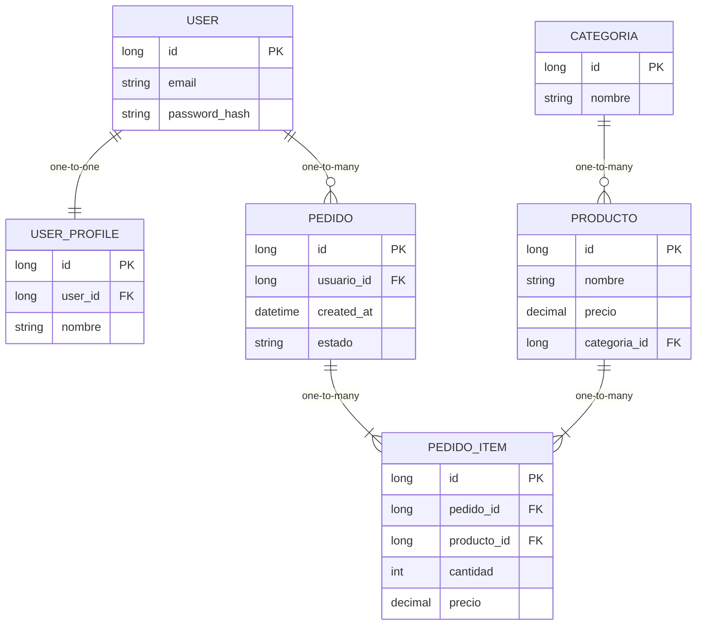

# 8. EF Core PostgreSQL

## Índice

[8. Entity Framework Core con PostgreSQL](#8-entity-framework-core-con-postgresql)
  - [8.1. DbContext y Configuración de Entidades](#81-dbcontext-y-configuracin-de-entidades)
  - [8.2. Configuración de Entidades: Data Annotations vs Fluent API](#82-configuracin-de-entidades-data-annotations-vs-fluent-api)
  - [8.3. Tipos de Relaciones en EF Core](#83-tipos-de-relaciones-en-ef-core)
  - [8.4. Timestamps Automáticos: CreatedAt y UpdatedAt](#84-timestamps-automticos-createdat-y-updatedat)
  - [8.5. Migraciones de Base de Datos](#85-migraciones-de-base-de-datos)
  - [8.6. Seed Data: Datos Iniciales](#86-seed-data-datos-iniciales)
  - [8.7. SaveChanges y Transacciones](#87-savechanges-y-transacciones)
  - [8.8. Shadow Properties y Global Query Filters](#88-shadow-properties-y-global-query-filters)
  - [8.9. Resumen y Buenas Prácticas](#89-resumen-y-buenas-prcticas)

---

## 8.1. DbContext y Configuración de Entidades

El DbContext es la clase central de EF Core que representa una sesión con la base de datos. Es responsable de consultar entidades, guardar cambios, y gestionar relaciones.

### Definición del DbContext

```csharp
using Microsoft.EntityFrameworkCore;
using TiendaApi.Core.Models;

namespace TiendaApi.Core.Data;

public class TiendaDbContext : DbContext
{
    public TiendaDbContext(DbContextOptions<TiendaDbContext> options)
        : base(options)
    {
    }

    // DbSets representan tablas en la base de datos
    public DbSet<User> Users { get; set; } = null!;
    public DbSet<Producto> Productos { get; set; } = null!;
    public DbSet<Categoria> Categorias { get; set; } = null!;
    public DbSet<Pedido> Pedidos { get; set; } = null!;
    public DbSet<PedidoItem> PedidoItems { get; set; } = null!;

    protected override void OnModelCreating(ModelBuilder modelBuilder)
    {
        base.OnModelCreating(modelBuilder);
        
        // Aplicar configuraciones de entidades
        modelBuilder.ApplyConfiguration(new ProductoConfiguration());
        modelBuilder.ApplyConfiguration(new CategoriaConfiguration());
        modelBuilder.ApplyConfiguration(new PedidoConfiguration());
        modelBuilder.ApplyConfiguration(new UserConfiguration());
    }
}
```

### Registro del DbContext en Program.cs

```csharp
using Microsoft.EntityFrameworkCore;
using TiendaApi.Core.Data;

var builder = WebApplication.CreateBuilder(args);

// Obtener cadena de conexión
var connectionString = builder.Configuration.GetConnectionString("PostgreSQL");

// Registrar DbContext con Scoped lifetime
builder.Services.AddDbContext<TiendaDbContext>(options =>
{
    options.UseNpgsql(connectionString, npgsqlOptions =>
    {
        npgsqlOptions.EnableRetryOnFailure(
            maxRetryCount: 3,
            maxRetryDelay: TimeSpan.FromSeconds(10),
            errorCodesToAdd: null);
    });
    
    // En desarrollo, habilitar logging de queries
    if (builder.Environment.IsDevelopment())
    {
        options.LogTo(Console.WriteLine, LogLevel.Information);
        options.EnableSensitiveDataLogging();
    }
});

var app = builder.Build();
```

---

## 8.2. Configuración de Entidades: Data Annotations vs Fluent API

EF Core soporta dos formas de configurar entidades: Data Annotations (atributos en las clases) y Fluent API (configuración mediante código).

### Data Annotations (atributos en el modelo)

```csharp
using System.ComponentModel.DataAnnotations;
using System.ComponentModel.DataAnnotations.Schema;

namespace TiendaApi.Core.Models;

[Table("productos")]
public class Producto
{
    [Key]
    [DatabaseGenerated(DatabaseGeneratedOption.Identity)]
    [Column("id")]
    public long Id { get; set; }

    [Required]
    [MaxLength(200)]
    [Column("nombre", TypeName = "varchar(200)")]
    public string Nombre { get; set; } = string.Empty;

    [MaxLength(2000)]
    [Column("descripcion", TypeName = "text")]
    public string? Descripcion { get; set; }

    [Required]
    [Column("precio", TypeName = "decimal(18,2)")]
    public decimal Precio { get; set; }

    [Column("stock")]
    [DefaultValue(0)]
    public int Stock { get; set; }

    [Column("categoria_id")]
    public long CategoriaId { get; set; }

    [ForeignKey("categoria_id")]
    public Categoria? Categoria { get; set; }

    [Column("created_at")]
    public DateTime CreatedAt { get; set; } = DateTime.UtcNow;

    [Column("updated_at")]
    public DateTime? UpdatedAt { get; set; }
}
```

### Fluent API (configuración mediante código)

```csharp
using Microsoft.EntityFrameworkCore;
using Microsoft.EntityFrameworkCore.Metadata.Builders;

namespace TiendaApi.Core.Data.Configurations;

public class ProductoConfiguration : IEntityTypeConfiguration<Producto>
{
    public void Configure(EntityTypeBuilder<Producto> builder)
    {
        // Tabla
        builder.ToTable("productos");
        
        // Clave primaria
        builder.HasKey(p => p.Id);
        builder.Property(p => p.Id)
            .HasColumnName("id")
            .UseNpgsqlIdentityColumn();
        
        // Propiedades
        builder.Property(p => p.Nombre)
            .HasColumnName("nombre")
            .IsRequired()
            .HasMaxLength(200);
        
        builder.Property(p => p.Descripcion)
            .HasColumnName("descripcion")
            .HasMaxLength(2000);
        
        builder.Property(p => p.Precio)
            .HasColumnName("precio")
            .HasColumnType("decimal(18,2)")
            .IsRequired();
        
        builder.Property(p => p.Stock)
            .HasColumnName("stock")
            .HasDefaultValue(0);
        
        // Timestamps
        builder.Property(p => p.CreatedAt)
            .HasColumnName("created_at")
            .HasDefaultValueSql("CURRENT_TIMESTAMP");
        
        builder.Property(p => p.UpdatedAt)
            .HasColumnName("updated_at");
        
        // Índices
        builder.HasIndex(p => p.Nombre).IsUnique();
        builder.HasIndex(p => p.CategoriaId);
    }
}
```

### Comparación de métodos

```mermaid
flowchart TB
    subgraph "Data Annotations"
        A1["Mas simples"]
        A2["Directamente en el modelo"]
        A3["Ideal para configuraciones basicas"]
        A4["Poco flexibles para casos complejos"]
        A5["Mezclan modelo con persistencia"]
    end
    
    subgraph "Fluent API"
        B1["Mas flexible"]
        B2["Separado del modelo"]
        B3["Ideal para configuraciones avanzadas"]
        B4["Mas verboso"]
        B5["Modelo mas limpio"]
    end
    
    A1 --> A2 --> A3 --> A4 --> A5
    B1 --> B2 --> B3 --> B4 --> B5
```



---

## 8.3. Tipos de Relaciones en EF Core

EF Core soporta cuatro tipos de relaciones: One-to-One, One-to-Many, Many-to-One, y Many-to-Many. Puedes configurar las relaciones usando **Data Annotations** o **Fluent API**.

### Relación One-to-One (uno a uno)

#### Data Annotations

```csharp
using System.ComponentModel.DataAnnotations;
using System.ComponentModel.DataAnnotations.Schema;

namespace TiendaApi.Core.Models;

public class User
{
    [Key]
    [DatabaseGenerated(DatabaseGeneratedOption.Identity)]
    public long Id { get; set; }

    [Required]
    [EmailAddress]
    [MaxLength(255)]
    public string Email { get; set; } = string.Empty;

    [Required]
    [MaxLength(255)]
    public string PasswordHash { get; set; } = string.Empty;

    public UserProfile? Profile { get; set; }
}

public class UserProfile
{
    [Key]
    [DatabaseGenerated(DatabaseGeneratedOption.Identity)]
    public long Id { get; set; }

    [Required]
    [ForeignKey(nameof(User))]
    [Index(IsUnique = true)]
    public long UserId { get; set; }

    [Required]
    [MaxLength(100)]
    public string Nombre { get; set; } = string.Empty;

    public User? User { get; set; }
}
```

#### Fluent API

```csharp
public class UserConfiguration : IEntityTypeConfiguration<User>
{
    public void Configure(EntityTypeBuilder<User> builder)
    {
        builder.ToTable("users");

        builder.HasKey(u => u.Id);
        builder.Property(u => u.Id).UseNpgsqlIdentityColumn();

        builder.Property(u => u.Email)
            .IsRequired()
            .HasMaxLength(255);

        builder.Property(u => u.PasswordHash)
            .IsRequired()
            .HasMaxLength(255);

        builder.HasOne(u => u.Profile)
            .WithOne(p => p.User)
            .HasForeignKey<UserProfile>(p => p.UserId)
            .OnDelete(DeleteBehavior.Cascade);
    }
}

public class UserProfileConfiguration : IEntityTypeConfiguration<UserProfile>
{
    public void Configure(EntityTypeBuilder<UserProfile> builder)
    {
        builder.ToTable("user_profiles");

        builder.HasKey(p => p.Id);
        builder.Property(p => p.Id).UseNpgsqlIdentityColumn();

        builder.Property(p => p.Nombre)
            .IsRequired()
            .HasMaxLength(100);

        builder.HasIndex(p => p.UserId)
            .IsUnique();
    }
}
```

### Relación One-to-Many (uno a muchos)

#### Data Annotations

```csharp
using System.ComponentModel.DataAnnotations;
using System.ComponentModel.DataAnnotations.Schema;

namespace TiendaApi.Core.Models;

public class Categoria
{
    [Key]
    [DatabaseGenerated(DatabaseGeneratedOption.Identity)]
    public long Id { get; set; }

    [Required]
    [MaxLength(100)]
    public string Nombre { get; set; } = string.Empty;

    [MaxLength(500)]
    public string? Descripcion { get; set; }

    public ICollection<Producto> Productos { get; set; } = new List<Producto>();
}

public class Producto
{
    [Key]
    [DatabaseGenerated(DatabaseGeneratedOption.Identity)]
    public long Id { get; set; }

    [Required]
    [MaxLength(200)]
    public string Nombre { get; set; } = string.Empty;

    [MaxLength(2000)]
    public string? Descripcion { get; set; }

    [Required]
    [Column(TypeName = "decimal(18,2)")]
    public decimal Precio { get; set; }

    [DefaultValue(0)]
    public int Stock { get; set; }

    [ForeignKey(nameof(Categoria))]
    public long CategoriaId { get; set; }

    public Categoria? Categoria { get; set; }
}
```

#### Fluent API

```csharp
public class CategoriaConfiguration : IEntityTypeConfiguration<Categoria>
{
    public void Configure(EntityTypeBuilder<Categoria> builder)
    {
        builder.ToTable("categorias");

        builder.HasKey(c => c.Id);
        builder.Property(c => c.Id).UseNpgsqlIdentityColumn();

        builder.Property(c => c.Nombre)
            .IsRequired()
            .HasMaxLength(100);

        builder.Property(c => c.Descripcion)
            .HasMaxLength(500);
    }
}

public class ProductoConfiguration : IEntityTypeConfiguration<Producto>
{
    public void Configure(EntityTypeBuilder<Producto> builder)
    {
        builder.ToTable("productos");

        builder.HasKey(p => p.Id);
        builder.Property(p => p.Id).UseNpgsqlIdentityColumn();

        builder.Property(p => p.Nombre)
            .IsRequired()
            .HasMaxLength(200);

        builder.Property(p => p.Descripcion)
            .HasMaxLength(2000);

        builder.Property(p => p.Precio)
            .IsRequired()
            .HasColumnType("decimal(18,2)");

        builder.Property(p => p.Stock)
            .HasDefaultValue(0);

        builder.HasOne(p => p.Categoria)
            .WithMany(c => c.Productos)
            .HasForeignKey(p => p.CategoriaId)
            .OnDelete(DeleteBehavior.Restrict)
            .HasConstraintName("fk_producto_categoria");

        builder.HasIndex(p => p.Nombre);
        builder.HasIndex(p => p.CategoriaId);
    }
}
```

### Relación Many-to-Many (muchos a muchos)

En EF Core 5+ puedes configurar Many-to-Many sin entidad intermedia explícita.

#### Data Annotations (con entidad intermedia)

```csharp
using System.ComponentModel.DataAnnotations;
using System.ComponentModel.DataAnnotations.Schema;

namespace TiendaApi.Core.Models;

public class Pedido
{
    [Key]
    [DatabaseGenerated(DatabaseGeneratedOption.Identity)]
    public long Id { get; set; }

    [ForeignKey(nameof(Usuario))]
    public long UsuarioId { get; set; }

    public DateTime CreatedAt { get; set; } = DateTime.UtcNow;

    [Required]
    public PedidoEstado Estado { get; set; }

    public ICollection<PedidoItem> Items { get; set; } = new List<PedidoItem>();
    public User? Usuario { get; set; }
}

public class PedidoItem
{
    [Key]
    [DatabaseGenerated(DatabaseGeneratedOption.Identity)]
    public long Id { get; set; }

    [ForeignKey(nameof(Pedido))]
    public long PedidoId { get; set; }

    [ForeignKey(nameof(Producto))]
    public long ProductoId { get; set; }

    [Range(1, int.MaxValue, ErrorMessage = "La cantidad debe ser mayor a 0")]
    public int Cantidad { get; set; }

    [Column(TypeName = "decimal(18,2)")]
    public decimal PrecioUnitario { get; set; }

    public Pedido? Pedido { get; set; }
    public Producto? Producto { get; set; }
}

public enum PedidoEstado
{
    Pendiente = 1,
    Procesando = 2,
    Enviado = 3,
    Entregado = 4,
    Cancelado = 5
}
```

#### Fluent API

```csharp
public class PedidoConfiguration : IEntityTypeConfiguration<Pedido>
{
    public void Configure(EntityTypeBuilder<Pedido> builder)
    {
        builder.ToTable("pedidos");

        builder.HasKey(p => p.Id);
        builder.Property(p => p.Id).UseNpgsqlIdentityColumn();

        builder.Property(p => p.CreatedAt)
            .HasDefaultValueSql("CURRENT_TIMESTAMP");

        builder.Property(p => p.Estado)
            .HasConversion<string>()
            .IsRequired();

        builder.HasOne(p => p.Usuario)
            .WithMany(u => u.Pedidos)
            .HasForeignKey(p => p.UsuarioId)
            .OnDelete(DeleteBehavior.Restrict);

        builder.HasMany(p => p.Items)
            .WithOne(pi => pi.Pedido)
            .HasForeignKey(pi => pi.PedidoId)
            .OnDelete(DeleteBehavior.Cascade);
    }
}

public class PedidoItemConfiguration : IEntityTypeConfiguration<PedidoItem>
{
    public void Configure(EntityTypeBuilder<PedidoItem> builder)
    {
        builder.ToTable("pedido_items");

        builder.HasKey(pi => pi.Id);
        builder.Property(pi => pi.Id).UseNpgsqlIdentityColumn();

        builder.Property(pi => pi.Cantidad)
            .IsRequired();

        builder.Property(pi => pi.PrecioUnitario)
            .IsRequired()
            .HasColumnType("decimal(18,2)");

        builder.HasOne(pi => pi.Pedido)
            .WithMany(p => p.Items)
            .HasForeignKey(pi => pi.PedidoId)
            .OnDelete(DeleteBehavior.Cascade);

        builder.HasOne(pi => pi.Producto)
            .WithMany(p => p.PedidoItems)
            .HasForeignKey(pi => pi.ProductoId)
            .OnDelete(DeleteBehavior.Restrict);

        builder.HasIndex(pi => pi.PedidoId);
        builder.HasIndex(pi => pi.ProductoId);
    }
}
```

### Diagrama de relaciones



---

## 8.4. Timestamps Automáticos: CreatedAt y UpdatedAt

Mantener fechas de creación y actualización es esencial para la auditoría.

### Interfaz IHasTimestamps

```csharp
namespace TiendaApi.Core.Data.Abstractions;

public interface IHasTimestamps
{
    DateTime CreatedAt { get; set; }
    DateTime? UpdatedAt { get; set; }
}
```

### Entidades con timestamps

```csharp
using TiendaApi.Core.Data.Abstractions;

namespace TiendaApi.Core.Models;

public class Producto : IHasTimestamps
{
    public long Id { get; set; }
    public string Nombre { get; set; } = string.Empty;
    public decimal Precio { get; set; }
    
    public DateTime CreatedAt { get; set; } = DateTime.UtcNow;
    public DateTime? UpdatedAt { get; set; }
}
```

### Interceptor de Timestamps

```csharp
using Microsoft.EntityFrameworkCore;
using Microsoft.EntityFrameworkCore.Diagnostics;
using TiendaApi.Core.Data.Abstractions;

namespace TiendaApi.Core.Data.Interceptors;

public class TimestampInterceptor : SaveChangesInterceptor
{
    public override int SavedChanges(SaveChangesCompletedEventData eventData, int result)
    {
        UpdateTimestamps(eventData.Context);
        return base.SavedChanges(eventData, result);
    }

    public override ValueTask<int> SavedChangesAsync(
        SaveChangesCompletedEventData eventData,
        int result,
        CancellationToken cancellationToken = default)
    {
        UpdateTimestamps(eventData.Context);
        return base.SavedChangesAsync(eventData, result, cancellationToken);
    }

    private void UpdateTimestamps(DbContext? context)
    {
        if (context == null) return;

        var entries = context.ChangeTracker.Entries<IHasTimestamps>();

        foreach (var entry in entries)
        {
            switch (entry.State)
            {
                case EntityState.Added:
                    entry.Entity.CreatedAt = DateTime.UtcNow;
                    entry.Entity.UpdatedAt = DateTime.UtcNow;
                    break;

                case EntityState.Modified:
                    entry.Entity.UpdatedAt = DateTime.UtcNow;
                    break;
            }
        }
    }
}
```

### Registro del interceptor

```csharp
builder.Services.AddDbContext<TiendaDbContext>(options =>
{
    options.UseNpgsql(connectionString);
    options.AddInterceptors(new TimestampInterceptor());
});
```

---

## 8.5. Migraciones de Base de Datos

Las migraciones versionan cambios del esquema de la base de datos.

### Crear migración

```bash
dotnet ef migrations add AddCreatedAtToProducto

# Con namespace específico
dotnet ef migrations add AddCreatedAtToProducto -p ../TiendaApi.Core/TiendaApi.Core.csproj
```

### Estructura de una migración

```csharp
using Microsoft.EntityFrameworkCore.Migrations;

public partial class AddCreatedAtToProducto : Migration
{
    protected override void Up(MigrationBuilder migrationBuilder)
    {
        migrationBuilder.AddColumn<DateTime>(
            name: "created_at",
            table: "productos",
            type: "timestamp with time zone",
            nullable: false,
            defaultValue: DateTime.UtcNow);
        
        migrationBuilder.CreateIndex(
            name: "ix_productos_created_at",
            table: "productos",
            column: "created_at");
    }

    protected override void Down(MigrationBuilder migrationBuilder)
    {
        migrationBuilder.DropIndex(
            name: "ix_productos_created_at",
            table: "productos");
        
        migrationBuilder.DropColumn(
            name: "created_at",
            table: "productos");
    }
}
```

### Aplicar migraciones

```bash
# Aplicar todas
dotnet ef database update

# Revertir
dotnet ef database update PreviousMigrationName
```

---

## 8.6. Seed Data: Datos Iniciales

Puedes poblar la base de datos con datos iniciales de varias formas.

### Opción 1: Con SQL (fichero externo)

```sql
-- seed.sql
-- Categorías
INSERT INTO categorias (nombre, descripcion, created_at) VALUES
('Electrónica', 'Dispositivos y accesorios electrónicos', CURRENT_TIMESTAMP),
('Ropa', 'Prendas de vestir y accesorios', CURRENT_TIMESTAMP),
('Hogar', 'Artículos para el hogar', CURRENT_TIMESTAMP),
('Deportes', 'Equipamiento deportivo', CURRENT_TIMESTAMP)
ON CONFLICT DO NOTHING;

-- Usuarios
INSERT INTO users (email, password_hash, created_at) VALUES
('admin@tienda.com', '$2a$11$...hash...', CURRENT_TIMESTAMP),
('user@tienda.com', '$2a$11$...hash...', CURRENT_TIMESTAMP)
ON CONFLICT DO NOTHING;

-- Productos
INSERT INTO productos (nombre, descripcion, precio, stock, categoria_id, created_at) VALUES
('Laptop HP', 'Laptop 15.6" i5 8GB RAM', 599.99, 10, 1, CURRENT_TIMESTAMP),
('Camiseta', 'Camiseta algodón básica', 19.99, 100, 2, CURRENT_TIMESTAMP),
('Sofá', 'Sofá 3 plazas gris', 399.00, 5, 3, CURRENT_TIMESTAMP)
ON CONFLICT DO NOTHING;
```

```csharp
// En Program.cs
using var scope = app.Services.CreateScope();
using var connection = new NpgsqlConnection(connectionString);
await connection.OpenAsync();

var sql = File.ReadAllText("Data/seed.sql");
await connection.ExecuteAsync(sql);
```

### Opción 2: Con HasData en Fluent API

```csharp
public class CategoriaConfiguration : IEntityTypeConfiguration<Categoria>
{
    public void Configure(EntityTypeBuilder<Categoria> builder)
    {
        builder.ToTable("categorias");

        builder.HasKey(c => c.Id);
        builder.Property(c => c.Id).UseNpgsqlIdentityColumn();

        builder.Property(c => c.Nombre)
            .IsRequired()
            .HasMaxLength(100);

        // Seed data
        builder.HasData(
            new Categoria { Id = 1, Nombre = "Electrónica", Descripcion = "Dispositivos electrónicos" },
            new Categoria { Id = 2, Nombre = "Ropa", Descripcion = "Prendas de vestir" },
            new Categoria { Id = 3, Nombre = "Hogar", Descripcion = "Artículos para el hogar" },
            new Categoria { Id = 4, Nombre = "Deportes", Descripcion = "Equipamiento deportivo" }
        );
    }
}

public class ProductoConfiguration : IEntityTypeConfiguration<Producto>
{
    public void Configure(EntityTypeBuilder<Producto> builder)
    {
        builder.ToTable("productos");

        builder.HasKey(p => p.Id);
        builder.Property(p => p.Id).UseNpgsqlIdentityColumn();

        builder.Property(p => p.Nombre).IsRequired().HasMaxLength(200);
        builder.Property(p => p.Precio).IsRequired().HasColumnType("decimal(18,2)");

        // Seed data
        builder.HasData(
            new Producto { Id = 1, Nombre = "Laptop HP", Precio = 599.99m, Stock = 10, CategoriaId = 1 },
            new Producto { Id = 2, Nombre = "Camiseta", Precio = 19.99m, Stock = 100, CategoriaId = 2 },
            new Producto { Id = 3, Nombre = "Sofá", Precio = 399.00m, Stock = 5, CategoriaId = 3 }
        );
    }
}
```

### Opción 3: Con DbContext.OnModelCreating

```csharp
protected override void OnModelCreating(ModelBuilder modelBuilder)
{
    base.OnModelCreating(modelBuilder);

    // Seed de categorías
    modelBuilder.Entity<Categoria>().HasData(
        new Categoria { Id = 1, Nombre = "Electrónica" },
        new Categoria { Id = 2, Nombre = "Ropa" }
    );

    // Seed de productos
    modelBuilder.Entity<Producto>().HasData(
        new Producto { Id = 1, Nombre = "Laptop", Precio = 599.99m, CategoriaId = 1 },
        new Producto { Id = 2, Nombre = "Camiseta", Precio = 19.99m, CategoriaId = 2 }
    );
}
```

> **Nota**: HasData requiere que las entidades tengan valores de clave primaria explícitos. Las migraciones detectan automáticamente los cambios en HasData.

---

## 8.7. SaveChanges y Transacciones

El método SaveChanges() persiste todos los cambios pendientes.

### Funcionamiento de SaveChanges

```csharp
public class ProductoService
{
    private readonly TiendaDbContext _context;

    public async Task<Producto> CreateAsync(Producto producto)
    {
        _context.Productos.Add(producto);
        await _context.SaveChangesAsync();
        return producto;
    }

    public async Task<bool> DeleteAsync(long id)
    {
        var producto = await _context.Productos.FindAsync(id);
        if (producto == null) return false;
        
        _context.Productos.Remove(producto);
        await _context.SaveChangesAsync();
        return true;
    }
}
```

### Transacción explícita

```csharp
public async Task<bool> TransferirStock(long productoOrigen, long productoDestino, int cantidad)
{
    using var transaction = await _context.Database.BeginTransactionAsync();
    
    try
    {
        var origen = await _context.Productos.FindAsync(productoOrigen);
        var destino = await _context.Productos.FindAsync(productoDestino);
        
        origen.Stock -= cantidad;
        destino.Stock += cantidad;
        
        await _context.SaveChangesAsync();
        await transaction.CommitAsync();
        return true;
    }
    catch
    {
        await transaction.RollbackAsync();
        throw;
    }
}
```

---

## 8.8. Shadow Properties y Global Query Filters

### Shadow Properties

Propiedades que no están en la clase .NET pero existen en la base de datos:

```csharp
protected override void OnModelCreating(ModelBuilder modelBuilder)
{
    modelBuilder.Entity<Producto>()
        .Property<DateTime>("CreatedAt");
    
    modelBuilder.Entity<Producto>()
        .Property<string>("CreatedBy")
        .HasMaxLength(100);
}

// Uso
context.Entry(producto)["CreatedAt"] = DateTime.UtcNow;
```

### Global Query Filters

Filtros automáticos para todas las queries:

```csharp
protected override void OnModelCreating(ModelBuilder modelBuilder)
{
    // Soft delete automático
    modelBuilder.Entity<Producto>()
        .HasQueryFilter(p => !p.IsDeleted);
}

// Ignorar el filtro para ver eliminados
var eliminados = await context.Productos
    .IgnoreQueryFilters()
    .Where(p => p.IsDeleted)
    .ToListAsync();
```

---

## 8.9. Resumen y Buenas Prácticas

```mermaid
flowchart TB
    subgraph "Configuración"
        A1["Fluent API sobre Data Annotations"]
        A2["Configuraciones separadas"]
        A3["Índices en propiedades frecuentes"]
    end
    
    subgraph "Carga de datos"
        B1["Eager Loading con Include"]
        B2["ThenInclude para anidados"]
        B3["Evitar N+1 queries"]
    end
    
    subgraph "Migraciones"
        C1["Revisar SQL generado"]
        C2["Testear migraciones"]
        C3["Backup antes de aplicar"]
    end
    
    subgraph "Rendimiento"
        D1["No-tracking para solo lectura"]
        D2["Compiled queries para repetidos"]
        D3["Índices apropiados"]
    end
    
    A1 --> A2 --> A3
    B1 --> B2 --> B3
    C1 --> C2 --> C3
    D1 --> D2 --> D3
```



### Puntos clave del módulo

El DbContext representa la sesión con la base de datos. Fluent API permite configuraciones detalladas de entidades. Las relaciones (One-to-One, One-to-Many, Many-to-Many) se configuran con `[ForeignKey]` (Data Annotations) o `HasOne/WithMany` (Fluent API). Eager Loading con Include es preferible a Lazy Loading. Las migraciones versionan cambios del esquema. El seed data puede hacerse con SQL externo o con `HasData()`.

### Buenas prácticas

- Usar Fluent API sobre Data Annotations para configuraciones avanzadas
- Separar configuraciones en clases `IEntityTypeConfiguration<T>`
- Crear índices en propiedades que se usan frecuentemente en filtros
- Usar Eager Loading con `Include()` y `ThenInclude()` para evitar N+1 queries
- Revisar el SQL generado por las migraciones antes de aplicar
- Usar `AsNoTracking()` para consultas de solo lectura
- Aplicar migraciones en producción con backup previo

### Siguientes pasos

Con EF Core dominado, el siguiente paso es aprender sobre MongoDB como base secundaria en el documento 10.

### Recursos adicionales

- EF Core Documentation: https://docs.microsoft.com/ef/core/
- Npgsql Provider: https://www.npgsql.org/efcore/
- Migrations: https://docs.microsoft.com/ef/core/managing-schemas/migrations/
