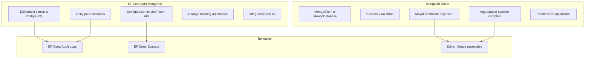
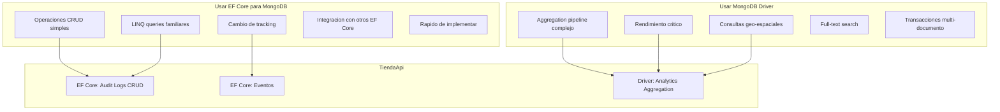

# 10. MongoDB con EF Core y Driver Nativo

## Índice

[10. MongoDB con EF Core y Driver Nativo](#10-mongodb-con-ef-core-y-driver-nativo)
  - [10.1. EF Core para MongoDB vs MongoDB Driver](#101-ef-core-para-mongodb-vs-mongodb-driver)
  - [10.2. EF Core para MongoDB](#102-ef-core-para-mongodb)
  - [10.3. MongoDB Driver Nativo](#103-mongodb-driver-nativo)
  - [10.4. Repositorios con EF Core para MongoDB](#104-repositorios-con-ef-core-para-mongodb)
  - [10.5. Repositorios con MongoDB Driver](#105-repositorios-con-mongodb-driver)
  - [10.6. Aggregation Pipeline con MongoDB Driver](#106-aggregation-pipeline-con-mongodb-driver)
  - [10.7. Seed de Datos en MongoDB](#107-seed-de-datos-en-mongodb)
  - [10.8. Comparación: Cuándo Usar Cada Enfoque](#108-comparación-cuando-usar-cada-enfoque)
  - [10.9. Resumen y Buenas Prácticas](#109-resumen-y-buenas-prácticas)

---

## 10.1. EF Core para MongoDB vs MongoDB Driver

El proyecto TiendaApi usa ambos enfoques. EF Core para MongoDB proporciona una experiencia similar a PostgreSQL, mientras que el MongoDB Driver nativo ofrece más control para operaciones específicas.

### Comparación de enfoques



---

## 10.2. EF Core para MongoDB

EF Core para MongoDB permite usar el mismo patrón que PostgreSQL: DbContext, configuraciones Fluent API, y repositories con el mismo Result Pattern.

### Instalación

```bash
dotnet add TiendaApi.Core package Microsoft.EntityFrameworkCore
dotnet add TiendaApi.Core package MongoDB.EntityFrameworkCore
```

### MongoDbContext

```csharp
using Microsoft.EntityFrameworkCore;
using TiendaApi.Core.Models.Mongo;

namespace TiendaApi.Core.Data;

public class TiendaMongoContext : DbContext
{
    public TiendaMongoContext(DbContextOptions<TiendaMongoContext> options)
        : base(options)
    {
    }

    // Colecciones en MongoDB
    public DbSet<AuditLog> AuditLogs { get; set; } = null!;
    public DbSet<Event> Events { get; set; } = null!;
    public DbSet<ProductView> ProductViews { get; set; } = null!;

    protected override void OnModelCreating(ModelBuilder modelBuilder)
    {
        base.OnModelCreating(modelBuilder);

        // Aplicar configuraciones
        modelBuilder.ApplyConfiguration(new AuditLogConfiguration());
        modelBuilder.ApplyConfiguration(new EventConfiguration());
    }
}
```

### Registro en Program.cs

```csharp
using Microsoft.EntityFrameworkCore;
using TiendaApi.Core.Data;

var builder = WebApplication.CreateBuilder(args);

// Configuración de MongoDB
var mongoConnection = builder.Configuration.GetConnectionString("MongoDB");
var mongoDatabaseName = builder.Configuration["MongoDb:DatabaseName"] ?? "TiendaDb";

// Registrar DbContext de MongoDB
builder.Services.AddDbContext<TiendaMongoContext>(options =>
{
    options.UseMongoDB(mongoConnection, mongoDatabaseName);
});

// Servicios que usan MongoDB
builder.Services.AddScoped<IAuditLogRepository, AuditLogRepository>();
builder.Services.AddScoped<IEventRepository, EventRepository>();

var app = builder.Build();
```

### Modelos para MongoDB con EF Core

```csharp
using MongoDB.EntityFrameworkCore;

namespace TiendaApi.Core.Models.Mongo;

[Collection("audit_logs")]
public class AuditLog
{
    [BsonId]
    [BsonRepresentation(MongoDB.Bson.BsonType.ObjectId)]
    public string Id { get; set; } = string.Empty;

    [BsonElement("timestamp")]
    public DateTime Timestamp { get; set; } = DateTime.UtcNow;

    [BsonElement("action")]
    public string Action { get; set; } = string.Empty;

    [BsonElement("entityType")]
    public string EntityType { get; set; } = string.Empty;

    [BsonElement("entityId")]
    public string? EntityId { get; set; }

    [BsonElement("userId")]
    public string? UserId { get; set; }

    [BsonElement("userEmail")]
    public string? UserEmail { get; set; }

    [BsonElement("oldValue")]
    public string? OldValue { get; set; }

    [BsonElement("newValue")]
    public string? NewValue { get; set; }

    [BsonElement("ipAddress")]
    public string? IpAddress { get; set; }

    [BsonElement("userAgent")]
    public string? UserAgent { get; set; }
}
```

### Configuración con Fluent API

```csharp
using Microsoft.EntityFrameworkCore;
using Microsoft.EntityFrameworkCore.Metadata.Builders;
using MongoDB.EntityFrameworkCore.Extensions;

namespace TiendaApi.Core.Data.Configurations;

public class AuditLogConfiguration : IEntityTypeConfiguration<AuditLog>
{
    public void Configure(EntityTypeBuilder<AuditLog> builder)
    {
        // Colección en MongoDB
        builder.ToCollection("audit_logs");

        // Clave primaria
        builder.HasKey(l => l.Id);

        // Propiedades
        builder.Property(l => l.Timestamp)
            .HasElementName("timestamp")
            .IsRequired();

        builder.Property(l => l.Action)
            .HasElementName("action")
            .HasMaxLength(50)
            .IsRequired();

        builder.Property(l => l.EntityType)
            .HasElementName("entityType")
            .HasMaxLength(50)
            .IsRequired();

        // Índices
        builder.HasIndex(l => l.Timestamp);
        builder.HasIndex(l => l.EntityType);
        builder.HasIndex(l => l.EntityId);
        builder.HasIndex(l => l.UserId);
    }
}
```

---

## 10.3. MongoDB Driver Nativo

Para operaciones específicas o cuando necesitas más control, puedes usar el MongoDB Driver nativo con IMongoClient.

### Instalación

```bash
dotnet add TiendaApi.Core package MongoDB.Driver
```

### Configuración del cliente

```csharp
using MongoDB.Driver;

var builder = WebApplication.CreateBuilder(args);

// Configuración de MongoDB
var mongoConnection = builder.Configuration.GetConnectionString("MongoDB");
var mongoDatabaseName = builder.Configuration["MongoDb:DatabaseName"] ?? "TiendaDb";

// Registrar cliente MongoDB como singleton
builder.Services.AddSingleton<IMongoClient>(sp =>
{
    var settings = MongoClientSettings.FromConnectionString(mongoConnection);
    settings.MaxConnectionIdleTime = TimeSpan.FromMinutes(5);
    settings.MaxConnectionPoolSize = 100;
    return new MongoClient(settings);
});

// Registrar base de datos con scoped
builder.Services.AddScoped(sp =>
{
    var client = sp.GetRequiredService<IMongoClient>();
    return client.GetDatabase(mongoDatabaseName);
});

// Colecciones con nombre de configuración
builder.Services.AddScoped<IMongoCollection<AuditLogDocument>>>(sp =>
{
    var database = sp.GetRequiredService<IMongoDatabase>();
    return database.GetCollection<AuditLogDocument>("audit_logs");
});

var app = builder.Build();
```

### Modelos para MongoDB Driver

```csharp
using MongoDB.Bson;
using MongoDB.Bson.Serialization.Attributes;

namespace TiendaApi.Core.Models.Mongo;

public class AuditLogDocument
{
    [BsonId]
    [BsonRepresentation(BsonType.ObjectId)]
    public string Id { get; set; } = string.Empty;

    [BsonElement("timestamp")]
    [BsonDateTimeOptions(Kind = DateTimeKind.Utc)]
    public DateTime Timestamp { get; set; } = DateTime.UtcNow;

    [BsonElement("action")]
    public string Action { get; set; } = string.Empty;

    [BsonElement("entityType")]
    public string EntityType { get; set; } = string.Empty;

    [BsonElement("entityId")]
    public string? EntityId { get; set; }

    [BsonElement("userId")]
    public string? UserId { get; set; }

    [BsonElement("userEmail")]
    public string? UserEmail { get; set; }

    [BsonElement("oldValue")]
    public BsonDocument? OldValue { get; set; }

    [BsonElement("newValue")]
    public BsonDocument? NewValue { get; set; }

    [BsonElement("ipAddress")]
    public string? IpAddress { get; set; }

    [BsonElement("userAgent")]
    public string? UserAgent { get; set; }
}
```

---

## 10.4. Repositorios con EF Core para MongoDB

Los repositorios usan el mismo patrón que PostgreSQL, facilitando la consistencia en el código.

### Interfaz del repositorio

```csharp
using TiendaApi.Core.Models.Mongo;

namespace TiendaApi.Core.Interfaces;

public interface IAuditLogRepository
{
    Task<AuditLog> AddAsync(AuditLog log);
    Task<List<AuditLog>> GetByEntityAsync(string entityType, string entityId);
    Task<List<AuditLog>> GetByUserAsync(string userId, int limit = 100);
    Task<List<AuditLog>> GetRecentAsync(int limit = 100);
    Task<long> CountByEntityTypeAsync(string entityType);
}
```

### Implementación con EF Core

```csharp
using Microsoft.EntityFrameworkCore;
using TiendaApi.Core.Data;
using TiendaApi.Core.Interfaces;
using TiendaApi.Core.Models.Mongo;

namespace TiendaApi.Core.Repositories;

public class AuditLogRepository(
    TiendaMongoContext context) : IAuditLogRepository
{
    private readonly DbSet<AuditLog> _logs = context.AuditLogs;

    public async Task<AuditLog> AddAsync(AuditLog log)
    {
        log.Id = Guid.NewGuid().ToString();
        log.Timestamp = DateTime.UtcNow;
        
        await _logs.AddAsync(log);
        await context.SaveChangesAsync();
        
        return log;
    }

    public async Task<List<AuditLog>> GetByEntityAsync(string entityType, string entityId)
    {
        return await _logs
            .Where(l => l.EntityType == entityType && l.EntityId == entityId)
            .OrderByDescending(l => l.Timestamp)
            .Take(100)
            .ToListAsync();
    }

    public async Task<List<AuditLog>> GetByUserAsync(string userId, int limit = 100)
    {
        return await _logs
            .Where(l => l.UserId == userId)
            .OrderByDescending(l => l.Timestamp)
            .Take(limit)
            .ToListAsync();
    }

    public async Task<List<AuditLog>> GetRecentAsync(int limit = 100)
    {
        return await _logs
            .OrderByDescending(l => l.Timestamp)
            .Take(limit)
            .ToListAsync();
    }

    public async Task<long> CountByEntityTypeAsync(string entityType)
    {
        return await _logs
            .CountAsync(l => l.EntityType == entityType);
    }
}
```

---

## 10.5. Repositorios con MongoDB Driver

Para operaciones que requieren el aggregation pipeline o mayor control:

```csharp
using MongoDB.Driver;
using TiendaApi.Core.Interfaces;
using TiendaApi.Core.Models.Mongo;

namespace TiendaApi.Core.Repositories.Mongo;

public class AuditLogMongoRepository : IAuditLogRepository
{
    private readonly IMongoCollection<AuditLogDocument> _collection;

    public AuditLogMongoRepository(IMongoDatabase database)
    {
        _collection = database.GetCollection<AuditLogDocument>("audit_logs");
        CreateIndexes();
    }

    private void CreateIndexes()
    {
        var indexKeys = Builders<AuditLogDocument>.IndexKeys
            .Ascending(l => l.Timestamp)
            .Ascending(l => l.EntityType)
            .Ascending(l => l.EntityId);

        var indexModel = new CreateIndexModel<AuditLogDocument>(
            indexKeys,
            new CreateIndexOptions { Name = "idx_entity_lookup" });

        _collection.Indexes.CreateOneAsync(indexModel);
    }

    public async Task<AuditLogDocument> AddAsync(AuditLogDocument log)
    {
        log.Id = Guid.NewGuid().ToString();
        log.Timestamp = DateTime.UtcNow;
        
        await _collection.InsertOneAsync(log);
        return log;
    }

    public async Task<List<AuditLogDocument>> GetByEntityAsync(
        string entityType, string entityId)
    {
        var filter = Builders<AuditLogDocument>.Filter.And(
            Builders<AuditLogDocument>.Filter.Eq(l => l.EntityType, entityType),
            Builders<AuditLogDocument>.Filter.Eq(l => l.EntityId, entityId)
        );

        return await _collection
            .Find(filter)
            .Sort(Builders<AuditLogDocument>.Sort.Descending(l => l.Timestamp))
            .Limit(100)
            .ToListAsync();
    }

    public async Task<List<AuditLogDocument>> GetByUserAsync(string userId, int limit = 100)
    {
        var filter = Builders<AuditLogDocument>.Filter.Eq(l => l.UserId, userId);
        
        return await _collection
            .Find(filter)
            .Sort(Builders<AuditLogDocument>.Sort.Descending(l => l.Timestamp))
            .Limit(limit)
            .ToListAsync();
    }

    public async Task<List<AuditLogDocument>> GetRecentAsync(int limit = 100)
    {
        return await _collection
            .Find(_ => true)
            .Sort(Builders<AuditLogDocument>.Sort.Descending(l => l.Timestamp))
            .Limit(limit)
            .ToListAsync();
    }
}
```

---

## 10.6. Aggregation Pipeline con MongoDB Driver

El aggregation pipeline es powerful para análisis y reportes:

```csharp
public class AnalyticsRepository
{
    private readonly IMongoCollection<AuditLogDocument> _collection;

    public AnalyticsRepository(IMongoDatabase database)
    {
        _collection = database.GetCollection<AuditLogDocument>("audit_logs");
    }

    public async Task<Dictionary<string, long>> GetActionCountsByDayAsync(DateTime from, DateTime to)
    {
        var pipeline = new BsonDocument[]
        {
            new("$match", new BsonDocument
            {
                ["timestamp"] = new BsonDocument
                {
                    ["$gte"] = from,
                    ["$lte"] = to
                }
            }),
            new("$group", new BsonDocument
            {
                ["_id"] = new BsonDocument
                {
                    ["action"] = "$action",
                    ["date"] = new BsonDocument("$dateToString", new BsonDocument
                    {
                        ["format"] = "%Y-%m-%d",
                        ["date"] = "$timestamp"
                    })
                },
                ["count"] = new BsonDocument("$sum", 1)
            }),
            new("$sort", new BsonDocument("_id.date", 1))
        };

        var results = await _collection.AggregateAsync<BsonDocument>(pipeline);
        
        return results.ToDictionary(
            r => r["_id"]["action"].AsString + "_" + r["_id"]["date"].AsString,
            r => r["count"].AsInt64
        );
    }

    public async Task<List<TopEntity>> GetTopEntitiesAsync(int limit = 10)
    {
        var pipeline = new BsonDocument[]
        {
            new("$group", new BsonDocument
            {
                ["_id"] = "$entityType",
                ["count"] = new BsonDocument("$sum", 1)
            }),
            new("$sort", new BsonDocument("count", -1)),
            new("$limit", limit)
        };

        var results = await _collection.AggregateAsync<BsonDocument>(pipeline);
        
        return results.Select(r => new TopEntity
        {
            EntityType = r["_id"].AsString,
            Count = r["count"].AsInt32
        }).ToList();
    }
}

public class TopEntity
{
    public string EntityType { get; set; } = string.Empty;
    public int Count { get; set; }
}
```

---

## 10.7. Seed de Datos en MongoDB

MongoDB no tiene migraciones como PostgreSQL, pero puedes poblar datos iniciales de varias formas.

### Opción 1: Con EF Core (como PostgreSQL)

```csharp
using Microsoft.EntityFrameworkCore;
using TiendaApi.Core.Data;
using TiendaApi.Core.Models.Mongo;

namespace TiendaApi.Core.Data.Seed;

public class MongoDbSeeder
{
    private readonly TiendaMongoContext _context;

    public MongoDbSeeder(TiendaMongoContext context)
    {
        _context = context;
    }

    public async Task SeedAsync()
    {
        if (await _context.AuditLogs.AnyAsync())
            return;

        var logs = new List<AuditLog>
        {
            new()
            {
                Action = "CREATE",
                EntityType = "Producto",
                EntityId = "1",
                UserId = "admin",
                UserEmail = "admin@tienda.com",
                NewValue = "Laptop Gaming - 1500",
                Timestamp = DateTime.UtcNow.AddDays(-5)
            },
            new()
            {
                Action = "UPDATE_STOCK",
                EntityType = "Producto",
                EntityId = "2",
                UserId = "admin",
                UserEmail = "admin@tienda.com",
                OldValue = "10",
                NewValue = "5",
                Timestamp = DateTime.UtcNow.AddDays(-2)
            }
        };

        await _context.AuditLogs.AddRangeAsync(logs);
        await _context.SaveChangesAsync();
    }
}
```

### Opción 2: Con MongoDB Driver Nativo

```csharp
using MongoDB.Bson;
using MongoDB.Driver;
using TiendaApi.Core.Models.Mongo;

namespace TiendaApi.Core.Data.Seed;

public class MongoDbDriverSeeder
{
    private readonly IMongoDatabase _database;

    public MongoDbDriverSeeder(IMongoDatabase database)
    {
        _database = database;
    }

    public async Task SeedAsync()
    {
        var collection = _database.GetCollection<BsonDocument>("audit_logs");

        if (await collection.CountDocumentsAsync(_ => true) > 0)
            return;

        var seedData = new List<BsonDocument>
        {
            new BsonDocument
            {
                ["_id"] = ObjectId.GenerateNewId(),
                ["timestamp"] = DateTime.UtcNow.AddDays(-5),
                ["action"] = "CREATE",
                ["entityType"] = "Producto",
                ["entityId"] = "1",
                ["userId"] = "admin",
                ["userEmail"] = "admin@tienda.com",
                ["newValue"] = "Laptop Gaming - 1500",
                ["oldValue"] = BsonNull.Value
            },
            new BsonDocument
            {
                ["_id"] = ObjectId.GenerateNewId(),
                ["timestamp"] = DateTime.UtcNow.AddDays(-2),
                ["action"] = "UPDATE_STOCK",
                ["entityType"] = "Producto",
                ["entityId"] = "2",
                ["userId"] = "admin",
                ["userEmail"] = "admin@tienda.com",
                ["newValue"] = "5",
                ["oldValue"] = "10"
            },
            new BsonDocument
            {
                ["_id"] = ObjectId.GenerateNewId(),
                ["timestamp"] = DateTime.UtcNow.AddHours(-1),
                ["action"] = "LOGIN",
                ["entityType"] = "User",
                ["entityId"] = "user123",
                ["userId"] = "user123",
                ["userEmail"] = "user@tienda.com",
                ["newValue"] = BsonNull.Value,
                ["oldValue"] = BsonNull.Value
            }
        };

        await collection.InsertManyAsync(seedData);
    }
}
```

### Opción 3: Con Fichero JSON

```json
// seed-audit-logs.json
[
  {
    "timestamp": "2024-01-10T10:00:00Z",
    "action": "CREATE",
    "entityType": "Producto",
    "entityId": "1",
    "userId": "admin",
    "userEmail": "admin@tienda.com",
    "newValue": "Laptop Gaming - 1500",
    "oldValue": null
  },
  {
    "timestamp": "2024-01-12T15:30:00Z",
    "action": "UPDATE_STOCK",
    "entityType": "Producto",
    "entityId": "2",
    "userId": "admin",
    "userEmail": "admin@tienda.com",
    "newValue": "5",
    "oldValue": "10"
  }
]
```

```csharp
using MongoDB.Bson;
using MongoDB.Bson.Serialization;
using MongoDB.Driver;

public class JsonSeeder
{
    private readonly IMongoDatabase _database;

    public JsonSeeder(IMongoDatabase database)
    {
        _database = database;
    }

    public async Task SeedFromJsonAsync(string filePath)
    {
        var json = await File.ReadAllTextAsync(filePath);
        var documents = BsonSerializer.Deserialize<List<BsonDocument>>(json);

        var collection = _database.GetCollection<BsonDocument>("audit_logs");

        if (await collection.CountDocumentsAsync(_ => true) > 0)
            return;

        await collection.InsertManyAsync(documents);
    }
}
```

### Opción 4: Registro Automático en Program.cs

```csharp
using Microsoft.EntityFrameworkCore;
using MongoDB.Driver;

var builder = WebApplication.CreateBuilder(args);

// Configurar MongoDB
var mongoConnection = builder.Configuration.GetConnectionString("MongoDB");
var mongoDatabaseName = builder.Configuration["MongoDb:DatabaseName"] ?? "TiendaDb";

// DbContext para EF Core
builder.Services.AddDbContext<TiendaMongoContext>(options =>
{
    options.UseMongoDB(mongoConnection, mongoDatabaseName);
});

// Cliente MongoDB nativo
builder.Services.AddSingleton<IMongoClient>(new MongoClient(mongoConnection));
builder.Services.AddScoped(sp =>
{
    var client = sp.GetRequiredService<IMongoClient>();
    return client.GetDatabase(mongoDatabaseName);
});

var app = builder.Build();

// Seed de datos
using (var scope = app.Services.CreateScope())
{
    var context = scope.ServiceProvider.GetRequiredService<TiendaMongoContext>();
    var mongoDatabase = scope.ServiceProvider.GetRequiredService<IMongoDatabase>();

    var efSeeder = new MongoDbSeeder(context);
    await efSeeder.SeedAsync();

    var driverSeeder = new MongoDbDriverSeeder(mongoDatabase);
    await driverSeeder.SeedAsync();
}
```

---

## 10.8. Comparación: Cuándo Usar Cada Enfoque



---

## 10.9. Resumen y Buenas Prácticas

### Puntos clave del módulo

EF Core para MongoDB proporciona una experiencia consistente con PostgreSQL. MongoDB Driver ofrece mayor control para operaciones específicas. El aggregation pipeline es powerful para análisis. Los índices mejoran significativamente el rendimiento.

### Buenas prácticas

```mermaid
flowchart TB
    subgraph "EF Core para MongoDB"
        A1["DbContext igual que PostgreSQL"]
        A2["LINQ para queries simples"]
        A3["Change tracking"]
        A4["Rapido de implementar"]
    end
    
    subgraph "MongoDB Driver"
        B1["Aggregation pipeline"]
        B2["Índices apropiados"]
        B3["Conexiones pooling"]
        B4["Documentos &lt; 16MB"]
    end
    
    subgraph "TiendaApi"
        C1["CRUD: EF Core"]
        C2["Analytics: Driver"]
        C3["Consultas simples: LINQ"]
    end
    
    A1 --> A2 --> A3 --> A4
    B1 --> B2 --> B3 --> B4
    C1 --> C2 --> C3
```



### Siguientes pasos

Con MongoDB comprendido, el siguiente paso es aprender sobre Redis Caching.

### Recursos adicionales

- EF Core MongoDB: https://docs.mongodb.com/efcore/
- MongoDB Driver: https://mongodb.github.io/mongo-csharp-driver/
- Aggregation Pipeline: https://docs.mongodb.com/manual/core/aggregation-pipeline/
