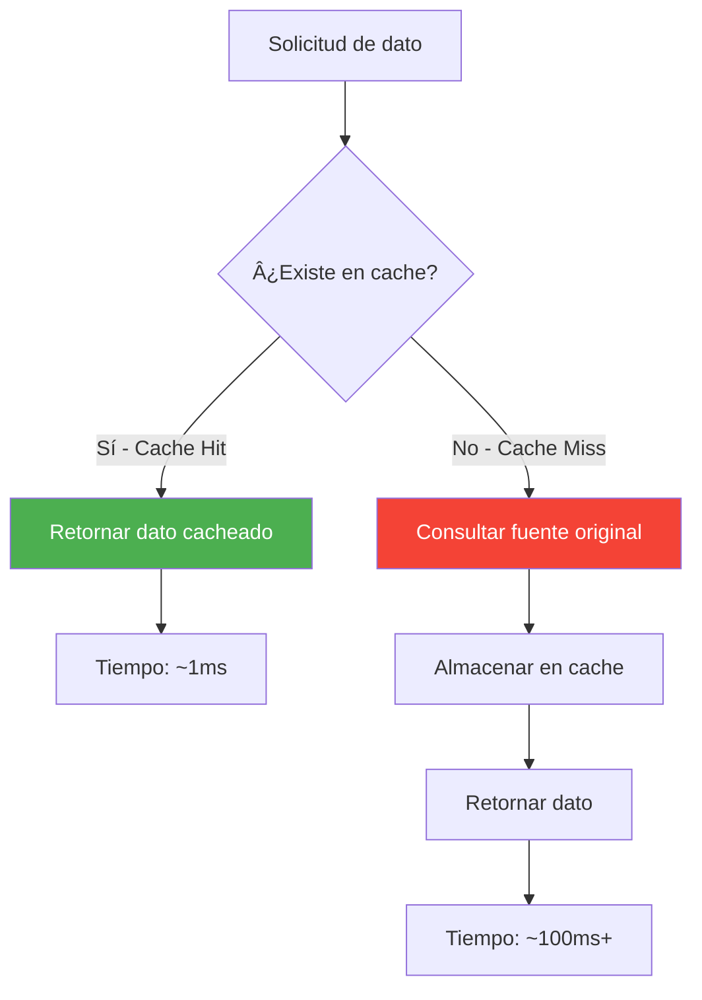
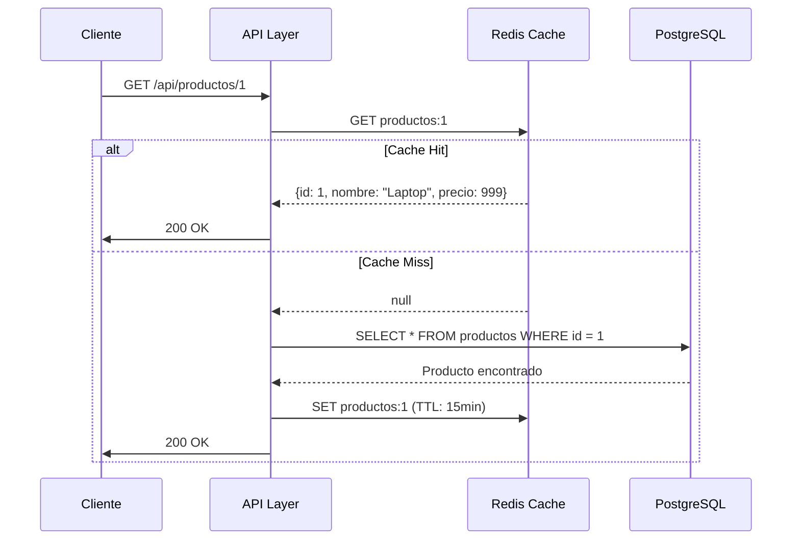
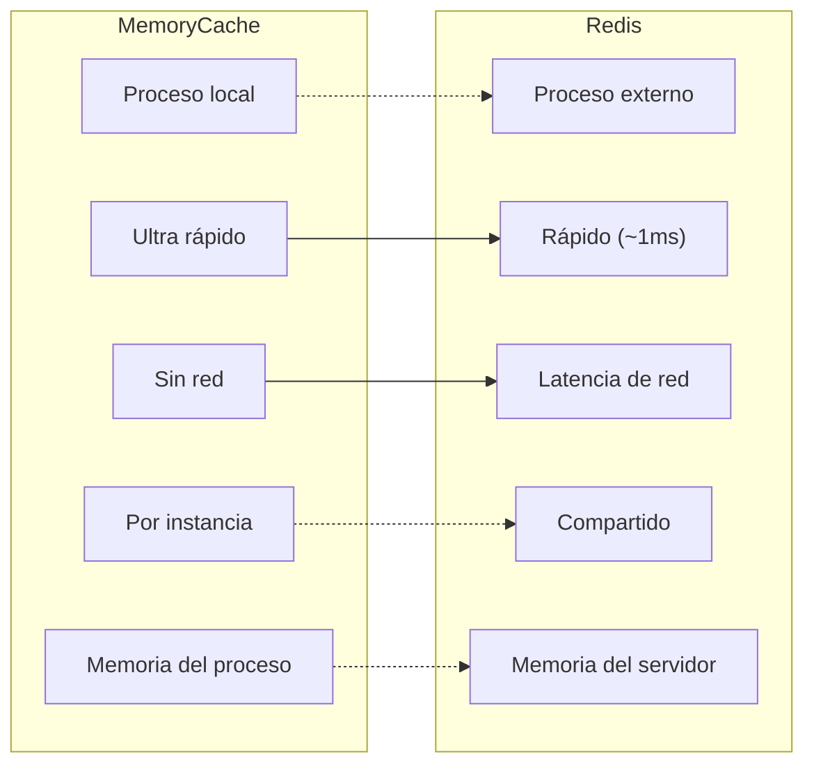
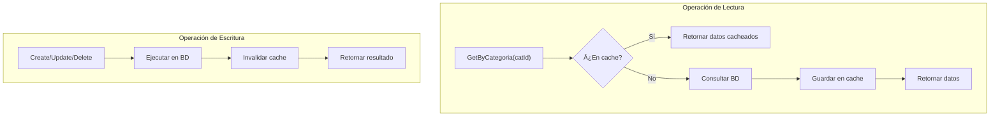
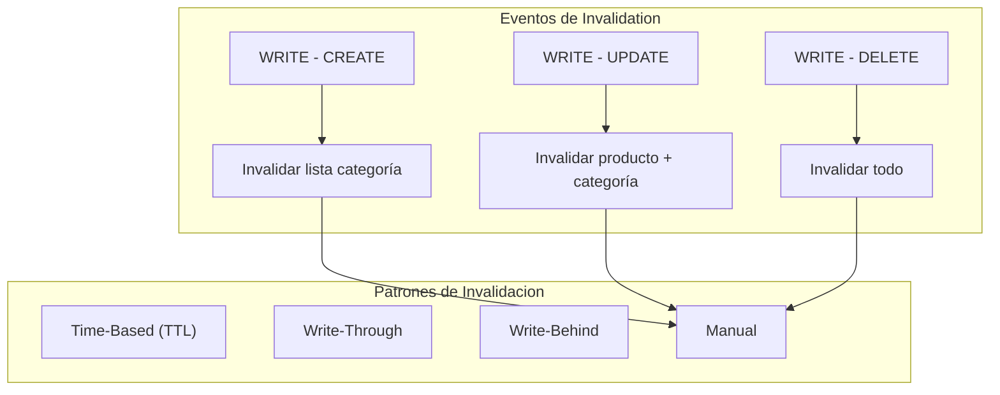

# 10. Redis Caching

## Índice

[10. Cache y Redis](#10-cache-y-redis)
  - [10.1. Conceptos Fundamentales de Cache](#101-conceptos-fundamentales-de-cache)
  - [10.2. Cache-Aside Pattern (Lazy Loading)](#102-cache-aside-pattern-lazy-loading)
  - [10.3. MemoryCache vs Redis](#103-memorycache-vs-redis)
  - [10.4. Configuración según Entorno](#104-configuracin-segn-entorno)
  - [10.5. ICacheService Interface Contracts](#105-icacheservice-interface-contracts)
  - [10.6. Implementación de Cache de Productos](#106-implementacin-de-cache-de-productos)
  - [10.7. Cache en Servicios de Negocio](#107-cache-en-servicios-de-negocio)
  - [10.8. Invalidación de Cache](#108-invalidacin-de-cache)
  - [10.9. Cache de Segundo Nivel (Fallback)](#109-cache-de-segundo-nivel-fallback)
  - [10.10. Resumen y Buenas Prácticas](#1010-resumen-y-buenas-prcticas)

---

## 10.1. Conceptos Fundamentales de Cache

### ¿Qué es un Cache?

Un cache es una capa de almacenamiento temporal que guarda copias de datos frecuentemente accedidos para reducir el tiempo de acceso. El principio fundamental se basa en la **localidad de referencia**: los datos recientemente accedidos tienen mayor probabilidad de ser accedidos de nuevo.

### Cache Hit vs Cache Miss



### Métricas de Rendimiento del Cache

```csharp
public class CacheMetrics
{
    public long Hits { get; private set; }
    public long Misses { get; private set; }
    
    public double HitRate => Hits / (double)(Hits + Misses) * 100;
    public long TotalRequests => Hits + Misses;
    
    public void RecordHit() => Interlocked.Increment(ref Hits);
    public void RecordMiss() => Interlocked.Increment(ref Misses);
}
```

---

## 10.2. Cache-Aside Pattern (Lazy Loading)

El patrón cache-aside (también conocido como lazy caching) es el más utilizado en aplicaciones web. Funciona así:

1. La aplicación primero verifica si el dato está en cache
2. Si está (hit), retorna el dato directamente
3. Si no está (miss), consulta la fuente original (base de datos)
4. Guarda el resultado en cache para futuras solicitudes
5. Retorna el dato al cliente



### Implementación Completa del Cache-Aside

```csharp
using Microsoft.Extensions.Caching.Distributed;
using System.Text.Json;

namespace TiendaApi.Core.Services;

public class CacheService : ICacheService
{
    private readonly IDistributedCache _cache;
    private readonly ILogger<CacheService> _logger;
    private readonly JsonSerializerOptions _jsonOptions;
    private readonly TimeSpan _defaultExpiry;
    private readonly TimeSpan _slidingExpiry;

    public CacheService(
        IDistributedCache cache,
        ILogger<CacheService> logger,
        IConfiguration configuration)
    {
        _cache = cache;
        _logger = logger;
        
        _jsonOptions = new JsonSerializerOptions
        {
            PropertyNamingPolicy = JsonNamingPolicy.CamelCase,
            WriteIndented = false
        };
        
        // Configuración desde appsettings.json
        _defaultExpiry = TimeSpan.FromMinutes(
            configuration.GetValue<int>("Cache:DefaultExpiryMinutes", 15));
        _slidingExpiry = TimeSpan.FromMinutes(
            configuration.GetValue<int>("Cache:SlidingExpiryMinutes", 5));
    }

    /// <summary>
    /// Obtiene un valor de cache o lo genera si no existe
    /// </summary>
    public async Task<TCache?> GetOrSetAsync<TCache>(
        string key, 
        Func<Task<TCache>> factory,
        TimeSpan? expiry = null)
    {
        try
        {
            // Intentar obtener de cache
            var cachedValue = await _cache.GetStringAsync(key);
            
            if (cachedValue != null)
            {
                _logger.LogDebug("Cache HIT para key: {Key}", key);
                RecordMetric("hit", key);
                return JsonSerializer.Deserialize<TCache>(cachedValue, _jsonOptions);
            }

            // Cache miss - generar el valor
            _logger.LogDebug("Cache MISS para key: {Key}", key);
            RecordMetric("miss", key);
            
            var value = await factory();
            
            if (value != null)
            {
                await SetAsync(key, value, expiry);
            }
            
            return value;
        }
        catch (Exception ex)
        {
            _logger.LogError(ex, "Error accediendo al cache para key: {Key}", key);
            // Fail-open: si el cache falla, retornamos el valor generado
            return await factory();
        }
    }

    /// <summary>
    /// Obtiene un valor sin ejecutar el factory (solo lectura)
    /// </summary>
    public async Task<TCache?> GetAsync<TCache>(string key)
    {
        try
        {
            var cachedValue = await _cache.GetStringAsync(key);
            return cachedValue != null 
                ? JsonSerializer.Deserialize<TCache>(cachedValue, _jsonOptions) 
                : default;
        }
        catch (Exception ex)
        {
            _logger.LogError(ex, "Error obteniendo de cache para key: {Key}", key);
            return default;
        }
    }

    /// <summary>
    /// Almacena un valor en cache
    /// </summary>
    public async Task SetAsync<TCache>(string key, TCache value, TimeSpan? expiry = null)
    {
        try
        {
            var options = new DistributedCacheEntryOptions
            {
                AbsoluteExpirationRelativeToNow = expiry ?? _defaultExpiry,
                SlidingExpiration = _slidingExpiry
            };

            var serialized = JsonSerializer.Serialize(value, _jsonOptions);
            await _cache.SetStringAsync(key, serialized, options);
            
            _logger.LogDebug("Cache SET para key: {Key}, TTL: {TTL}", 
                key, options.AbsoluteExpirationRelativeToNow);
        }
        catch (Exception ex)
        {
            _logger.LogError(ex, "Error guardando en cache para key: {Key}", key);
        }
    }

    /// <summary>
    /// Elimina una entrada específica
    /// </summary>
    public async Task RemoveAsync(string key)
    {
        try
        {
            await _cache.RemoveAsync(key);
            _logger.LogDebug("Cache REMOVE para key: {Key}", key);
        }
        catch (Exception ex)
        {
            _logger.LogError(ex, "Error eliminando del cache para key: {Key}", key);
        }
    }

    /// <summary>
    /// Elimina múltiples entradas por patrón
    /// </summary>
    public async Task RemoveByPatternAsync(string pattern)
    {
        try
        {
            // Nota: Redis no tiene búsqueda nativa por patrón en todas las versiones
            // Usar SCAN o KEYS con precaución
            var keys = await GetKeysByPatternAsync(pattern);
            
            foreach (var key in keys)
            {
                await _cache.RemoveAsync(key);
            }
            
            _logger.LogInformation("Eliminados {Count} keys con patrón: {Pattern}", 
                keys.Count, pattern);
        }
        catch (Exception ex)
        {
            _logger.LogError(ex, "Error eliminando por patrón: {Pattern}", pattern);
        }
    }

    /// <summary>
    /// Verifica si una clave existe en cache
    /// </summary>
    public async Task<bool> ExistsAsync(string key)
    {
        try
        {
            return await _cache.GetStringAsync(key) != null;
        }
        catch (Exception ex)
        {
            _logger.LogError(ex, "Error verificando existencia en cache para key: {Key}", key);
            return false;
        }
    }

    /// <summary>
    /// Refresca el TTL de una entrada
    /// </summary>
    public async Task RefreshAsync(string key)
    {
        try
        {
            var value = await _cache.GetStringAsync(key);
            if (value != null)
            {
                await _cache.RefreshAsync(key);
            }
        }
        catch (Exception ex)
        {
            _logger.LogError(ex, "Error refrescando TTL para key: {Key}", key);
        }
    }

    private async Task<List<string>> GetKeysByPatternAsync(string pattern)
    {
        // Implementación depende del cliente Redis usado
        // StackExchange.Redis tiene método Keys()
        var keys = new List<string>();
        
        // Este es un ejemplo conceptual - implementar según el cliente
        await Task.CompletedTask;
        
        return keys;
    }

    private void RecordMetric(string type, string key)
    {
        // Registrar métrica para monitoring
        _logger.LogDebug("Cache {Type} para {Key}", type, key);
    }
}
```

---

## 10.3. MemoryCache vs Redis

### Comparación Detallada



### MemoryCache (IMemoryCache)

**Características:**
- Almacenado en memoria del proceso
- Sin overhead de red
- Compartido entre hilos del mismo proceso
- Se pierde al reiniciar la aplicación
- Ideal para aplicaciones de instancia única

```csharp
using Microsoft.Extensions.Caching.Memory;

public class MemoryCacheService : IMemoryCacheService
{
    private readonly IMemoryCache _cache;
    private readonly TimeSpan _defaultExpiry;

    public MemoryCacheService(IMemoryCache cache, IConfiguration configuration)
    {
        _cache = cache;
        _defaultExpiry = TimeSpan.FromMinutes(
            configuration.GetValue<int>("Cache:DefaultExpiryMinutes", 15));
    }

    public T? Get<T>(string key) => _cache.Get<T>(key);

    public void Set<T>(string key, T value, TimeSpan? expiry = null)
    {
        _cache.Set(key, value, expiry ?? _defaultExpiry);
    }

    public void Remove(string key) => _cache.Remove(key);

    public T? GetOrCreate<T>(string key, Func<ICacheEntry, T> factory)
    {
        return _cache.GetOrCreate(key, factory);
    }

    public T? GetOrCreateAsync<T>(string key, Func<Task<T>> factory)
    {
        // IMemoryCache no tiene método async nativo
        // Usar Task.Run para envolver
        return _cache.GetOrCreate(key, entry =>
        {
            entry.Value = null;
            return default;
        });
    }
}
```

### Redis (IDistributedCache)

**Características:**
- Almacenado en servidor Redis externo
- Compartido entre múltiples instancias de la aplicación
- Persistente (configurable)
- Soporta eviction policies avanzadas
- Ideal para aplicaciones distribuidas/multi-instancia

```csharp
using Microsoft.Extensions.Caching.Distributed;
using StackExchange.Redis;

public class RedisCacheService : IDistributedCacheService
{
    private readonly IDistributedCache _cache;
    private readonly IConnectionMultiplexer _connection;
    private readonly IDatabase _db;
    private readonly ILogger<RedisCacheService> _logger;

    public RedisCacheService(
        IDistributedCache cache,
        IConnectionMultiplexer connection,
        ILogger<RedisCacheService> logger)
    {
        _cache = cache;
        _connection = connection;
        _db = connection.GetDatabase();
        _logger = logger;
    }

    public async Task<T?> GetAsync<T>(string key)
    {
        try
        {
            var value = await _cache.GetStringAsync(key);
            return value != null 
                ? JsonSerializer.Deserialize<T>(value) 
                : default;
        }
        catch (Exception ex)
        {
            _logger.LogError(ex, "Error getting from Redis: {Key}", key);
            return default;
        }
    }

    public async Task SetAsync<T>(string key, T value, TimeSpan? expiry = null)
    {
        try
        {
            var options = new DistributedCacheEntryOptions
            {
                AbsoluteExpirationRelativeToNow = expiry ?? TimeSpan.FromMinutes(15),
                SlidingExpiration = TimeSpan.FromMinutes(5)
            };
            
            await _cache.SetStringAsync(key, JsonSerializer.Serialize(value), options);
        }
        catch (Exception ex)
        {
            _logger.LogError(ex, "Error setting to Redis: {Key}", key);
        }
    }

    public async Task RemoveAsync(string key)
    {
        try
        {
            await _cache.RemoveAsync(key);
        }
        catch (Exception ex)
        {
            _logger.LogError(ex, "Error removing from Redis: {Key}", key);
        }
    }

    // Operaciones específicas de Redis
    public async Task<bool> SetNXAsync(string key, string value, TimeSpan expiry)
    {
        return await _cache.SetStringAsync(key, value, new DistributedCacheEntryOptions
        {
            AbsoluteExpirationRelativeToNow = expiry
        }) != null;
    }

    public async Task<long> IncrementAsync(string key)
    {
        return await _db.StringIncrementAsync(key);
    }

    public async Task<long> DecrementAsync(string key)
    {
        return await _db.StringDecrementAsync(key);
    }

    public async Task<bool> HashSetAsync(string key, string field, string value)
    {
        return await _db.HashSetAsync(key, field, value);
    }

    public async Task<HashEntry[]?> HashGetAllAsync(string key)
    {
        return await _db.HashGetAllAsync(key);
    }

    public async Task AddToListAsync(string key, string value)
    {
        await _db.ListRightPushAsync(key, value);
    }

    public async Task<List<string>> GetListAsync(string key)
    {
        var values = await _db.ListRangeAsync(key);
        return values.Select(v => v.ToString()).ToList();
    }
}
```

---

## 10.4. Configuración según Entorno (Development vs Production)

### appsettings.json

```json
{
  "Cache": {
    "Provider": "Redis",  // "Memory" o "Redis"
    "DefaultExpiryMinutes": 15,
    "SlidingExpiryMinutes": 5,
    "KeyPrefix": "TiendaApi:"
  },
  
  "ConnectionStrings": {
    "Redis": "localhost:6379,password=,abortConnect=false"
  },
  
  "Redis": {
    "InstanceName": "TiendaApi:",
    "ConnectRetry": 3,
    "ConnectTimeout": 5000,
    "SyncTimeout": 3000,
    "KeepAlive": 60
  }
}
```

### CacheOptions Configuration

```csharp
public class CacheOptions
{
    public string Provider { get; set; } = "Memory";
    public int DefaultExpiryMinutes { get; set; } = 15;
    public int SlidingExpiryMinutes { get; set; } = 5;
    public string KeyPrefix { get; set; } = "TiendaApi:";
    
    public bool UseRedis => Provider.Equals("Redis", StringComparison.OrdinalIgnoreCase);
    public bool UseMemory => Provider.Equals("Memory", StringComparison.OrdinalIgnoreCase);
}
```

### Registro Dinámico según Entorno

```csharp
using Microsoft.Extensions.Caching.Distributed;
using Microsoft.Extensions.Caching.Memory;
using StackExchange.Redis;

public static class CacheServiceExtensions
{
    public static IServiceCollection AddCacheServices(
        this IServiceCollection services,
        IConfiguration configuration)
    {
        var cacheOptions = new CacheOptions();
        configuration.GetSection("Cache").Bind(cacheOptions);
        
        services.AddSingleton(cacheOptions);
        
        if (cacheOptions.UseMemory && 
            !cacheOptions.UseRedis)
        {
            // Solo MemoryCache
            services.AddMemoryCache(options =>
            {
                options.SizeLimit = 1000; // Max 1000 entradas
                options.ExpirationScanFrequency = TimeSpan.FromMinutes(1);
            });
            
            services.AddSingleton<ICacheService, MemoryCacheService>();
            services.AddSingleton<IMemoryCacheService, MemoryCacheService>();
        }
        else if (cacheOptions.UseRedis)
        {
            // Redis (en desarrollo puede usar local, en producción usa servidor)
            services.AddSingleton<IConnectionMultiplexer>(sp =>
            {
                var redisConnection = configuration.GetConnectionString("Redis") 
                    ?? "localhost:6379";
                
                var options = ConfigurationOptions.Parse(redisConnection);
                options.AbortOnConnectFail = false;
                options.ConnectRetry = 3;
                options.ConnectTimeout = 5000;
                options.SyncTimeout = 3000;
                options.KeepAlive = 60;
                
                // En desarrollo, no require password
                // En producción, configurar desde secrets
                var password = configuration["Redis:Password"];
                if (!string.IsNullOrEmpty(password))
                {
                    options.Password = password;
                }
                
                return ConnectionMultiplexer.Connect(options);
            });
            
            services.AddDistributedCacheRedis(options =>
            {
                options.InstanceName = configuration["Redis:InstanceName"] ?? "TiendaApi:";
                options.DefaultExpiryMinutes = cacheOptions.DefaultExpiryMinutes;
                options.KeyPrefix = cacheOptions.KeyPrefix;
            });
        }
        else
        {
            // Fallback a MemoryCache
            services.AddMemoryCache();
            services.AddSingleton<ICacheService, MemoryCacheService>();
        }
        
        return services;
    }
}

// Extension para IDistributedCache con configuración
public static class DistributedCacheExtensions
{
    public static IServiceCollection AddDistributedCacheRedis(
        this IServiceCollection services,
        Action<RedisCacheOptions> configureOptions)
    {
        services.AddDistributedCache();
        services.Configure(configureOptions);
        
        services.AddSingleton<IDistributedCache>(sp =>
        {
            var options = sp.GetRequiredService<IOptions<RedisCacheOptions>>().Value;
            var connection = sp.GetRequiredService<IConnectionMultiplexer>();
            var logger = sp.GetRequiredService<ILogger<RedisCache>>();
            
            return new RedisCache(connection, options, logger);
        });
        
        return services;
    }
}

public class RedisCacheOptions
{
    public string InstanceName { get; set; } = "TiendaApi:";
    public int DefaultExpiryMinutes { get; set; } = 15;
    public string KeyPrefix { get; set; } = "";
}
```

### Program.cs con Configuración por Entorno

```csharp
using Microsoft.Extensions.Caching.Distributed;
using Microsoft.Extensions.Caching.Memory;

var builder = WebApplication.CreateBuilder(args);

// Configuración de cache basada en entorno
var cacheProvider = builder.Configuration["Cache:Provider"] ?? 
    (builder.Environment.IsDevelopment() ? "Memory" : "Redis");

switch (cacheProvider.ToLower())
{
    case "redis":
        // Configuración Redis
        var redisConnection = builder.Configuration.GetConnectionString("Redis") 
            ?? "localhost:6379";
        
        builder.Services.AddSingleton<IConnectionMultiplexer>(sp =>
        {
            var options = ConfigurationOptions.Parse(redisConnection);
            options.AbortOnConnectFail = false;
            options.ConnectRetry = 3;
            
            if (!string.IsNullOrEmpty(builder.Configuration["Redis:Password"]))
            {
                options.Password = builder.Configuration["Redis:Password"];
            }
            
            return ConnectionMultiplexer.Connect(options);
        });
        
        builder.Services.AddDistributedCacheRedis(options =>
        {
            options.InstanceName = builder.Configuration["Redis:InstanceName"] ?? "TiendaApi:";
            options.DefaultExpiryMinutes = builder.Configuration.GetValue<int>("Cache:DefaultExpiryMinutes", 15);
        });
        
        builder.Services.AddScoped<ICacheService, RedisCacheService>();
        break;
        
    case "memory":
    default:
        builder.Services.AddMemoryCache(options =>
        {
            options.SizeLimit = 1000;
            options.ExpirationScanFrequency = TimeSpan.FromMinutes(1);
        });
        
        builder.Services.AddScoped<ICacheService, MemoryCacheService>();
        break;
}

// Registro de servicios que usan cache
builder.Services.AddScoped<IProductoCacheService, ProductoCacheService>();

var app = builder.Build();

// Verificar conexión Redis en startup (solo si se usa Redis)
if (cacheProvider.ToLower() == "redis")
{
    using var scope = app.Services.CreateScope();
    var connection = scope.ServiceProvider.GetRequiredService<IConnectionMultiplexer>();
    
    try
    {
        var db = connection.GetDatabase();
        await db.PingAsync();
        app.Logger.LogInformation("Conexión a Redis establecida");
    }
    catch (Exception ex)
    {
        app.Logger.LogWarning(ex, "No se pudo conectar a Redis - continuando sin cache");
    }
}
```

---

## 10.5. ICacheService Interface Contracts

```csharp
namespace TiendaApi.Core.Interfaces;

/// <summary>
/// Interface abstraca para operaciones básicas de cache
/// </summary>
public interface ICacheService
{
    /// <summary>
    /// Obtiene un valor del cache
    /// </summary>
    Task<TCache?> GetAsync<TCache>(string key);
    
    /// <summary>
    /// Almacena un valor en cache
    /// </summary>
    Task SetAsync<TCache>(string key, TCache value, TimeSpan? expiry = null);
    
    /// <summary>
    /// Obtiene un valor o lo genera si no existe
    /// </summary>
    Task<TCache?> GetOrSetAsync<TCache>(
        string key, 
        Func<Task<TCache>> factory,
        TimeSpan? expiry = null);
    
    /// <summary>
    /// Elimina una entrada del cache
    /// </summary>
    Task RemoveAsync(string key);
    
    /// <summary>
    /// Verifica si una clave existe
    /// </summary>
    Task<bool> ExistsAsync(string key);
    
    /// <summary>
    /// Elimina entradas por patrón
    /// </summary>
    Task RemoveByPatternAsync(string pattern);
}

/// <summary>
/// Interface para operaciones específicas de cache de productos
/// </summary>
public interface IProductCacheService
{
    Task<List<Producto>?> GetCachedProductsByCategoriaAsync(long categoriaId);
    Task CacheProductsByCategoriaAsync(long categoriaId, List<Producto> productos);
    Task InvalidateCategoriaCacheAsync(long categoriaId);
    Task InvalidateAllProductsCacheAsync();
    Task InvalidateProductoCacheAsync(long productoId);
}

/// <summary>
/// Interface para operaciones de cache de usuario
/// </summary>
public interface IUserCacheService
{
    Task<UserProfile?> GetCachedUserProfileAsync(long userId);
    Task CacheUserProfileAsync(long userId, UserProfile profile);
    Task InvalidateUserCacheAsync(long userId);
    Task InvalidateAllUsersCacheAsync();
}

/// <summary>
/// Interface para operaciones avanzadas de Redis
/// </summary>
public interface IRedisCacheService : ICacheService
{
    Task<bool> SetNXAsync(string key, string value, TimeSpan expiry);
    Task<long> IncrementAsync(string key);
    Task<long> DecrementAsync(string key);
    Task AddToSetAsync(string key, string value);
    Task<HashSet<string>> GetSetAsync(string key);
    Task<bool> SetContainsAsync(string key, string value);
}
```

---

## 10.6. Implementación de Cache de Productos

```csharp
using TiendaApi.Core.Interfaces;

namespace TiendaApi.Core.Services;

public class ProductCacheService : IProductCacheService
{
    private readonly ICacheService _cacheService;
    private readonly TimeSpan _cacheExpiry;
    private readonly string _keyPrefix;

    private const string PRODUCTOS_BY_CATEGORIA_KEY = "productos:categoria:{0}";
    private const string PRODUCTO_KEY = "producto:{0}";
    private const string PRODUCTOS_ALL_KEY = "productos:all";
    private const string PRODUCTOS_PATTERN = "productos:*";

    public ProductCacheService(
        ICacheService cacheService,
        IConfiguration configuration)
    {
        _cacheService = cacheService;
        _cacheExpiry = TimeSpan.FromMinutes(
            configuration.GetValue<int>("Cache:ProductExpiryMinutes", 15));
        _keyPrefix = configuration["Cache:KeyPrefix"] ?? "";
    }

    private string FormatKey(string key, params object[] args)
    {
        return _keyPrefix + string.Format(key, args);
    }

    public async Task<List<Producto>?> GetCachedProductsByCategoriaAsync(long categoriaId)
    {
        var key = FormatKey(PRODUCTOS_BY_CATEGORIA_KEY, categoriaId);
        return await _cacheService.GetAsync<List<Producto>>(key);
    }

    public async Task CacheProductsByCategoriaAsync(
        long categoriaId, 
        List<Producto> productos)
    {
        var key = FormatKey(PRODUCTOS_BY_CATEGORIA_KEY, categoriaId);
        await _cacheService.SetAsync(key, productos, _cacheExpiry);
    }

    public async Task InvalidateCategoriaCacheAsync(long categoriaId)
    {
        var key = FormatKey(PRODUCTOS_BY_CATEGORIA_KEY, categoriaId);
        await _cacheService.RemoveAsync(key);
        
        // También invalidar cache "todos los productos"
        await InvalidateAllProductsCacheAsync();
    }

    public async Task InvalidateAllProductsCacheAsync()
    {
        await _cacheService.RemoveByPatternAsync(
            FormatKey(PRODUCTOS_PATTERN));
    }

    public async Task InvalidateProductoCacheAsync(long productoId)
    {
        var key = FormatKey(PRODUCTO_KEY, productoId);
        await _cacheService.RemoveAsync(key);
        
        // Invalidar cache de categorías
        await _cacheService.RemoveByPatternAsync(
            FormatKey(PRODUCTOS_BY_CATEGORIA_KEY.Replace("{0}", "*")));
    }
}
```

---

## 10.7. Cache en Servicios de Negocio

El cache se integra en los servicios de negocio usando el patrón Cache-Aside: primero intentamos obtener de cache, si no está, consultamos la base de datos y guardamos en cache.

```csharp
public class ProductoService(
    IProductoRepository productoRepository,
    IProductCacheService productCache,
    IValidator<CreateProductoRequest>? createValidator = null,
    IValidator<UpdateProductoRequest>? updateValidator = null) 
    : IProductoService
{
    /// <summary>
    /// Obtiene productos por categoría con estrategia cache-aside
    /// </summary>
    public async Task<Result<List<Producto>, Error>> GetByCategoriaAsync(long categoriaId)
    {
        // Paso 1: Intentar obtener de cache
        var cached = await productCache.GetCachedProductsByCategoriaAsync(categoriaId);
        
        if (cached != null)
        {
            return Result.Success<List<Producto>, Error>(cached);
        }

        // Paso 2: Cache miss - consultar base de datos
        var productos = await productoRepository.GetByCategoriaIdAsync(categoriaId);
        
        if (productos.Count == 0)
        {
            return Result.Failure<List<Producto>, Error>(
                Errors.Productos.NoEncontrados);
        }

        // Paso 3: Guardar en cache para próxima vez
        await productCache.CacheProductsByCategoriaAsync(categoriaId, productos);

        return Result.Success<List<Producto>, Error>(productos);
    }

    /// <summary>
    /// Crea un producto e invalida el cache de su categoría
    /// </summary>
    public async Task<Result<Producto, Error>> CreateAsync(CreateProductoRequest request)
    {
        // Validación
        if (createValidator != null)
        {
            var validationResult = await createValidator.ValidateAsync(request);
            if (!validationResult.IsValid)
            {
                return Result.Failure<Producto, Error>(
                    Errors.Productos.DatosInvalidos(validationResult.Errors));
            }
        }

        // Crear producto
        var producto = new Producto
        {
            Nombre = request.Nombre,
            Descripcion = request.Descripcion,
            Precio = request.Precio,
            Stock = request.Stock,
            CategoriaId = request.CategoriaId,
            CreatedAt = DateTime.UtcNow
        };

        var result = await productoRepository.AddAsync(producto);

        if (result.IsSuccess)
        {
            // Invalidar cache de categoría después de crear
            await productCache.InvalidateCategoriaCacheAsync(request.CategoriaId);
        }

        return result;
    }

    /// <summary>
    /// Actualiza un producto e invalida caches relacionados
    /// </summary>
    public async Task<Result<Producto, Error>> UpdateAsync(
        long id, 
        UpdateProductoRequest request)
    {
        // Obtener producto actual
        var existingResult = await productoRepository.GetByIdAsync(id);
        if (existingResult.IsFailure)
        {
            return existingResult;
        }

        var producto = existingResult.Value;
        var categoriaIdAnterior = producto.CategoriaId;

        // Validación
        if (updateValidator != null)
        {
            var validationResult = await updateValidator.ValidateAsync(request);
            if (!validationResult.IsValid)
            {
                return Result.Failure<Producto, Error>(
                    Errors.Productos.DatosInvalidos(validationResult.Errors));
            }
        }

        // Actualizar propiedades
        producto.Nombre = request.Nombre ?? producto.Nombre;
        producto.Descripcion = request.Descripcion ?? producto.Descripcion;
        producto.Precio = request.Precio ?? producto.Precio;
        producto.Stock = request.Stock ?? producto.Stock;
        
        if (request.CategoriaId.HasValue && request.CategoriaId.Value != categoriaIdAnterior)
        {
            producto.CategoriaId = request.CategoriaId.Value;
        }
        
        producto.UpdatedAt = DateTime.UtcNow;

        // Guardar cambios
        var updateResult = await productoRepository.UpdateAsync(producto);

        if (updateResult.IsSuccess)
        {
            // Invalidar caches
            await productCache.InvalidateCategoriaCacheAsync(categoriaIdAnterior);
            
            if (request.CategoriaId.HasValue && request.CategoriaId.Value != categoriaIdAnterior)
            {
                await productCache.InvalidateCategoriaCacheAsync(request.CategoriaId.Value);
            }
            
            await productCache.InvalidateProductoCacheAsync(id);
        }

        return updateResult;
    }

    /// <summary>
    /// Elimina un producto e invalida caches relacionados
    /// </summary>
    public async Task<Result<bool, Error>> DeleteAsync(long id)
    {
        // Obtener producto primero para saber qué categoría invalidar
        var productoResult = await productoRepository.GetByIdAsync(id);
        var categoriaId = productoResult.IsSuccess 
            ? productoResult.Value.CategoriaId 
            : 0;

        var deleteResult = await productoRepository.DeleteAsync(id);

        if (deleteResult.IsSuccess && categoriaId > 0)
        {
            await productCache.InvalidateCategoriaCacheAsync(categoriaId);
            await productCache.InvalidateProductoCacheAsync(id);
        }

        return deleteResult;
    }
}
```

### Flujo de Cache en el Servicio



---

## 10.8. Invalidación de Cache

La invalidación es el proceso de eliminar o actualizar entradas de cache cuando los datos fuente cambian. Es uno de los desafíos más importantes del caching.

### Estrategias de Invalidación



### Invalidación Manual en Servicios

La invalidación se hace directamente en el servicio, después de cada operación de escritura:

```csharp
public class ProductoService(
    IProductoRepository productoRepository,
    IProductCacheService productCache,
    IValidator<CreateProductoRequest>? createValidator = null,
    IValidator<UpdateProductoRequest>? updateValidator = null) 
    : IProductoService
{
    public async Task<Result<Producto, Error>> CreateAsync(CreateProductoRequest request)
    {
        // Validación
        if (createValidator != null)
        {
            var validationResult = await createValidator.ValidateAsync(request);
            if (!validationResult.IsValid)
            {
                return Result.Failure<Producto, Error>(
                    Errors.Productos.DatosInvalidos(validationResult.Errors));
            }
        }

        // Crear producto
        var producto = new Producto
        {
            Nombre = request.Nombre,
            Descripcion = request.Descripcion,
            Precio = request.Precio,
            Stock = request.Stock,
            CategoriaId = request.CategoriaId,
            CreatedAt = DateTime.UtcNow
        };

        var result = await productoRepository.AddAsync(producto);

        if (result.IsSuccess)
        {
            // Invalidar cache de categoría DESPUá‰S de escribir
            await productCache.InvalidateCategoriaCacheAsync(request.CategoriaId);
        }

        return result;
    }

    public async Task<Result<Producto, Error>> UpdateAsync(
        long id, 
        UpdateProductoRequest request)
    {
        // Obtener producto actual
        var existingResult = await productoRepository.GetByIdAsync(id);
        if (existingResult.IsFailure)
        {
            return existingResult;
        }

        var producto = existingResult.Value;
        var categoriaIdAnterior = producto.CategoriaId;

        // Validación
        if (updateValidator != null)
        {
            var validationResult = await updateValidator.ValidateAsync(request);
            if (!validationResult.IsValid)
            {
                return Result.Failure<Producto, Error>(
                    Errors.Productos.DatosInvalidos(validationResult.Errors));
            }
        }

        // Actualizar propiedades
        producto.Nombre = request.Nombre ?? producto.Nombre;
        producto.Descripcion = request.Descripcion ?? producto.Descripcion;
        producto.Precio = request.Precio ?? producto.Precio;
        producto.Stock = request.Stock ?? producto.Stock;
        
        // Si cambió de categoría, guardar el ID
        if (request.CategoriaId.HasValue && request.CategoriaId.Value != categoriaIdAnterior)
        {
            producto.CategoriaId = request.CategoriaId.Value;
        }
        
        producto.UpdatedAt = DateTime.UtcNow;

        // Guardar cambios
        var updateResult = await productoRepository.UpdateAsync(producto);

        if (updateResult.IsSuccess)
        {
            // Invalidar caches
            await productCache.InvalidateCategoriaCacheAsync(categoriaIdAnterior);
            
            // Si cambió de categoría, invalidar ambas
            if (request.CategoriaId.HasValue && request.CategoriaId.Value != categoriaIdAnterior)
            {
                await productCache.InvalidateCategoriaCacheAsync(request.CategoriaId.Value);
            }
            
            await productCache.InvalidateProductoCacheAsync(id);
        }

        return updateResult;
    }

    public async Task<Result<bool, Error>> DeleteAsync(long id)
    {
        // Obtener producto primero para saber qué categoría invalidar
        var productoResult = await productoRepository.GetByIdAsync(id);
        var categoriaId = productoResult.IsSuccess 
            ? productoResult.Value.CategoriaId 
            : 0;

        var deleteResult = await productoRepository.DeleteAsync(id);

        if (deleteResult.IsSuccess && categoriaId > 0)
        {
            // Invalidar cache de categoría
            await productCache.InvalidateCategoriaCacheAsync(categoriaId);
            await productCache.InvalidateProductoCacheAsync(id);
        }

        return deleteResult;
    }
}
```

### Servicio Dedicado de Invalidación

```csharp
public class CacheInvalidationService
{
    private readonly ICacheService _cacheService;
    private readonly string _keyPrefix;

    public CacheInvalidationService(
        ICacheService cacheService,
        IConfiguration configuration)
    {
        _cacheService = cacheService;
        _keyPrefix = configuration["Cache:KeyPrefix"] ?? "";
    }

    private string FormatKey(string key, params object[] args)
    {
        return _keyPrefix + string.Format(key, args);
    }

    public async Task InvalidateEntityAsync(string entityType, long entityId)
    {
        var key = FormatKey($"{entityType.ToLower()}:{entityId}");
        await _cacheService.RemoveAsync(key);
    }

    public async Task InvalidateEntityCollectionAsync(string entityType, long relatedId)
    {
        var pattern = FormatKey($"{entityType.ToLower()}:{relatedId}:*");
        await _cacheService.RemoveByPatternAsync(pattern);
    }

    public async Task InvalidateAllAsync()
    {
        // Precaución: invalida todo el cache
        await _cacheService.RemoveByPatternAsync(_keyPrefix + "*");
    }
}
```

### Resumen de Invalidación

| Operación | Keys a Invalidar |
|-----------|------------------|
| CREATE producto | productos:categoria:{categoriaId} |
| UPDATE producto | productos:categoria:{categoriaId} + producto:{id} |
| DELETE producto | productos:categoria:{categoriaId} + producto:{id} |
| UPDATE categoría | productos:categoria:{id} + productos:* |

---

## 10.9. Cache de Segundo Nivel (Fallback)

```csharp
public class CacheWithFallbackService : ICacheService
{
    private readonly IDistributedCache _primaryCache;
    private readonly IMemoryCache _secondaryCache;
    private readonly ILogger<CacheWithFallbackService> _logger;
    private readonly TimeSpan _secondaryExpiry;

    public CacheWithFallbackService(
        IDistributedCache primaryCache,
        IMemoryCache secondaryCache,
        ILogger<CacheWithFallbackService> logger)
    {
        _primaryCache = primaryCache;
        _secondaryCache = secondaryCache;
        _logger = logger;
        _secondaryExpiry = TimeSpan.FromMinutes(2); // Cache L2: 2 minutos
    }

    public async Task<TCache?> GetOrSetAsync<TCache>(
        string key, 
        Func<Task<TCache>> factory,
        TimeSpan? expiry = null)
    {
        try
        {
            // 1. Intentar cache L1 (Memory - ultra rápido)
            if (_secondaryCache.TryGetValue(key, out TCache? l1Value))
            {
                // Refrescar L2 en background
                RefreshCacheInBackground(key, factory, expiry);
                return l1Value;
            }
        }
        catch (Exception ex)
        {
            _logger.LogWarning(ex, "Error accediendo a cache L1");
        }

        try
        {
            // 2. Intentar cache L2 (Redis - rápido)
            var l2Value = await _primaryCache.GetStringAsync(key);
            if (l2Value != null)
            {
                var value = JsonSerializer.Deserialize<TCache>(l2Value);
                if (value != null)
                {
                    // Poblar L1 para próxima vez
                    _secondaryCache.Set(key, value, _secondaryExpiry);
                    return value;
                }
            }
        }
        catch (Exception ex)
        {
            _logger.LogWarning(ex, "Error accediendo a cache L2");
        }

        // 3. Cache miss - generar valor
        var result = await factory();
        
        if (result != null)
        {
            // Poblar ambos caches
            try
            {
                _secondaryCache.Set(key, result, _secondaryExpiry);
            }
            catch { }
            
            try
            {
                await SetAsync(key, result, expiry);
            }
            catch { }
        }
        
        return result;
    }

    private async void RefreshCacheInBackground<TCache>(
        string key, 
        Func<Task<TCache>> factory,
        TimeSpan? expiry)
    {
        try
        {
            var value = await factory();
            if (value != null)
            {
                await SetAsync(key, value, expiry);
            }
        }
        catch (Exception ex)
        {
            _logger.LogError(ex, "Error refrescando cache en background");
        }
    }

    // Resto de métodos...
    public Task<TCache?> GetAsync<TCache>(string key) => /* ... */;
    public Task SetAsync<TCache>(string key, TCache value, TimeSpan? expiry = null) => /* ... */;
    public Task RemoveAsync(string key) => /* ... */;
}
```

---

## 10.10. Resumen y Buenas Prácticas

### Puntos Clave del Módulo

| Concepto | Descripción |
|----------|-------------|
| Cache-Aside | Patrón más común: leer cache primero, fallback a base de datos |
| TTL (Time-To-Live) | Tiempo de vida del cache antes de expiración |
| Eviction Policies | Estrategia de cuándo eliminar entradas del cache |
| Fail-Open | Si el cache falla, continuar sin él |
| Invalidación | Estrategias para mantener cache sincronizado |

### Buenas Prácticas

```mermaid
flowchart TB
    subgraph "Diseño"
        A1["Cache datosreadonly o lentamente cambiantes"]
        A2["Evitar cachear datos sensibles"]
        A3["Establecer TTL apropiado"]
        A4["Monitorear la tasa de aciertos (hit rate)"]
    end
    
    subgraph "Rendimiento"
        B1["Serialización eficiente (System.Text.Json)"]
        B2["Compresión para datos grandes"]
        B3["Pool de conexiones Redis"]
        B4["Pipeline de comandos"]
    end
    
    subgraph "Confiabilidad"
        C1["Fail-open ante fallos de cache"]
        C2["Retry policies"]
        C3["Circuit breaker pattern"]
        C4["Logging y métricas"]
    end
    
    subgraph "Operaciones"
        D1["Monitoreo de memoria Redis"]
        D2["Alertas de tasa de aciertos baja"]
        D3["Limpieza periódica de claves huérfanas"]
        D4["Backup de datos en cache"]
    end
    
    A1 --> A2 --> A3 --> A4
    B1 --> B2 --> B3 --> B4
    C1 --> C2 --> C3 --> C4
    D1 --> D2 --> D3 --> D4
```



### Commands áštiles

```bash
# Conectar a Redis CLI
redis-cli

# Ver keys
KEYS patrones:*

# Ver statistics
INFO stats

# Ver memory usage
MEMORY USAGE key

# Eliminar todas las keys
FLUSHALL

# Ver hit rate
redis-cli INFO stats | grep keyspace_hits
```

### Siguientes Pasos

Con Redis dominado, el siguiente paso es aprender sobre autenticación JWT para proteger las APIs.

### Recursos Adicionales

- Redis Documentation: https://redis.io/docs/
- StackExchange.Redis: https://stackexchange.github.io/StackExchange.Redis/
- Cache-Aside Pattern: https://learn.microsoft.com/en-us/azure/architecture/patterns/cache-aside
- Distributed Caching: https://learn.microsoft.com/en-us/aspnet/core/performance/caching/distributed
