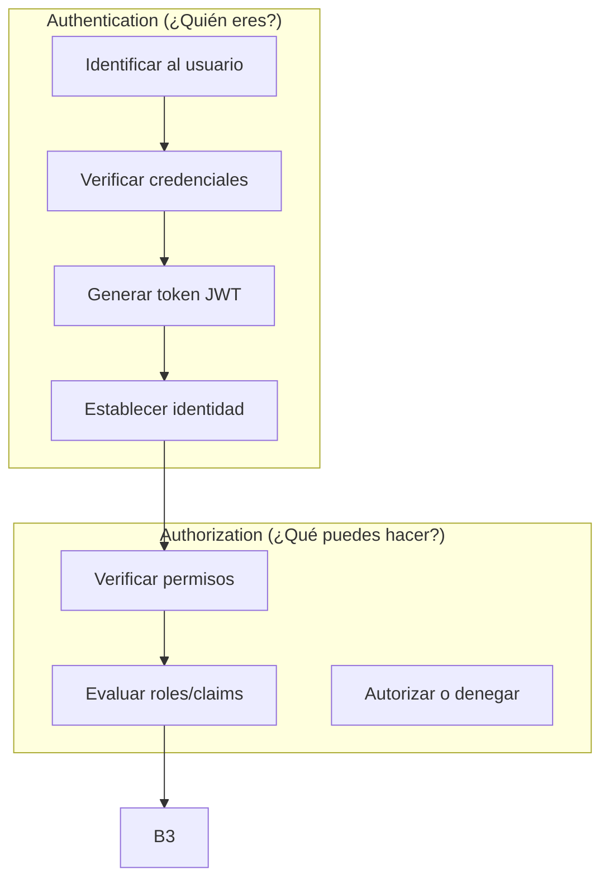
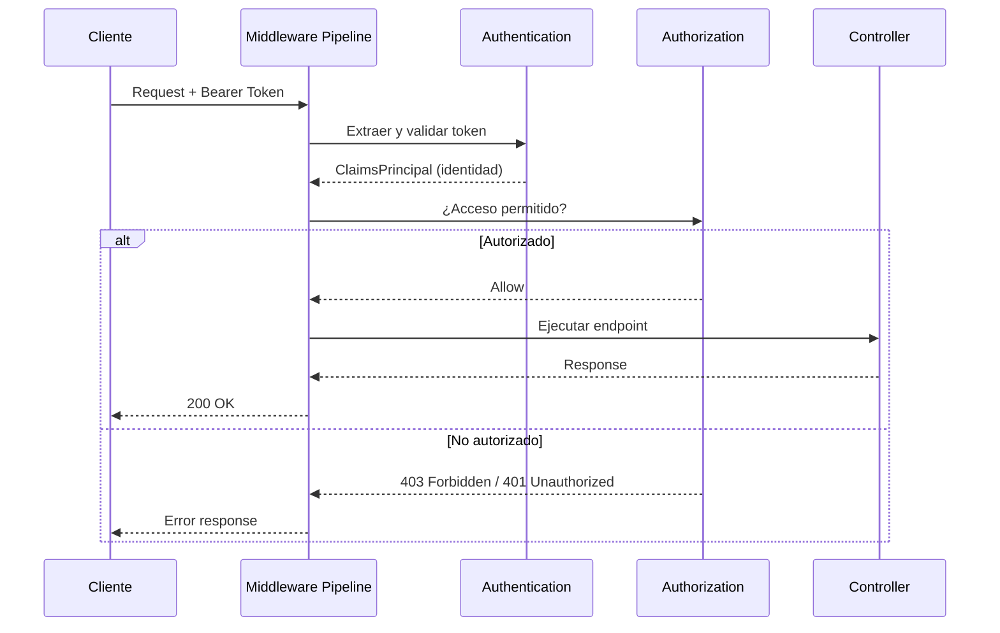
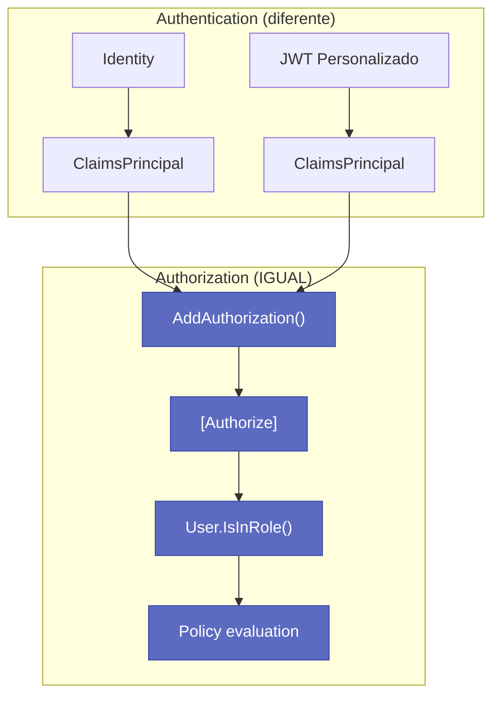

# 13. Autorización y Roles en ASP.NET Core

## Índice

[13. Autorización y Roles en ASP.NET Core](#13-autorización-y-roles-en-aspnet-core)
  - [13.1. Relación entre Autenticación y Autorización](#131-relación-entre-autenticación-y-autorización)
  - [13.2. Middleware de Autorización](#132-middleware-de-autorización)
  - [13.3. Autorización Basada en Roles](#133-autorización-basada-en-roles)
  - [13.4. Políticas de Autorización (Policies)](#134-políticas-de-autorización-policies)
  - [13.5. Requirements Personalizados](#135-requirements-personalizados)
  - [13.6. Autorización Basada en Recursos](#136-autorización-basada-en-recursos)
  - [13.7. Autorización con Scopes (OAuth2)](#137-autorización-con-scopes-oauth2)
  - [13.8. Resumen de Métodos de Autorización](#138-resumen-de-métodos-de-autorización)
  - [13.9. Buenas Prácticas de Autorización](#139-buenas-prácticas-de-autorización)

---

## 13.1. Relación entre Autenticación y Autorización



### Diferencias Clave

| Aspecto | Autenticación | Autorización |
|---------|---------------|--------------|
| **Pregunta** | ¿Quién eres? | ¿Qué puedes hacer? |
| **Proceso** | Verificar identidad | Verificar permisos |
| **Outcome** | ClaimsPrincipal | Allow/Deny |
| **HTTP Header** | Authorization: Bearer | [Authorize] attribute |
| **Mecanismo** | JWT validation | Policy evaluation |

---

## 13.2. Middleware de Autorización

El middleware de autorización es parte fundamental del pipeline de ASP.NET Core. Se configura en `Program.cs` y ejecuta después del middleware de autenticación.

```csharp
// Program.cs - Configuración del pipeline

var builder = WebApplication.CreateBuilder(args);

// ... configuración de servicios ...

var app = builder.Build();

app.UseAuthentication();   // 1. Autenticar (extraer ClaimsPrincipal del token)
app.UseAuthorization();    // 2. Autorizar (evaluar políticas)

app.MapControllers();      // 3. Ejecutar controllers

app.Run();
```

### Flujo del Middleware de Autorización



### Configuracion de Servicios de Autorizacion

```csharp
using Microsoft.AspNetCore.Authorization;

builder.Services.AddAuthorization(options =>
{
    // Configuracion de politicas aqui (ver secciones siguientes)
});
```

## 13.3. La Autorizacion Funciona Igual con Identity o Personalizado

El sistema de autorizacion de ASP.NET Core es **independiente** del sistema de autenticacion. Esto significa que `[Authorize]`, `User.IsInRole()` y las politicas funcionan **exactamente igual** tanto si usamos ASP.NET Core Identity como si usamos nuestro metodo personalizado con JWT.



#### Lo que Funciona Igual

| Funcionabilidad | Con Identity | Personalizado |
|----------------|--------------|---------------|
| `[Authorize]` | ✅ | ✅ |
| `[Authorize(Roles="ADMIN")]` | ✅ | ✅ |
| `User.IsInRole("ADMIN")` | ✅ | ✅ |
| `User.Identity.Name` | ✅ | ✅ |
| Politicas personalizadas | ✅ | ✅ |

#### Conclusion

Nuestro sistema de autorizacion con roles funciona **perfectamente** con el metodo personalizado JWT. No necesitamos ASP.NET Core Identity para tener `[Authorize]`, politicas o control de roles.

---

## 13.4. Autorizacion Basada en Roles

Los roles son una forma simple de agrupar permisos. Un usuario puede tener uno o varios roles.

### Definición de Roles

En el sistema TiendaApi, definimos los siguientes roles:

| Rol | Descripción | Permisos |
|-----|-------------|----------|
| **Admin** | Administrador del sistema | Acceso total a todos los recursos |
| **Manager** | Gestor de contenido | CRUD productos, ver pedidos, ver usuarios |
| **User** | Usuario estándar | Ver productos, gestionar sus pedidos |
| **Guest** | Usuario sin registrar | Solo lectura de productos públicos |

### Roles con Atributos [Authorize]

```csharp
using Microsoft.AspNetCore.Authorization;

namespace TiendaApi.Apis.Controllers;

/// <summary>
/// Controlador de productos con autorización basada en roles
/// </summary>
[ApiController]
[Route("api/[controller]")]
public class ProductosController : ControllerBase
{
    private readonly IProductoService _productoService;

    public ProductosController(IProductoService productoService)
    {
        _productoService = productoService;
    }

    /// <summary>
    /// GET /api/productos
    /// Acceso: Usuarios autenticados (User, Manager, Admin)
    /// </summary>
    [HttpGet]
    [Authorize]  // Requiere autenticación
    [ProducesResponseType(typeof(ApiResponse<List<ProductoDto>>), StatusCodes.Status200OK)]
    public async Task<IActionResult> GetAll()
    {
        var productos = await _productoService.GetAllAsync();
        return Ok(new ApiResponse(true, "Productos obtenidos", productos));
    }

    /// <summary>
    /// GET /api/productos/{id}
    /// Acceso: Usuarios autenticados
    /// </summary>
    [HttpGet("{id:long}")]
    [Authorize]
    public async Task<IActionResult> GetById(long id)
    {
        var result = await _productoService.GetByIdAsync(id);
        return result.Match(Ok, Error => NotFound(Error));
    }

    /// <summary>
    /// POST /api/productos
    /// Acceso: Solo Admin y Manager
    /// </summary>
    [HttpPost]
    [Authorize(Roles = "Admin,Manager")]  // Roles específicos
    [ProducesResponseType(typeof(ApiResponse<ProductoDto>), StatusCodes.Status201Created)]
    [ProducesResponseType(StatusCodes.Status403Forbidden)]
    public async Task<IActionResult> Create([FromBody] CreateProductoRequest request)
    {
        var result = await _productoService.CreateAsync(request);
        
        if (result.IsFailure)
        {
            return BadRequest(new ApiResponse(false, result.Error.Message));
        }

        return CreatedAtAction(nameof(GetById), 
            new { id = result.Value.Id }, 
            new ApiResponse(true, "Producto creado", result.Value));
    }

    /// <summary>
    /// PUT /api/productos/{id}
    /// Acceso: Solo Admin y Manager
    /// </summary>
    [HttpPut("{id:long}")]
    [Authorize(Roles = "Admin,Manager")]
    public async Task<IActionResult> Update(long id, [FromBody] UpdateProductoRequest request)
    {
        var result = await _productoService.UpdateAsync(id, request);
        return result.Match(Ok, Error => NotFound(Error));
    }

    /// <summary>
    /// DELETE /api/productos/{id}
    /// Acceso: Solo Admin
    /// </summary>
    [HttpDelete("{id:long}")]
    [Authorize(Roles = "Admin")]  // Un solo rol
    [ProducesResponseType(StatusCodes.Status204NoContent)]
    [ProducesResponseType(StatusCodes.Status403Forbidden)]
    public async Task<IActionResult> Delete(long id)
    {
        var result = await _productoService.DeleteAsync(id);
        
        if (result.IsFailure)
        {
            return NotFound(new ApiResponse(false, result.Error.Message));
        }

        return NoContent();
    }

    /// <summary>
    /// GET /api/productos/export
    /// Acceso: Solo Admin (reporte completo)
    /// </summary>
    [HttpGet("export")]
    [Authorize(Roles = "Admin")]
    public async Task<IActionResult> Export()
    {
        var report = await _productoService.ExportReportAsync();
        return File(report, "application/pdf", "reporte-productos.pdf");
    }
}
```

### Autorización Mixta: Roles + Política

```csharp
[Authorize(Roles = "Admin,Manager")]
[Authorize(Policy = "CanManageProducts")]
public async Task<IActionResult> ManageProduct(...)
```

---

## 13.5. Políticas de Autorización (Policies)

Las políticas permiten definir condiciones de autorización más complejas que simples roles.

### Definición de Políticas en Program.cs

```csharp
using Microsoft.AspNetCore.Authorization;

builder.Services.AddAuthorization(options =>
{
    #region Políticas Simples

    // Política: Solo admins pueden acceder
    options.AddPolicy("RequireAdmin", policy =>
        policy.RequireRole("Admin"));

    // Política: Admin o Manager
    options.AddPolicy("RequireManagerOrAdmin", policy =>
        policy.RequireAssertion(context =>
            context.User.IsInRole("Admin") || 
            context.User.IsInRole("Manager")));

    #endregion

    #region Políticas con Claims

    // Política: Usuario verificado (email confirmado)
    options.AddPolicy("EmailVerified", policy =>
        policy.RequireClaim("emailVerified", "true"));

    // Política: Usuario activo
    options.AddPolicy("ActiveUser", policy =>
    {
        policy.RequireAssertion(context =>
        {
            var isActive = context.User.FindFirst("isActive")?.Value;
            return isActive?.ToLower() == "true";
        });
    });

    // Política: Acceso a panel de administración
    options.AddPolicy("AdminPanelAccess", policy =>
    {
        policy.RequireAssertion(context =>
        {
            var isAdmin = context.User.IsInRole("Admin");
            var hasAdminAccess = context.User.HasClaim(c => 
                c.Type == "adminPanelAccess" && c.Value == "true");
            return isAdmin || hasAdminAccess;
        });
    });

    #endregion

    #region Políticas con Múltiples Requisitos

    // Política: Admin con email verificado
    options.AddPolicy("AdminVerified", policy =>
    {
        policy.RequireRole("Admin");
        policy.RequireClaim("emailVerified", "true");
    });

    // Política: Múltiples roles + claim específico
    options.AddPolicy("PremiumUser", policy =>
    {
        policy.RequireAssertion(context =>
        {
            var isPremium = context.User.HasClaim("subscriptionTier", "premium");
            var isUser = context.User.IsInRole("User") || 
                        context.User.IsInRole("Admin") ||
                        context.User.IsInRole("Manager");
            return isPremium && isUser;
        });
    });

    #endregion

    #region Políticas Temporales

    // Política: Solo horario laboral (9:00 - 18:00)
    options.AddPolicy("BusinessHours", policy =>
    {
        policy.RequireAssertion(context =>
        {
            var now = DateTime.UtcNow.TimeOfDay;
            var start = new TimeSpan(9, 0, 0);
            var end = new TimeSpan(18, 0, 0);
            return now >= start && now <= end;
        });
    });

    #endregion
});
```

### Uso de Políticas en Controladores

```csharp
using Microsoft.AspNetCore.Authorization;

namespace TiendaApi.Apis.Controllers;

[ApiController]
[Route("api/[controller]")]
public class AdminController : ControllerBase
{
    [HttpGet("dashboard")]
    [Authorize(Policy = "RequireAdmin")]
    public IActionResult Dashboard()
    {
        return Ok(new { message = "Dashboard administrativo" });
    }

    [HttpGet("users")]
    [Authorize(Policy = "AdminVerified")]
    public IActionResult GetUsers()
    {
        return Ok(new { message = "Lista de usuarios" });
    }

    [HttpPost("settings")]
    [Authorize(Policy = "BusinessHours")]
    public IActionResult UpdateSettings()
    {
        return Ok(new { message = "Settings actualizados" });
    }

    [HttpGet("reports")]
    [Authorize(Policy = "PremiumUser")]
    public IActionResult GetReports()
    {
        return Ok(new { message = "Reportes premium" });
    }
}
```

---

## 13.6. Requirements Personalizados (IAuthorizationRequirement)

Para condiciones de autorización muy específicas, puedes crear tus propios requirements y handlers.

### Requisito: Edad Mínima

```csharp
using Microsoft.AspNetCore.Authorization;

namespace TiendaApi.Core.Authorization;

/// <summary>
/// Requisito de edad mínima
/// </summary>
public class MinimumAgeRequirement : IAuthorizationRequirement
{
    public int MinimumAge { get; }

    public MinimumAgeRequirement(int minimumAge)
    {
        MinimumAge = minimumAge;
    }
}

/// <summary>
/// Handler para el requisito de edad mínima
/// </summary>
public class MinimumAgeHandler : AuthorizationHandler<MinimumAgeRequirement>
{
    private readonly IHttpContextAccessor _httpContextAccessor;
    private readonly ILogger<MinimumAgeHandler> _logger;

    public MinimumAgeHandler(
        IHttpContextAccessor httpContextAccessor,
        ILogger<MinimumAgeHandler> logger)
    {
        _httpContextAccessor = httpContextAccessor;
        _logger = logger;
    }

    protected override Task HandleRequirementAsync(
        AuthorizationHandlerContext context,
        MinimumAgeRequirement requirement)
    {
        // Buscar claim de fecha de nacimiento
        var birthDateClaim = context.User.FindFirst("birthDate");
        
        if (birthDateClaim == null)
        {
            // Buscar enclaims estándar
            birthDateClaim = context.User.FindFirst(ClaimTypes.DateOfBirth);
        }

        if (birthDateClaim == null || 
            !DateTime.TryParse(birthDateClaim.Value, out var birthDate))
        {
            _logger.LogWarning("No se encontró fecha de nacimiento en los claims");
            return Task.CompletedTask;
        }

        // Calcular edad
        var age = DateTime.UtcNow.Year - birthDate.Year;
        if (birthDate > DateTime.UtcNow.AddYears(-age))
        {
            age--;
        }

        // Verificar si cumple el requisito
        if (age >= requirement.MinimumAge)
        {
            _logger.LogInformation(
                "Edad verificada: {Age} >= {MinimumAge}", 
                age, requirement.MinimumAge);
            context.Succeed(requirement);
        }
        else
        {
            _logger.LogWarning(
                "Edad insuficiente: {Age} < {MinimumAge}", 
                age, requirement.MinimumAge);
        }

        return Task.CompletedTask;
    }
}
```

### Requisito: Propietario del Recurso

```csharp
using Microsoft.AspNetCore.Authorization;

namespace TiendaApi.Core.Authorization;

/// <summary>
/// Requisito: El usuario debe ser propietario del recurso
/// </summary>
public class ResourceOwnerRequirement : IAuthorizationRequirement
{
    public string ResourceIdParameterName { get; }
    public string OwnerIdClaimType { get; }

    public ResourceOwnerRequirement(
        string resourceIdParameterName = "id",
        string ownerIdClaimType = "userId")
    {
        ResourceIdParameterName = resourceIdParameterName;
        OwnerIdClaimType = ownerIdClaimType;
    }
}

/// <summary>
/// Handler para verificar propiedad del recurso
/// </summary>
public class ResourceOwnerHandler : AuthorizationHandler<ResourceOwnerRequirement>
{
    private readonly IHttpContextAccessor _httpContextAccessor;
    private readonly IProductoRepository _productoRepository;

    public ResourceOwnerHandler(
        IHttpContextAccessor httpContextAccessor,
        IProductoRepository productoRepository)
    {
        _httpContextAccessor = httpContextAccessor;
        _productoRepository = productoRepository;
    }

    protected override async Task HandleRequirementAsync(
        AuthorizationHandlerContext context,
        ResourceOwnerRequirement requirement)
    {
        var httpContext = _httpContextAccessor.HttpContext;
        if (httpContext == null)
        {
            return;
        }

        // Obtener ID del recurso de la ruta
        var routeId = httpContext.Request.RouteValues[requirement.ResourceIdParameterName]?.ToString();
        
        if (string.IsNullOrEmpty(routeId) || 
            !long.TryParse(routeId, out var resourceId))
        {
            _logger.LogWarning("No se pudo obtener ID del recurso de la ruta");
            return;
        }

        // Si es admin, tiene acceso total
        if (context.User.IsInRole("Admin"))
        {
            context.Succeed(requirement);
            return;
        }

        // Obtener ID del usuario del claim
        var userIdClaim = context.User.FindFirst(requirement.OwnerIdClaimType);
        if (userIdClaim == null || 
            !long.TryParse(userIdClaim.Value, out var userId))
        {
            return;
        }

        // Verificar propiedad del recurso (ejemplo con Producto)
        var producto = await _productoRepository.GetByIdAsync(resourceId);
        if (producto.IsSuccess && producto.Value.CreatedByUserId == userId)
        {
            context.Succeed(requirement);
        }
    }

    private readonly ILogger<ResourceOwnerHandler> _logger;
}
```

### Registro de Requirements y Handlers

```csharp
using Microsoft.AspNetCore.Authorization;

builder.Services.AddScoped<IAuthorizationHandler, MinimumAgeHandler>();
builder.Services.AddScoped<IAuthorizationHandler, ResourceOwnerHandler>();

builder.Services.AddAuthorization(options =>
{
    // Política con requisito personalizado
    options.AddPolicy("MinimumAge18", policy =>
        policy.Requirements.Add(new MinimumAgeRequirement(18)));

    options.AddPolicy("ResourceOwner", policy =>
        policy.Requirements.Add(new ResourceOwnerRequirement()));
});
```

---

## 13.7. Autorización Basada en Recursos (Resource-Based)

Cuando la autorización depende del recurso específico que se está accediendo, usamos el servicio `IAuthorizationService`.

```csharp
using Microsoft.AspNetCore.Authorization;

namespace TiendaApi.Core.Services;

/// <summary>
/// Servicio para autorización dinámica de recursos
/// </summary>
public class AuthorizationService
{
    private readonly Microsoft.AspNetCore.Authorization.IAuthorizationService 
        _authorizationService;
    private readonly IHttpContextAccessor _httpContextAccessor;

    public AuthorizationService(
        Microsoft.AspNetCore.Authorization.IAuthorizationService authorizationService,
        IHttpContextAccessor httpContextAccessor)
    {
        _authorizationService = authorizationService;
        _httpContextAccessor = httpContextAccessor;
    }

    /// <summary>
    /// Verifica si el usuario puede realizar una acción sobre un recurso
    /// </summary>
    public async Task<bool> CanAsync<TResource>(
        string policyName, 
        TResource resource)
    {
        var result = await _authorizationService.AuthorizeAsync(
            _httpContextAccessor.HttpContext!.User, 
            resource, 
            policyName);
        
        return result.Succeeded;
    }

    /// <summary>
    /// Verifica si el usuario es propietario del recurso
    /// </summary>
    public async Task<bool> IsOwnerAsync<TResource>(TResource resource)
    {
        return await CanAsync("ResourceOwner", resource);
    }
}
```

### Uso en Servicios

```csharp
using Microsoft.AspNetCore.Authorization;

namespace TiendaApi.Core.Services;

public class ProductoService
{
    private readonly IProductoRepository _repository;
    private readonly IAuthorizationService _authorizationService;

    public ProductoService(
        IProductoRepository repository,
        IAuthorizationService authorizationService)
    {
        _repository = repository;
        _authorizationService = authorizationService;
    }

    public async Task<Result<Producto, Error>> UpdateAsync(
        long id, 
        UpdateProductoRequest request)
    {
        // Obtener producto
        var productoResult = await _repository.GetByIdAsync(id);
        if (productoResult.IsFailure)
        {
            return productoResult;
        }

        var producto = productoResult.Value;

        // Verificar autorización basada en el recurso
        var authorizationResult = await _authorizationService.AuthorizeAsync(
            HttpContext.User, 
            producto, 
            "ResourceOwner");

        if (!authorizationResult.Succeeded)
        {
            return Result.Failure<Producto, Error>(Errors.Auth.AccesoDenegado);
        }

        // Actualizar producto
        producto.Nombre = request.Nombre ?? producto.Nombre;
        // ... más actualizaciones
        
        return await _repository.UpdateAsync(producto);
    }
}
```

---

## 13.8. Autorización con Scopes (OAuth2)

Para APIs que consumen aplicaciones de terceros, los scopes definen los permisos específicos.

```csharp
builder.Services.AddAuthorization(options =>
{
    // Policy que requiere scope específico
    options.AddPolicy("ReadProducts", policy =>
        policy.RequireAssertion(context =>
            context.User.HasScope("products.read") ||
            context.User.HasScope("products.all")));

    options.AddPolicy("WriteProducts", policy =>
        policy.RequireAssertion(context =>
            context.User.HasScope("products.write") ||
            context.User.HasScope("products.all")));

    options.AddPolicy("AdminScope", policy =>
    {
        policy.RequireAssertion(context =>
            context.User.HasScope("admin") &&
            context.User.IsInRole("Admin"));
    });
});

// Configuración de JWT para incluir scopes
// (ver JwtService en documento 12)
```

---

## 13.9. Resumen de Métodos de Autorización

| Método | Uso | Ejemplo |
|--------|-----|---------|
| `[Authorize]` | Requiere autenticación | `[Authorize]` |
| `[Authorize(Roles="Admin")]` | Rol específico | `[Authorize(Roles = "Admin")]` |
| `[Authorize(Roles="A,B")]` | Múltiples roles (OR) | `[Authorize(Roles = "Admin,Manager")]` |
| `[Authorize(Policy="Name")]` | Política | `[Authorize(Policy = "EmailVerified")]` |
| `IAuthorizationService` | Autorización programática | `await service.AuthorizeAsync(user, resource, policy)` |
| Claims-based | Claims personalizados | `context.User.HasClaim(...)` |
| Resource-based | Según el recurso | Handler personalizado |

### Comparación de Enfoques

```mermaid
flowchart TB
    subgraph "Role-Based"
        A1["[Authorize(Roles)]"]
        A2["Simple"]
        A3["Binario si/no"]
        A4["Dificil combinar"]
    end
    
    subgraph "Policy-Based"
        B1["[Authorize(Policy)]"]
        B2["Flexible"]
        B3["Reutilizable"]
        B4["Multiple conditions"]
    end
    
    subgraph "Claims-Based"
        C1["HasClaim"]
        C2["Dinamico"]
        C3["Sin configuracion"]
        C4["Control granular"]
    end
    
    subgraph "Resource-Based"
        D1["IAuthorizationService"]
        D2["Depende del recurso"]
        D3["Verificacion runtime"]
        D4["Patron propietario"]
    end
    
    A1 --> A2 --> A3 --> A4
    B1 --> B2 --> B3 --> B4
    C1 --> C2 --> C3 --> C4
    D1 --> D2 --> D3 --> D4
```



---

## 13.10. Buenas Prácticas de Autorización

```mermaid
flowchart TB
    subgraph "Diseño"
        A1["Principio de mínimo privilegio"]
        A2["Denegar por defecto"]
        A3["Roles granulares"]
        A4["Documentar políticas"]
    end
    
    subgraph "Seguridad"
        B1["Validar en cada request"]
        B2["No confiar en client"]
        B3["Logs de autorización denegada"]
        B4["Rate limiting"]
    end
    
    subgraph "Rendimiento"
        C1["Autorización ligera"]
        C2["Cache de decisiones"]
        C3["Evitar consultas BD"]
    end
    
    subgraph "Mantenimiento"
        D1["Nombres claros de políticas"]
        D2["Tests de autorización"]
        D3["Refactorizar roles"]
    end
    
    A1 --> A2 --> A3 --> A4
    B1 --> B2 --> B3 --> B4
    C1 --> C2 --> C3
    D1 --> D2 --> D3
```



### Siguientes Pasos

Con autorización dominada, el siguiente paso es aprender sobre Docker y CI/CD.

### Recursos Adicionales

- ASP.NET Core Authorization: https://learn.microsoft.com/aspnet/core/security/authorization/
- Policy-based Authorization: https://learn.microsoft.com/aspnet/core/security/authorization/policies
- Resource-based Authorization: https://learn.microsoft.com/aspnet/core/security/authorization/resourcebased
- Custom Authorization Handlers: https://learn.microsoft.com/aspnet/core/security/authorization/customizingauthorizationdatamodel
