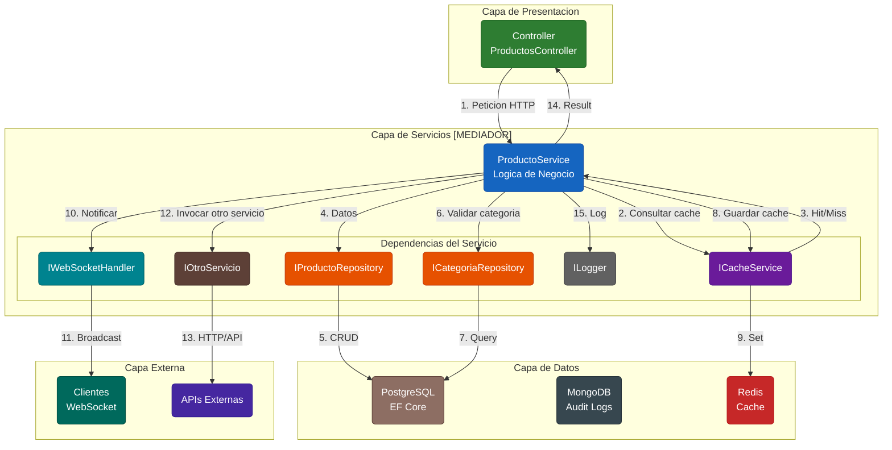
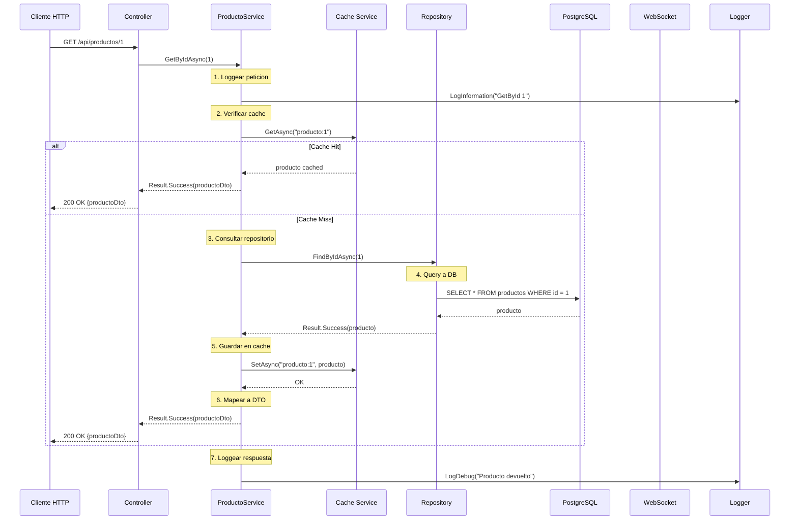
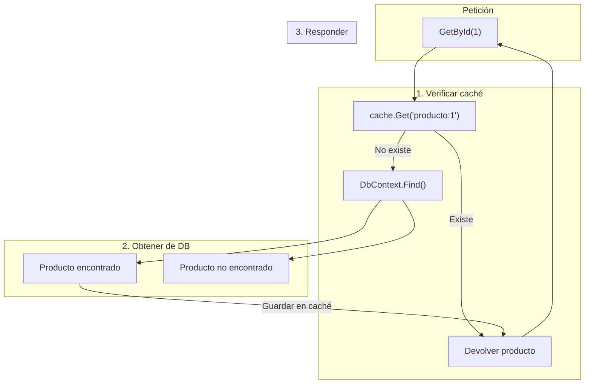
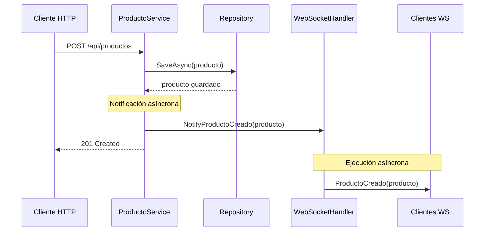
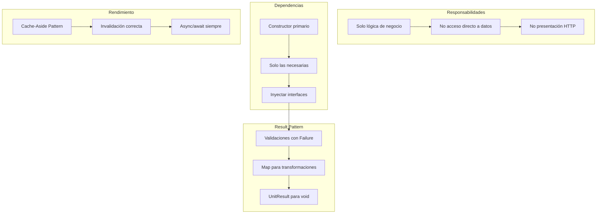

# 13. Servicios Negocio

## Índice

[13. Servicios de Negocio](#13-servicios-de-negocio)
  - [13.1. Anatomía de un Servicio de Negocio](#131-anatoma-de-un-servicio-de-negocio)
  - [13.2. Constructores Primarios en Servicios](#132-constructores-primarios-en-servicios)
  - [13.3. Lógica de Negocio vs Acceso a Datos](#133-lgica-de-negocio-vs-acceso-a-datos)
  - [13.4. Integración con Repositories](#134-integracin-con-repositories)
  - [13.5. Integración con Cache](#135-integracin-con-cache)
  - [13.6. Patrón Result en Servicios](#136-patrn-result-en-servicios)
  - [13.7. Notificaciones WebSocket desde Servicios](#137-notificaciones-websocket-desde-servicios)
  - [13.8. Resumen y Buenas Prácticas](#138-resumen-y-buenas-prcticas)

---

## 13.1. Anatomía de un Servicio de Negocio

Un servicio de negocio es una clase que encapsula un conjunto de operaciones relacionadas con una entidad o dominio específico. En lugar de poner toda la lógica en los controladores o modelos, los servicios proporcionan un lugar centralizado para la lógica de negocio que puede ser reutilizada por múltiples controladores o incluso por otros servicios.

### Estructura de un servicio típico

Un servicio tiene tres partes principales: las dependencias (repositorios, cache, otros servicios) inyectadas vía constructor primario, los métodos públicos que definen las operaciones disponibles, y la lógica interna que implementa esas operaciones usando Result Pattern para manejar errores.

```csharp
namespace TiendaApi.Core.Services.Productos;

public class ProductoService
{
    // Dependencias inyectadas
    private readonly IProductoRepository _repository;
    private readonly ICategoriaRepository _categoriaRepository;
    private readonly ICacheService _cache;
    private readonly IWebSocketHandler _webSocketHandler;
    private readonly ILogger<ProductoService> _logger;

    // Constructor primario con dependencias
    public ProductoService(
        IProductoRepository repository,
        ICategoriaRepository categoriaRepository,
        ICacheService cache,
        IWebSocketHandler webSocketHandler,
        ILogger<ProductoService> logger)
    {
        _repository = repository;
        _categoriaRepository = categoriaRepository;
        _cache = cache;
        _webSocketHandler = webSocketHandler;
        _logger = logger;
    }

    // Métodos públicos que definen operaciones
    public async Task<Result<ProductoDto, DomainError>> GetByIdAsync(long id)
    {
        // Lógica de negocio
    }

    public async Task<Result<List<ProductoDto>, DomainError>> GetAllAsync()
    {
        // Lógica de negocio
    }

    public async Task<Result<ProductoDto, DomainError>> CreateAsync(ProductoCreateDto dto)
    {
        // Lógica de negocio
    }
}
```

### Características de un buen servicio

Un buen servicio de negocio tiene responsabilidades enfocadas en un solo dominio (como Productos o Pedidos), usa Result Pattern para devolver éxito o fracaso, tiene dependencias explícitas vía constructor, no contiene lógica de presentación (eso es del controlador), y no contiene lógica de acceso a datos (eso es del repositorio).

### Arquitectura del Servicio como Mediador

El servicio actúa como un mediador entre múltiples capas y componentes. Recibe llamadas del controlador, coordina repositorios para acceso a datos, interactúa con la caché para optimizar rendimiento, puede invocar otros servicios para operaciones complejas, y devuelve resultados usando el patrón Result.



### Flujo de una peticion a través del servicio



---

## 13.2. Constructores Primarios en Servicios

Los constructores primarios de C# 14 simplifican enormemente la declaración de dependencias en servicios. Las dependencias se declaran directamente en la firma de la clase, eliminando la necesidad de campos privados y asignaciones en el constructor.

### Constructor primario básico

```csharp
// ✅ CONSTRUCTOR PRIMARIO (C# 14)
public class ProductoService(
    IProductoRepository repository,
    ICategoriaRepository categoriaRepository,
    ICacheService cache,
    IWebSocketHandler webSocketHandler,
    ILogger<ProductoService> logger) : IProductoService
{
    // Las dependencias son automáticamente accesibles
    public async Task<Result<ProductoDto, DomainError>> GetByIdAsync(long id)
    {
        logger.LogInformation("Buscando producto {Id}", id);
        
        // repository, cache, etc. ya están disponibles
    }
}
```

### Con inicialización de campos

Cuando necesitas transformar las dependencias o agregar lógica adicional:

```csharp
public class ProductoService(
    IProductoRepository repository,
    ICategoriaRepository categoriaRepository,
    ICacheService cache,
    IWebSocketHandler webSocketHandler,
    ILogger<ProductoService> logger) : IProductoService
{
    // Campos con transformación si es necesario
    private readonly IProductoRepository _repository = repository;
    private readonly ICategoriaRepository _categoriaRepository = categoriaRepository;
    private readonly ICacheService _cache = cache;
    private readonly IWebSocketHandler _webSocketHandler = webSocketHandler;
    private readonly ILogger<ProductoService> _logger = logger;
    
    // Campos adicionales calculados
    private readonly string _cachePrefix = "productos:";
}
```

### Herencia con constructores primarios

Cuando un servicio hereda de una clase base:

```csharp
// Clase base con constructor primario
public abstract class ServiceBase
{
    protected readonly ILogger _logger;

    protected ServiceBase(ILogger logger)
    {
        _logger = logger;
    }
}

// Servicio derivado
public class ProductoService(
    IProductoRepository repository,
    ILogger<ProductoService> logger) : ServiceBase(logger)
{
    private readonly IProductoRepository _repository = repository;

    public async Task<Result<ProductoDto, DomainError>> GetByIdAsync(long id)
    {
        _logger.LogInformation("Buscando producto {Id}", id);
        // Implementación...
    }
}
```

---

## 13.3. Lógica de Negocio vs Acceso a Datos

Es crucial entender qué código pertenece al servicio y qué código pertenece al repositorio. El servicio contiene reglas de negocio, coordinación de múltiples operaciones, validaciones que requieren datos, y decisiones sobre qué hacer. El repositorio contiene queries, operaciones CRUD básicas, y acceso a la base de datos.

### ¿Qué va en el servicio?

La lógica de negocio incluye validación de reglas que dependen de múltiples entidades, coordinación de operaciones que involucran varios repositorios, decisiones sobre qué hacer cuando algo falla, caché y optimización de performance, y notificaciones a otros sistemas.

### ¿Qué va en el repositorio?

El acceso a datos incluye operaciones CRUD básicas (Find, Save, Update, Delete), queries específicos de la entidad, acceso a la base de datos, y nada de lógica de negocio.

### Ejemplo de separación

```csharp
// ❌ INCORRECTO: Lógica de negocio en el repositorio
public class ProductoRepository
{
    public async Task<Producto> CreateAsync(Producto producto)
    {
        // Esto es lógica de negocio, no acceso a datos
        if (producto.Stock < 0)
            throw new Exception("Stock no puede ser negativo");
        
        if (producto.Precio <= 0)
            throw new Exception("Precio debe ser mayor a 0");
        
        _context.Productos.Add(producto);
        await _context.SaveChangesAsync();
        return producto;
    }
}

// ✅ CORRECTO: Lógica de negocio en el servicio
public class ProductoService
{
    public async Task<Result<ProductoDto, DomainError>> CreateAsync(ProductoCreateDto dto)
    {
        // Validaciones de negocio
        if (dto.Stock < 0)
            return Result.Failure<ProductoDto, DomainError>(
                DomainError.BusinessRule("El stock no puede ser negativo"));
        
        if (dto.Precio <= 0)
            return Result.Failure<ProductoDto, DomainError>(
                DomainError.Validation("El precio debe ser mayor a 0"));
        
        // Crear entidad
        var producto = dto.ToEntity();
        
        // Delegar solo el acceso a datos al repositorio
        return await _repository.SaveAsync(producto)
            .Map(p => p.ToDto());
    }
}
```

---

## 13.4. Integración con Repositories

Los servicios usan repositorios para acceder a datos, pero lo hacen de forma que mantiene el Result Pattern. El servicio decide qué operaciones realizar y cuándo, delegando la ejecución al repositorio.

### Uso típico de repositorios en servicios

```csharp
public class ProductoService(
    IProductoRepository productoRepository,
    ICategoriaRepository categoriaRepository,
    ICacheService cache,
    ILogger<ProductoService> logger) : IProductoService
{
    public async Task<Result<ProductoDto, DomainError>> CreateAsync(ProductoCreateDto dto)
    {
        logger.LogInformation("Creando producto: {Nombre}", dto.Nombre);
        
        // 1. Validar que la categoría existe
        var categoria = await _categoriaRepository.FindByIdAsync(dto.CategoriaId);
        if (categoria.IsFailure)
            return Result.Failure<ProductoDto, DomainError>(
                DomainError.NotFound($"Categoría {dto.CategoriaId} no encontrada"));
        
        // 2. Verificar nombre único
        var existe = await _productoRepository.ExistsByNombreAsync(dto.Nombre);
        if (existe)
            return Result.Failure<ProductoDto, DomainError>(
                DomainError.Conflict($"Ya existe producto con nombre '{dto.Nombre}'"));
        
        // 3. Crear entidad
        var producto = new Producto
        {
            Nombre = dto.Nombre,
            Precio = dto.Precio,
            CategoriaId = dto.CategoriaId,
            Stock = dto.Stock
        };
        
        // 4. Guardar
        var resultado = await _productoRepository.SaveAsync(producto);
        if (resultado.IsFailure)
            return Result.Failure<ProductoDto, DomainError>(resultado.Error);
        
        // 5. Invalidar caché
        await _cache.RemoveAsync("productos:all");
        
        logger.LogInformation("Producto creado: {Id}", resultado.Value.Id);
        
        return Result.Success<ProductoDto, DomainError>(resultado.Value.ToDto());
    }
}
```

### Coordinar múltiples repositorios

```csharp
public class PedidosService(
    IPedidoRepository pedidoRepository,
    IProductoRepository productoRepository,
    IUserRepository userRepository,
    ILogger<PedidosService> logger) : IPedidosService
{
    public async Task<Result<PedidoDto, DomainError>> CreateAsync(PedidoCreateDto dto)
    {
        // 1. Verificar usuario existe
        var usuario = await _userRepository.FindByIdAsync(dto.UsuarioId);
        if (usuario.IsFailure)
            return Result.Failure<PedidoDto, DomainError>(usuario.Error);
        
        // 2. Verificar cada producto existe y tiene stock
        foreach (var item in dto.Items)
        {
            var producto = await _productoRepository.FindByIdAsync(item.ProductoId);
            if (producto.IsFailure)
                return Result.Failure<PedidoDto, DomainError>(
                    DomainError.NotFound($"Producto {item.ProductoId} no encontrado"));
            
            if (producto.Value.Stock < item.Cantidad)
                return Result.Failure<PedidoDto, DomainError>(
                    DomainError.BusinessRule(
                        $"Stock insuficiente para producto {producto.Value.Nombre}"));
        }
        
        // 3. Crear pedido
        var pedido = new Pedido
        {
            UsuarioId = dto.UsuarioId,
            Items = dto.Items.Select(i => new PedidoItem
            {
                ProductoId = i.ProductoId,
                Cantidad = i.Cantidad
            }).ToList()
        };
        
        // 4. Guardar pedido (transacción implícita en EF Core)
        var resultado = await _pedidoRepository.SaveAsync(pedido);
        if (resultado.IsFailure)
            return Result.Failure<PedidoDto, DomainError>(resultado.Error);
        
        return Result.Success<PedidoDto, DomainError>(resultado.Value.ToDto());
    }
}
```

---

## 13.5. Integración con Cache

Los servicios pueden usar caché para mejorar performance, almacenando resultados de operaciones costosas. La integración típica usa Cache-Aside Pattern: primero verificar caché, si no está, acceder a datos y almacenar en caché.

### Implementación de caché en servicios

```csharp
public class ProductoService(
    IProductoRepository productoRepository,
    ICacheService cache,
    ILogger<ProductoService> logger) : IProductoService
{
    private readonly TimeSpan _cacheExpiration = TimeSpan.FromMinutes(5);

    public async Task<Result<ProductoDto, DomainError>> GetByIdAsync(long id)
    {
        var cacheKey = $"producto:{id}";
        
        // 1. Verificar caché primero
        var cached = await _cache.GetAsync<ProductoDto>(cacheKey);
        if (cached != null)
        {
            logger.LogDebug("Producto {Id} obtenido de caché", id);
            return Result.Success<ProductoDto, DomainError>(cached);
        }
        
        // 2. Obtener de base de datos
        var resultado = await _productoRepository.FindByIdAsync(id);
        if (resultado.IsFailure)
            return Result.Failure<ProductoDto, DomainError>(resultado.Error);
        
        // 3. Almacenar en caché
        await _cache.SetAsync(cacheKey, resultado.Value, _cacheExpiration);
        
        logger.LogDebug("Producto {Id} obtenido de base de datos", id);
        
        return Result.Success<ProductoDto, DomainError>(resultado.Value);
    }

    public async Task<Result<ProductoDto, DomainError>> UpdateAsync(long id, ProductoUpdateDto dto)
    {
        var resultado = await _productoRepository.UpdateAsync(id, dto);
        
        if (resultado.IsSuccess)
        {
            // 4. Invalidar caché después de actualizar
            await _cache.RemoveAsync($"producto:{id}");
            await _cache.RemoveAsync("productos:all");
            
            logger.LogInformation("Producto {Id} actualizado y caché invalidado", id);
        }
        
        return resultado.Map(p => p.ToDto());
    }

    public async Task<UnitResult<DomainError>> DeleteAsync(long id)
    {
        var resultado = await _productoRepository.DeleteAsync(id);
        
        if (resultado.IsSuccess)
        {
            // 5. Invalidar caché después de eliminar
            await _cache.RemoveAsync($"producto:{id}");
            await _cache.RemoveAsync("productos:all");
            
            logger.LogInformation("Producto {Id} eliminado y caché invalidado", id);
        }
        
        return resultado;
    }
}
```

### Cache-Aside Pattern



---

## 13.6. Patrón Result en Servicios

Los servicios usan Result Pattern para comunicar éxito o fracaso de forma explícita. Esto hace el código más legible y facilita el manejo de errores en los controladores.

### Servicio con Result Pattern

```csharp
public class ProductoService(
    IProductoRepository productoRepository,
    ICategoriaRepository categoriaRepository,
    ICacheService cache,
    ILogger<ProductoService> logger) : IProductoService
{
    public async Task<Result<ProductoDto, DomainError>> GetByIdAsync(long id)
    {
        logger.LogInformation("GetById: {Id}", id);
        
        var resultado = await _productoRepository.FindByIdAsync(id);
        
        return resultado.Map(producto => producto.ToDto());
    }

    public async Task<Result<List<ProductoDto>, DomainError>> GetAllAsync()
    {
        logger.LogInformation("GetAll");
        
        var resultado = await _productoRepository.GetAllAsync();
        
        return resultado.Map(productos => productos.Select(p => p.ToDto()).ToList());
    }

    public async Task<Result<ProductoDto, DomainError>> CreateAsync(ProductoCreateDto dto)
    {
        // Validaciones de negocio
        if (string.IsNullOrEmpty(dto.Nombre))
            return Result.Failure<ProductoDto, DomainError>(
                DomainError.Validation("El nombre es obligatorio"));

        if (dto.Precio <= 0)
            return Result.Failure<ProductoDto, DomainError>(
                DomainError.Validation("El precio debe ser mayor a 0"));

        // Verificar categoría
        var categoria = await _categoriaRepository.FindByIdAsync(dto.CategoriaId);
        if (categoria.IsFailure)
            return Result.Failure<ProductoDto, DomainError>(
                DomainError.NotFound($"Categoría {dto.CategoriaId} no encontrada"));

        // Verificar duplicado
        var existe = await _productoRepository.ExistsByNombreAsync(dto.Nombre);
        if (existe)
            return Result.Failure<ProductoDto, DomainError>(
                DomainError.Conflict($"Ya existe producto con nombre '{dto.Nombre}'"));

        // Crear y guardar
        var producto = new Producto(dto);
        var resultado = await _productoRepository.SaveAsync(producto);
        
        if (resultado.IsFailure)
            return Result.Failure<ProductoDto, DomainError>(resultado.Error);

        // Invalidar caché
        await _cache.RemoveAsync("productos:all");

        return Result.Success<ProductoDto, DomainError>(resultado.Value.ToDto());
    }

    public async Task<UnitResult<DomainError>> DeleteAsync(long id)
    {
        // Verificar que existe
        var producto = await _productoRepository.FindByIdAsync(id);
        if (producto.IsFailure)
            return UnitResult.Failure<DomainError>(producto.Error);

        // Verificar regla de negocio
        if (producto.Value.TienePedidosPendientes)
            return UnitResult.Failure<DomainError>(
                DomainError.BusinessRule("No se puede eliminar un producto con pedidos pendientes"));

        // Eliminar
        var resultado = await _productoRepository.DeleteAsync(id);
        
        if (resultado.IsSuccess)
            await _cache.RemoveAsync("productos:all");

        return resultado;
    }
}
```

---

## 13.7. Notificaciones WebSocket desde Servicios

Los servicios pueden notificar a clientes conectados cuando ocurren eventos importantes, como la creación de un nuevo producto. Esto requiere inyectar un handler de WebSocket y llamarlo de forma asíncrona.

### Notificación asíncrona desde servicios

```csharp
public class ProductoService(
    IProductoRepository productoRepository,
    ICacheService cache,
    IWebSocketHandler webSocketHandler,
    ILogger<ProductoService> logger) : IProductoService
{
    public async Task<Result<ProductoDto, DomainError>> CreateAsync(ProductoCreateDto dto)
    {
        // Crear producto...
        var resultado = await _productoRepository.SaveAsync(producto);
        if (resultado.IsFailure)
            return Result.Failure<ProductoDto, DomainError>(resultado.Error);
        
        // Notificar a clientes WebSocket de forma asíncrona
        // Esto no bloquea la respuesta al cliente HTTP
        _ = Task.Run(async () =>
        {
            try
            {
                await _webSocketHandler.NotifyProductoCreadoAsync(
                    resultado.Value.ToDto());
                logger.LogInformation(
                    "Notificación WebSocket enviada para producto {Id}",
                    resultado.Value.Id);
            }
            catch (Exception ex)
            {
                logger.LogError(ex, 
                    "Error al enviar notificación WebSocket para producto {Id}",
                    resultado.Value.Id);
            }
        });
        
        return Result.Success<ProductoDto, DomainError>(resultado.Value.ToDto());
    }
}
```

### Flujo de notificación



---

## 13.8. Resumen y Buenas Prácticas

A lo largo de este documento hemos explorado cómo crear servicios de negocio efectivos en TiendaApi.

### Puntos clave del módulo

Los servicios encapsulan lógica de negocio, delegando acceso a datos a repositorios. Los constructores primarios simplifican la declaración de dependencias. El Result Pattern comunica éxito o fracaso de forma explícita. La caché se integra con Cache-Aside Pattern. Las notificaciones WebSocket se hacen de forma asíncrona.

### Buenas prácticas



### Siguientes pasos

Con los servicios de negocio dominados, el siguiente paso es aprender sobre Entity Framework Core con PostgreSQL, donde verás cómo configurar el acceso a datos que alimenta los repositorios.

### Recursos adicionales

- Service Layer Pattern: https://martinfowler.com/eaaCatalog/serviceLayer.html
- Domain-Driven Design: https://docs.microsoft.com/dotnet/architecture/microservices/microservice-ddd-cqrs-patterns/
