# 14. MediatR Eventos

## Índice

[14. MediatR + CQRS + Eventos de Dominio](#14-mediatr--cqrs--eventos-de-dominio)
  - [14.1. El Problema: Acoplamiento entre Efectos Secundarios](#141-el-problema-acoplamiento-entre-efectos-secundarios)
  - [14.2. ¿Qué son los Eventos de Dominio?](#142-qu-son-los-eventos-de-dominio)
  - [14.3. Notifications en MediatR: La Implementación del Patrón](#143-notifications-en-mediatr-la-implementacin-del-patrn)
  - [14.4. Anatomía de una Notification y sus Handlers](#144-anatoma-de-una-notification-y-sus-handlers)
  - [14.5. La metáfora del periódico](#145-la-metfora-del-peridico)
  - [14.6. Eventos en Nuestro Proyecto: Casos Reales](#146-eventos-en-nuestro-proyecto-casos-reales)
  - [14.7. Pipeline Behaviors:cross-cutting concerns](#147-pipeline-behaviorscross-cutting-concerns)
  - [14.8. Open/Closed Principle en Acción](#148-openclosed-principle-en-accin)
  - [14.9. Comparativa: Llamada Directa vs Notifications](#149-comparativa-llamada-directa-vs-notifications)
  - [14.10. Consideraciones y Mejores Prácticas](#1410-consideraciones-y-mejores-prcticas)
  - [14.11. Consistencia Eventual: los cambios entre la escritura y la lectura](#1411-consistencia-eventual-los-cambios-entre-la-escritura-y-la-lectura)
  - [14.12. Resumen y Siguientes Pasos](#1412-resumen-y-siguientes-pasos)

---

## 14.1. El Problema: Acoplamiento entre Efectos Secundarios

Imaginemos que eres un chef en una cocina profesional. Acabas de terminar de preparar un plato principal y ahora necesitas:

1. 📧 Enviar un email al cliente confirmando su orden
2. 📱 Enviar una notificación por SignalR al cliente
3. 📊 Actualizar las métricas de ventas en tiempo real
4. 🔄 Invalidar la cache de productos
5. 📝 Escribir en el log de auditoría
6. 📦 Notificar al departamento de inventario

Si todo esto está en tu `CreateProductoCommandHandler`, tienes un problema de acoplamiento masivo:

```csharp
// ❌ PROBLEMA: Handler con acoplamiento directo
public class CreateProductoCommandHandler
{
    public async Task Handle(CreateProductoCommand command)
    {
        // Lógica principal: guardar el producto
        var producto = await _repository.SaveAsync(command.Dto.ToEntity());
        
        // Acoplamiento: el handler conoce TODOS los efectos secundarios
        await _emailService.SendAsync(...);          // 1. Email
        await _signalRClient.SendAsync(...);          // 2. SignalR
        await _metricsService.RecordAsync(...);      // 3. Métricas
        await _cacheService.InvalidateAsync(...);    // 4. Cache
        await _auditLog.WriteAsync(...);              // 5. Auditoría
        await _inventoryService.NotifyAsync(...);     // 6. Inventario
    }
}
```

### ¿Por qué esto es un problema?

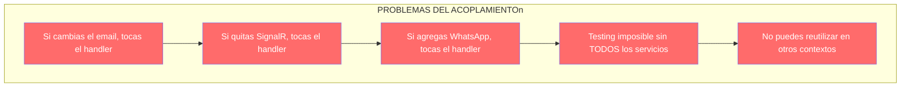

1. **Responsabilidad única violada**: El handler hace mucho más que crear un producto
2. **Difícil de testear**: Necesitas mockear 6 servicios diferentes
3. **Imposible de modificar**: Agregar/eliminar un efecto requiere cambiar el handler
4. **No reutilizable**: ¿Cómo usas esta lógica en un batch job?

---

## 14.2. ¿Qué son los Eventos de Dominio?

Un **Evento de Dominio** es un objeto que representa "algo que ocurrió" en el dominio y que puede ser interesante para otras partes del sistema.

### Características de un evento

1. **Inmutable**: Una vez creado, no se modifica
2. **Representa un hecho pasado**: "El producto fue creado", no "crear producto"
3. **Nombres en pasado**: `ProductoCreado`, `PedidoEnviado`, `UsuarioRegistrado`
4. **Puede tener múltiples suscriptores**: Varios sistemas pueden reaccionar al mismo evento

### Diferencia entre Commands y Events

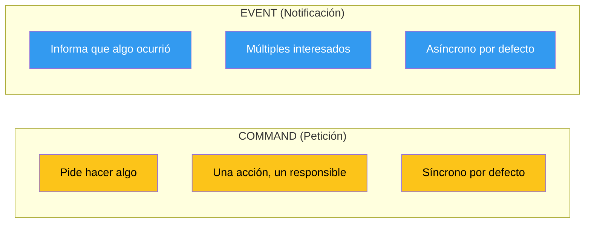

| Aspecto | Command | Event |
|---------|---------|-------|
| **Intención** | "Haz esto" | "Esto ocurrió" |
| **Productor** | El que pide | El que hizo |
| **Consumidores** | Uno (el handler) | Cero a muchos |
| **Nombre** | CreateProductoCommand | ProductoCreadoEvent |
| **Tiempo** | Antes de la acción | Después de la acción |

---

## 14.3. Notifications en MediatR: La Implementación del Patrón

En MediatR, los eventos de dominio se implementan mediante **INotification** y **INotificationHandler**.

### Cómo funciona

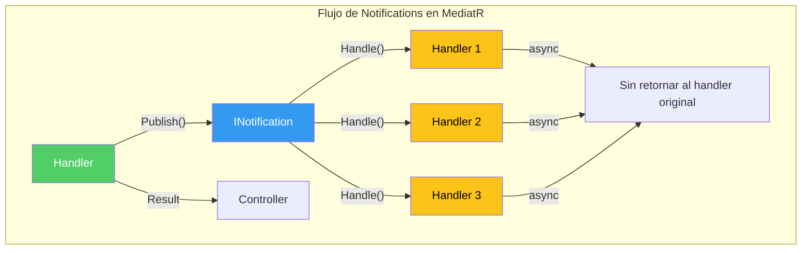

El handler principal **publica** una notificación y continúa su trabajo. Los notification handlers se ejecutan **en paralelo** y **no bloquean** la respuesta al cliente.

### Implementación básica

```csharp
// 1. DEFINIR LA NOTIFICATION
// Representa "algo que ocurrió"
public record ProductoCreadoNotification(ProductoDto Producto)
    : INotification;

// 2. CREAR HANDLERS PARA LA NOTIFICATION
// Cada handler reacciona de forma independiente

// Handler para email
public class ProductoCreadoEmailHandler
    : INotificationHandler<ProductoCreadoNotification>
{
    private readonly IEmailService _emailService;
    
    public ProductoCreadoEmailHandler(IEmailService emailService)
    {
        _emailService = emailService;
    }
    
    public async Task Handle(ProductoCreadoNotification notification, CancellationToken ct)
    {
        await _emailService.SendAsync(
            to: "admin@tienda.com",
            subject: $"Nuevo producto: {notification.Producto.Nombre}",
            body: $"Se ha creado el producto {notification.Producto.Nombre}"
        );
    }
}

// Handler para SignalR
public class ProductoCreadoSignalRHandler
    : INotificationHandler<ProductoCreadoNotification>
{
    private readonly IHubContext<ProductosHub> _hubContext;
    
    public ProductoCreadoSignalRHandler(IHubContext<ProductosHub> hubContext)
    {
        _hubContext = hubContext;
    }
    
    public async Task Handle(ProductoCreadoNotification notification, CancellationToken ct)
    {
        await _hubContext.Clients.All.SendAsync("ProductoCreado", notification.Producto);
    }
}

// Handler para cache
public class ProductoCreadoCacheHandler
    : INotificationHandler<ProductoCreadoNotification>
{
    private readonly ICacheService _cache;
    
    public async Task Handle(ProductoCreadoNotification notification, CancellationToken ct)
    {
        await _cache.RemoveAsync("productos:all");  // Invalidar cache de lista
    }
}
```

### En el Command Handler

```csharp
public class CreateProductoCommandHandler
    : IRequestHandler<CreateProductoCommand, Result<ProductoDto, DomainError>>
{
    private readonly IProductoRepository _repository;
    private readonly IMediator _mediator;
    
    public CreateProductoCommandHandler(
        IProductoRepository repository,
        IMediator mediator)
    {
        _repository = repository;
        _mediator = mediator;
    }
    
    public async Task<Result<ProductoDto, DomainError>> Handle(
        CreateProductoCommand request,
        CancellationToken cancellationToken)
    {
        // 1. Guardar el producto (lógica principal)
        var saved = await _repository.SaveAsync(request.Dto.ToEntity());
        var dto = saved.ToDto();
        
        // 2. PUBLICAR LA NOTIFICATION (sin esperar)
        // Los efectos secundarios se ejecutan en paralelo
        await _mediator.Publish(new ProductoCreadoNotification(dto), cancellationToken);
        
        // 3. Retornar resultado inmediatamente
        // No esperamos a que terminen los notification handlers
        return Result.Success<ProductoDto, DomainError>(dto);
    }
}
```

---

## 14.4. Anatomía de una Notification y sus Handlers

Veamos una implementación completa de nuestro proyecto.

### La Notification

```csharp
// Features/Users/Notifications/UsuarioRegistradoNotification.cs
namespace TiendaApi.Api.Features.Users.Notifications;

public record UsuarioRegistradoNotification(UserDto Usuario)
    : INotification;
```

### Los Handlers

```csharp
// Handler 1: Email de bienvenida
// Features/Users/Notifications/UsuarioRegistradoBienvenidaEmailHandler.cs
namespace TiendaApi.Api.Features.Users.Notifications;

public class UsuarioRegistradoBienvenidaEmailHandler
    : INotificationHandler<UsuarioRegistradoNotification>
{
    private readonly IEmailService _emailService;
    private readonly ILogger<UsuarioRegistradoBienvenidaEmailHandler> _logger;
    
    public UsuarioRegistradoBienvenidaEmailHandler(
        IEmailService emailService,
        ILogger<UsuarioRegistradoBienvenidaEmailHandler> logger)
    {
        _emailService = emailService;
        _logger = logger;
    }
    
    public async Task Handle(
        UsuarioRegistradoNotification notification,
        CancellationToken cancellationToken)
    {
        _logger.LogInformation("Enviando email de bienvenida a {Email}", notification.Usuario.Email);
        
        await _emailService.SendAsync(
            to: notification.Usuario.Email,
            subject: "¡Bienvenido a TiendaApi!",
            body: $"""
                Hola {notification.Usuario.Username},
                
                Bienvenido a nuestra tienda. Tu cuenta ha sido creada exitosamente.
                
                ¡Gracias por registrarte!
                """
        );
    }
}
```

```csharp
// Handler 2: Notificación a administradores
// Features/Users/Notifications/UsuarioRegistradoAdminNotificationHandler.cs
namespace TiendaApi.Api.Features.Users.Notifications;

public class UsuarioRegistradoAdminNotificationHandler
    : INotificationHandler<UsuarioRegistradoNotification>
{
    private readonly IHubContext<AdminHub> _hubContext;
    private readonly IAdminService _adminService;
    
    public async Task Handle(
        UsuarioRegistradoNotification notification,
        CancellationToken cancellationToken)
    {
        // Notificar al grupo de administradores
        await _hubContext.Clients.Group("admins").SendAsync(
            "NuevoUsuarioRegistrado",
            notification.Usuario
        );
    }
}
```

### El Command que publica

```csharp
// Features/Users/Commands/CreateUserCommand.cs
public class CreateUserCommandHandler(
    IUserRepository repository,
    IValidator<RegisterDto> validator,
    IMediator mediator)
    : IRequestHandler<CreateUserCommand, Result<UserDto, DomainError>>
{
    public async Task<Result<UserDto, DomainError>> Handle(
        CreateUserCommand request,
        CancellationToken cancellationToken)
    {
        // Validar...
        // Verificar duplicados...
        // Crear usuario...
        
        await repository.SaveAsync(user);
        
        // PUBLICAR: Los notification handlers se ejecutan en paralelo
        await mediator.Publish(new UsuarioRegistradoNotification(dto), cancellationToken);
        
        return Result.Success<UserDto, DomainError>(dto);
    }
}
```

---

## 14.5. La Metáfora del periódico

Para entender mejor cómo funcionan las notifications, usemos una metáfora que uso en clase.

### El periódico

```mermaid
flowchart TB
    subgraph "EL PERIÓDICO"
        P[Editor\n(Command Handler)]
        N[Periódico\n(INotification)]
        S1[Lector de Deportes]
        S2[Lector de Política]
        S3[Lector de Economía]
        S4[Lector de Cine]
    end
    
    P -->|"Publica"| N
    N -->|"Entrega a"| S1
    N -->|"Entrega a"| S2
    N -->|"Entrega a"| S3
    N -->|"Entrega a"| S4
    
    S1 -->|"Lee"| O1[Cada uno lee lo que le interesa]
    S2 -->|"Lee"| O2
    S3 -->|"Lee"| O3
    S4 -->|"Lee"| O4
```

1. **El Editor (Command Handler)** escribe la noticia principal (crea el producto)
2. **El Periódico (Notification)** se distribuye a todos los suscriptores
3. **Los Lectores (Notification Handlers)** reciben el periódico y cada uno reacciona a lo que le interesa

### ¿Por qué es mejor así?

| Aspecto | Sin Notification | Con Notification |
|---------|------------------|-------------------|
| **Acoplamiento** | Editor conoce a todos los lectores | Editor solo conoce al periódico |
| **Extensibilidad** | Modificar editor para agregar lector | Agregar nuevo lector sin tocar editor |
| **Testing** | Testear editor requiere todos los lectores | Testear editor sin lectores |
| **Reutilización** | Mismo código en diferentes contextos | Notification reusable |

---

## 14.6. Eventos en Nuestro Proyecto: Casos Reales

Veamos los eventos reales que tenemos en el proyecto.

### Eventos de Productos

```csharp
// Producto creado
public record ProductoCreadoNotification(ProductoDto Producto) : INotification;

// Handlers correspondientes
public class ProductoCreadoEmailHandler : INotificationHandler<ProductoCreadoNotification> { }
public class ProductoCreadoSignalRHandler : INotificationHandler<ProductoCreadoNotification> { }

// Producto eliminado
public record ProductoEliminadoNotification(long ProductoId, string Nombre) : INotification;

// Handlers correspondientes
public class ProductoEliminadoSignalRHandler : INotificationHandler<ProductoEliminadoNotification> { }
```

### Eventos de Pedidos

```csharp
// Pedido creado
public record PedidoCreadoNotification(PedidoDto Pedido) : INotification;

// Handlers
public class PedidoCreadoEmailHandler : INotificationHandler<PedidoCreadoNotification> { }
public class PedidoCreadoSignalRHandler : INotificationHandler<PedidoCreadoNotification> { }

// Estado actualizado
public record EstadoPedidoActualizadoNotification(string PedidoId, string NuevoEstado) : INotification;

// Handlers
public class EstadoPedidoActualizadoEmailHandler : INotificationHandler<EstadoPedidoActualizadoNotification> { }
public class EstadoPedidoActualizadoSignalRHandler : INotificationHandler<EstadoPedidoActualizadoNotification> { }

// Pedido cancelado
public record PedidoCanceladoNotification(string PedidoId) : INotification;

// Handlers
public class PedidoCanceladoSignalRHandler : INotificationHandler<PedidoCanceladoNotification> { }
```

### Eventos de Usuarios

```csharp
// Usuario registrado
public record UsuarioRegistradoNotification(UserDto Usuario) : INotification;

// Handlers
public class UsuarioRegistradoBienvenidaEmailHandler : INotificationHandler<UsuarioRegistradoNotification> { }
```

### Diagrama de flujo completo

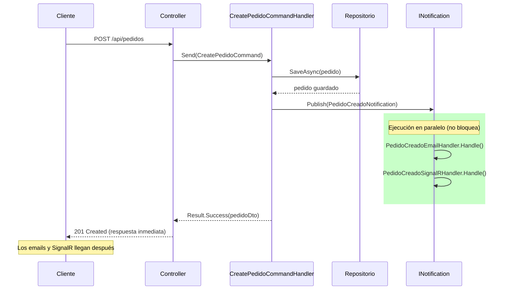

---

## 14.7. Pipeline Behaviors: cross-cutting concerns

Los **Pipeline Behaviors** son como "middleware" para MediatR. Permiten ejecutar código antes y después de cada handler, de forma transparente.

### ¿Para qué sirven?

Imagina que quieres:
- 📝 Loggear todas las peticiones que entran
- ⏱️ Medir cuánto tiempo tarda cada handler
- 🔒 Verificar autorización en un solo lugar
- 💱 Manejar transacciones automáticamente
- 📊 Registrar métricas

Con behaviors, esto se hace una sola vez y aplica a TODOS los handlers.

### Ejemplo: Logging Behavior

```csharp
public class LoggingBehavior<TRequest, TResponse>
    : IPipelineBehavior<TRequest, TResponse>
    where TRequest : notnull
{
    private readonly ILogger<LoggingBehavior<TRequest, TResponse>> _logger;
    
    public LoggingBehavior(ILogger<LoggingBehavior<TRequest, TResponse>> logger)
    {
        _logger = logger;
    }
    
    public async Task<TResponse> Handle(
        TRequest request,
        RequestHandlerDelegate<TResponse> next,
        CancellationToken cancellationToken)
    {
        var requestName = typeof(TRequest).Name;
        
        // ANTES del handler
        _logger.LogInformation("📥 Request {RequestName} iniciada", requestName);
        var startTime = DateTime.UtcNow;
        
        try
        {
            // Ejecutar el handler
            var response = await next();
            
            // DESPUá‰S del handler (success)
            var duration = DateTime.UtcNow - startTime;
            _logger.LogInformation(
                "✅ Request {RequestName} completada en {Duration}ms",
                requestName,
                duration.TotalMilliseconds);
            
            return response;
        }
        catch (Exception ex)
        {
            // DESPUá‰S del handler (error)
            var duration = DateTime.UtcNow - startTime;
            _logger.LogError(
                ex,
                "❌ Request {RequestName} falló en {Duration}ms",
                requestName,
                duration.TotalMilliseconds);
            
            throw;
        }
    }
}
```

### Ejemplo: Validation Behavior

```csharp
public class ValidationBehavior<TRequest, TResponse>
    : IPipelineBehavior<TRequest, TResponse>
    where TRequest : notnull
{
    private readonly IEnumerable<IValidator<TRequest>> _validators;
    
    public ValidationBehavior(IEnumerable<IValidator<TRequest>> validators)
    {
        _validators = validators;
    }
    
    public async Task<TResponse> Handle(
        TRequest request,
        RequestHandlerDelegate<TResponse> next,
        CancellationToken cancellationToken)
    {
        if (!_validators.Any())
            return await next();
        
        var context = new ValidationContext<TRequest>(request);
        
        var validationResults = await Task.WhenAll(
            _validators.Select(v => v.ValidateAsync(context, cancellationToken))
        );
        
        var failures = validationResults
            .SelectMany(r => r.Errors)
            .Where(f => f != null)
            .ToList();
        
        if (failures.Any())
        {
            throw new ValidationException(failures);
        }
        
        return await next();
    }
}
```

### Registro de behaviors

```csharp
// Infrastructures/MediatRConfig.cs
public static IServiceCollection AddMediatRHandlers(this IServiceCollection services)
{
    services.AddMediatR(cfg =>
    {
        cfg.RegisterServicesFromAssemblyContaining<Program>();
        
        // Registrar behaviors (el orden importa!)
        cfg.AddBehavior(typeof(IPipelineBehavior<,>), typeof(LoggingBehavior<,>));
        cfg.AddBehavior(typeof(IPipelineBehavior<,>), typeof(ValidationBehavior<,>));
    });
    
    return services;
}
```

### Orden de ejecución de behaviors

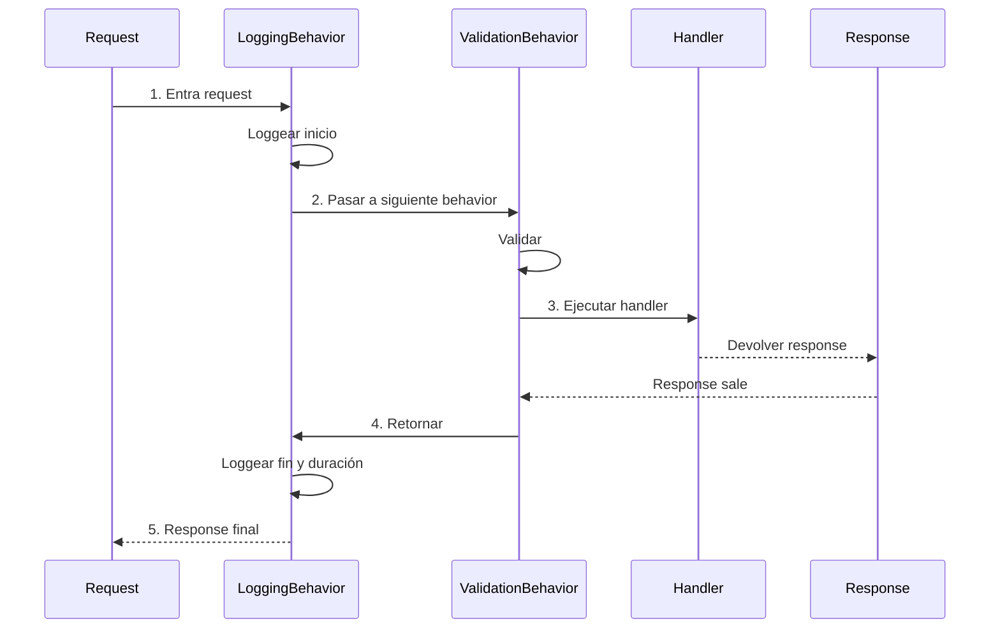

---

## 14.8. Open/Closed Principle en Acción

El **Open/Closed Principle** dice: "Las entidades de software deben estar abiertas para extensión pero cerradas para modificación."

Las Notifications son el ejemplo perfecto de este principio.

### El problema: Agregar WhatsApp

Imagina que quieres agregar notificaciones por WhatsApp cuando se crea un producto:

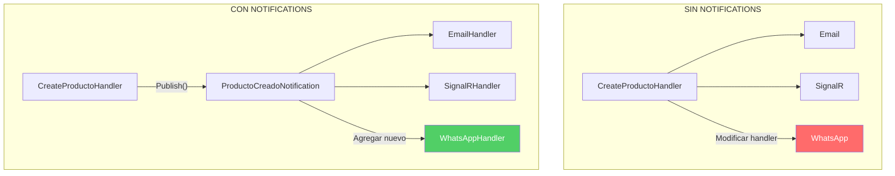

**Sin notifications**: Tienes que modificar el handler existente
**Con notifications**: Solo agregas un nuevo handler, sin tocar nada más

### Ejemplo real de extensión

```csharp
// 1. EXISTE: Email handler
public class ProductoCreadoEmailHandler
    : INotificationHandler<ProductoCreadoNotification>
{
    public Task Handle(ProductoCreadoNotification n, CancellationToken ct)
    {
        // Enviar email...
    }
}

// 2. EXISTE: SignalR handler
public class ProductoCreadoSignalRHandler
    : INotificationHandler<ProductoCreadoNotification>
{
    public Task Handle(ProductoCreadoNotification n, CancellationToken ct)
    {
        // Notificar clientes...
    }
}

// 3. NUEVO: WhatsApp handler (sin tocar nada existente)
public class ProductoCreadoWhatsAppHandler
    : INotificationHandler<ProductoCreadoNotification>
{
    private readonly IWhatsAppService _whatsApp;
    
    public ProductoCreadoWhatsAppHandler(IWhatsAppService whatsApp)
    {
        _whatsApp = whatsApp;
    }
    
    public Task Handle(ProductoCreadoNotification n, CancellationToken ct)
    {
        // Enviar WhatsApp al administrador
        return _whatsApp.SendAsync("Nuevo producto creado: " + n.Producto.Nombre);
    }
}
```

**¡Solo creas un nuevo archivo!** No necesitas modificar nada del código existente.

---

## 14.9. Comparativa: Llamada Directa vs Notifications

Vamos a comparar ambas aproximaciones con un ejemplo real.

### Enfoque tradicional (acoplado)

```csharp
public class CreatePedidoCommandHandler
{
    public async Task<Result<PedidoDto, DomainError>> Handle(CreatePedidoCommand command)
    {
        // 1. Guardar pedido
        var pedido = await _repository.SaveAsync(command.Dto.ToEntity());
        
        // 2. ENVIAR EMAIL (acoplado)
        await _emailService.SendAsync(new EmailRequest
        {
            To = pedido.Destinatario.Email,
            Subject = "Pedido confirmado",
            Body = $"Tu pedido #{pedido.Id} ha sido confirmado"
        });
        
        // 3. NOTIFICAR SIGNALR (acoplado)
        await _hubContext.Clients.All.SendAsync("PedidoCreado", pedido.ToDto());
        
        // 4. ACTUALIZAR Má‰TRICAS (acoplado)
        await _metricsService.IncrementAsync("pedidos_creados");
        
        // 5. INVALIDAR CACHE (acoplado)
        await _cache.RemoveAsync("pedidos:all");
        
        return Result.Success<PedidoDto, DomainError>(pedido.ToDto());
    }
}
```

**Problemas**:
- Si去掉 uno de estos servicios, hay que modificar el handler
- Testing requiere mockear 5 servicios
- No hay forma de deshabilitar temporalmente un efecto secundario

### Enfoque con Notifications (desacoplado)

```csharp
public class CreatePedidoCommandHandler
{
    public async Task<Result<PedidoDto, DomainError>> Handle(CreatePedidoCommand command)
    {
        // 1. Guardar pedido (única responsabilidad del handler)
        var pedido = await _repository.SaveAsync(command.Dto.ToEntity());
        
        // 2. PUBLICAR EVENTO (el handler no sabe quién escucha)
        await _mediator.Publish(new PedidoCreadoNotification(pedido.ToDto()), cancellationToken);
        
        return Result.Success<PedidoDto, DomainError>(pedido.ToDto());
    }
}
```

**Handlers separados**:

```csharp
// Email handler
public class PedidoCreadoEmailHandler : INotificationHandler<PedidoCreadoNotification>
{
    public async Task Handle(PedidoCreadoNotification n, CancellationToken ct)
        => await _emailService.SendAsync(...);
}

// SignalR handler  
public class PedidoCreadoSignalRHandler : INotificationHandler<PedidoCreadoNotification>
{
    public async Task Handle(PedidoCreadoNotification n, CancellationToken ct)
        => await _hubContext.Clients.All.SendAsync("PedidoCreado", n.Pedido);
}

// Metrics handler
public class PedidoCreadoMetricsHandler : INotificationHandler<PedidoCreadoNotification>
{
    public async Task Handle(PedidoCreadoNotification n, CancellationToken ct)
        => await _metricsService.IncrementAsync("pedidos_creados");
}

// Cache handler
public class PedidoCreadoCacheHandler : INotificationHandler<PedidoCreadoNotification>
{
    public async Task Handle(PedidoCreadoNotification n, CancellationToken ct)
        => await _cache.RemoveAsync("pedidos:all");
}
```

**Beneficios**:
- Cada handler es independiente y testeable por separado
- Agregar/eliminar efectos secundarios sin tocar el command handler
- Diferentes equipos pueden trabajar en diferentes handlers
- Fácil deshabilitar un efecto comentando o eliminando el handler

---

## 14.10. Consideraciones y Mejores Prácticas

Ahora que conoces el poder de las Notifications, aquí有一些 consideraciones importantes.

### Cuándo usar Notifications

✅ **Efectos secundarios que no afectan el resultado principal**
Enviar emails, notificar por SignalR, logs, métricas

✅ **Operaciones que pueden fallar sin afectar el flujo principal**
Si el email falla, el pedido igual debe crearse

✅ **Cuando múltiples sistemas deben reaccionar al mismo evento**
Email + SignalR + Auditoría

### Cuándo NO usar Notifications

❌ **Cuando el resultado depende del efecto secundario**
Si necesitas esperar a que termine el email para retornar, no uses notifications

❌ **Operaciones transaccionales**
Invalidar cache dentro de una transacción debe hacerse en el handler principal

❌ **Efectos secundarios que pueden bloquear**
No pongas operaciones largas en notification handlers

### Mejores prácticas

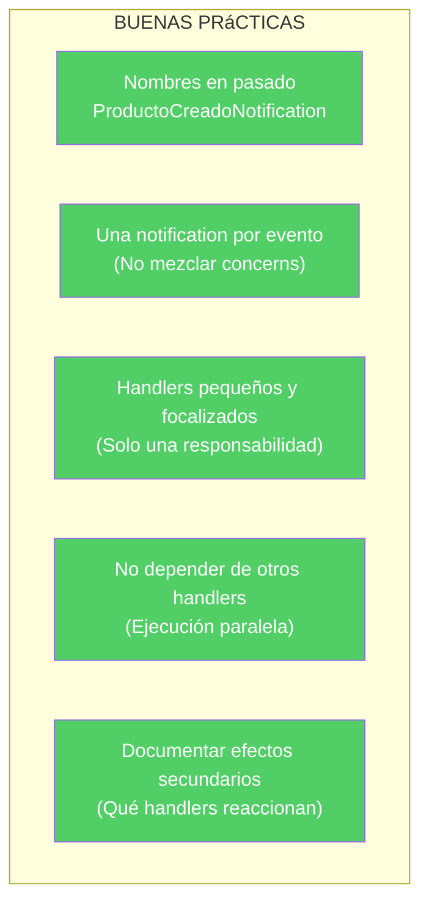

### Error común: dependency circular

```csharp
// ❌ NO HAGAS ESTO: Dependency circular
public class CreateProductoCommandHandler
{
    public async Task Handle(CreateProductoCommand cmd)
    {
        await _repository.SaveAsync(...);
        
        // El handler depende de sí mismo a través de la notification?
        // NO, esto funciona porque los handlers son diferentes instancias
    }
}
```

Esto NO es un problema porque MediatR crea nuevas instancias de los handlers. Pero ten cuidado con dependencias que se llaman entre sí.

### Manejo de errores en handlers

```csharp
public class PedidoCreadoEmailHandler
    : INotificationHandler<PedidoCreadoNotification>
{
    private readonly IEmailService _emailService;
    private readonly ILogger _logger;
    
    public async Task Handle(PedidoCreadoNotification n, CancellationToken ct)
    {
        try
        {
            await _emailService.SendAsync(...);
        }
        catch (Exception ex)
        {
            // Loggear pero NO lanzar
            // Un error en email no debe fallar el flujo principal
            _logger.LogError(ex, "Error enviando email de pedido creado");
        }
    }
}
```

**Regla de oro**: Los notification handlers nunca deben lanzar excepciones que alcancen al handler principal. Si falla, loggea y continúa.

---

## 14.11. Consistencia Eventual: los cambios entre la escritura y la lectura

Hasta aquí todo son eventos *dentro* de la misma petición: el command escribe, publica y responde. Pero si la **lectura** no ocurre en la misma base de datos que la **escritura**, aparece una pregunta inevitable: *¿qué ve un cliente que lee mientras el cambio se propaga?* La respuesta es la **consistencia eventual**: el dato acaba llegando a todas las lecturas, pero puede tardar.

### El mapa real de escritura y lectura de este proyecto

| Dato | Escritura (Commands) | Lectura (Queries) | ¿Hay ventana de inconsistencia? |
|------|----------------------|-------------------|----------------------------------|
| **Productos** | PostgreSQL (EF Core, `IProductoRepository`) | MongoDB `productos_read` (vía `IProductoService`) + caché | **Sí**: PG → Mongo y Mongo → caché |
| **Categorías** | PostgreSQL | PostgreSQL (EF) + caché | Solo la caché (se invalida al escribir) |
| **Pedidos** | MongoDB (`IPedidosRepository`) | MongoDB (mismo almacén) | No (misma fuente) |
| **Users** | PostgreSQL | PostgreSQL | No |

Los productos son el caso CQRS *puro* del proyecto: **PostgreSQL es la fuente de verdad** y `productos_read` (MongoDB) es el **read model** desnormalizado —categoría embebida incluida— que alimentan REST y GraphQL. La sincronización la hacen los propios eventos: `ProductoReadSyncHandler` escucha `ProductoCreadoNotification`, `ProductoActualizadoNotification`, `ProductoEliminadoNotification` y `CategoriaActualizadaNotification`.

### Ciclo completo de un cambio, con marcas de tiempo

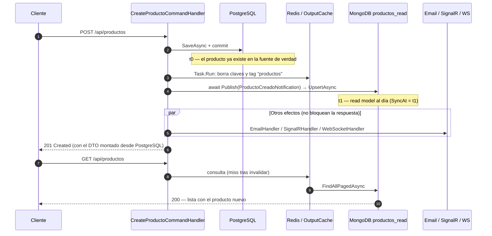

Dos detalles importantes de este flujo:

1. `await mediator.Publish(...)` se ejecuta **antes** de devolver el 201: cuando el escritor recibe la respuesta, en condiciones normales el read model ya está al día (t1 ≤ t201).
2. La invalidación de caché es **fire-and-forget** (`_ = Task.Run(...)`): corre en paralelo con el sync y su fallo solo genera un `Log.Warning` — nunca rompe la escritura.

### La ventana de inconsistencia

Aun así, **otro cliente que lea entre t0 y t1** verá el estado anterior — y es correcto: es el precio de no transaccionar dos bases de datos a la vez.

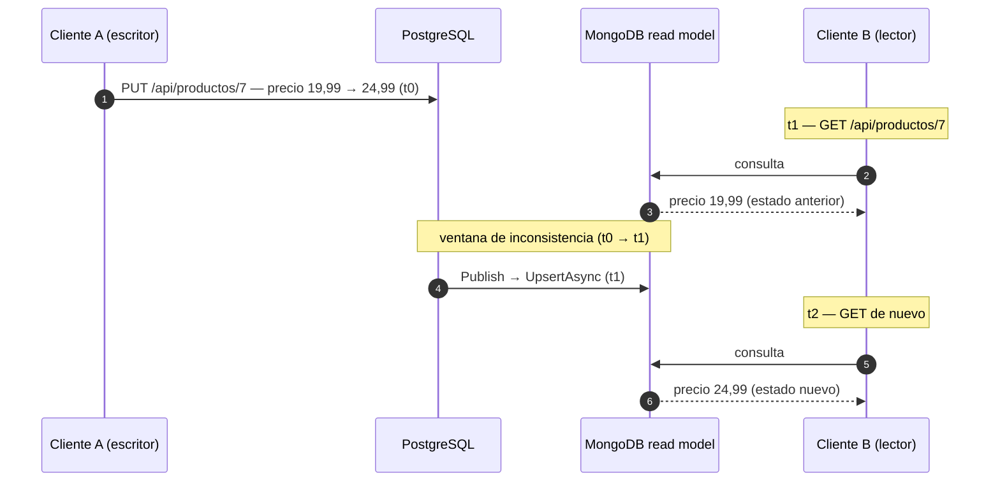

> En este proyecto la ventana PG → Mongo dura **milisegundos** (es el `UpsertAsync` de dentro del mismo `Publish`). La ventana que más puede doler es la de **caché**: si una lectura concurrente se cuela entre la invalidación y el `UpsertAsync`, puede repoblar la caché con el dato antiguo y mantenerlo hasta su TTL (OutputCache: **60 s**; caché de fachada: **10 min**).

### ¿Qué hace la ventana más larga o más corta?

| Factor | Efecto en la ventana |
|--------|----------------------|
| Duración del commit en PostgreSQL | retrasa t0: la ventana empieza cuando confirma la transacción |
| Tiempo del `UpsertAsync` en MongoDB | es t1 − t0 en condiciones normales: milisegundos |
| Latencia de red API → MongoDB | se suma al sync; en local, casi nada |
| Carga del clúster o escrituras encadenadas | los `Publish` se serializan por petición |
| **Fallo de MongoDB en t1** | la ventana se abre **indefinidamente** hasta reparar (ver abajo) |
| TTL de la caché (60 s / 10 min) | techo del segundo tramo (Mongo → caché) si la invalidación falla |

### Cómo manejarla: estrategias

| Estrategia | Aplicación en este proyecto |
|------------|------------------------------|
| **Aceptar la ventana** | por defecto: para un catálogo, eventualmente consistente es suficiente |
| **Mostrar cuándo se sincronizó** | `ProductoRead.SyncAt` guarda el instante de la última réplica: puede devolverse al cliente por transparencia |
| **Invalidar la caché al escribir** | `EvictByTagAsync("productos")` + `RemoveAsync("productos:{id}")` en los commands: reduce el tramo Mongo → caché a milisegundos |
| **Leer de la fuente de verdad tras escribir** | el 201 devuelve el DTO montado desde PostgreSQL, nunca desde el read model |
| **Reparar al arrancar** | `ProductoReadSeeder`: en dev, drop + bulk insert; en prod, upsert + poda de documentos huérfanos |

### Polling frente a Domain Events

¿Y si en vez de eventos hiciéramos un proceso que preguntase cada X segundos si cambió algo (*polling*)?

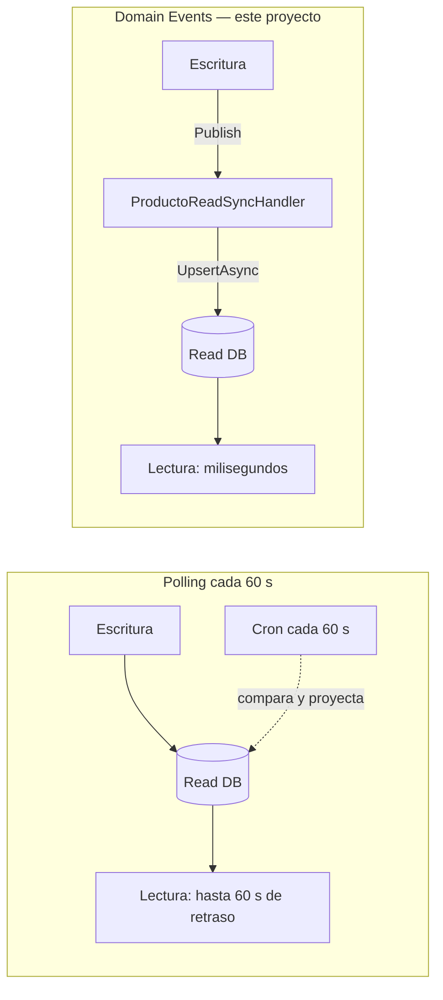

| | Polling | Domain Events (lo elegido) |
|---|---------|------------------------------|
| **Latencia** | hasta el intervalo (p. ej. 60 s) | milisegundos |
| **Coste** | consultas constantes aunque no haya cambios | 1 sync solo cuando hay cambio |
| **Complejidad** | proceso o cron extra + detección de cambios | ya vivíamos `IMediator.Publish` |
| **Fallos** | el siguiente tick reintenta solo | hay que gestionarlos explícitamente |

El polling sigue siendo válido cuando el productor **no puede publicar eventos** (sistemas ajenos, datos de terceros); aquí los commands publican, así que los eventos ganan.

### Manejo de errores en la sincronización

¿Y si MongoDB no está disponible en t1? La regla del proyecto es: **una caída del read model no puede tumbar una escritura ya commiteada en PostgreSQL**.

```mermaid
sequenceDiagram
    autonumber
    participant H as CreateProductoCommandHandler
    participant PG as PostgreSQL
    participant S as ProductoReadSyncHandler
    participant M as MongoDB

    H->>PG: commit OK (t0)
    H->>S: Publish(ProductoCreadoNotification)
    S->>M: UpsertAsync
    M-->>S: ✗ MongoDB no disponible
    S->>S: catch → LogError (no relanza)
    S-->>H: Publish termina sin excepción
    H-->>H: 201 Created — la escritura NO falla
    Note over M: PG ya commiteado;<br/>ProductoReadSeeder repara la réplica<br/>en el próximo arranque
```

Así está implementado: cada `Handle` de `ProductoReadSyncHandler` envuelve la operación en `try/catch` y solo registra el error; la reparación la hace el seeder de arranque.

Si queremos acortar la ventana de fallo sin tocar la escritura, la evolución natural es **reintentar el sync con backoff** (el mismo espíritu de Polly que ya usamos en email — `doc/23-email-services.md`):

```csharp
private static async Task RetryAsync(Func<Task> action, ILogger logger, int maxAttempts = 3)
{
    for (var attempt = 1; ; attempt++)
    {
        try { await action(); return; }
        catch (Exception ex) when (attempt < maxAttempts)
        {
            logger.LogWarning(ex, "Sync reintento {Attempt}/{Max}", attempt, maxAttempts);
            await Task.Delay(TimeSpan.FromSeconds(Math.Pow(2, attempt)));
        }
    }
}
```

Para sistemas con más exigencia existen opciones mayores: **cola de mensajes** entre PostgreSQL y MongoDB, **CDC** (Debezium leyendo el WAL) o **idempotencia** en los consumidores para reintentar sin miedo a duplicar — todas ellas descritas en `doc/12-cqrs-commands-queries.md` (sección 12.15, *Patrones de Sincronización*).

### Evolución: tres niveles de consistencia (Nivel 1 → 1.5 → 2)

El proyecto actual está en **Nivel 1**: el `Publish` en memoria funciona el 99% de las veces, y si MongoDB falla, el seeder de arranque repara la réplica. Pero hay dos problemas: (1) la reparación solo ocurre al reiniciar la app, y (2) no hay invalidación de caché al reparar.

Aquí están los tres niveles, de menor a mayor exigencia:

#### Nivel 1 — Publish en memoria (ACTUAL)

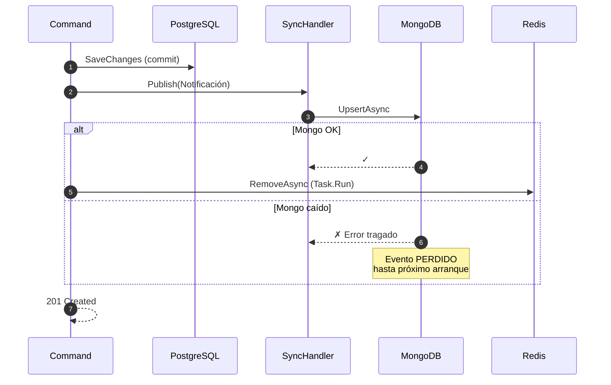

- ✅ Separa leer/escribir, enseña eventos de dominio
- ❌ Si Mongo falla, el evento se pierde hasta el próximo arranque
- ❌ La caché no se invalida al reparar

#### Nivel 1.5 — + ReplicaReparadoraJob (IMPLEMENTADO)

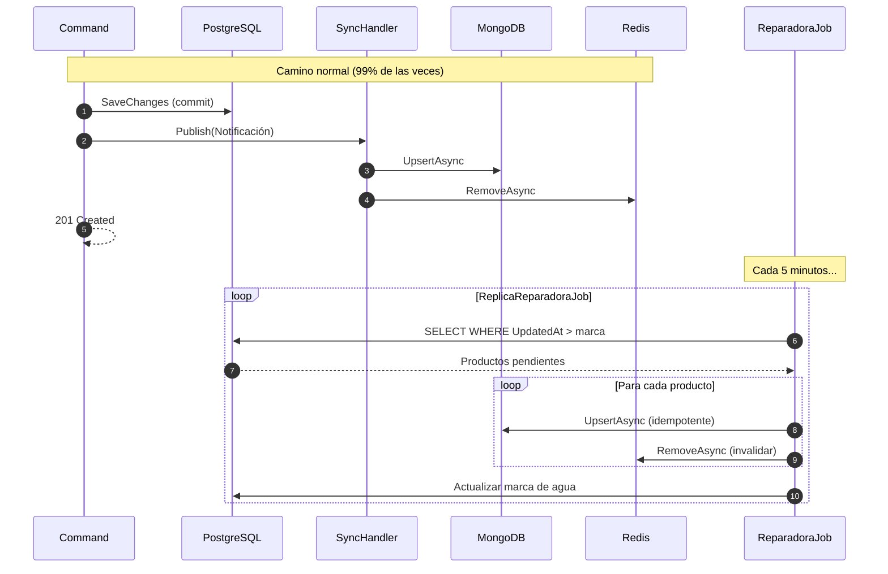

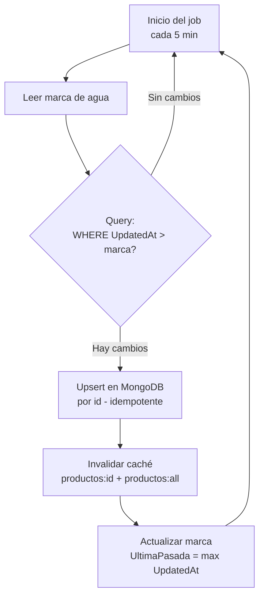

- ✅ Auto-reparable en minutos, no en el próximo arranque
- ✅ Enseña consistencia eventual, idempotencia, marcas de agua
- ✅ Demo en clase: "mata Mongo a mano, espera 5 min, vuelve a mirar"
- ❌ Ventana de 5 minutos de desfase máximo

#### Nivel 2 — Outbox transaccional (PRODUCCIÓN, no implementado aquí)

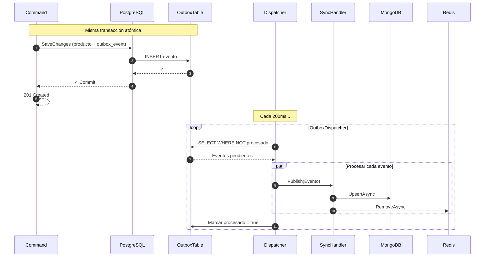

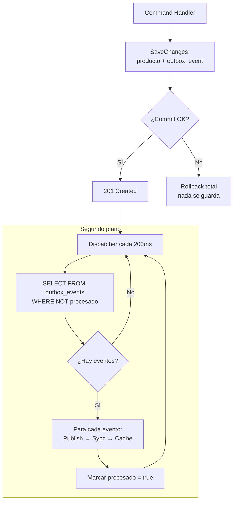

```sql
CREATE TABLE outbox_events (
    id          bigint GENERATED ALWAYS AS IDENTITY PRIMARY KEY,
    tipo        text        NOT NULL,  -- "ProductoCreadoNotification"
    payload     jsonb       NOT NULL,  -- el evento serializado
    creado_en   timestamptz NOT NULL,
    procesado   boolean     NOT NULL DEFAULT false,
    intentos    int         NOT NULL DEFAULT 0
);
```

- ✅ At-least-once: el evento NUNCA se pierde
- ✅ Atomicidad transaccional del evento
- ❌ ~150 líneas + tabla nueva + dispatcher
- ❌ Para empresa o TFG, no para un ejercicio de DAW

#### Comparativa visual de los tres niveles

```mermaid
flowchart TB
    subgraph N1["Nivel 1 - Publish en memoria"]
        A1[Command] --> B1[SaveChanges PG]
        B1 --> C1[Publish en memoria]
        C1 --> D1{Mongo OK?}
        D1 -->|Sí| E1[Upsert + Caché]
        D1 -->|No| F1[❌ Evento perdido<br/>hasta próximo arranque]
    end

    subgraph N15["Nivel 1.5 - + ReplicaReparadoraJob"]
        A2[Command] --> B2[SaveChanges PG]
        B2 --> C2[Publish en memoria]
        C2 --> D2{Mongo OK?}
        D2 -->|Sí| E2[Upsert + Caché]
        D2 -->|No| F2[⚠️ Evento fallido<br/>job lo repara en ≤5 min]
        G2[ReplicaReparadoraJob<br/>cada 5 min] --> H2[WHERE UpdatedAt > marca]
        H2 --> I2[Upsert idempotente]
        I2 --> J2[Invalidar caché]
    end

    subgraph N2["Nivel 2 - Outbox transaccional"]
        A3[Command] --> B3[SaveChanges:<br/>PG + outbox_event]
        B3 --> C3[201 Created]
        D3[Dispatcher cada 200ms] --> E3[SELECT WHERE NOT procesado]
        E3 --> F3[Publish → Sync → Cache]
        F3 --> G3[Marcar procesado]
    end

    style F1 fill:#ffcccc
    style F2 fill:#fff3cd
    style B3 fill:#d4edda
```

#### Criterio para subir de nivel

| Nivel | Cuándo usarlo |
|---|---|
| **1** | Aprendizaje, prototipos, proyectos donde el seeder de arranque es suficiente |
| **1.5** | Cuando quieras demostrar consistencia eventual en clase y auto-reparación |
| **2** | Cuando estés perdiendo eventos de verdad en producción — no en teoría |

> 🎓 **Regla del aula:** en una tienda de clase, el Nivel 1.5 es suficiente. El outbox es para cuando llegues a producción y notes que se pierden datos.

### En una frase

> **CQRS separa el camino de lectura del de escritura; la consistencia eventual es lo que hay que gestionar a cambio.** En este proyecto: PostgreSQL manda, los eventos replican en milisegundos, la caché se invalida al escribir, el `ReplicaReparadoraJob` repara en minutos lo que falle y el outbox queda como referencia para producción.

---

## 14.12. Resumen y Siguientes Pasos

### Puntos clave del capítulo

1. **Los Eventos de Dominio representan "algo que ocurrió"**
   - Nombres en pasado: `ProductoCreado`, `PedidoEnviado`
   - Notifican a múltiples interesados sin耦合

2. **INotification de MediatR implementa el patrón Pub/Sub**
   - El handler principal publica una notificación
   - Múltiples notification handlers reaccionan en paralelo

3. **Las Notifications permiten desacoplamiento total**
   - Agregar nuevos efectos secundarios sin modificar el handler
   - Cada handler es independiente y testeable

4. **Pipeline Behaviors aplican lógica cruzada**
   - Logging, validación, transacciones, métricas
   - Se ejecutan antes/después de TODOS los handlers

5. **Open/Closed Principle aplicado**
   - Cerrado para modificar el command handler
   - Abierto para agregar nuevos notification handlers

### Ejemplo completo del flujo

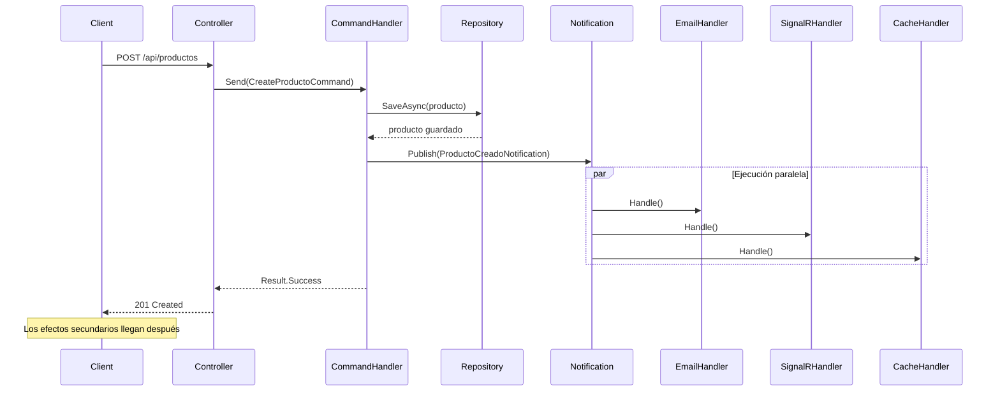

### Siguientes pasos

Con CQRS, MediatR y Eventos de Dominio dominados, tienes las bases para implementar patrones más avanzados como:

- **Sagas** para transacciones distribuidas
- **Outbox Pattern** para garantizar entrega de eventos
- **Event Sourcing** para auditoría completa

### Recursos adicionales

- Documentación MediatR: https://github.com/jbogard/MediatR
- Patrón Pub/Sub: https://docs.microsoft.com/azure/architecture/patterns/publisher-subscriber
- Domain Events: https://docs.microsoft.com/dotnet/architecture/microservices/microservice-ddd-cqrs-patterns/domain-events-design-implementation