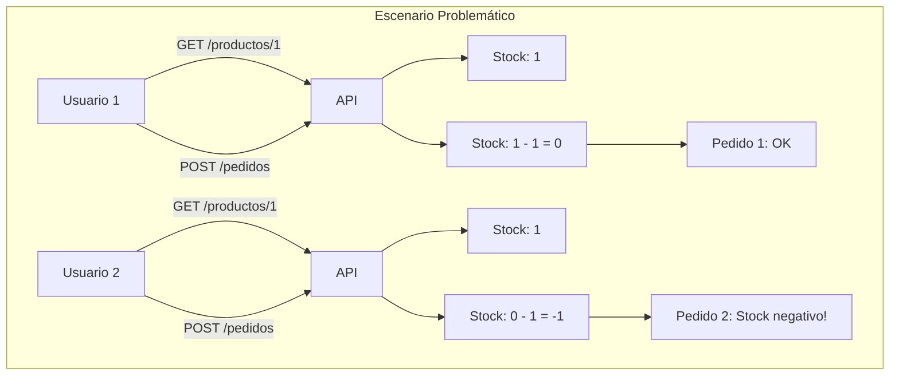
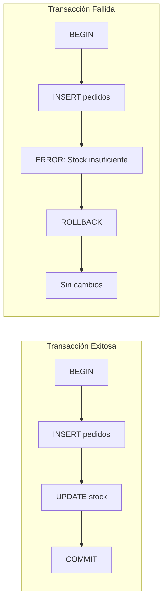
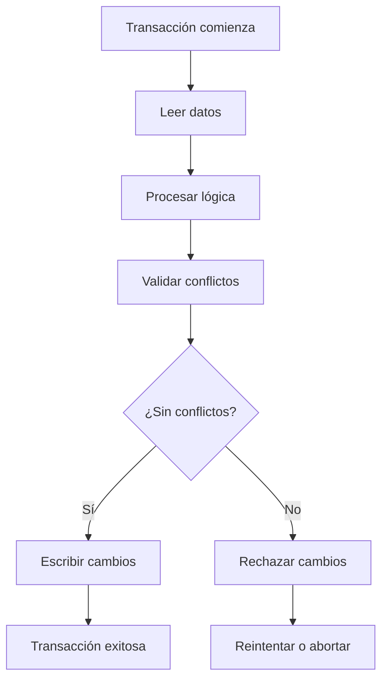
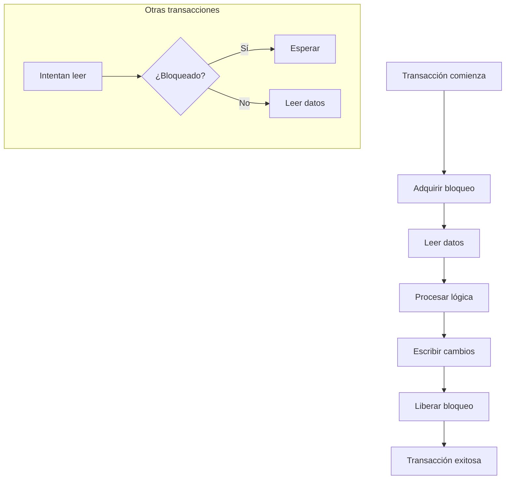
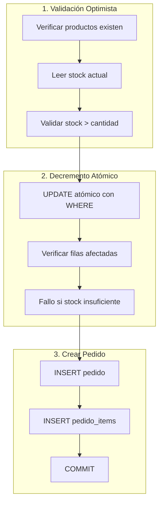
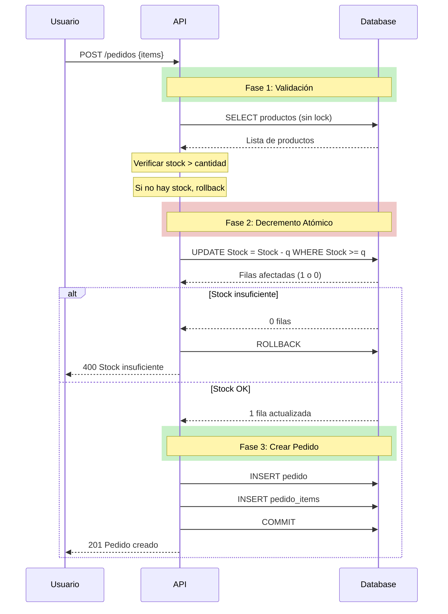
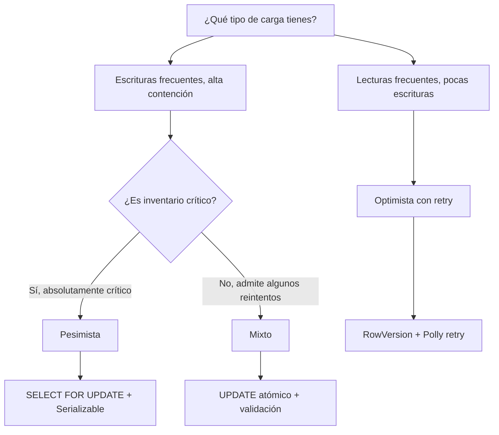
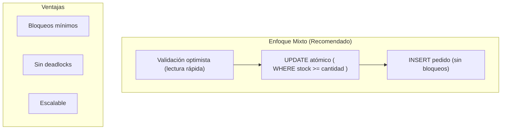

# 15. Pedidos: Transacciones y Control de Concurrencia

## Índice

[15. Pedidos: Transacciones y Control de Concurrencia](#15-pedidos-transacciones-y-control-de-concurrencia)
  - [15.1. El Problema de la Concurrencia en Pedidos](#151-el-problema-de-la-concurrencia-en-pedidos)
  - [15.2. Transacciones con EF Core](#152-transacciones-con-ef-core)
  - [15.3. Enfoque Optimista](#153-enfoque-optimista)
  - [15.4. Enfoque Pesimista](#154-enfoque-pesimista)
  - [15.5. Enfoque Mixto (Usado en el Proyecto)](#155-enfoque-mixto-usado-en-el-proyecto)
  - [15.6. Comparación de Enfoques](#156-comparación-de-enfoques)
  - [15.7. Errores de Dominio](#157-errores-de-dominio)
  - [15.8. Controller](#158-controller)
  - [15.9. Resumen](#159-resumen)

---

## 15.1. El Problema de la Concurrencia en Pedidos

Cuando múltiples usuarios intentan comprar el mismo producto simultáneamente, surgen problemas de concurrencia que pueden llevar a inconsistencias en el inventario. Sin mecanismos adecuados, podríamos vender más productos de los que realmente tenemos en stock.



### Escenario Real: Venta del Último Producto

Imaginemos que tenemos un producto con stock = 1. Dos usuarios intentan comprarlo al mismo tiempo:

| Tiempo | Usuario 1        | Usuario 2        | Stock en DB |
| ------ | ---------------- | ---------------- | ----------- |
| T1     | Lee producto     | -                | 1           |
| T2     | -                | Lee producto     | 1           |
| T3     | Crea pedido      | -                | 1           |
| T4     | Decrementa stock | -                | 0           |
| T5     | -                | Crea pedido      | 0           |
| T6     | -                | Decrementa stock | **-1**      |

El resultado es que vendemos 2 productos cuando solo teníamos 1 en stock.

### Impacto del Problema

| Problema              | Impacto                  | Solución                |
| --------------------- | ------------------------ | ----------------------- |
| Stock negativo        | Inventario inconsistente | Validación de stock > 0 |
| Sobrecarga de pedidos | Frustración del cliente  | Cancelación automática  |
| Pérdida de ventas     | Impacto económico        | Notificación al usuario |
| Datos corruptos       | Reportes incorrectos     | Transacciones atómicas  |

---

## 15.2. Transacciones con EF Core

### Conceptos de Transacciones

Una **transacción** es un conjunto de operaciones que se ejecutan como una unidad indivisible. Todas las operaciones se completan exitosamente o ninguna se aplica, garantizando la consistencia de los datos.



### Implementación de Transacciones

```csharp
using Microsoft.EntityFrameworkCore;
using Microsoft.EntityFrameworkCore.Storage;

public class PedidoService
{
    private readonly TiendaDbContext _context;
    private readonly ILogger<PedidoService> _logger;

    public PedidoService(
        TiendaDbContext context,
        ILogger<PedidoService> logger)
    {
        _context = context;
        _logger = logger;
    }

    public async Task<Result<Pedido, Error>> CreatePedidoAsync(
        CreatePedidoRequest request)
    {
        // Usar transacción explícita
        await using var transaction = await _context.Database.BeginTransactionAsync();

        try
        {
            // 1. Verificar productos y stock
            var productos = await _context.Productos
                .Where(p => request.Items.Select(i => i.ProductoId).Contains(p.Id))
                .ToListAsync();

            // Validar que todos los productos existen
            if (productos.Count != request.Items.Count)
            {
                await transaction.RollbackAsync();
                return Result.Failure<Pedido, Error>(Errors.Pedidos.ProductoNoEncontrado);
            }

            // 2. Validar stock disponible
            foreach (var item in request.Items)
            {
                var producto = productos.First(p => p.Id == item.ProductoId);
                if (producto.Stock < item.Cantidad)
                {
                    await transaction.RollbackAsync();
                    return Result.Failure<Pedido, Error>(
                        Errors.Pedidos.StockInsuficiente(
                            producto.Nombre, 
                            producto.Stock, 
                            item.Cantidad));
                }
            }

            // 3. Crear el pedido
            var pedido = new Pedido
            {
                UsuarioId = request.UsuarioId,
                Estado = PedidoEstado.Pendiente,
                CreatedAt = DateTime.UtcNow,
                Items = request.Items.Select(item => new PedidoItem
                {
                    ProductoId = item.ProductoId,
                    Cantidad = item.Cantidad,
                    PrecioUnitario = productos.First(p => p.Id == item.ProductoId).Precio
                }).ToList()
            };

            _context.Pedidos.Add(pedido);

            // 4. Decrementar stock
            foreach (var item in request.Items)
            {
                var producto = await _context.Productos
                    .FirstAsync(p => p.Id == item.ProductoId);
                producto.Stock -= item.Cantidad;
            }

            // 5. Guardar cambios
            await _context.SaveChangesAsync();

            // 6. Commit de la transacción
            await transaction.CommitAsync();

            _logger.LogInformation(
                "Pedido {PedidoId} creado exitosamente para usuario {UsuarioId}",
                pedido.Id, pedido.UsuarioId);

            return pedido;
        }
        catch (Exception ex)
        {
            await transaction.RollbackAsync();
            _logger.LogError(ex, "Error creando pedido para usuario {UsuarioId}", 
                request.UsuarioId);
            
            return Result.Failure<Pedido, Error>(Errors.Pedidos.ErrorInesperado);
        }
    }
}
```

---

## 15.3. Enfoque Optimista

El **control de concurrencia optimista** asume que los conflictos son raros y permite que las transacciones procedan sin bloqueos. Los cambios se validan al final, y si otro proceso ha modificado los datos, se rechaza la transacción.

### Características del Enfoque Optimista



| Aspecto          | Descripción                           |
| ---------------- | ------------------------------------- |
| **Suposición**   | Pocos conflictos entre transacciones  |
| **Bloqueos**     | Sin bloqueos durante la ejecución     |
| **Validación**   | Al final, verificando versiones       |
| **Rendimiento**  | Mejor cuando conflictos son raros     |
| **Casos de uso** | Lecturas frecuentes, escrituras pocas |

### Implementación con Row Version (Timestamp)

```csharp
// Entity con RowVersion para optimistic concurrency
public class Producto
{
    public long Id { get; set; }
    public string Nombre { get; set; } = string.Empty;
    public decimal Precio { get; set; }
    public int Stock { get; set; }
    
    // Timestamp de versión para concurrency
    [Timestamp]
    public byte[] RowVersion { get; set; } = null!;
}

// En Fluent API
modelBuilder.Entity<Producto>(entity =>
{
    entity.Property(p => p.RowVersion)
          .IsRowVersion();
});
```

### Manejo de Conflictos de Concurrencia

```csharp
public class PedidoService
{
    private readonly TiendaDbContext _context;
    private readonly ILogger<PedidoService> _logger;

    public async Task<Result<Pedido, Error>> CreatePedidoConOptimisticLockAsync(
        CreatePedidoRequest request)
    {
        await using var transaction = await _context.Database.BeginTransactionAsync();

        try
        {
            var productos = new List<Producto>();

            foreach (var item in request.Items)
            {
                // EF Core genera UPDATE con WHERE RowVersion = valor_leido
                var producto = await _context.Productos
                    .FirstOrDefaultAsync(p => p.Id == item.ProductoId);

                if (producto == null)
                {
                    await transaction.RollbackAsync();
                    return Result.Failure<Pedido, Error>(
                        Errors.Productos.NoEncontrados);
                }

                // Verificar stock
                if (producto.Stock < item.Cantidad)
                {
                    await transaction.RollbackAsync();
                    return Result.Failure<Pedido, Error>(
                        Errors.Pedidos.StockInsuficiente(
                            producto.Nombre, producto.Stock, item.Cantidad));
                }

                productos.Add(producto);
            }

            // Decrementar stock (con WHERE RowVersion)
            foreach (var item in request.Items)
            {
                var producto = await _context.Productos
                    .FirstAsync(p => p.Id == item.ProductoId);
                producto.Stock -= item.Cantidad;
            }

            // Crear pedido
            var pedido = new Pedido
            {
                UsuarioId = request.UsuarioId,
                Estado = PedidoEstado.Pendiente,
                CreatedAt = DateTime.UtcNow,
                Items = request.Items.Select(item => new PedidoItem
                {
                    ProductoId = item.ProductoId,
                    Cantidad = item.Cantidad,
                    PrecioUnitario = productos
                        .First(p => p.Id == item.ProductoId).Precio
                }).ToList()
            };

            _context.Pedidos.Add(pedido);
            await _context.SaveChangesAsync();

            await transaction.CommitAsync();

            return pedido;
        }
        catch (DbUpdateConcurrencyException ex)
        {
            await transaction.RollbackAsync();
            
            // Manejar conflicto de concurrencia
            var entry = ex.Entries.First();
            var databaseValues = await entry.GetDatabaseValuesAsync();
            
            if (databaseValues == null)
            {
                _logger.LogWarning("El producto fue eliminado por otro proceso");
                return Result.Failure<Pedido, Error>(
                    Errors.Productos.NoEncontrados);
            }

            _logger.LogWarning(
                "Conflicto de concurrencia: el stock fue modificado. " +
                "Valor actual en DB: {Stock}", 
                databaseValues.GetValue<int>("Stock"));

            return Result.Failure<Pedido, Error>(
                Errors.Pedidos.ConflictoConcurrencia);
        }
        catch (Exception ex)
        {
            await transaction.RollbackAsync();
            _logger.LogError(ex, "Error creando pedido");
            return Result.Failure<Pedido, Error>(Errors.Pedidos.ErrorInesperado);
        }
    }
}
```

### SQL Generado por EF Core (Optimista)

```sql
-- UPDATE con WHERE incluye RowVersion
UPDATE Productos 
SET Stock = 0, RowVersion = 0x0000001
WHERE Id = 1 AND RowVersion = 0x0000000

-- Si RowVersion no coincide, 0 filas afectadas
-- DbUpdateConcurrencyException thrown
```

### Reintentos Automáticos con Polly

```csharp
using Polly;
using Polly.Retry;

public class PedidoService
{
    private readonly AsyncRetryPolicy _retryPolicy;

    public PedidoService()
    {
        _retryPolicy = Policy
            .Handle<DbUpdateConcurrencyException>()
            .WaitAndRetryAsync(
                retryCount: 3,
                sleepDurationProvider: retryAttempt => 
                    TimeSpan.FromMilliseconds(100 * Math.Pow(2, retryAttempt)),
                onRetry: (outcome, timespan, retryAttempt, context) =>
                {
                    Console.WriteLine($"Reintento {retryAttempt}...");
                });
    }

    public async Task<Result<Pedido, Error>> CreatePedidoAsync(
        CreatePedidoRequest request)
    {
        return await _retryPolicy.ExecuteAsync(async () =>
        {
            return await CreatePedidoInternoAsync(request);
        });
    }

    private async Task<Result<Pedido, Error>> CreatePedidoInternoAsync(
        CreatePedidoRequest request)
    {
        // Implementación con optimistic locking...
        // Si hay DbUpdateConcurrencyException, Polly reintentará
        return pedido!;
    }
}
```

---

## 15.4. Enfoque Pesimista

El **control de concurrencia pesimista** asume que los conflictos son frecuentes y utiliza bloqueos para prevenir que otros procesos accedan a los datos modificados. Los datos se bloquean al leerlos y se mantienen bloqueados hasta que la transacción termina.

### Características del Enfoque Pesimista



| Aspecto          | Descripción                             |
| ---------------- | --------------------------------------- |
| **Suposición**   | Conflictos frecuentes                   |
| **Bloqueos**     | Adquiridos al leer, liberados al commit |
| **Rendimiento**  | Peor con alta contención                |
| **Consistencia** | Garantizada siempre                     |
| **Casos de uso** | Inventario crítico, financieras         |

### Implementación con SELECT FOR UPDATE

```csharp
public class PedidoService
{
    private readonly TiendaDbContext _context;
    private readonly ILogger<PedidoService> _logger;

    public async Task<Result<Pedido, Error>> CreatePedidoConPesimistaAsync(
        CreatePedidoRequest request)
    {
        await using var transaction = await _context.Database.BeginTransactionAsync();

        try
        {
            // Usar SQL nativo con SELECT FOR UPDATE para bloquear filas
            var productoIds = request.Items.Select(i => i.ProductoId).ToList();
            
            // FOR UPDATE bloquea las filas hasta el commit
            var productos = await _context.Productos
                .FromSqlInterpolated($@"
                    SELECT * FROM Productos 
                    WHERE Id IN ({string.Join(",", productoIds)})
                    FOR UPDATE")
                .ToListAsync();

            // Verificar que todos los productos existen
            if (productos.Count != productoIds.Count)
            {
                await transaction.RollbackAsync();
                return Result.Failure<Pedido, Error>(
                    Errors.Pedidos.ProductoNoEncontrado);
            }

            // Validar stock
            foreach (var item in request.Items)
            {
                var producto = productos.First(p => p.Id == item.ProductoId);
                if (producto.Stock < item.Cantidad)
                {
                    await transaction.RollbackAsync();
                    return Result.Failure<Pedido, Error>(
                        Errors.Pedidos.StockInsuficiente(
                            producto.Nombre, producto.Stock, item.Cantidad));
                }
            }

            // Decrementar stock
            foreach (var item in request.Items)
            {
                var producto = await _context.Productos
                    .FirstAsync(p => p.Id == item.ProductoId);
                producto.Stock -= item.Cantidad;
            }

            // Crear pedido
            var pedido = new Pedido
            {
                UsuarioId = request.UsuarioId,
                Estado = PedidoEstado.Pendiente,
                CreatedAt = DateTime.UtcNow,
                Items = request.Items.Select(item => new PedidoItem
                {
                    ProductoId = item.ProductoId,
                    Cantidad = item.Cantidad,
                    PrecioUnitario = productos
                        .First(p => p.Id == item.ProductoId).Precio
                }).ToList()
            };

            _context.Pedidos.Add(pedido);
            await _context.SaveChangesAsync();

            await transaction.CommitAsync();

            return pedido;
        }
        catch (Exception ex)
        {
            await transaction.RollbackAsync();
            _logger.LogError(ex, "Error creando pedido");
            return Result.Failure<Pedido, Error>(Errors.Pedidos.ErrorInesperado);
        }
    }
}
```

### SQL Generado (Pesimista)

```sql
-- SELECT con FOR UPDATE bloquea las filas
SELECT * FROM Productos WHERE Id IN (1, 2, 3) FOR UPDATE;

-- Otras transacciones que intenten:
-- SELECT * FROM Productos WHERE Id = 1 FOR UPDATE
-- Quedarán BLOQUEADAS hasta que esta transacción haga COMMIT

UPDATE Productos SET Stock = 0 WHERE Id = 1;
INSERT INTO Pedidos ...;
COMMIT;
-- Bloqueos liberados
```

### Comparación de Niveles de Aislamiento

| Nivel                | Dirty Read  | Non-repeatable | Phantom     | Bloqueo |
| -------------------- | ----------- | -------------- | ----------- | ------- |
| **Read Uncommitted** | ❌ Permitido | ❌ Permitido    | ❌ Permitido | Ninguno |
| **Read Committed**   | ✅ Protegido | ❌ Permitido    | ❌ Permitido | Filas   |
| **Repeatable Read**  | ✅ Protegido | ✅ Protegido    | ❌ Permitido | Filas   |
| **Serializable**     | ✅ Protegido | ✅ Protegido    | ✅ Protegido | Tabla   |

### Serializable con EF Core

```csharp
public async Task<Result<Pedido, Error>> CreatePedidoSerializableAsync(
    CreatePedidoRequest request)
{
    // Usar aislamiento Serializable para máxima consistencia
    await using var transaction = await _context.Database
        .BeginTransactionAsync(IsolationLevel.Serializable);

    try
    {
        // Con Serializable, las filas leídas son bloqueadas
        // Previene phantom reads y non-repeatable reads
        var productos = await _context.Productos
            .Where(p => request.Items.Select(i => i.ProductoId).Contains(p.Id))
            .ToListAsync();

        // ... resto de la lógica ...

        await transaction.CommitAsync();
        return pedido;
    }
    catch (Exception ex)
    {
        await transaction.RollbackAsync();
        throw;
    }
}
```

---

## 15.5. Enfoque Mixto (Usado en el Proyecto)

El **enfoque mixto** combina las ventajas de ambos métodos: usa operaciones atómicas para el decremento de stock (pesimista) y optimistic locking para la validación general. Este es el enfoque recomendado para sistemas de inventario.

### Arquitectura del Enfoque Mixto



### Implementación del Enfoque Mixto

```csharp
public class PedidoService
{
    private readonly TiendaDbContext _context;
    private readonly ILogger<PedidoService> _logger;

    public async Task<Result<Pedido, Error>> CreatePedidoAsync(
        CreatePedidoRequest request)
    {
        await using var transaction = await _context.Database.BeginTransactionAsync();

        try
        {
            // FASE 1: Verificación optimista
            // Obtenemos productos sin bloquear para validar rápido
            var productos = await _context.Productos
                .AsNoTracking()
                .Where(p => request.Items.Select(i => i.ProductoId).Contains(p.Id))
                .ToDictionaryAsync(p => p.Id);

            // Verificar que todos los productos existen
            if (productos.Count != request.Items.Count)
            {
                await transaction.RollbackAsync();
                return Result.Failure<Pedido, Error>(Errors.Pedidos.ProductoNoEncontrado);
            }

            // Validación de stock preliminar
            foreach (var item in request.Items)
            {
                var producto = productos[item.ProductoId];
                if (producto.Stock < item.Cantidad)
                {
                    await transaction.RollbackAsync();
                    return Result.Failure<Pedido, Error>(
                        Errors.Pedidos.StockInsuficiente(
                            producto.Nombre, producto.Stock, item.Cantidad));
                }
            }

            // FASE 2: Decremento atómico (pesimista ringan)
            // Solo bloqueamos para el UPDATE, no para toda la transacción
            foreach (var item in request.Items)
            {
                var filasAfectadas = await DecrementarStockAtomicoAsync(
                    item.ProductoId, item.Cantidad);

                if (filasAfectadas == 0)
                {
                    await transaction.RollbackAsync();
                    
                    // Obtener stock actual
                    var productoActual = await _context.Productos
                        .AsNoTracking()
                        .Where(p => p.Id == item.ProductoId)
                        .Select(p => new { p.Nombre, p.Stock })
                        .FirstOrDefaultAsync();

                    if (productoActual == null)
                    {
                        return Result.Failure<Pedido, Error>(
                            Errors.Productos.NoEncontrados);
                    }

                    return Result.Failure<Pedido, Error>(
                        Errors.Pedidos.StockInsuficiente(
                            productoActual.Nombre, 
                            productoActual.Stock, 
                            item.Cantidad));
                }
            }

            // FASE 3: Crear pedido (sin bloqueos)
            var pedido = new Pedido
            {
                UsuarioId = request.UsuarioId,
                Estado = PedidoEstado.Pendiente,
                CreatedAt = DateTime.UtcNow,
                Items = request.Items.Select(item => new PedidoItem
                {
                    ProductoId = item.ProductoId,
                    Cantidad = item.Cantidad,
                    PrecioUnitario = productos[item.ProductoId].Precio
                }).ToList()
            };

            _context.Pedidos.Add(pedido);
            await _context.SaveChangesAsync();

            await transaction.CommitAsync();

            _logger.LogInformation(
                "Pedido {PedidoId} creado. Stock decrementado para {Items} productos",
                pedido.Id, request.Items.Count);

            return pedido;
        }
        catch (Exception ex)
        {
            await transaction.RollbackAsync();
            _logger.LogError(ex, "Error creando pedido para usuario {UsuarioId}", 
                request.UsuarioId);
            return Result.Failure<Pedido, Error>(Errors.Pedidos.ErrorInesperado);
        }
    }

    private async Task<int> DecrementarStockAtomicoAsync(long productoId, int cantidad)
    {
        // UPDATE atómico: decrementa solo si hay suficiente stock
        // Este SQL es el núcleo del enfoque mixto
        var sql = @"
            UPDATE Productos 
            SET Stock = Stock - @cantidad
            WHERE Id = @productoId AND Stock >= @cantidad";

        return await _context.Database
            .ExecuteSqlRawAsync(sql,
                new SqlParameter("@cantidad", cantidad),
                new SqlParameter("@productoId", productoId));
    }
}
```

### Flujo del Enfoque Mixto



### Ventajas del Enfoque Mixto

| Aspecto           | Beneficio                          |
| ----------------- | ---------------------------------- |
| **Rendimiento**   | Bloqueos mínimos y cortos          |
| **Consistencia**  | Garantizada por UPDATE atómico     |
| **Escalabilidad** | Menos deadlocks que pesimista puro |
| **Simplicidad**   | Lógica clara con SQL directo       |
| **Retry**         | Fácil de implementar reintentos    |

---

## 15.6. Comparación de Enfoques

### Tabla Comparativa

| Criterio            | Optimista             | Pesimista         | Mixto       |
| ------------------- | --------------------- | ----------------- | ----------- |
| **Bloqueos**        | Ninguno               | Largo periodo     | Breve       |
| **Deadlocks**       | Raros                 | Frecuentes        | Raros       |
| **Rendimiento**     | Alto (sin contención) | Bajo (contención) | Optimizado  |
| **Consistencia**    | Verificación al final | Garantizada       | Garantizada |
| **Código complejo** | Moderado              | Simple            | Moderado    |
| **Retry necesario** | Sí                    | No                | Opcional    |
| **Latencia**        | Variable              | Alta              | Baja        |

### Cuándo Usar Cada Enfoque



### Recomendaciones por Escenario

| Escenario                          | Enfoque Recomendado | Razón            |
| ---------------------------------- | ------------------- | ---------------- |
| **Inventario alto (>100)**         | Optimista           | Pocos conflictos |
| **Inventario bajo (<10)**          | Mixto               | Mayor protección |
| **Inventario crítico (1)**         | Mixto               | Máxima precisión |
| **Alta concurrencia (>100 req/s)** | Mixto               | Menor contención |
| **Transacciones financieras**      | Pesimista           | No admite fallos |
| **Carritos de compra**             | Mixto               | Balance ideal    |

---

## 15.7. Errores de Dominio

```csharp
public static class Errors
{
    public static class Pedidos
    {
        public static Error ProductoNoEncontrado = new(
            "Pedidos.ProductoNoEncontrado",
            "Uno o más productos no fueron encontrados");

        public static Error StockInsuficiente(
            string producto, int disponible, int solicitado) => new(
            "Pedidos.StockInsuficiente",
            $"El producto '{producto}' no tiene stock suficiente. " +
            $"Disponible: {disponible}, Solicitado: {solicitado}");

        public static Error ConflictoConcurrencia = new(
            "Pedidos.ConflictoConcurrencia",
            "El pedido no pudo ser procesado debido a un conflicto de concurrencia. " +
            "Por favor, inténtalo de nuevo.");

        public static Error ErrorInesperado = new(
            "Pedidos.ErrorInesperado",
            "Ocurrió un error inesperado al procesar el pedido");
    }
}
```

---

## 15.8. Controller

```csharp
[ApiController]
[Route("api/[controller]")]
public class PedidosController : ControllerBase
{
    private readonly PedidoService _pedidoService;

    public PedidosController(PedidoService pedidoService)
    {
        _pedidoService = pedidoService;
    }

    [HttpPost]
    [ProducesResponseType(typeof(PedidoResponse), StatusCodes.Status201Created)]
    [ProducesResponseType(typeof(ProblemDetails), StatusCodes.Status400BadRequest)]
    [ProducesResponseType(typeof(ProblemDetails), StatusCodes.Status409Conflict)]
    public async Task<IActionResult> CreatePedido([FromBody] CreatePedidoRequest request)
    {
        var result = await _pedidoService.CreatePedidoAsync(request);

        return result.Match(
            pedido => CreatedAtAction(
                actionName: nameof(GetPedido),
                routeValues: new { id = pedido.Id },
                value: PedidoResponse.FromPedido(pedido)),
            error =>
            {
                return error.Code switch
                {
                    "Pedidos.StockInsuficiente" or "Pedidos.ProductoNoEncontrado" 
                        => BadRequest(new ProblemDetails
                        {
                            Title = "Error de validación",
                            Detail = error.Message,
                            Status = StatusCodes.Status400BadRequest,
                            Extensions = { ["code"] = error.Code }
                        }),
                    "Pedidos.ConflictoConcurrencia"
                        => Conflict(new ProblemDetails
                        {
                            Title = "Conflicto de recursos",
                            Detail = error.Message,
                            Status = StatusCodes.Status409Conflict,
                            Extensions = { ["code"] = error.Code }
                        }),
                    _ => StatusCode(
                        StatusCodes.Status500InternalServerError,
                        new ProblemDetails
                        {
                            Title = "Error interno",
                            Detail = "Ocurrió un error inesperado",
                            Status = StatusCodes.Status500InternalServerError
                        })
                };
            });
    }

    [HttpGet("{id:long}")]
    [ProducesResponseType(typeof(PedidoResponse), StatusCodes.Status200OK)]
    [ProducesResponseType(StatusCodes.Status404NotFound)]
    public async Task<IActionResult> GetPedido(long id)
    {
        return Ok();
    }
}
```

---

## 15.9. Resumen

### Arquitectura de Concurrencia



### Checklist de Implementación

| Paso | Descripción                   | Estado |
| ---- | ----------------------------- | ------ |
| 1    | Validar que productos existen | ✅      |
| 2    | Validar stock preliminar      | ✅      |
| 3    | UPDATE atómico con WHERE      | ✅      |
| 4    | Verificar filas afectadas     | ✅      |
| 5    | Crear pedido si todo OK       | ✅      |
| 6    | Commit de transacción         | ✅      |

### Siguientes Pasos

Con transacciones y concurrencia dominados, el siguiente paso es aprender sobre almacenamiento de archivos.

### Recursos Adicionales

- EF Core Concurrency: https://learn.microsoft.com/ef/core/saving/concurrency
- SQL Transactions: https://docs.microsoft.com/sql/relational-databases/sql-server-transaction-locking-and-row-versioning-guide
- Polly Retry: https://github.com/App-vNext/Polly
