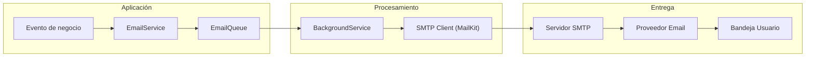
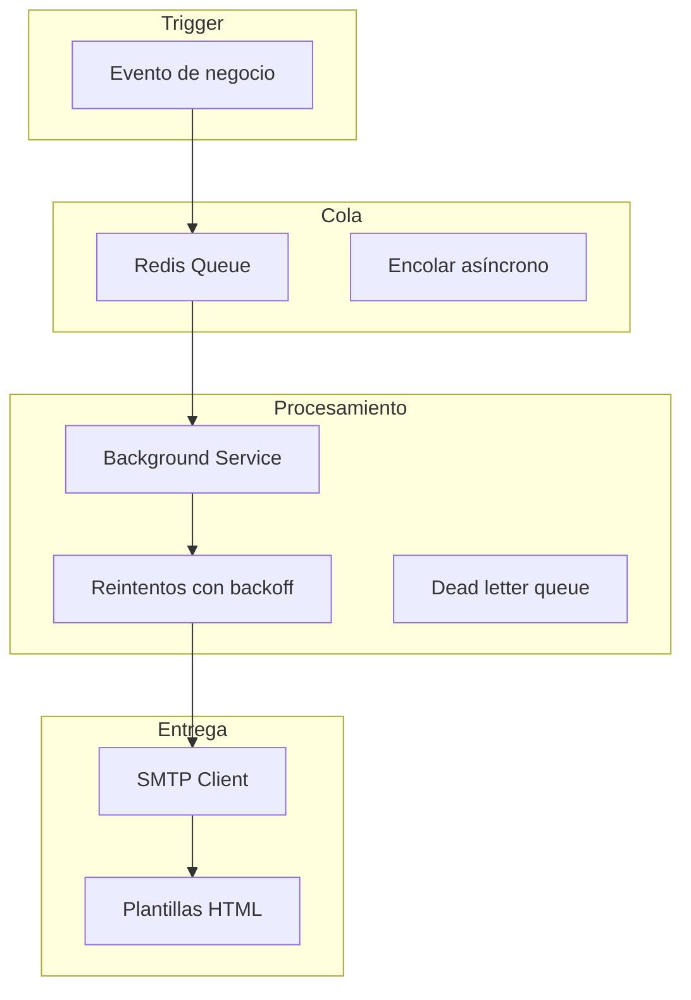
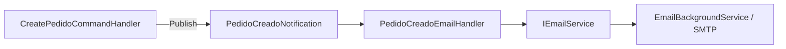

# 17. Email Services: Envío de Correos Electrónicos

## Índice

[17. Email Services: Envío de Correos Electrónicos](#17-email-services-envío-de-correos-electrónicos)
  - [17.1. ¿Por Qué un Sistema de Emails Robusto?](#171-por-qué-un-sistema-de-emails-robusto)
  - [17.2. Interfaz IEmailService](#172-interfaz-iemailservice)
  - [17.3. Implementación con MailKit](#173-implementación-con-mailkit)
  - [17.4. Servicio de Desarrollo (MemoryEmailService)](#174-servicio-de-desarrollo-memoryemailservice)
  - [17.5. Sistema de Plantillas](#175-sistema-de-plantillas)
  - [17.6. Cola de Emails con BackgroundService](#176-cola-de-emails-con-backgroundservice)
  - [17.7. Envío de Emails desde Servicios de Negocio](#177-envío-de-emails-desde-servicios-de-negocio)
  - [17.8. Configuración](#178-configuración)
  - [17.9. docker-compose para Testing de Emails](#179-docker-compose-para-testing-de-emails)
  - [17.10. Resumen y Buenas Prácticas](#1710-resumen-y-buenas-prácticas)

---

## 17.1. ¿Por Qué un Sistema de Emails Robusto?

El envío de emails es fundamental para la comunicación con usuarios: confirmaciones de pedidos, restablecimiento de contraseñas, notificaciones y marketing. Un sistema bien diseñado debe ser confiable, eficiente y fácil de probar.

### Instalación de MailKit

MailKit es la biblioteca más popular para envío de emails en .NET. Es moderna, rápida y soporta los principales protocolos de email.

```bash
# Instalación mediante .NET CLI
dotnet add package MailKit

# Instalación mediante NuGet Package Manager
Install-Package MailKit
```

### Dependencias Incluidas

MailKit incluye **MimeKit** como dependencia, que se encarga de la construcción de mensajes MIME:

```bash
# MimeKit se instala automáticamente con MailKit
dotnet add package MimeKit
```



### Casos de Uso de Emails

| Caso de Uso | Trigger | Importancia |
|-------------|---------|-------------|
| **Confirmación de pedido** | Pedido creado | Alta |
| **Restablecer contraseña** | Solicitud usuario | Crítica |
| **Notificación de envío** | Pedido enviado | Media |
| **Newsletter** | Campaña marketing | Baja |
| **Alerta de seguridad** | Login sospechoso | Alta |
| **Recibo fiscal** | Pago completado | Alta |

### Desafíos del Sistema de Emails

| Desafío | Solución |
|---------|----------|
| **Fiabilidad** | Cola asíncrona con reintentos |
| **Rendimiento** | BackgroundService no bloqueante |
| **Testing** | Servicio de memoria para tests |
| **Templates** | Sistema de plantillas HTML |
| **Cola persistente** | Redis o base de datos |

---

## 17.2. Interfaz IEmailService

```csharp
namespace TiendaApi.Core.Interfaces;

public interface IEmailService
{
    Task SendAsync(EmailMessage message, CancellationToken cancellationToken = default);
    Task SendBatchAsync(IEnumerable<EmailMessage> messages, CancellationToken cancellationToken = default);
    Task<EmailTemplate?> GetTemplateAsync(string templateName, CancellationToken cancellationToken = default);
}

public class EmailMessage
{
    public required string To { get; init; }
    public required string Subject { get; init; }
    public required string Body { get; init; }
    public bool IsHtml { get; init; } = true;
    public string? From { get; init; }
    public string? ReplyTo { get; init; }
    public List<string> Cc { get; init; } = new();
    public List<string> Bcc { get; init; } = new();
    public List<EmailAttachment> Attachments { get; init; } = new();
    public Dictionary<string, string> Headers { get; init; } = new();
}

public class EmailAttachment
{
    public required string FileName { get; init; }
    public required byte[] Content { get; init; }
    public string? ContentType { get; init; }
}

public class EmailTemplate
{
    public string Name { get; init; } = string.Empty;
    public string Subject { get; init; } = string.Empty;
    public string BodyHtml { get; init; } = string.Empty;
    public string? BodyText { get; init; }
}
```

---

## 17.3. Implementación con MailKit

### MailKitEmailService

```csharp
using MailKit.Net.Smtp;
using MailKit.Security;
using Microsoft.Extensions.Configuration;
using Microsoft.Extensions.Logging;
using MimeKit;
using MimeKit.Text;

namespace TiendaApi.Core.Services;

public class MailKitEmailService : IEmailService
{
    private readonly IConfiguration _configuration;
    private readonly ILogger<MailKitEmailService> _logger;
    private readonly ITemplateService _templateService;

    public MailKitEmailService(
        IConfiguration configuration,
        ILogger<MailKitEmailService> logger,
        ITemplateService templateService)
    {
        _configuration = configuration;
        _logger = logger;
        _templateService = templateService;
    }

    public async Task SendAsync(EmailMessage message, CancellationToken cancellationToken = default)
    {
        var smtpConfig = GetSmtpConfiguration();

        var mimeMessage = new MimeMessage
        {
            Subject = message.Subject,
            Body = new TextPart(message.IsHtml ? TextFormat.Html : TextFormat.Plain)
            {
                Text = message.Body
            }
        };

        // Configurar remitente
        mimeMessage.From.Add(new MailboxAddress(
            smtpConfig.DisplayName,
            smtpConfig.From));

        // Configurar destinatario
        mimeMessage.To.Add(new MailboxAddress("", message.To));

        // CC
        foreach (var cc in message.Cc)
        {
            mimeMessage.Cc.Add(new MailboxAddress("", cc));
        }

        // BCC
        foreach (var bcc in message.Bcc)
        {
            mimeMessage.Bcc.Add(new MailboxAddress("", bcc));
        }

        // Reply-To
        if (!string.IsNullOrEmpty(message.ReplyTo))
        {
            mimeMessage.ReplyTo.Add(new MailboxAddress("", message.ReplyTo));
        }

        // Headers personalizados
        foreach (var header in message.Headers)
        {
            mimeMessage.Headers.Add(header.Key, header.Value);
        }

        // Adjuntos
        foreach (var attachment in message.Attachments)
        {
            var memory = new MemoryStream(attachment.Content);
            mimeMessage.Attachments.Add(new MimePart(
                attachment.ContentType ?? "application/octet-stream",
                attachment.FileName)
            {
                Content = new MimeContent(memory)
            });
        }

        _logger.LogInformation(
            "Enviando email a {To} con asunto: {Subject}",
            message.To, message.Subject);

        try
        {
            using var smtpClient = new SmtpClient();

            // Conectar al servidor SMTP
            await smtpClient.ConnectAsync(
                smtpConfig.Host,
                smtpConfig.Port,
                GetSecureSocket(smtpConfig.Security),
                cancellationToken);

            // Autenticación (si está configurada)
            if (!string.IsNullOrEmpty(smtpConfig.Username))
            {
                await smtpClient.AuthenticateAsync(
                    smtpConfig.Username,
                    smtpConfig.Password,
                    cancellationToken);
            }

            // Enviar mensaje
            await smtpClient.SendAsync(mimeMessage, cancellationToken);

            // Desconectar
            await smtpClient.DisconnectAsync(true, cancellationToken);

            _logger.LogInformation(
                "Email enviado exitosamente a {To}", message.To);
        }
        catch (Exception ex)
        {
            _logger.LogError(ex,
                "Error enviando email a {To}: {Error}",
                message.To, ex.Message);
            throw;
        }
    }

    public async Task SendBatchAsync(IEnumerable<EmailMessage> messages,
        CancellationToken cancellationToken = default)
    {
        var messageList = messages.ToList();
        _logger.LogInformation(
            "Iniciando envío masivo de {Count} emails",
            messageList.Count);

        var sentCount = 0;
        var failedCount = 0;

        foreach (var message in messageList)
        {
            cancellationToken.ThrowIfCancellationRequested();

            try
            {
                await SendAsync(message, cancellationToken);
                sentCount++;
            }
            catch (Exception ex)
            {
                _logger.LogError(ex,
                    "Error enviando email batch a {To}", message.To);
                failedCount++;
            }
        }

        _logger.LogInformation(
            "Envío masivo completado. Enviados: {Sent}, Fallidos: {Failed}",
            sentCount, failedCount);
    }

    public async Task<EmailTemplate?> GetTemplateAsync(string templateName,
        CancellationToken cancellationToken = default)
    {
        return await _templateService.GetTemplateAsync(templateName, cancellationToken);
    }

    private SmtpConfiguration GetSmtpConfiguration()
    {
        return new SmtpConfiguration
        {
            Host = _configuration["Email:Smtp:Host"] ?? "localhost",
            Port = int.Parse(_configuration["Email:Smtp:Port"] ?? "25"),
            Username = _configuration["Email:Smtp:Username"],
            Password = _configuration["Email:Smtp:Password"],
            From = _configuration["Email:From"] ?? "noreply@tienda.com",
            DisplayName = _configuration["Email:DisplayName"] ?? "TiendaDAW",
            Security = _configuration["Email:Smtp:Security"] ?? "None"
        };
    }

    private static SecureSocketOptions GetSecureSocket(string security)
    {
        return security?.ToLowerInvariant() switch
        {
            "ssl" => SecureSocketOptions.SslOnConnect,
            "tls" => SecureSocketOptions.StartTls,
            "none" => SecureSocketOptions.None,
            _ => SecureSocketOptions.Auto
        };
    }

    private class SmtpConfiguration
    {
        public string Host { get; set; } = string.Empty;
        public int Port { get; set; }
        public string? Username { get; set; }
        public string? Password { get; set; }
        public string From { get; set; } = string.Empty;
        public string DisplayName { get; set; } = string.Empty;
        public string Security { get; set; } = string.Empty;
    }
}
```

---

## 17.4. Servicio de Desarrollo (MemoryEmailService)

```csharp
using Microsoft.Extensions.Logging;

namespace TiendaApi.Core.Services;

/// <summary>
/// Servicio de email que almacena los emails en memoria.
/// Útil para desarrollo y testing sin configurar SMTP.
/// </summary>
public class MemoryEmailService : IEmailService
{
    private readonly ILogger<MemoryEmailService> _logger;
    public static readonly List<EmailMessage> SentEmails = new();
    public static readonly List<FailedEmail> FailedEmails = new();

    public MemoryEmailService(ILogger<MemoryEmailService> logger)
    {
        _logger = logger;
    }

    public Task SendAsync(EmailMessage message, CancellationToken cancellationToken = default)
    {
        _logger.LogInformation(
            "[MOCK EMAIL] Para: {To}, Asunto: {Subject}",
            message.To, message.Subject);

        // Simular envío exitoso
        SentEmails.Add(message);

        _logger.LogInformation(
            "Email simulado almacenado. Total en cola: {Count}",
            SentEmails.Count);

        return Task.CompletedTask;
    }

    public Task SendBatchAsync(IEnumerable<EmailMessage> messages,
        CancellationToken cancellationToken = default)
    {
        var messageList = messages.ToList();
        SentEmails.AddRange(messageList);

        _logger.LogInformation(
            "[MOCK EMAIL] Envío masivo simulado: {Count} emails",
            messageList.Count);

        return Task.CompletedTask;
    }

    public Task<EmailTemplate?> GetTemplateAsync(string templateName,
        CancellationToken cancellationToken = default)
    {
        // Retornar plantilla mock para testing
        var template = new EmailTemplate
        {
            Name = templateName,
            Subject = $"[TEST] Plantilla {templateName}",
            BodyHtml = $"<h1>Plantilla de prueba: {templateName}</h1>"
        };

        return Task.FromResult<EmailTemplate?>(template);
    }

    public static void Clear()
    {
        SentEmails.Clear();
        FailedEmails.Clear();
    }

    public static EmailMessage? GetLastEmail(string to)
    {
        return SentEmails.LastOrDefault(e => e.To.Equals(to, StringComparison.OrdinalIgnoreCase));
    }
}

public record FailedEmail
{
    public required EmailMessage Message { get; init; }
    public required Exception Exception { get; init; }
    public DateTime FailedAt { get; init; } = DateTime.UtcNow;
}
```

---

## 17.5. Sistema de Plantillas

### ITemplateService e Implementación

```csharp
using System.Text.RegularExpressions;

namespace TiendaApi.Core.Interfaces;

public interface ITemplateService
{
    Task<EmailTemplate?> GetTemplateAsync(string templateName, CancellationToken cancellationToken = default);
    string Render(string templateName, Dictionary<string, object> data);
}

public class TemplateService : ITemplateService
{
    private readonly Dictionary<string, EmailTemplate> _templates;
    private readonly ILogger<TemplateService> _logger;
    private readonly IWebHostEnvironment _environment;

    public TemplateService(
        IWebHostEnvironment environment,
        ILogger<TemplateService> logger)
    {
        _environment = environment;
        _logger = logger;
        _templates = LoadTemplates();
    }

    private Dictionary<string, EmailTemplate> LoadTemplates()
    {
        var templatesPath = Path.Combine(_environment.ContentRootPath, "Templates", "Emails");
        
        if (!Directory.Exists(templatesPath))
        {
            _logger.LogWarning("Directorio de plantillas no encontrado: {Path}", templatesPath);
            return new Dictionary<string, EmailTemplate>();
        }

        var templates = new Dictionary<string, EmailTemplate>(StringComparer.OrdinalIgnoreCase);

        foreach (var templateDir in Directory.GetDirectories(templatesPath))
        {
            var templateName = Path.GetFileName(templateDir);
            
            var subjectFile = Path.Combine(templateDir, "subject.txt");
            var htmlFile = Path.Combine(templateDir, "body.html");
            var textFile = Path.Combine(templateDir, "body.txt");

            if (File.Exists(subjectFile) && File.Exists(htmlFile))
            {
                templates[templateName] = new EmailTemplate
                {
                    Name = templateName,
                    Subject = File.ReadAllText(subjectFile).Trim(),
                    BodyHtml = File.ReadAllText(htmlFile),
                    BodyText = File.Exists(textFile) ? File.ReadAllText(textFile) : null
                };
            }
        }

        _logger.LogInformation("Cargadas {Count} plantillas de email", templates.Count);
        return templates;
    }

    public Task<EmailTemplate?> GetTemplateAsync(string templateName, CancellationToken cancellationToken = default)
    {
        return Task.FromResult(
            _templates.TryGetValue(templateName, out var template) 
                ? template 
                : null);
    }

    public string Render(string templateName, Dictionary<string, object> data)
    {
        if (!_templates.TryGetValue(templateName, out var template))
        {
            throw new KeyNotFoundException($"Plantilla '{templateName}' no encontrada");
        }

        var content = template.BodyHtml;

        foreach (var kvp in data)
        {
            content = content.Replace($"{{{{{kvp.Key}}}}}", kvp.Value.ToString());
        }

        return content;
    }
}
```

### Plantillas de Ejemplo

```
Templates/Emails/
├── pedido-confirmado/
│   ├── subject.txt
│   ├── body.html
│   └── body.txt
├── pedido-enviado/
│   ├── subject.txt
│   └── body.html
├── password-reset/
│   ├── subject.txt
│   └── body.html
└── bienvenido/
    ├── subject.txt
    └── body.html
```

#### ejemplo: pedido-confirmado/body.html

```html
<!DOCTYPE html>
<html>
<head>
    <meta charset="utf-8">
    <style>
        body { font-family: Arial, sans-serif; line-height: 1.6; color: #333; }
        .container { max-width: 600px; margin: 0 auto; padding: 20px; }
        .header { background: #007bff; color: white; padding: 20px; text-align: center; }
        .content { padding: 20px; background: #f8f9fa; }
        .pedido-info { background: white; padding: 15px; margin: 15px 0; border-radius: 5px; }
        .footer { text-align: center; padding: 20px; color: #666; font-size: 12px; }
        .button { display: inline-block; padding: 10px 20px; background: #007bff; color: white; text-decoration: none; border-radius: 5px; }
    </style>
</head>
<body>
    <div class="container">
        <div class="header">
            <h1>✅ Pedido Confirmado</h1>
        </div>
        <div class="content">
            <p>Hola {{Nombre}},</p>
            <p>Tu pedido ha sido confirmado correctamente. Aquí están los detalles:</p>
            
            <div class="pedido-info">
                <h3>📦 Pedido #{{PedidoId}}</h3>
                <p><strong>Fecha:</strong> {{FechaPedido}}</p>
                <p><strong>Total:</strong> {{Total}}</p>
                <p><strong>Estado:</strong> {{Estado}}</p>
            </div>
            
            <h4>📋 Productos:</h4>
            <table style="width: 100%; border-collapse: collapse;">
                <thead>
                    <tr style="background: #007bff; color: white;">
                        <th style="padding: 10px; text-align: left;">Producto</th>
                        <th style="padding: 10px; text-align: center;">Cantidad</th>
                        <th style="padding: 10px; text-align: right;">Precio</th>
                    </tr>
                </thead>
                <tbody>
                    {{#Items}}
                    <tr style="border-bottom: 1px solid #ddd;">
                        <td style="padding: 10px;">{{Nombre}}</td>
                        <td style="padding: 10px; text-align: center;">{{Cantidad}}</td>
                        <td style="padding: 10px; text-align: right;">{{Precio}}</td>
                    </tr>
                    {{/Items}}
                </tbody>
            </table>
            
            <p style="text-align: center; margin-top: 30px;">
                <a href="{{UrlPedido}}" class="button">Ver Pedido</a>
            </p>
        </div>
        <div class="footer">
            <p>Gracias por comprar en {{NombreTienda}}</p>
            <p>{{DireccionTienda}}</p>
        </div>
    </div>
</body>
</html>
```

#### ejemplo: pedido-confirmado/subject.txt

Tu pedido #{{PedidoId}} ha sido confirmado - {{NombreTienda}}

---

## 17.6. Cola de Emails con BackgroundService

### Cola Persistente con Redis

```csharp
using StackExchange.Redis;
using System.Text.Json;

namespace TiendaApi.Core.Services;

public interface IEmailQueue
{
    Task EnqueueAsync(EmailMessage message, CancellationToken cancellationToken = default);
    Task<EmailMessage?> DequeueAsync(CancellationToken cancellationToken = default);
    Task<int> GetQueueLengthAsync(CancellationToken cancellationToken = default);
}

public class RedisEmailQueue : IEmailQueue
{
    private readonly IConnectionMultiplexer _redis;
    private readonly ILogger<RedisEmailQueue> _logger;
    private readonly string _queueKey = "email:queue";

    public RedisEmailQueue(
        IConnectionMultiplexer redis,
        ILogger<RedisEmailQueue> logger)
    {
        _redis = redis;
        _logger = logger;
    }

    public async Task EnqueueAsync(EmailMessage message, CancellationToken cancellationToken = default)
    {
        var db = _redis.GetDatabase();
       Serializer.Serialize(message);
 var json = Json        
        await db.ListRightPushAsync(_queueKey, json);
        
        _logger.LogDebug("Email encolado para {To}", message.To);
    }

    public async Task<EmailMessage?> DequeueAsync(CancellationToken cancellationToken = default)
    {
        var db = _redis.GetDatabase();
        var json = await db.ListLeftPopAsync(_queueKey);

        if (json.IsNullOrEmpty)
        {
            return null;
        }

        return JsonSerializer.Deserialize<EmailMessage>(json!);
    }

    public async Task<int> GetQueueLengthAsync(CancellationToken cancellationToken = default)
    {
        var db = _redis.GetDatabase();
        return (int)await db.ListLengthAsync(_queueKey);
    }
}
```

### EmailBackgroundService

```csharp
using Microsoft.Extensions.Hosting;
using Microsoft.Extensions.Logging;

namespace TiendaApi.Core.Services;

public class EmailBackgroundService : BackgroundService
{
    private readonly IEmailQueue _queue;
    private readonly IEmailService _emailService;
    private readonly ILogger<EmailBackgroundService> _logger;
    private readonly TimeSpan _retryDelay = TimeSpan.FromSeconds(30);
    private readonly int _maxRetries = 3;

    public EmailBackgroundService(
        IEmailQueue queue,
        IEmailService emailService,
        ILogger<EmailBackgroundService> logger)
    {
        _queue = queue;
        _emailService = emailService;
        _logger = logger;
    }

    protected override async Task ExecuteAsync(CancellationToken stoppingToken)
    {
        _logger.LogInformation("Email Background Service iniciado");

        while (!stoppingToken.IsCancellationRequested)
        {
            try
            {
                var message = await _queue.DequeueAsync(stoppingToken);
                
                if (message == null)
                {
                    // No hay mensajes, esperar antes de reintentar
                    await Task.Delay(TimeSpan.FromSeconds(5), stoppingToken);
                    continue;
                }

                await ProcessMessageAsync(message, stoppingToken);
            }
            catch (OperationCanceledException) when (stoppingToken.IsCancellationRequested)
            {
                // shutdown normal
                break;
            }
            catch (Exception ex)
            {
                _logger.LogError(ex, "Error en Email Background Service");
                await Task.Delay(TimeSpan.FromSeconds(10), stoppingToken);
            }
        }

        _logger.LogInformation("Email Background Service detenido");
    }

    private async Task ProcessMessageAsync(EmailMessage message, CancellationToken cancellationToken)
    {
        var attempts = 0;
        var success = false;

        while (attempts < _maxRetries && !success)
        {
            try
            {
                attempts++;
                
                _logger.LogInformation(
                    "Procesando email para {To} (intento {Attempt}/{MaxRetries})",
                    message.To, attempts, _maxRetries);

                await _emailService.SendAsync(message, cancellationToken);
                
                success = true;
                _logger.LogInformation(
                    "Email enviado exitosamente a {To}", message.To);
            }
            catch (Exception ex)
            {
                _logger.LogWarning(ex,
                    "Error enviando email a {To} (intento {Attempt})",
                    message.To, attempts);

                if (attempts < _maxRetries)
                {
                    await Task.Delay(_retryDelay * attempts, cancellationToken);
                }
            }
        }

        if (!success)
        {
            _logger.LogError(
                "Fallo definitivo enviando email a {To} después de {MaxRetries} intentos",
                message.To, _maxRetries);
            
            // Aquí podríamos mover a una cola de dead-letter
            await HandleFailedMessageAsync(message, cancellationToken);
        }
    }

    private async Task HandleFailedMessageAsync(EmailMessage message, CancellationToken cancellationToken)
    {
        // Guardar en cola de mensajes fallidos para revisión manual
        // Podría usar Redis con clave "email:failed"
        _logger.LogError(
            "Email para {To} movido a cola de fallidos. Asunto: {Subject}",
            message.To, message.Subject);
    }
}
```

---

## 17.7. Envío de Emails desde Servicios de Negocio

### PedidoService con Notificaciones por Email

```csharp
using TiendaApi.Core.Interfaces;

namespace TiendaApi.Core.Services;

public class PedidoService
{
    private readonly IPedidoRepository _pedidoRepository;
    private readonly IEmailQueue _emailQueue;
    private readonly ITemplateService _templateService;
    private readonly ILogger<PedidoService> _logger;

    public PedidoService(
        IPedidoRepository pedidoRepository,
        IEmailQueue emailQueue,
        ITemplateService templateService,
        ILogger<PedidoService> logger)
    {
        _pedidoRepository = pedidoRepository;
        _emailQueue = emailQueue;
        _templateService = templateService;
        _logger = logger;
    }

    public async Task<Result<Pedido, Error>> CreatePedidoAsync(CreatePedidoRequest request)
    {
        // ... lógica de creación de pedido ...

        var pedido = new Pedido { /* ... */ };
        var result = await _pedidoRepository.AddAsync(pedido);

        if (result.IsSuccess)
        {
            // Encolar email de confirmación
            await EnviarConfirmacionPedidoAsync(pedido, request.UsuarioId);
        }

        return result;
    }

    private async Task EnviarConfirmacionPedidoAsync(Pedido pedido, long usuarioId)
    {
        try
        {
            var template = await _templateService.GetTemplateAsync("pedido-confirmado");
            
            if (template == null)
            {
                _logger.LogWarning("Plantilla pedido-confirmado no encontrada");
                return;
            }

            var usuario = await GetUsuarioAsync(usuarioId);
            
            var emailMessage = new EmailMessage
            {
                To = usuario.Email,
                Subject = template.Subject,
                Body = template.BodyHtml,
                IsHtml = true
            };

            await _emailQueue.EnqueueAsync(emailMessage);
            
            _logger.LogInformation(
                "Email de confirmación encolado para pedido {PedidoId}",
                pedido.Id);
        }
        catch (Exception ex)
        {
            _logger.LogError(ex,
                "Error encolando email de confirmación para pedido {PedidoId}",
                pedido.Id);
            // No lanzar - el email no debe fallar la creación del pedido
        }
    }

    private async Task<Usuario> GetUsuarioAsync(long usuarioId)
    {
        // Implementar obtención de usuario
        return new Usuario { Email = "cliente@ejemplo.com", Nombre = "Cliente" };
    }
}
```

---

## 17.8. Configuración

### appsettings.json

```json
{
  "Email": {
    "Smtp": {
      "Host": "smtp.gmail.com",
      "Port": 587,
      "Username": "tu-cuenta@gmail.com",
      "Password": "tu-app-password",
      "Security": "tls"
    },
    "From": "noreply@tienda.com",
    "DisplayName": "TiendaDAW"
  },
  
  "EmailQueue": {
    "RedisConnection": "localhost:6379"
  }
}
```

### Configuración de Desarrollo (User Secrets)

```json
{
  "Email": {
    "Smtp": {
      "Host": "localhost",
      "Port": 1025,
      "Username": "",
      "Password": "",
      "Security": "none"
    },
    "From": "test@localhost",
    "DisplayName": "Test Email"
  }
}
```

---

## 17.9. docker-compose para Testing de Emails

```yaml
version: '3.8'

services:
  maildev:
    image: maildev/maildev
    ports:
      - "1080:1080"  # Web UI
      - "1025:1025"  # SMTP
    environment:
      - MAILDEV_SMTP_PORT=1025
      - MAILDEV_WEB_PORT=1080
```

---

## 17.10. Resumen y Buenas Prácticas

### Arquitectura de Emails



### Checklist de Buenas Prácticas

| Práctica | Descripción | Importancia |
|----------|-------------|-------------|
| **Cola asíncrona** | No bloquear requests | Alta |
| **Reintentos** | Manejar fallos temporales | Alta |
| **Templates HTML** | Facilitar mantenimiento | Media |
| **Testing service** | MemoryEmailService para tests | Alta |
| **Logs** | Auditar envíos | Media |
| **Unsubscribe** | Link de cancelación | Legal |
| **DKIM/SPF** | Autenticación de email | Alta |

### Siguientes Pasos

Con emails dominados, el siguiente paso es aprender sobre REST best practices.

### Recursos Adicionales

- MailKit: https://github.com/jstedfast/MailKit
- MimeKit: https://github.com/jstedfast/MimeKit
- Email Background Service: https://learn.microsoft.com/dotnet/core/extensions/background-service-pattern

## 17.11. EmailService como INotificationHandler

Con CQRS + MediatR el `EmailService` ya no necesita ser llamado directamente desde cada caso de uso. Ahora los commands publican eventos de dominio y un `INotificationHandler` decide si debe encolar un correo.



Ventajas:

- El handler principal no conoce SMTP ni plantillas HTML.
- Se pueden añadir más emails sin tocar el command.
- Los tests verifican publicación de eventos en lugar de acoplarse al envío real.
