# 17. JWT Authentication

## Indice

[17. JWT Authentication](#17-jwt-authentication)
  - [17.1. Concepto de Autenticacion Stateless](#171-concepto-de-autenticacion-stateless)
  - [17.2. JWT en Profundidad](#172-jwt-en-profundidad)
  - [17.3. ASP.NET Core Identity](#173-aspnet-core-identity)
  - [17.4. Configuracion de Identity en Program.cs](#174-configuracion-de-identity-en-programcs)
  - [17.5. Custom UserClaimsPrincipalFactory](#175-custom-userclaimsprincipalfactory)
  - [17.6. JwtService - Generacion de Tokens](#176-jwtservice---generacion-de-tokens)
  - [17.7. Errores de Autenticacion](#177-errores-de-autenticacion)
  - [17.8. AuthController - Endpoints de Autenticacion](#178-authcontroller---endpoints-de-autenticacion)
  - [17.9. DTOs de Autenticacion](#179-dtos-de-autenticacion)
  - [17.10. Configuracion de appsettings.json](#1710-configuracion-de-appsettingsjson)
  - [17.11. Resumen y Buenas Practicas](#1711-resumen-y-buenas-practicas)
  - [17.12. Enfoque Personalizado - Nuestra Implementacion](#1712-enfoque-personalizado---nuestra-implementacion)
  - [17.13. Comparacion del Middleware](#1713-comparacion-del-middleware)

---


## 17.1. Concepto de Autenticación Stateless

### ¿Qué significa Stateless (Sin Estado)?

En una arquitectura **stateful** (con estado), el servidor mantiene información de sesión del usuario. Esto requiere:
- Almacenamiento de sesión en servidor (memoria, base de datos)
- affinity/session stickiness en load balancers
- El servidor "recuerda" al usuario entre requests

En una arquitectura **stateless** (sin estado):
- Cada request contiene toda la información necesaria
- No hay sesión en el servidor
- El servidor no almacena información del usuario
- Escalabilidad horizontal simple (cualquier servidor puede atender cualquier request)

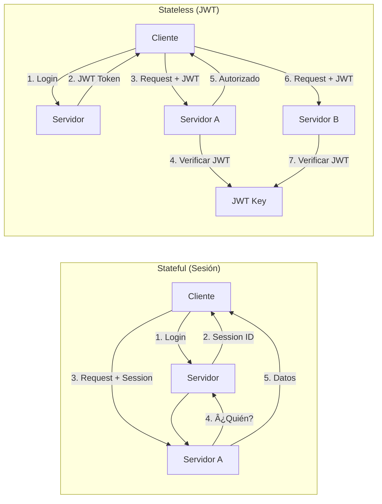

### ¿Por qué Stateless para APIs?

| Aspecto | Stateful | Stateless |
|---------|----------|-----------|
| **Escalabilidad** | Difícil (requiere sticky sessions) | Fácil (cualquier servidor) |
| **Almacenamiento** | Sesiones en servidor | Token en cliente |
| **Rendimiento** | Lookup de sesión | Verificación de firma |
| **Simplicidad** | Gestión de sesiones | JWT auto-contenido |
| **Mobile/API** | Incompatible | Ideal |

---

## 17.2. JWT (JSON Web Token) en Profundidad

### Estructura del JWT

Un JWT está compuesto por tres partes separadas por puntos:

```
HEADER.PAYLOAD.SIGNATURE
```

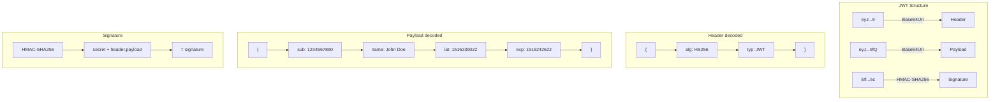

### Header

```json
{
  "alg": "HS256",
  "typ": "JWT"
}
```

| Campo | Descripción |
|-------|-------------|
| `alg` | Algoritmo de firma (HS256, RS256, ES256) |
| `typ` | Tipo de token (siempre "JWT") |

### Payload (Claims)

El payload contiene los **claims** (reclamaciones) sobre la entidad:

```json
{
  "sub": "1234567890",        // Subject (identificador del usuario)
  "name": "John Doe",         // Claim personalizada
  "email": "john@example.com", // Claim personalizada
  "roles": ["Admin", "User"], // Claim de roles
  "iat": 1516239022,          // Issued At (timestamp)
  "exp": 1516242622,          // Expiration Time (timestamp)
  "iss": "TiendaApi",         // Issuer (quién emite)
  "aud": "TiendaApiClients"   // Audience (para quién es)
}
```

#### Claims Registrados (Standard)

| Claim | Significado |
|-------|-------------|
| `sub` | Subject (identificador principal) |
| `iss` | Issuer (quién emite) |
| `aud` | Audience (para quién) |
| `exp` | Expiration Time |
| `nbf` | Not Before |
| `iat` | Issued At |
| `jti` | JWT ID (identificador único) |

### Signature (Firma)

La firma asegura que el token no ha sido modificado:

```csharp
// HS256 (HMAC con SHA-256)
var key = new SymmetricSecurityKey(Encoding.UTF8.GetBytes("secret"));
var creds = new SigningCredentials(key, SecurityAlgorithms.HmacSha256);

var token = new JwtSecurityToken(
        issuer: "TiendaApi",
        audience: "TiendaApiClients",
        claims: userClaims,
        expires: DateTime.UtcNow.AddMinutes(15),
        signingCredentials: creds
    );
```

> **Nota sobre algoritmos de firma:** Nuestro proyecto usa **HS256** (HMAC-SHA256) por su buen balance entre seguridad y rendimiento. La clave JWT de 94 caracteres excede ampliamente el mínimo requerido (32 bytes para HS256, 64 bytes para HS512). Para entornos con requisitos de cumplimiento normativo más estrictos (PCI-DSS, HIPAA), se podría cambiar a **HS512** (HMAC-SHA512) que ofrece fuerza criptográfica superior (2^512 vs 2^256), aunque la diferencia práctica con la tecnología actual es teórica (ambos son computacionalmente imposibles de romper).

---

## 17.3. ASP.NET Core Identity

### ¿Qué es ASP.NET Core Identity?

ASP.NET Core Identity es un sistema de membership que permite:
- Registrar/iniciar sesión de usuarios
- Almacenar usuarios en base de datos
- Gestionar passwords (hash, complejidad)
- Roles y autorización
- Confirmación de email
- Two-Factor Authentication
- External logins (Google, Facebook, etc.)

### Entity Framework Core con Identity

```csharp
using Microsoft.AspNetCore.Identity;
using Microsoft.AspNetCore.Identity.EntityFrameworkCore;
using Microsoft.EntityFrameworkCore;

namespace TiendaApi.Core.Models;

/// <summary>
/// Usuario personalizado que hereda de IdentityUser
/// </summary>
public class User : IdentityUser<long>
{
    /// <summary>
    /// Nombre del usuario
    /// </summary>
    [PersonalData]
    public string? FirstName { get; set; }

    /// <summary>
    /// Apellido del usuario
    /// </summary>
    [PersonalData]
    public string? LastName { get; set; }

    /// <summary>
    /// Fecha de registro
    /// </summary>
    public DateTime CreatedAt { get; set; } = DateTime.UtcNow;

    /// <summary>
    /// ášltimo login
    /// </summary>
    public DateTime? LastLoginAt { get; set; }

    /// <summary>
    /// Indica si está activo
    /// </summary>
    public bool IsActive { get; set; } = true;

    /// <summary>
    /// Refresh token actual
    /// </summary>
    public string? RefreshToken { get; set; }

    /// <summary>
    /// Expiración del refresh token
    /// </summary>
    public DateTime? RefreshTokenExpiry { get; set; }

    /// <summary>
    /// Claims adicionales del usuario
    /// </summary>
    public virtual ICollection<UserClaim> Claims { get; set; } = new List<UserClaim>();

    /// <summary>
    /// Roles del usuario
    /// </summary>
    public virtual ICollection<UserRole> Roles { get; set; } = new List<UserRole>();

    /// <summary>
    /// Logins externos (Google, Facebook, etc.)
    /// </summary>
    public virtual ICollection<UserLogin> Logins { get; set; } = new List<UserLogin>();

    /// <summary>
    /// Tokens de recuperación
    /// </summary>
    public virtual ICollection<UserToken> Tokens { get; set; } = new List<UserToken>();
}

/// <summary>
/// Rol personalizado
/// </summary>
public class Role : IdentityRole<long>
{
    /// <summary>
    /// Descripción del rol
    /// </summary>
    public string? Description { get; set; }

    /// <summary>
    /// Claims del rol
    /// </summary>
    public virtual ICollection<RoleClaim> Claims { get; set; } = new List<RoleClaim>();
}

/// <summary>
/// DbContext que combina Identity con el resto del modelo
/// </summary>
public class TiendaDbContext : IdentityDbContext<User, Role, long>
{
    public TiendaDbContext(DbContextOptions<TiendaDbContext> options)
        : base(options)
    {
    }

    public DbSet<Producto> Productos { get; set; } = null!;
    public DbSet<Categoria> Categorias { get; set; } = null!;
    public DbSet<Pedido> Pedidos { get; set; } = null!;

    protected override void OnModelCreating(ModelBuilder modelBuilder)
    {
        base.OnModelCreating(modelBuilder);

        // Configuración de tablas
        modelBuilder.Entity<User>().ToTable("users");
        modelBuilder.Entity<Role>().ToTable("roles");
        modelBuilder.Entity<IdentityUserClaim<long>>().ToTable("user_claims");
        modelBuilder.Entity<IdentityUserRole<long>>().ToTable("user_roles");
        modelBuilder.Entity<IdentityUserLogin<long>>().ToTable("user_logins");
        modelBuilder.Entity<IdentityUserToken<long>>().ToTable("user_tokens");
        modelBuilder.Entity<IdentityRoleClaim<long>>().ToTable("role_claims");

        // Índices
        modelBuilder.Entity<User>()
            .HasIndex(u => u.NormalizedEmail)
            .HasDatabaseName("IX_Users_Email");

        modelBuilder.Entity<User>()
            .HasIndex(u => u.NormalizedUserName)
            .HasDatabaseName("IX_Users_Username");

        // Configuración de Producto
        modelBuilder.Entity<Producto>(entity =>
        {
            entity.HasKey(p => p.Id);
            entity.Property(p => p.Nombre).IsRequired().HasMaxLength(200);
            entity.Property(p => p.Precio).HasColumnType("decimal(18,2)");
            
            entity.HasOne(p => p.Categoria)
                .WithMany(c => c.Productos)
                .HasForeignKey(p => p.CategoriaId)
                .OnDelete(DeleteBehavior.Restrict);
        });

        // Configuración de Categoria
        modelBuilder.Entity<Categoria>(entity =>
        {
            entity.HasKey(c => c.Id);
            entity.Property(c => c.Nombre).IsRequired().HasMaxLength(100);
        });
    }
}
```

---

## 17.4. Configuración de Identity en Program.cs

```csharp
using Microsoft.AspNetCore.Authentication.JwtBearer;
using Microsoft.AspNetCore.Identity;
using Microsoft.EntityFrameworkCore;
using Microsoft.IdentityModel.Tokens;
using System.Text;

var builder = WebApplication.CreateBuilder(args);

// 1. Configuración de base de datos
var connectionString = builder.Configuration.GetConnectionString("PostgreSQL");
builder.Services.AddDbContext<TiendaDbContext>(options =>
    options.UseNpgsql(connectionString));

// 2. Configuración de Identity
builder.Services.AddIdentity<User, Role>(options =>
{
    // Configuración de Password
    options.Password.RequireDigit = true;
    options.Password.RequireLowercase = true;
    options.Password.RequireUppercase = true;
    options.Password.RequireNonAlphanumeric = false;
    options.Password.RequiredLength = 8;
    options.Password.MaxLength = 100;

    // Configuración de Usuario
    options.User.RequireUniqueEmail = true;
    options.User.AllowedUserNameCharacters = 
        "abcdefghijklmnopqrstuvwxyzABCDEFGHIJKLMNOPQRSTUVWXYZ0123456789-._@+";

    // Configuración de Lockout
    options.Lockout.DefaultLockoutTimeSpan = TimeSpan.FromMinutes(15);
    options.Lockout.MaxFailedAccessAttempts = 5;
    options.Lockout.AllowedForNewUsers = true;

    // Configuración de SignIn
    options.SignIn.RequireConfirmedEmail = false; // Activar para producción
    options.SignIn.RequireConfirmedAccount = false;
    options.SignIn.RequireConfirmedPhoneNumber = false;

    // Configuración de Tokens
    options.Tokens.AuthenticatorTokenProvider = TokenOptions.DefaultAuthenticatorProvider;
    options.Tokens.ChangeEmailTokenProvider = TokenOptions.DefaultEmailProvider;
    options.Tokens.PasswordResetTokenProvider = TokenOptions.DefaultProvider;
})
.AddEntityFrameworkStores<TiendaDbContext>()
.AddDefaultTokenProviders()
.AddErrorDescriber<SpanishIdentityErrorDescriber>();

// 3. Configuración de JWT
var jwtSettings = builder.Configuration.GetSection("Jwt");
var secretKey = jwtSettings["Secret"] ?? throw new InvalidOperationException("JWT Secret requerido");

builder.Services.AddAuthentication(options =>
{
    options.DefaultAuthenticateScheme = JwtBearerDefaults.AuthenticationScheme;
    options.DefaultChallengeScheme = JwtBearerDefaults.AuthenticationScheme;
    options.DefaultScheme = JwtBearerDefaults.AuthenticationScheme;
})
.AddJwtBearer(options =>
{
    options.TokenValidationParameters = new TokenValidationParameters
    {
        // Validación del issuer
        ValidateIssuer = true,
        ValidIssuer = jwtSettings["Issuer"],

        // Validación del audience
        ValidateAudience = true,
        ValidAudience = jwtSettings["Audience"],

        // Validación de la clave de firma
        ValidateIssuerSigningKey = true,
        IssuerSigningKey = new SymmetricSecurityKey(
            Encoding.UTF8.GetBytes(secretKey)),

        // Validación de expiración
        ValidateLifetime = true,
        ClockSkew = TimeSpan.Zero, // Sin tolerancia - exactamente a la hora de expiración

        // Validación de claims
        RoleClaimType = "http://schemas.microsoft.com/ws/2008/06/identity/claims/role",
        NameClaimType = "http://schemas.xmlsoap.org/ws/2005/05/identity/claims/name"
    };

    // Configuración de eventos
    options.Events = new JwtBearerEvents
    {
        OnMessageReceived = context =>
        {
            // Extraer token del header Authorization: Bearer <token>
            var token = context.Request.Headers["Authorization"]
                .FirstOrDefault(x => x.StartsWith("Bearer "));
            
            if (!string.IsNullOrEmpty(token))
            {
                context.Token = token.Substring("Bearer ".Length);
            }

            return Task.CompletedTask;
        },

        OnTokenValidated = context =>
        {
            // Se ejecuta después de validar el token
            var logger = context.HttpContext.RequestServices
                .GetRequiredService<ILogger<Program>>();
            logger.LogInformation("Token validado exitosamente");
            return Task.CompletedTask;
        },

        OnAuthenticationFailed = context =>
        {
            var logger = context.HttpContext.RequestServices
                .GetRequiredService<ILogger<Program>>();
            logger.LogWarning("Fallo de autenticación: {Message}", context.Exception.Message);
            return Task.CompletedTask;
        },

        OnForbidden = context =>
        {
            var logger = context.HttpContext.RequestServices
                .GetRequiredService<ILogger<Program>>();
            logger.LogWarning("Acceso prohibido para: {Path}", context.Request.Path);
            return Task.CompletedTask;
        }
    };
});

// 4. Autorización
builder.Services.AddAuthorization();

// 5. Servicios de JWT
builder.Services.AddScoped<JwtService>();
builder.Services.AddScoped<RefreshTokenService>();

// 6. Registro de UserClaimsPrincipalFactory personalizado
builder.Services.AddScoped<IUserClaimsPrincipalFactory<User>, 
    CustomUserClaimsPrincipalFactory>();

var app = builder.Build();

// 7. Configuración de pipeline
app.UseAuthentication();
app.UseAuthorization();

// 8. Inicializar base de datos con roles
using (var scope = app.Services.CreateScope())
{
    var roleManager = scope.ServiceProvider.GetRequiredService<RoleManager<Role>>();
    var userManager = scope.ServiceProvider.GetRequiredService<UserManager<User>>();

    await InitializeRolesAndAdminAsync(roleManager, userManager);
}

app.Run();

async Task InitializeRolesAndAdminAsync(
    RoleManager<Role> roleManager, 
    UserManager<User> userManager)
{
    // Crear roles si no existen
    var roles = new[] { "Admin", "Manager", "User" };
    foreach (var role in roles)
    {
        if (!await roleManager.RoleExistsAsync(role))
        {
            var newRole = new Role
            {
                Name = role,
                Description = $"Rol de {role}"
            };
            await roleManager.CreateAsync(newRole);
        }
    }

    // Crear usuario admin si no existe
    const string adminEmail = "admin@tienda.com";
    const string adminPassword = "Admin123!";
    
    var adminUser = await userManager.FindByEmailAsync(adminEmail);
    if (adminUser == null)
    {
        var user = new User
        {
            Email = adminEmail,
            UserName = adminEmail,
            FirstName = "Administrador",
            LastName = "Sistema",
            CreatedAt = DateTime.UtcNow,
            IsActive = true
        };

        var result = await userManager.CreateAsync(user, adminPassword);
        if (result.Succeeded)
        {
            await userManager.AddToRoleAsync(user, "Admin");
            Console.WriteLine($"Usuario admin creado: {adminEmail}");
        }
        else
        {
            Console.WriteLine($"Error creando admin: {string.Join(", ", result.Errors.Select(e => e.Description))}");
        }
    }
}
```

---

## 17.5. Custom UserClaimsPrincipalFactory

```csharp
using Microsoft.AspNetCore.Identity;
using Microsoft.Extensions.Options;
using System.Security.Claims;
using TiendaApi.Core.Models;

namespace TiendaApi.Core.Services;

/// <summary>
/// Genera ClaimsPrincipal con claims personalizados basados en el usuario
/// </summary>
public class CustomUserClaimsPrincipalFactory : 
    UserClaimsPrincipalFactory<User, Role>
{
    public CustomUserClaimsPrincipalFactory(
        UserManager<User> userManager,
        RoleManager<Role> roleManager,
        IOptions<IdentityOptions> optionsAccessor)
        : base(userManager, roleManager, optionsAccessor)
    {
    }

    protected override async Task<ClaimsIdentity> GenerateClaimsAsync(User user)
    {
        var identity = await base.GenerateClaimsAsync(user);

        // Añadir claims personalizados
        identity.AddClaim(new Claim("displayName", 
            $"{user.FirstName} {user.LastName}".Trim()));
        
        identity.AddClaim(new Claim("userId", user.Id.ToString()));
        identity.AddClaim(new Claim("email", user.Email ?? ""));
        identity.AddClaim(new Claim("createdAt", 
            user.CreatedAt.ToString("O", CultureInfo.InvariantCulture)));
        
        // Claim para indicar si el email está confirmado
        if (user.EmailConfirmed)
        {
            identity.AddClaim(new Claim("emailVerified", "true", 
                ClaimValueTypes.Boolean));
        }

        // Claim para estado de la cuenta
        identity.AddClaim(new Claim("isActive", user.IsActive.ToString(), 
            ClaimValueTypes.Boolean));

        return identity;
    }
}
```

---

## 17.6. JwtService - Generación de Tokens

```csharp
using System.IdentityModel.Tokens.Jwt;
using System.Security.Claims;
using System.Security.Cryptography;
using System.Text;
using Microsoft.AspNetCore.Identity;
using Microsoft.IdentityModel.Tokens;
using TiendaApi.Core.Models;

namespace TiendaApi.Core.Services;

/// <summary>
/// Servicio para generación y validación de JWT tokens
/// </summary>
public class JwtService
{
    private readonly UserManager<User> _userManager;
    private readonly IConfiguration _configuration;
    private readonly ILogger<JwtService> _logger;

    private readonly string _secretKey;
    private readonly string _issuer;
    private readonly string _audience;
    private readonly int _accessTokenExpiryMinutes;
    private readonly int _refreshTokenExpiryDays;

    public JwtService(
        UserManager<User> userManager,
        IConfiguration configuration,
        ILogger<JwtService> logger)
    {
        _userManager = userManager;
        _configuration = configuration;
        _logger = logger;

        // Configuración desde appsettings.json
        var jwtSection = configuration.GetSection("Jwt");
        _secretKey = jwtSection["Secret"] ?? 
            throw new InvalidOperationException("JWT Secret no configurado");
        _issuer = jwtSection["Issuer"] ?? "TiendaApi";
        _audience = jwtSection["Audience"] ?? "TiendaApiClients";
        _accessTokenExpiryMinutes = jwtSection.GetValue<int>("AccessTokenExpiryMinutes", 15);
        _refreshTokenExpiryDays = jwtSection.GetValue<int>("RefreshTokenExpiryDays", 7);
    }

    /// <summary>
    /// Genera access token y refresh token para un usuario
    /// </summary>
    public async Task<TokenResponse> GenerateTokensAsync(User user)
    {
        // Obtener roles del usuario
        var roles = await _userManager.GetRolesAsync(user);
        
        // Generar access token
        var accessToken = GenerateAccessToken(user, roles);
        
        // Generar refresh token
        var refreshToken = GenerateRefreshToken();
        
        // Guardar refresh token en base de datos
        user.RefreshToken = refreshToken;
        user.RefreshTokenExpiry = DateTime.UtcNow.AddDays(_refreshTokenExpiryDays);
        
        var updateResult = await _userManager.UpdateAsync(user);
        if (!updateResult.Succeeded)
        {
            _logger.LogWarning("Error guardando refresh token: {Errors}", 
                string.Join(", ", updateResult.Errors.Select(e => e.Description)));
        }

        _logger.LogInformation("Tokens generados para usuario: {UserId}", user.Id);

        return new TokenResponse
        {
            AccessToken = accessToken,
            RefreshToken = refreshToken,
            TokenType = "Bearer",
            ExpiresIn = _accessTokenExpiryMinutes * 60,
            UserId = user.Id.ToString(),
            Email = user.Email ?? "",
            Roles = roles.ToList()
        };
    }

    /// <summary>
    /// Genera el access token JWT
    /// </summary>
    private string GenerateAccessToken(User user, IList<string> roles)
    {
        var key = new SymmetricSecurityKey(Encoding.UTF8.GetBytes(_secretKey));
        var creds = new SigningCredentials(key, SecurityAlgorithms.HmacSha256);

        var claims = new List<Claim>
        {
            // Claims registrados estándar
            new(JwtRegisteredClaimNames.Sub, user.Id.ToString()),
            new(JwtRegisteredClaimNames.Email, user.Email ?? ""),
            new(JwtRegisteredClaimNames.Jti, Guid.NewGuid().ToString()),
            new(JwtRegisteredClaimNames.Iat, 
                DateTimeOffset.UtcNow.ToUnixTimeSeconds().ToString(), 
                ClaimValueTypes.Integer64),
            new(JwtRegisteredClaimNames.Exp, 
                DateTimeOffset.UtcNow.AddMinutes(_accessTokenExpiryMinutes)
                    .ToUnixTimeSeconds().ToString(), 
                ClaimValueTypes.Integer64),
            new(JwtRegisteredClaimNames.Nbf, 
                DateTimeOffset.UtcNow.ToUnixTimeSeconds().ToString(), 
                ClaimValueTypes.Integer64),
            new(JwtRegisteredClaimNames.Iss, _issuer),
            new(JwtRegisteredClaimNames.Aud, _audience),

            // Claims personalizados
            new Claim("displayName", $"{user.FirstName} {user.LastName}".Trim()),
            new Claim("userId", user.Id.ToString()),
            new Claim("email", user.Email ?? ""),
            new Claim("createdAt", user.CreatedAt.ToString("O", CultureInfo.InvariantCulture)),
        };

        // Añadir roles como claims
        foreach (var role in roles)
        {
            claims.Add(new Claim(ClaimTypes.Role, role));
            claims.Add(new Claim("roles", role)); // Claim duplicado para facilitar acceso
        }

        var token = new JwtSecurityToken(
            issuer: _issuer,
            audience: _audience,
            claims: claims,
            expires: DateTime.UtcNow.AddMinutes(_accessTokenExpiryMinutes),
            signingCredentials: creds
        );

        return new JwtSecurityTokenHandler().WriteToken(token);
    }

    /// <summary>
    /// Genera un refresh token criptográficamente seguro
    /// </summary>
    private string GenerateRefreshToken()
    {
        var randomNumber = new byte[32];
        using var rng = RandomNumberGenerator.Create();
        rng.GetBytes(randomNumber);
        return Convert.ToBase64String(randomNumber)
            .Replace("/", "_")
            .Replace("+", "-");
    }

    /// <summary>
    /// Valida un access token y retorna los claims
    /// </summary>
    public ClaimsPrincipal? ValidateAccessToken(string accessToken)
    {
        var tokenHandler = new JwtSecurityTokenHandler();
        
        try
        {
            var key = new SymmetricSecurityKey(Encoding.UTF8.GetBytes(_secretKey));
            
            var validationParameters = new TokenValidationParameters
            {
                ValidateIssuer = true,
                ValidIssuer = _issuer,
                ValidateAudience = true,
                ValidAudience = _audience,
                ValidateIssuerSigningKey = true,
                IssuerSigningKey = key,
                ValidateLifetime = true,
                ClockSkew = TimeSpan.Zero,
                RoleClaimType = "http://schemas.microsoft.com/ws/2008/06/identity/claims/role",
                NameClaimType = "http://schemas.xmlsoap.org/ws/2005/05/identity/claims/name"
            };

            var principal = tokenHandler.ValidateToken(
                accessToken, 
                validationParameters, 
                out _);

            return principal;
        }
        catch (Exception ex)
        {
            _logger.LogWarning(ex, "Error validando access token");
            return null;
        }
    }

    /// <summary>
    /// Valida un refresh token y retorna un nuevo access token
    /// </summary>
    public async Task<Result<TokenResponse, Error>> RefreshTokensAsync(
        string accessToken, 
        string refreshToken)
    {
        // Validar access token y extraer claims
        var principal = ValidateAccessToken(accessToken);
        if (principal == null)
        {
            return Result.Failure<TokenResponse, Error>(
                Errors.Auth.InvalidToken);
        }

        // Extraer user ID del token
        var userIdClaim = principal.FindFirst("userId") ?? 
            principal.FindFirst(JwtRegisteredClaimNames.Sub);
        
        if (userIdClaim == null || !long.TryParse(userIdClaim.Value, out var userId))
        {
            return Result.Failure<TokenResponse, Error>(
                Errors.Auth.InvalidToken);
        }

        // Obtener usuario de base de datos
        var user = await _userManager.FindByIdAsync(userId.ToString());
        if (user == null)
        {
            return Result.Failure<TokenResponse, Error>(
                Errors.Auth.UsuarioNoEncontrado);
        }

        // Validar refresh token
        if (user.RefreshToken != refreshToken ||
            user.RefreshTokenExpiry < DateTime.UtcNow)
        {
            return Result.Failure<TokenResponse, Error>(
                Errors.Auth.RefreshTokenInvalido);
        }

        // Generar nuevos tokens
        return await GenerateTokensAsync(user);
    }
}

/// <summary>
/// Respuesta con tokens generados
/// </summary>
public class TokenResponse
{
    public string AccessToken { get; set; } = string.Empty;
    public string RefreshToken { get; set; } = string.Empty;
    public string TokenType { get; set; } = "Bearer";
    public int ExpiresIn { get; set; }
    public long UserId { get; set; }
    public string Email { get; set; } = string.Empty;
    public List<string> Roles { get; set; } = new();
}
```

---

## 17.7. Errores de Autenticación

```csharp
namespace TiendaApi.Core.Models.Errors;

/// <summary>
/// Errors predefinidos para operaciones de autenticación
/// </summary>
public static partial class Errors
{
    public static class Auth
    {
        public static Error CredencialesInvalidas => new(
            "Auth.CredencialesInvalidas",
            "El email o contraseña son incorrectos");

        public static Error UsuarioNoEncontrado => new(
            "Auth.UsuarioNoEncontrado",
            "No se encontró un usuario con ese email");

        public static Error UsuarioInactivo => new(
            "Auth.UsuarioInactivo",
            "La cuenta de usuario está desactivada");

        public static Error EmailNoConfirmado => new(
            "Auth.EmailNoConfirmado",
            "Es necesario confirmar el email para iniciar sesión");

        public static Error TokenExpirado => new(
            "Auth.TokenExpirado",
            "El token de autenticación ha expirado");

        public static Error RefreshTokenInvalido => new(
            "Auth.RefreshTokenInvalido",
            "El refresh token es inválido o ha expirado");

        public static Error RefreshTokenUsado => new(
            "Auth.RefreshTokenUsado",
            "El refresh token ya ha sido utilizado");

        public static Error InvalidToken => new(
            "Auth.InvalidToken",
            "El token de autenticación es inválido");

        public static Error AccesoDenegado => new(
            "Auth.AccesoDenegado",
            "No tiene permisos para acceder a este recurso");

        public static Error PasswordIncorrecto => new(
            "Auth.PasswordIncorrecto",
            "La contraseña actual es incorrecta");

        public static Error PasswordIgualAnterior => new(
            "Auth.PasswordIgualAnterior",
            "La nueva contraseña no puede ser igual a la anterior");
    }
}
```

---

## 17.8. AuthController - Endpoints de Autenticación

```csharp
using Microsoft.AspNetCore.Identity;
using Microsoft.AspNetCore.Mvc;
using Microsoft.EntityFrameworkCore;
using TiendaApi.Core.Models;
using TiendaApi.Core.Models.Dto;
using TiendaApi.Core.Services;

namespace TiendaApi.Apis.Controllers;

/// <summary>
/// Controlador de autenticación - JWT
/// </summary>
[ApiController]
[Route("api/[controller]")]
public class AuthController : ControllerBase
{
    private readonly JwtService _jwtService;
    private readonly UserManager<User> _userManager;
    private readonly SignInManager<User> _signInManager;
    private readonly ILogger<AuthController> _logger;

    public AuthController(
        JwtService jwtService,
        UserManager<User> userManager,
        SignInManager<User> signInManager,
        ILogger<AuthController> logger)
    {
        _jwtService = jwtService;
        _userManager = userManager;
        _signInManager = signInManager;
        _logger = logger;
    }

    /// <summary>
    /// POST /api/auth/register
    /// Registrar un nuevo usuario
    /// </summary>
    [HttpPost("register")]
    [ProducesResponseType(typeof(ApiResponse<TokenResponse>), StatusCodes.Status200OK)]
    [ProducesResponseType(typeof(ApiResponse), StatusCodes.Status400BadRequest)]
    public async Task<IActionResult> Register([FromBody] RegisterRequest request)
    {
        // Validar modelo
        if (!ModelState.IsValid)
        {
            return BadRequest(new ApiResponse(false, 
                "Datos inválidos", 
                ModelState.Values
                    .SelectMany(v => v.Errors)
                    .Select(e => e.ErrorMessage)));
        }

        // Verificar si el email ya existe
        var existingUser = await _userManager.FindByEmailAsync(request.Email);
        if (existingUser != null)
        {
            return BadRequest(new ApiResponse(false, 
                "El email ya está registrado"));
        }

        // Crear usuario
        var user = new User
        {
            Email = request.Email,
            UserName = request.Email,
            FirstName = request.FirstName,
            LastName = request.LastName,
            CreatedAt = DateTime.UtcNow,
            IsActive = true
        };

        var result = await _userManager.CreateAsync(user, request.Password);

        if (!result.Succeeded)
        {
            _logger.LogWarning("Error creando usuario: {Errors}", 
                string.Join(", ", result.Errors.Select(e => e.Description)));
            
            return BadRequest(new ApiResponse(false, 
                "Error al crear usuario", 
                result.Errors.Select(e => e.Description)));
        }

        // Asignar rol por defecto
        await _userManager.AddToRoleAsync(user, "User");

        // Generar tokens
        var tokens = await _jwtService.GenerateTokensAsync(user);

        _logger.LogInformation("Usuario registrado: {UserId}", user.Id);

        return Ok(new ApiResponse<TokenResponse>(true, 
            "Usuario registrado exitosamente", tokens));
    }

    /// <summary>
    /// POST /api/auth/login
    /// Iniciar sesión y obtener tokens JWT
    /// </summary>
    [HttpPost("login")]
    [ProducesResponseType(typeof(ApiResponse<TokenResponse>), StatusCodes.Status200OK)]
    [ProducesResponseType(typeof(ApiResponse), StatusCodes.Status401Unauthorized)]
    public async Task<IActionResult> Login([FromBody] LoginRequest request)
    {
        // Validar modelo
        if (!ModelState.IsValid)
        {
            return BadRequest(new ApiResponse(false, "Datos inválidos"));
        }

        // Buscar usuario por email
        var user = await _userManager.FindByEmailAsync(request.Email);
        if (user == null)
        {
            _logger.LogWarning("Login fallido - usuario no encontrado: {Email}", 
                request.Email);
            return Unauthorized(new ApiResponse(false, 
                "Email o contraseña incorrectos"));
        }

        // Verificar si está activo
        if (!user.IsActive)
        {
            return Unauthorized(new ApiResponse(false, 
                "La cuenta está desactivada. Contacte al administrador."));
        }

        // Verificar contraseña
        var isPasswordValid = await _userManager.CheckPasswordAsync(user, request.Password);
        if (!isPasswordValid)
        {
            _logger.LogWarning("Login fallido - contraseña incorrecta: {Email}", 
                request.Email);
            return Unauthorized(new ApiResponse(false, 
                "Email o contraseña incorrectos"));
        }

        // Generar tokens
        var tokens = await _jwtService.GenerateTokensAsync(user);

        // Actualizar último login
        user.LastLoginAt = DateTime.UtcNow;
        await _userManager.UpdateAsync(user);

        _logger.LogInformation("Login exitoso: {UserId}", user.Id);

        return Ok(new ApiResponse<TokenResponse>(true, 
            "Login exitoso", tokens));
    }

    /// <summary>
    /// POST /api/auth/refresh
    /// Renovar access token usando refresh token
    /// </summary>
    [HttpPost("refresh")]
    [ProducesResponseType(typeof(ApiResponse<TokenResponse>), StatusCodes.Status200OK)]
    [ProducesResponseType(typeof(ApiResponse), StatusCodes.Status401Unauthorized)]
    public async Task<IActionResult> Refresh([FromBody] RefreshRequest request)
    {
        if (string.IsNullOrEmpty(request.AccessToken) || 
            string.IsNullOrEmpty(request.RefreshToken))
        {
            return BadRequest(new ApiResponse(false, 
                "Access token y refresh token requeridos"));
        }

        var result = await _jwtService.RefreshTokensAsync(
            request.AccessToken, 
            request.RefreshToken);

        if (result.IsFailure)
        {
            return Unauthorized(new ApiResponse(false, result.Error.Message));
        }

        return Ok(new ApiResponse<TokenResponse>(true, 
            "Token renovado exitosamente", result.Value));
    }

    /// <summary>
    /// POST /api/auth/logout
    /// Cerrar sesión (invalidar refresh token)
    /// </summary>
    [HttpPost("logout")]
    [Authorize]
    [ProducesResponseType(typeof(ApiResponse), StatusCodes.Status200OK)]
    public async Task<IActionResult> Logout()
    {
        var userIdClaim = User.FindFirst("userId") ?? 
            User.FindFirst(JwtRegisteredClaimNames.Sub);
        
        if (userIdClaim != null && long.TryParse(userIdClaim.Value, out var userId))
        {
            var user = await _userManager.FindByIdAsync(userId.ToString());
            if (user != null)
            {
                // Invalidar refresh token
                user.RefreshToken = null;
                user.RefreshTokenExpiry = null;
                await _userManager.UpdateAsync(user);
                
                _logger.LogInformation("Logout: {UserId}", userId);
            }
        }

        return Ok(new ApiResponse(true, "Sesión cerrada correctamente"));
    }

    /// <summary>
    /// GET /api/auth/me
    /// Obtener información del usuario actual
    /// </summary>
    [HttpGet("me")]
    [Authorize]
    [ProducesResponseType(typeof(ApiResponse<UserInfoResponse>), StatusCodes.Status200OK)]
    public async Task<IActionResult> GetCurrentUser()
    {
        var userIdClaim = User.FindFirst("userId") ?? 
            User.FindFirst(JwtRegisteredClaimNames.Sub);
        
        if (userIdClaim == null || !long.TryParse(userIdClaim.Value, out var userId))
        {
            return Unauthorized(new ApiResponse(false, "Token inválido"));
        }

        var user = await _userManager.Users
            .Where(u => u.Id == userId)
            .Select(u => new UserInfoResponse
            {
                Id = u.Id,
                Email = u.Email ?? "",
                FirstName = u.FirstName ?? "",
                LastName = u.LastName ?? "",
                Roles = _userManager.GetRolesAsync(u).Result.ToList(),
                CreatedAt = u.CreatedAt,
                LastLoginAt = u.LastLoginAt
            })
            .FirstOrDefaultAsync();

        if (user == null)
        {
            return NotFound(new ApiResponse(false, "Usuario no encontrado"));
        }

        return Ok(new ApiResponse<UserInfoResponse>(true, "Usuario actual", user));
    }

    /// <summary>
    /// POST /api/auth/change-password
    /// Cambiar contraseña del usuario
    /// </summary>
    [HttpPost("change-password")]
    [Authorize]
    [ProducesResponseType(typeof(ApiResponse), StatusCodes.Status200OK)]
    [ProducesResponseType(typeof(ApiResponse), StatusCodes.Status400BadRequest)]
    public async Task<IActionResult> ChangePassword([FromBody] ChangePasswordRequest request)
    {
        if (!ModelState.IsValid)
        {
            return BadRequest(new ApiResponse(false, "Datos inválidos"));
        }

        var userIdClaim = User.FindFirst("userId");
        if (userIdClaim == null || !long.TryParse(userIdClaim.Value, out var userId))
        {
            return Unauthorized(new ApiResponse(false, "Token inválido"));
        }

        var user = await _userManager.FindByIdAsync(userId.ToString());
        if (user == null)
        {
            return NotFound(new ApiResponse(false, "Usuario no encontrado"));
        }

        var result = await _userManager.ChangePasswordAsync(
            user, 
            request.CurrentPassword, 
            request.NewPassword);

        if (!result.Succeeded)
        {
            return BadRequest(new ApiResponse(false, 
                "Error al cambiar contraseña", 
                result.Errors.Select(e => e.Description)));
        }

        _logger.LogInformation("Contraseña cambiada: {UserId}", userId);

        return Ok(new ApiResponse(true, "Contraseña cambiada correctamente"));
    }
}
```

---

## 17.9. DTOs de Autenticación

```csharp
using System.ComponentModel.DataAnnotations;
using System.Text.Json.Serialization;

namespace TiendaApi.Core.Models.Dto;

/// <summary>
/// Request para registro de usuario
/// </summary>
public class RegisterRequest
{
    [Required(ErrorMessage = "El email es obligatorio")]
    [EmailAddress(ErrorMessage = "El formato del email no es válido")]
    [MaxLength(255, ErrorMessage = "El email no puede exceder 255 caracteres")]
    public string Email { get; set; } = string.Empty;

    [Required(ErrorMessage = "La contraseña es obligatoria")]
    [MinLength(8, ErrorMessage = "La contraseña debe tener al menos 8 caracteres")]
    [MaxLength(100, ErrorMessage = "La contraseña no puede exceder 100 caracteres")]
    [RegularExpression(@"^(?=.*[a-z])(?=.*[A-Z])(?=.*\d).*$", 
        ErrorMessage = "La contraseña debe contener al menos una mayúscula, una minúscula y un número")]
    [JsonPropertyName("password")]
    public string Password { get; set; } = string.Empty;

    [Required(ErrorMessage = "La confirmación de contraseña es obligatoria")]
    [Compare("Password", ErrorMessage = "Las contraseñas no coinciden")]
    [JsonPropertyName("confirmPassword")]
    public string ConfirmPassword { get; set; } = string.Empty;

    [MaxLength(100, ErrorMessage = "El nombre no puede exceder 100 caracteres")]
    public string? FirstName { get; set; }

    [MaxLength(100, ErrorMessage = "El apellido no puede exceder 100 caracteres")]
    public string? LastName { get; set; }
}

/// <summary>
/// Request para inicio de sesión
/// </summary>
public class LoginRequest
{
    [Required(ErrorMessage = "El email es obligatorio")]
    [EmailAddress(ErrorMessage = "El formato del email no es válido")]
    public string Email { get; set; } = string.Empty;

    [Required(ErrorMessage = "La contraseña es obligatoria")]
    public string Password { get; set; } = string.Empty;
}

/// <summary>
/// Request para renovación de token
/// </summary>
public class RefreshRequest
{
    public string AccessToken { get; set; } = string.Empty;
    public string RefreshToken { get; set; } = string.Empty;
}

/// <summary>
/// Request para cambio de contraseña
/// </summary>
public class ChangePasswordRequest
{
    [Required(ErrorMessage = "La contraseña actual es obligatoria")]
    public string CurrentPassword { get; set; } = string.Empty;

    [Required(ErrorMessage = "La nueva contraseña es obligatoria")]
    [MinLength(8, ErrorMessage = "La nueva contraseña debe tener al menos 8 caracteres")]
    [RegularExpression(@"^(?=.*[a-z])(?=.*[A-Z])(?=.*\d).*$", 
        ErrorMessage = "La nueva contraseña debe contener al menos una mayúscula, una minúscula y un número")]
    public string NewPassword { get; set; } = string.Empty;

    [Required(ErrorMessage = "La confirmación es obligatoria")]
    [Compare("NewPassword", ErrorMessage = "Las contraseñas no coinciden")]
    public string ConfirmNewPassword { get; set; } = string.Empty;
}

/// <summary>
/// Respuesta con información del usuario
/// </summary>
public class UserInfoResponse
{
    public long Id { get; set; }
    public string Email { get; set; } = string.Empty;
    public string FirstName { get; set; } = string.Empty;
    public string LastName { get; set; } = string.Empty;
    public List<string> Roles { get; set; } = new();
    public DateTime CreatedAt { get; set; }
    public DateTime? LastLoginAt { get; set; }
}

/// <summary>
/// Response estándar de API
/// </summary>
public class ApiResponse<T>
{
    public bool Success { get; set; }
    public string Message { get; set; } = string.Empty;
    public T? Data { get; set; }

    public ApiResponse(bool success, string message, T? data = default)
    {
        Success = success;
        Message = message;
        Data = data;
    }
}

/// <summary>
/// Response sin tipo genérico (para errores)
/// </summary>
public class ApiResponse
{
    public bool Success { get; set; }
    public string Message { get; set; } = string.Empty;
    public IEnumerable<string>? Errors { get; set; }

    public ApiResponse(bool success, string message, IEnumerable<string>? errors = null)
    {
        Success = success;
        Message = message;
        Errors = errors;
    }
}
```

---

## 17.10. Configuración de appsettings.json

```json
{
  "Jwt": {
    "Secret": "TuClaveSecretaSuperLargaYSeguraDeAlMenos32Caracteres!",
    "Issuer": "TiendaApi",
    "Audience": "TiendaApiClients",
    "AccessTokenExpiryMinutes": 15,
    "RefreshTokenExpiryDays": 7
  },

  "ConnectionStrings": {
    "PostgreSQL": "Host=localhost;Database=TiendaDb;Username=postgres;Password=postgres",
    "Redis": "localhost:6379",
    "MongoDB": "mongodb://localhost:27017"
  }
}
```

---

## 17.11. Resumen y Buenas Prácticas

### Puntos Clave del Módulo

| Concepto | Descripción |
|----------|-------------|
| **Stateless** | Cada request contiene toda la información de autenticación |
| **JWT** | Token autocontenido con claims firmados cryptográficamente |
| **Identity** | Framework completo de gestión de usuarios |
| **Access Token** | Token corto (15-30 min) para acceso a APIs |
| **Refresh Token** | Token largo (7-30 días) para renovar access tokens |

### Flujo de Autenticación Completo

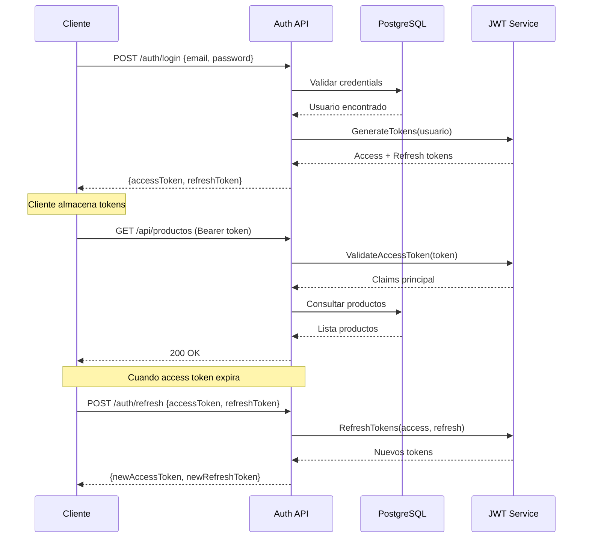

### Buenas Prácticas de Seguridad

```mermaid
flowchart TB
    subgraph "Token Security"
        A1["HTTPS siempre"]
        A2["Secret >= 32 caracteres"]
        A3["Expiration corto (15-30 min)"]
        A4["ClockSkew = 0"]
    end
    
    subgraph "Password Security"
        B1["Hash con bcrypt/argon2"]
        B2["Complexity requirements"]
        B3["Rate limiting"]
        B4["Max failed attempts"]
    end
    
    subgraph "Refresh Token"
        C1["Almacenar en BD"]
        C2["Revocar en logout"]
        C3["Rotar en cada refresh"]
        C4["Expiration más largo"]
    end
    
    subgraph "Monitoring"
        D1["Log de logins"]
        D2["Alertas de actividad sospechosa"]
        D3["Métricas de uso"]
        D4["Audit trail"]
    end
    
    A1 --> A2 --> A3 --> A4
    B1 --> B2 --> B3 --> B4
    C1 --> C2 --> C3 --> C4
    D1 --> D2 --> D3 --> D4
```

### Siguientes Pasos

Con JWT dominado, el siguiente paso es aprender sobre autorización y roles.

### Recursos Adicionales

- JWT.io: https://jwt.io/
- RFC 7519 (JWT): https://datatracker.ietf.org/doc/html/rfc7519
- ASP.NET Core Identity: https://learn.microsoft.com/aspnet/core/security/authentication/
- Microsoft JWT Authentication: https://learn.microsoft.com/aspnet/core/security/authentication/jwt-authn

---

## 17.12. Enfoque Personalizado: Nuestra Implementacion

### Por Que No Usamos ASP.NET Core Identity en TiendaDawApi

Nuestro proyecto TiendaDawApi implementa **autenticacion JWT personalizada** en lugar de usar ASP.NET Core Identity. Esto no es un error, sino una **decision arquitectonica deliberada**.

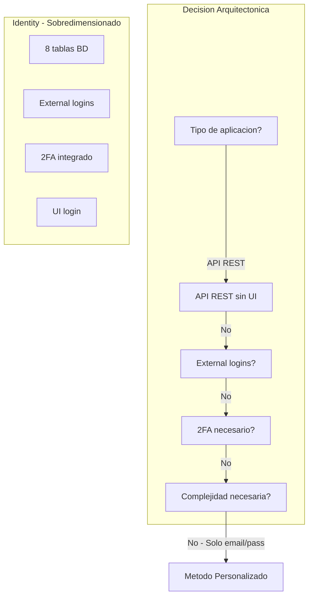

### Que es BCrypt y Por Que Lo Usamos

**BCrypt** es un algoritmo de hashing de contraseñas diseñado para ser lento y costoso computacionalmente. Esto lo hace resistente a ataques de fuerza bruta.

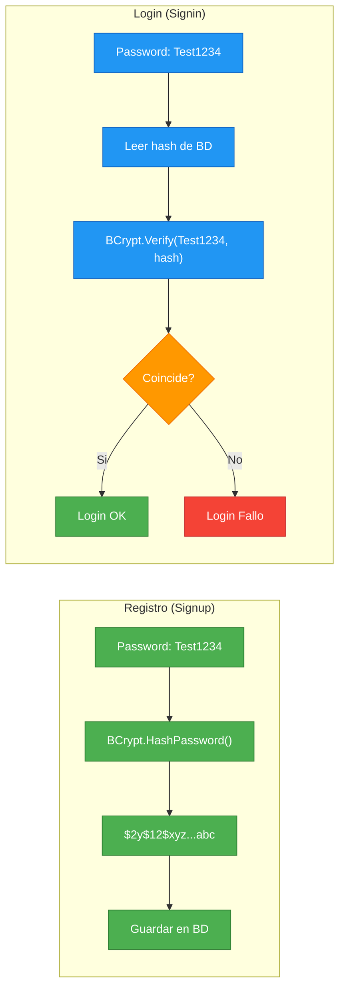

#### Caracteristicas de BCrypt

| Caracteristica | Descripcion |
|----------------|-------------|
| **Work Factor** | Configurable (#17 por defecto). Mas alto = mas lento |
| **Salt Automatico** | Cada hash tiene un salt unico |
| **Resistente a Rainbow Tables** | El salt unico hace inutiles las tablas precalculadas |
| **Adaptive** | Puede incrementarse la complejidad con el tiempo |

#### Comparacion de Algoritmos

| Algoritmo | Velocidad | Resistencia | Recomendado |
|-----------|-----------|-------------|-------------|
| **MD5** | Muy rapido | Baja | ❌ No usar |
| **SHA-256** | Rapido | Media | ❌ No para passwords |
| **PBKDF2** | Lento | Buena | ✅ Aceptable |
| **BCrypt** | Muy lento | Excelente | ✅ Recomendado |
| **Argon2** | Muy lento | Excelente | ✅ El mejor |

### Flujo de Registro (Signup)

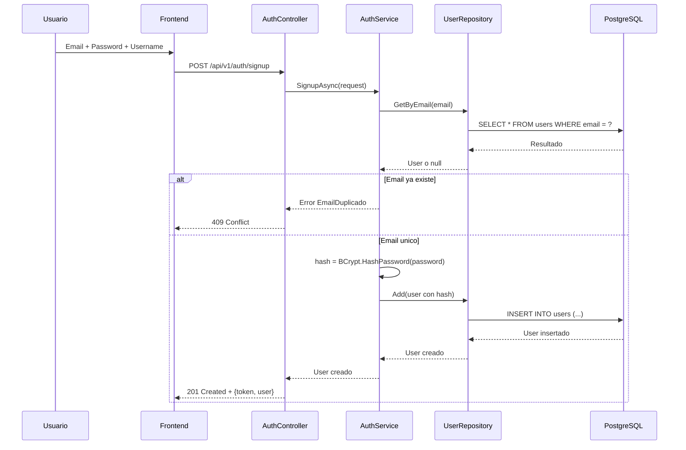

**Pasos del registro:**
1. Usuario envia email, password y username
2. Buscar si el email ya existe en la BD
3. Si existe → error 409
4. Si no existe → hashear password con BCrypt
5. Guardar usuario en la BD
6. Retornar 201 con usuario creado

### Flujo de Login (Signin)

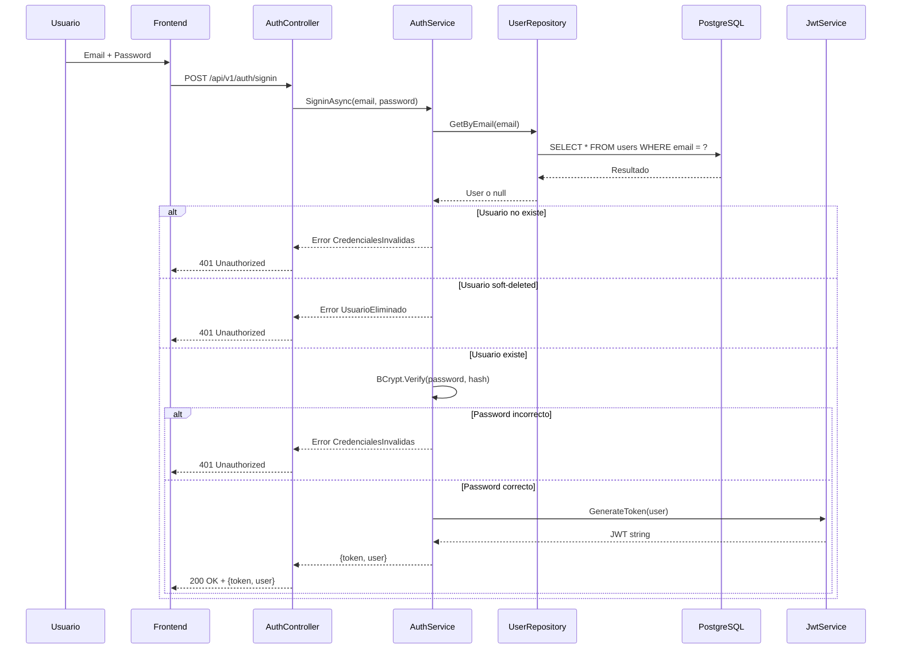

**Pasos del login:**
1. Usuario envia email y password
2. Buscar usuario por email en la BD
3. Si no existe o esta eliminado → error 401
4. Verificar password con BCrypt.Verify()
5. Si es incorrecto → error 401
6. Si es correcto → generar JWT
7. Retornar 200 con token y usuario

### Flujo de Peticion Autorizada

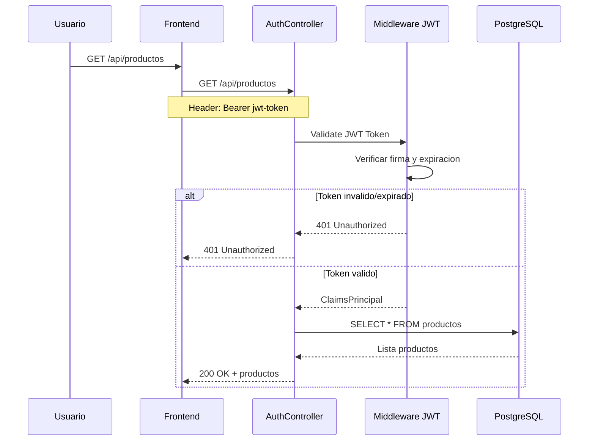

**Pasos de peticion autorizada:**
1. Cliente envia peticion con header Authorization: Bearer token
2. Middleware de JWT extrae y valida el token
3. Si el token es invalido o expirado → 401
4. Si el token es valido → continuar al controller
5. Controller ejecuta la logica y consulta BD
6. Retornar respuesta al cliente

### Arquitectura de Nuestra Autenticacion

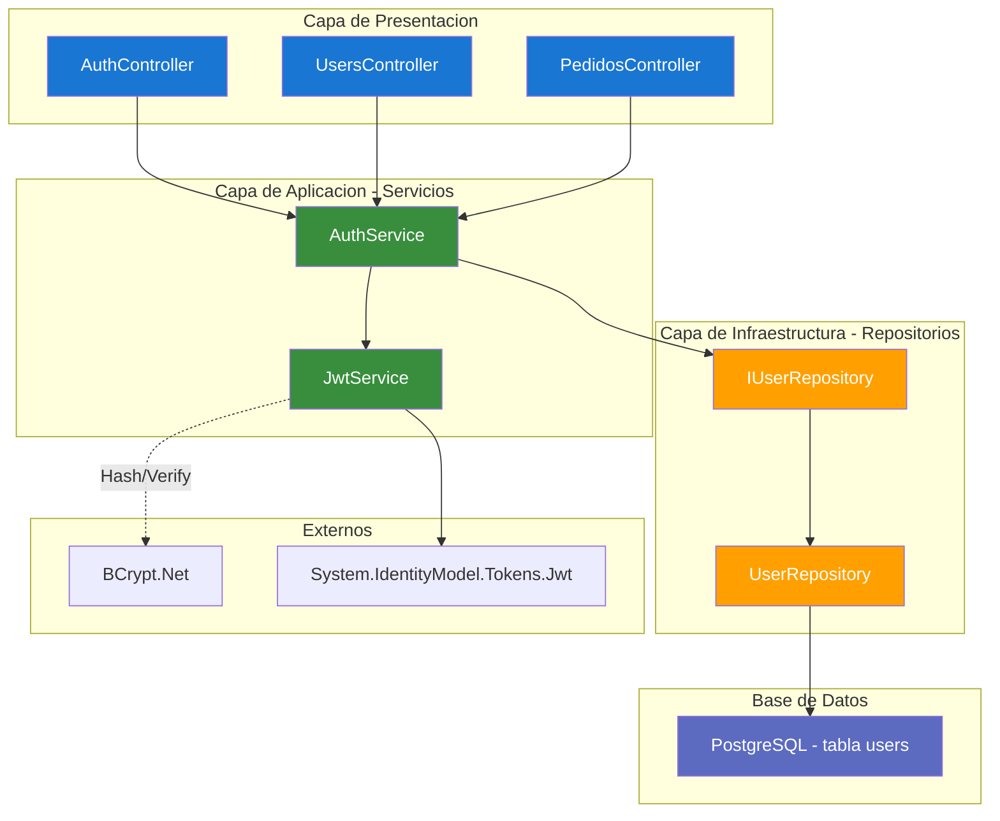

### Tablas de Identity vs Nuestra Tabla

```mermaid
erDiagram
    %% Identity crea 8 tablas
    subgraph "ASP.NET Core Identity (8 tablas)"
        T1["AspNetUsers"] {
            bigint Id PK
            string UserName
            string Email
            string PasswordHash
            string SecurityStamp
            string ConcurrencyStamp
            boolean EmailConfirmed
            boolean TwoFactorEnabled
            int AccessFailedCount
        }
        T2["AspNetRoles"] {
            bigint Id PK
            string Name
        }
        T3["AspNetUserRoles"] {
            bigint UserId
            bigint RoleId
        }
        T4["AspNetUserClaims"] {
            int Id
            bigint UserId
        }
        T5["AspNetUserLogins"]
        T6["AspNetUserTokens"]
        T7["AspNetRoleClaims"]
    end
    
    %% Nuestra tabla
    subgraph "Nuestro Metodo (1 tabla)"
        U1["users"] {
            bigint Id PK
            string Username
            string Email
            string PasswordHash
            string Avatar
            string Role
            boolean IsDeleted
            timestamp CreatedAt
            timestamp UpdatedAt
        }
    end
    
    style T1 fill:#d32f2f,stroke:#b71c1c,color:#fff
    style T2 fill:#d32f2f,stroke:#b71c1c,color:#fff
    style T3 fill:#d32f2f,stroke:#b71c1c,color:#fff
    style T4 fill:#d32f2f,stroke:#b71c1c,color:#fff
    style T5 fill:#d32f2f,stroke:#b71c1c,color:#fff
    style T6 fill:#d32f2f,stroke:#b71c1c,color:#fff
    style T7 fill:#d32f2f,stroke:#b71c1c,color:#fff
    
    style U1 fill:#2e7d32,stroke:#1b5e20,color:#fff
```

### Implementacion del Metodo Personalizado

#### 1. Modelo de Usuario Simple

```csharp
// Models/User.cs
public class User : ITimestamped
{
    public long Id { get; set; }
    public string Username { get; set; } = string.Empty;
    public string Email { get; set; } = string.Empty;
    public string PasswordHash { get; set; } = string.Empty;
    public string Role { get; set; } = UserRoles.USER;
    public string? Avatar { get; set; }
    public bool IsDeleted { get; set; }
    public DateTime CreatedAt { get; init; } = DateTime.UtcNow;
    public DateTime UpdatedAt { get; init; } = DateTime.UtcNow;
}

public static class UserRoles
{
    public const string ADMIN = "ADMIN";
    public const string USER = "USER";
}
```

#### 2. Autenticación con BCrypt Directo

```csharp
// Services/AuthService.cs
public class AuthService
{
    private readonly IUserRepository _userRepository;
    
    public async Task<Result<(string token, User user), Error>> SigninAsync(
        string email, string password)
    {
        // Buscar usuario
        var user = await _userRepository.GetByEmailAsync(email);
        if (user == null)
            return Result.Failure<(string, User), Error>(
                Errors.Auth.CredencialesInvalidas);
        
        // Verificar soft-delete
        if (user.IsDeleted)
            return Result.Failure<(string, User), Error>(
                Errors.Auth.UsuarioEliminado);
        
        // BCrypt directo - sin abstracciones
        if (!BCrypt.Net.BCrypt.Verify(password, user.PasswordHash))
            return Result.Failure<(string, User), Error>(
                Errors.Auth.CredencialesInvalidas);
        
        // Generar JWT
        var token = _jwtService.GenerateToken(user);
        
        return Result.Success<(string, User), Error>((token, user));
    }
    
    public async Task<Result<User, Error>> SignupAsync(SignupRequest request)
    {
        // Verificar email único
        var existing = await _userRepository.GetByEmailAsync(request.Email);
        if (existing != null)
            return Result.Failure<User, Error>(
                Errors.Auth.EmailDuplicado);
        
        // Crear usuario con BCrypt hash
        var user = new User
        {
            Username = request.Username,
            Email = request.Email,
            PasswordHash = BCrypt.Net.BCrypt.HashPassword(request.Password),
            Role = UserRoles.USER
        };
        
        await _userRepository.AddAsync(user);
        return user;
    }
}
```

#### 3. Generación de JWT Manual

```csharp
// Services/JwtService.cs
public class JwtService
{
    public string GenerateToken(User user)
    {
        var key = new SymmetricSecurityKey(Encoding.UTF8.GetBytes(_secretKey));
        var creds = new SigningCredentials(key, SecurityAlgorithms.HmacSha256);
        
        var claims = new[]
        {
            new Claim(JwtRegisteredClaimNames.Sub, user.Id.ToString()),
            new Claim(JwtRegisteredClaimNames.Email, user.Email),
            new Claim(ClaimTypes.Role, user.Role),
            new Claim("username", user.Username),
            new Claim("jti", Guid.NewGuid().ToString())
        };
        
        var token = new JwtSecurityToken(
            issuer: _issuer,
            audience: _audience,
            claims: claims,
            expires: DateTime.UtcNow.AddHours(24),
            signingCredentials: creds
        );
        
        return new JwtSecurityTokenHandler().WriteToken(token);
    }
}
```

#### 4. Configuración Ligera

```csharp
// Infrastructures/AuthenticationConfig.cs
public static class AuthenticationConfig
{
    public static IServiceCollection AddAuthentication(
        this IServiceCollection services, 
        IConfiguration configuration)
    {
        var jwtKey = configuration["Jwt:Key"] 
            ?? throw new InvalidOperationException("JWT Key no configurada");
        
        // Solo JWT Bearer - sin Identity
        services.AddAuthentication(JwtBearerDefaults.AuthenticationScheme)
        .AddJwtBearer(options =>
        {
            options.TokenValidationParameters = new TokenValidationParameters
            {
                ValidateIssuerSigningKey = true,
                IssuerSigningKey = new SymmetricSecurityKey(
                    Encoding.UTF8.GetBytes(jwtKey)),
                ValidateIssuer = true,
                ValidIssuer = configuration["Jwt:Issuer"] ?? "TiendaApi",
                ValidateAudience = true,
                ValidAudience = configuration["Jwt:Audience"] ?? "TiendaApi",
                ValidateLifetime = true,
                ClockSkew = TimeSpan.Zero
            };
        });
        
        // Políticas de autorización simples
        services.AddAuthorizationBuilder()
            .AddPolicy("RequireAdminRole", 
                policy => policy.RequireRole(UserRoles.ADMIN))
            .AddPolicy("RequireUserRole", 
                policy => policy.RequireRole(UserRoles.USER, UserRoles.ADMIN));
        
        return services;
    }
}
```

### Resultados Equivalentes

Aunque la implementación es diferente, **conseguimos los mismos objetivos de seguridad**:

| Objetivo | Con Identity | Con Nuestro Método |
|----------|-------------|-------------------|
| **Contraseñas seguras** | ✅ PBKDF2 con salt | ✅ BCrypt con salt |
| **JWT válido** | ✅ Generado por Identity | ✅ Generado manualmente |
| **Roles controlados** | ✅ IdentityRole<T> | ✅ String simple |
| **Protección SQL Injection** | ✅ EF Core parametrizes | ✅ EF Core parametrizes |
| **Soft-delete** | ✅ Configurable | ✅ Implementado manualmente |

### Cuándo Usar Cada Enfoque

```mermaid
flowchart TD
    A[¿Qué tipo de aplicación?] --> B{¿Tiene UI de login?}
    B -->|Sí - Web Forms/Razor| C[Identity ✅]
    B -->|No - Solo API| D[¿External Logins?]
    D -->|Sí - Google, Facebook| E[Identity ✅]
    D -->|No - Solo email/pass| F[Personalizado ✅]
    
    C --> G["UI completa + Cookies"]
    F --> H["JWT Bearer + BCrypt"]
    
    style C fill:#1565c0,stroke:#0d47a1,color:#fff
    style F fill:#2e7d32,stroke:#1b5e20,color:#fff
    style G fill:#1565c0,stroke:#0d47a1,color:#fff
    style H fill:#2e7d32,stroke:#1b5e20,color:#fff
```

| Escenario | Recomendación | Razón |
|-----------|---------------|-------|
| **API REST simple** | Personalizado ✅ | Ligero, control total |
| **Razor Pages** | Identity ✅ | Cookies + UI login |
| **Blazor Server** | Identity ✅ | Integración completa |
| **SPA + API Backend** | Personalizado en API ✅ | JWT es natural para SPAs |
| **Google/Facebook Login** | Identity ✅ | External logins incluidos |
| **2FA obligatorio** | Identity ✅ | Integrado |

### Conclusión

**Nuestra implementación no es "menos segura" ni "incorrecta".** Es simplemente más adecuada para una API REST sin UI que solo necesita:
- Registro/Login con email y contraseña
- Roles simples (USER/ADMIN)
- JWT para autenticación stateless

Si en el futuro necesitamos external logins o 2FA, podemos migrar a Identity sin perder funcionalidad. Pero para el caso de uso actual, el método personalizado es la elección correcta.

### Recursos Adicionales

- BCrypt: https://github.com/BcryptNet/bcrypt.net
- JWT: https://jwt.io/
- RFC 7519: https://datatracker.ietf.org/doc/html/rfc7519

### Comparacion del Middleware de Autenticacion y Autorizacion

Una pregunta frecuente es: **"Si no usamos Identity, funciona igual el [Authorize]?"** La respuesta es **SI**. El middleware de autenticacion y autorizacion de ASP.NET Core funciona independientemente de como gestionemos los usuarios.

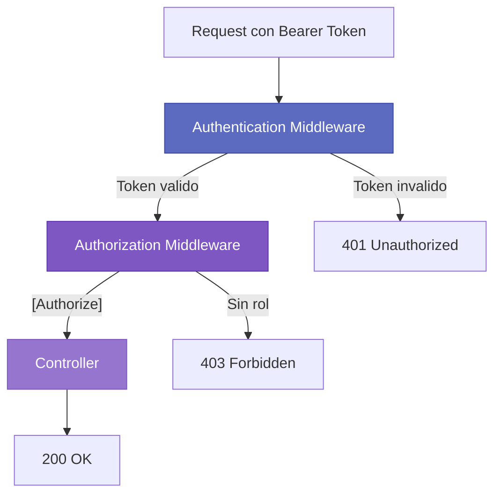

#### Comparacion: Middleware con Identity vs Personalizado

| Aspecto | Con Identity | Personalizado |
|---------|-------------|---------------|
| **Authentication Middleware** | `AddIdentityCookies()` | `AddJwtBearer()` |
| **Authorization Middleware** | `AddAuthorization()` | `AddAuthorization()` (igual) |
| **[Authorize] attribute** | ✅ | ✅ |
| **[Authorize(Roles="Admin")]** | ✅ | ✅ |
| **User.Identity.Name** | ✅ | ✅ |
| **User.IsInRole("ADMIN")** | ✅ | ✅ |

#### Codigo del Middleware (Igual en Ambos Casos)

```csharp
services.AddAuthentication(JwtBearerDefaults.AuthenticationScheme)
    .AddJwtBearer(options =>
    {
        options.TokenValidationParameters = new TokenValidationParameters
        {
            ValidateIssuerSigningKey = true,
            IssuerSigningKey = new SymmetricSecurityKey(
                Encoding.UTF8.GetBytes(configuration["Jwt:Key"])),
            ValidateIssuer = true,
            ValidIssuer = configuration["Jwt:Issuer"],
            ValidateAudience = true,
            ValidAudience = configuration["Jwt:Audience"],
            ValidateLifetime = true,
            ClockSkew = TimeSpan.Zero
        };
    });

services.AddAuthorization();  // EXACTAMENTE IGUAL

[Authorize]  // ✅ Funciona igual
public IActionResult GetAll() { }

[Authorize(Roles = "ADMIN")]  // ✅ Funciona igual
public IActionResult Create(ProductoRequest request) { }
```

#### Lo que Funciona Exactamente Igual

| Funcionabilidad | Identity | Personalizado |
|----------------|----------|---------------|
| `[Authorize]` | ✅ | ✅ |
| `[Authorize(Roles="ADMIN")]` | ✅ | ✅ |
| `User.Identity.IsAuthenticated` | ✅ | ✅ |
| `User.Identity.Name` | ✅ | ✅ |
| `User.IsInRole("ADMIN")` | ✅ | ✅ |

#### Conclusion: El Middleware No Sabe Como Generamos el Token

```
Request --> Authentication Middleware --> Authorization Middleware --> Controller
           Da igual como            Da igual como
           generemos el JWT         configuremos roles
```

**El middleware solo necesita:**
1. Un token JWT valido (lo validamos igual)
2. Claims con los roles necesarios (los ahadimos igual)
3. La configuracion de TokenValidationParameters (igual)
