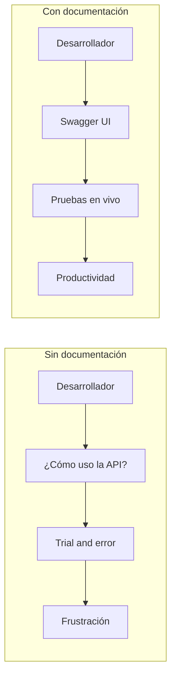
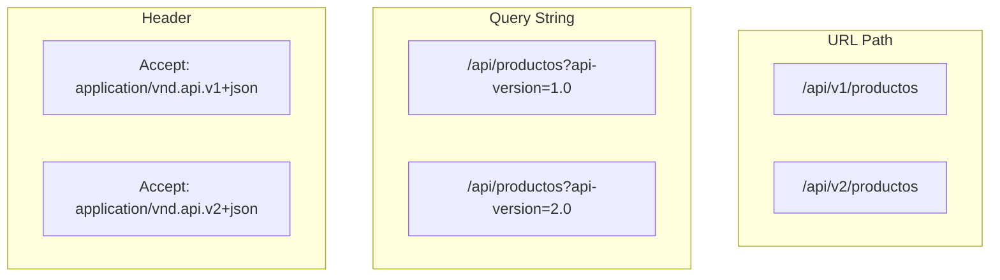
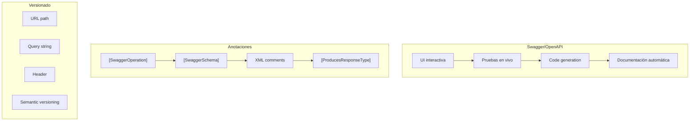

# 19. Documentación y Versionado de APIs

## Índice

[19. Documentación y Versionado de APIs](#19-documentación-y-versionado-de-apis)
  - [19.1. ¿Por qué Documentar y Versionar APIs?](#191-por-qué-documentar-y-versionar-apis)
  - [19.2. Swagger/OpenAPI](#192-swaggeropenapi)
  - [19.3. Anotaciones Swagger](#193-anotaciones-swagger)
  - [19.4. Versionado de APIs](#194-versionado-de-apis)
  - [19.5. OpenAPI Avanzado](#195-openapi-avanzado)
  - [19.6. Resumen y Buenas Prácticas](#196-resumen-y-buenas-prácticas)

---

## 19.1. ¿Por qué Documentar y Versionar APIs?

### Importancia de la Documentación



### ¿Cuándo Versionar?

| Señal | Acción |
|-------|--------|
| Nuevo campo obligatorio | Nueva versión |
| Eliminar endpoint | Nueva versión |
| Cambiar tipos de respuesta | Nueva versión |
| Cambiar autenticación | Nueva versión |

---

## 19.2. Swagger/OpenAPI

### Instalación

```bash
dotnet add package Swashbuckle.AspNetCore
```

### Configuración Básica

```csharp
using Swashbuckle.AspNetCore.Annotations;

var builder = WebApplication.CreateBuilder(args);

// Añadir servicios
builder.Services.AddEndpointsApiExplorer();
builder.Services.AddSwaggerGen(options =>
{
    options.SwaggerDoc("v1", new()
    {
        Title = "TiendaApi",
        Version = "v1",
        Description = "API de comercio electrónico para tienda DAW",
        Contact = new()
        {
            Name = "Soporte",
            Email = "soporte@tienda.com"
        },
        License = new()
        {
            Name = "MIT",
            Url = "https://opensource.org/licenses/MIT"
        }
    });

    // Habilitar anotaciones
    options.EnableAnnotations();
    
    // Incluir XML comments
    var xmlFile = $"{Assembly.GetExecutingAssembly().GetName().Name}.xml";
    var xmlPath = Path.Combine(AppContext.BaseDirectory, xmlFile);
    if (File.Exists(xmlPath))
    {
        options.IncludeXmlComments(xmlPath);
    }

    // Schema filter para respuestas
    options.SchemaFilter<SwaggerSchemaFilter>();
    
    // Operation filter para parámetros
    options.OperationFilter<SwaggerOperationFilter>();
    
    // Ordenar endpoints
    options.OrderActionsBy(api => api.RelativePath);
});

var app = builder.Build();

// Middleware
app.UseSwagger(options =>
{
    options.RouteTemplate = "swagger/{documentName}/swagger.json";
    options.PreSerializeFilters.Add((swaggerDoc, httpReq) =>
    {
        swaggerDoc.Servers = new List<OpenApiServer>
        {
            new() { Url = $"{httpReq.Scheme}://{httpReq.Host}" }
        };
    });
});

app.UseSwaggerUI(options =>
{
    options.SwaggerEndpoint(
        "/swagger/v1/swagger.json", 
        "TiendaApi v1");
    
    options.RoutePrefix = "swagger";  // URL: /swagger
    
    options.InjectStylesheet("/swagger-custom.css");
    
    options.DisplayRequestDuration();
    options.EnableTryItOutByDefault();
    
    options.DocumentTitle = "TiendaApi - Documentación";
});

app.Run();
```

---

## 19.3. Anotaciones Swagger

### Documentación de Endpoints

```csharp
using Microsoft.AspNetCore.Mvc;
using Swashbuckle.AspNetCore.Annotations;

namespace TiendaApi.Apis.Controllers;

[ApiController]
[Route("api/[controller]")]
[Produces("application/json")]
public class ProductosController : ControllerBase
{
    /// <summary>
    /// Obtiene todos los productos
    /// </summary>
    /// <param name="categoriaId">Filtrar por categoría (opcional)</param>
    /// <param name="page">Número de página (default: 1)</param>
    /// <param name="pageSize">Elementos por página (default: 20)</param>
    /// <returns>Lista paginada de productos</returns>
    /// <response code="200">Lista de productos</response>
    /// <response code="401">No autorizado</response>
    [HttpGet]
    [ProducesResponseType(typeof(PagedResponse<ProductoDto>), StatusCodes.Status200OK)]
    [ProducesResponseType(StatusCodes.Status401Unauthorized)]
    [SwaggerOperation(
        Summary = "Listar productos",
        Description = "Obtiene una lista paginada de productos con filtros opcionales",
        OperationId = "GetProductos",
        Tags = new[] { "Productos" })]
    public async Task<IActionResult> GetAll(
        [FromQuery] long? categoriaId,
        [FromQuery] int page = 1,
        [FromQuery] int pageSize = 20)
    {
        // ...
    }

    /// <summary>
    /// Obtiene un producto por ID
    /// </summary>
    /// <param name="id">ID del producto</param>
    /// <returns>Producto encontrado</returns>
    /// <response code="200">Producto encontrado</response>
    /// <response code="404">Producto no encontrado</response>
    [HttpGet("{id:long}")]
    [ProducesResponseType(typeof(ProductoDto), StatusCodes.Status200OK)]
    [ProducesResponseType(typeof(ErrorResponse), StatusCodes.Status404NotFound)]
    [SwaggerOperation(
        Summary = "Obtener producto",
        Description = "Obtiene los detalles de un producto específico",
        OperationId = "GetProductoById",
        Tags = new[] { "Productos" })]
    public async Task<IActionResult> GetById(long id)
    {
        // ...
    }

    /// <summary>
    /// Crea un nuevo producto
    /// </summary>
    /// <param name="request">Datos del producto</param>
    /// <returns>Producto creado</returns>
    /// <response code="201">Producto creado exitosamente</response>
    /// <response code="400">Datos inválidos</response>
    /// <response code="401">No autorizado</response>
    [HttpPost]
    [ProducesResponseType(typeof(ProductoDto), StatusCodes.Status201Created)]
    [ProducesResponseType(typeof(ValidationProblemDetails), StatusCodes.Status400BadRequest)]
    [ProducesResponseType(StatusCodes.Status401Unauthorized)]
    [Authorize(Roles = "Admin,Manager")]
    [SwaggerOperation(
        Summary = "Crear producto",
        Description = "Crea un nuevo producto en el catálogo",
        OperationId = "CreateProducto",
        Tags = new[] { "Productos" })]
    public async Task<IActionResult> Create([FromBody] CreateProductoRequest request)
    {
        // ...
    }

    /// <summary>
    /// Elimina un producto
    /// </summary>
    /// <param name="id">ID del producto a eliminar</param>
    /// <response code="204">Producto eliminado</response>
    /// <response code="404">Producto no encontrado</response>
    /// <response code="403">Sin permisos</response>
    [HttpDelete("{id:long}")]
    [ProducesResponseType(StatusCodes.Status204NoContent)]
    [ProducesResponseType(typeof(ErrorResponse), StatusCodes.Status404NotFound)]
    [ProducesResponseType(StatusCodes.Status403Forbidden)]
    [Authorize(Roles = "Admin")]
    [SwaggerOperation(
        Summary = "Eliminar producto",
        Description = "Elimina un producto del catálogo (solo Admin)",
        OperationId = "DeleteProducto",
        Tags = new[] { "Productos" })]
    public async Task<IActionResult> Delete(long id)
    {
        // ...
    }
}
```

### Documentación de DTOs

```csharp
using System.ComponentModel.DataAnnotations;
using Swashbuckle.AspNetCore.Annotations;

namespace TiendaApi.Core.Models.Dto;

/// <summary>
/// Request para crear un producto
/// </summary>
public class CreateProductoRequest
{
    /// <summary>
    /// Nombre del producto (máximo 200 caracteres)
    /// </summary>
    [Required(ErrorMessage = "El nombre es obligatorio")]
    [MaxLength(200, ErrorMessage = "El nombre no puede exceder 200 caracteres")]
    [SwaggerSchema(Description = "Nombre del producto")]
    public string Nombre { get; set; } = string.Empty;

    /// <summary>
    /// Descripción detallada del producto
    /// </summary>
    [MaxLength(2000)]
    [SwaggerSchema(Description = "Descripción detallada")]
    public string? Descripcion { get; set; }

    /// <summary>
    /// Precio del producto (debe ser mayor a 0)
    /// </summary>
    [Required]
    [Range(0.01, double.MaxValue, ErrorMessage = "El precio debe ser mayor a 0")]
    [SwaggerSchema(Description = "Precio en euros")]
    public decimal Precio { get; set; }

    /// <summary>
    /// Stock disponible
    /// </summary>
    [Range(0, int.MaxValue, ErrorMessage = "El stock no puede ser negativo")]
    public int Stock { get; set; }

    /// <summary>
    /// ID de la categoría
    /// </summary>
    [Required]
    [SwaggerSchema(Description = "Identificador de categoría")]
    public long CategoriaId { get; set; }
}

/// <summary>
/// Respuesta de producto
/// </summary>
public class ProductoDto
{
    /// <summary>
    /// ID único del producto
    /// </summary>
    public long Id { get; set; }

    /// <summary>
    /// Nombre del producto
    /// </summary>
    public string Nombre { get; set; } = string.Empty;

    /// <summary>
    /// Precio del producto
    /// </summary>
    public decimal Precio { get; set; }

    /// <summary>
    /// Stock disponible
    /// </summary>
    public int Stock { get; set; }

    /// <summary>
    /// Nombre de la categoría
    /// </summary>
    public string? CategoriaNombre { get; set; }
}

/// <summary>
/// Respuesta paginada genérica
/// </summary>
/// <typeparam name="T">Tipo de datos</typeparam>
public class PagedResponse<T>
{
    /// <summary>
    /// Datos de la página actual
    /// </summary>
    public List<T> Data { get; set; } = new();

    /// <summary>
    /// Página actual (1-based)
    /// </summary>
    public int Page { get; set; }

    /// <summary>
    /// Elementos por página
    /// </summary>
    public int PageSize { get; set; }

    /// <summary>
    /// Total de elementos
    /// </summary>
    public int TotalItems { get; set; }

    /// <summary>
    /// Total de páginas
    /// </summary>
    public int TotalPages { get; set; }

    /// <summary>
    /// Si hay más páginas
    /// </summary>
    public bool HasNextPage => Page < TotalPages;

    /// <summary>
    /// Si hay páginas anteriores
    /// </summary>
    public bool HasPreviousPage => Page > 1;
}
```

---

## 19.4. Versionado de APIs

### Estrategias de Versionado



### Configuración de Versionado

```bash
dotnet add package Microsoft.AspNetCore.Mvc.Versioning
dotnet add package Microsoft.AspNetCore.Mvc.Versioning.ApiExplorer
```

```csharp
// Program.cs
builder.Services.AddApiVersioning(options =>
{
    // Versión por defecto
    options.DefaultApiVersion = new ApiVersion(1, 0);
    
    // Reportar versiones soportadas en header
    options.ReportApiVersions = true;
    
    // Versión en URL (o usar Query String / Header)
    options.AssumeDefaultVersionWhenUnspecified = true;
    
    // Error al no especificar versión
    options.ErrorResponses = new VersioningErrorResponseProvider();
});

// Explorador de versiones
builder.Services.AddVersionedApiExplorer(options =>
{
    options.GroupNameFormat = "'v'VVV";
    options.SubstituteApiVersionInUrl = true;
});

app.UseApiVersioning();
```

### Controladores Versionados

```csharp
using Microsoft.AspNetCore.Mvc;

namespace TiendaApi.Apis.Controllers.V1;

[ApiController]
[ApiVersion("1.0")]
[Route("api/v{version:apiVersion}/[controller]")]
public class ProductosControllerV1 : ControllerBase
{
    /// <summary>
    /// Obtiene todos los productos (v1)
    /// </summary>
    [HttpGet]
    [MapToApiVersion("1.0")]
    public async Task<IActionResult> GetAllV1()
    {
        // Versión 1: Respuesta básica
        var productos = await _service.GetAllAsync();
        return Ok(productos.Select(p => new ProductoV1Dto
        {
            Id = p.Id,
            Nombre = p.Nombre,
            Precio = p.Precio
        }));
    }
}

namespace TiendaApi.Apis.Controllers.V2;

[ApiController]
[ApiVersion("2.0")]
[Route("api/v{version:apiVersion}/[controller]")]
public class ProductosControllerV2 : ControllerBase
{
    /// <summary>
    /// Obtiene todos los productos (v2)
    /// </summary>
    [HttpGet]
    [MapToApiVersion("2.0")]
    public async Task<IActionResult> GetAllV2()
    {
        // Versión 2: Respuesta más completa
        var productos = await _service.GetAllAsync();
        return Ok(productos.Select(p => new ProductoV2Dto
        {
            Id = p.Id,
            Nombre = p.Nombre,
            Precio = p.Precio,
            Stock = p.Stock,
            CategoriaNombre = p.Categoria?.Nombre,
            FechaCreacion = p.CreatedAt
        }));
    }
}
```

### Swagger con Versiones

```csharp
builder.Services.AddSwaggerGen(options =>
{
    // Versión 1
    options.SwaggerDoc("v1", new OpenApiInfo
    {
        Title = "TiendaApi v1",
        Version = "v1",
        Description = "Primera versión de la API"
    });

    // Versión 2
    options.SwaggerDoc("v2", new OpenApiInfo
    {
        Title = "TiendaApi v2",
        Version = "v2",
        Description = "Segunda versión con campos adicionales"
    });

    // Añadir versión a cada endpoint
    options.OperationFilter<SwaggerVersionOperationFilter>();
});

app.UseSwaggerUI(options =>
{
    options.SwaggerEndpoint("/swagger/v1/swagger.json", "TiendaApi v1.0");
    options.SwaggerEndpoint("/swagger/v2/swagger.json", "TiendaApi v2.0");
    
    // Selector de versiones
    options.SwaggerEndpoint("/swagger/v1/swagger.json", "v1.0");
    options.SwaggerEndpoint("/swagger/v2/swagger.json", "v2.0");
});
```

---

## 19.5. OpenAPI Avanzado

### Schemas Personalizados

```csharp
// SwaggerSchemaFilter.cs
public class SwaggerSchemaFilter : ISchemaFilter
{
    public void Apply(OpenApiSchema schema, SchemaFilterContext context)
    {
        // Añadir ejemplo
        if (context.Type == typeof(CreateProductoRequest))
        {
            schema.Example = new OpenApiObject
            {
                ["nombre"] = new OpenApiString("Laptop Gaming"),
                ["descripcion"] = new OpenApiString("Potente laptop para gaming"),
                ["precio"] = new OpenApiNumber(1499.99m),
                ["stock"] = new OpenApiInteger(10),
                ["categoriaId"] = new OpenApiInteger(1)
            };
        }

        // Ocultar campos
        if (context.Type == typeof(Producto) && 
            context.SchemaProperties.ContainsKey("InternalId"))
        {
            schema.Properties.Remove("InternalId");
        }

        // Añadir descripción
        if (context.MemberInfo != null)
        {
            var description = context.MemberInfo.GetCustomAttribute<DescriptionAttribute>();
            if (description != null)
            {
                schema.Description = description.Description;
            }
        }
    }
}
```

### Documentación de Errores

```csharp
// ErrorResponse.cs
/// <summary>
/// Respuesta de error estándar
/// </summary>
public class ErrorResponse
{
    /// <summary>
    /// Timestamp del error
    /// </summary>
    public DateTime Timestamp { get; set; } = DateTime.UtcNow;

    /// <summary>
    /// Código de estado HTTP
    /// </summary>
    public int Status { get; set; }

    /// <summary>
    /// Error code
    /// </summary>
    public string Error { get; set; } = string.Empty;

    /// <summary>
    /// Mensaje descriptivo
    /// </summary>
    public string Message { get; set; } = string.Empty;

    /// <summary>
    /// Path de la request
    /// </summary>
    public string Path { get; set; } = string.Empty;

    /// <summary>
    /// Correlation ID
    /// </summary>
    public string? CorrelationId { get; set; }

    /// <summary>
    /// Detalles adicionales
    /// </summary>
    public List<ErrorDetail>? Details { get; set; }
}

public class ErrorDetail
{
    public string Field { get; set; } = string.Empty;
    public string Message { get; set; } = string.Empty;
    public object? AttemptedValue { get; set; }
}
```

---

## 19.6. Resumen y Buenas Prácticas

### Documentación



### Buenas Prácticas

| Práctica | Descripción |
|----------|-------------|
| Documentar todo | Cada endpoint debe tener descripción |
| Ejemplos reales | Incluir datos de ejemplo |
| Mantener actualizada | La docs debe reflejar el código |
| Versionar temprano | Planificar versiones desde el inicio |
| Deprecación suave | Advertir antes de eliminar |

### Siguientes Pasos

Con documentación y versionado dominado, el siguiente paso es aprender sobre patrones avanzados de arquitectura.

### Recursos Adicionales

- Swagger/OpenAPI: https://swagger.io/docs/specification/about/
- Swashbuckle: https://github.com/domaindrivendev/Swashbuckle.AspNetCore
- API Versioning: https://github.com/Microsoft/aspnet-api-versioning
