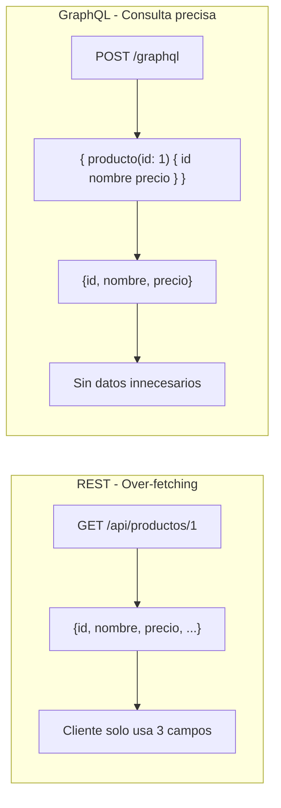
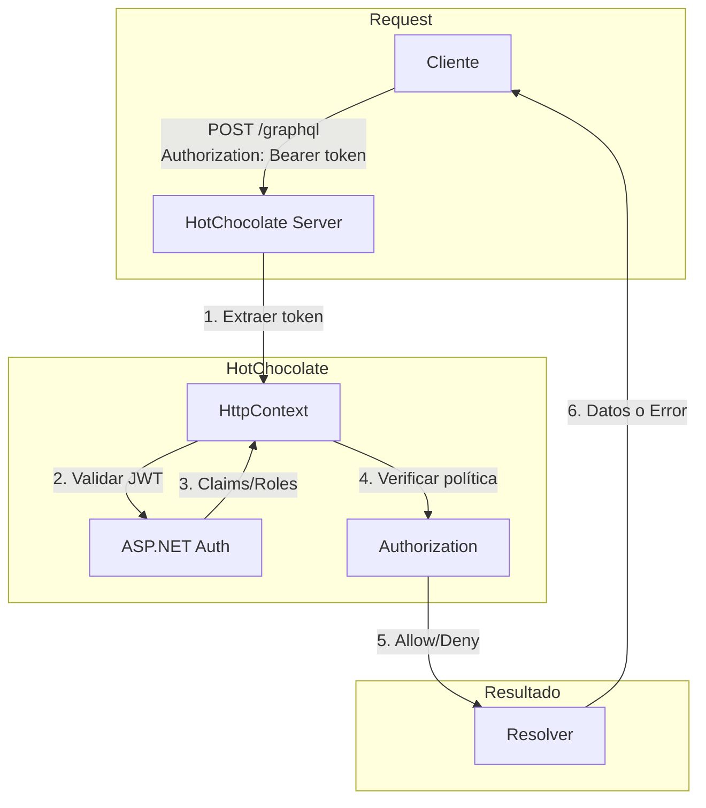
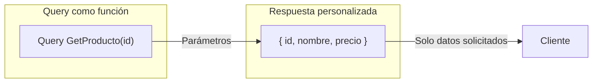
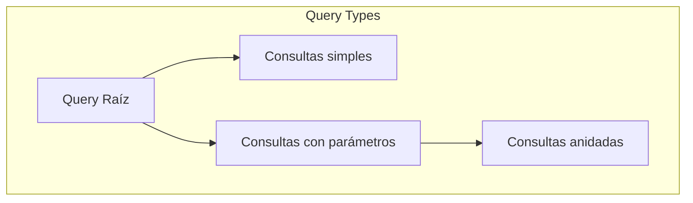
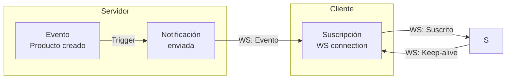
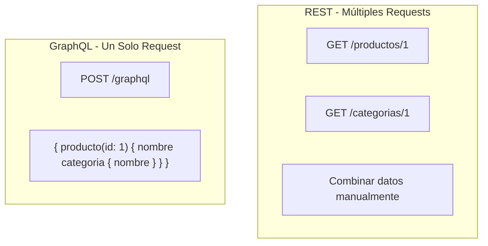
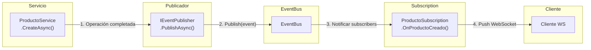
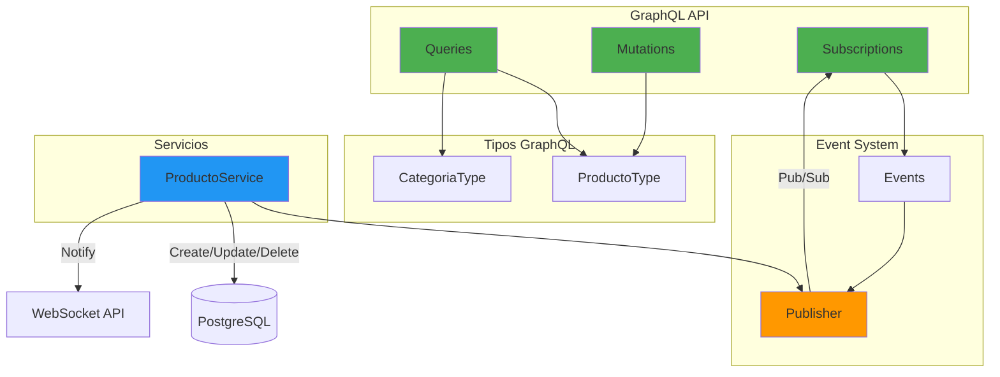
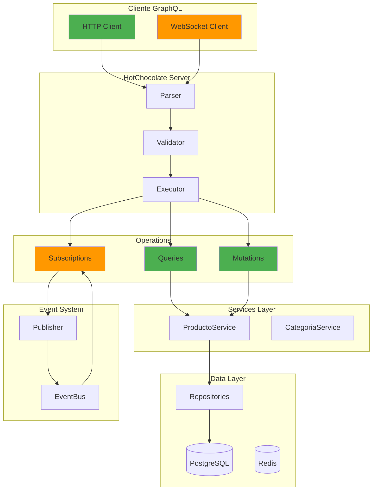
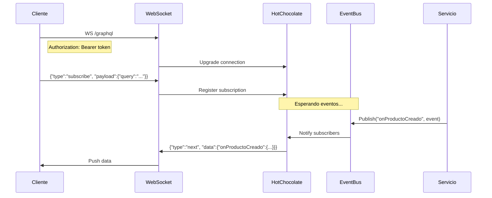

# 20. GraphQL con HotChocolate

## Índice

[20. GraphQL con HotChocolate](#20-graphql-con-hotchocolate)
  - [20.1. ¿Qué es GraphQL?](#201-qué-es-graphql)
  - [20.2. Instalación de HotChocolate](#202-instalación-de-hotchocolate)
  - [20.3. Configuración en Program.cs](#203-configuración-en-programcs)
  - [20.3.1. Autenticación y Autorización con HotChocolate](#2031-autenticación-y-autorización-con-hotchocolate)
  - [20.4. Conceptos de Queries](#204-conceptos-de-queries)
  - [20.5. TiendaQuery: Consultas del Proyecto](#205-tiendaquery-consultas-del-proyecto)
  - [20.6. Tipos de GraphQL](#206-tipos-de-graphql)
  - [20.7. Tipos de Datos en GraphQL](#207-tipos-de-datos-en-graphql)
  - [20.8. GraphiQL: Herramienta de Desarrollo](#208-graphiql-herramienta-de-desarrollo)
  - [20.9. Consultas de Ejemplo](#209-consultas-de-ejemplo)
  - [20.10. Mutations](#2010-mutations)
  - [20.11. Subscriptions](#2011-subscriptions)
  - [20.12. Comparación REST vs GraphQL](#2012-comparación-rest-vs-graphql)
  - [20.13. Input Types](#2013-input-types)
  - [20.14. Events: Payloads de Eventos](#2014-events-payloads-de-eventos)
  - [20.15. Publishers: Sistema Pub/Sub](#2015-publishers-sistema-pubsub)
  - [20.16. Estructura de Carpetas GraphQL](#2016-estructura-de-carpetas-graphql)
  - [20.17. Patrones Utilizados](#2017-patrones-utilizados)
  - [20.18. Estado Actual del Proyecto](#2018-estado-actual-del-proyecto)
  - [20.19. Resumen Completo](#2019-resumen-completo)

---

## 20.1. ¿Qué es GraphQL?

**GraphQL** es un lenguaje de consulta para APIs desarrollado por Facebook. A diferencia de REST, GraphQL permite al cliente especificar exactamente qué datos necesita, evitando el over-fetching y under-fetching.



### Comparación REST vs GraphQL

| Aspecto | REST | GraphQL |
|---------|------|---------|
| **Endpoint** | Multiple endpoints | Un solo endpoint |
| **Datos** | Respuesta fija | Consulta flexible |
| **Over-fetching** | Sí | No |
| **Under-fetching** | Sí | No |
| **Versionado** | En URL (/v1/) | Sin versionado típico |
| **Documentación** | Swagger/OpenAPI | Introspection |
| **Curva aprendizaje** | Baja | Media |

---

## 20.2. Instalación de HotChocolate

### Paquetes Necesarios

```bash
# Paquete principal de HotChocolate
dotnet add package HotChocolate.AspNetCore

# Paquetes adicionales útiles
dotnet add package HotChocolate.Data        # Para filtrado y paginación
dotnet add package HotChocolate.Stitching   # Para federar esquemas
```

### Dependencias en el Proyecto

Del archivo `Program.cs`:

```csharp
// GraphQL
Log.Information("🔍 Configurando GraphQL con HotChocolate...");
builder.Services
    .AddGraphQLServer()
    .AddQueryType<TiendaQuery>()
    .AddType<ProductoType>()
    .AddType<CategoriaType>()
    .ModifyRequestOptions(opt => opt.IncludeExceptionDetails = builder.Environment.IsDevelopment());
```

### Endpoint de GraphQL

```csharp
// GraphQL Endpoint
Log.Information("🔍 Configurando endpoint GraphQL: /graphql");
app.MapGraphQL();
```

---

## 20.3. Configuración en Program.cs

### Configuración Básica

```csharp
using HotChocolate;

var builder = WebApplication.CreateBuilder(args);

// Agregar GraphQL
builder.Services
    .AddGraphQLServer()
    .AddQueryType<Query>();
```

### Configuración Completa

```csharp
builder.Services
    .AddGraphQLServer()
    .AddQueryType<Query>()                    // Tipo de consulta raíz
    .AddType<ProductoType>()                  // Tipos personalizados
    .AddType<CategoriaType>()
    .AddMutationType<Mutation>()              // Mutaciones (opcional)
    .AddSubscriptionType<Subscription>()      // Suscripciones (opcional)
    
    // Configuración de errores
    .ModifyRequestOptions(opt => 
        opt.IncludeExceptionDetails = builder.Environment.IsDevelopment())
    
    // Introspection habilitada por defecto
    .AddIntrospectionTypes()
    
    // Formateo de errores
    .AddErrorFilter(error => 
    {
        // Personalizar errores según el entorno
        return error;
    });
```

### Diferentes Entornos

```csharp
// Desarrollo: Mostrar detalles de errores
.ModifyRequestOptions(opt => opt.IncludeExceptionDetails = true)

// Producción: Ocultar detalles
.ModifyRequestOptions(opt => opt.IncludeExceptionDetails = false)
```

---

## 20.3.1. Autenticación y Autorización con HotChocolate

HotChocolate se integra de forma **transparente** con el sistema de autenticación y autorización de ASP.NET Core (Identity, JWT, Claims). Esto significa que puedes usar los mismos atributos y políticas de autorización que en los controladores REST.

### Conceptos Clave

HotChocolate permite proteger:
- **Queries**: Controlar quién puede leer datos
- **Mutations**: Controlar quién puede modificar datos
- **Fields**: Controlar acceso a campos específicos

### Integración con ASP.NET Core Identity

La integración es transparente porque HotChocolate lee el `HttpContext` y los claims de usuario autenticado:

```csharp
builder.Services
    .AddAuthentication(JwtBearerDefaults.AuthenticationScheme)
    .AddJwtBearer(...);

builder.Services
    .AddAuthorization();

// HotChocolate lee automáticamente el contexto de autenticación
builder.Services
    .AddGraphQLServer()
    .AddAuthorization()  // ← Habilita soporte para [Authorize]
    .AddQueryType<TiendaQuery>();
```

### Proteger Queries con [Authorize]

```csharp
public class TiendaQuery
{
    // Query pública - cualquiera puede ver productos
    [UseFirstOrDefault]
    [UseProjection]
    public IQueryable<Producto> GetProductos(
        [Service] IProductoRepository productoRepository)
    {
        return productoRepository.FindAllAsNoTracking();
    }

    // Query protegida - solo usuarios autenticados
    [Authorize]  // ← Requiere JWT válido
    [UseFirstOrDefault]
    public async Task<Producto?> GetProducto(
        long id,
        [Service] IProductoRepository productoRepository)
    {
        return await productoRepository.FindByIdAsync(id);
    }
}
```

### Proteger Mutations con Roles

```csharp
public class ProductoMutation
{
    // Solo administradores pueden crear productos
    [Authorize(policy: "AdminOnly")]  // ← Policy que requiere rol Admin
    public async Task<Result<Producto, DomainError>> CreateProducto(
        CreateProductoInput input,
        [Service] IProductoService productoService)
    {
        return await productoService.CreateAsync(input.ToDto());
    }

    // Solo administradores pueden actualizar
    [Authorize(Roles = "Admin")]
    public async Task<Result<Producto, DomainError>> UpdateProducto(
        long id,
        UpdateProductoInput input,
        [Service] IProductoService productoService)
    {
        return await productoService.UpdateAsync(id, input.ToDto());
    }

    // Solo administradores pueden eliminar
    [Authorize(Roles = "Admin")]
    public async Task<Result<bool, DomainError>> DeleteProducto(
        long id,
        [Service] IProductoService productoService)
    {
        return await productoService.DeleteAsync(id);
    }
}
```

### Proteger Fields Individuales

```csharp
public class ProductoType : ObjectType<Producto>
{
    protected override void Configure(IObjectTypeDescriptor<Producto> descriptor)
    {
        descriptor.Field(p => p.Id)
            .Type<NonNullType<IdType>>();

        descriptor.Field(p => p.Nombre)
            .Type<NonNullType<StringType>>();

        // Campo solo visible para administradores
        descriptor.Field(p => p.CostoProveedor)
            .Type<DecimalType>()
            .Authorize(new[] { "Admin" });  // ← Solo Admin puede ver este campo

        descriptor.Field(p => p.Categoria)
            .Type<CategoriaType>();
    }
}
```

### Proteger Subscriptions

```csharp
public class ProductoSubscription
{
    // Subscription requiere JWT válido
    [Authorize]
    [Subscribe]
    [Topic]
    public ProductoCreadoEvent OnProductoCreado(
        [EventMessage] ProductoCreadoEvent message)
    {
        return message;
    }

    // Subscription con política específica
    [Authorize(policy: "AdminOnly")]
    [Subscribe]
    [Topic]
    public ProductoEliminadoEvent OnProductoEliminado(
        [EventMessage] ProductoEliminadoEvent message)
    {
        return message;
    }
}
```

### Definir Políticas de Autorización

```csharp
// Program.cs
builder.Services.AddAuthorization(options =>
{
    options.AddPolicy("AdminOnly", policy =>
        policy.RequireAssertion(ctx =>
            ctx.User.IsInRole("Admin") ||
            ctx.User.HasClaim(c => c.Type == "role" && c.Value == "Admin")));

    options.AddPolicy("UserOrAdmin", policy =>
        policy.RequireAssertion(ctx =>
            ctx.User.IsInRole("User") ||
            ctx.User.IsInRole("Admin")));
    
    options.AddPolicy("PremiumUser", policy =>
        policy.RequireAssertion(ctx =>
            ctx.User.HasClaim("subscription_tier", "premium")));
});
```

### Claims Personalizados en GraphQL

Puedes acceder a los claims del usuario desde cualquier resolver:

```csharp
public class TiendaQuery
{
    public async Task<List<Producto>> GetMisProductos(
        [Service] IProductoRepository productoRepository,
        [GlobalState("userId")] long userId)  // ← Injectado automáticamente
    {
        // Obtener productos del usuario actual
        return await productoRepository.GetByUserIdAsync(userId);
    }
}

// Configurar para inyectar claims
builder.Services
    .AddGraphQLServer()
    .AddAuthorization()
    .AddHttpRequestInterceptor((ctx, builder) =>
    {
        if (ctx.User.Identity?.IsAuthenticated == true)
        {
            var userId = ctx.User.FindFirst("sub")?.Value;
            if (long.TryParse(userId, out var id))
            {
                builder.SetGlobalState("userId", id);
            }
        }
        return ValueTask.CompletedTask;
    });
```

### Autorización Basada en Claims

```csharp
public class PedidoMutation
{
    // Solo usuarios con claim "can_manage_orders" pueden acceder
    [Authorize(policy: "ManageOrders")]
    public async Task<Result<Pedido, DomainError>> CreatePedido(...)
    {
        // ...
    }
}

// Definir política basada en claim
builder.Services.AddAuthorization(options =>
{
    options.AddPolicy("ManageOrders", policy =>
        policy.RequireClaim("can_manage_orders", "true"));
});
```

### Tabla de Atributos de Autorización

| Atributo | Descripción | Ejemplo |
|----------|-------------|---------|
| `[Authorize]` | Requiere autenticación | Cualquier usuario logueado |
| `[Authorize(Roles = "Admin")]` | Requiere rol específico | Solo administradores |
| `[Authorize(Roles = "User,Admin")]` | Requiere uno de los roles | Usuario o administrador |
| `[Authorize(Policy = "AdminOnly")]` | Requiere política personalizada | Configurada en Program.cs |
| `[Authorize(Policy = "PremiumUser")]` | Policy con claims personalizados | Usuarios premium |

### Flujo de Autorización en GraphQL



### Manejo de Errores de Autorización

HotChocolate devuelve errores GraphQL cuando la autorización falla:

```json
{
  "errors": [
    {
      "message": "Authorization denied.",
      "extensions": {
        "code": "UNAUTHORIZED"
      }
    }
  ]
}
```

### Configuración Completa de Seguridad

```csharp
builder.Services
    .AddGraphQLServer()
    .AddAuthorization(options =>
    {
        options.DefaultPolicy = new AuthorizationPolicyBuilder(
            JwtBearerDefaults.AuthenticationScheme)
            .RequireAuthenticatedUser()
            .Build();
        
        options.AddPolicy("AdminOnly", policy =>
            policy.RequireRole("Admin"));
    })
    .AddQueryType<TiendaQuery>()
    .AddMutationType<ProductoMutation>()
    .AddSubscriptionType<ProductoSubscription>()
    .AddInMemorySubscriptions();
```

### Resumen

| Aspecto | Implementación |
|---------|----------------|
| **Autenticación** | JWT via ASP.NET Core Authentication |
| **Autorización** | `[Authorize]`, `[Authorize(Roles)]`, Policies |
| **Roles** | "Admin", "User" (desde Identity) |
| **Claims** | Accesibles desde el HttpContext |
| **Transparencia** | HotChocolate lee el mismo contexto que Controllers |

---

## 20.4. Conceptos de Queries

Las **Queries** (consultas) son el mecanismo principal para **leer datos** en GraphQL. Son el equivalente a las operaciones GET en REST, pero con una diferencia fundamental: el cliente define exactamente qué campos quiere recibir.

### Concepto de Query

A diferencia de REST donde el servidor define la estructura de la respuesta, en GraphQL el cliente decide qué datos necesita. Esto elimina el over-fetching (recibir datos innecesarios) y under-fetching (necesitar múltiples llamadas).



### Anatomía de una Query

```graphql
# Estructura básica
query NombreQuery($id: Long!) {
  producto(id: $id) {
    id          # Campo solicitado
    nombre      # Campo solicitado
    precio      # Campo solicitado
    # descripcion no se incluye → no se envía
  }
}
```

### Componentes de una Query

| Componente | Descripción | Ejemplo |
|------------|-------------|---------|
| `query` | Tipo de operación (también puede ser `subscription`) | `query { ... }` |
| `nombre` | Identificador opcional de la query | `query GetProducto { ... }` |
| `parámetros` | Variables de entrada | `$id: Long!` |
| `campos` | Datos que se solicitan | `id, nombre, precio` |

### Queries vs Mutations

| Aspecto | Query | Mutation |
|---------|-------|----------|
| **Propósito** | Leer datos | Modificar datos |
| **Efecto** | Sin cambios en el servidor | Puede crear/actualizar/eliminar |
| **Orden** | Se pueden ejecutar en paralelo | Se ejecutan en orden secuencial |
| **Ejemplo REST** | GET /productos/1 | POST /productos |

### Patrones de Queries

**1. Query simple - Un recurso:**
```graphql
query {
  producto(id: 1) {
    id
    nombre
    precio
  }
}
```

**2. Query con múltiples campos:**
```graphql
query {
  productos {
    id
    nombre
    precio
    stock
  }
}
```

**3. Query anidada - Relaciones:**
```graphql
query {
  productos {
    id
    nombre
    categoria {
      id
      nombre
    }
  }
}
```

**4. Query con filtros:**
```graphql
query {
  productos(where: { precio: { gt: 100 } }) {
    id
    nombre
    precio
  }
}
```

**5. Query paginada:**
```graphql
query {
  productos(first: 10, offset: 0) {
    nodes {
      id
      nombre
    }
    pageInfo {
      hasNextPage
    }
  }
}
```

### Tipos de Query en GraphQL



### Ventajas de las Queries en GraphQL

1. **Flexibilidad**: El cliente elige qué campos necesita
2. **Eficiencia**: Una sola request para datos relacionados
3. **Tipado**: El esquema define exactamente qué está disponible
4. **Documentación automática**: Introspection muestra todas las queries disponibles
5. **Versionado innecesario**: Se añaden campos, no se rompen queries existentes

---

## 20.5. TiendaQuery: Consultas del Proyecto

Del archivo `TiendaQuery.cs`:

### Query Raíz

```csharp
namespace TiendaApi.Apis.GraphQL.Types;

public class TiendaQuery
{
    // Consulta básica: Obtener todos los productos
    [UseFirstOrDefault]
    [UseProjection]
    public IQueryable<Producto> GetProductos(
        [Service] IProductoRepository productoRepository)
    {
        return productoRepository.FindAllAsNoTracking();
    }

    // Obtener producto por ID
    [UseFirstOrDefault]
    public async Task<Producto?> GetProducto(
        long id,
        [Service] IProductoRepository productoRepository)
    {
        return await productoRepository.FindByIdAsync(id);
    }

    // Paginación
    [UsePaging(MaxPageSize = 100, DefaultPageSize = 10)]
    public IQueryable<Producto> GetProductosPaged(
        [Service] IProductoRepository productoRepository)
    {
        return productoRepository.FindAllAsNoTracking();
    }

    // Categorías
    [UseFirstOrDefault]
    [UseProjection]
    public IQueryable<Categoria> GetCategorias(
        [Service] ICategoriaRepository categoriaRepository)
    {
        return categoriaRepository.FindAllAsNoTracking();
    }

    [UseFirstOrDefault]
    public async Task<Categoria?> GetCategoria(
        long id,
        [Service] ICategoriaRepository categoriaRepository)
    {
        return await categoriaRepository.FindByIdAsync(id);
    }

    [UsePaging(MaxPageSize = 100, DefaultPageSize = 10)]
    public IQueryable<Categoria> GetCategoriasPaged(
        [Service] ICategoriaRepository categoriaRepository)
    {
        return categoriaRepository.FindAllAsNoTracking();
    }
}
```

### Atributos de HotChocolate

| Atributo | Descripción |
|----------|-------------|
| `[UseFirstOrDefault]` | Convierte IQueryable a elemento único |
| `[UseProjection]` | Permite seleccionar campos específicos |
| `[UsePaging]` | Añade paginación automática |
| `[UseFiltering]` | Añade filtrado automático |
| `[UseSorting]` | Añade ordenamiento automático |
| `[UseFiltering]` | Añade filtrado automático |
| `[Service]` | Inyecta dependencias |

---

## 20.6. Tipos de GraphQL

### ProductoType

Del archivo `ProductoType.cs`:

```csharp
using HotChocolate.Types;
using TiendaApi.Apis.Models;

namespace TiendaApi.Apis.GraphQL.Types;

public class ProductoType : ObjectType<Producto>
{
    protected override void Configure(IObjectTypeDescriptor<Producto> descriptor)
    {
        descriptor.Name("Producto");
        descriptor.Description("Entidad Producto");

        // Definir campos disponibles
        descriptor.Field(p => p.Id)
            .Type<NonNullType<IdType>>()
            .Description("El ID del producto");

        descriptor.Field(p => p.Nombre)
            .Type<NonNullType<StringType>>()
            .Description("El nombre del producto");

        descriptor.Field(p => p.Descripcion)
            .Type<StringType>()
            .Description("La descripción del producto");

        descriptor.Field(p => p.Precio)
            .Type<NonNullType<DecimalType>>()
            .Description("El precio del producto");

        descriptor.Field(p => p.Stock)
            .Type<NonNullType<IntType>>()
            .Description("Cantidad en stock");

        descriptor.Field(p => p.Imagen)
            .Type<StringType>()
            .Description("URL de la imagen");

        descriptor.Field(p => p.CategoriaId)
            .Type<NonNullType<IntType>>()
            .Description("El ID de la categoría");

        descriptor.Field(p => p.CreatedAt)
            .Type<NonNullType<DateTimeType>>()
            .Description("Fecha de creación");

        descriptor.Field(p => p.UpdatedAt)
            .Type<NonNullType<DateTimeType>>()
            .Description("Fecha de última actualización");

        descriptor.Field(p => p.IsDeleted)
            .Type<NonNullType<BooleanType>>()
            .Description("Si el producto está eliminado");

        // Campo con relación a otra entidad
        descriptor.Field(p => p.Categoria)
            .Type<CategoriaType>()
            .Description("La categoría del producto");
    }
}
```

### CategoriaType

Del archivo `CategoriaType.cs`:

```csharp
using HotChocolate.Types;
using TiendaApi.Apis.Models;

namespace TiendaApi.Apis.GraphQL.Types;

public class CategoriaType : ObjectType<Categoria>
{
    protected override void Configure(IObjectTypeDescriptor<Categoria> descriptor)
    {
        descriptor.Name("Categoria");
        descriptor.Description("Entidad Categoria");

        descriptor.Field(c => c.Id)
            .Type<NonNullType<IdType>>()
            .Description("El ID de la categoría");

        descriptor.Field(c => c.Nombre)
            .Type<NonNullType<StringType>>()
            .Description("El nombre de la categoría");

        descriptor.Field(c => c.CreatedAt)
            .Type<NonNullType<DateTimeType>>()
            .Description("Fecha de creación");

        descriptor.Field(c => c.UpdatedAt)
            .Type<NonNullType<DateTimeType>>()
            .Description("Fecha de última actualización");

        descriptor.Field(c => c.IsDeleted)
            .Type<NonNullType<BooleanType>>()
            .Description("Si la categoría está eliminada");
    }
}
```

---

## 20.7. Tipos de Datos en GraphQL

### Escalares

| GraphQL | .NET | Descripción |
|---------|------|-------------|
| `ID` | `string` | Identificador único |
| `String` | `string` | Cadena de texto |
| `Int` | `int` | Entero de 32 bits |
| `Float` | `double` | Número decimal |
| `Boolean` | `bool` | Verdadero/Falso |
| `DateTime` | `DateTime` | Fecha y hora |
| `Decimal` | `decimal` | Decimal preciso |

### Tipos No Nulos

```csharp
// Campo obligatorio (NonNull)
descriptor.Field(p => p.Nombre)
    .Type<NonNullType<StringType>>()

// Campo opcional
descriptor.Field(p => p.Descripcion)
    .Type<StringType>()
```

---

## 20.8. GraphiQL: Herramienta de Desarrollo

El proyecto incluye una interfaz GraphiQL para probar las consultas:

```csharp
app.MapGet("/graphiql", async context =>
{
    context.Response.ContentType = "text/html";
    await context.Response.WriteAsync(@"
<!DOCTYPE html>
<html>
<head>
    <title>GraphiQL</title>
    <link href=""https://unpkg.com/graphiql/graphiql.min.css"" rel=""stylesheet"" />
</head>
<body style=""margin: 0;"">
    <div id=""graphiql"" style=""height: 100vh;""></div>
    <script crossorigin src=""https://unpkg.com/react/umd/react.production.min.js""></script>
    <script crossorigin src=""https://unpkg.com/react-dom/umd/react-dom.production.min.js""></script>
    <script crossorigin src=""https://unpkg.com/graphiql/graphiql.min.js""></script>
    <script>
        const fetcher = GraphiQL.createFetcher({ url: '/graphql' });
        ReactDOM.render(
            React.createElement(GraphiQL, { fetcher: fetcher }),
            document.getElementById('graphiql')
        );
    </script>
</body>
</html>");
});
```

### Acceso a GraphiQL

```
Desarrollo: http://localhost:5000/graphiql
Producción: http://tu-dominio/graphiql
```

---

## 20.9. Consultas de Ejemplo

### Obtener Todos los Productos

```graphql
query {
  productos {
    id
    nombre
    precio
    stock
  }
}
```

### Obtener Producto Específico

```graphql
query {
  producto(id: 1) {
    id
    nombre
    descripcion
    precio
    categoria {
      nombre
    }
  }
}
```

### Con Paginación

```graphql
query {
  productosPaged(first: 10) {
    nodes {
      id
      nombre
      precio
    }
    pageInfo {
      hasNextPage
      hasPreviousPage
    }
    totalCount
  }
}
```

### Con Filtrado

```graphql
query {
  productos(where: { precio: { gt: 100 } }) {
    id
    nombre
    precio
  }
}
```

### Con Ordenamiento

```graphql
query {
  productos(order: [{ precio: DESC }]) {
    id
    nombre
    precio
  }
}
```

---

## 20.10. Mutations (Crear, Actualizar, Eliminar)

Las mutations son operaciones que modifican datos en el servidor. Son el equivalente a los métodos POST, PUT, PATCH y DELETE en REST. En GraphQL, las mutations se definen en una clase separada llamada `Mutation` y se registran en el esquema.

### Estructura de una Mutation

Una mutation típica sigue el patrón de entrada-salida: recibe un input, procesa la operación, y devuelve un resultado. Esto permite al cliente saber si la operación fue exitosa y obtener los datos actualizados.

```csharp
public class Mutation
{
    public async Task<Producto> CreateProducto(
        CreateProductoInput input,
        [Service] IProductoRepository repository)
    {
        var producto = new Producto
        {
            Nombre = input.Nombre,
            Descripcion = input.Descripcion,
            Precio = input.Precio,
            Stock = input.Stock,
            CategoriaId = input.CategoriaId
        };

        return await repository.AddAsync(producto);
    }

    public async Task<Producto?> UpdateProducto(
        long id,
        UpdateProductoInput input,
        [Service] IProductoRepository repository)
    {
        var producto = await repository.FindByIdAsync(id);
        if (producto == null) return null;

        producto.Nombre = input.Nombre ?? producto.Nombre;
        producto.Descripcion = input.Descripcion ?? producto.Descripcion;
        producto.Precio = input.Precio ?? producto.Precio;
        producto.Stock = input.Stock ?? producto.Stock;

        return await repository.UpdateAsync(producto);
    }

    public async Task<bool> DeleteProducto(
        long id,
        [Service] IProductoRepository repository)
    {
        return await repository.DeleteAsync(id);
    }
}
```

### Input Types para Mutations

Los input types son objetos que agrupan los parámetros de una mutation. Usar input types es preferible a pasar muchos parámetros sueltos porque facilita la evolución del esquema sin romper consultas existentes.

```csharp
// Input para crear producto
public record CreateProductoInput(
    string Nombre,
    string? Descripcion,
    decimal Precio,
    int Stock,
    long CategoriaId
);

// Input para actualizar producto (todos los campos son opcionales)
public record UpdateProductoInput(
    string? Nombre,
    string? Descripcion,
    decimal? Precio,
    int? Stock
);
```

### Mutation Completa con Validación

Esta implementación muestra cómo integrar validación y manejo de errores en las mutations, siguiendo el patrón de Result que usa el proyecto.

```csharp
public class ProductoMutation
{
    public async Task<Result<Producto, DomainError>> CreateProducto(
        CreateProductoInput input,
        [Service] IProductoService productoService)
    {
        var dto = new ProductoCreateDto
        {
            Nombre = input.Nombre,
            Descripcion = input.Descripcion,
            Precio = input.Precio,
            Stock = input.Stock,
            CategoriaId = input.CategoriaId
        };

        return await productoService.CreateAsync(dto);
    }

    public async Task<Result<bool, DomainError>> DeleteProducto(
        long id,
        [Service] IProductoService productoService)
    {
        return await productoService.DeleteAsync(id);
    }
}
```

### Registrar Mutations en el Servidor

```csharp
builder.Services
    .AddGraphQLServer()
    .AddQueryType<Query>()
    .AddMutationType<ProductoMutation>()  // Añadir mutations
    .AddType<ProductoType>()
    .AddType<CategoriaType>();
```

### Ejemplos de Mutations en GraphQL

**Crear producto:**

```graphql
mutation CreateProducto($input: CreateProductoInput!) {
  createProducto(input: $input) {
    id
    nombre
    precio
    stock
  }
}
```

**Variables:**

```json
{
  "input": {
    "nombre": "Nuevo Producto",
    "descripcion": "Descripción del producto",
    "precio": 99.99,
    "stock": 50,
    "categoriaId": 1
  }
}
```

**Respuesta:**

```json
{
  "data": {
    "createProducto": {
      "id": 10,
      "nombre": "Nuevo Producto",
      "precio": 99.99,
      "stock": 50
    }
  }
}
```

**Actualizar producto:**

```graphql
mutation UpdateProducto($id: Long!, $input: UpdateProductoInput!) {
  updateProducto(id: $id, input: $input) {
    id
    nombre
    precio
    stock
  }
}
```

**Variables:**

```json
{
  "id": 1,
  "input": {
    "precio": 1199.99,
    "stock": 15
  }
}
```

**Eliminar producto:**

```graphql
mutation DeleteProducto($id: Long!) {
  deleteProducto(id: $id)
}
```

**Respuesta:**

```json
{
  "data": {
    "deleteProducto": true
  }
}
```

---

## 20.11. Subscriptions (Tiempo Real)

Las subscriptions permiten recibir actualizaciones en tiempo real cuando ocurren eventos en el servidor. Son ideales para notificaciones, dashboards en vivo, y aplicaciones que requieren datos actualizados instantáneamente. HotChocolate usa WebSockets para implementar subscriptions.

### Concepto de Subscriptions

A diferencia de las queries y mutations que siguen el patrón request-response, las subscriptions mantienen una conexión abierta y el servidor envía datos cuando ocurren eventos. El cliente se suscribe a eventos específicos y recibe notificaciones cuando estos ocurren.



### Implementación de Suscripciones

```csharp
public class ProductoSubscription
{
    [Subscribe]
    [Topic]
    public EventProductoCreated OnProductoCreated(
        [EventMessage] EventProductoCreated message)
    {
        return message;
    }
}

public record EventProductoCreated(
    long ProductoId,
    string Nombre,
    decimal Precio,
    DateTime CreatedAt
);
```

### Registro de Suscripciones

```csharp
builder.Services
    .AddGraphQLServer()
    .AddQueryType<Query>()
    .AddMutationType<Mutation>()
    .AddSubscriptionType<ProductoSubscription>()
    .AddWebSocketTransport()
    .AddInMemorySubscriptions();
```

### Configuración del Endpoint WebSocket

```csharp
app.UseWebSockets(new WebSocketOptions
{
    KeepAliveInterval = TimeSpan.FromMinutes(2)
});

app.MapGraphQL();
```

### Ejemplo de Suscripción en Cliente

**Suscribirse a nuevos productos:**

```graphql
subscription OnProductoCreado {
  onProductoCreated {
    productoId
    nombre
    precio
    createdAt
  }
}
```

**Respuesta cuando se crea un producto:**

```json
{
  "data": {
    "onProductoCreated": {
      "productoId": 11,
      "nombre": "Producto en Tiempo Real",
      "precio": 49.99,
      "createdAt": "2026-01-17T10:30:00Z"
    }
  }
}
```

### Subscription para Notificaciones por Rol

```csharp
public class PedidoSubscription
{
    [Subscribe]
    [Topic]
    public EventPedidoEstadoChanged OnPedidoEstadoChanged(
        [Topic] long usuarioId,
        [EventMessage] EventPedidoEstadoChanged message)
    {
        return message;
    }
}

public record EventPedidoEstadoChanged(
    long PedidoId,
    long UsuarioId,
    string NuevoEstado,
    DateTime UpdatedAt
);
```

### Suscripción Filtrada por Usuario

```graphql
subscription OnPedidoUpdate($userId: Long!) {
  onPedidoEstadoChanged(usuarioId: $userId) {
    pedidoId
    nuevoEstado
    updatedAt
  }
}
```

---

## 20.12. Comparación REST vs GraphQL



### Cuándo Usar GraphQL

| Escenario | Recomendación |
|-----------|---------------|
| **Clientes móviles** | ✅ GraphQL (menos datos, mejor rendimiento) |
| **Dashboards complejos** | ✅ GraphQL (una sola query) |
| **API pública** | ✅ GraphQL (flexibilidad para clientes) |
| **CRUD simple** | ⚪ REST (más simple) |
| **Arquitectura de microservicios** | ✅ GraphQL (stitching) |
| **Streaming en tiempo real** | ✅ GraphQL + Subscriptions |

### Cuándo Usar REST

| Escenario | Recomendación |
|-----------|---------------|
| **Endpoints simples** | ✅ REST (más directo) |
| **Documentación con Swagger** | ✅ REST (integración nativa) |
| **Cacheo con CDNs** | ✅ REST (URLs únicas) |
| **Equipo nuevo** | ✅ REST (mayor familiaridad) |

---

## 20.13. Input Types: Estructuras de Entrada

Los **Input Types** son objetos que agrupan los parámetros de entrada para mutations. Son equivalentes a los DTOs en REST y permiten mantener las mutations organizadas y evolutivas.

### Concepto

A diferencia de pasar parámetros sueltos, los input types permiten:
- Agrupar campos relacionados
- Añadir campos sin romper queries existentes
- Validación centralizada
- Documentación automática

### Input Types del Proyecto

**CreateProductoInput:**
```csharp
namespace TiendaApi.Apis.GraphQL.Inputs;

public record CreateProductoInput
{
    public string Nombre { get; init; } = string.Empty;
    public string? Descripcion { get; init; }
    public decimal Precio { get; init; }
    public int Stock { get; init; }
    public string? Imagen { get; init; }
    public long CategoriaId { get; init; }
}
```

**UpdateProductoInput:**
```csharp
public record UpdateProductoInput
{
    public string? Nombre { get; init; }
    public string? Descripcion { get; init; }
    public decimal? Precio { get; init; }
    public int? Stock { get; init; }
    public string? Imagen { get; init; }
    public long? CategoriaId { get; init; }
}
```

### GraphQL Schema Generado

```graphql
input CreateProductoInput {
  nombre: String!
  descripcion: String
  precio: Float!
  stock: Int!
  imagen: String
  categoriaId: Long!
}

input UpdateProductoInput {
  nombre: String
  descripcion: String
  precio: Float
  stock: Int
  imagen: String
  categoriaId: Long
}
```

### Diferencia con Output Types

| Aspecto | Input Type | Output Type (Type) |
|---------|------------|---------------------|
| Uso | Mutations (entrada) | Queries/Mutations (salida) |
| Campos | Pueden ser opcionales | Siempre no-nulos en responses |
| Ejemplo | `CreateProductoInput` | `Producto` |

---

## 20.14. Events: Payloads de Eventos

Los **Events** son los payloads que se publican cuando ocurre algo en el sistema. Son necesarios para las subscriptions y permiten que los clientes reciban datos estructurados.

### Concepto de Evento

Un evento representa "algo que pasó" en el sistema. Los eventos son publicados por los servicios y consumidos por las subscriptions.



### Eventos del Proyecto

**ProductoCreadoEvent:**
```csharp
public record ProductoCreadoEvent
{
    public long ProductoId { get; init; }
    public string Nombre { get; init; } = string.Empty;
    public decimal Precio { get; init; }
    public int Stock { get; init; }
    public DateTime CreatedAt { get; init; }
}
```

**ProductoActualizadoEvent:**
```csharp
public record ProductoActualizadoEvent
{
    public long ProductoId { get; init; }
    public string? Nombre { get; init; }
    public decimal? Precio { get; init; }
    public int? Stock { get; init; }
    public DateTime UpdatedAt { get; init; }
}
```

**ProductoEliminadoEvent:**
```csharp
public record ProductoEliminadoEvent
{
    public long ProductoId { get; init; }
    public DateTime DeletedAt { get; init; }
}
```

**ProductoStockBajoEvent:**
```csharp
public record ProductoStockBajoEvent
{
    public long ProductoId { get; init; }
    public string Nombre { get; init; } = string.Empty;
    public int StockActual { get; init; }
    public int UmbralStock { get; init; }
    public DateTime DetectedAt { get; init; }
}
```

---

## 20.15. Publishers: Sistema Pub/Sub

Los **Publishers** son el mecanismo que conecta los eventos con las subscriptions. HotChocolate incluye un sistema de Pub/Sub integrado.

### IEventPublisher

```csharp
namespace TiendaApi.Apis.GraphQL.Publishers;

public interface IEventPublisher
{
    Task PublishAsync<T>(string topic, T payload);
}
```

### Implementación

```csharp
using HotChocolate.Subscriptions;

namespace TiendaApi.Apis.GraphQL.Publishers;

public class EventPublisher : IEventPublisher
{
    private readonly ITopicEventSender _eventSender;

    public EventPublisher(ITopicEventSender eventSender)
    {
        _eventSender = eventSender;
    }

    public async Task PublishAsync<T>(string topic, T payload)
    {
        await _eventSender.SendAsync(topic, payload);
    }
}
```

### Integración en el Servicio

```csharp
public class ProductoService(
    // ... otros parámetros
    IEventPublisher eventPublisher
) : IProductoService
{
    public async Task<Result<ProductoDto, DomainError>> CreateAsync(ProductoRequestDto dto)
    {
        // ... lógica de creación
        
        return Result.Success<ProductoDto, DomainError>(resultDto)
            .Tap( dto =>
            {
                // Efectos secundarios
                InvalidarCacheProducto("productos:all");
                NotificarWebSocketProductoCreado(dto);
                EnviarEmailProductoCreado(saved);
                
                // 🚀 Publicar evento para GraphQL Subscription
                EventoSuscripcionProductoCreado(dto);
            });
    }
    
    private void EventoSuscripcionProductoCreado(ProductoDto producto)
    {
        _ = Task.Run(async () =>
        {
            try
            {
                await eventPublisher.PublishAsync("onProductoCreado", new ProductoCreadoEvent
                {
                    ProductoId = producto.Id,
                    Nombre = producto.Nombre,
                    Precio = producto.Precio,
                    Stock = producto.Stock,
                    CreatedAt = DateTime.UtcNow
                });
            }
            catch (Exception ex)
            {
                logger.LogWarning(ex, "Error publicando evento GraphQL Subscription");
            }
        });
    }
}
```

### Configuración en GraphQLConfig

```csharp
builder.Services
    .AddGraphQLServer()
    .AddQueryType<TiendaQuery>()
    .AddMutationType<ProductoMutation>()
    .AddSubscriptionType<ProductoSubscription>()
    .AddInMemorySubscriptions()  // ← Necesario para Pub/Sub
    .AddType<ProductoType>()
    .AddType<CategoriaType>();
```

---

## 20.16. Estructura de Carpetas GraphQL

```
GraphQL/
├── Queries/
│   └── TiendaQuery.cs              # Queries de productos y categorías
│
├── Mutations/
│   └── ProductoMutation.cs          # Mutations de productos
│
├── Subscriptions/
│   └── ProductoSubscription.cs      # Suscripciones en tiempo real
│
├── Events/
│   └── ProductoEvent.cs            # Payloads de eventos
│
├── Inputs/
│   ├── CategoriaInput.cs           # Input types de categorías
│   └── ProductoInput.cs            # Input types de productos
│
├── Publishers/
│   ├── IEventPublisher.cs          # Interfaz del publisher
│   └── EventPublisher.cs           # Implementación Pub/Sub
│
└── Types/
    ├── CategoriaType.cs            # Tipo GraphQL de categoría
    └── ProductoType.cs              # Tipo GraphQL de producto
```

### Responsabilidades por Carpeta

| Carpeta | Responsabilidad | Ejemplo |
|---------|-----------------|---------|
| **Queries** | Lectura de datos | `productos { id nombre }` |
| **Mutations** | Escritura de datos | `createProducto(...)` |
| **Subscriptions** | Tiempo real | `onProductoCreado { ... }` |
| **Events** | Formato de eventos | `ProductoCreadoEvent` |
| **Inputs** | Estructuras de entrada | `CreateProductoInput` |
| **Publishers** | Pub/Sub mechanism | `IEventPublisher` |
| **Types** | Tipos GraphQL | `ProductoType` |

---

## 20.17. Patrones Utilizados

### 1. Result Pattern

Todas las operaciones devuelven `Result<T, DomainError>` para manejo tipado de errores.

```csharp
public async Task<Result<ProductoDto, DomainError>> CreateAsync(ProductoRequestDto dto)
{
    var validation = await ValidateAsync(dto);
    if (validation.IsFailure)
        return Result.Failure<ProductoDto, DomainError>(validation.Error);
    
    var saved = await repository.SaveAsync(dto.ToEntity());
    return Result.Success<ProductoDto, DomainError>(saved.ToDto());
}
```

### 2. Tap Pattern (Functional Extensions)

Los efectos secundarios se ejecutan con `.Tap()`:

```csharp
return Result.Success<ProductoDto, DomainError>(resultDto)
    .Tap(dto =>
    {
        InvalidarCacheProducto("productos:all");
        EventoSuscripcionProductoCreado(dto);
    });
```

### 3. Pub/Sub Pattern

Publicación de eventos para tiempo real:

```csharp
await eventPublisher.PublishAsync("onProductoCreado", new ProductoCreadoEvent
{
    ProductoId = producto.Id,
    Nombre = producto.Nombre,
    CreatedAt = DateTime.UtcNow
});
```

### 4. Dependency Injection con HotChocolate

HotChocolate resuelve automáticamente dependencias con `[Service]`:

```csharp
public async Task<Producto?> GetProducto(
    long id,
    [Service] IProductoRepository repository)  // ← Inyectado automáticamente
{
    return await repository.FindByIdAsync(id);
}
```

---

## 20.18. Estado Actual del Proyecto ✅

### Queries Implementadas ✅

| Query | Descripción | Auth |
|-------|-------------|------|
| `productos` | Todos los productos | No |
| `producto(id: Long!)` | Producto por ID | No |
| `productos(first: Int)` | Productos paginados | No |
| `categorias` | Todas las categorías | No |
| `categoria(id: Long!)` | Categoría por ID | No |
| `categorias(first: Int)` | Categorías paginadas | No |

### Mutations Implementadas ✅

| Mutation | Descripción | Auth |
|----------|-------------|------|
| `createProducto(input: CreateProductoInput!)` | Crear producto | ADMIN |
| `updateProducto(id: Long!, input: UpdateProductoInput!)` | Actualizar producto | ADMIN |
| `deleteProducto(id: Long!)` | Eliminar producto | ADMIN |

### Subscriptions Implementadas ✅

| Subscription | Descripción | Auth |
|--------------|-------------|------|
| `onProductoCreado` | Notificación cuando se crea un producto | JWT |
| `onProductoActualizado` | Notificación cuando se actualiza | JWT |
| `onProductoEliminado` | Notificación cuando se elimina | JWT |
| `onStockBajo` | Notificación de stock bajo umbral | JWT |

### Arquitectura Actual



---

## 20.19. Resumen Completo

### Arquitectura GraphQL



### Operaciones por Tipo

| Tipo | HTTP | WebSocket | Descripción |
|------|------|-----------|-------------|
| **Query** | ✅ POST /graphql | ❌ | Request-Response |
| **Mutation** | ✅ POST /graphql | ❌ | Request-Response |
| **Subscription** | ❌ | ✅ WS /graphql | Push en tiempo real |

### Códigos de Error

| Código | Significado | Ejemplo |
|--------|-------------|---------|
| `NOT_FOUND` | Recurso no existe | Producto con ID 999 |
| `VALIDATION` | Datos inválidos | Precio negativo |
| `CONFLICT` | Conflicto de negocio | Nombre duplicado |
| `BUSINESS_RULE_VIOLATION` | Regla violada | Categoría con productos |

### Conexión de Suscripciones



### Recursos Adicionales

- HotChocolate Docs: https://chillicream.com/docs/hotchocolate
- GraphQL.org: https://graphql.org
- GraphQL Subscriptions: https://www.apollographql.com/docs/react/data/subscriptions
- CSharpFunctionalExtensions: https://github.com/vkohade/CSharpFunctionalExtensions
