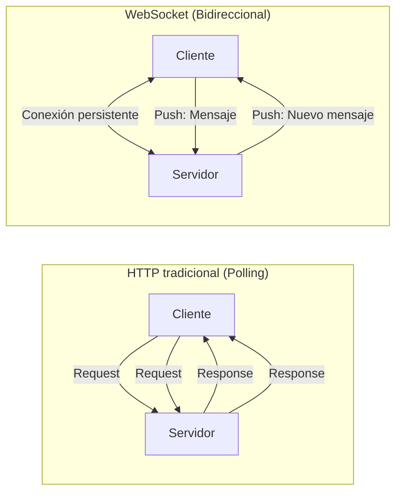
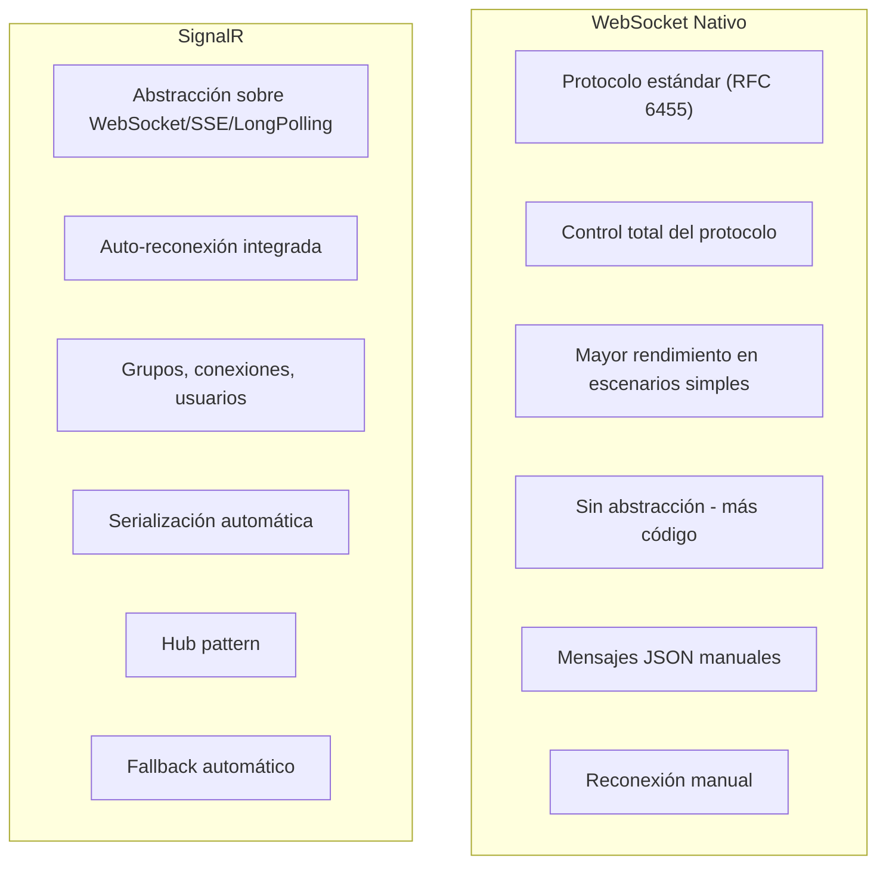
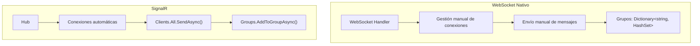
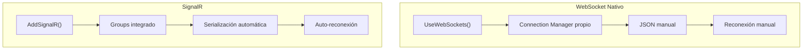
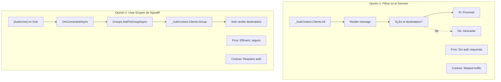
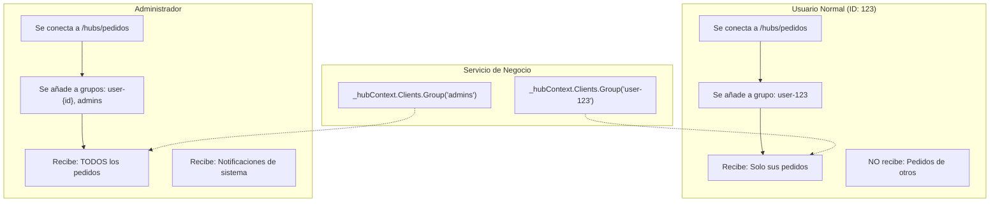

# 20. WebSockets

## Índice

[20. WebSockets y Comunicación en Tiempo Real](#20-websockets-y-comunicacin-en-tiempo-real)
  - [20.1. ¿Qué es la Comunicación en Tiempo Real?](#201-qu-es-la-comunicacin-en-tiempo-real)
  - [20.2. WebSocket vs SignalR - Comparación](#202-websocket-vs-signalr---comparacin)
  - [20.3. Conceptos Básicos](#203-conceptos-bsicos)
  - [20.4. WebSocket Nativo en ASP.NET Core](#204-websocket-nativo-en-aspnet-core)
  - [20.5. Connection Manager](#205-connection-manager)
  - [20.6. WebSocket Handler](#206-websocket-handler)
  - [20.7. Servicio de Notificaciones WebSocket](#207-servicio-de-notificaciones-websocket)
  - [20.8. Integración con Servicios de Negocio](#208-integracin-con-servicios-de-negocio)
  - [20.9. Cliente JavaScript WebSocket](#209-cliente-javascript-websocket)
  - [20.10. SignalR como Alternativa](#2010-signalr-como-alternativa)
  - [20.11. SignalR: Conceptos Fundamentales](#2011-signalr-conceptos-fundamentales)
  - [20.12. SignalR: Servicio de Notificaciones](#2012-signalr-servicio-de-notificaciones)
  - [20.13. SignalR: Integración con Servicios de Negocio](#2013-signalr-integracin-con-servicios-de-negocio)
  - [20.14. SignalR: Cliente JavaScript](#2014-signalr-cliente-javascript)
  - [20.15. SignalR + Identity](#2015-signalr--identity)
  - [20.16. Resumen y Buenas Prácticas](#2016-resumen-y-buenas-prcticas)

---

## 20.1. ¿Qué es la Comunicación en Tiempo Real?

La comunicación en tiempo real permite que el servidor envíe datos a los clientes sin que estos lo soliciten, eliminando el patrón tradicional de request-response.



### ¿Cuándo Usar WebSockets?

| Caso de uso             | Ejemplo                     | Descripción       |
| ----------------------- | --------------------------- | ----------------- |
| **Notificaciones push** | "Tu pedido ha sido enviado" | ✅ WebSocket       |
| **Chat en tiempo real** | Chat de soporte al cliente  | ✅ WebSocket       |
| **Live updates**        | Dashboard de métricas       | ✅ WebSocket       |
| **Colaboración**        | Editores colaborativos      | ✅ WebSocket       |
| **Gaming**              | Multiplayer en tiempo real  | ✅ WebSocket (RAW) |
| **API simple**          | Consultas esporádicas       | ❌ REST            |

---

## 20.2. WebSocket vs SignalR - Comparación

### Diferencias Fundamentales



### Tabla Comparativa

| Aspecto                  | WebSocket Nativo     | SignalR              |
| ------------------------ | -------------------- | -------------------- |
| **Protocolo**            | Solo WebSocket       | WebSocket + fallback |
| **Conexión persistente** | Manual               | Automática           |
| **Grupos**               | Implementar tú       | Integrado            |
| **Reconexión**           | Manual               | Automática           |
| **Serialización**        | JSON manual          | Automática           |
| **Rendimiento**          | ✅ Mejor              | ⚪ Buena              |
| **Simplicidad**          | ⚠️ Más código         | ✅ Más fácil          |
| **Escalabilidad**        | Redis Pub/Sub manual | Redis backplane      |
| **Debugging**            | Más difícil          | Más fácil            |

### Pros y Contras

```mermaid
flowchart TD
    subgraph "WebSocket Nativo - Pros"
        A1["Rendimiento máximo"]
        A2["Control total"]
        A3["Sin dependencias adicionales"]
        A4["Protocolo estándar"]
    end
    
    subgraph "WebSocket Nativo - Contras"
        A5["Más código boilerplate"]
        A6["Reconexión manual"]
        A7["Grupos manuales"]
        A8["Serialización manual"]
    end
    
    subgraph "SignalR - Pros"
        B1["Fácil de usar"]
        B2["Auto-reconexión"]
        B3["Grupos integrados"]
        B4["Type-safe con Hub"]
    end
    
    subgraph "SignalR - Contras"
        B5["Overhead adicional"]
        B6["Dependencia de Microsoft"]
        B7["Menos control"]
        B8["Solo .NET/JS clients"]
    end
    
    A1 --> A2 --> A3 --> A4
    A5 --> A6 --> A7 --> A8
    B1 --> B2 --> B3 --> B4
    B5 --> B6 --> B7 --> B8
```



---

## 20.3. Conceptos Básicos

Antes de implementar, entendamos los conceptos fundamentales:

### 20.3.1. WebSocket Handler

Un **Handler** es una clase que gestiona la conexión WebSocket y el intercambio de mensajes.

```csharp
// ¿Qué es un Handler?
// Es un componente que:
// 1. Acepta conexiones WebSocket
// 2. Recibe mensajes del cliente
// 3. Envía respuestas al cliente
// 4. Maneja la desconexión

public class EchoWebSocketHandler
{
    private readonly WebSocket _webSocket;
    private readonly ILogger<EchoWebSocketHandler> _logger;

    public EchoWebSocketHandler(WebSocket webSocket, ILogger<EchoWebSocketHandler> logger)
    {
        _webSocket = webSocket;
        _logger = logger;
    }

    public async Task HandleAsync()
    {
        var buffer = new byte[1024];

        while (_webSocket.State == WebSocketState.Open)
        {
            var result = await _webSocket.ReceiveAsync(
                new ArraySegment<byte>(buffer),
                CancellationToken.None);

            if (result.MessageType == WebSocketMessageType.Close)
            {
                await _webSocket.CloseAsync(WebSocketCloseStatus.NormalClosure, "Cerrado", CancellationToken.None);
                break;
            }

            // Echo: devuelve el mismo mensaje
            var message = Encoding.UTF8.GetString(buffer, 0, result.Count);
            await _webSocket.SendAsync(
                new ArraySegment<byte>(Encoding.UTF8.GetBytes($"Echo: {message}")),
                WebSocketMessageType.Text,
                true,
                CancellationToken.None);
        }
    }
}
```

### 20.3.2. SignalR Hub

Un **Hub** es una abstracción de nivel superior que SignalR proporciona sobre WebSocket.

```csharp
// ¿Qué es un Hub?
// Es una clase que:
// 1. Gestiona múltiples conexiones automáticamente
// 2. Permite llamar métodos entre cliente y servidor
// 3. Tiene grupos integrados para notificaciones selectivas
// 4. Soporta autenticación y autorización
// 5. Maneja reconexión automática

public class ChatHub : Hub
{
    // Context.ConnectionId - ID único de la conexión
    // Context.User - Usuario autenticado (si aplica)
    // Groups - Gestión de grupos
    // Clients - Referencia a todos los clientes conectados

    public async Task SendMessage(string user, string message)
    {
        // Enviar a todos los clientes
        await Clients.All.SendAsync("ReceiveMessage", user, message);
    }

    public async Task SendToUser(string targetUser, string message)
    {
        // Enviar a un usuario específico (usando grupos)
        await Clients.Group($"user-{targetUser}").SendAsync("PrivateMessage", message);
    }
}
```

### 20.3.3. Comparación Conceptual



---

## 20.4. WebSocket Nativo en ASP.NET Core

### Configuración de WebSockets

```csharp
var builder = WebApplication.CreateBuilder(args);

// Configurar CORS para WebSockets
builder.Services.AddCors(options =>
{
    options.AddPolicy("AllowWebSocketClients", policy =>
    {
        policy.WithOrigins("http://localhost:3000")
              .AllowAnyHeader()
              .AllowAnyMethod()
              .AllowCredentials();
    });
});

var app = builder.Build();

app.UseCors("AllowWebSocketClients");

// Configurar WebSocket middleware
app.UseWebSockets(new WebSocketOptions
{
    KeepAliveInterval = TimeSpan.FromMinutes(2),
    ReceiveBufferSize = 4096
});

// Endpoint WebSocket
app.Map("/ws", async context =>
{
    if (context.WebSocket.IsWebSocketRequest)
    {
        using var webSocket = await context.WebSocket.AcceptWebSocketAsync();
        await HandleWebSocketConnection(webSocket);
    }
    else
    {
        context.Response.StatusCode = StatusCodes.Status400BadRequest;
    }
});

app.Run();
```

---

## 20.5. Connection Manager

```csharp
using System.Collections.Concurrent;
using System.Net.WebSockets;
using System.Text;
using System.Text.Json;

namespace TiendaApi.Core.WebSockets;

public class WebSocketConnectionManager
{
    private readonly ConcurrentDictionary<string, WebSocket> _connections = new();
    private readonly ConcurrentDictionary<string, HashSet<string>> _userConnections = new();

    public string AddConnection(WebSocket webSocket)
    {
        var connectionId = Guid.NewGuid().ToString();
        _connections.TryAdd(connectionId, webSocket);
        return connectionId;
    }

    public void RemoveConnection(string connectionId)
    {
        _connections.TryRemove(connectionId, out _);
        
        foreach (var kvp in _userConnections)
        {
            kvp.Value.Remove(connectionId);
        }
    }

    public async Task SendMessageAsync(string connectionId, string message)
    {
        if (_connections.TryGetValue(connectionId, out var webSocket) && 
            webSocket.State == WebSocketState.Open)
        {
            var bytes = Encoding.UTF8.GetBytes(message);
            await webSocket.SendAsync(
                new ArraySegment<byte>(bytes),
                WebSocketMessageType.Text,
                true,
                CancellationToken.None);
        }
    }

    public async Task BroadcastAsync(string message)
    {
        var tasks = _connections
            .Where(kvp => kvp.Value.State == WebSocketState.Open)
            .Select(kvp => SendMessageAsync(kvp.Key, message));

        await Task.WhenAll(tasks);
    }

    public async Task SendToGroupAsync(string groupName, string message)
    {
        if (_userConnections.TryGetValue(groupName, out var connections))
        {
            var tasks = connections
                .Where(id => _connections.TryGetValue(id, out var ws) && ws.State == WebSocketState.Open)
                .Select(id => SendMessageAsync(id, message));

            await Task.WhenAll(tasks);
        }
    }

    public void AddToGroup(string connectionId, string groupName)
    {
        _userConnections.GetOrAdd(groupName, _ => new HashSet<string>()).Add(connectionId);
    }

    public void RemoveFromGroup(string connectionId, string groupName)
    {
        if (_userConnections.TryGetValue(groupName, out var connections))
        {
            connections.Remove(connectionId);
        }
    }
}

public class WebSocketMessage
{
    public string Type { get; set; } = string.Empty;
    public string? Payload { get; set; }
    public DateTime Timestamp { get; set; } = DateTime.UtcNow;
}
```

---

## 20.6. WebSocket Handler

```csharp
public class WebSocketHandler
{
    private readonly WebSocketConnectionManager _manager;
    private readonly ILogger<WebSocketHandler> _logger;
    private const int BufferSize = 4096;

    public WebSocketHandler(
        WebSocketConnectionManager manager,
        ILogger<WebSocketHandler> logger)
    {
        _manager = manager;
        _logger = logger;
    }

    public async Task HandleWebSocketConnection(WebSocket webSocket)
    {
        var connectionId = _manager.AddConnection(webSocket);
        _logger.LogInformation("WebSocket conectado: {ConnectionId}", connectionId);

        var buffer = new byte[BufferSize];

        try
        {
            while (webSocket.State == WebSocketState.Open)
            {
                var result = await webSocket.ReceiveAsync(
                    new ArraySegment<byte>(buffer),
                    CancellationToken.None);

                if (result.MessageType == WebSocketMessageType.Close)
                {
                    _logger.LogInformation(
                        "WebSocket cerrado: {ConnectionId}, Reason: {Reason}",
                        connectionId, result.CloseStatusDescription);
                    break;
                }

                if (result.MessageType == WebSocketMessageType.Text)
                {
                    var message = Encoding.UTF8.GetString(buffer, 0, result.Count);
                    await ProcessMessageAsync(connectionId, message);
                }
            }
        }
        catch (WebSocketException ex)
        {
            _logger.LogError(ex, "Error en WebSocket: {ConnectionId}", connectionId);
        }
        finally
        {
            _manager.RemoveConnection(connectionId);
            if (webSocket.State == WebSocketState.Open)
            {
                await webSocket.CloseAsync(
                    WebSocketCloseStatus.NormalClosure,
                    "Connection closed",
                    CancellationToken.None);
            }
        }
    }

    private async Task ProcessMessageAsync(string connectionId, string message)
    {
        try
        {
            var wsMessage = JsonSerializer.Deserialize<WebSocketMessage>(
                message, 
                new JsonSerializerOptions { PropertyNameCaseInsensitive = true });

            if (wsMessage == null) return;

            switch (wsMessage.Type.ToLower())
            {
                case "subscribe":
                    await HandleSubscriptionAsync(connectionId, wsMessage.Payload);
                    break;
                    
                case "unsubscribe":
                    await HandleUnsubscriptionAsync(connectionId, wsMessage.Payload);
                    break;
                    
                case "ping":
                    await SendPongAsync(connectionId);
                    break;
                    
                case "message":
                    await BroadcastMessageAsync(wsMessage.Payload);
                    break;
            }
        }
        catch (JsonException ex)
        {
            _logger.LogError(ex, "Error parseando mensaje WebSocket");
        }
    }

    private async Task HandleSubscriptionAsync(string connectionId, string? topic)
    {
        if (string.IsNullOrEmpty(topic)) return;
        
        _manager.AddToGroup(connectionId, topic);
        
        await SendMessageAsync(connectionId, JsonSerializer.Serialize(new
        {
            type = "subscribed",
            topic = topic,
            timestamp = DateTime.UtcNow
        }));
    }

    private async Task HandleUnsubscriptionAsync(string connectionId, string? topic)
    {
        if (string.IsNullOrEmpty(topic)) return;
        
        _manager.RemoveFromGroup(connectionId, topic);
        
        await SendMessageAsync(connectionId, JsonSerializer.Serialize(new
        {
            type = "unsubscribed",
            topic = topic,
            timestamp = DateTime.UtcNow
        }));
    }

    private async Task SendPongAsync(string connectionId)
    {
        await SendMessageAsync(connectionId, JsonSerializer.Serialize(new
        {
            type = "pong",
            timestamp = DateTime.UtcNow
        }));
    }

    private async Task BroadcastMessageAsync(string? payload)
    {
        if (string.IsNullOrEmpty(payload)) return;
        
        await _manager.BroadcastAsync(payload);
    }
}
```

---

## 20.7. Servicio de Notificaciones WebSocket

```csharp
namespace TiendaApi.Core.Services;

public interface IWebSocketNotificationService
{
    Task NotifyPedidoUpdateAsync(long pedidoId, PedidoUpdateDto update);
    Task NotifyProductoStockChangeAsync(long productoId, int nuevoStock);
    Task NotifyUserAsync(long userId, NotificacionDto notificacion);
    Task BroadcastAsync(string message);
}

public class WebSocketNotificationService : IWebSocketNotificationService
{
    private readonly WebSocketConnectionManager _manager;

    public WebSocketNotificationService(WebSocketConnectionManager manager)
    {
        _manager = manager;
    }

    public async Task NotifyPedidoUpdateAsync(long pedidoId, PedidoUpdateDto update)
    {
        var message = JsonSerializer.Serialize(new WebSocketMessage
        {
            Type = "pedido_update",
            Payload = JsonSerializer.Serialize(update),
            Timestamp = DateTime.UtcNow
        });

        await _manager.SendToGroupAsync($"pedido_{pedidoId}", message);
        await _manager.SendToGroupAsync($"user_{update.UsuarioId}", message);
    }

    public async Task NotifyProductoStockChangeAsync(long productoId, int nuevoStock)
    {
        var message = JsonSerializer.Serialize(new WebSocketMessage
        {
            Type = "producto_stock",
            Payload = JsonSerializer.Serialize(new
            {
                productoId,
                stock = nuevoStock
            }),
            Timestamp = DateTime.UtcNow
        });

        await _manager.SendToGroupAsync($"producto_{productoId}", message);
    }

    public async Task NotifyUserAsync(long userId, NotificacionDto notificacion)
    {
        var message = JsonSerializer.Serialize(new WebSocketMessage
        {
            Type = "notificacion",
            Payload = JsonSerializer.Serialize(notificacion),
            Timestamp = DateTime.UtcNow
        });

        await _manager.SendToGroupAsync($"user_{userId}", message);
    }

    public async Task BroadcastAsync(string message)
    {
        await _manager.BroadcastAsync(message);
    }
}
```

---

## 20.8. Integración con Servicios de Negocio

```csharp
public class PedidoService(
    IPedidoRepository pedidoRepository,
    IWebSocketNotificationService notificationService,
    IValidator<CreatePedidoRequest> validator)
{
    public async Task<Result<Pedido, Error>> CreateAsync(CreatePedidoRequest request)
    {
        var validationResult = await validator.ValidateAsync(request);
        if (!validationResult.IsValid)
        {
            return Result.Failure<Pedido, Error>(
                Errors.Pedidos.DatosInvalidos(validationResult.Errors));
        }

        var pedido = new Pedido
        {
            UsuarioId = request.UsuarioId,
            Estado = PedidoEstado.Pendiente,
            CreatedAt = DateTime.UtcNow
        };

        var result = await pedidoRepository.AddAsync(pedido);

        if (result.IsSuccess)
        {
            // Notificar por WebSocket
            await notificationService.NotifyUserAsync(
                request.UsuarioId,
                new NotificacionDto
                {
                    Titulo = "Pedido creado",
                    Mensaje = $"Tu pedido #{pedido.Id} ha sido creado",
                    Tipo = "pedido",
                    Fecha = DateTime.UtcNow
                });
        }

        return result;
    }

    public async Task<Result<Pedido, Error>> UpdateEstadoAsync(long pedidoId, string nuevoEstado)
    {
        var result = await pedidoRepository.UpdateEstadoAsync(pedidoId, nuevoEstado);

        if (result.IsSuccess)
        {
            await notificationService.NotifyPedidoUpdateAsync(
                pedidoId,
                new PedidoUpdateDto
                {
                    PedidoId = pedidoId,
                    Estado = nuevoEstado,
                    FechaActualizacion = DateTime.UtcNow
                });
        }

        return result;
    }
}
```

---

## 20.9. Cliente JavaScript WebSocket

```html
<script>
class WebSocketClient {
    constructor(url) {
        this.url = url;
        this.socket = null;
        this.reconnectInterval = 5000;
        this.maxReconnectAttempts = 10;
        this.reconnectAttempts = 0;
        this.handlers = new Map();
    }

    connect() {
        this.socket = new WebSocket(this.url);

        this.socket.onopen = () => {
            console.log('WebSocket conectado');
            this.reconnectAttempts = 0;
            this.emit('connected');
        };

        this.socket.onmessage = (event) => {
            try {
                const message = JSON.parse(event.data);
                this.handleMessage(message);
            } catch (error) {
                console.error('Error parseando mensaje:', error);
            }
        };

        this.socket.onclose = (event) => {
            console.log('WebSocket cerrado:', event.code, event.reason);
            this.emit('disconnected', event);
            this.scheduleReconnect();
        };

        this.socket.onerror = (error) => {
            console.error('Error WebSocket:', error);
            this.emit('error', error);
        };
    }

    scheduleReconnect() {
        if (this.reconnectAttempts >= this.maxReconnectAttempts) {
            console.error('Máximo intentos de reconexión alcanzados');
            this.emit('maxReconnectAttemptsReached');
            return;
        }

        this.reconnectAttempts++;
        setTimeout(() => this.connect(), this.reconnectInterval);
    }

    handleMessage(message) {
        const handler = this.handlers.get(message.type);
        if (handler) {
            handler(message);
        }
        this.emit('message', message);
    }

    send(type, payload) {
        if (this.socket && this.socket.readyState === WebSocket.OPEN) {
            const message = JSON.stringify({
                type: type,
                payload: payload,
                timestamp: new Date().toISOString()
            });
            this.socket.send(message);
        } else {
            console.warn('WebSocket no conectado');
        }
    }

    subscribe(topic) {
        this.send('subscribe', topic);
    }

    unsubscribe(topic) {
        this.send('unsubscribe', topic);
    }

    on(event, handler) {
        if (!this.handlers.has(event)) {
            this.handlers.set(event, []);
        }
        this.handlers.get(event).push(handler);
    }

    emit(event, data) {
        const handlers = this.handlers.get(event);
        if (handlers) {
            handlers.forEach(handler => handler(data));
        }
    }

    disconnect() {
        if (this.socket) {
            this.socket.close();
        }
    }
}

// Uso
const wsClient = new WebSocketClient('ws://localhost:5000/ws');

wsClient.on('connected', () => {
    wsClient.subscribe('pedido_1');
    wsClient.subscribe('user_123');
});

wsClient.on('pedido_update', (message) => {
    console.log('Pedido actualizado:', message);
});

wsClient.on('notificacion', (message) => {
    console.log('Nueva notificación:', message);
});

wsClient.connect();
</script>
```

---

## 20.10. SignalR como Alternativa

SignalR proporciona una abstracción con características adicionales:

```csharp
// SignalR Hub
public class NotificacionesHub : Hub
{
    public override async Task OnConnectedAsync()
    {
        await base.OnConnectedAsync();
    }

    public async Task SubscribeToPedido(long pedidoId)
    {
        await Groups.AddToGroupAsync(Context.ConnectionId, $"pedido_{pedidoId}");
    }
}

// Configuración SignalR
builder.Services.AddSignalR();
app.MapHub<NotificacionesHub>("/hubs/notificaciones");
```

### Comparación de Implementación



---

## 20.11. SignalR: Conceptos Fundamentales

SignalR proporciona una abstracción sobre WebSocket con características adicionales:

### Componentes Principales

```csharp
// SignalR usa dos componentes principales:

// 1. HUB: Clase que gestiona las conexiones
//    - OnConnectedAsync(): Se ejecuta al conectarse
//    - OnDisconnectedAsync(): Se ejecuta al desconectarse
//    - Métodos invocables por los clientes

// 2. IHubContext: Inyectable en servicios para enviar mensajes
//    - Clients.All: Enviar a todos
//    - Clients.Caller: Enviar al que llama
//    - Clients.Group: Enviar a un grupo
//    - Clients.User: Enviar a un usuario específico
```

### Hub Básico vs Nuestra Implementación

```csharp
// EJEMPLO BáSICO (no lo usamos así en el proyecto)
public class ChatHub : Hub
{
    public async Task SendMessage(string message)
    {
        await Clients.All.SendAsync("ReceiveMessage", message);
    }
}

// NUESTRO PATRá“N (usamos IHubContext en servicios)
[Authorize]
public class PedidosHub : Hub
{
    // Solo gestionamos conexión y grupos aquí
    public override async Task OnConnectedAsync()
    {
        var userId = Context.User?.FindFirst(ClaimTypes.NameIdentifier)?.Value;
        var isAdmin = Context.User?.IsInRole("Admin") == true;

        // Añadir a grupos según identidad
        if (userId != null)
            await Groups.AddToGroupAsync(Context.ConnectionId, $"user-{userId}");
        if (isAdmin)
            await Groups.AddToGroupAsync(Context.ConnectionId, "admins");

        await base.OnConnectedAsync();
    }
}

// El servicio usa IHubContext para enviar mensajes (fire & forget)
public class PedidoService
{
    private readonly IHubContext<PedidosHub> _hubContext;

    public PedidoService(IHubContext<PedidosHub> hubContext)
    {
        _hubContext = hubContext;
    }

    public async Task CreatePedidoAsync(Pedido pedido)
    {
        await _repository.SaveAsync(pedido);

        // Notificar SOLO al usuario (desde el servicio)
        await _hubContext.Clients
            .Group($"user-{pedido.UsuarioId}")
            .SendAsync("PedidoCreado", new { pedido.Id, estado = "Pendiente" });

        // Notificar a TODOS los admins
        await _hubContext.Clients
            .Group("admins")
            .SendAsync("NuevoPedido", new { pedido.Id, total = pedido.Total });
    }
}
```

### Comparación: Filtrar en Servicio vs Usar Identity



| Enfoque                 | Cuándo Usarlo                            | Ejemplo                             |
| ----------------------- | ---------------------------------------- | ----------------------------------- |
| **Filtrar en servicio** | Cuando no hay autenticación, público     | Notificaciones de productos a todos |
| **Grupos con Identity** | Cuando hay auth, notificaciones privadas | Pedidos, mensajes directos          |
| **Grupos sin auth**     | Usuario auto-identificado                | Salas de chat, suscripciones        |

### Nuestra Estrategia

```csharp
// En el proyecto usamos una combinación:

// 1. Hubs públicos (sin auth) - broadcast a todos
[AllowAnonymous]
public class ProductosHub : Hub
{
    public override async Task OnConnectedAsync()
    {
        await Clients.All.SendAsync("UsuarioConectado", Context.ConnectionId);
        await base.OnConnectedAsync();
    }
}

// 2. Hubs privados (con auth) - grupos selectivos
[Authorize]
public class PedidosHub : Hub
{
    public override async Task OnConnectedAsync()
    {
        var userId = Context.User.FindFirstValue(ClaimTypes.NameIdentifier);
        await Groups.AddToGroupAsync(Context.ConnectionId, $"user-{userId}");

        if (Context.User.IsInRole("Admin"))
            await Groups.AddToGroupAsync(Context.ConnectionId, "admins");

        await base.OnConnectedAsync();
    }
}

// 3. Servicios usan IHubContext para enviar
public class PedidoService
{
    private readonly IHubContext<PedidosHub> _hubContext;

    public async Task CreateAsync(Pedido pedido)
    {
        await _repository.SaveAsync(pedido);

        // ¡TRUCO! - Notificación selectiva sin que el cliente haga nada
        await _hubContext.Clients
            .Group($"user-{pedido.UsuarioId}")  // Solo este usuario
            .SendAsync("PedidoCreado", new { ... });
    }
}
```

### Configuración del Hub

```csharp
var builder = WebApplication.CreateBuilder(args);

builder.Services.AddSignalR();

builder.Services.AddCors(options =>
{
    options.AddPolicy("AllowSignalR", policy =>
    {
        policy.WithOrigins("http://localhost:3000")
              .AllowAnyHeader()
              .AllowAnyMethod()
              .AllowCredentials();
    });
});

var app = builder.Build();

app.UseCors("AllowSignalR");

app.MapHub<NotificacionesHub>("/hubs/notificaciones");

app.Run();
```

---

## 20.11. SignalR: Servicio de Notificaciones

En lugar de crear un servicio de notificaciones separado, en nuestro proyecto usamos `IHubContext` directamente inyectado en los servicios de negocio. Esto es más simple y directo:

```csharp
// PATRá“N DEL PROYECTO: IHubContext directamente en servicios

public class ProductoService
{
    private readonly IHubContext<ProductosHub> _hubContext;
    private readonly ILogger<ProductoService> _logger;

    public ProductoService(
        IProductoRepository productoRepository,
        IHubContext<ProductosHub> hubContext,
        ILogger<ProductoService> logger)
    {
        _hubContext = hubContext;
        _logger = logger;
    }

    public async Task<ProductoDto> CreateAsync(ProductoRequestDto dto)
    {
        var producto = await _repository.SaveAsync(dto.ToEntity());
        var resultDto = producto.ToDto();

        // Fire & forget - notificar a todos los clientes conectados
        _ = Task.Run(async () =>
        {
            try
            {
                await _hubContext.Clients.All.SendAsync("ProductoCreado", new
                {
                    productoId = resultDto.Id,
                    nombre = resultDto.Nombre,
                    tipo = "PRODUCTO_CREADO",
                    timestamp = DateTime.UtcNow
                });
                _logger.LogDebug("Notificación SignalR enviada");
            }
            catch (Exception ex)
            {
                _logger.LogWarning(ex, "Error en notificación SignalR");
            }
        });

        return resultDto;
    }

    public async Task UpdateAsync(long id, ProductoRequestDto dto)
    {
        var producto = await _repository.UpdateAsync(id, dto);
        var resultDto = producto.ToDto();

        // Notificar actualización a todos
        _ = Task.Run(async () =>
        {
            await _hubContext.Clients.All.SendAsync("ProductoActualizado", new
            {
                productoId = resultDto.Id,
                nombre = resultDto.Nombre,
                stock = resultDto.Stock,
                tipo = "PRODUCTO_ACTUALIZADO",
                timestamp = DateTime.UtcNow
            });
        });

        return resultDto;
    }

    public async Task DeleteAsync(long id)
    {
        await _repository.DeleteAsync(id);

        // Notificar eliminación a todos
        _ = Task.Run(async () =>
        {
            await _hubContext.Clients.All.SendAsync("ProductoEliminado", new
            {
                productoId = id,
                tipo = "PRODUCTO_ELIMINADO",
                timestamp = DateTime.UtcNow
            });
        });
    }
}

public class PedidoService
{
    private readonly IHubContext<PedidosHub> _hubContext;
    private readonly ILogger<PedidoService> _logger;

    public PedidoService(
        IPedidoRepository pedidoRepository,
        IHubContext<PedidosHub> hubContext,
        ILogger<PedidoService> logger)
    {
        _hubContext = hubContext;
        _logger = logger;
    }

    public async Task<PedidoDto> CreateAsync(CreatePedidoRequest request)
    {
        var pedido = await _repository.SaveAsync(request.ToEntity());

        // 🚀 TRUCO: Notificar SOLO al usuario (grupo: user-{id})
        // El usuario ya está en este grupo gracias a OnConnectedAsync en el Hub
        await _hubContext.Clients
            .Group($"user-{request.UsuarioId}")
            .SendAsync("PedidoCreado", new
            {
                pedidoId = pedido.Id,
                estado = pedido.Estado,
                total = pedido.Total,
                timestamp = DateTime.UtcNow
            });

        // 🚀 TRUCO: Notificar a TODOS los administradores
        await _hubContext.Clients
            .Group("admins")
            .SendAsync("NuevoPedido", new
            {
                pedidoId = pedido.Id,
                usuarioId = request.UsuarioId,
                total = pedido.Total
            });

        return pedido.ToDto();
    }

    public async Task UpdateEstadoAsync(long pedidoId, string nuevoEstado, long usuarioId)
    {
        var pedido = await _repository.UpdateEstadoAsync(pedidoId, nuevoEstado);

        // Notificar al usuario específico
        await _hubContext.Clients
            .Group($"user-{usuarioId}")
            .SendAsync("PedidoEstadoActualizado", new
            {
                pedidoId,
                estado = nuevoEstado,
                timestamp = DateTime.UtcNow
            });

        // Notificar a admins
        await _hubContext.Clients
            .Group("admins")
            .SendAsync("PedidoActualizado", new
            {
                pedidoId,
                estado = nuevoEstado,
                timestamp = DateTime.UtcNow
            });
    }
}
```

### Inyección de Dependencias

```csharp
// Program.cs - SignalR registra automaticamente IHubContext<T>
// ¡No se necesita configuración adicional!

var builder = WebApplication.CreateBuilder(args);

// SignalR se configura así:
builder.Services.AddSignalR();

// No es necesario AddSingleton<IHubContext<T>> - ya viene incluido

var app = builder.Build();

app.MapHub<ProductosHub>("/hubs/productos");
app.MapHub<PedidosHub>("/hubs/pedidos");

app.Run();

// El servicio recibe IHubContext<T> automáticamente por DI
public class MiServicio
{
    public MiServicio(IHubContext<ProductosHub> hubContext) { }
}
```

### Resumen: Patrón del Proyecto

| Escenario           | Hub                | Cliente  | Envío desde Servicio                     |
| ------------------- | ------------------ | -------- | ---------------------------------------- |
| **Productos**       | `[AllowAnonymous]` | Sin auth | `_hubContext.Clients.All`                |
| **Pedidos usuario** | `[Authorize]`      | JWT      | `_hubContext.Clients.Group("user-{id}")` |
| **Pedidos admin**   | `[Authorize]`      | JWT      | `_hubContext.Clients.Group("admins")`    |

---

## 20.12. SignalR: Integración con Servicios de Negocio

```csharp
public class PedidoService(
    IPedidoRepository pedidoRepository,
    ISignalRNotificationService notificationService,
    IValidator<CreatePedidoRequest> validator)
{
    public async Task<Result<Pedido, Error>> CreateAsync(CreatePedidoRequest request)
    {
        var validationResult = await validator.ValidateAsync(request);
        if (!validationResult.IsValid)
        {
            return Result.Failure<Pedido, Error>(
                Errors.Pedidos.DatosInvalidos(validationResult.Errors));
        }

        var pedido = new Pedido
        {
            UsuarioId = request.UsuarioId,
            Estado = PedidoEstado.Pendiente,
            CreatedAt = DateTime.UtcNow
        };

        var result = await pedidoRepository.AddAsync(pedido);

        if (result.IsSuccess)
        {
            // Notificar por SignalR
            await notificationService.NotifyUserAsync(
                request.UsuarioId,
                new NotificacionDto
                {
                    Titulo = "Pedido creado",
                    Mensaje = $"Tu pedido #{pedido.Id} ha sido creado",
                    Tipo = "pedido",
                    Fecha = DateTime.UtcNow
                });
        }

        return result;
    }

    public async Task<Result<Pedido, Error>> UpdateEstadoAsync(long pedidoId, string nuevoEstado)
    {
        var pedidoResult = await pedidoRepository.GetByIdAsync(pedidoId);
        if (pedidoResult.IsFailure)
        {
            return pedidoResult;
        }

        var result = await pedidoRepository.UpdateEstadoAsync(pedidoId, nuevoEstado);

        if (result.IsSuccess)
        {
            await notificationService.NotifyPedidoUpdateAsync(
                pedidoId,
                new PedidoUpdateDto
                {
                    PedidoId = pedidoId,
                    Estado = nuevoEstado,
                    UsuarioId = pedidoResult.Value.UsuarioId,
                    FechaActualizacion = DateTime.UtcNow
                });
        }

        return result;
    }
}
```

---

## 20.13. SignalR: Cliente JavaScript

```html
<script src="https://cdnjs.cloudflare.com/ajax/libs/microsoft-signalr/8.0.0/signalr.min.js"></script>
<script>
class SignalRClient {
    constructor(url, userId) {
        this.url = url;
        this.userId = userId;
        this.connection = null;
        this.handlers = new Map();
    }

    async connect() {
        this.connection = new signalR.HubConnectionBuilder()
            .withUrl(`${this.url}?userId=${this.userId}`, {
                accessTokenFactory: () => this.getAuthToken(),
                transport: signalR.HttpTransportType.WebSockets,
                skipNegotiation: false
            })
            .withAutomaticReconnect([0, 1000, 5000, 10000, 30000])
            .configureLogging(signalR.LogLevel.Information)
            .build();

        this.connection.onclose((error) => {
            console.log('SignalR desconectado:', error);
            this.emit('disconnected', error);
        });

        this.connection.onreconnecting((error) => {
            console.log('SignalR reconectando...');
            this.emit('reconnecting', error);
        });

        this.connection.onreconnected((connectionId) => {
            console.log('SignalR reconectado:', connectionId);
            this.emit('reconnected', connectionId);
        });

        await this.connection.start();
        console.log('SignalR conectado');

        this.emit('connected');
    }

    getAuthToken() {
        // Obtener JWT token
        return localStorage.getItem('authToken');
    }

    on(event, handler) {
        this.connection.on(event, (data) => {
            handler(data);
            this.emit(event, data);
        });
    }

    off(event, handler) {
        if (handler) {
            this.connection.off(event, handler);
        } else {
            this.connection.off(event);
        }
    }

    async subscribeToPedido(pedidoId) {
        await this.connection.invoke("SubscribeToPedido", pedidoId);
    }

    async unsubscribeFromPedido(pedidoId) {
        await this.connection.invoke("UnsubscribeFromPedido", pedidoId);
    }

    async subscribeToProducto(productoId) {
        await this.connection.invoke("SubscribeToProducto", productoId);
    }

    async subscribeToCategoria(categoriaId) {
        await this.connection.invoke("SubscribeToCategoria", categoriaId);
    }

    emit(event, data) {
        const handlers = this.handlers.get(event);
        if (handlers) {
            handlers.forEach(handler => handler(data));
        }
    }

    onEvent(event, handler) {
        if (!this.handlers.has(event)) {
            this.handlers.set(event, []);
        }
        this.handlers.get(event).push(handler);
    }

    async disconnect() {
        await this.connection.stop();
    }
}

// Uso
const client = new SignalRClient(
    'http://localhost:5000/hubs/notificaciones',
    '123'
);

client.onEvent('connected', () => {
    console.log('Conectado!');
    client.subscribeToPedido(1);
    client.subscribeToUser('123');
});

client.onEvent('pedido_update', (message) => {
    console.log('Pedido actualizado:', message);
});

client.onEvent('notificacion', (message) => {
    console.log('Nueva notificación:', message);
});

client.connect();
</script>
```

---

## 20.14. SignalR + Identity: Autenticación y Autorización

SignalR se integra nativamente con el sistema de autenticación de ASP.NET Core Identity, permitiendo proteger los hubs y endpoints con JWT.

### Protección de Hubs con [Authorize]

```csharp
using Microsoft.AspNetCore.Authorization;
using Microsoft.AspNetCore.SignalR;
using System.Security.Claims;

[Authorize]  // Requiere autenticación JWT
public class PedidosHub : Hub
{
    private readonly IHubContext<PedidosHub> _hubContext;
    private readonly ILogger<PedidosHub> _logger;

    public PedidosHub(IHubContext<PedidosHub> hubContext, ILogger<PedidosHub> logger)
    {
        _hubContext = hubContext;
        _logger = logger;
    }

    public override async Task OnConnectedAsync()
    {
        var userId = Context.User?.FindFirst(ClaimTypes.NameIdentifier)?.Value;
        var isAdmin = Context.User?.IsInRole("Admin") == true;

        // Añadir automáticamente a grupos según identidad
        if (userId != null)
        {
            await Groups.AddToGroupAsync(Context.ConnectionId, $"user-{userId}");
        }

        if (isAdmin)
        {
            await Groups.AddToGroupAsync(Context.ConnectionId, "admins");
        }

        await base.OnConnectedAsync();
    }
}

// Hub público sin autenticación
[AllowAnonymous]
public class ProductosHub : Hub
{
    // Anyone puede conectarse y recibir broadcasts
}
```

### Configuración con JWT

```csharp
// Program.cs
builder.Services.AddSignalR();

// Client JavaScript con accessTokenFactory
const connection = new signalR.HubConnectionBuilder()
    .withUrl("/hubs/pedidos", {
        accessTokenFactory: () => localStorage.getItem('jwtToken'),
        transport: signalR.HttpTransportType.WebSockets
    })
    .withAutomaticReconnect([0, 1000, 5000, 10000])
    .build();

await connection.start();
```

### El Truco de Grupos para Notificaciones Selectivas

El patrón más poderoso de SignalR es usar grupos para enviar mensajes solo a usuarios específicos:

```csharp
// Servicio de notificaciones
public class SignalRNotificationService
{
    private readonly IHubContext<PedidosHub> _hubContext;

    public SignalRNotificationService(IHubContext<PedidosHub> hubContext)
    {
        _hubContext = hubContext;
    }

    // 🚀 TRUCO: Notificar SOLO al usuario específico
    public async Task NotifyUserAsync(long userId, object message)
    {
        await _hubContext.Clients
            .Group($"user-{userId}")  // <- Grupo mágico
            .SendAsync("Notificacion", message);
    }

    // 🚀 TRUCO: Notificar SOLO a administradores
    public async Task NotifyAdminsAsync(object message)
    {
        await _hubContext.Clients
            .Group("admins")  // <- Grupo de admins
            .SendAsync("AdminNotification", message);
    }

    // Broadcast a todos
    public async Task BroadcastAsync(string eventName, object message)
    {
        await _hubContext.Clients.All.SendAsync(eventName, message);
    }
}
```

### Patrón de Grupos Automáticos

En `OnConnectedAsync`, añade usuarios a grupos según su Claims:

```csharp
public override async Task OnConnectedAsync()
{
    var userId = Context.User?.FindFirst(ClaimTypes.NameIdentifier)?.Value;
    var userRole = Context.User?.FindFirst(ClaimTypes.Role)?.Value;

    // Grupo por ID de usuario - recibe solo sus notificaciones
    if (userId != null)
    {
        await Groups.AddToGroupAsync(Context.ConnectionId, $"user-{userId}");
    }

    // Grupo por rol - admins reciben todas las notificaciones
    if (userRole == "Admin")
    {
        await Groups.AddToGroupAsync(Context.ConnectionId, "admins");
    }

    // Grupo por tipo de usuario
    var isPremium = Context.User?.HasClaim("subscription", "premium") == true;
    if (isPremium)
    {
        await Groups.AddToGroupAsync(Context.ConnectionId, "premium-users");
    }

    await base.OnConnectedAsync();
}
```

### Envío desde Servicios de Negocio

```csharp
public class PedidoService
{
    private readonly IHubContext<PedidosHub> _hubContext;
    private readonly ILogger<PedidoService> _logger;

    public async Task<Result<Pedido>> CreateAsync(CreatePedidoRequest request)
    {
        var pedido = await _repository.AddAsync(request);

        // 🚀 Notificar SOLO al usuario que hizo el pedido
        await _hubContext.Clients
            .Group($"user-{request.UsuarioId}")
            .SendAsync("PedidoCreado", new
            {
                pedidoId = pedido.Id,
                estado = "Pendiente",
                total = pedido.Total,
                timestamp = DateTime.UtcNow
            });

        // 🚀 Notificar a TODOS los administradores
        await _hubContext.Clients
            .Group("admins")
            .SendAsync("NuevoPedido", new
            {
                pedidoId = pedido.Id,
                usuarioId = request.UsuarioId,
                total = pedido.Total
            });

        return pedido;
    }

    public async Task UpdateEstadoAsync(long pedidoId, string nuevoEstado, long usuarioId)
    {
        await _repository.UpdateEstadoAsync(pedidoId, nuevoEstado);

        // Notificar al usuario específico
        await _hubContext.Clients
            .Group($"user-{usuarioId}")
            .SendAsync("PedidoEstadoActualizado", new
            {
                pedidoId,
                estado = nuevoEstado,
                timestamp = DateTime.UtcNow
            });
    }
}
```

### Ventajas del Sistema de Grupos



### Tabla de Grupos y sus Usos

| Grupo           | miembros           | Uso                     | Ejemplo de Notificación      |
| --------------- | ------------------ | ----------------------- | ---------------------------- |
| `user-{id}`     | 1 usuario          | Notificaciones privadas | "Tu pedido #123 fue enviado" |
| `admins`        | Todos los admins   | Panel de administración | "Nuevo pedido: #456"         |
| `premium-users` | Usuarios premium   | Contenido exclusivo     | "Oferta especial para ti"    |
| `pedido-{id}`   | Comprador + admins | Seguimiento de pedido   | "Pedido #123: En camino"     |

---

## 20.15. SignalR: Persistencia y Escalabilidad

Para escalar SignalR en múltiples instancias, usar Redis Backplane:

```csharp
// Instalación
dotnet add package Microsoft.AspNetCore.SignalR.StackExchangeRedis

// Configuración
builder.Services.AddSignalR()
    .AddStackExchangeRedis(options =>
    {
        options.ConnectionFactory = async writer =>
        {
            var config = new ConfigurationOptions
            {
                EndPoints = { { "localhost", 6379 } },
                AbortOnConnectFail = false
            };

            var connection = await ConnectionMultiplexer.ConnectAsync(config);
            return connection;
        };
    });
```

### Comparación WebSocket Nativo vs SignalR

```mermaid
flowchart TD
    subgraph "WebSocket Nativo - Ejemplo Completo"
        A1["Connection Manager<br/>(50+ líneas)"]
        A2["JSON Manual<br/>Serialize/Deserialize"]
        A3["Reconexión Manual<br/>setTimeout + retry"]
        A4["Grupos Manual<br/>HashSet&lt;string&gt;"]
        A5["~200+ líneas código"]
    end
    
    subgraph "SignalR - Ejemplo Equivalente"
        B1["Hub base<br/>(20 líneas)"]
        B2["Serialización Auto<br/>[FromArgs], typed"]
        B3["Auto-reconexión<br/>(configurable)"]
        B4["Groups.AddToGroupAsync<br/>(1 línea)"]
        B5["~80 líneas código"]
    end
    
    A1 --> A2 --> A3 --> A4 --> A5
    B1 --> B2 --> B3 --> B4 --> B5
```



### Cuándo Usar WebSocket Nativo vs SignalR

| Funcionalidad             | WebSocket Nativo      | SignalR                      |
| ------------------------- | --------------------- | ---------------------------- |
| **Gestión de conexiones** | Manual (~50 líneas)   | Automática (0 líneas)        |
| **Grupos**                | Dictionary manual     | Groups.AddToGroupAsync()     |
| **Serialización**         | JsonSerializer manual | Automático con tipos         |
| **Reconexión**            | setTimeout + retry    | AutoReconnect (configurable) |
| **Typed messages**        | String + switch case  | Generic SendAsync<T>()       |
| **Autenticación**         | JWT header manual     | accessTokenFactory           |
| **Autorización**          | Manual con middleware | [Authorize] integrado        |
| **Identity Integration**  | No nativo             | Total con Claims             |
| **Escalabilidad**         | Redis Pub/Sub manual  | Redis Backplane integrado    |
| **Fallback**              | No disponible         | SSE/LongPolling automático   |
| **Debugging**             | Más difícil           | Logging integrado            |
| **Líneas de código**      | ~200-300              | ~80-100                      |

---

## 20.16. Resumen y Buenas Prácticas

### Cuándo Usar Qué

| Escenario       | Recomendación    | Razón              |
| --------------- | ---------------- | ------------------ |
| Chat simple     | WebSocket nativo | Menos overhead     |
| Chat complejo   | SignalR          | Groups, history    |
| Notificaciones  | SignalR          | Auto-reconexión    |
| Gaming          | WebSocket nativo | Máximo rendimiento |
| Dashboard       | SignalR          | Facilidad          |
| Notif. privadas | SignalR + Groups | user-{id}, admins  |

---

### Siguientes Pasos

Con comunicación en tiempo real dominada, el siguiente paso es aprender sobre logging y monitoreo.

### Recursos Adicionales

- WebSocket API: https://docs.microsoft.com/aspnet/core/fundamentals/websockets
- SignalR: https://docs.microsoft.com/aspnet/core/signalr
- WebSocket Protocol RFC: https://tools.ietf.org/html/rfc6455
- SignalR Authentication: https://docs.microsoft.com/aspnet/core/signalr/authn-and-authz
- SignalR Groups: https://docs.microsoft.com/aspnet/core/signalr/groups
- Redis Backplane: https://docs.microsoft.com/aspnet/core/signalr/redis-backplane
