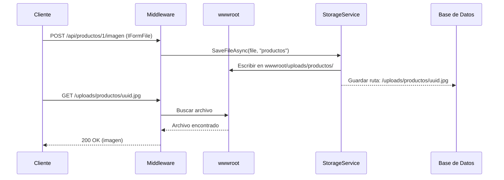
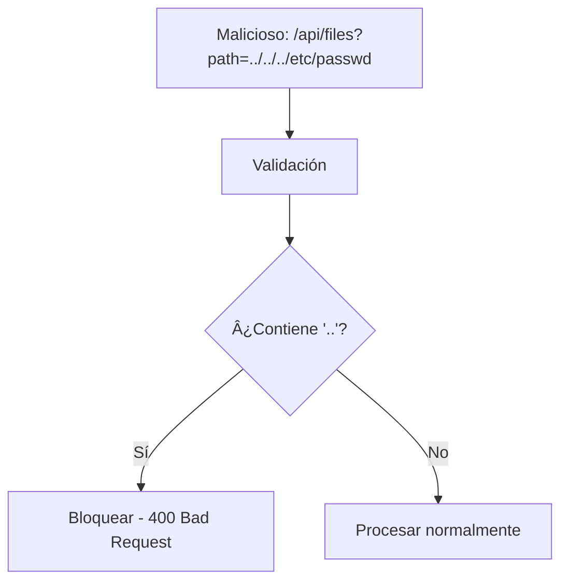
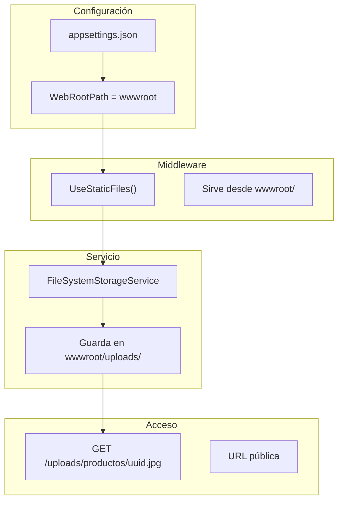

# 22. File Storage

## Índice

[22. File Storage: Almacenamiento de Archivos](#22-file-storage-almacenamiento-de-archivos)
  - [22.1. Conceptos Fundamentales de Archivos Estáticos](#221-conceptos-fundamentales-de-archivos-estticos)
  - [22.2. Configuración de wwwroot en Program.cs](#222-configuracin-de-wwwroot-en-programcs)
  - [22.3. UseStaticFiles: Configuración Avanzada](#223-usestaticfiles-configuracin-avanzada)
  - [22.4. IStorageService: Interfaz del Proyecto](#224-istorageservice-interfaz-del-proyecto)
  - [22.5. FileSystemStorageService: Implementación](#225-filesystemstorageservice-implementacin)
  - [22.6. Controlador de Archivos](#226-controlador-de-archivos)
  - [22.7. Controlador de Productos con Imágenes](#227-controlador-de-productos-con-imgenes)
  - [22.8. Seguridad: Path Traversal](#228-seguridad-path-traversal)
  - [22.9. Configuración de Producción](#229-configuracin-de-produccin)
  - [22.10. Resumen](#2210-resumen)

---

## 22.1. Conceptos Fundamentales de Archivos Estáticos

En ASP.NET Core, los **archivos estáticos** son aquellos que se sirven directamente al cliente sin procesamiento adicional: imágenes, CSS, JavaScript, archivos subidos por usuarios, etc. El middleware `UseStaticFiles` permite servir estos archivos desde el directorio `wwwroot`.

```mermaid
flowchart LR
    subgraph "Estructura del Proyecto"
        A1["TiendaApi.Apis/"]
        A2["├── wwwroot/"]
        A3["│   ├── images/"]
        A4["│   │   └── productos/"]
        A5["│   └── uploads/"]
        A6["├── Services/"]
        A7["│   └── Storage/"]
        A8["└── Program.cs"]
    end
    
    subgraph "Solicitud HTTP"
        B1["GET /images/productos/foto.jpg"]
        B2["Middleware StaticFiles"]
        B3["Busca en wwwroot/"]
    end
    
    B1 --> B2 --> B3
```



### Flujo de Archivos en el Proyecto



---

## 22.2. Configuración de wwwroot en Program.cs

El directorio `wwwroot` es el directorio predeterminado para archivos estáticos en ASP.NET Core. Se configura automáticamente cuando creas un proyecto web.

### Estructura del wwwroot en el Proyecto

```
TiendaApi.Apis/wwwroot/
├── images/
│   └── productos/          # Imágenes de productos
└── uploads/                # Archivos subidos por usuarios
    ├── productos/
    ├── usuarios/
    └── categorias/
```

### Configuración en Program.cs


```csharp
// Archivos estáticos (wwwroot)
Log.Information("🖼️ Habilitando archivos estáticos desde wwwroot...");
app.UseStaticFiles();
```

El método `UseStaticFiles()` habilita el middleware que sirve archivos desde `wwwroot`. Sin este middleware, los archivos en `wwwroot` no serían accesibles vía HTTP.

### Inicialización del Directorio de Storage


```csharp
var storagePath = System.IO.Path.Combine(
    app.Environment.WebRootPath,  // Apunta a wwwroot
    builder.Configuration["Storage:UploadPath"] ?? "uploads");

if (isDevelopment)
{
    // Desarrollo: Limpiar y crear directorio
    if (storageDirectory.Exists)
    {
        foreach (var file in storageDirectory.GetFiles())
            file.Delete();
        foreach (var dir in storageDirectory.GetDirectories())
            dir.Delete(true);
    }
    if (!storageDirectory.Exists)
        storageDirectory.Create();
}
else
{
    // Producción: Solo crear si no existe
    if (!storageDirectory.Exists)
        storageDirectory.Create();
}
```

### Configuración en appsettings.json

```json
{
  "Storage": {
    "UploadPath": "uploads",
    "MaxFileSize": 5242880,
    "AllowedExtensions": [".jpg", ".jpeg", ".png", ".gif", ".webp"],
    "AllowedContentTypes": ["image/jpeg", "image/png", "image/gif", "image/webp"]
  }
}
```

---

## 22.3. UseStaticFiles: Configuración Avanzada

### Configuración Básica

```csharp
app.UseStaticFiles();  // Habilita archivos estáticos
```

### Configuración con Opciones Personalizadas

```csharp
using Microsoft.AspNetCore.StaticFiles;

var provider = new FileExtensionContentTypeProvider();
provider.Mappings[".webp"] = "image/webp";
provider.Mappings[".svg"] = "image/svg+xml";

app.UseStaticFiles(new StaticFileOptions
{
    FileProvider = new PhysicalFileProvider(
        Path.Combine(builder.Environment.ContentRootPath, "wwwroot")),
    RequestPath = "/static",
    ServeUnknownFileTypes = false,
    DefaultContentType = "application/octet-stream",
    ContentTypeProvider = provider,
    OnPrepareResponse = context =>
    {
        // Headers de cache
        context.Context.Response.Headers["Cache-Control"] = 
            "public, max-age=31536000";
    }
});
```

### Configuración para el Directorio de Uploads

```csharp
// Servir archivos desde wwwroot/uploads
app.UseStaticFiles(new StaticFileOptions
{
    FileProvider = new PhysicalFileProvider(
        Path.Combine(app.Environment.WebRootPath, "uploads")),
    RequestPath = "/uploads",
    OnPrepareResponse = context =>
    {
        // No cachear archivos de usuarios
        context.Context.Response.Headers["Cache-Control"] = "no-cache";
    }
});
```

### Diferencia entre WebRootPath y ContentRootPath

| Propiedad           | Descripción       | Uso                         |
| ------------------- | ----------------- | --------------------------- |
| **WebRootPath**     | Ruta a `wwwroot`  | Archivos estáticos públicos |
| **ContentRootPath** | Raíz del proyecto | Configuración, logs         |

```csharp
// En Program.cs
Console.WriteLine($"WebRootPath: {app.Environment.WebRootPath}");
// Salida: C:\...\TiendaApi.Apis\wwwroot

Console.WriteLine($"ContentRootPath: {app.Environment.ContentRootPath}");
// Salida: C:\...\TiendaApi.Apis
```

---

## 22.4. IStorageService: Interfaz del Proyecto

Del archivo `IStorageService.cs`:

```csharp
namespace TiendaApi.Apis.Services.Storage;

public interface IStorageService
{
    Task<Result<string, DomainError>> SaveFileAsync(IFormFile file, string folder);
    Task<Result<bool, DomainError>> DeleteFileAsync(string filename);
    bool FileExists(string filename);
    string GetFullPath(string filename);
    string GetRelativePath(string filename, string folder = "productos");
}
```

### Documentación de la Interfaz

| Método            | Descripción                                   | Retorno                       |
| ----------------- | --------------------------------------------- | ----------------------------- |
| `SaveFileAsync`   | Guarda un archivo y devuelve la ruta relativa | `Result<string, DomainError>` |
| `DeleteFileAsync` | Elimina un archivo                            | `Result<bool, DomainError>`   |
| `FileExists`      | Verifica si existe un archivo                 | `bool`                        |
| `GetFullPath`     | Obtiene la ruta física completa               | `string`                      |
| `GetRelativePath` | Genera ruta relativa para BD                  | `string`                      |

### Estructura de Carpetas Recomendada

```
wwwroot/uploads/
├── productos/          # Imágenes de productos
├── usuarios/           # Avatares y documentos
├── categorias/         # Imágenes de categorías
└── documentos/         # Documentos varios
```

---

## 22.5. FileSystemStorageService: Implementación

Del archivo `FileSystemStorageService.cs`:

### Constructor e Inicialización

```csharp
public class FileSystemStorageService : IStorageService
{
    private readonly string _rootPath;
    private readonly string _uploadPath;
    private readonly long _maxFileSize;
    private readonly string[] _allowedExtensions;
    private readonly string[] _allowedContentTypes;
    private readonly ILogger<FileSystemStorageService> _logger;

    public FileSystemStorageService(
        IConfiguration configuration, 
        ILogger<FileSystemStorageService> logger, 
        IWebHostEnvironment env)
    {
        _logger = logger;

        // Configuración desde appsettings.json
        _uploadPath = configuration["Storage:UploadPath"] ?? "uploads";
        _maxFileSize = configuration.GetValue<long>("Storage:MaxFileSize", 5 * 1024 * 1024);
        _allowedExtensions = configuration.GetSection("Storage:AllowedExtensions")
            .Get<string[]>() ?? [".jpg", ".jpeg", ".png", ".gif"];
        _allowedContentTypes = configuration.GetSection("Storage:AllowedContentTypes")
            .Get<string[]>() ?? ["image/jpeg", "image/png", "image/gif"];

        // Ruta absoluta usando WebRootPath (wwwroot)
        _rootPath = System.IO.Path.Combine(env.WebRootPath, _uploadPath);

        // Crear directorio si no existe
        if (!Directory.Exists(_rootPath))
        {
            Directory.CreateDirectory(_rootPath);
        }

        _logger.LogInformation("Storage service inicializado en: {Path}", _rootPath);
    }
}
```

### Generación de Nombre ášnico

```csharp
private static string GenerateUniqueFilename(string originalFilename)
{
    var extension = System.IO.Path.GetExtension(originalFilename).ToLowerInvariant();
    var timestamp = DateTime.UtcNow.ToString("yyyyMMddHHmmss");
    var uniqueId = Guid.NewGuid().ToString("N")[..8];
    var sanitizedName = System.IO.Path.GetFileNameWithoutExtension(originalFilename)
        .Replace(" ", "_")
        .Replace("-", "_");
    
    return $"{timestamp}_{uniqueId}_{sanitizedName}{extension}";
}

// Ejemplo: "20250116143045_abc12345_producto_foto.jpg"
```

### Guardar Archivo

```csharp
public Task<Result<string, DomainError>> SaveFileAsync(IFormFile file, string folder)
{
    var validation = ValidateFile(file);
    if (validation.IsFailure)
    {
        return Task.FromResult(Result.Failure<string, DomainError>(validation.Error));
    }

    try
    {
        // Generar nombre único
        var filename = GenerateUniqueFilename(file.FileName);

        // Crear directorio destino
        var folderPath = System.IO.Path.Combine(_rootPath, folder);
        Directory.CreateDirectory(folderPath);

        // Guardar archivo
        var filePath = System.IO.Path.Combine(folderPath, filename);
        var relativePath = GetRelativePath(filename, folder);

        using var stream = new FileStream(filePath, FileMode.Create);
        file.CopyTo(stream);

        _logger.LogInformation("Archivo guardado: {Path}", relativePath);

        return Task.FromResult(Result.Success<string, DomainError>(relativePath));
    }
    catch (Exception ex)
    {
        _logger.LogError(ex, "Error guardando archivo");
        return Task.FromResult(Result.Failure<string, DomainError>(
            StorageError.ErrorGuardando()));
    }
}
```

### Eliminar Archivo

```csharp
public Task<Result<bool, DomainError>> DeleteFileAsync(string filename)
{
    if (string.IsNullOrEmpty(filename))
    {
        return Task.FromResult(Result.Success<bool, DomainError>(true));
    }

    try
    {
        var fullPath = GetFullPath(filename);

        if (File.Exists(fullPath))
        {
            File.Delete(fullPath);
            _logger.LogInformation("Archivo eliminado: {Filename}", filename);
        }

        return Task.FromResult(Result.Success<bool, DomainError>(true));
    }
    catch (Exception ex)
    {
        _logger.LogError(ex, "Error eliminando archivo {Filename}", filename);
        return Task.FromResult(Result.Failure<bool, DomainError>(
            StorageError.ErrorEliminando()));
    }
}
```

### Validación de Archivos

```csharp
private UnitResult<DomainError> ValidateFile(IFormFile file)
{
    if (file is null or { Length: 0 })
    {
        return UnitResult.Failure<DomainError>(StorageError.ArchivoVacio());
    }

    if (file.Length > _maxFileSize)
    {
        return UnitResult.Failure<DomainError>(StorageError.ArchivoMuyGrande());
    }

    var extension = System.IO.Path.GetExtension(file.FileName).ToLowerInvariant();
    if (!_allowedExtensions.Contains(extension))
    {
        return UnitResult.Failure<DomainError>(StorageError.ExtensionNoPermitida());
    }

    var contentType = file.ContentType?.ToLowerInvariant();
    if (contentType == null || !_allowedContentTypes.Any(ct => 
        contentType.Contains(ct.Split('/')[1])))
    {
        return UnitResult.Failure<DomainError>(StorageError.TipoContenidoNoPermitido());
    }

    var filename = System.IO.Path.GetFileName(file.FileName);
    if (filename.Contains("..") || filename.Contains('/') || filename.Contains('\\'))
    {
        return UnitResult.Failure<DomainError>(StorageError.NombreArchivoInvalido());
    }

    return UnitResult.Success<DomainError>();
}
```

---

## 22.6. Controlador de Archivos

```csharp
using Microsoft.AspNetCore.Mvc;
using TiendaApi.Apis.Services.Storage;

namespace TiendaApi.Apis.Controllers;

[ApiController]
[Route("api/[controller]")]
public class FilesController : ControllerBase
{
    private readonly IStorageService _storageService;

    public FilesController(IStorageService storageService)
    {
        _storageService = storageService;
    }

    [HttpPost("upload/{folder}")]
    [ProducesResponseType(typeof(object), StatusCodes.Status200OK)]
    [ProducesResponseType(typeof(object), StatusCodes.Status400BadRequest)]
    [RequestSizeLimit(10 * 1024 * 1024)]
    public async Task<IActionResult> Upload(string folder, IFormFile file)
    {
        if (file == null || file.Length == 0)
        {
            return BadRequest(new { error = "Archivo vacío" });
        }

        var result = await _storageService.SaveFileAsync(file, folder);

        return result.Match(
            path => Ok(new { url = path }),
            error => BadRequest(new { error = error.Message })
        );
    }

    [HttpDelete("{**path}")]
    [ProducesResponseType(StatusCodes.Status204NoContent)]
    [ProducesResponseType(StatusCodes.Status404NotFound)]
    public async Task<IActionResult> Delete(string path)
    {
        var result = await _storageService.DeleteFileAsync(path);

        return result.Match(
            _ => NoContent(),
            error => NotFound(new { error = error.Message })
        );
    }
}
```

---

## 22.7. Controlador de Productos con Imágenes

```csharp
[ApiController]
[Route("api/[controller]")]
public class ProductosController : ControllerBase
{
    private readonly IStorageService _storageService;
    private readonly IProductoService _productoService;

    public ProductosController(
        IStorageService storageService,
        IProductoService productoService)
    {
        _storageService = storageService;
        _productoService = productoService;
    }

    [HttpPost("{id:long}/imagen")]
    [ProducesResponseType(typeof(object), StatusCodes.Status200OK)]
    [ProducesResponseType(StatusCodes.Status404NotFound)]
    public async Task<IActionResult> UploadImagen(long id, IFormFile imagen)
    {
        var productoResult = await _productoService.GetByIdAsync(id);
        if (productoResult.IsFailure)
        {
            return NotFound(new { error = "Producto no encontrado" });
        }

        var saveResult = await _storageService.SaveFileAsync(imagen, "productos");
        
        if (saveResult.IsFailure)
        {
            return BadRequest(new { error = saveResult.Error.Message });
        }

        // Actualizar producto con la nueva imagen
        await _productoService.UpdateImagenAsync(id, saveResult.Value);

        return Ok(new { 
            imagenUrl = saveResult.Value,
            mensaje = "Imagen subida correctamente" 
        });
    }

    [HttpDelete("{id:long}/imagen")]
    [ProducesResponseType(StatusCodes.Status204NoContent)]
    public async Task<IActionResult> DeleteImagen(long id)
    {
        var productoResult = await _productoService.GetByIdAsync(id);
        if (productoResult.IsFailure)
        {
            return NotFound();
        }

        var producto = productoResult.Value;
        if (!string.IsNullOrEmpty(producto.ImagenUrl))
        {
            await _storageService.DeleteFileAsync(producto.ImagenUrl);
            await _productoService.UpdateImagenAsync(id, null!);
        }

        return NoContent();
    }
}
```

---

## 22.8. Seguridad: Path Traversal

El **path traversal** es un ataque donde un usuario malintencionado intenta acceder a archivos fuera del directorio permitido.



### Protección Implementada

```csharp
// De FileSystemStorageService.cs - Validación contra path traversal
var filename = System.IO.Path.GetFileName(file.FileName);
if (filename.Contains("..") || filename.Contains('/') || filename.Contains('\\'))
{
    return UnitResult.Failure<DomainError>(StorageError.NombreArchivoInvalido());
}
```

### Validación de Ruta

```csharp
public string GetFullPath(string filename)
{
    if (System.IO.Path.IsPathRooted(filename))
        return filename;

    // Sanitizar filename
    var cleanFilename = filename;
    var prefix = $"/{_uploadPath}/";

    if (filename.StartsWith("/storage/", StringComparison.OrdinalIgnoreCase))
        cleanFilename = filename["/storage/".Length..];
    else if (filename.StartsWith(prefix, StringComparison.OrdinalIgnoreCase))
        cleanFilename = filename[prefix.Length..];

    return System.IO.Path.Combine(_rootPath, cleanFilename);
}
```

---

## 22.9. Configuración de Producción

### docker-compose.local.yml (Relevante)

```yaml
services:
  api:
    volumes:
      - ./TiendaApi.Apis/wwwroot:/app/wwwroot
```

### appsettings.Production.json

```json
{
  "Storage": {
    "UploadPath": "uploads",
    "MaxFileSize": 10485760,
    "AllowedExtensions": [".jpg", ".jpeg", ".png", ".gif", ".webp"],
    "AllowedContentTypes": ["image/jpeg", "image/png", "image/gif", "image/webp"]
  }
}
```

---

## 22.10. Resumen

### Arquitectura de Archivos en el Proyecto



### Registro en DI

```csharp
builder.Services.AddScoped<IStorageService, FileSystemStorageService>();
```

### Checklist de Configuración

| Componente       | Configuración      | Estado          |
| ---------------- | ------------------ | --------------- |
| wwwroot/         | Directorio base    | ✅ Creado        |
| uploads/         | Subida de archivos | ✅ Configurado   |
| UseStaticFiles() | Middleware         | ✅ En Program.cs |
| IStorageService  | Abstacción         | ✅ Implementado  |
| Validación       | Seguridad          | ✅ Implementada  |

### Siguientes Pasos

Con almacenamiento de archivos dominado, el siguiente paso es aprender sobre envío de emails con MailKit.

### Recursos Adicionales

- Static Files en ASP.NET Core: https://learn.microsoft.com/aspnet/core/fundamentals/static-files
- IFormFile: https://learn.microsoft.com/aspnet/core/mvc/models/file-uploads
- FileExtensionContentTypeProvider: https://learn.microsoft.com/aspnet/core/fundamentals/static-files#content-types
