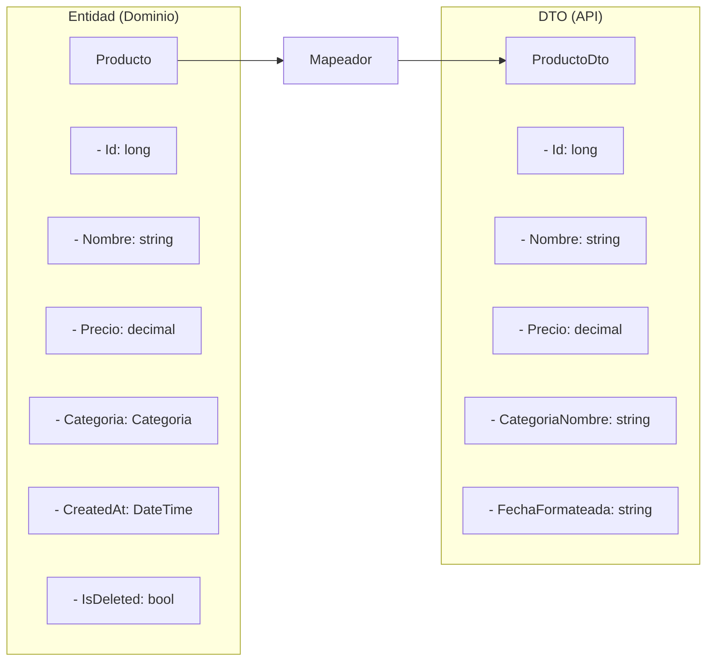
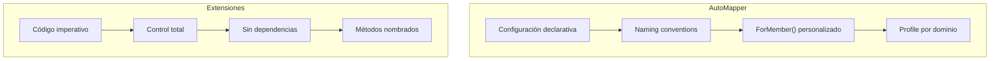
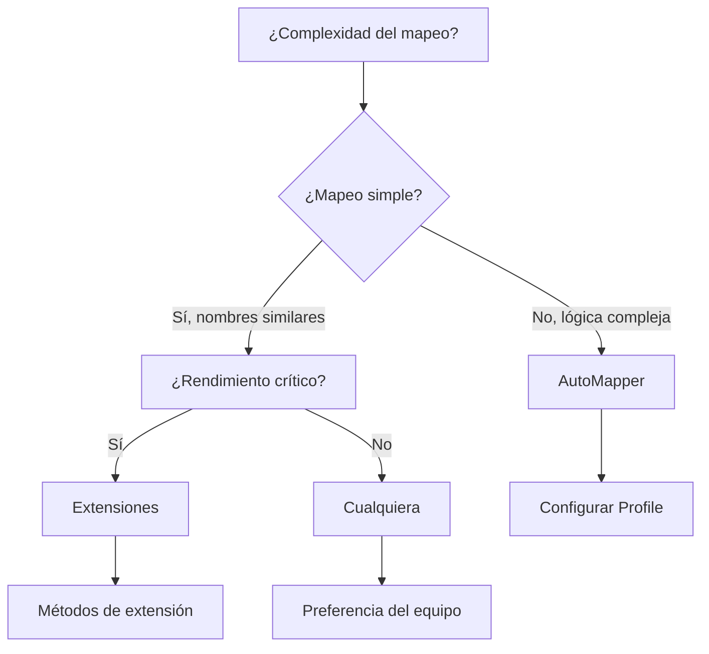
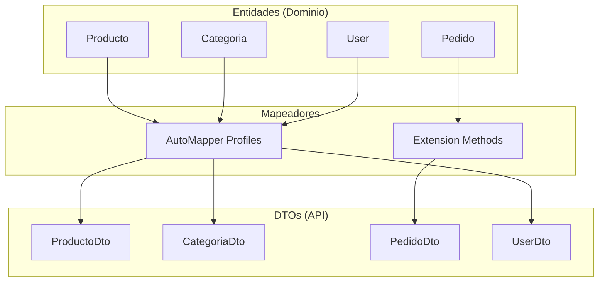

# 22. Mapeadores: AutoMapper vs Funciones de Extensión

## Índice

[22. Mapeadores: AutoMapper vs Funciones de Extensión](#22-mapeadores-automapper-vs-funciones-de-extensión)
  - [22.1. ¿Por Qué Usar Mapeadores?](#221-por-qué-usar-mapeadores)
  - [22.2. AutoMapper](#222-automapper)
  - [22.3. Funciones de Extensión (Alternativa)](#223-funciones-de-extensión-alternativa)
  - [22.4. Comparación AutoMapper vs Extensiones](#224-comparación-automapper-vs-extensiones)
  - [22.5. Benchmarks de Rendimiento](#225-benchmarks-de-rendimiento)
  - [22.6. Cuándo Usar Cada Enfoque](#226-cuándo-usar-cada-enfoque)
  - [22.7. Patrón Híbrido](#227-patrón-híbrido)
  - [22.8. Errores Comunes](#228-errores-comunes)
  - [22.9. Resumen](#229-resumen)

---

## 22.1. ¿Por Qué Usar Mapeadores?

En arquitecturas limpias, las **entidades** (modelos de dominio) y los **DTOs** (Data Transfer Objects) suelen tener estructuras diferentes. Los mapeadores facilitan la conversión entre ambos sin duplicar lógica.



### Beneficios de los Mapeadores

| Beneficio | Descripción |
|-----------|-------------|
| **Separación de responsabilidades** | Entidades ≠ DTOs |
| **Reutilización** | Un mapeo, múltiples usos |
| **Mantenibilidad** | Cambios centralizados |
| **Tipado** | Errores en compilación |
| **Legibilidad** | Código más limpio |

---

## 22.2. AutoMapper

### Instalación

```bash
# Paquete principal
dotnet add package AutoMapper

# Extensión para dependencias
dotnet add package AutoMapper.Extensions.Microsoft.DependencyInjection
```

### Configuración en Program.cs

Del archivo `Program.cs`:

```csharp
// AutoMapper
Log.Information("🔄 Configurando AutoMapper...");
builder.Services.AddAutoMapper(
    typeof(MappingProfile), 
    typeof(PedidoProfile));
```

### MappingProfile del Proyecto

Del archivo `MappingProfile.cs`:

```csharp
using AutoMapper;
using TiendaApi.Apis.Dtos.Categorias;
using TiendaApi.Apis.Dtos.Productos;
using TiendaApi.Apis.Dtos.Usuarios;
using TiendaApi.Apis.Dtos.Pedidos;
using TiendaApi.Apis.Models;

namespace TiendaApi.Apis.Mappers;

public class MappingProfile : Profile
{
    public MappingProfile()
    {
        // Mapeos de categoría
        CreateMap<Categoria, CategoriaDto>();
        CreateMap<CategoriaRequestDto, Categoria>();

        // Mapeos de producto
        CreateMap<Producto, ProductoDto>()
            .ForMember(dest => dest.CategoriaNombre,
                opt => opt.MapFrom(src => src.Categoria.Nombre));
        CreateMap<ProductoRequestDto, Producto>();

        // Mapeos de usuario
        CreateMap<User, UserDto>();
        CreateMap<RegisterDto, User>();

        // Mapeos de pedido
        CreateMap<Pedido, PedidoDto>();
        CreateMap<PedidoItem, PedidoItemDto>();
        CreateMap<PedidoRequestDto, Pedido>()
            .ForMember(dest => dest.Items, opt => opt.MapFrom(src => src.Items));
        CreateMap<PedidoItemRequestDto, PedidoItem>();
    }
}
```

### PedidoProfile

Del archivo `PedidoProfile.cs`:

```csharp
using AutoMapper;
using TiendaApi.Apis.Dtos.Pedidos;
using TiendaApi.Apis.Models;

namespace TiendaApi.Apis.Mappers;

public class PedidoProfile : Profile
{
    public PedidoProfile()
    {
        CreateMap<Pedido, PedidoDto>();
        CreateMap<PedidoItem, PedidoItemDto>();
        CreateMap<PedidoRequestDto, Pedido>();
        CreateMap<PedidoItemRequestDto, PedidoItem>();
    }
}
```

### Uso de AutoMapper en Servicios

```csharp
using AutoMapper;

public class ProductoService
{
    private readonly IProductoRepository _repository;
    private readonly IMapper _mapper;

    public ProductoService(
        IProductoRepository repository,
        IMapper mapper)
    {
        _repository = repository;
        _mapper = mapper;
    }

    public async Task<ProductoDto?> GetByIdAsync(long id)
    {
        var producto = await _repository.FindByIdAsync(id);
        
        if (producto == null) return null;
        
        // Mapear entidad a DTO
        return _mapper.Map<ProductoDto>(producto);
    }

    public async Task<ProductoDto> CreateAsync(ProductoRequestDto dto)
    {
        // Mapear DTO a entidad
        var producto = _mapper.Map<Producto>(dto);
        
        var created = await _repository.AddAsync(producto);
        
        return _mapper.Map<ProductoDto>(created);
    }

    public async Task<List<ProductoDto>> GetAllAsync()
    {
        var productos = await _repository.FindAllAsNoTrackingAsync();
        
        // Mapear lista de entidades a lista de DTOs
        return _mapper.Map<List<ProductoDto>>(productos);
    }
}
```

---

## 22.3. Funciones de Extensión (Alternativa)

### Implementación con Extensiones

```csharp
namespace TiendaApi.Apis.Extensions;

// Clase de extensiones para Producto
public static class ProductoExtensions
{
    // Entidad → DTO
    public static ProductoDto ToDto(this Producto producto)
    {
        return new ProductoDto
        {
            Id = producto.Id,
            Nombre = producto.Nombre,
            Descripcion = producto.Descripcion,
            Precio = producto.Precio,
            Stock = producto.Stock,
            CategoriaNombre = producto.Categoria?.Nombre ?? string.Empty,
            FechaCreacion = producto.CreatedAt.ToString("dd/MM/yyyy")
        };
    }

    // DTO → Entidad
    public static Producto ToEntity(this ProductoRequestDto dto)
    {
        return new Producto
        {
            Nombre = dto.Nombre,
            Descripcion = dto.Descripcion,
            Precio = dto.Precio,
            Stock = dto.Stock,
            CategoriaId = dto.CategoriaId,
            CreatedAt = DateTime.UtcNow
        };
    }

    // Lista de entidades → lista de DTOs
    public static List<ProductoDto> ToDtoList(this IEnumerable<Producto> productos)
    {
        return productos.Select(p => p.ToDto()).ToList();
    }
}

// Uso en servicios
public class ProductoService
{
    public async Task<ProductoDto?> GetByIdAsync(long id)
    {
        var producto = await _repository.FindByIdAsync(id);
        return producto?.ToDto();  // Extensión directa
    }

    public async Task<List<ProductoDto>> GetAllAsync()
    {
        var productos = await _repository.FindAllAsNoTrackingAsync();
        return productos.ToDtoList();  // Extensión para listas
    }
}
```

### Extension con Propiedades Calculadas

```csharp
public static class PedidoExtensions
{
    public static PedidoDto ToDto(this Pedido pedido)
    {
        return new PedidoDto
        {
            Id = pedido.Id,
            Estado = pedido.Estado.ToString(),
            Total = pedido.Items.Sum(i => i.PrecioUnitario * i.Cantidad),
            Items = pedido.Items.Select(i => new PedidoItemDto
            {
                ProductoId = i.ProductoId,
                Cantidad = i.Cantidad,
                PrecioUnitario = i.PrecioUnitario
            }).ToList(),
            FechaFormateada = pedido.CreatedAt.ToString("dd/MM/yyyy HH:mm"),
            EstadoColor = pedido.Estado switch
            {
                PedidoEstado.Pendiente => "yellow",
                PedidoEstado.Confirmado => "blue",
                PedidoEstado.Entregado => "green",
                PedidoEstado.Cancelado => "red",
                _ => "gray"
            }
        };
    }
}
```

---

## 22.4. Comparación AutoMapper vs Extensiones



### Tabla Comparativa

| Aspecto | AutoMapper | Extensiones |
|---------|------------|-------------|
| **Líneas de código** | Menos (configuración declarativa) | Más (código explícito) |
| **Dependencia** | Sí (paquete externo) | No (nativo de C#) |
| **Rendimiento** | Overhead de reflexión | Rápido (código compilado) |
| **Flexibilidad** | Alta (con configuración) | Máxima (código libre) |
| **Debugging** | Difícil (internals ocultos) | Fácil (código visible) |
| **Tipado** | Runtime (errores en ejecución) | Compilación (errores en build) |
| **Curva aprendizaje** | Media (sintaxis propia) | Baja (C# estándar) |

### Pros y Contras


---

## 22.5. Benchmarks de Rendimiento

```csharp
// Benchmark comparativo (ejemplo de resultado típico)
BenchmarkRunner.Run<MappersBenchmarks>();

public class MappersBenchmarks
{
    private readonly IMapper _autoMapper;
    private readonly Producto _producto;

    public MappersBenchmarks()
    {
        // AutoMapper
        var config = new MapperConfiguration(cfg => 
            cfg.CreateMap<Producto, ProductoDto>());
        _autoMapper = config.CreateMapper();

        // Datos de prueba
        _producto = new Producto
        {
            Id = 1,
            Nombre = "Producto de prueba",
            Descripcion = "Descripción",
            Precio = 99.99m,
            Stock = 10,
            Categoria = new Categoria { Nombre = "Electrónica" },
            CreatedAt = DateTime.UtcNow
        };
    }

    [Benchmark]
    public ProductoDto AutoMapper_Benchmark()
    {
        return _autoMapper.Map<ProductoDto>(_producto);
    }

    [Benchmark]
    public ProductoDto Extensions_Benchmark()
    {
        return _producto.ToDto();
    }
}
```

### Resultados Típicos

| Método | Tiempo | Ratio |
|--------|--------|-------|
| Extensions | ~50 ns | 1x (más rápido) |
| AutoMapper | ~200-500 ns | 4-10x más lento |

**Nota:** La diferencia es insignificante para la mayoría de aplicaciones (microsegundos vs nanosegundos).

---

## 22.6. Cuándo Usar Cada Enfoque



### Recomendaciones por Escenario

| Escenario | Recomendación | Razón |
|-----------|---------------|-------|
| **API simple, pocos mapeos** | Extensiones | Sin dependencia, rápido |
| **Mapeos complejos con lógica** | AutoMapper | Configuración централизованная |
| **Alto rendimiento crítico** | Extensiones | Código compilado, sin overhead |
| **Equipo nuevo en .NET** | Extensiones | Curva más baja |
| **Múltiples perfiles de dominio** | AutoMapper | Organización por Profile |
| **API pública con muchos DTOs** | AutoMapper | Mantenibilidad |

---

## 22.7. Patrón Híbrido

Combinar ambos enfoques según necesidad:

```csharp
// MappingProfile.cs - Configuración principal
public class MappingProfile : Profile
{
    public MappingProfile()
    {
        // Mapeos simples con convenciones
        CreateMap<Categoria, CategoriaDto>();
        CreateMap<User, UserDto>();

        // Mapeos complejos con lógica personalizada
        CreateMap<Producto, ProductoDto>()
            .ForMember(dest => dest.CategoriaNombre,
                opt => opt.MapFrom(src => src.Categoria.Nombre))
            .AfterMap((src, dest) =>
            {
                // Lógica personalizada post-mapeo
                dest.FechaFormateada = src.CreatedAt.ToString("dd/MM/yyyy");
            });
    }
}

// ProductoExtensions.cs - Métodos de extensión
public static class ProductoExtensions
{
    // Métodos de extensión para lógica no trivial
    public static string GetEstadoFormateado(this Producto producto)
    {
        return producto.Estado switch
        {
            PedidoEstado.Pendiente => "⏳ Pendiente",
            PedidoEstado.Confirmado => "✅ Confirmado",
            PedidoEstado.Entregado => "📦 Entregado",
            PedidoEstado.Cancelado => "❌ Cancelado",
            _ => "Desconocido"
        };
    }
}
```

---

## 22.8. Errores Comunes

### AutoMapper: Miembro no mapeado

```csharp
// Error: No mapea propiedades con nombres diferentes
// Solución: Usar ForMember()
CreateMap<Producto, ProductoDto>()
    .ForMember(dest => dest.CategoriaNombre,
        opt => opt.MapFrom(src => src.Categoria.Nombre));
```

### Extensiones: NullReferenceException

```csharp
// Error: Categoria puede ser null
// Solución: Verificar null
public static string GetCategoriaNombre(this Producto producto)
{
    return producto.Categoria?.Nombre ?? string.Empty;
}
```

---

## 22.9. Resumen

### Arquitectura de Mapeo



### Checklist de Decisión

| Pregunta | Si → AutoMapper | Si → Extensiones |
|----------|-----------------|------------------|
| ¿Mapeos simples? | | ✅ |
| ¿Lógica compleja? | ✅ | |
| ¿Sin dependencias externas? | | ✅ |
| ¿Equipo experimentado? | ✅ | |
| ¿Alto rendimiento crítico? | | ✅ |
| ¿Múltiples perfiles? | ✅ | |

### Siguientes Pasos

Con mapeadores dominados, tienes todas las herramientas para transformar datos entre capas de tu aplicación.

### Recursos Adicionales

- AutoMapper: https://automapper.org/
- AutoMapper Documentation: https://docs.automapper.org/
- Extension Methods: https://learn.microsoft.com/dotnet/csharp/programming-guide/classes-and-structs/extension-methods
