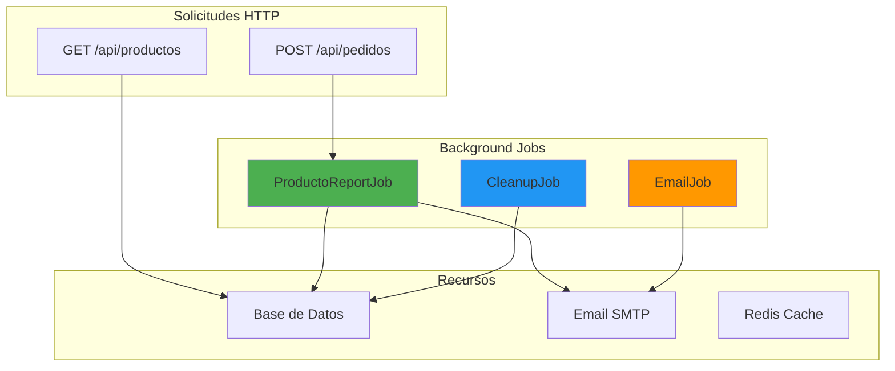
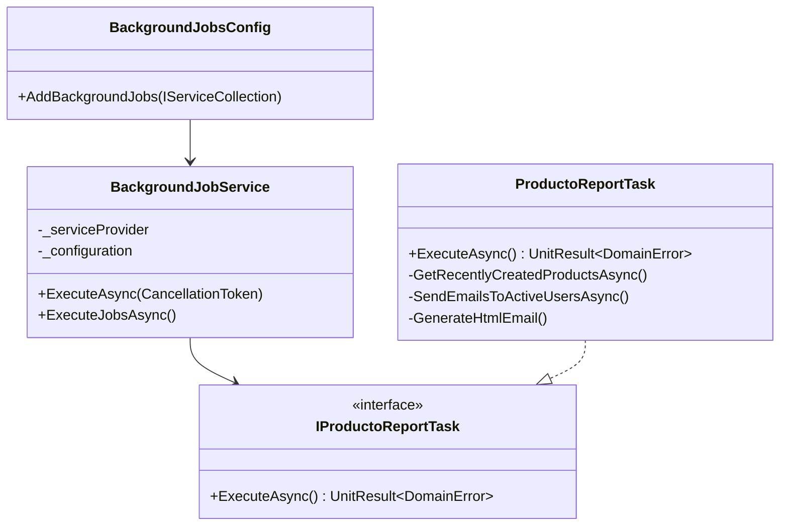
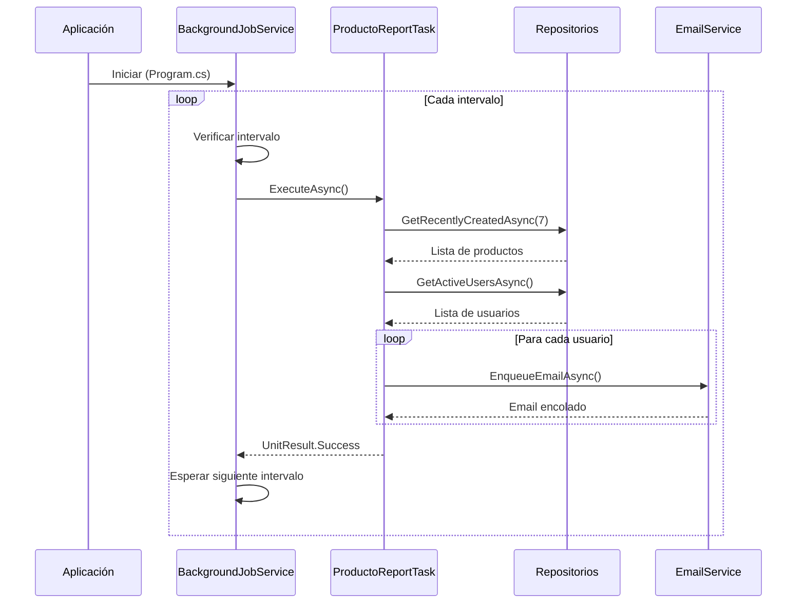

# 24. Background Jobs

## Índice

[24. Background Jobs y Tareas Programadas](#24-background-jobs-y-tareas-programadas)
  - [24.1. ¿Qué son Background Jobs?](#241-qu-son-background-jobs)
  - [24.2. Arquitectura de Background Jobs](#242-arquitectura-de-background-jobs)
  - [24.3. Implementación del Job de Reporte de Productos](#243-implementacin-del-job-de-reporte-de-productos)
  - [24.4. Background Service Orchestrator](#244-background-service-orchestrator)
  - [24.5. Configuración DI con Extension Methods](#245-configuracin-di-con-extension-methods)
  - [24.6. Configuración en appsettings.json](#246-configuracin-en-appsettingsjson)
  - [24.7. Métodos de Repositorio](#247-mtodos-de-repositorio)
  - [24.8. Flujo de Ejecución](#248-flujo-de-ejecucin)
  - [24.9. Pruebas Unitarias](#249-pruebas-unitarias)
  - [24.10. Beneficios y Consideraciones](#2410-beneficios-y-consideraciones)
  - [24.11. Comparación con Otras Soluciones](#2411-comparacin-con-otras-soluciones)
  - [24.12. Resumen](#2412-resumen)

---

## 24.1. ¿Qué son Background Jobs?

Los **background jobs** son tareas que se ejecutan fuera del flujo principal de las solicitudes HTTP, permitiendo operaciones largas sin bloquear la respuesta al usuario.



### Diferencias entre Background Services

| Tipo | Uso | Ejemplo |
|------|-----|---------|
| `BackgroundService` | Tareas largas perpetuas | Job scheduler, workers |
| `Hosted Service` | Servicios del host | Health checks, timers |
| `IHostedService` | Inicio/parada controlada | Limpieza, sincronización |

### Problemas sin Background Jobs

| Problema | Impacto |
|----------|---------|
| Timeout en requests | Usuario espera respuesta |
| Bloqueo de threads | Rendimiento degradado |
| Sin scheduling | Operaciones manuales |
| Sin retry | Fallos no manejados |

---

## 24.2. Arquitectura de Background Jobs

### Estructura del Proyecto

```
Services/
└── Background/
    ├── Jobs/                          ← Tareas individuales
    │   ├── IProductoReportTask.cs     ← Interfaz del job
    │   └── ProductoReportTask.cs      ← Implementación del job
    └── Host/                          ← Orchestrator
        └── BackgroundJobService.cs    ← Hosted Service

Infrastructures/
└── BackgroundJobsConfig.cs            ← Configuración DI
```



---

## 24.3. Implementación del Job de Reporte de Productos

### Interfaz del Job

```csharp
using CSharpFunctionalExtensions;
using TiendaApi.Apis.Errors;

namespace TiendaApi.Apis.Services.Background.Jobs;

/// <summary>
/// Define el contrato para el servicio de reportes de productos.
/// </summary>
public interface IProductoReportTask
{
    /// <summary>
    /// Ejecuta el reporte de productos nuevos y envía notificaciones por email.
    /// En desarrollo, solo registra un log informativo.
    /// En producción, obtiene productos de los últimos X días y envía emails a usuarios activos.
    /// </summary>
    /// <returns>UnitResult.Success o UnitResult.Failure(DomainError).</returns>
    Task<UnitResult<DomainError>> ExecuteAsync();
}
```

### Implementación del Job

```csharp
using CSharpFunctionalExtensions;
using Microsoft.Extensions.Configuration;
using Microsoft.Extensions.Logging;
using TiendaApi.Apis.Dtos.Productos;
using TiendaApi.Apis.Errors;
using TiendaApi.Apis.Models;
using TiendaApi.Apis.Repositories.Productos;
using TiendaApi.Apis.Repositories.Usuarios;
using TiendaApi.Apis.Services.Email;

namespace TiendaApi.Apis.Services.Background.Jobs;

/// <summary>
/// Servicio de reportes de productos.
/// Obtiene productos nuevos de los últimos X días y envía notificaciones por email a usuarios activos.
/// </summary>
public class ProductoReportTask(
    IProductoRepository productoRepository,
    IUserRepository userRepository,
    IEmailService emailService,
    ILogger<ProductoReportTask> logger,
    IConfiguration configuration
) : IProductoReportTask
{
    private readonly int _days = configuration.GetValue<int>("Scheduler:ProductoReportDays", 7);
    private readonly bool _isDevelopment = configuration.GetValue<bool>("IsDevelopment");

    public async Task<UnitResult<DomainError>> ExecuteAsync()
    {
        logger.LogInformation("Ejecutando reporte de productos - Modo: {Modo}", 
            _isDevelopment ? "DESARROLLO" : "PRODUCCION");

        if (_isDevelopment)
        {
            logger.LogInformation("Servicio de Background esta funcionando - Modo desarrollo");
            return UnitResult.Success<DomainError>();
        }

        return await GetRecentlyCreatedProductsAsync()
            .Bind(products => SendEmailsToActiveUsersAsync(products));
    }

    private async Task<Result<IEnumerable<Producto>, DomainError>> GetRecentlyCreatedProductsAsync()
    {
        logger.LogDebug("Obteniendo productos de los ultimos {Dias} dias", _days);

        var productos = await productoRepository.GetRecentlyCreatedAsync(_days);
        
        logger.LogInformation("Encontrados {Cantidad} productos nuevos", productos.Count());
        return Result.Success<IEnumerable<Producto>, DomainError>(productos);
    }

    private async Task<UnitResult<DomainError>> SendEmailsToActiveUsersAsync(IEnumerable<Producto> productos)
    {
        if (!productos.Any())
        {
            logger.LogInformation("No hay productos nuevos para reportar");
            return UnitResult.Success<DomainError>();
        }

        var usuarios = await userRepository.GetActiveUsersAsync();

        if (!usuarios.Any())
        {
            logger.LogInformation("No hay usuarios activos para enviar reportes");
            return UnitResult.Success<DomainError>();
        }

        foreach (var user in usuarios)
        {
            var email = new EmailMessage
            {
                To = user.Email,
                Subject = $"Novedades en Tienda: {productos.Count()} productos nuevos",
                Body = GenerateHtmlEmail(productos, user.Username),
                IsHtml = true
            };

            await emailService.EnqueueEmailAsync(email);
            logger.LogInformation("Email encolado para {Email}", user.Email);
        }

        logger.LogInformation("Emails encolados para {Cantidad} usuarios", usuarios.Count());
        return UnitResult.Success<DomainError>();
    }

    private static string GenerateHtmlEmail(IEnumerable<Producto> productos, string userName)
    {
        var productosHtml = string.Concat(productos.Select(p => string.Format(@"
            <div style=""border: 1px solid #ddd; padding: 15px; margin: 10px 0; border-radius: 8px;"">
                <h3 style=""margin: 0 0 10px 0;"">{0}</h3>
                <p style=""margin: 0; color: #666;"">{1}</p>
                <p style=""margin: 10px 0 0 0; font-weight: bold; color: #28a745;"">
                    {2} - Stock: {3}
                </p>
            </div>", p.Nombre, p.Descripcion, p.Precio.ToString("C"), p.Stock)));

        return string.Format(@"<!DOCTYPE html>
<html>
<head>
    <meta charset=""utf-8"">
    <style>
        body {{ font-family: Arial, sans-serif; line-height: 1.6; color: #333; }}
        .container {{ max-width: 600px; margin: 0 auto; padding: 20px; }}
        .header {{ background: #007bff; color: white; padding: 20px; text-align: center; border-radius: 8px 8px 0 0; }}
        .content {{ background: #f9f9f9; padding: 20px; border-radius: 0 0 8px 8px; }}
        .footer {{ text-align: center; padding: 20px; color: #666; font-size: 12px; }}
    </style>
</head>
<body>
    <div class=""container"">
        <div class=""header"">
            <h1>Novedades de la Semana</h1>
        </div>
        <div class=""content"">
            <p>Hola <strong>{0}</strong></p>
            <p>Te presentamos los <strong>{1}</strong> productos anadidos esta semana:</p>
            {2}
        </div>
        <div class=""footer"">
            <p>TiendaDAW - Tu tienda de confianza</p>
        </div>
    </div>
</body>
</html>", userName, productos.Count(), productosHtml);
    }
}
```

---

## 24.4. Background Service Orchestrator

### Implementación del Host

```csharp
using Microsoft.Extensions.Configuration;
using Microsoft.Extensions.Hosting;
using Microsoft.Extensions.Logging;
using TiendaApi.Apis.Services.Background.Jobs;

namespace TiendaApi.Apis.Services.Background.Host;

/// <summary>
/// Servicio de fondo que ejecuta tareas programadas.
/// Maneja la ejecución periódica de jobs según la configuración.
/// </summary>
public class BackgroundJobService(
    IServiceProvider serviceProvider,
    ILogger<BackgroundJobService> logger,
    IConfiguration configuration
) : BackgroundService
{
    private readonly bool _isDevelopment = configuration.GetValue<bool>("IsDevelopment");
    private readonly int _executionIntervalMinutes = configuration.GetValue<int>("Scheduler:ExecutionIntervalMinutes", 1);
    private readonly int _executionIntervalHours = configuration.GetValue<int>("Scheduler:ExecutionIntervalHours", 168);

    protected override async Task ExecuteAsync(CancellationToken stoppingToken)
    {
        logger.LogInformation("BackgroundJobService iniciado - Modo: {Modo}", 
            _isDevelopment ? "DESARROLLO" : "PRODUCCION");

        while (!stoppingToken.IsCancellationRequested)
        {
            try
            {
                await ExecuteJobsAsync(stoppingToken);
            }
            catch (OperationCanceledException) when (stoppingToken.IsCancellationRequested)
            {
                break;
            }
            catch (Exception ex)
            {
                logger.LogError(ex, "Error en BackgroundJobService");
                await Task.Delay(TimeSpan.FromMinutes(1), stoppingToken);
            }
        }

        logger.LogInformation("BackgroundJobService detenido");
    }

    private async Task ExecuteJobsAsync(CancellationToken ct)
    {
        using var scope = serviceProvider.CreateScope();
        var productoTask = scope.ServiceProvider.GetRequiredService<IProductoReportTask>();

        logger.LogDebug("Ejecutando jobs programados");

        await productoTask.ExecuteAsync();

        var interval = _isDevelopment
            ? TimeSpan.FromMinutes(_executionIntervalMinutes)
            : TimeSpan.FromHours(_executionIntervalHours);

        logger.LogDebug("Siguiente ejecucion en {Interval} minutos", Math.Round(interval.TotalMinutes, 0));

        await Task.Delay(interval, ct);
    }
}
```

---

## 24.5. Configuración DI con Extension Methods

### BackgroundJobsConfig.cs

```csharp
using Microsoft.Extensions.DependencyInjection;
using Serilog;
using TiendaApi.Apis.Services.Background.Host;
using TiendaApi.Apis.Services.Background.Jobs;

namespace TiendaApi.Apis.Infrastructures;

/// <summary>
/// Extensiones de configuración de servicios de background jobs.
/// </summary>
public static class BackgroundJobsConfig
{
    /// <summary>
    /// Configura los servicios de background jobs.
    /// </summary>
    public static IServiceCollection AddBackgroundJobs(this IServiceCollection services)
    {
        Log.Information("Configurando servicios de background jobs...");

        services.AddScoped<IProductoReportTask, ProductoReportTask>();
        services.AddHostedService<BackgroundJobService>();

        return services;
    }
}
```

### Registro en Program.cs

```csharp
// Additional Services
services.AddCache(environment);
services.AddEmail(environment);
services.AddStorage();
services.AddWebSockets();
services.AddBackgroundJobs();  // ← Registrar aquí
```

---

## 24.6. Configuración en appsettings.json

### appsettings.json (Base)

```json
{
  "Scheduler": {
    "Enabled": true,
    "ProductoReportDays": 7,
    "ExecutionIntervalMinutes": 1,
    "ExecutionIntervalHours": 168
  }
}
```

### appsettings.Development.json

```json
{
  "Scheduler": {
    "Enabled": true,
    "ProductoReportDays": 7,
    "ExecutionIntervalMinutes": 1,
    "ExecutionIntervalHours": 168
  }
}
```

### appsettings.Production.json

```json
{
  "Scheduler": {
    "Enabled": true,
    "ProductoReportDays": 7,
    "ExecutionIntervalMinutes": 1,
    "ExecutionIntervalHours": 168
  }
}
```

### Descripción de Configuración

| Campo | Descripción | Desarrollo | Producción |
|-------|-------------|------------|------------|
| `Enabled` | Habilitar/deshabilitar jobs | `true` | `true` |
| `ProductoReportDays` | Días hacia atrás para productos | `7` | `7` |
| `ExecutionIntervalMinutes` | Intervalo en minutos | `1` | `1` |
| `ExecutionIntervalHours` | Intervalo en horas | `168` (7 días) | `168` (7 días) |

---

## 24.7. Métodos de Repositorio

### GetRecentlyCreatedAsync en IProductoRepository

```csharp
/// <summary>
/// Recupera productos creados en los últimos X días.
/// </summary>
/// <param name="days">Número de días hacia atrás para buscar productos.</param>
/// <returns>Colección de productos ordenados por CreatedAt descendente.</returns>
Task<IEnumerable<Producto>> GetRecentlyCreatedAsync(int days);
```

### Implementación en ProductoRepository

```csharp
public async Task<IEnumerable<Producto>> GetRecentlyCreatedAsync(int days)
{
    var since = DateTime.UtcNow.AddDays(-days);
    logger.LogDebug("Buscando productos creados desde: {Since}", since);

    return await context.Productos
        .Where(p => p.CreatedAt >= since && !p.IsDeleted)
        .OrderByDescending(p => p.CreatedAt)
        .ToListAsync();
}
```

### GetActiveUsersAsync en IUserRepository

```csharp
/// <summary>
/// Recupera todos los usuarios activos del sistema.
/// </summary>
/// <returns>Usuarios activos ordenados por Email.</returns>
Task<IEnumerable<User>> GetActiveUsersAsync();
```

### Implementación en UserRepository

```csharp
public async Task<IEnumerable<User>> GetActiveUsersAsync()
{
    logger.LogDebug("Obteniendo usuarios activos");

    return await context.Users
        .Where(u => !u.IsDeleted)
        .OrderBy(u => u.Email)
        .ToListAsync();
}
```

---

## 24.8. Flujo de Ejecución



---

## 24.9. Pruebas Unitarias

### Tests de GetRecentlyCreatedAsync

```csharp
[Test]
public async Task GetRecentlyCreatedAsync_ConProductosEnBD_RetornaLosMismos()
{
    using var context = CreateContext(nameof(GetRecentlyCreatedAsync_ConProductosEnBD_RetornaLosMismos));

    context.Productos.AddRange(
        new Producto { Id = 1, Nombre = "Producto 1", RowVersion = NewRowVersion() },
        new Producto { Id = 2, Nombre = "Producto 2", RowVersion = NewRowVersion() },
        new Producto { Id = 3, Nombre = "Producto 3", RowVersion = NewRowVersion() }
    );
    await context.SaveChangesAsync();

    var productos = await context.Productos
        .Where(p => p.CreatedAt >= DateTime.UtcNow.AddDays(-7) && !p.IsDeleted)
        .OrderByDescending(p => p.CreatedAt)
        .ToListAsync();

    productos.Should().HaveCount(3);
}
```

### Tests de GetActiveUsersAsync

```csharp
[Test]
public async Task GetActiveUsersAsync_ConUsuariosEliminados_ExcluyeEliminados()
{
    using var context = CreateContext(nameof(GetActiveUsersAsync_ConUsuariosEliminados_ExcluyeEliminados));

    context.Users.AddRange(
        new User { Id = 1, Username = "activo", Email = "activo@test.com", IsDeleted = false },
        new User { Id = 2, Username = "eliminado", Email = "eliminado@test.com", IsDeleted = true },
        new User { Id = 3, Username = "otro", Email = "otro@test.com", IsDeleted = false }
    );
    await context.SaveChangesAsync();

    var repository = new UserRepository(context, Mock.Of<ILogger<UserRepository>>());

    var result = (await repository.GetActiveUsersAsync()).ToList();

    result.Should().HaveCount(2);
    result.All(u => !u.IsDeleted).Should().BeTrue();
}
```

---

## 24.10. Beneficios y Consideraciones

### Beneficios

| Beneficio | Descripción |
|-----------|-------------|
| No bloqueante | Operaciones largas sin afectar HTTP |
| Programable | Ejecución según cron/configuración |
| Escalable | Puede separarse en workers independientes |
| Reintentos | Manejo de errores configurable |

### Consideraciones

| Consideración | Solución |
|---------------|----------|
| Concurrencia | Usar locks o colas |
| Persistencia | Guardar estado en BD |
| Monitoring | Logs y métricas |
| Testing | Mock de servicios |

---

## 24.11. Comparación con Otras Soluciones

| Solución | Pros | Contras |
|----------|------|---------|
| **BackgroundService (nativo)** | Sin dependencias, simple | CRON manual |
| **Coravel** | Estilo Laravel, CRON nativo | Dependencia extra |
| **Hangfire** | Dashboard, retry built-in | Más pesado |
| **Quartz.NET** | CRON completo, enterprise | Configuración compleja |

Para este proyecto usamos **BackgroundService nativo** por su simplicidad y falta de dependencias externas.

---

## 24.12. Resumen

Los background jobs son esenciales para operaciones que no deben bloquear solicitudes HTTP. La arquitectura implementada:

1. **Jobs** encapsulan lógica de negocio específica
2. **BackgroundService** orquestra y programa ejecuciones
3. **Configuración flexible** permite diferentes intervalos por entorno
4. **Tests unitarios** verifican comportamiento de repositorios

Esta implementación proporciona una base sólida para agregar más jobs en el futuro (cleanup, sincronización, etc.) siguiendo el mismo patrón.
