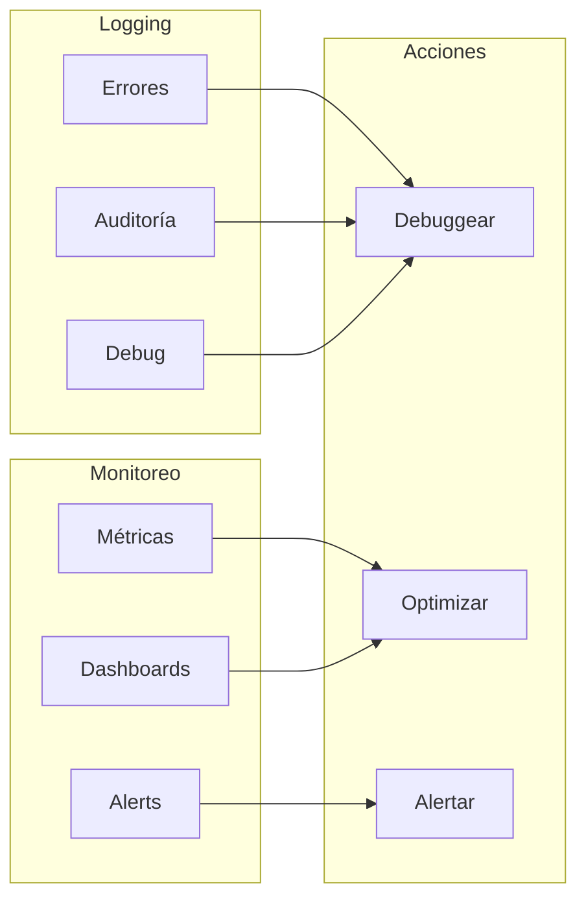
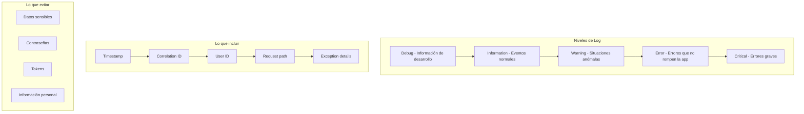

# 24. Logging y Monitoreo

## Índice

[24. Logging y Monitoreo](#24-logging-y-monitoreo)
  - [24.1. ¿Por qué Logging y Monitoreo?](#241-por-qué-logging-y-monitoreo)
  - [24.2. Logging Estructurado con Serilog](#242-logging-estructurado-con-serilog)
  - [24.2.1. Configuración desde appsettings.json](#2421-configuración-desde-appsettingsjson)
  - [24.3. Logs en Servicios](#243-logs-en-servicios)
  - [24.4. Correlation ID](#244-correlation-id)
  - [24.5. Métricas con Application Insights](#245-métricas-con-application-insights)
  - [24.6. OpenTelemetry](#246-opentelemetry)
  - [24.7. Health Checks](#247-health-checks)
  - [24.8. Resumen y Buenas Prácticas](#248-resumen-y-buenas-prácticas)

---

## 24.1. ¿Por qué Logging y Monitoreo?

El **logging** registra eventos de la aplicación para debugging y auditoría. El **monitoreo** supervisa la salud y rendimiento de la aplicación en producción.



### Problemas sin Logging/Monitoreo

| Problema              | Impacto                      |
| --------------------- | ---------------------------- |
| Errores no detectados | Tiempo de inactividad        |
| Sin trazabilidad      | Dificultad para debuggear    |
| Sin métricas          | Decisiones sin datos         |
| Sin alertas           | Respuesta lenta a incidentes |

---

## 24.2. Logging Estructurado con Serilog

### ¿Qué es Logging Estructurado?

En lugar de logs de texto plano, el logging estructurado usa JSON con campos específicos, permitiendo queries y análisis eficientes.

```
# Log tradicional
[ERROR] 2024-01-15 10:30:45 - Error al procesar pedido 123

# Log estructurado (JSON)
{"timestamp":"2024-01-15T10:30:45Z","level":"Error","message":"Error al procesar pedido","pedidoId":123,"error":"TimeoutException"}
```

### Instalación

```bash
dotnet add package Serilog.AspNetCore
dotnet add package Serilog.Sinks.Console
dotnet add package Serilog.Sinks.File
dotnet add package Serilog.Sinks.PostgreSQL
dotnet add package Serilog.Exceptions
```

### Configuración en Program.cs

```csharp
using Serilog;
using Serilog.Events;
using Serilog.Exceptions;

var builder = WebApplication.CreateBuilder(args);

// Configurar Serilog
Log.Logger = new LoggerConfiguration()
    .MinimumLevel.Debug()  // Nivel mínimo
    .MinimumLevel.Override("Microsoft", LogEventLevel.Information)
    .MinimumLevel.Override("Microsoft.AspNetCore", LogEventLevel.Warning)
    .Enrich.FromLogContext()  // Añadir contexto
    .Enrich.WithExceptionDetails()  // Detalles de excepciones
    .Enrich.WithProperty("Application", "TiendaApi")
    .Enrich.WithProperty("Environment", builder.Environment.EnvironmentName)
    
    // Console sink
    .WriteTo.Console(
        outputTemplate: "[{Timestamp:HH:mm:ss} {Level:u3}] {Message:lj}{NewLine}{Exception}")
    
    // File sink
    .WriteTo.File(
        path: "logs/api-.log",
        rollingInterval: RollingInterval.Day,
        rollOnFileSizeLimit: true,
        fileSizeLimitBytes: 10_000_000,
        retainedFileCountLimit: 30,
        outputTemplate: "[{Timestamp:yyyy-MM-dd HH:mm:ss} {Level:u3}] {Message:lj}{NewLine}{Exception}")
    
    // JSON file para análisis
    .WriteTo.File(
        path: "logs/api-json-.log",
        rollingInterval: RollingInterval.Hour,
        formatter: new Serilog.Formatting.Json.JsonFormatter())
    
    // PostgreSQL sink (opcional)
    .WriteTo.PostgreSQL(
        connectionString: builder.Configuration.GetConnectionString("PostgreSQL"),
        tableName: "logs",
        autoCreateSqlTable: true)
    
    // Seq sink (para desarrollo)
    .WriteTo.Seq("http://localhost:5341")
    
    .CreateLogger();

builder.Host.UseSerilog();

var app = builder.Build();

// Middleware para logging de requests
app.UseSerilogRequestLogging(options =>
{
    options.EnrichDiagnosticContext = (diagnosticContext, httpContext) =>
    {
        diagnosticContext.Set("RequestHost", httpContext.Request.Host.Value);
        diagnosticContext.Set("RequestScheme", httpContext.Request.Scheme);
        diagnosticContext.Set("UserAgent", httpContext.Request.Headers["User-Agent"].ToString());
        
        if (httpContext.User.Identity?.IsAuthenticated == true)
        {
            diagnosticContext.Set("UserId", httpContext.User.FindFirst(ClaimTypes.NameIdentifier)?.Value);
        }
    };

    options.GetLevel = (httpContext, elapsed, ex) =>
    {
        // Log warning si la request toma más de 1 segundo
        if (elapsed.TotalSeconds > 1)
            return LogEventLevel.Warning;
        
        // Log error si hay excepción
        if (ex != null)
            return LogEventLevel.Error;
        
        return LogEventLevel.Information;
    };
});

app.UseSerilogLogContext();  // Restaurar contexto de logging

app.Run();
```

---

## 24.2.1. Configuración desde appsettings.json

En lugar de configurar Serilog directamente en código, es recomendable usar `appsettings.json` para mayor flexibilidad y возможность de cambiar configuraciones sin recompilar.

### appsettings.json

```json
{
  "Serilog": {
    "Using": [
      "Serilog.Sinks.Console",
      "Serilog.Sinks.File",
      "Serilog.Sinks.PostgreSQL",
      "Serilog.Exceptions"
    ],
    "MinimumLevel": {
      "Default": "Debug",
      "Override": {
        "Microsoft": "Information",
        "Microsoft.AspNetCore": "Warning",
        "System": "Warning"
      }
    },
    "Enrich": [
      "FromLogContext",
      "WithExceptionDetails",
      {
        "Name": "WithProperty",
        "Args": { "Name": "Application", "Value": "TiendaApi" }
      },
      {
        "Name": "WithProperty",
        "Args": { "Name": "Environment", "Value": "${Environment}" }
      }
    ],
    "WriteTo": [
      {
        "Name": "Console",
        "Args": {
          "outputTemplate": "[{Timestamp:HH:mm:ss} {Level:u3}] {Message:lj}{NewLine}{Exception}"
        }
      },
      {
        "Name": "File",
        "Args": {
          "path": "logs/api-.log",
          "rollingInterval": "Day",
          "rollOnFileSizeLimit": true,
          "fileSizeLimitBytes": "10000000",
          "retainedFileCountLimit": "30",
          "outputTemplate": "[{Timestamp:yyyy-MM-dd HH:mm:ss} {Level:u3}] {Message:lj}{NewLine}{Exception}"
        }
      },
      {
        "Name": "File",
        "Args": {
          "path": "logs/api-json-.log",
          "rollingInterval": "Hour",
          "formatter": "Serilog.Formatting.Json.JsonFormatter, Serilog"
        }
      },
      {
        "Name": "Seq",
        "Args": {
          "serverUrl": "http://localhost:5341"
        }
      }
    ],
    "Properties": {
      "Application": "TiendaApi",
      "Environment": "Development"
    }
  }
}
```

### Configuración en Program.cs

```csharp
using Serilog;
using Serilog.Events;
using Serilog.Exceptions;
using Serilog.Settings.Configuration;

var builder = WebApplication.CreateBuilder(args);

// Configurar Serilog desde appsettings.json
var serilogConfig = builder.Configuration.GetSection("Serilog");

Log.Logger = new LoggerConfiguration()
    .ReadFrom.Configuration(serilogConfig)
    .CreateLogger();

builder.Host.UseSerilog();

// El resto de la configuración...
var app = builder.Build();
app.Run();
```

### Sobrescribir el Logger por Defecto de .NET

Para que todos los servicios que usan `ILogger<T>` usen Serilog en lugar del logger por defecto:

```csharp
using Serilog;
using Serilog.Events;

var builder = WebApplication.CreateBuilder(args);

// Configurar Serilog
Log.Logger = new LoggerConfiguration()
    .MinimumLevel.Debug()
    .MinimumLevel.Override("Microsoft", LogEventLevel.Information)
    .MinimumLevel.Override("Microsoft.AspNetCore", LogEventLevel.Warning)
    .Enrich.FromLogContext()
    .Enrich.WithExceptionDetails()
    .Enrich.WithProperty("Application", "TiendaApi")
    .Enrich.WithProperty("Environment", builder.Environment.EnvironmentName)
    .WriteTo.Console(
        outputTemplate: "[{Timestamp:HH:mm:ss} {Level:u3}] {Message:lj}{NewLine}{Exception}")
    .WriteTo.File(
        path: "logs/api-.log",
        rollingInterval: RollingInterval.Day)
    .CreateLogger();

// Sobrescribir el logger por defecto de .NET
builder.Host.UseSerilog(Log.Logger);

// Configurar todos los loggers para usar Serilog
builder.Services.AddLogging(loggingBuilder =>
{
    loggingBuilder.ClearProviders();  // Eliminar proveedores por defecto
    loggingBuilder.AddSerilog(dispose: true);
});

var app = builder.Build();
app.Run();
```

### Diferencia entre ClearProviders() y Sin Él

| Opción                        | Comportamiento                         | Cuándo Usar                      |
| ----------------------------- | -------------------------------------- | -------------------------------- |
| **Sin ClearProviders()**      | Logger de consola + Serilog duplicados | Desarrollo, quiere ambos outputs |
| **Con ClearProviders()**      | Solo Serilog                           | Producción, quiere control total |
| **AddSerilog(dispose: true)** | Serilog dispose con la app             | Evita leaks de recursos          |

### Configuración por Entorno

```json
// appsettings.Development.json
{
  "Serilog": {
    "MinimumLevel": {
      "Default": "Debug"
    },
    "WriteTo": [
      {
        "Name": "Console",
        "Args": {
          "theme": "Serilog.Sinks.SystemConsole.Themes.AnsiConsoleTheme.Code"
        }
      }
    ]
  }
}

// appsettings.Production.json
{
  "Serilog": {
    "MinimumLevel": {
      "Default": "Information"
    },
    "WriteTo": [
      {
        "Name": "File",
        "Args": {
          "path": "/var/log/tiendaapi/api-.log",
          "rollingInterval": "Day"
        }
      },
      {
        "Name": "ApplicationInsights",
        "Args": {
          "connectionString": "${ApplicationInsights:ConnectionString}",
          "telemetryConverter": "Serilog.Sinks.ApplicationInsights.TelemetryConverters.TraceTelemetryConverter, Serilog.Sinks.ApplicationInsights"
        }
      }
    ]
  }
}
```

### Proveedores de Logging en .NET

.NET tiene varios proveedores de logging que pueden coexistir con Serilog:

```csharp
builder.Services.AddLogging(loggingBuilder =>
{
    // Eliminar proveedores por defecto
    loggingBuilder.ClearProviders();

    // Añadir Serilog
    loggingBuilder.AddSerilog(dispose: true);

    // Opcional: Añadir providers específicos
    loggingBuilder.AddDebug();           // Output debug
    loggingBuilder.AddEventSourceLogger(); // Event tracing
});
```

---

## 24.3. Logs en Servicios

```csharp
using Microsoft.Extensions.Logging;
using Serilog;

namespace TiendaApi.Core.Services;

public class ProductoService
{
    private readonly IProductoRepository _repository;
    private readonly ILogger<ProductoService> _logger;

    public ProductoService(
        IProductoRepository repository,
        ILogger<ProductoService> logger)
    {
        _repository = repository;
        _logger = logger;
    }

    public async Task<Result<Producto, Error>> GetByIdAsync(long id)
    {
        try
        {
            _logger.LogInformation("Buscando producto {ProductoId}", id);

            var producto = await _repository.GetByIdAsync(id);

            if (producto == null)
            {
                _logger.LogWarning("Producto {ProductoId} no encontrado", id);
                return Result.Failure<Producto, Error>(Errors.Productos.NoEncontrados);
            }

            _logger.LogInformation(
                "Producto {ProductoId} encontrado: {Nombre}", 
                id, producto.Nombre);

            return producto;
        }
        catch (Exception ex)
        {
            _logger.LogError(ex, 
                "Error buscando producto {ProductoId}", id);
            
            return Result.Failure<Producto, Error>(
                Errors.Productos.ErrorInesperado);
        }
    }

    public async Task<Result<Producto, Error>> CreateAsync(CreateProductoRequest request)
    {
        _logger.LogInformation(
            "Creando producto {Nombre} con precio {Precio}",
            request.Nombre, request.Precio);

        var producto = new Producto
        {
            Nombre = request.Nombre,
            Precio = request.Precio,
            CategoriaId = request.CategoriaId,
            CreatedAt = DateTime.UtcNow
        };

        var result = await _repository.AddAsync(producto);

        if (result.IsSuccess)
        {
            _logger.LogInformation(
                "Producto {ProductoId} creado exitosamente",
                result.Value.Id);
            
            // Log estructurado con propiedades
            _logger.LogInformation(
                "Producto creado {@Producto}", 
                new
                {
                    result.Value.Id,
                    result.Value.Nombre,
                    result.Value.Precio,
                    result.Value.CategoriaId
                });
        }
        else
        {
            _logger.LogWarning(
                "Error creando producto: {Error}",
                result.Error.Message);
        }

        return result;
    }

    public async Task<Result<List<Producto>, Error>> GetByCategoriaAsync(long categoriaId)
    {
        using var _ = _logger.BeginScope("Obteniendo productos por categoría {CategoriaId}", categoriaId);

        _logger.LogDebug("Iniciando consulta de productos");

        var productos = await _repository.GetByCategoriaIdAsync(categoriaId);

        _logger.LogDebug(
            "Consulta completada. {Count} productos encontrados",
            productos.Count);

        return productos;
    }
}
```

---

## 24.4. Correlation ID (Trazabilidad de Requests)

```csharp
// CorrelationIdMiddleware.cs
public class CorrelationIdMiddleware
{
    private readonly RequestDelegate _next;

    public CorrelationIdMiddleware(RequestDelegate next)
    {
        _next = next;
    }

    public async Task InvokeAsync(HttpContext context)
    {
        var correlationId = context.Request.Headers["X-Correlation-ID"].FirstOrDefault();
        
        if (string.IsNullOrEmpty(correlationId))
        {
            correlationId = Guid.NewGuid().ToString();
        }

        context.Response.Headers["X-Correlation-ID"] = correlationId;
        context.Items["CorrelationId"] = correlationId;

        using var logScope = Log.BeginScope(new Dictionary<string, object>
        {
            ["CorrelationId"] = correlationId
        });

        await _next(context);
    }
}

// Registro en Program.cs
app.UseMiddleware<CorrelationIdMiddleware>();
```

### Uso del Correlation ID

```csharp
public class ProductoService
{
    private readonly ILogger<ProductoService> _logger;

    public async Task<Result<Producto, Error>> GetByIdAsync(long id)
    {
        var correlationId = _logger.IsEnabled(LogLevel.Information) 
            ? HttpContextAccessor.HttpContext?.Items["CorrelationId"]?.ToString() 
            : null;

        _logger.LogInformation(
            "Buscando producto {ProductoId} (CorrelationId: {CorrelationId})",
            id, correlationId);

        // ...
    }
}
```

---

## 24.5. Métricas con Application Insights

### Instalación

```bash
dotnet add package Microsoft.ApplicationInsights.AspNetCore
dotnet add package Microsoft.ApplicationInsights.PerfCounterCollector
```

### Configuración

```csharp
// Program.cs
builder.Services.AddApplicationInsightsTelemetry(options =>
{
    options.ConnectionString = 
        builder.Configuration["ApplicationInsights:ConnectionString"];
    
    options.EnableQuickPulseMetricStream = true;
    options.EnableAdaptiveSampling = true;
});

// Configurar perf counters
builder.Services.ConfigureTelemetryModule<PerformanceCollectorModule>(
    (module, options) =>
    {
        module.Counters.Add(new PerformanceCounterConfiguration()
        {
            CounterName = @"\Processor(_Total)\% Processor Time",
            MonitorName = "Processor Time"
        });
    });

// Añadir Logging channel
builder.Services.AddLogging(loggingBuilder =>
{
    loggingBuilder.AddApplicationInsights(
        builder.Configuration["ApplicationInsights:ConnectionString"]);
});
```

### Custom Metrics

```csharp
using Microsoft.ApplicationInsights;
using Microsoft.ApplicationInsights.DataContracts;

public class MetricsService
{
    private readonly TelemetryClient _telemetryClient;

    public MetricsService(TelemetryClient telemetryClient)
    {
        _telemetryClient = telemetryClient;
    }

    public void TrackPedidoCreado(decimal monto)
    {
        _telemetryClient.TrackEvent("PedidoCreado", new Dictionary<string, string>
        {
            ["Monto"] = monto.ToString()
        });

        _telemetryClient.GetMetric("PedidosCreados").TrackValue(1);
        _telemetryClient.GetMetric("MontoPedidos").TrackValue((double)monto);
    }

    public void TrackApiRequest(string endpoint, double durationMs, bool success)
    {
        _telemetryClient.TrackRequest(
            endpoint,
            DateTime.UtcNow,
            TimeSpan.FromMilliseconds(durationMs),
            success ? "200" : "500",
            success);
    }

    public void TrackCacheHit(string cacheType)
    {
        _telemetryClient.GetMetric($"CacheHits_{cacheType}").TrackValue(1);
    }

    public void TrackCacheMiss(string cacheType)
    {
        _telemetryClient.GetMetric($"CacheMisses_{cacheType}").TrackValue(1);
    }
}
```

---

## 24.6. OpenTelemetry (Alternativa Moderna)

### Instalación

```bash
dotnet add package OpenTelemetry.Extensions.Hosting
dotnet add package OpenTelemetry.Exporter.Console
dotnet add package OpenTelemetry.Exporter.Otlp
dotnet add package OpenTelemetry.Instrumentation.AspNetCore
dotnet add package OpenTelemetry.Instrumentation.EntityFrameworkCore
```

### Configuración

```csharp
using OpenTelemetry.Metrics;
using OpenTelemetry.Resources;
using OpenTelemetry.Trace;

builder.Services.AddOpenTelemetryMetrics(options =>
{
    options.SetResourceBuilder(ResourceBuilder.CreateDefault()
        .AddService(serviceName: "TiendaApi", serviceVersion: "1.0.0"))
        .AddAspNetCoreInstrumentation()
        .AddRuntimeInstrumentation()
        .AddHttpClientInstrumentation()
        .AddOtlpExporter(otlpOptions =>
        {
            otlpOptions.Endpoint = new Uri("http://localhost:4317");
        });
});

builder.Services.AddOpenTelemetryTracing(options =>
{
    options.SetResourceBuilder(ResourceBuilder.CreateDefault()
        .AddService(serviceName: "TiendaApi", serviceVersion: "1.0.0"))
        .AddAspNetCoreInstrumentation()
        .AddEntityFrameworkCoreInstrumentation()
        .AddOtlpExporter(otlpOptions =>
        {
            otlpOptions.Endpoint = new Uri("http://localhost:4317");
        });
});
```

---

## 24.7. Health Checks

### Health Checks Básicos

```csharp
using Microsoft.Extensions.Diagnostics.HealthChecks;

builder.Services.AddHealthChecks()
    .AddCheck("self", () => HealthCheckResult.Healthy())
    .AddNpgSql(
        connectionString: builder.Configuration.GetConnectionString("PostgreSQL"),
        name: "postgresql",
        tags: ["database", "sql"])
    .AddRedis(
        connectionString: builder.Configuration.GetConnectionString("Redis"),
        name: "redis",
        tags: ["cache"])
    .AddUrlGroup(
        new Uri("https://api.external-service.com/health"),
        name: "external-api",
        tags: ["external"]);

// Endpoints de health check
app.MapHealthChecks("/health");
app.MapHealthChecks("/health/ready", new HealthCheckOptions
{
    Predicate = check => check.Tags.Contains("ready"),
    ResponseWriter = UIResponseWriter.WriteHealthCheckUIResponse
});
```

### Custom Health Check

```csharp
public class CustomHealthCheck : IHealthCheck
{
    private readonly IServiceScopeFactory _scopeFactory;

    public CustomHealthCheck(IServiceScopeFactory scopeFactory)
    {
        _scopeFactory = scopeFactory;
    }

    public async Task<HealthCheckResult> CheckHealthAsync(
        HealthCheckContext context,
        CancellationToken cancellationToken = default)
    {
        try
        {
            using var scope = _scopeFactory.CreateScope();
            var contextDb = scope.ServiceProvider.GetRequiredService<TiendaDbContext>();

            var canConnect = await contextDb.Database.CanConnectAsync(cancellationToken);
            
            if (canConnect)
            {
                return HealthCheckResult.Healthy("Base de datos conectada");
            }

            return HealthCheckResult.Degraded("No se puede conectar a la base de datos");
        }
        catch (Exception ex)
        {
            return HealthCheckResult.Unhealthy(
                $"Error verificando base de datos: {ex.Message}");
        }
    }
}
```

---

## 24.8. Resumen y Buenas Prácticas

### Estructura de Logging



### Siguientes Pasos

Con logging y monitoreo dominado, el siguiente paso es aprender sobre API versioning y documentación.

### Recursos Adicionales

- Serilog: https://serilog.net/
- Application Insights: https://learn.microsoft.com/azure/azure-monitor/app/app-insights-overview
- OpenTelemetry: https://opentelemetry.io/
- Health Checks: https://learn.microsoft.com/aspnet/core/host-and-deploy/health-checks
