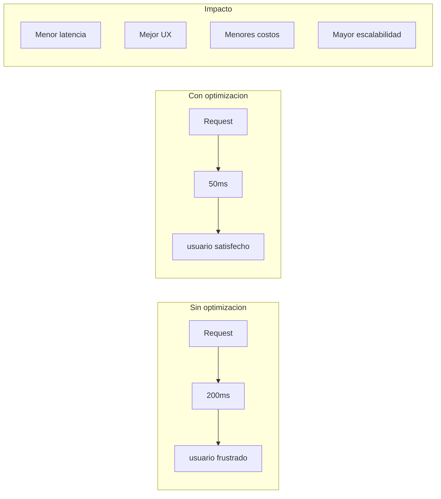

# 25. Optimización de Rendimiento

## Índice

[25. Optimización de Rendimiento](#25-optimización-de-rendimiento)
  - [25.1. ¿Por qué Optimizar?](#251-por-qué-optimizar)
  - [25.2. Optimización de Endpoints](#252-optimización-de-endpoints)
  - [25.3. Optimización de Base de Datos](#253-optimización-de-base-de-datos)
  - [25.4. Caching Avanzado](#254-caching-avanzado)
  - [25.5. Optimización de Entity Framework Core](#255-optimización-de-entity-framework-core)
  - [25.6. Benchmarking](#256-benchmarking)
  - [25.7. Resumen y Buenas Prácticas](#257-resumen-y-buenas-prácticas)

---

## 25.1. ¿Por qué Optimizar?

El rendimiento de una API afecta directamente la experiencia del usuario y los costos de infraestructura.



### Métricas Clave

| Métrica | Objetivo | Medición |
|---------|----------|----------|
| **Latencia** | < 100ms API | P95 |
| **Throughput** | Requests/segundo | RPS |
| **Disponibilidad** | 99.9% | Uptime |
| **Uso de CPU** | < 70% | Promedio |
| **Uso de Memoria** | Estable | Peak |

---

## 25.2. Optimización de Endpoints

### Response Compression

```csharp
using Microsoft.AspNetCore.ResponseCompression;

var builder = WebApplication.CreateBuilder(args);

builder.Services.AddResponseCompression(options =>
{
    options.EnableForHttps = true;
    
    options.Providers.Add<BrotliCompressionProvider>();
    options.Providers.Add<GzipCompressionProvider>();
    
    options.MimeTypes = new[]
    {
        "text/plain",
        "text/html",
        "text/css",
        "text/javascript",
        "application/javascript",
        "application/json",
        "application/xml"
    };
});

builder.Services.Configure<BrotliCompressionProviderOptions>(options =>
{
    options.Level = CompressionLevel.Optimal;
});

builder.Services.Configure<GzipCompressionProviderOptions>(options =>
{
    options.Level = CompressionLevel.Optimal;
});

app.UseResponseCompression();
```

### Rate Limiting

```bash
dotnet add package AspNetCoreRateLimit
```

```csharp
using AspNetCoreRateLimit;

builder.Services.AddMemoryCache();
builder.Services.Configure<IpRateLimitOptions>(options =>
{
    options.EnableEndpointRateLimiting = true;
    options.StackBlockedRequests = false;
    options.HttpStatusCode = 429;
    options.RealIpHeader = "X-Real-IP";
    options.ClientIdHeader = "X-ClientId";
    
    options.GeneralRules = new List<RateLimitRule>
    {
        new()
        {
            Endpoint = "*",
            Period = "1m",
            Limit = 100
        },
        new()
        {
            Endpoint = "post:*",
            Period = "1m",
            Limit = 20
        }
    };
    
    options.EndpointRules = new List<EndpointRateLimitRule>
    {
        new()
        {
            Endpoint = "api/auth/login",
            Period = "1m",
            Limit = 5
        }
    };
});

app.UseIpRateLimiting();
```

---

## 25.3. Optimización de Base de Datos

### Select N+1 Prevention

```csharp
// ❌ MAL: N+1 queries
public async Task<List<ProductoDto>> GetProductosConCategorias()
{
    var productos = await _context.Productos.ToListAsync();
    
    var dtos = new List<ProductoDto>();
    foreach (var producto in productos)
    {
        // Query adicional por cada producto
        var categoria = await _context.Categorias
            .FirstAsync(c => c.Id == producto.CategoriaId);
        
        dtos.Add(new ProductoDto
        {
            Id = producto.Id,
            Nombre = producto.Nombre,
            CategoriaNombre = categoria.Nombre
        });
    }
    
    return dtos;
}

// ✅ BIEN: Eager loading
public async Task<List<ProductoDto>> GetProductosConCategorias()
{
    return await _context.Productos
        .Include(p => p.Categoria)  // Carga categoría en la misma query
        .Select(p => new ProductoDto
        {
            Id = p.Id,
            Nombre = p.Nombre,
            CategoriaNombre = p.Categoria.Nombre
        })
        .ToListAsync();
}
```

### Proyección de Columnas

```csharp
// ❌ Obtiene todas las columnas
var productos = await _context.Productos.ToListAsync();

// ✅ Solo las columnas necesarias
var productos = await _context.Productos
    .Where(p => p.Stock > 0)
    .Select(p => new
    {
        p.Id,
        p.Nombre,
        p.Precio
    })
    .ToListAsync();

// ✅ Usar AsNoTracking para solo lectura
var productos = await _context.Productos
    .AsNoTracking()
    .Where(p => p.IsActive)
    .Select(p => new ProductoDto
    {
        Id = p.Id,
        Nombre = p.Nombre,
        Precio = p.Precio
    })
    .ToListAsync();
```

### Índices Optimizados

```csharp
protected override void OnModelCreating(ModelBuilder modelBuilder)
{
    modelBuilder.Entity<Producto>(entity =>
    {
        // Índice para búsquedas frecuentes
        entity.HasIndex(p => new { p.CategoriaId, p.IsActive })
            .HasDatabaseName("IX_Productos_Categoria_Activo");

        // Índice para ordenamiento
        entity.HasIndex(p => p.CreatedAt)
            .HasDatabaseName("IX_Productos_CreatedAt");

        // Índice compuesto para filtros comunes
        entity.HasIndex(p => new { p.IsActive, p.Stock })
            .HasDatabaseName("IX_Productos_Activo_Stock");

        // Índice parcial para filtrar solo activos
        entity.HasIndex(p => p.Nombre)
            .HasDatabaseName("IX_Productos_Nombre_Activos")
            .HasFilter("IsActive = true");
    });
}
```

---

## 25.4. Caching Avanzado

### Cache-Aside con Redis

```csharp
public class OptimizedCacheService
{
    private readonly IDistributedCache _cache;
    private readonly IConnectionMultiplexer _redis;
    private readonly TimeSpan _defaultExpiry = TimeSpan.FromMinutes(15);
    private readonly ILogger<OptimizedCacheService> _logger;

    public OptimizedCacheService(
        IDistributedCache cache,
        IConnectionMultiplexer redis,
        ILogger<OptimizedCacheService> logger)
    {
        _cache = cache;
        _redis = redis;
        _logger = logger;
    }

    public async Task<T?> GetOrSetAsync<T>(
        string key, 
        Func<Task<T>> factory,
        TimeSpan? expiry = null)
    {
        try
        {
            var cached = await _cache.GetStringAsync(key);
            
            if (cached != null)
            {
                _logger.LogDebug("Cache HIT: {Key}", key);
                return JsonSerializer.Deserialize<T>(cached);
            }

            _logger.LogDebug("Cache MISS: {Key}", key);
            
            var value = await factory();
            
            if (value != null)
            {
                var options = new DistributedCacheEntryOptions
                {
                    AbsoluteExpirationRelativeToNow = expiry ?? _defaultExpiry,
                    SlidingExpiration = TimeSpan.FromMinutes(5)
                };
                
                await _cache.SetStringAsync(
                    key, 
                    JsonSerializer.Serialize(value), 
                    options);
            }
            
            return value;
        }
        catch (Exception ex)
        {
            _logger.LogWarning(ex, "Error accediendo al cache");
            return await factory();
        }
    }

    public async Task InvalidatePatternAsync(string pattern)
    {
        try
        {
            var server = _redis.GetServer(_redis.GetEndPoints()[0]);
            var keys = server.Keys(pattern: $"{pattern}*").ToArray();
            
            if (keys.Length > 0)
            {
                var db = _redis.GetDatabase();
                await db.KeyDeleteAsync(keys);
                _logger.LogInformation(
                    "Invalidado cache: {Count} keys con patrón {Pattern}",
                    keys.Length, pattern);
            }
        }
        catch (Exception ex)
        {
            _logger.LogWarning(ex, "Error invalidando cache con patrón {Pattern}", pattern);
        }
    }
}
```

### Caché Multinivel (L1 + L2)

```csharp
public class MultiLevelCacheService
{
    private readonly IMemoryCache _l1Cache;
    private readonly IDistributedCache _l2Cache;
    private readonly TimeSpan _l1Expiry = TimeSpan.FromSeconds(30);
    private readonly TimeSpan _l2Expiry = TimeSpan.FromMinutes(15);

    public async Task<T?> GetAsync<T>(string key)
    {
        // L1: Memory cache (ultra rápido)
        if (_l1Cache.TryGetValue(key, out T? l1Value))
        {
            return l1Value;
        }

        try
        {
            // L2: Distributed cache
            var l2Json = await _l2Cache.GetStringAsync(key);
            
            if (l2Json != null)
            {
                var value = JsonSerializer.Deserialize<T>(l2Json);
                
                // Poblar L1
                _l1Cache.Set(key, value, _l1Expiry);
                
                return value;
            }
        }
        catch (Exception ex)
        {
            // Fail-open
        }

        return default;
    }

    public async Task SetAsync<T>(string key, T value)
    {
        // Set L1
        _l1Cache.Set(key, value, _l1Expiry);

        try
        {
            // Set L2
            await _l2Cache.SetStringAsync(
                key,
                JsonSerializer.Serialize(value),
                new DistributedCacheEntryOptions
                {
                    AbsoluteExpirationRelativeToNow = _l2Expiry
                });
        }
        catch (Exception ex)
        {
            // Fail-open
        }
    }

    public void Invalidate(string key)
    {
        _l1Cache.Remove(key);
        _l2Cache.RemoveAsync(key);
    }
}
```

---

## 25.5. Optimización de Entity Framework Core

### Compiled Queries

```csharp
// Compilar query para reutilizar
private static readonly Func<TiendaDbContext, long, Task<Producto?>> 
    GetByIdCompiled = EF.CompileAsyncQuery(
        (TiendaDbContext ctx, long id) => 
            ctx.Productos.FirstOrDefault(p => p.Id == id));

// Uso
public async Task<Producto?> GetByIdAsync(long id)
{
    return await GetByIdCompiled(_context, id);
}
```

### Change Tracking Optimization

```csharp
public class ProductoRepository
{
    private readonly TiendaDbContext _context;

    public async Task<List<ProductoDto>> GetAllReadOnlyAsync()
    {
        // Sin tracking para solo lectura
        return await _context.Productos
            .AsNoTrackingWithIdentityResolution()  // Para include
            .Where(p => p.IsActive)
            .Select(p => new ProductoDto
            {
                Id = p.Id,
                Nombre = p.Nombre,
                Precio = p.Precio
            })
            .ToListAsync();
    }

    public async Task<Producto> UpdateStockAsync(long productoId, int nuevoStock)
    {
        // Update directo sin cargar entidad
        var producto = new Producto { Id = productoId };
        _context.Attach(producto);
        producto.Stock = nuevoStock;
        producto.UpdatedAt = DateTime.UtcNow;

        await _context.SaveChangesAsync();
        return producto;
    }

    public async Task BulkInsertAsync(IEnumerable<Producto> productos)
    {
        // Bulk insert para grandes volúmenes
        await _context.BulkInsertAsync(productos.ToList());
    }
}
```

---

## 25.6. Benchmarking

### Instalación

```bash
dotnet add package BenchmarkDotNet
```

### Benchmark de Cache

```csharp
using BenchmarkDotNet.Attributes;
using BenchmarkDotNet.Running;

[MemoryDiagnoser]
[RankColumn]
public class CacheBenchmark
{
    private MemoryCache _memoryCache;
    private IDistributedCache _distributedCache;
    private const string Key = "test_key";

    [GlobalSetup]
    public void Setup()
    {
        _memoryCache = new MemoryCache(new MemoryCacheOptions());
        // Configurar distributed cache...
    }

    [Benchmark]
    public void MemoryCache_Get()
    {
        _memoryCache.TryGetValue(Key, out _);
    }

    [Benchmark]
    public void DistributedCache_Get()
    {
        _distributedCache.GetStringAsync(Key).Wait();
    }

    [Benchmark]
    public void MultiLevelCache_Get()
    {
        // Test multi-level cache
    }
}

// Runner
// var summary = BenchmarkRunner.Run<CacheBenchmark>();
```

### Benchmark de Repository

```csharp
[MemoryDiagnoser]
[RankColumn]
public class RepositoryBenchmark
{
    private ProductoRepository _repository;

    [GlobalSetup]
    public void Setup()
    {
        // Configurar contexto...
    }

    [Benchmark]
    public async Task<List<ProductoDto>> GetAllWithTracking()
    {
        return await _repository.GetAllWithTrackingAsync();
    }

    [Benchmark]
    public async Task<List<ProductoDto>> GetAllNoTracking()
    {
        return await _repository.GetAllReadOnlyAsync();
    }

    [Benchmark]
    public async Task<List<ProductoDto>> GetAllCompiled()
    {
        return await _repository.GetAllCompiledAsync();
    }
}
```

---

## 25.7. Resumen y Buenas Prácticas

### Checklist de Optimización

```mermaid
flowchart TB
    subgraph "Red"
        A1["Compression"]
        A2["CDN"]
        A3["Rate limiting"]
    end
    
    subgraph "API"
        A4["Response size"]
        A5["Batch operations"]
        A6["Async/Await"]
    end
    
    subgraph "Base de datos"
        B1["Indices"]
        B2["No tracking"]
        B3["Compiled queries"]
    end
    
    subgraph "Cache"
        C1["Multi-level"]
        C2["Invalidation"]
        C3["TTL apropiado"]
    end
    
    subgraph "Monitoreo"
        D1["Benchmarks"]
        D2["Métricas"]
        D3["Profiling"]
    end
    
    A1 --> A2 --> A3
    A4 --> A5 --> A6
    B1 --> B2 --> B3
    C1 --> C2 --> C3
    D1 --> D2 --> D3
```



### Siguientes Pasos

Con optimización dominado, el siguiente paso es aprender sobre patrones de arquitectura limpia.

### Recursos Adicionales

- EF Core Performance: https://learn.microsoft.com/ef/core/performance/
- BenchmarkDotNet: https://benchmarkdotnet.org/
- Performance Tips: https://learn.microsoft.com/aspnet/core/performance/
