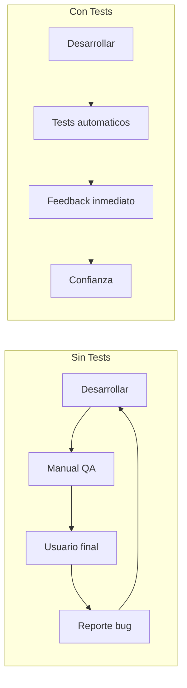
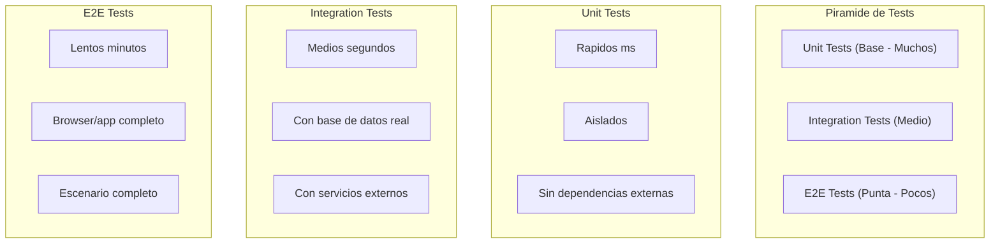
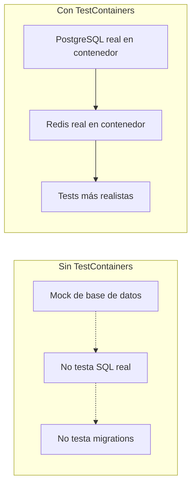
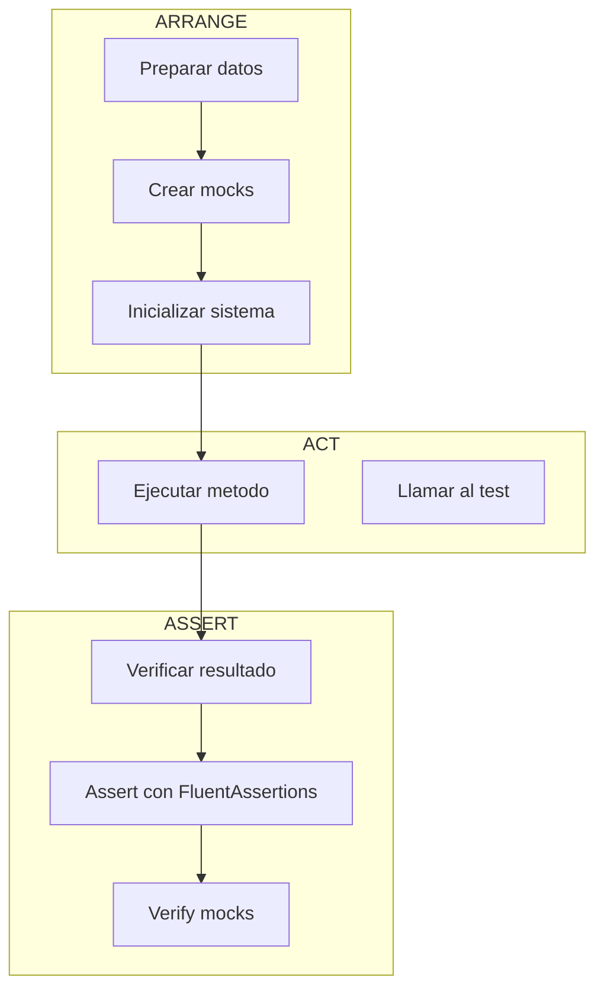
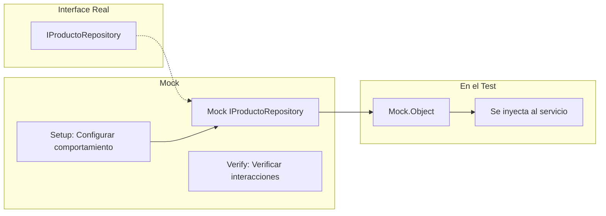
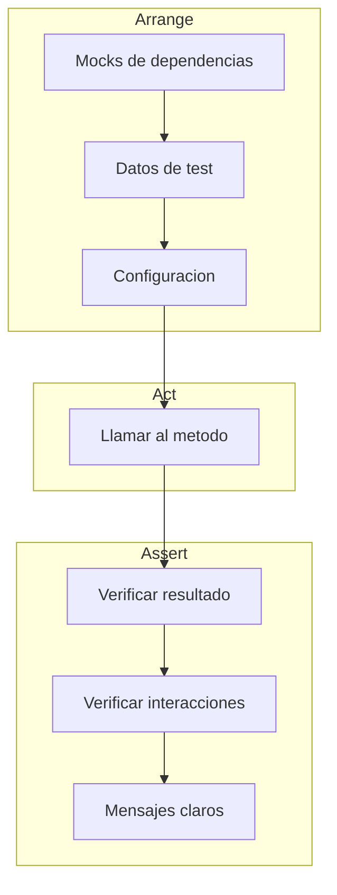
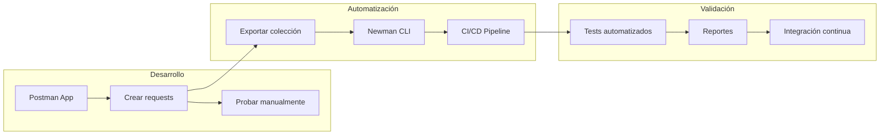
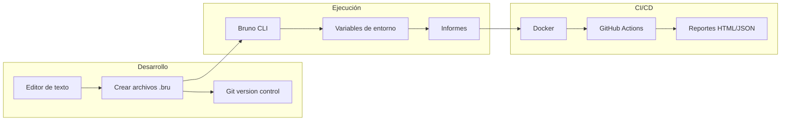

# 26. Testing

## Índice

[26. Testing con NUnit](#26-testing-con-nunit)
  - [26.1. ¿Qué es Testing?](#261-qu-es-testing)
  - [26.2. Tipos de Tests](#262-tipos-de-tests)
  - [26.3. Frameworks de Testing en .NET](#263-frameworks-de-testing-en-net)
  - [26.4. Estructura del Proyecto de Tests](#264-estructura-del-proyecto-de-tests)
  - [26.5. Tests en Paralelo vs Secuenciales](#265-tests-en-paralelo-vs-secuenciales)
  - [26.6. TestContainers](#266-testcontainers)
  - [26.7. Anatomy de un Test Unitario](#267-anatomy-de-un-test-unitario)
  - [26.8. NUnit Basics](#268-nunit-basics)
  - [26.9. FluentAssertions](#269-fluentassertions)
  - [26.10. Moq - Creando Mocks](#2610-moq---creando-mocks)
  - [26.11. Tests de Controladores](#2611-tests-de-controladores)
  - [26.12. Resumen y Buenas Prácticas](#2612-resumen-y-buenas-prcticas)
  - [26.13. Testing E2E con Postman y Newman](#2613-testing-e2e-con-postman-y-newman)
  - [26.14. Testing E2E con Bruno CLI](#2614-testing-e2e-con-bruno-cli)

---

## 26.1. ¿Qué es Testing?

**Testing** es el proceso de verificar que el código funciona correctamente. En lugar de esperar a que los usuarios encuentren errores, los tests automatizados detectan problemas antes de llegar a producción.

### ¿Por qué hacer Testing?



| Problema sin Tests | Solución con Tests |
|-------------------|-------------------|
| Errores detectados tarde | Detección inmediata |
| Miedo a refactorizar | Refactorización segura |
| Regresiones no detectadas | Tests regresivos automáticos |
| Deploys arriesgados | Confianza en el código |

---

## 26.2. Tipos de Tests

No todos los tests son iguales. Cada tipo tiene un propósito diferente:



| Tipo | Qué testea | Velocidad | Aislamiento | Cantidad |
|------|------------|-----------|-------------|----------|
| **Unit** | Una unidad de código (método/clase) | Rápido (~ms) | Alto | Muchos |
| **Integration** | Múltiples componentes juntos | Medio (~s) | Medio | Medio |
| **E2E** | Flujo completo de usuario | Lento (~min) | Bajo | Pocos |

### ¿Qué es un Test Unitario?

Un test unitario verifica que una **única unidad** de código funciona correctamente. Esta unidad suele ser un método. Un buen test unitario:

1. **Es rápido**: Se ejecuta en milisegundos
2. **Es aislada**: No depende de bases de datos, redes o archivos
3. **Es determinista**: Siempre da el mismo resultado
4. **Es independiente**: No depende de otros tests

---

## 26.3. Frameworks de Testing en .NET

.NET tiene tres frameworks principales de testing:

| Framework | Características |
|-----------|-----------------|
| **NUnit** | Popular, sintaxis elegante, attributes ricos |
| **xUnit** | Moderno, creado por ASP.NET Core team |
| **MSTest** | De Microsoft, menos flexible |

En este proyecto usamos **NUnit** por su sintaxis clara y atributos descriptivos.

### Librerías Principales

| Librería | Propósito |
|----------|-----------|
| **NUnit** | Framework de testing (assertions, attributes) |
| **FluentAssertions** | Assertions más legibles |
| **Moq** | Crear mocks (objetos falsos) |
| **TestContainers** | Contenedores Docker para tests de integración |
| **coverlet** | Medir cobertura de código |

---

## 26.4. Estructura del Proyecto de Tests

```
TiendaApi.Tests/
├── Unit/
│   ├── Services/
│   │   ├── ProductoServiceTests.cs
│   │   └── CategoriaServiceTests.cs
│   ├── Validators/
│   │   └── ProductoValidatorTests.cs
│   └── Repositories/
│       └── ProductoRepositoryTests.cs
├── Integration/
│   ├── Controllers/
│   │   └── ProductosControllerTests.cs
│   ├── Repositories/
│   │   └── ProductoRepositoryIntegrationTests.cs
│   └── Services/
│       └── ProductoServiceIntegrationTests.cs
├── Fixtures/
│   ├── TiendaApiWebApplicationFactory.cs
│   └── TestContainersFixture.cs
├── Helpers/
│   ├── TestDataFactory.cs
│   └── AssertionHelpers.cs
└── TiendaApi.Tests.csproj
```

### Archivo de Proyecto (.csproj)

```xml
<Project Sdk="Microsoft.NET.Sdk">

  <PropertyGroup>
    <TargetFramework>net8.0</TargetFramework>
    <ImplicitUsings>enable</ImplicitUsings>
    <IsPackable>false</IsPackable>
    <IsTestProject>true</IsTestProject>
    <TreatWarningsAsErrors>false</TreatWarningsAsErrors>
  </PropertyGroup>

  <!-- Paquetes de testing -->
  <ItemGroup>
    <PackageReference Include="Microsoft.NET.Test.Sdk" Version="17.8.0" />
    <PackageReference Include="NUnit" Version="3.14.0" />
    <PackageReference Include="NUnit3TestAdapter" Version="4.5.0" />
    <PackageReference Include="FluentAssertions" Version="6.12.0" />
    <PackageReference Include="FluentAssertions.Mvc" Version="6.0.0" />
    <PackageReference Include="Moq" Version="4.20.70" />
    <PackageReference Include="TestContainers" Version="3.8.0" />
    <PackageReference Include="TestContainers.PostgreSql" Version="3.8.0" />
    <PackageReference Include="TestContainers.Redis" Version="3.8.0" />
    <PackageReference Include="coverlet.collector" Version="6.0.0" />
    <PackageReference Include="Microsoft.AspNetCore.Mvc.Testing" Version="8.0.0" />
    <PackageReference Include="Microsoft.EntityFrameworkCore.InMemory" Version="8.0.0" />
    <PackageReference Include="Microsoft.EntityFrameworkCore.Sqlite" Version="8.0.0" />
  </ItemGroup>

  <!-- Referencia al proyecto principal -->
  <ItemGroup>
    <ProjectReference Include="..\TiendaApi.Core\TiendaApi.Core.csproj" />
    <ProjectReference Include="..\TiendaApi.Apis\TiendaApi.Apis.csproj" />
  </ItemGroup>

</Project>
```

---

## 26.5. Tests en Paralelo vs Secuenciales

NUnit puede ejecutar tests en paralelo para acelerar el tiempo de ejecución.

### Configuración de Paralelismo

```csharp
using NUnit.Framework;

namespace TiendaApi.Tests;

[assembly: LevelOfParallelism(4)]  // Máximo 4 threads paralelos
[assembly: Parallelizable(ParallelScope.Children)]  // Tests a nivel de clase

namespace TiendaApi.Tests.Unit.Services;

[TestFixture]  // Indica que la clase contiene tests
[Parallelizable(ParallelScope.All)]  // Todos los tests de esta clase son paralelos
public class ProductoServiceTests
{
    private Mock<IProductoRepository> _repositoryMock = null!;
    private ProductoService _service = null!;

    [SetUp]
    public void SetUp()
    {
        _repositoryMock = new Mock<IProductoRepository>();
        _service = new ProductoService(_repositoryMock.Object);
    }

    [Test]
    public void GetById_ProductoExistente_ReturnSuccess()
    {
        // Arrange
        var productoId = 1L;
        var producto = new Producto { Id = productoId, Nombre = "Laptop" };
        
        _repositoryMock.Setup(r => r.GetByIdAsync(productoId))
            .ReturnsAsync(producto);

        // Act
        var result = _service.GetByIdAsync(productoId);

        // Assert
        result.Should().NotBeNull();
        result.Result.IsSuccess.Should().BeTrue();
    }

    [Test]
    public void GetById_ProductoNoExistente_ReturnFailure()
    {
        // Arrange
        var productoId = 999L;
        
        _repositoryMock.Setup(r => r.GetByIdAsync(productoId))
            .ReturnsAsync((Producto?)null);

        // Act
        var result = _service.GetByIdAsync(productoId);

        // Assert
        result.Result.IsFailure.Should().BeTrue();
    }
}
```

### Niveles de Paralelismo

```csharp
// Diferentes niveles de paralelismo
[Parallelizable(ParallelScope.None)]           // No paralelizable
[Parallelizable(ParallelScope.Self)]            // Solo esta clase
[Parallelizable(ParallelScope.Children)]        // Tests dentro de la clase
[Parallelizable(ParallelScope.All)]             // Todo (clase + descendientes)
```

### Cuando Usar Paralelismo vs Secuencial

| Escenario | Recomendación | Razón |
|-----------|---------------|-------|
| Tests unitarios con mocks | **Paralelo** | Rápidos, sin estado compartido |
| Tests que comparten base de datos | **Secuencial** | Evitar conflictos |
| Tests con TestContainers | **Limitado** | Cada contenedor es pesado |
| Tests de integración | **Limitado** | Recursos externos limitados |
| Tests que modifican archivos | **Secuencial** | Evitar condiciones de carrera |

### Fixture con Paralelismo Controlado

```csharp
using NUnit.Framework;

namespace TiendaApi.Tests.Integration;

[TestFixture]  // Tests en paralelo dentro de esta clase
[Parallelizable(ParallelScope.None)]  // Esta clase NO es paralelizable
public class SequentialIntegrationTests
{
    private static readonly object[] LockObject = new object();
    private static PostgreSqlContainer? _sharedContainer;

    [OneTimeSetUp]
    public void OneTimeSetUp()
    {
        // Solo un thread crea el contenedor
        lock (LockObject)
        {
            if (_sharedContainer == null)
            {
                _sharedContainer = new PostgreSqlBuilder()
                    .WithImage("postgres:15-alpine")
                    .WithDatabase("TestDb")
                    .WithUsername("test")
                    .WithPassword("test")
                    .Build();
                _sharedContainer.StartAsync().Wait();
            }
        }
    }

    [OneTimeTearDown]
    public void OneTimeTearDown()
    {
        _sharedContainer?.DisposeAsync().AsTask().Wait();
    }

    [Test]
    public void TestQueComparteContenedor()
    {
        // Este test usa el mismo contenedor que los otros
        var connectionString = _sharedContainer!.GetConnectionString();
        // ...
    }
}
```

---

## 26.6. TestContainers

**TestContainers** es una librería que permite crear contenedores Docker durante los tests de integración. Esto proporciona bases de datos reales y otros servicios en entornos aislados.

### ¿Por qué usar TestContainers?



| Aspecto | Base de datos en memoria | TestContainers |
|---------|-------------------------|----------------|
| **Realismo** | Bajo | Alto |
| **SQL features** | Limitado | Completo |
| **Migrations** | No testeadas | Testeadas |
| **Velocidad** | Rápido | Más lento |
| **Aislamiento** | Por proceso | Por contenedor |
| **Setup** | Easy | Requiere Docker |

### Configuración de TestContainers

```csharp
using TestContainers.PostgreSql;
using TestContainers.Redis;

namespace TiendaApi.Tests.Fixtures;

public class TestContainersFixture : IDisposable
{
    public PostgreSqlContainer? PostgresContainer { get; private set; }
    public RedisContainer? RedisContainer { get; private set; }
    public string? ConnectionString { get; private set; }
    public string? RedisConnectionString { get; private set; }

    public TestContainersFixture()
    {
        StartContainersAsync().Wait();
    }

    private async Task StartContainersAsync()
    {
        // Iniciar PostgreSQL
        PostgresContainer = new PostgreSqlBuilder()
            .WithImage("postgres:15-alpine")
            .WithDatabase("tiendadb_test")
            .WithUsername("test")
            .WithPassword("test")
            .WithCleanUp(true)  // Limpiar después del test
            .Build();

        await PostgresContainer.StartAsync();
        ConnectionString = PostgresContainer.GetConnectionString();

        // Iniciar Redis
        RedisContainer = new RedisBuilder()
            .WithImage("redis:7-alpine")
            .WithCleanUp(true)
            .Build();

        await RedisContainer.StartAsync();
        RedisConnectionString = RedisContainer.GetConnectionString();
    }

    public void Dispose()
    {
        PostgresContainer?.DisposeAsync().AsTask().Wait();
        RedisContainer?.DisposeAsync().AsTask().Wait();
    }
}
```

### Fixture Collection para Tests Compartidos

```csharp
using NUnit.Framework;

namespace TiendaApi.Tests.Fixtures;

[FixtureLifeCycle(LifeCycle.InstancePerTestCase)]
[Parallelizable(ParallelScope.None)]  // No paralelizable por usar TestContainers
public class IntegrationTestBase : IDisposable
{
    protected PostgreSqlContainer _postgresContainer = null!;
    protected TiendaDbContext _context = null!;
    protected IServiceScopeFactory _scopeFactory = null!;

    [SetUp]
    public async Task SetUpAsync()
    {
        // Crear contenedor para cada test
        _postgresContainer = new PostgreSqlBuilder()
            .WithImage("postgres:15-alpine")
            .WithDatabase("tiendadb_test")
            .WithUsername("test")
            .WithPassword("test")
            .WithCleanUp(true)
            .Build();

        await _postgresContainer.StartAsync();

        // Configurar DbContext
        var options = new DbContextOptionsBuilder<TiendaDbContext>()
            .UseNpgsql(_postgresContainer.GetConnectionString())
            .Options;

        _context = new TiendaDbContext(options);
        _context.Database.EnsureCreated();

        // Configurar servicios (simplificado)
        var services = new ServiceCollection();
        services.AddDbContext<TiendaDbContext>(options => options.UseNpgsql(_postgresContainer.GetConnectionString()));
        services.AddScoped<TiendaDbContext>(sp => _context);
        _scopeFactory = services.BuildServiceProvider().GetRequiredService<IServiceScopeFactory>();
    }

    [TearDown]
    public async Task TearDownAsync()
    {
        await _context.DisposeAsync();
        await _postgresContainer.DisposeAsync();
    }

    protected async Task SeedDataAsync(params object[] entities)
    {
        foreach (var entity in entities)
        {
            _context.Add(entity);
        }
        await _context.SaveChangesAsync();
    }
}
```

### Test de Repository con TestContainers

```csharp
using FluentAssertions;
using Microsoft.EntityFrameworkCore;
using NUnit.Framework;
using TiendaApi.Core.Data;
using TiendaApi.Core.Models;
using TiendaApi.Tests.Fixtures;

namespace TiendaApi.Tests.Integration.Repositories;

public class ProductoRepositoryIntegrationTests : IntegrationTestBase
{
    private ProductoRepository _repository = null!;

    [SetUp]
    public override async Task SetUpAsync()
    {
        await base.SetUpAsync();
        _repository = new ProductoRepository(_context);
    }

    [Test]
    public async Task AddAsync_ProductoValido_ReturnSuccess()
    {
        // Arrange
        var producto = new Producto
        {
            Nombre = "Laptop Gaming",
            Descripcion = "Potente laptop para gaming",
            Precio = 1499.99m,
            Stock = 10,
            CategoriaId = 1
        };

        // Act
        var result = await _repository.AddAsync(producto);

        // Assert
        result.IsSuccess.Should().BeTrue();
        producto.Id.Should().BeGreaterThan(0);
    }

    [Test]
    public async Task GetByIdAsync_ProductoExistente_ReturnProducto()
    {
        // Arrange
        var producto = new Producto
        {
            Nombre = "Mouse Inalambrico",
            Precio = 29.99m,
            Stock = 100,
            CategoriaId = 1
        };

        await SeedDataAsync(producto);

        // Act
        var result = await _repository.GetByIdAsync(producto.Id);

        // Assert
        result.IsSuccess.Should().BeTrue();
        result.Value.Nombre.Should().Be("Mouse Inalambrico");
    }

    [Test]
    public async Task GetByCategoriaIdAsync_ReturnProductos()
    {
        // Arrange
        var categoria = new Categoria { Nombre = "Electronica" };
        await SeedDataAsync(categoria);

        var producto1 = new Producto
        {
            Nombre = "Teclado",
            Precio = 79.99m,
            CategoriaId = categoria.Id
        };

        var producto2 = new Producto
        {
            Nombre = "Mouse",
            Precio = 29.99m,
            CategoriaId = categoria.Id
        };

        await SeedDataAsync(producto1, producto2);

        // Act
        var result = await _repository.GetByCategoriaIdAsync(categoria.Id);

        // Assert
        result.Should().HaveCount(2);
    }

    [Test]
    public async Task DeleteAsync_ProductoExistente_ReturnTrue()
    {
        // Arrange
        var producto = new Producto
        {
            Nombre = "Producto a eliminar",
            Precio = 10m,
            Stock = 5
        };

        await SeedDataAsync(producto);

        // Act
        var result = await _repository.DeleteAsync(producto.Id);

        // Assert
        result.IsSuccess.Should().BeTrue();
        
        var verifyResult = await _repository.GetByIdAsync(producto.Id);
        verifyResult.IsFailure.Should().BeTrue();
    }
}
```

### Configuración Global con NUnit SetUpFixture

```csharp
using NUnit.Framework;
using TestContainers.PostgreSql;

namespace TiendaApi.Tests.Fixtures;

[SetUpFixture]
public class GlobalTestFixture
{
    public static PostgreSqlContainer? SharedPostgresContainer { get; private set; }
    public static RedisContainer? SharedRedisContainer { get; private set; }

    [OneTimeSetUp]
    public async Task GlobalSetUp()
    {
        // Crear contenedores compartidos para todos los tests
        SharedPostgresContainer = new PostgreSqlBuilder()
            .WithImage("postgres:15-alpine")
            .WithDatabase("tiendadb_global")
            .WithUsername("test")
            .WithPassword("test")
            .WithCleanUp(true)
            .Build();

        await SharedPostgresContainer.StartAsync();

        SharedRedisContainer = new RedisBuilder()
            .WithImage("redis:7-alpine")
            .WithCleanUp(true)
            .Build();

        await SharedRedisContainer.StartAsync();

        Console.WriteLine("TestContainers iniciados");
    }

    [OneTimeTearDown]
    public async Task GlobalTearDown()
    {
        await SharedPostgresContainer?.DisposeAsync()!;
        await SharedRedisContainer?.DisposeAsync()!;
        
        Console.WriteLine("TestContainers destruidos");
    }
}
```

---

## 26.7. Anatomy de un Test Unitario

Un test unitario sigue el patrón **Arrange-Act-Assert**:

```csharp
using FluentAssertions;
using Moq;
using NUnit.Framework;
using TiendaApi.Core.Interfaces;
using TiendaApi.Core.Models;
using TiendaApi.Core.Services;

namespace TiendaApi.Tests.Unit.Services;

public class ProductoServiceTests
{
    [Test]  // Attribute que indica que es un test
    public void GetById_ProductoExistente_ReturnSuccess()
    {
        // =====================================
        // ARRANGE: Preparar el escenario
        // =====================================
        var productoId = 1L;
        var productoEsperado = new Producto
        {
            Id = productoId,
            Nombre = "Laptop",
            Precio = 999.99m
        };

        // Crear mock del repositorio
        var repositoryMock = new Mock<IProductoRepository>();
        repositoryMock.Setup(r => r.GetByIdAsync(productoId))
            .ReturnsAsync(productoEsperado);

        // Crear el servicio con el mock
        var service = new ProductoService(repositoryMock.Object);

        // =====================================
        // ACT: Ejecutar la accion a testear
        // =====================================
        var resultado = service.GetByIdAsync(productoId);

        // =====================================
        // ASSERT: Verificar el resultado
        // =====================================
        resultado.Should().NotBeNull();
        resultado.Result.Should().BeSuccess();
        resultado.Result.Value.Should().NotBeNull();
        resultado.Result.Value.Nombre.Should().Be("Laptop");
        resultado.Result.Value.Precio.Should().Be(999.99m);
    }
}
```

### Partes del Test



---

## 26.8. NUnit Basics

### Atributos Principales

| Atributo | Propósito | Ejemplo |
|----------|-----------|---------|
| `[Test]` | Método de test | `public void Test() {}` |
| `[TestCase]` | Test con parametros | `[TestCase(1, 2, 3)]` |
| `[TestCaseSource]` | Fuente externa de casos | `[TestCaseSource(typeof(TestData))]` |
| `[SetUp]` | Se ejecuta antes de cada test | `SetUp() {}` |
| `[TearDown]` | Se ejecuta después de cada test | `TearDown() {}` |
| `[OneTimeSetUp]` | Una vez antes de todos | `OneTimeSetUp() {}` |
| `[OneTimeTearDown]` | Una vez después de todos | `OneTimeTearDown() {}` |
| `[Category]` | Categorizar tests | `[Category("Slow")]` |
| `[NonParallelizable]` | No paralelizable | `[NonParallelizable]` |
| `[Ignore]` | Omitir test | `[Ignore("Pendiente de implementar")]` |
| `[Retry]` | Reintentar test | `[Retry(3)]` |
| `[Timeout]` | Límite de tiempo | `[Timeout(5000)]` |

### Ejemplo Completo

```csharp
using FluentAssertions;
using Moq;
using NUnit.Framework;
using TiendaApi.Core.Interfaces;
using TiendaApi.Core.Models;
using TiendaApi.Core.Services;

namespace TiendaApi.Tests.Unit.Services;

[TestFixture]
public class ProductoServiceTests
{
    private Mock<IProductoRepository> _repositoryMock = null!;
    private ProductoService _service = null!;

    [SetUp]
    public void SetUp()
    {
        _repositoryMock = new Mock<IProductoRepository>();
        _service = new ProductoService(_repositoryMock.Object);
    }

    [TearDown]
    public void TearDown()
    {
        _repositoryMock.VerifyAll();
    }

    [Test]
    public void GetById_ProductoExistente_ReturnSuccess()
    {
        // Arrange
        var productoId = 1L;
        var producto = new Producto { Id = productoId, Nombre = "Laptop" };
        
        _repositoryMock.Setup(r => r.GetByIdAsync(productoId))
            .ReturnsAsync(producto);

        // Act
        var result = _service.GetByIdAsync(productoId);

        // Assert
        result.Should().NotBeNull();
        result.Result.IsSuccess.Should().BeTrue();
    }

    [Test]
    public void GetById_ProductoNoExistente_ReturnFailure()
    {
        // Arrange
        var productoId = 999L;
        
        _repositoryMock.Setup(r => r.GetByIdAsync(productoId))
            .ReturnsAsync((Producto?)null);

        // Act
        var result = _service.GetByIdAsync(productoId);

        // Assert
        result.Result.IsFailure.Should().BeTrue();
    }

    [TestCase(1L)]
    [TestCase(2L)]
    [TestCase(100L)]
    public void GetById_DiferentesIds_ReturnCorrecto(long productoId)
    {
        // Arrange
        var producto = new Producto { Id = productoId, Nombre = "Producto" };
        
        _repositoryMock.Setup(r => r.GetByIdAsync(productoId))
            .ReturnsAsync(producto);

        // Act
        var result = _service.GetByIdAsync(productoId);

        // Assert
        result.Result.IsSuccess.Should().BeTrue();
        result.Result.Value.Id.Should().Be(productoId);
    }
}
```

---

## 26.9. FluentAssertions

**FluentAssertions** permite escribir assertions de forma más legible y con mensajes de error claros.

### Assertions Comunes

```csharp
using FluentAssertions;

public class FluentAssertionsExamples
{
    [Test]
    public void StringExamples()
    {
        var nombre = "Laptop Gaming";

        nombre.Should().NotBeNull();
        nombre.Should().Be("Laptop Gaming");
        nombre.Should().NotBeEmpty();
        nombre.Should().HaveLength(14);
        nombre.Should().StartWith("Laptop");
        nombre.Should().EndWith("Gaming");
        nombre.Should().Contain("Gaming");
        nombre.Should().Match("* *"); // Regex
    }

    [Test]
    public void NumericExamples()
    {
        var precio = 999.99m;

        precio.Should().Be(999.99m);
        precio.Should().BeGreaterThan(100);
        precio.Should().BeLessThan(1000);
        precio.Should().BeInRange(100, 1000);
        precio.Should().BePositive();
        precio.Should().NotBe(0);
    }

    [Test]
    public void CollectionExamples()
    {
        var productos = new List<Producto>
        {
            new() { Id = 1, Nombre = "A" },
            new() { Id = 2, Nombre = "B" }
        };

        productos.Should().NotBeNull();
        productos.Should().HaveCount(2);
        productos.Should().Contain(p => p.Nombre == "A");
        productos.Should().ContainSingle(p => p.Id == 1);
        productos.Should().BeInAscendingOrder(p => p.Id);
    }

    [Test]
    public void ObjectExamples()
    {
        var producto = new Producto { Id = 1, Nombre = "Laptop" };

        producto.Should().NotBeNull();
        producto.Should().BeOfType<Producto>();
        producto.Should().Match<Producto>(p => p.Id > 0);
    }

    [Test]
    public void ResultExamples()
    {
        var successResult = Result.Success<int, Error>(42);
        var failureResult = Result.Failure<int, Error>(Errors.Productos.NoEncontrados);

        successResult.IsSuccess.Should().BeTrue();
        successResult.IsFailure.Should().BeFalse();
        successResult.Value.Should().Be(42);

        failureResult.IsFailure.Should().BeTrue();
        failureResult.Error.Should().Be(Errors.Productos.NoEncontrados);
    }

    [Test]
    public void ExceptionExamples()
    {
        Action action = () => throw new ArgumentException("Error");

        action.Should().Throw<ArgumentException>();
        action.Should().Throw<ArgumentException>().WithMessage("Error");
    }
}
```

---

## 26.10. Moq - Creando Mocks

**Moq** es una librería que permite crear objetos falsos (mocks) para aislar el código bajo test.

### Conceptos de Moq



### Ejemplos de Moq

```csharp
using Moq;
using NUnit.Framework;
using TiendaApi.Core.Interfaces;
using TiendaApi.Core.Models;

public class MoqExamples
{
    [Test]
    public void Setup_ReturnValue()
    {
        // Arrange
        var producto = new Producto { Id = 1, Nombre = "Laptop" };
        
        var mockRepo = new Mock<IProductoRepository>();
        mockRepo.Setup(r => r.GetByIdAsync(1))
            .ReturnsAsync(producto);

        // El mock se usa como la interfaz real
        IProductoRepository repo = mockRepo.Object;
        
        // Act
        var result = repo.GetByIdAsync(1);

        // Assert
        result.Result.Should().NotBeNull();
        result.Result.Id.Should().Be(1);
    }

    [Test]
    public void Setup_AnyParameter()
    {
        // Arrange
        var mockRepo = new Mock<IProductoRepository>();
        
        // It.IsAny: Cualquier parámetro
        mockRepo.Setup(r => r.GetByIdAsync(It.IsAny<long>()))
            .ReturnsAsync((long id) => new Producto { Id = id });

        // Act
        var result = mockRepo.Object.GetByIdAsync(999);

        // Assert
        result.Result.Id.Should().Be(999);
    }

    [Test]
    public void Setup_Condition()
    {
        // Arrange
        var mockRepo = new Mock<IProductoRepository>();
        
        // It.Is: Condición específica
        mockRepo.Setup(r => r.GetByIdAsync(It.Is<long>(id => id > 0)))
            .ReturnsAsync((long id) => new Producto { Id = id });

        // Act & Assert
        mockRepo.Object.GetByIdAsync(1).Result.Id.Should().Be(1);
        mockRepo.Object.GetByIdAsync(-1).Result.Should().BeNull();
    }

    [Test]
    public void Verify_Interactions()
    {
        // Arrange
        var mockRepo = new Mock<IProductoRepository>();
        var service = new ProductoService(mockRepo.Object);
        var producto = new Producto { Id = 1, Nombre = "Laptop" };

        mockRepo.Setup(r => r.GetByIdAsync(1))
            .ReturnsAsync(producto);

        // Act
        service.GetByIdAsync(1);

        // Verify: Verificar que se llamó al método
        mockRepo.Verify(r => r.GetByIdAsync(1), Times.Once);
        mockRepo.Verify(r => r.GetByIdAsync(999), Times.Never);
    }

    [Test]
    public void SetupSequence()
    {
        // Arrange
        var mockRepo = new Mock<IProductoRepository>();
        
        mockRepo.SetupSequence(r => r.GetCountAsync())
            .ReturnsAsync(0)
            .ReturnsAsync(1)
            .ReturnsAsync(2);

        // Act & Assert
        mockRepo.Object.GetCountAsync().Result.Should().Be(0);
        mockRepo.Object.GetCountAsync().Result.Should().Be(1);
        mockRepo.Object.GetCountAsync().Result.Should().Be(2);
    }

    [Test]
    public void ThrowsException()
    {
        // Arrange
        var mockRepo = new Mock<IProductoRepository>();
        
        mockRepo.Setup(r => r.GetByIdAsync(It.IsAny<long>()))
            .ThrowsAsync(new InvalidOperationException("Producto no encontrado"));

        // Act & Assert
        Assert.ThrowsAsync<InvalidOperationException>(
            () => mockRepo.Object.GetByIdAsync(1));
    }
}
```

---

## 26.11. Tests de Controladores

Los tests de controladores verifican que los endpoints de la API funcionan correctamente usando `HttpClient` para simular requests.

### WebApplicationFactory

```csharp
using Microsoft.AspNetCore.Mvc.Testing;
using Microsoft.EntityFrameworkCore;
using Microsoft.Extensions.DependencyInjection;
using TiendaApi.Core.Data;

namespace TiendaApi.Tests.Integration;

public class TiendaApiWebApplicationFactory : WebApplicationFactory<Program>
{
    protected override void ConfigureWebHost(IWebHostBuilder builder)
    {
        builder.ConfigureServices(services =>
        {
            // Remover DbContext real
            var descriptor = services.SingleOrDefault(
                d => d.ServiceType == typeof(DbContextOptions<TiendaDbContext>));
            if (descriptor != null)
                services.Remove(descriptor);

            // Añadir DbContext en memoria
            services.AddDbContext<TiendaDbContext>(options =>
            {
                options.UseInMemoryDatabase("TestDatabase");
            });

            // Configurar autenticación falsa
            services.AddAuthentication("Test")
                .AddScheme<TestAuthSchemeOptions, TestAuthHandler>(
                    "Test", options => { });
        });
    }
}
```

### Test Auth Handler

```csharp
using Microsoft.AspNetCore.Authentication;
using Microsoft.Extensions.Options;
using System.Security.Claims;
using System.Text.Encodings.Web;

namespace TiendaApi.Tests.Helpers;

public class TestAuthSchemeOptions : AuthenticationSchemeOptions
{
    public string DefaultUserId { get; set; } = "1";
    public string DefaultEmail { get; set; } = "test@tienda.com";
    public string[] DefaultRoles { get; set; } = Array.Empty<string>();
}

public class TestAuthHandler : AuthenticationHandler<AuthenticationSchemeOptions>
{
    public TestAuthHandler(
        IOptionsMonitor<TestAuthSchemeOptions> options,
        ILoggerFactory logger,
        UrlEncoder encoder)
        : base(options, logger, encoder)
    {
    }

    protected override Task<AuthenticateResult> HandleAuthenticateAsync()
    {
        var claims = new[]
        {
            new Claim(ClaimTypes.NameIdentifier, Options.DefaultUserId),
            new Claim(ClaimTypes.Email, Options.DefaultEmail),
            new Claim(ClaimTypes.Name, "Test User"),
        };

        foreach (var role in Options.DefaultRoles)
        {
            claims = claims.Append(new Claim(ClaimTypes.Role, role)).ToArray();
        }

        var identity = new ClaimsIdentity(claims, "Test");
        var principal = new ClaimsPrincipal(identity);
        var ticket = new AuthenticationTicket(principal, "Test");

        return Task.FromResult(AuthenticateResult.Success(ticket));
    }
}
```

### Tests de Controlador Completos

```csharp
using FluentAssertions;
using Microsoft.AspNetCore.Mvc.Testing;
using NUnit.Framework;
using System.Net;
using System.Net.Http.Json;
using TiendaApi.Core.Models.Dto;

namespace TiendaApi.Tests.Integration.Controllers;

public class ProductosControllerTests
{
    private WebApplicationFactory<Program> _factory = null!;
    private HttpClient _client = null!;

    [SetUp]
    public void SetUp()
    {
        _factory = new TiendaApiWebApplicationFactory();
        _client = _factory.CreateClient();
    }

    [TearDown]
    public void TearDown()
    {
        _factory.Dispose();
        _client.Dispose();
    }

    // =====================================
    // Tests de Lectura (GET)
    // =====================================

    [Test]
    public async Task Get_Productos_ReturnsOkWithLista()
    {
        // Act
        var response = await _client.GetAsync("/api/productos");

        // Assert
        response.StatusCode.Should().Be(HttpStatusCode.OK);
        
        var productos = await response.Content.ReadFromJsonAsync<List<Producto>>();
        productos.Should().NotBeNull();
    }

    [Test]
    public async Task Get_ProductoExistente_ReturnsOk()
    {
        // Arrange
        var productoId = 1L;

        // Act
        var response = await _client.GetAsync($"/api/productos/{productoId}");

        // Assert
        response.StatusCode.Should().BeOneOf(HttpStatusCode.OK, HttpStatusCode.NotFound);
    }

    [Test]
    public async Task Get_ProductoNoExistente_ReturnsNotFound()
    {
        // Arrange
        var productoId = 99999L;

        // Act
        var response = await _client.GetAsync($"/api/productos/{productoId}");

        // Assert
        response.StatusCode.Should().Be(HttpStatusCode.NotFound);
    }

    // =====================================
    // Tests de Escritura (POST)
    // =====================================

    [Test]
    public async Task Post_ProductoValido_ReturnsCreated()
    {
        // Arrange
        var request = new CreateProductoRequest
        {
            Nombre = "Teclado Mecanico",
            Descripcion = "Teclado con switches rojos",
            Precio = 149.99m,
            Stock = 10,
            CategoriaId = 1
        };

        // Act
        var response = await _client.PostAsJsonAsync("/api/productos", request);

        // Assert
        response.StatusCode.Should().Be(HttpStatusCode.Created);
        
        var producto = await response.Content.ReadFromJsonAsync<Producto>();
        producto.Should().NotBeNull();
        producto.Id.Should().BeGreaterThan(0);
        producto.Nombre.Should().Be("Teclado Mecanico");
    }

    [Test]
    public async Task Post_ProductoInvalido_ReturnsBadRequest()
    {
        // Arrange
        var request = new CreateProductoRequest
        {
            Nombre = "",  // Inválido: requerido
            Precio = -10, // Inválido: positivo
            CategoriaId = 0  // Inválido: requerido
        };

        // Act
        var response = await _client.PostAsJsonAsync("/api/productos", request);

        // Assert
        response.StatusCode.Should().Be(HttpStatusCode.BadRequest);
    }

    // =====================================
    // Tests de Modificación (PUT)
    // =====================================

    [Test]
    public async Task Put_ProductoValido_ReturnsOk()
    {
        // Arrange
        var productoId = 1L;
        var request = new UpdateProductoRequest
        {
            Nombre = "Laptop Actualizada",
            Precio = 1099.99m
        };

        // Act
        var response = await _client.PutAsJsonAsync($"/api/productos/{productoId}", request);

        // Assert
        response.StatusCode.Should().BeOneOf(HttpStatusCode.OK, HttpStatusCode.NotFound);
    }

    // =====================================
    // Tests de Eliminación (DELETE)
    // =====================================

    [Test]
    public async Task Delete_ProductoExistente_ReturnsNoContent()
    {
        // Arrange
        var productoId = 1L;

        // Act
        var response = await _client.DeleteAsync($"/api/productos/{productoId}");

        // Assert
        response.StatusCode.Should().BeOneOf(HttpStatusCode.NoContent, HttpStatusCode.NotFound);
    }

    // =====================================
    // Tests de Autorización
    // =====================================

    [Test]
    public async Task Get_SinAutenticacion_ReturnsUnauthorized()
    {
        // Arrange
        var clientWithoutAuth = _factory.CreateClient();

        // Act
        var response = await clientWithoutAuth.GetAsync("/api/productos");

        // Assert
        response.StatusCode.Should().Be(HttpStatusCode.Unauthorized);
    }

    [Test]
    public async Task Post_ConAutenticacion_ReturnsCreated()
    {
        // Arrange
        var request = new CreateProductoRequest
        {
            Nombre = "Producto autenticado",
            Precio = 99.99m,
            CategoriaId = 1
        };

        // Act
        var response = await _client.PostAsJsonAsync("/api/productos", request);

        // Assert
        response.StatusCode.Should().Be(HttpStatusCode.Created);
    }

    [Test]
    public async Task Delete_SinRolAdmin_ReturnsForbidden()
    {
        // Arrange - Cliente sin rol admin
        var client = CreateClientWithoutAdminRole();

        // Act
        var response = await client.DeleteAsync("/api/productos/1");

        // Assert
        response.StatusCode.Should().Be(HttpStatusCode.Forbidden);
    }

    private HttpClient CreateClientWithoutAdminRole()
    {
        return _factory.CreateClient();
    }
}
```

### Tests de Controlador con HttpClient Simulado

```csharp
using FluentAssertions;
using Microsoft.AspNetCore.Mvc;
using Moq;
using NUnit.Framework;
using TiendaApi.Apis.Controllers;
using TiendaApi.Core.Interfaces;
using TiendaApi.Core.Models;
using TiendaApi.Core.Models.Dto;

namespace TiendaApi.Tests.Unit.Controllers;

public class ProductosControllerTests
{
    private Mock<IProductoService> _serviceMock = null!;
    private ProductosController _controller = null!;

    [SetUp]
    public void SetUp()
    {
        _serviceMock = new Mock<IProductoService>();
        _controller = new ProductosController(_serviceMock.Object);
    }

    [TearDown]
    public void TearDown()
    {
        _controller.Dispose();
    }

    [Test]
    public void GetAll_ReturnOkWithLista()
    {
        // Arrange
        var productos = new List<Producto>
        {
            new() { Id = 1, Nombre = "Laptop" },
            new() { Id = 2, Nombre = "Mouse" }
        };

        _serviceMock.Setup(s => s.GetAllAsync())
            .ReturnsAsync(Result.Success<List<Producto>, Error>(productos));

        // Act
        var result = _controller.GetAll();

        // Assert
        result.Should().BeOfType<OkObjectResult>();
        var okResult = result as OkObjectResult;
        okResult!.Value.Should().NotBeNull();
    }

    [Test]
    public void GetById_Existente_ReturnOk()
    {
        // Arrange
        var producto = new Producto { Id = 1, Nombre = "Laptop" };
        
        _serviceMock.Setup(s => s.GetByIdAsync(1))
            .ReturnsAsync(Result.Success<Producto, Error>(producto));

        // Act
        var result = _controller.GetById(1);

        // Assert
        result.Should().BeOfType<OkObjectResult>();
    }

    [Test]
    public void GetById_NoExistente_ReturnNotFound()
    {
        // Arrange
        _serviceMock.Setup(s => s.GetByIdAsync(999))
            .ReturnsAsync(Result.Failure<Producto, Error>(Errors.Productos.NoEncontrados));

        // Act
        var result = _controller.GetById(999);

        // Assert
        result.Should().BeOfType<NotFoundObjectResult>();
    }

    [Test]
    public void Create_Valido_ReturnCreated()
    {
        // Arrange
        var request = new CreateProductoRequest
        {
            Nombre = "Nueva Laptop",
            Precio = 999.99m,
            CategoriaId = 1
        };

        var createdProducto = new Producto
        {
            Id = 1,
            Nombre = request.Nombre,
            Precio = request.Precio,
            CategoriaId = request.CategoriaId
        };

        _serviceMock.Setup(s => s.CreateAsync(request))
            .ReturnsAsync(Result.Success<Producto, Error>(createdProducto));

        // Act
        var result = _controller.Create(request);

        // Assert
        result.Should().BeOfType<CreatedAtActionResult>();
        var createdResult = result as CreatedAtActionResult;
        createdResult!.Value.Should().NotBeNull();
    }

    [Test]
    public void Create_Invalido_ReturnBadRequest()
    {
        // Arrange
        var request = new CreateProductoRequest();

        // Simular validación fallida
        _serviceMock.Setup(s => s.CreateAsync(request))
            .ReturnsAsync(Result.Failure<Producto, Error>(
                Errors.Productos.DatosInvalidos(new[] { "El nombre es obligatorio" })));

        // Act
        var result = _controller.Create(request);

        // Assert
        result.Should().BeOfType<BadRequestObjectResult>();
    }

    [Test]
    public void Delete_Existente_ReturnNoContent()
    {
        // Arrange
        _serviceMock.Setup(s => s.DeleteAsync(1))
            .ReturnsAsync(Result.Success<bool, Error>(true));

        // Act
        var result = _controller.Delete(1);

        // Assert
        result.Should().BeOfType<NoContentResult>();
    }

    [Test]
    public void Delete_NoExistente_ReturnNotFound()
    {
        // Arrange
        _serviceMock.Setup(s => s.DeleteAsync(999))
            .ReturnsAsync(Result.Failure<bool, Error>(Errors.Productos.NoEncontrados));

        // Act
        var result = _controller.Delete(999);

        // Assert
        result.Should().BeOfType<NotFoundObjectResult>();
    }
}
```

---

## 26.12. Resumen y Buenas Prácticas

### Estructura de un Buen Test



### Cuándo Usar Cada Enfoque

| Escenario | Herramienta |
|-----------|-------------|
| Test unitario rápido | NUnit + Moq |
| Test con base de datos real | TestContainers |
| Test de endpoint | WebApplicationFactory + HttpClient |
| Test de controlador unitario | Controller + Mock de servicios |
| Tests paralelos | NUnit Parallelizable |
| Tests que comparten recursos | Secuencial o Fixture |

### Buenas Prácticas

```mermaid
flowchart TB
    subgraph "Naming"
        A1["Nombre descriptivo"]
        A2["TestName_Condition_Expected"]
        A3["Tests como documentacion"]
    end
    
    subgraph "Structure"
        B1["Arrange-Act-Assert"]
        B2["Un test, una cosa"]
        B3["Fast tests"]
    end
    
    subgraph "Isolation"
        C1["Mocks para dependencias"]
        C2["Tests independientes"]
        C3["No shared state"]
    end
    
    subgraph "Assertions"
        D1["FluentAssertions"]
        D2["Mensajes de error claros"]
        D3["Assert especificos"]
    end
    
    subgraph "Paralelismo"
        E1["Unit tests paralelos"]
        E2["Integration secuenciales"]
        E3["TestContainers limitados"]
    end
    
    A1 --> A2 --> A3
    B1 --> B2 --> B3
    C1 --> C2 --> C3
    D1 --> D2 --> D3
    E1 --> E2 --> E3
```



### Comandos áštiles

```bash
# Ejecutar todos los tests
dotnet test

# Ejecutar tests con coverage
dotnet test --collect:"XPlat Code Coverage"

# Tests específicos
dotnet test --filter "FullyQualifiedName~ProductoServiceTests"

# Tests de integración
dotnet test --filter "Category=Integration"

# Verbosidad
dotnet test -v normal

# Tests paralelos (por defecto en NUnit)
dotnet test --max-cpu-count 4
```

### Siguientes Pasos

Con testing dominado, tienes todas las herramientas para crear APIs robustas en .NET.

### Recursos Adicionales

- NUnit Documentation: https://docs.nunit.org/
- FluentAssertions: https://fluentassertions.com/
- Moq Documentation: https://github.com/moq/moq
- TestContainers: https://dotnet.testcontainers.org/

---

## 26.13. Testing E2E con Postman y Newman

Los tests **End-to-End (E2E)** verifican que la API completa funciona correctamente desde la perspectiva del cliente, incluyendo autenticación, validación y flujos de negocio completos.

### ¿Qué es Postman?

**Postman** es una herramienta gráfica para probar APIs que permite crear colecciones de requests, organizarlos en carpetas, añadir scripts de pre-request y assertions.

### ¿Qué es Newman?

**Newman** es el CLI de Postman que permite ejecutar colecciones de tests desde la línea de comandos, ideal para integración continua (CI/CD).



### Instalación de Newman

```bash
# Instalar Node.js (requerido)
# Descargar de https://nodejs.org/

# Instalar Newman globalmente
npm install -g newman

# Instalar reporter HTML (opcional)
npm install -g newman-reporter-htmlextra
```

### Estructura de Colección Postman

```
TiendaApi Collection/
├── Auth/
│   ├── Signup POST /v1/auth/signup
│   ├── Signin POST /v1/auth/signin
│   └── Refresh Token POST /v1/auth/refresh
├── Categorias/
│   ├── GET All GET /api/categorias
│   ├── GET by ID GET /api/categorias/{id}
│   ├── POST Create POST /api/categorias
│   ├── PUT Update PUT /api/categorias/{id}
│   └── DELETE Delete DELETE /api/categorias/{id}
├── Productos/
│   ├── GET All GET /api/productos
│   ├── GET by ID GET /api/productos/{id}
│   ├── POST Create POST /api/productos
│   ├── PUT Update PUT /api/productos/{id}
│   ├── DELETE Delete DELETE /api/productos/{id}
│   └── GET by Categoria GET /api/productos/categoria/{id}
├── Pedidos/
│   ├── GET All GET /api/pedidos
│   ├── GET by ID GET /api/pedidos/{id}
│   ├── POST Create POST /api/pedidos
│   └── PUT Estado PUT /api/pedidos/{id}/estado
└── Health/
    └── GET Health GET /health
```

### Variables de Entorno en Postman

```json
{
    "dev": {
        "baseUrl": "http://localhost:5000",
        "apiVersion": "v1",
        "email": "admin@tienda.com",
        "password": "Admin123"
    },
    "prod": {
        "baseUrl": "https://api.tienda.com",
        "apiVersion": "v1",
        "email": "admin@tienda.com",
        "password": "{{PROD_PASSWORD}}"
    }
}
```

### Configuración de Auth con Variables

```javascript
// Pre-request Script para Signin
pm.test("Generar token de acceso", function () {
    // La request de signin debe ejecutarse primero
    // y guardar el token en una variable
});

// Tests para Signin
pm.test("Signin exitoso - Status 200", function () {
    pm.response.to.have.status(200);
});

pm.test("Signin - Token recibido", function () {
    var jsonData = pm.response.json();
    pm.expect(jsonData.token).to.not.be.empty;
    pm.expect(jsonData.refreshToken).to.not.be.empty;
    
    // Guardar token para requests siguientes
    pm.collectionVariables.set("accessToken", jsonData.token);
    pm.collectionVariables.set("refreshToken", jsonData.refreshToken);
});
```

### Colección Completa de Ejemplo

```json
{
    "info": {
        "name": "TiendaApi - Tests E2E",
        "description": "Colección completa de tests end-to-end para TiendaApi",
        "schema": "https://schema.getpostman.com/json/collection/v2.1.0/collection.json"
    },
    "variable": [
        { "key": "baseUrl", "value": "http://localhost:5000" },
        { "key": "accessToken", "value": "" },
        { "key": "refreshToken", "value": "" },
        { "key": "productoId", "value": "" },
        { "key": "categoriaId", "value": "" },
        { "key": "pedidoId", "value": "" }
    ],
    "auth": {
        "type": "bearer",
        "bearer": [
            { "key": "token", "value": "{{accessToken}}" }
        ]
    },
    "item": [
        {
            "name": "Auth",
            "item": [
                {
                    "name": "Signup",
                    "event": [
                        {
                            "listen": "test",
                            "script": {
                                "exec": [
                                    "pm.test('Signup exitoso', function() {",
                                    "    pm.response.to.have.status(201);",
                                    "    var jsonData = pm.response.json();",
                                    "    pm.expect(jsonData.email).to.equal('test' + Date.now() + '@test.com');",
                                    "});"
                                ],
                                "type": "text/javascript"
                            }
                        }
                    ],
                    "request": {
                        "method": "POST",
                        "header": [
                            { "key": "Content-Type", "value": "application/json" }
                        ],
                        "body": {
                            "mode": "raw",
                            "raw": "{\n    \"email\": \"test{{$timestamp}}@test.com\",\n    \"password\": \"Test1234\",\n    \"nombre\": \"Usuario Test\"\n}"
                        },
                        "url": {
                            "raw": "{{baseUrl}}/v1/auth/signup",
                            "host": ["{{baseUrl}}"],
                            "path": ["v1", "auth", "signup"]
                        }
                    }
                },
                {
                    "name": "Signin",
                    "event": [
                        {
                            "listen": "test",
                            "script": {
                                "exec": [
                                    "pm.test('Signin - Guardar tokens', function() {",
                                    "    var jsonData = pm.response.json();",
                                    "    pm.collectionVariables.set('accessToken', jsonData.token);",
                                    "    pm.collectionVariables.set('refreshToken', jsonData.refreshToken);",
                                    "});"
                                ],
                                "type": "text/javascript"
                            }
                        }
                    ],
                    "request": {
                        "method": "POST",
                        "header": [
                            { "key": "Content-Type", "value": "application/json" }
                        ],
                        "body": {
                            "mode": "raw",
                            "raw": "{\n    \"email\": \"admin@tienda.com\",\n    \"password\": \"Admin123\"\n}"
                        },
                        "url": {
                            "raw": "{{baseUrl}}/v1/auth/signin",
                            "host": ["{{baseUrl}}"],
                            "path": ["v1", "auth", "signin"]
                        }
                    }
                }
            ]
        },
        {
            "name": "Categorias",
            "item": [
                {
                    "name": "Get All Categorias",
                    "request": {
                        "method": "GET",
                        "header": [],
                        "url": {
                            "raw": "{{baseUrl}}/api/categorias",
                            "host": ["{{baseUrl}}"],
                            "path": ["api", "categorias"]
                        }
                    },
                    "event": [
                        {
                            "listen": "test",
                            "script": {
                                "exec": [
                                    "pm.test('Categorias - Status 200', function() {",
                                    "    pm.response.to.have.status(200);",
                                    "});",
                                    "",
                                    "pm.test('Categorias - Es array', function() {",
                                    "    var jsonData = pm.response.json();",
                                    "    pm.expect(jsonData).to.be.an('array');",
                                    "});",
                                    "",
                                    "pm.test('Categorias - Guardar ID primera', function() {",
                                    "    var jsonData = pm.response.json();",
                                    "    if (jsonData.length > 0) {",
                                    "        pm.collectionVariables.set('categoriaId', jsonData[0].id);",
                                    "    }",
                                    "});"
                                ],
                                "type": "text/javascript"
                            }
                        }
                    ]
                },
                {
                    "name": "Create Categoria",
                    "request": {
                        "method": "POST",
                        "header": [
                            { "key": "Content-Type", "value": "application/json" }
                        ],
                        "body": {
                            "mode": "raw",
                            "raw": "{\n    \"nombre\": \"Electrónica {{$timestamp}}\"\n}"
                        },
                        "url": {
                            "raw": "{{baseUrl}}/api/categorias",
                            "host": ["{{baseUrl}}"],
                            "path": ["api", "categorias"]
                        }
                    }
                }
            ]
        },
        {
            "name": "Productos",
            "item": [
                {
                    "name": "Create Producto",
                    "request": {
                        "method": "POST",
                        "header": [
                            { "key": "Content-Type", "value": "application/json" }
                        ],
                        "body": {
                            "mode": "raw",
                            "raw": "{\n    \"nombre\": \"Laptop Gaming {{$timestamp}}\",\n    \"descripcion\": \"Potente laptop para gaming\",\n    \"precio\": 1499.99,\n    \"stock\": 10,\n    \"categoriaId\": {{categoriaId}}\n}"
                        },
                        "url": {
                            "raw": "{{baseUrl}}/api/productos",
                            "host": ["{{baseUrl}}"],
                            "path": ["api", "productos"]
                        }
                    },
                    "event": [
                        {
                            "listen": "test",
                            "script": {
                                "exec": [
                                    "pm.test('Producto creado - Guardar ID', function() {",
                                    "    var jsonData = pm.response.json();",
                                    "    pm.collectionVariables.set('productoId', jsonData.id);",
                                    "});"
                                ],
                                "type": "text/javascript"
                            }
                        }
                    ]
                },
                {
                    "name": "Get Producto by ID",
                    "request": {
                        "method": "GET",
                        "url": {
                            "raw": "{{baseUrl}}/api/productos/{{productoId}}",
                            "host": ["{{baseUrl}}"],
                            "path": ["api", "productos", "{{productoId}}"]
                        }
                    }
                },
                {
                    "name": "Update Producto",
                    "request": {
                        "method": "PUT",
                        "header": [
                            { "key": "Content-Type", "value": "application/json" }
                        ],
                        "body": {
                            "mode": "raw",
                            "raw": "{\n    \"nombre\": \"Laptop Gaming Actualizada\",\n    \"precio\": 1299.99\n}"
                        },
                        "url": {
                            "raw": "{{baseUrl}}/api/productos/{{productoId}}",
                            "host": ["{{baseUrl}}"],
                            "path": ["api", "productos", "{{productoId}}"]
                        }
                    }
                }
            ]
        },
        {
            "name": "Pedidos",
            "item": [
                {
                    "name": "Create Pedido",
                    "request": {
                        "method": "POST",
                        "header": [
                            { "key": "Content-Type", "value": "application/json" }
                        ],
                        "body": {
                            "mode": "raw",
                            "raw": "{\n    \"usuarioId\": 1,\n    \"items\": [\n        {\n            \"productoId\": {{productoId}},\n            \"cantidad\": 2\n        }\n    ]\n}"
                        },
                        "url": {
                            "raw": "{{baseUrl}}/api/pedidos",
                            "host": ["{{baseUrl}}"],
                            "path": ["api", "pedidos"]
                        }
                    },
                    "event": [
                        {
                            "listen": "test",
                            "script": {
                                "exec": [
                                    "pm.test('Pedido creado - Guardar ID', function() {",
                                    "    var jsonData = pm.response.json();",
                                    "    pm.collectionVariables.set('pedidoId', jsonData.id);",
                                    "});"
                                ],
                                "type": "text/javascript"
                            }
                        }
                    ]
                }
            ]
        }
    ]
}
```

### Ejecutar Colección con Newman

```bash
# Ejecutar colección básica
newman run TiendaApi-Postman-Collection.json

# Con variables de entorno
newman run TiendaApi-Postman-Collection.json \
    --environment TiendaApi-Development.postman_environment.json

# Con reporter HTML
newman run TiendaApi-Postman-Collection.json \
    --environment TiendaApi-Development.postman_environment.json \
    --reporters cli,htmlextra \
    --reporter-htmlextra-export report.html

# Con iterations (ejecutar N veces)
newman run TiendaApi-Postman-Collection.json \
    --iteration-count 3

# Con delay entre requests
newman run TiendaApi-Postman-Collection.json \
    --delay-request 1000

# Verbose output
newman run TiendaApi-Postman-Collection.json \
    -v
```

### Pre-request Scripts Avanzados

```javascript
// Generar timestamp único
const timestamp = Date.now();
pm.collectionVariables.set("uniqueSuffix", timestamp);

// Generar email único
const uniqueEmail = `test${timestamp}@test.com`;
pm.collectionVariables.set("uniqueEmail", uniqueEmail);

// Calcular hash MD5 (para autenticación si es needed)
const crypto = require('crypto-js');
const hash = crypto.MD5(pm.variables.get("password")).toString();
pm.collectionVariables.set("passwordHash", hash);

// Generar JWT (si se tiene la clave)
function base64UrlEncode(str) {
    return btoa(str)
        .replace(/\+/g, '-')
        .replace(/\//g, '_')
        .replace(/=/g, '');
}

// Generar authorization header para AWS o similar
const authHeader = `AWS4-HMAC-SHA256 Credential=${accessKey}/${date}/${region}/service/aws4_request`;
```

### Test Scripts Avanzados

```javascript
// Validar schema con tv4
pm.test("Response matches schema", function () {
    var schema = {
        "type": "object",
        "properties": {
            "id": { "type": "integer" },
            "nombre": { "type": "string" },
            "precio": { "type": "number" }
        },
        "required": ["id", "nombre", "precio"]
    };
    
    var jsonData = pm.response.json();
    tv4.validateResult(jsonData, schema);
    
    if (tv4.error) {
        console.error("Schema validation failed:", tv4.error);
    }
    pm.expect(tv4.error).to.be.undefined;
});

// Test de performance
pm.test("Response time < 500ms", function () {
    pm.expect(pm.response.responseTime).to.be.below(500);
});

// Test de headers
pm.test("Content-Type is JSON", function () {
    pm.response.to.have.header("Content-Type");
    pm.expect(pm.response.headers.get("Content-Type")).to.include("application/json");
});

// Test de paginación
pm.test("Pagination structure valid", function () {
    var jsonData = pm.response.json();
    if (jsonData.items) {
        pm.expect(jsonData.items).to.be.an('array');
        pm.expect(jsonData.page).to.be.a('number');
        pm.expect(jsonData.pageSize).to.be.a('number');
    }
});

// Capturar y validar error
pm.test("Error response has correct structure", function () {
    var jsonData = pm.response.json();
    if (pm.response.code >= 400) {
        pm.expect(jsonData.code).to.be.a('string');
        pm.expect(jsonData.message).to.be.a('string');
    }
});
```

### Integración en CI/CD con GitHub Actions

```yaml
name: E2E Tests with Newman

on:
  push:
    branches: [main, develop]
  pull_request:
    branches: [main]

jobs:
  e2e-tests:
    runs-on: ubuntu-latest
    
    services:
      postgres:
        image: postgres:15-alpine
        env:
          POSTGRES_USER: admin
          POSTGRES_PASSWORD: admin123
          POSTGRES_DB: tienda
        ports:
          - 5432:5432
        options: >-
          --health-cmd pg_isready
          --health-interval 10s
          --health-timeout 5s
          --health-retries 5
      
      redis:
        image: redis:7-alpine
        ports:
          - 6379:6379
        options: >-
          --health-cmd redis-cli ping
          --health-interval 10s
          --health-timeout 5s
          --health-retries 5
    
    steps:
      - uses: actions/checkout@v4
      
      - name: Setup .NET
        uses: actions/setup-dotnet@v4
        with:
          dotnet-version: 8.0.x
      
      - name: Build API
        run: |
          cd TiendaApi.Apis
          dotnet build --configuration Release
      
      - name: Run API
        run: |
          cd TiendaApi.Apis
          dotnet run &
          sleep 10  # Wait for API to start
      
      - name: Setup Node.js
        uses: actions/setup-node@v4
        with:
          node-version: '20'
      
      - name: Install Newman
        run: npm install -g newman newman-reporter-htmlextra
      
      - name: Run E2E Tests
        run: |
          newman run TiendaApi-Postman-Collection.json \
            --environment TiendaApi-Development.postman_environment.json \
            --reporters cli,htmlextra \
            --reporter-htmlextra-export test-results/report.html \
            --timeout-request 30000
      
      - name: Upload Test Results
        uses: actions/upload-artifact@v4
        if: always()
        with:
          name: e2e-test-results
          path: test-results/
      
      - name: Check Results
        if: failure()
        run: |
          echo "❌ E2E Tests failed!"
          echo "Check the test results artifact for details."
          exit 1
```

### Comparación Postman/Newman vs Tests Unitarios

| Aspecto | Postman/Newman | Tests Unitarios (NUnit) |
|---------|----------------|-------------------------|
| **Velocidad** | Lento (requiere API activa) | Rápido (milisegundos) |
| **Entorno** | API completa | Componentes aislados |
| **Setup** | Postman + Newman | Visual Studio + NUnit |
| **Integración CI/CD** | Newman CLI | dotnet test |
| **Debugging** | Logs de Postman | IDE debugger |
| **Coverage** | End-to-end | Unitario |
| **Datos** | Reales (BD) | Mocks |

### Cuándo Usar Cada Enfoque

| Escenario | Herramienta Recomendada |
|-----------|------------------------|
| **Verificar flujo completo** | Postman/Newman (E2E) |
| **Test de integración** | Ambos (TestContainers + Newman) |
| **Test de regresión rápida** | NUnit (unit tests) |
| **Validar documentación API** | Postman (collection como especificación) |
| **CI/CD pipeline** | dotnet test + Newman |
| **Test antes del deploy** | Newman en staging |

### Exportar e Importar Colecciones

```bash
# Desde Postman App:
# 26. Testing
# 26. Testing
# 26. Testing

# Desde línea de comandos (Linux/Mac)
newman run collection.json \
    --environment environment.json \
    --export-environment exported-env.json \
    --export-collection exported-collection.json
```

### Recursos Adicionales

- Postman Learning Center: https://learning.postman.com/
- Newman Documentation: https://github.com/postmanlabs/newman
- Postman Tests: https://learning.postman.com/docs/writing-scripts/test-scripts/
- Newman HTML Reporter: https://github.com/DannyDainton/newman-reporter-htmlextra

---

## 26.14. Testing E2E con Bruno CLI

**Bruno** es una alternativa open source a Postman que permite crear y ejecutar tests de API desde archivos de texto plano (`.bru`), ideal para control de versiones y CI/CD.

### ¿Qué es Bruno CLI?

Bruno CLI es la versión de línea de comandos de Bruno que permite ejecutar colecciones de tests sin necesidad de la interfaz gráfica.



### Instalación de Bruno CLI

```bash
# Opción 1: Con npm (requiere Node.js)
npm install -g @usebruno/cli

# Opción 2: Con Docker
docker run --rm -it -v $(pwd):/app node:20-alpine sh
```

### Estructura de Archivos Bruno

```
Bruno/
├── 00-Setup/
│   ├── health-check.bru
│   └── cleanup.bru
├── 01-Authentication/
│   ├── signup-usuario-nuevo.bru
│   ├── signin-admin.bru
│   └── signin-usuario.bru
├── 02-Categorias/
│   ├── get-all.bru
│   ├── get-by-id.bru
│   ├── post-crear.bru
│   ├── put-actualizar.bru
│   └── delete-eliminar.bru
├── 03-Productos/
│   ├── get-all.bru
│   ├── post-crear.bru
│   └── ...
├── environments/
│   └── local.bru
└── assets/
    └── test-image.png
```

### Formato de Archivo .bru

```bru
meta {
  name: Get All Productos
  type: http
  seq: 1
}

get {
  url: {{baseUrl}}/api/productos
  headers {
    Content-Type: application/json
  }
}

tests {
  assertStatus(response.status, 200);
  assertPropertyExists(response.body, "items");
  assertIsArray(response.body.items);
}
```

### Variables de Entorno en Bruno

```bru
meta {
  name: local
  type: http
}

vars {
  baseUrl: http://localhost:5000
  adminUsername: admin
  adminPassword: Admin1234
  userUsername: user
  userPassword: User1234
}
```

### Autenticación con JWT

```bru
meta {
  name: Signin Admin
  type: http
  seq: 1
}

post {
  url: {{baseUrl}}/api/v1/auth/signin
  headers {
    Content-Type: application/json
  }
  body {
    {
      "username": "{{adminUsername}}",
      "password": "{{adminPassword}}"
    }
  }
}

tests {
  assertStatus(response.status, 200);
  assertPropertyExists(response.body, "token");
  
  bru.setVar("adminToken", response.body.token);
}
```

### Tests con Variables Compartidas

```bru
meta {
  name: Crear Categoria
  type: http
  seq: 1
}

post {
  url: {{baseUrl}}/api/categorias
  headers {
    Content-Type: application/json
    Authorization: Bearer {{adminToken}}
  }
  body {
    {
      "nombre": "Electrónica Test",
      "descripcion": "Categoría de prueba"
    }
  }
}

tests {
  assertStatus(response.status, 201);
  assertPropertyExists(response.body, "id");
  
  bru.setVar("categoriaId", response.body.id);
}
```

### Tests de Validación de Errores

```bru
meta {
  name: POST - Error sin auth
  type: http
  seq: 2
}

post {
  url: {{baseUrl}}/api/categorias
  headers {
    Content-Type: application/json
  }
  body {
    {
      "nombre": "Test",
      "descripcion": "Test"
    }
  }
}

tests {
  assertStatus(response.status, 401);
}
```

### Ejecutar Colección con Bruno CLI

```bash
# Ejecutar colección completa
bru run /ruta/a/Bruno

# Con variables de entorno específicas
bru run /ruta/a/Bruno --env /ruta/a/environments/local.bru

# Con salida JSON para CI/CD
bru run /ruta/a/Bruno --output results.json --format json

# Verbose output
bru run /ruta/a/Bruno --verbose
```

### Ejecución con Docker

```yaml
# docker-compose.yml para Bruno
version: '3.8'

services:
  bruno:
    image: node:20-alpine
    container_name: tienda-api-bruno-tests
    working_dir: /app
    volumes:
      - ./Bruno:/app/collections:ro
      - ./reports:/app/reports
    environment:
      - BASE_URL=http://host.docker.internal:5000
      - ADMIN_USERNAME=admin
      - ADMIN_PASSWORD=Admin1234
    command: >
      sh -c "
        npm install -g @usebruno/cli 2>/dev/null &&
        bru run /app/collections
        --env /app/collections/environments/local.bru
        --output /app/reports/report.json
        --format json
      "
    extra_hosts:
      - "host.docker.internal:host-gateway"
```

### Informes de Resultados

Bruno genera informes en formato JSON que pueden convertirse a HTML:

```bash
# Bruno genera report.json
cat reports/report.json | jq '.'

# Generar HTML desde JSON (con jq y HTML template)
jq -r '
  "<html><head><title>Bruno Test Report</title></head><body>" +
  "<h1>Test Results</h1>" +
  "<p>Total: " + (.stats.assertions // 0 | tostring) + "</p>" +
  "<p>Passed: " + (.stats.passed // 0 | tostring) + "</p>" +
  "<p>Failed: " + (.stats.failed // 0 | tostring) + "</p>" +
  "</body></html>"
' reports/report.json > reports/report.html
```

### Integración en CI/CD con GitHub Actions

```yaml
name: E2E Tests with Bruno

on:
  push:
    branches: [main, develop]
  pull_request:
    branches: [main]

jobs:
  e2e-tests:
    runs-on: ubuntu-latest
    
    services:
      postgres:
        image: postgres:15-alpine
        env:
          POSTGRES_USER: admin
          POSTGRES_PASSWORD: admin123
          POSTGRES_DB: tienda
        ports:
          - 5432:5432
        options: >-
          --health-cmd pg_isready
          --health-interval 10s
          --health-timeout 5s
          --health-retries 5
    
    steps:
      - uses: actions/checkout@v4
      
      - name: Setup .NET
        uses: actions/setup-dotnet@v4
        with:
          dotnet-version: 8.0.x
      
      - name: Build API
        run: dotnet build --configuration Release
      
      - name: Run API
        run: |
          dotnet run &
          sleep 10
      
      - name: Run Bruno E2E Tests
        run: |
          npm install -g @usebruno/cli
          bru run TiendaApi.ApiTests/Bruno \
            --env TiendaApi.ApiTests/Bruno/environments/local.bru \
            --output test-results/report.json \
            --format json
      
      - name: Generate HTML Report
        run: |
          jq -r '...' test-results/report.json > test-results/report.html
      
      - name: Upload Test Results
        uses: actions/upload-artifact@v4
        if: always()
        with:
          name: bruno-test-results
          path: test-results/
```

### Comparación Postman/Newman vs Bruno

| Aspecto | Postman/Newman | Bruno |
|---------|----------------|-------|
| **Licencia** | Propietario (freemium) | MIT (open source) |
| **Formato** | JSON (un archivo grande) | Archivos .bru (texto plano) |
| **Versionado** | Difícil (JSON binario) | Fácil (Git friendly) |
| **Interfaz** | GUI completa | CLI + archivos de texto |
| **Variables** | GUI + scripts JS | bru.setVar() / bru.getVar() |
| **Reportes** | HTML nativo | JSON (requiere conversión) |
| **SignalR** | ✅ Soportado | ⚠️ Bug abierto (#5969) |
| **Comunidad** | Muy grande | En crecimiento |

### Cuándo Usar Bruno vs Postman

| Escenario | Herramienta Recomendada |
|-----------|------------------------|
| **Trabajo en equipo con GUI** | Postman |
| **Control de versiones** | Bruno (archivos de texto) |
| **CI/CD pipelines** | Ambos (CLI disponible) |
| **SignalR testing** | Postman ( Bruno tiene bug abierto) |
| **Open source strict** | Bruno (MIT) |
| **Quick prototyping** | Postman (GUI más rápida) |

### Recursos Adicionales de Bruno

- Documentación Bruno: https://docs.usebruno.com/
- Bruno CLI: https://github.com/usebruno/bruno
- GitHub Issues: https://github.com/usebruno/bruno/issues

---

### Siguientes Pasos

Con testing E2E dominado (tanto Postman como Bruno), tienes un arsenal completo de herramientas para asegurar la calidad de tu API.

### Resumen Final del Módulo de Testing

| Tipo de Test | Herramienta | Propósito |
|--------------|-------------|-----------|
| **Unit Tests** | NUnit + Moq | Probar unidades de código aisladas |
| **Integration Tests** | TestContainers | Probar componentes con BD real |
| **Controller Tests** | WebApplicationFactory | Probar endpoints HTTP |
| **E2E Tests** | Postman + Newman | Probar flujos completos de usuario |
| **E2E Tests** | Bruno CLI | Probar API con archivos de texto versionables |

## Testing de Handlers CQRS

### Ventajas frente a testear Services

Un handler CQRS concentra un único caso de uso. Por eso los tests nuevos de `TiendaApi.Tests/Unit/Features` son más pequeños y expresivos.

### Patrón para Queries

1. Arrange: mock del repositorio
2. Act: ejecutar `Handle(...)`
3. Assert: verificar `Success` o `Failure`

```csharp
var repository = new Mock<IProductoRepository>();
repository.Setup(r => r.FindByIdAsync(1)).ReturnsAsync(producto);
var handler = new GetProductoByIdQueryHandler(repository.Object);
var result = await handler.Handle(new GetProductoByIdQuery(1), CancellationToken.None);
result.IsSuccess.Should().BeTrue();
```

### Patrón para Commands con Notifications

Además del `Result`, se verifica que `mediator.Publish(...)` se haya lanzado.

```csharp
mediator.Verify(m => m.Publish(It.IsAny<ProductoCreadoNotification>(), It.IsAny<CancellationToken>()), Times.Once);
```

### Ejemplos reales del proyecto

- `GetProductoByIdQueryHandlerTests`
- `CreateProductoCommandHandlerTests`
- `CreatePedidoCommandHandlerTests`
- `GetMyPedidosQueryHandlerTests`
