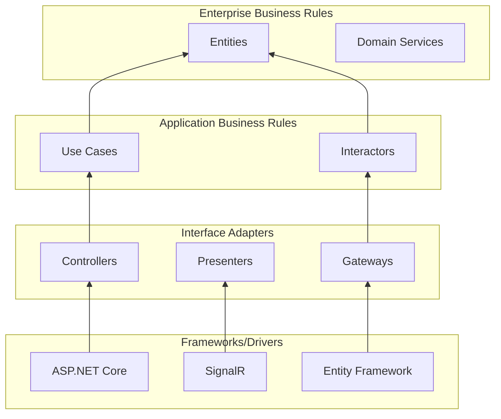
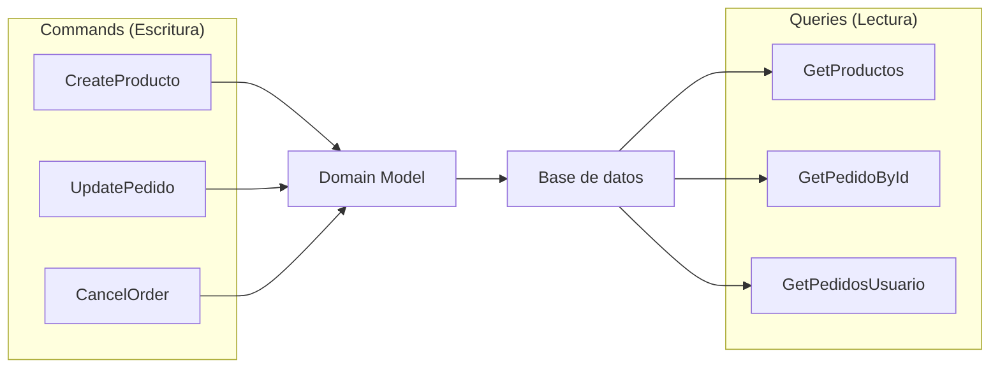
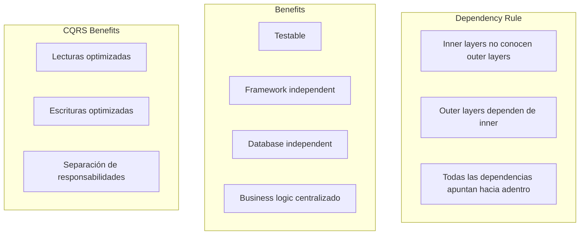

# 29. Clean Architecture y CQRS

## Índice

[29. Clean Architecture y CQRS](#29-clean-architecture-y-cqrs)
  - [29.1. ¿Qué es Clean Architecture?](#291-qué-es-clean-architecture)
  - [29.2. Estructura del Proyecto](#292-estructura-del-proyecto)
  - [29.3. Entities (Domain Layer)](#293-entities-domain-layer)
  - [29.4. CQRS](#294-cqrs)
  - [29.5. Repository con Especificaciones](#295-repository-con-especificaciones)
  - [29.6. Resumen y Buenas Prácticas](#296-resumen-y-buenas-prácticas)

---

## 29.1. ¿Qué es Clean Architecture?

**Clean Architecture** es un patrón de diseño que separa las preocupaciones en capas, manteniendo el núcleo de negocio independiente de detalles de implementación como frameworks, bases de datos o UI.



### Capas de Clean Architecture

| Capa | Responsabilidad | Ejemplos |
|------|-----------------|----------|
| **Domain** | Entidades, reglas de negocio | Producto, Pedido, Usuario |
| **Application** | Casos de uso, servicios | CreateOrder, GetProducts |
| **Infrastructure** | Acceso a datos, externos | DbContext, HttpClient |
| **Presentation** | Controllers, APIs | API Controllers, DTOs |

---

## 29.2. Estructura del Proyecto

```
TiendaApi/
├── src/
│   ├── TiendaApi.Core/           # Domain + Application
│   │   ├── Domain/               # Entidades y reglas de negocio
│   │   │   ├── Entities/
│   │   │   │   ├── Producto.cs
│   │   │   │   ├── Pedido.cs
│   │   │   │   └── Categoria.cs
│   │   │   ├── Interfaces/
│   │   │   │   ├── IRepository.cs
│   │   │   │   └── ICacheService.cs
│   │   │   ├── Services/
│   │   │   │   └── IDomainService.cs
│   │   │   └── Events/
│   │   ├── Application/          # Casos de uso
│   │   │   ├── DTOs/
│   │   │   ├── UseCases/
│   │   │   │   ├── Productos/
│   │   │   │   │   ├── GetProductoQuery.cs
│   │   │   │   │   ├── CreateProductoCommand.cs
│   │   │   │   │   └── ProductoValidator.cs
│   │   │   │   └── Pedidos/
│   │   │   ├── Interfaces/
│   │   │   │   ├── IProductoRepository.cs
│   │   │   │   └── ICacheService.cs
│   │   │   └── DependencyInjection.cs
│   │   └── TiendaApi.Core.csproj
│   │
│   ├── TiendaApi.Infrastructure/ # Acceso a datos
│   │   ├── Data/
│   │   │   ├── TiendaDbContext.cs
│   │   │   ├── Configurations/
│   │   │   └── Repositories/
│   │   ├── Cache/
│   │   │   └── RedisCacheService.cs
│   │   ├── External/
│   │   │   └── HttpClientService.cs
│   │   └── TiendaApi.Infrastructure.csproj
│   │
│   └── TiendaApi.Apis/           # Presentación
│       ├── Controllers/
│       │   └── V1/
│       ├── Middleware/
│       ├── Program.cs
│       └── TiendaApi.Apis.csproj
│
└── tests/
    ├── TiendaApi.Core.Tests/
    └── TiendaApi.Integration.Tests/
```

---

## 29.3. Entities (Domain Layer)

```csharp
namespace TiendaApi.Core.Domain.Entities;

public abstract class Entity
{
    public long Id { get; protected set; }
    public DateTime CreatedAt { get; protected set; } = DateTime.UtcNow;
    public DateTime? UpdatedAt { get; protected set; }
}

public class Producto : Entity
{
    private string _nombre = string.Empty;
    private decimal _precio;
    private int _stock;
    private long _categoriaId;

    public string Nombre
    {
        get => _nombre;
        set
        {
            if (string.IsNullOrWhiteSpace(value))
                throw new ArgumentException("El nombre no puede estar vacío");
            if (value.Length > 200)
                throw new ArgumentException("El nombre no puede exceder 200 caracteres");
            _nombre = value;
        }
    }

    public decimal Precio
    {
        get => _precio;
        set
        {
            if (value < 0)
                throw new ArgumentException("El precio no puede ser negativo");
            _precio = value;
        }
    }

    public int Stock
    {
        get => _stock;
        set
        {
            if (value < 0)
                throw new ArgumentException("El stock no puede ser negativo");
            _stock = value;
        }
    }

    public long CategoriaId
    {
        get => _categoriaId;
        set => _categoriaId = value;
    }

    public Categoria? Categoria { get; set; }

    // Método de dominio
    public bool TieneStock => Stock > 0;

    public void ActualizarStock(int cantidad)
    {
        var nuevoStock = Stock + cantidad;
        if (nuevoStock < 0)
            throw new InvalidOperationException("El stock no puede ser negativo");
        
        Stock = nuevoStock;
        UpdatedAt = DateTime.UtcNow;
    }
}

public class Categoria : Entity
{
    private string _nombre = string.Empty;

    public string Nombre
    {
        get => _nombre;
        set
        {
            if (string.IsNullOrWhiteSpace(value))
                throw new ArgumentException("El nombre es obligatorio");
            if (value.Length > 100)
                throw new ArgumentException("El nombre no puede exceder 100 caracteres");
            _nombre = value;
        }
    }

    public ICollection<Producto> Productos { get; set; } = new List<Producto>();
}
```

---

## 29.4. CQRS - Command Query Responsibility Segregation

**CQRS** separa las operaciones de lectura (Query) de las operaciones de escritura (Command), permitiendo optimizaciones independientes.



### Command Handler

```csharp
namespace TiendaApi.Core.Application.UseCases.Productos.Commands;

// Command
public record CreateProductoCommand(
    string Nombre,
    string? Descripcion,
    decimal Precio,
    int Stock,
    long CategoriaId
) : IRequest<Result<ProductoDto, Error>>;

// Handler
public class CreateProductoCommandHandler : IRequestHandler<CreateProductoCommand, Result<ProductoDto, Error>>
{
    private readonly IProductoRepository _repository;
    private readonly IValidator<CreateProductoCommand> _validator;

    public CreateProductoCommandHandler(
        IProductoRepository repository,
        IValidator<CreateProductoCommand> validator)
    {
        _repository = repository;
        _validator = validator;
    }

    public async Task<Result<ProductoDto, Error>> Handle(
        CreateProductoCommand request,
        CancellationToken cancellationToken)
    {
        // Validación
        var validationResult = await _validator.ValidateAsync(request);
        if (!validationResult.IsValid)
        {
            return Result.Failure<ProductoDto, Error>(
                Errors.Productos.DatosInvalidos(validationResult.Errors));
        }

        // Crear entidad
        var producto = new Producto
        {
            Nombre = request.Nombre,
            Descripcion = request.Descripcion,
            Precio = request.Precio,
            Stock = request.Stock,
            CategoriaId = request.CategoriaId,
            CreatedAt = DateTime.UtcNow
        };

        // Persistir
        var result = await _repository.AddAsync(producto);
        
        if (result.IsFailure)
        {
            return Result.Failure<ProductoDto, Error>(result.Error);
        }

        // Mapear a DTO
        return new ProductoDto
        {
            Id = result.Value.Id,
            Nombre = result.Value.Nombre,
            Precio = result.Value.Precio,
            Stock = result.Value.Stock,
            CategoriaId = result.Value.CategoriaId
        };
    }
}
```

### Query Handler

```csharp
namespace TiendaApi.Core.Application.UseCases.Productos.Queries;

// Query
public record GetProductoByIdQuery(long Id) : IRequest<Result<ProductoDto, Error>>;

// Query con filtros adicionales
public record GetProductosQuery(
    long? CategoriaId,
    int Page = 1,
    int PageSize = 20,
    string? SortBy = "nombre",
    bool Ascending = true
) : IRequest<PagedResponse<ProductoDto>>;

// Handler
public class GetProductosQueryHandler : IRequestHandler<GetProductosQuery, PagedResponse<ProductoDto>>
{
    private readonly IProductoReadRepository _readRepository;

    public GetProductosQueryHandler(IProductoReadRepository readRepository)
    {
        _readRepository = readRepository;
    }

    public async Task<PagedResponse<ProductoDto>> Handle(
        GetProductosQuery request,
        CancellationToken cancellationToken)
    {
        var (productos, total) = await _readRepository.GetAsync(
            categoriaId: request.CategoriaId,
            page: request.Page,
            pageSize: request.PageSize,
            sortBy: request.SortBy,
            ascending: request.Ascending);

        return new PagedResponse<ProductoDto>
        {
            Data = productos.Select(p => new ProductoDto
            {
                Id = p.Id,
                Nombre = p.Nombre,
                Precio = p.Precio,
                Stock = p.Stock,
                CategoriaNombre = p.Categoria?.Nombre
            }).ToList(),
            Page = request.Page,
            PageSize = request.PageSize,
            TotalItems = total,
            TotalPages = (int)Math.Ceiling(total / (double)request.PageSize)
        };
    }
}
```

### Mediator Pattern con MediatR

```bash
dotnet add package MediatR
dotnet add package MediatR.Extensions.Microsoft.DependencyInjection
```

```csharp
// Program.cs
builder.Services.AddMediatR(typeof(DependencyInjection).Assembly);

// Command Handler con Pipeline Behaviors
public class ValidationBehavior<TRequest, TResponse> 
    : IPipelineBehavior<TRequest, TResponse>
    where TRequest : IRequest<TResponse>
{
    private readonly IEnumerable<IValidator<TRequest>> _validators;

    public ValidationBehavior(IEnumerable<IValidator<TRequest>> validators)
    {
        _validators = validators;
    }

    public async Task<TResponse> Handle(
        TRequest request,
        RequestHandlerDelegate<TResponse> next,
        CancellationToken cancellationToken)
    {
        var context = new ValidationContext<TRequest>(request);
        var failures = _validators
            .Select(v => v.Validate(context))
            .SelectMany(r => r.Errors)
            .Where(f => f != null)
            .ToList();

        if (failures.Any())
        {
            throw new ValidationException(failures);
        }

        return await next();
    }
}
```

---

## 29.5. Repository con Especificaciones

```csharp
namespace TiendaApi.Core.Domain.Interfaces;

// Specification interface
public interface ISpecification<T>
{
    Expression<Func<T, bool>>? Criteria { get; }
    List<Expression<Func<T, object>>> Includes { get; }
    Expression<Func<T, object>>? OrderBy { get; }
    Expression<Func<T, object>>? OrderByDescending { get; }
    int? Take { get; }
    int? Skip { get; }
    bool AsNoTracking { get; }
}

// Implementación
public class Specification<T> : ISpecification<T>
{
    public Expression<Func<T, bool>>? Criteria { get; }
    public List<Expression<Func<T, object>>> Includes { get; } = new();
    public Expression<Func<T, object>>? OrderBy { get; private set; }
    public Expression<Func<T, object>>? OrderByDescending { get; private set; }
    public int? Take { get; private set; }
    public int? Skip { get; private set; }
    public bool AsNoTracking { get; private set; }

    public Specification(Expression<Func<T, bool>>? criteria = null)
    {
        Criteria = criteria;
    }

    public void AddInclude(Expression<Func<T, object>> includeExpression)
    {
        Includes.Add(includeExpression);
    }

    public void ApplyOrderBy(Expression<Func<T, object>> orderByExpression)
    {
        OrderBy = orderByExpression;
    }

    public void ApplyOrderByDescending(Expression<Func<T, object>> orderByDescendingExpression)
    {
        OrderByDescending = orderByDescendingExpression;
    }

    public void ApplyPaging(int skip, int take)
    {
        Skip = skip;
        Take = take;
    }

    public void ApplyNoTracking()
    {
        AsNoTracking = true;
    }
}

// Repository con especificaciones
public interface IProductoReadRepository
{
    Task<Producto?> GetByIdAsync(long id);
    Task<List<Producto>> GetAsync(ISpecification<Producto> spec);
    Task<int> CountAsync(ISpecification<Producto> spec);
}
```

---

## 29.6. Resumen y Buenas Prácticas

### Principios de Clean Architecture



### Buenas Prácticas

| Práctica | Descripción |
|----------|-------------|
| Entities contain business logic | No usar anemias |
| Dependencies injection | Inyectar interfaces |
| No tight coupling | Evitar dependencias circulares |
| Tests unitarios | Cada capa testeable independientemente |
| Thin controllers | Lógica en handlers |

### Siguientes Pasos

Con Clean Architecture y CQRS dominado, tienes las bases para crear APIs mantenibles y escalables.

### Recursos Adicionales

- Clean Architecture: https://blog.cleancoder.com/uncle-bob/2012/08/13/the-clean-architecture.html
- CQRS: https://docs.microsoft.com/azure/architecture/patterns/cqrs
- MediatR: https://github.com/jbogard/MediatR
