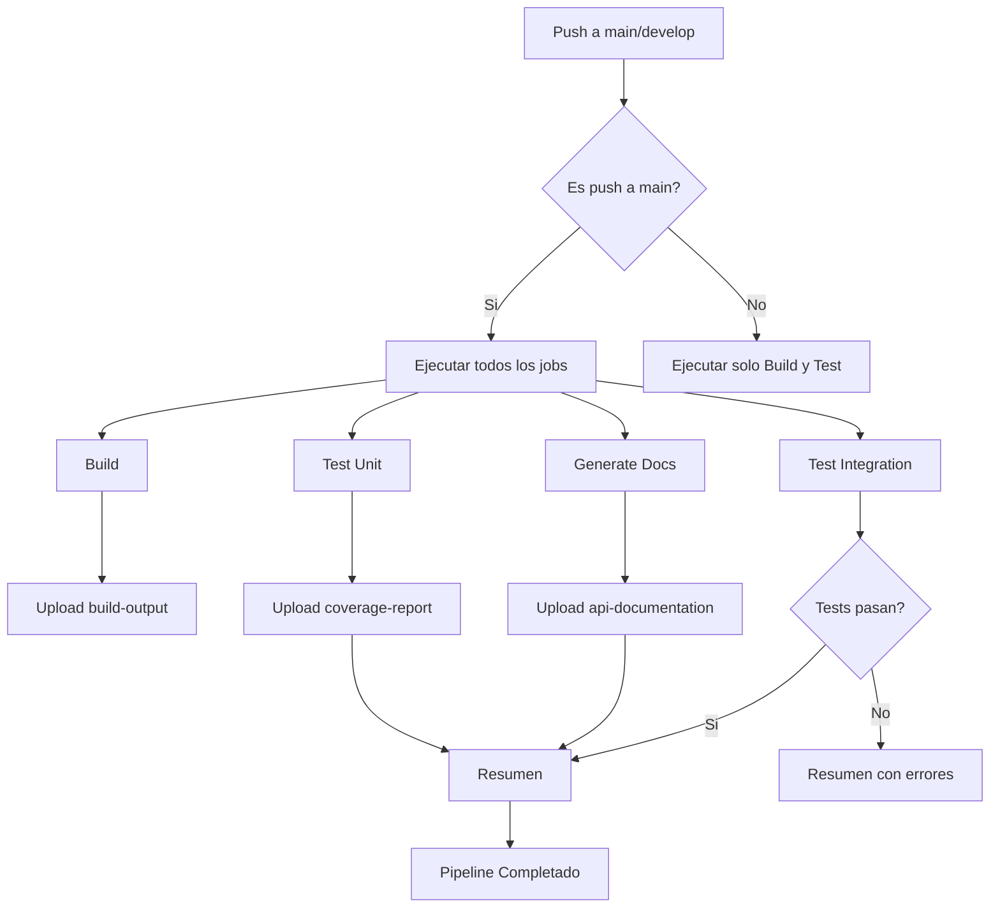
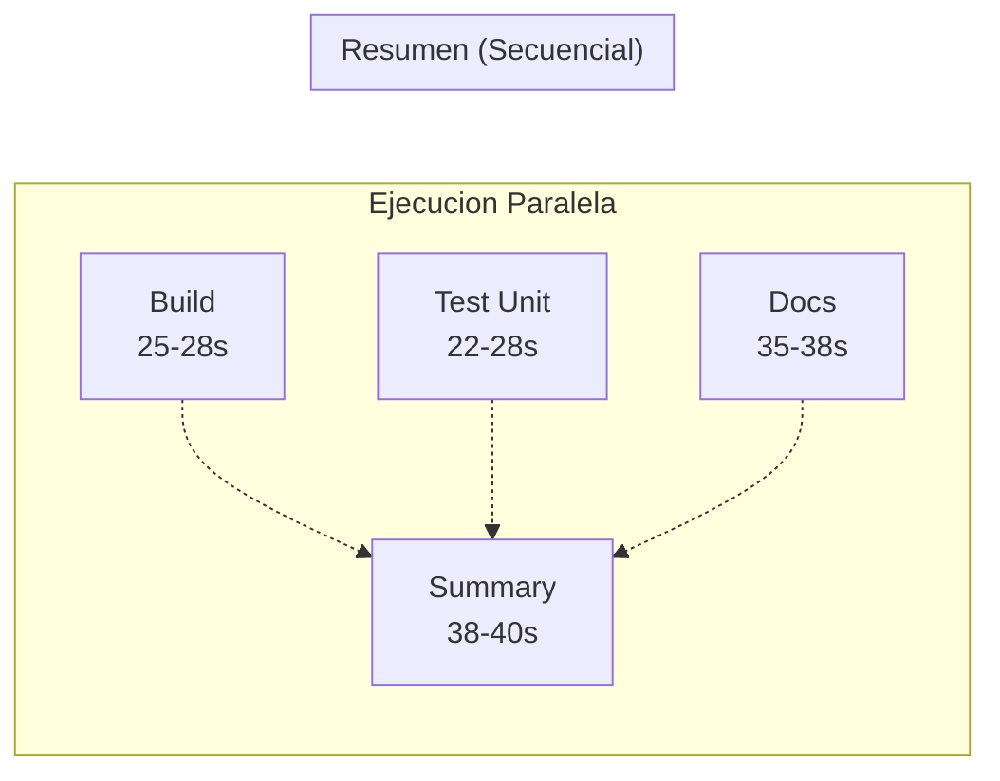
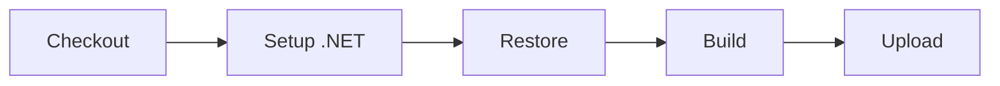
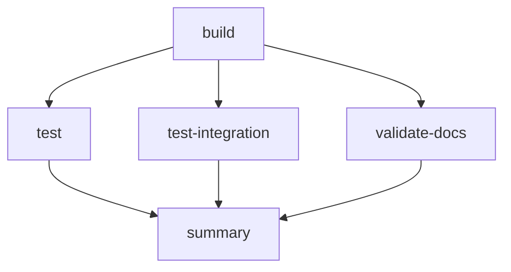
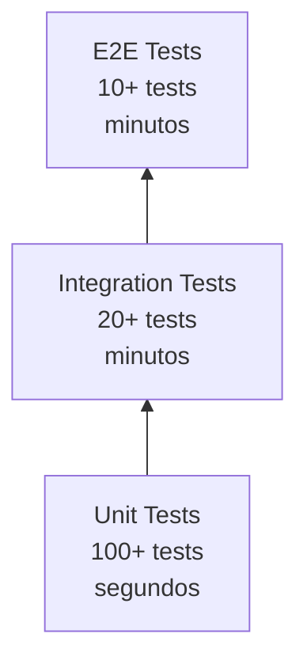
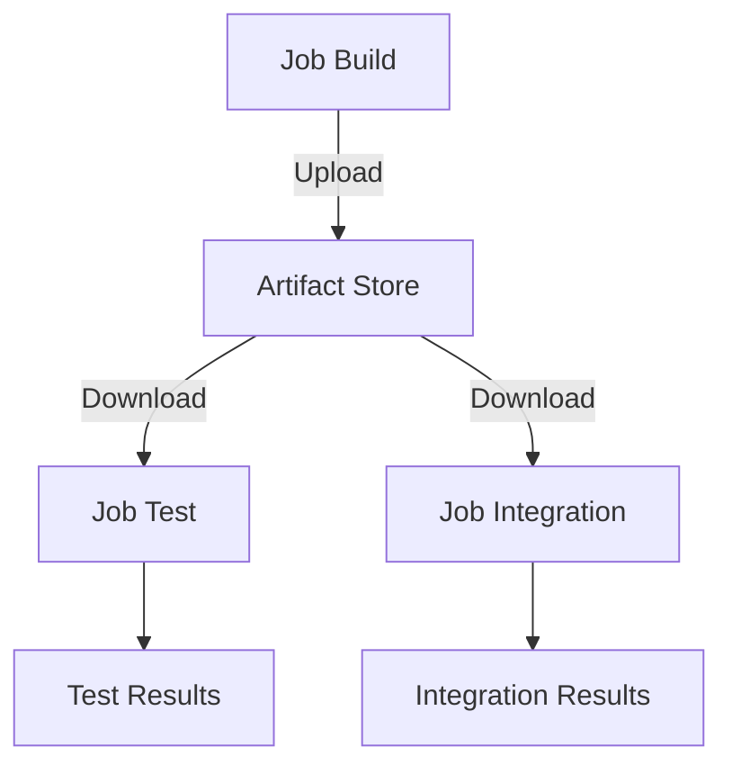
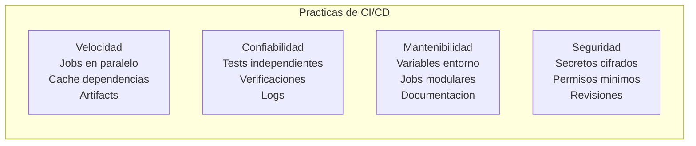

# 30. CI/CD

## Indice

[30. CI/CD con GitHub Actions](#30-cicd-con-github-actions)
  - [30.1. Fundamentos de CI/CD](#301-fundamentos-de-cicd)
  - [30.2. Arquitectura del Pipeline](#302-arquitectura-del-pipeline)
  - [30.3. Anatomia del Workflow](#303-anatomia-del-workflow)
  - [30.4. Jobs y sus Dependencias](#304-jobs-y-sus-dependencias)
  - [30.5. Estrategias de Testing Automatizado](#305-estrategias-de-testing-automatizado)
  - [30.6. Gestion de Artefactos](#306-gestion-de-artefactos)
  - [30.7. Documentacion Automatizada](#307-documentacion-automatizada)
  - [30.8. GitHub CLI: Tu Aliada en la Consola](#308-github-cli-tu-aliada-en-la-consola)
  - [30.9. Ejecucion y Monitoreo de Workflows](#309-ejecucion-y-monitoreo-de-workflows)
  - [30.10. Mejores Practicas](#3010-mejores-practicas)
  - [30.11. Resumen](#3011-resumen)

---

## 30.1. Fundamentos de CI/CD

Continuous Integration (CI) y Continuous Delivery/Deployment (CD) son practicas fundamentales en el desarrollo de software moderno que transforman radicalmente la forma en que los equipos entregan valor a sus usuarios.

La Integracion Continua es una practica de desarrollo que requiere que los desarrolladores integren su codigo en un repositorio compartido frecuentemente, idealmente varias veces al dia.

Continuous Delivery extiende CI al asegurar que el codigo integrado siempre este en un estado desplegable. Los equipos pueden liberar nuevas caracteristicas, correcciones de bugs y mejoras de rendimiento de forma rapida y confiable.

Continuous Deployment lleva este concepto aun mas lejos, eliminando la intervencion humana del proceso de despliegue.

### Beneficios para Proyectos Educativos

La implementacion de CI/CD en proyectos academicos proporciona beneficios que van mas alla de la simple automatizacion. Los estudiantes desarrollan una comprension profunda de los flujos de trabajo profesionales.

Los pipelines de CI/CD funcionan como un sistema de retroalimentacion inmediata para el aprendizaje.

## 30.2. Arquitectura del Pipeline

El pipeline de CI/CD de TiendaDawApi sigue una arquitectura modular que separa claramente las responsabilidades de cada etapa del proceso.



### Estructura de Ejecucion Paralela

La capacidad de ejecutar jobs en paralelo es uno de los aspectos mas valiosos de los pipelines modernos. En TiendaDawApi, los jobs de Build, Test Unit y Generate Documentation se ejecutan simultaneamente.



- Build: Checkout (0-10s) -> Restore+Build (10-25s) -> Upload (25-28s)
- Test Unit: Checkout (0-10s) -> Download (10-12s) -> Tests (12-22s) -> Coverage (22-28s)
- Docs: Checkout (0-8s) -> Install DocFX (8-15s) -> Build Docs (15-35s) -> Upload (35-38s)
- Summary: Espera a que terminen los demas (#30-38s) -> Genera resumen (38-40s)

## 30.3. Anatomia del Workflow

Un workflow de GitHub Actions se define mediante un archivo YAML que describe los jobs, steps y condiciones de ejecucion.

### Estructura del Archivo de Workflow

```yaml
name: CI Pipeline

on:
  push:
    branches: [main, develop]
  pull_request:
    branches: [main]
  workflow_dispatch:

env:
  DOTNET_VERSION: '10.0.x'
  SOLUTION: 'TiendaApi.slnx'

jobs:
  build:
    name: Build
    runs-on: ubuntu-latest
    steps:
      - name: Checkout code
        uses: actions/checkout@v4
      
      - name: Setup .NET
        uses: actions/setup-dotnet@v4
        with:
          dotnet-version: ${{ env.DOTNET_VERSION }}
```

### Componentes de un Job



## 30.4. Jobs y sus Dependencias

La gestion de dependencias entre jobs es crucial para pipelines eficientes. GitHub Actions permite especificar estas dependencias mediante la palabra clave needs.



### Job Build: Fundamento del Pipeline

```yaml
jobs:
  build:
    name: Build
    runs-on: ubuntu-latest
    
    steps:
      - name: Checkout code
        uses: actions/checkout@v4
      
      - name: Setup .NET
        uses: actions/setup-dotnet@v4
        with:
          dotnet-version: ${{ env.DOTNET_VERSION }}
      
      - name: Restore dependencies
        run: dotnet restore ${{ env.SOLUTION }}
      
      - name: Build
        run: dotnet build ${{ env.SOLUTION }} --configuration Release --no-restore
      
      - name: Upload build artifacts
        uses: actions/upload-artifact@v4
        with:
          name: build-output
          path: TiendaApi.Api/bin/Release/net10.0/
          retention-days: 1
```

### Job Test: Validacion Automatizada

```yaml
test:
  name: Test (Unit - Parallel)
  needs: build
  runs-on: ubuntu-latest
  if: needs.build.result == 'success'
  
  steps:
    - name: Checkout code
      uses: actions/checkout@v4
    
    - name: Setup .NET
      uses: actions/setup-dotnet@v4
      with:
        dotnet-version: ${{ env.DOTNET_VERSION }}
    
    - name: Download build artifacts
      uses: actions/download-artifact@v4
      with:
        name: build-output
        path: TiendaApi.Api/bin/Release/net10.0/
    
    - name: Run unit tests (parallel)
      run: dotnet test ${{ env.SOLUTION }} --configuration Release --no-build --filter "FullyQualifiedName~Unit" --verbosity minimal --collect:"XPlat Code Coverage" --results-directory ./TestResults
```

## 30.5. Estrategias de Testing Automatizado



### Tests Unitarios: Base de la Piramide

```yaml
- name: Run unit tests (parallel)
  run: dotnet test ${{ env.SOLUTION }} --configuration Release --no-build --filter "FullyQualifiedName~Unit" --verbosity minimal --collect:"XPlat Code Coverage" --results-directory ./TestResults
```

### Tests de Integracion

```yaml
test-integration:
  name: Test (Integration)
  needs: build
  runs-on: ubuntu-latest
  if: github.event_name == 'workflow_dispatch' && github.ref == 'refs/heads/main'
  
  services:
    mongo:
      image: mongo:7.0
      ports:
        - 27017:27017
    redis:
      image: redis:7-alpine
      ports:
        - 6379:6379
  
  steps:
    - name: Download build artifacts
      uses: actions/download-artifact@v4
      with:
        name: build-output
        path: TiendaApi.Api/bin/Release/net10.0/
    
    - name: Run integration tests (sequential, non-parallel)
      run: dotnet test ${{ env.SOLUTION }} --configuration Release --no-build --filter "FullyQualifiedName~Integration" --verbosity minimal
```

## 30.6. Gestion de Artefactos

### Subida de Artefactos

```yaml
- name: Upload build artifacts
  uses: actions/upload-artifact@v4
  with:
    name: build-output
    path: TiendaApi.Api/bin/Release/net10.0/
    retention-days: 1
```

### Descarga de Artefactos

```yaml
- name: Download build artifacts
  uses: actions/download-artifact@v4
  with:
    name: build-output
    path: TiendaApi.Api/bin/Release/net10.0/
```



## 30.7. Documentacion Automatizada

```yaml
validate-docs:
  name: Generate & Validate Documentation
  runs-on: ubuntu-latest
  
  steps:
    - name: Checkout code
      uses: actions/checkout@v4
    
    - name: Setup .NET
      uses: actions/setup-dotnet@v4
      with:
        dotnet-version: ${{ env.DOTNET_VERSION }}
    
    - name: Install DocFX
      run: dotnet tool install --global docfx
    
    - name: Build Documentation (HTML)
      run: docfx docfx.json
    
    - name: Upload Documentation Artifact
      uses: actions/upload-artifact@v4
      with:
        name: api-documentation-html
        path: _site
        if-no-files-found: warn
        retention-days: 7
```

## 30.8. GitHub CLI: Tu Aliada en la Consola

La GitHub CLI (gh) es una herramienta de linea de comandos que permite interactuar directamente con GitHub.

### Instalacion de GitHub CLI

```bash
# Windows (con scoop)
scoop install gh

# macOS (con Homebrew)
brew install gh

# Linux (Debian/Ubuntu)
sudo apt install gh
```

### Comandos Esenciales para CI/CD

#### Verificar Estado del Repositorio

```bash
# Ver estado del repositorio local
gh repo view

# Listar workflows disponibles
gh workflow list

# Ver detalles de un workflow especifico
gh workflow view ci.yml
```

#### Gestion de Workflows

```bash
# Ejecutar un workflow manualmente
gh workflow run ci.yml

# Ver historial de ejecuciones
gh run list --limit 10

# Ver una ejecucion especifica
gh run view <run-id>

# Ver logs en tiempo real (follow)
gh run watch <run-id> --exit-status

# Cancelar una ejecucion en progreso
gh run cancel <run-id>

# Re-ejecutar un workflow fallido
gh run rerun <run-id>
```

#### Gestion de Artefactos

```bash
# Listar artefactos de una ejecucion
gh run view <run-id> --json artifacts

# Descargar un artefacto especifico
gh run download <run-id> -n <artifact-name>

# Descargar todos los artefactos
gh run download <run-id> -D ./artefactos
```

#### Gestion de Releases y Tags

```bash
# Listar tags (versiones)
gh tag list

# Crear un tag anotado
git tag -a v1.0.0 -m "Release v1.0.0"

# Subir un tag a GitHub
git push origin v1.0.0

# Crear un release desde un tag
gh release create v1.0.0 --title "Release v1.0.0" --notes "Cambios de la version"
```

### Obtencion de IDs para Comandos

```bash
# Obtener el ID de la ultima ejecucion
gh run list --limit 1 --json id,databaseId,status,name

# Output en formato JSON para parsing
gh run list -L1 --jq '.[] | .id'
```

## 30.9. Ejecucion y Monitoreo de Workflows

### Ejemplo de Flujo de Trabajo Completo

```bash
# 30. CI/CD
gh repo view

# 30. CI/CD
gh workflow list

# 30. CI/CD
gh workflow run ci.yml

# 30. CI/CD
RUN_ID=$(gh run list -L1 --jq '.[0].id')
echo "Ejecutando: $RUN_ID"

# 30. CI/CD
gh run watch $RUN_ID --exit-status

# 30. CI/CD
gh run view $RUN_ID

# 30. CI/CD
gh run view $RUN_ID --json jobs

# 30. CI/CD
gh run download $RUN_ID -D ./artefactos
```

### Interpretacion de Resultados

```bash
# Ver resumen del pipeline
gh run view <run-id> --json name,status,conclusion,jobs
```

### Diagnostico de Problemas

```bash
# Ver pasos fallidos
gh run view <run-id> --json jobs --jq '.jobs[] | select(.conclusion == "FAILURE")'

# Obtener logs de un job especifico
gh run view <run-id> --job=<job-id> --log

# Buscar errores especificos en los logs
gh run view <run-id> --log | grep -i error

# Ver anotaciones (warnings y errores de linting)
gh run view <run-id>
```

## 30.10. Mejores Practicas

Implementar CI/CD efectivo requiere seguir convenciones y patrones que maximizan la confiabilidad y mantenibilidad del pipeline.

### Principios Fundamentales



- Velocidad: Ejecutar jobs en paralelo, cachear dependencias, usar artifacts eficientemente
- Confiabilidad: Tests independientes, verificaciones condicionales, logs detallados
- Mantenibilidad: Variables de entorno, jobs modulares, documentacion
- Seguridad: Secretos cifrados, permisos minimos, revisiones de codigo

### Optimizacion de Tiempos de Ejecucion

```yaml
# Usar cache para dependencias
- name: Cache NuGet packages
  uses: actions/cache@v4
  with:
    path: ~/.nuget/packages
    key: ${{ runner.os }}-nuget-${{ hashFiles('**/*.csproj') }}
    restore-keys: |
      ${{ runner.os }}-nuget-
```

### Manejo de Secretos

```yaml
# NUNCA hardcodear secrets en el workflow
env:
  # CORRECTO - Usar GitHub Secrets
  DATABASE_URL: ${{ secrets.DATABASE_URL }}
  API_KEY: ${{ secrets.API_KEY }}
```

Los secrets se configuran en Settings > Secrets and variables > Actions del repositorio.

## 30.11. Resumen

La implementacion de CI/CD con GitHub Actions representa un salto cualitativo en el desarrollo de software, transformando procesos manuales propensos a errores en flujos automatizados, confiables y reproducibles.

La GitHub CLI emerge como una herramienta indispensable para desarrolladores modernos, permitiendo interactuar con workflows directamente desde la terminal.

El dominio de estas tecnicas prepara al alumnado para entornos profesionales donde la automatizacion no es opcional sino requisito indispensable.

---

## Recursos Adicionales

- [Documentacion oficial de GitHub Actions](https://docs.github.com/es/actions)
- [GitHub CLI Documentation](https://cli.github.com/manual/)
- [Marketplace de Actions](https://github.com/marketplace?type=actions)
- [Ejemplos de Workflows](https://github.com/actions/starter-workflows)
