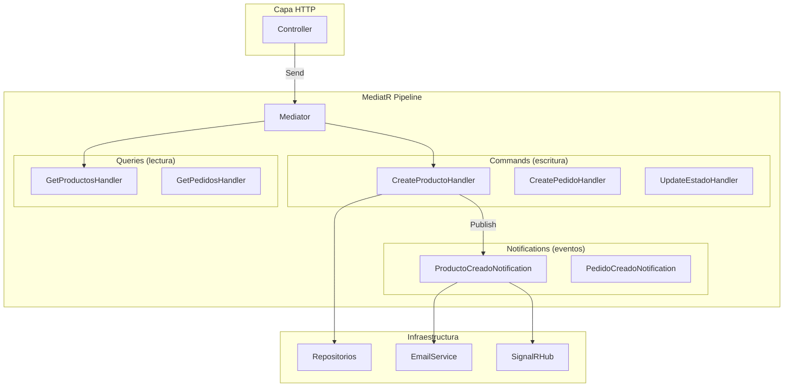
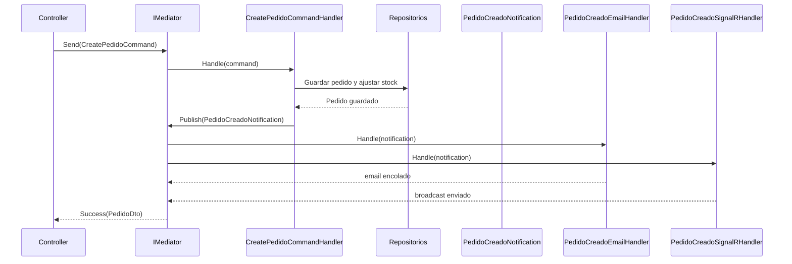

# 31. MediatR + CQRS + Eventos

## ¿Qué es el patrón Mediator?

El patrón Mediator evita que un objeto conozca directamente a todos los demás. En esta API los controllers solo conocen `IMediator`, no repositorios, hubs o servicios de email. Así se reduce acoplamiento y cada pieza queda enfocada en una sola responsabilidad.

## MediatR en .NET

- `IRequest<T>`: representa un command o query que espera respuesta.
- `IRequestHandler<TRequest, TResponse>`: ejecuta ese caso de uso.
- `INotification`: representa un evento publicado tras un hecho de dominio.
- `INotificationHandler<TNotification>`: reacciona al evento sin tocar el handler original.

## Por qué `INotification` es mejor que llamar directamente al EmailService

Porque desacopla el caso de uso del canal de salida. `CreatePedidoCommandHandler` publica `PedidoCreadoNotification` y no necesita saber si alguien enviará email, SignalR, WhatsApp o auditoría.

## Principio Open/Closed en acción

Si mañana queremos avisar por WhatsApp al crear un pedido, no hay que tocar `CreatePedidoCommandHandler`. Solo se añade `PedidoCreadoWhatsAppHandler : INotificationHandler<PedidoCreadoNotification>`.

## Pipeline Behaviors

MediatR permite introducir comportamientos cruzados como logging, validación o métricas. Un `ValidationBehavior` podría ejecutar todos los validadores antes de llegar al handler y devolver un `ValidationError` uniforme.

## Comparativa Fase 2 vs Fase 3

| Fase 2 | Fase 3 |
|---|---|
| Handlers sin eventos | Handlers publican `INotification` |
| Efectos laterales embebidos | Efectos laterales desacoplados |
| Más acoplamiento | Más extensibilidad |

## Ejemplos reales del proyecto

- `PedidoCreadoNotification` -> `PedidoCreadoEmailHandler` y `PedidoCreadoSignalRHandler`
- `EstadoPedidoActualizadoNotification` -> email + SignalR
- `UsuarioRegistradoNotification` -> email de bienvenida

## Secuencia completa de CreatePedido

