# 32. Organización Program.cs

## Índice

[32. Organización de Program.cs y Formas de Estructurar el Startup](#32-organizacin-de-programcs-y-formas-de-estructurar-el-startup)
  - [32.1. El Problema del Program.cs Monolítico](#321-el-problema-del-programcs-monoltico)
  - [32.2. Patrón de Extension Methods para Configuración](#322-patrn-de-extension-methods-para-configuracin)
  - [32.3. Estructura de Carpetas: Infrastructures/](#323-estructura-de-carpetas-infrastructures)
  - [32.4. Ejemplos de Implementación](#324-ejemplos-de-implementacin)
  - [32.5. Program.cs Refactorizado](#325-programcs-refactorizado)
  - [32.6. Otras Formas de Estructurar el Startup](#326-otras-formas-de-estructurar-el-startup)
  - [32.7. Buenas Prácticas y Recomendaciones](#327-buenas-prcticas-y-recomendaciones)
  - [32.8. Resumen](#328-resumen)

---

## 32.1. El Problema del Program.cs Monolítico

Cuando una aplicación crece, `Program.cs` acumula responsabilidades de configuración de servicios, middlewares, inicialización de bases de datos,Logging, autenticación, CORS, Swagger, y muchas otras configuraciones. Este crecimiento desorganizado genera varios problemas que afectan la mantenibilidad y la calidad del código a largo plazo.

El primer problema es la **dificultad de navegación**: un archivo de más de 500 líneas hace que encontrar una configuración específica sea tedioso. Cuando necesitas modificar la configuración de autenticación, debes hacer scroll entre decenas de configuraciones irrelevantes para llegar a esa sección. Esto consume tiempo y genera frustración en el equipo de desarrollo.

El segundo problema es el **acoplamiento temporal**: todas las configuraciones están en el mismo archivo y se ejecutan en un orden específico, pero no hay separación clara de responsabilidades. Si quieres reutilizar la configuración de bases de datos en otro proyecto, debes copiar y pegar el código relevante, lo cual viola el principio DRY (Don't Repeat Yourself) y dificulta la reutilización.

El tercer problema es la **dificultad de testing**: cuando toda la configuración está en un solo archivo, es prácticamente imposible probar una configuración de forma aislada. Si quieres verificar que tu configuración de autenticación es correcta, no puedes hacerlo sin ejecutar toda la aplicación o crear un proyecto de test específico.

El cuarto problema es la **falta de cohesión**: el archivo contiene configuraciones de naturaleza completamente diferente, desde Logging hasta bases de datos, desde autenticación hasta Swagger. Esta mezcla de responsabilidades viola los principios de diseño de software y hace que el código sea más difícil de entender y mantener.

### Ejemplo de Program.cs Monolítico

El siguiente código muestra un ejemplo simplificado pero representativo de un `Program.cs` que ha crecido sin control:

```csharp
using Serilog;
using Microsoft.EntityFrameworkCore;
using Microsoft.AspNetCore.Authentication.JwtBearer;
using Microsoft.OpenApi.Models;

var builder = WebApplication.CreateBuilder(args);

// Serilog
Log.Logger = new LoggerConfiguration()
    .WriteTo.Console()
    .CreateLogger();
builder.Host.UseSerilog();

// Controllers
builder.Services.AddControllers();
builder.Services.AddFluentValidationServices();

// API Versioning
builder.Services.AddApiVersioning(options =>
{
    options.DefaultApiVersion = new ApiVersion(1, 0);
    options.AssumeDefaultVersionWhenUnspecified = true;
});

// Swagger
builder.Services.AddSwaggerGen(c =>
{
    c.SwaggerDoc("v1", new OpenApiInfo { Title = "My API", Version = "v1" });
});

// CORS
builder.Services.AddCors(options =>
{
    options.AddPolicy("AllowAll", builder =>
    {
        builder.AllowAnyOrigin()
               .AllowAnyMethod()
               .AllowAnyHeader();
    });
});

// Database - PostgreSQL
var connectionString = builder.Configuration.GetConnectionString("PostgreSQL");
builder.Services.AddDbContext<AppDbContext>(options =>
    options.UseNpgsql(connectionString));

// Database - MongoDB
var mongoConnection = builder.Configuration.GetConnectionString("MongoDB");
builder.Services.AddSingleton<IMongoClient>(new MongoClient(mongoConnection));

// Redis Cache
builder.Services.AddSingleton<IConnectionMultiplexer>(
    ConnectionMultiplexer.Connect(builder.Configuration.GetConnectionString("Redis")));

// Authentication
builder.Services.AddAuthentication(JwtBearerDefaults.AuthenticationScheme)
    .AddJwtBearer(options =>
    {
        options.TokenValidationParameters = new TokenValidationParameters
        {
            ValidateIssuer = true,
            ValidateAudience = true,
            ValidateLifetime = true,
            ValidateIssuerSigningKey = true,
            ValidIssuer = builder.Configuration["Jwt:Issuer"],
            ValidAudience = builder.Configuration["Jwt:Audience"],
            IssuerSigningKey = new SymmetricSecurityKey(
                Encoding.UTF8.GetBytes(builder.Configuration["Jwt:Key"]))
        };
    });

// Repositories
builder.Services.AddScoped<IProductoRepository, ProductoRepository>();
builder.Services.AddScoped<ICategoriaRepository, CategoriaRepository>();
builder.Services.AddScoped<IPedidoRepository, PedidoRepository>();
builder.Services.AddScoped<IUserRepository, UserRepository>();

// Services
builder.Services.AddScoped<IProductoService, ProductoService>();
builder.Services.AddScoped<ICategoriaService, CategoriaService>();
builder.Services.AddScoped<IPedidosService, PedidosService>();
builder.Services.AddScoped<IAuthService, AuthService>();

// AutoMapper
builder.Services.AddAutoMapper(typeof(MappingProfile));

// Build
var app = builder.Build();

// Development middleware
if (app.Environment.IsDevelopment())
{
    app.UseSwagger();
    app.UseSwaggerUI();
}

// Exception Handler
app.UseExceptionHandler(errorApp =>
{
    errorApp.Run(async context =>
    {
        context.Response.StatusCode = 500;
        await context.Response.WriteAsync("An error occurred.");
    });
}

// HTTPS
app.UseHttpsRedirection();

// CORS
app.UseCors("AllowAll");

// Authentication & Authorization
app.UseAuthentication();
app.UseAuthorization();

// WebSockets
app.UseWebSockets();
app.MapWebSocketHandlers("/ws/productos", "/ws/pedidos");

// Static Files
app.UseStaticFiles();

// Map Controllers
app.MapControllers();

// GraphQL
app.MapGraphQL();

// Initialize Database
using (var scope = app.Services.CreateScope())
{
    var context = scope.ServiceProvider.GetRequiredService<AppDbContext>();
    context.Database.EnsureCreated();
    if (app.Environment.IsDevelopment())
    {
        context.SeedData();
    }
}

// Startup Info
var port = builder.Configuration["ASPNETCORE_URLS"]?.Split(':').LastOrDefault() ?? "5000";
Console.WriteLine("========================================");
Console.WriteLine($"API iniciada en http://localhost:{port}");
Console.WriteLine("Swagger: http://localhost:{Port}/swagger");
Console.WriteLine("========================================");

// Run
app.Run();
}
```

Este código, aunque funcional, presenta todos los problemas mencionados anteriormente. Para una aplicación pequeña puede ser aceptable, pero a medida que crece, se vuelve inmanejable.

---

## 32.2. Patrón de Extension Methods para Configuración

El patrón de extension methods es una técnica elegant para organizar el código de configuración de ASP.NET Core. Consiste en crear métodos de extensión para `IServiceCollection` (para configuración de servicios) y `WebApplication` (para configuración de middlewares), agrupando configuraciones relacionadas en archivos separados.

### Concepto Fundamental

Un extension method es un método estático que puede llamarse como si fuera un método de instancia. Esta característica de C# permite crear una sintaxis fluida y legible para configurar servicios. El siguiente ejemplo muestra la estructura básica de un método de extensión para configuración de servicios:

```csharp
using Microsoft.Extensions.DependencyInjection;

namespace TiendaApi.Apis.Infrastructures;

public static class DatabaseConfig
{
    public static IServiceCollection AddDatabases(
        this IServiceCollection services,
        IConfiguration configuration)
    {
        var connectionString = configuration.GetConnectionString("PostgreSQL");
        services.AddDbContext<TiendaDbContext>(options =>
            options.UseNpgsql(connectionString));

        var mongoConnection = configuration.GetConnectionString("MongoDB");
        services.AddSingleton<IMongoClient>(new MongoClient(mongoConnection));

        return services;
    }
}
```

Este método puede llamarse desde `Program.cs` con una sintaxis intuitiva:

```csharp
// La palabra "this" hace que sea un extension method
services.AddDatabases(configuration);
```

### Beneficios del Patrón

El patrón de extension methods proporciona múltiples beneficios que mejoran significativamente la calidad y mantenibilidad del código. El primer beneficio es la **lectura mejorada**: `Program.cs` se convierte en un índice legible que muestra todas las configuraciones sin los detalles de implementación. Un nuevo desarrollador puede entender la estructura de la aplicación con solo leer `Program.cs`.

El segundo beneficio es la **reutilización**: las configuraciones pueden reutilizarse fácilmente en otros proyectos. Si desarrollas múltiples APIs con autenticación JWT, puedes compartir el mismo código de configuración.

El tercer beneficio es el **testing simplificado**: cada configuración puede probarse de forma aislada, creando un contenedor DI de prueba con solo las configuraciones necesarias.

El cuarto beneficio es la **separación de responsabilidades**: cada archivo tiene una única responsabilidad, facilitando el mantenimiento y la evolución del código.

El quinto beneficio es la **facilidad de navegación**: encontrar la configuración de autenticación es tan simple como abrir el archivo `AuthenticationConfig.cs`.

### Organización por Módulos Funcionales

La clave para una buena organización es agrupar configuraciones relacionadas en módulos funcionales. Los siguientes son ejemplos de módulos típicos en una aplicación ASP.NET Core:

El módulo de **Core** incluye controladores, validación, versionado de API, y AutoMapper. Estos son los componentes fundamentales que toda aplicación necesita.

El módulo de **API** incluye Swagger, CORS, y middleware de excepciones. Estos componentes facilitan el consumo de la API por parte de los clientes.

El módulo de **Data** incluye bases de datos (PostgreSQL, MongoDB), caché (Redis, MemoryCache), y repositorios. Estos componentes manejan el acceso a datos.

El módulo de **Auth** incluye autenticación JWT, autorización por roles, y políticas. Estos componentes manejan la seguridad de la aplicación.

El módulo de **Business** incluye servicios de negocio específicos de la aplicación. Estos implementan la lógica de negocio.

El módulo de **Additional** incluye email, almacenamiento de archivos, WebSockets, y GraphQL. Estos son servicios adicionales que no son parte del núcleo pero enriquecen la aplicación.

---

## 32.3. Estructura de Carpetas: Infrastructures/

La carpeta `Infrastructures/` (o `Infrastructure/`) es el lugar recomendado para almacenar todos los métodos de extensión relacionados con la configuración de la aplicación. Esta estructura sigue el patrón de arquitectura limpia (Clean Architecture) donde la infraestructura contiene detalles de implementación técnica.

### Estructura de la Carpeta

```
TiendaApi.Apis/
├── Program.cs
├── Infrastructures/
│   ├── SerilogConfig.cs
│   ├── ControllersConfig.cs
│   ├── ApiVersioningConfig.cs
│   ├── SwaggerConfig.cs
│   ├── CorsConfig.cs
│   ├── DatabaseConfig.cs
│   ├── AuthenticationConfig.cs
│   ├── RepositoriesConfig.cs
│   ├── ServicesConfig.cs
│   ├── CacheConfig.cs
│   ├── EmailConfig.cs
│   ├── StorageConfig.cs
│   ├── WebSocketsConfig.cs
│   ├── GraphQLConfig.cs
│   ├── AutoMapperConfig.cs
│   ├── SwaggerExtensions.cs
│   ├── GraphQLExtensions.cs
│   ├── CorsExtensions.cs
│   ├── WebSocketExtensions.cs
│   ├── DatabaseInitializationExtensions.cs
│   └── StorageInitializationExtensions.cs
```

### Convenciones de Nomenclatura

La convención de nomenclatura es importante para mantener la consistencia y facilitar la navegación. Los archivos con sufijo `*Config.cs` contienen configuraciones de servicios (registro en el contenedor DI) y los archivos con sufijo `*Extensions.cs` contienen configuraciones del pipeline de middlewares.

Los archivos `*Config.cs` suelen implementar `IServiceCollection.AddXXX()` y contienen el registro de servicios, DbContext, clientes, y configuraciones generales. Los archivos `*Extensions.cs` suelen implementar `WebApplication.UseXXX()` o `WebApplication.MapXXX()` y contienen middleware y endpoints.

### Flujo de Configuración

```mermaid
flowchart TB
    subgraph "Program.cs"
        P["Program.cs\n(~120 líneas)"]
    end
    
    subgraph "Configuración de Servicios"
        C1["SerilogConfig\nLogging"]
        C2["ControllersConfig\nControllers + Validation"]
        C3["ApiVersioningConfig\nVersioning"]
        C4["SwaggerConfig\nSwagger"]
        C5["CorsConfig\nCORS"]
        C6["DatabaseConfig\nPostgreSQL + MongoDB"]
        C7["AuthenticationConfig\nJWT"]
        C8["RepositoriesConfig\nRepositorios"]
        C9["ServicesConfig\nServicios"]
        C10["CacheConfig\nRedis/Memory"]
        C11["EmailConfig\nEmail"]
        C12["StorageConfig\nArchivos"]
        C13["WebSocketsConfig\nWebSockets"]
        C14["GraphQLConfig\nGraphQL"]
        C15["AutoMapperConfig\nMappings"]
    end
    
    subgraph "Configuración de Pipeline"
        E1["SwaggerExtensions\nSwagger UI"]
        E2["GraphQLExtensions\nGraphiQL"]
        E3["CorsExtensions\nCORS Policy"]
        E4["WebSocketExtensions\nWebSocket Routes"]
        E5["DatabaseInitializationExtensions\nSeed Data"]
        E6["StorageInitializationExtensions\nStorage Setup"]
    end
    
    P --> C1
    P --> C2
    P --> C3
    P --> C4
    P --> C5
    P --> C6
    P --> C7
    P --> C8
    P --> C9
    P --> C10
    P --> C11
    P --> C12
    P --> C13
    P --> C14
    P --> C15
    
    P --> E1
    P --> E2
    P --> E3
    P --> E4
    P --> E5
    P --> E6
    
    style P fill:#4CAF50
    style C1 fill:#2196F3
    style E1 fill:#FF9800
```



---

## 32.4. Ejemplos de Implementación

### Ejemplo 1: Configuración de Base de Datos

El siguiente ejemplo muestra una configuración completa de bases de datos PostgreSQL y MongoDB en un archivo dedicado:

```csharp
using Microsoft.EntityFrameworkCore;
using Microsoft.Extensions.DependencyInjection;
using Serilog;
using TiendaApi.Apis.Data;
using MongoDB.Driver;

namespace TiendaApi.Apis.Infrastructures;

public static class DatabaseConfig
{
    public static IServiceCollection AddDatabases(
        this IServiceCollection services,
        IConfiguration configuration)
    {
        var postgresConnection = configuration.GetConnectionString("PostgreSQL");
        services.AddDbContext<TiendaDbContext>(options =>
        {
            options.UseNpgsql(postgresConnection);
            if (configuration.IsDevelopment())
            {
                options.EnableSensitiveDataLogging();
                options.EnableDetailedErrors();
            }
        });
        Log.Information("PostgreSQL configurado");

        var mongoConnection = configuration.GetConnectionString("MongoDB");
        services.AddSingleton<IMongoClient>(new MongoClient(mongoConnection));
        services.AddScoped<IMongoDatabase>(sp =>
        {
            var client = sp.GetRequiredService<IMongoClient>();
            return client.GetDatabase("TiendaDb");
        });
        Log.Information("MongoDB configurado");

        return services;
    }
}
```

### Ejemplo 2: Configuración de Autenticación JWT

El siguiente ejemplo muestra la configuración de autenticación JWT en un archivo dedicado:

```csharp
using System.Text;
using Microsoft.AspNetCore.Authentication.JwtBearer;
using Microsoft.IdentityModel.Tokens;
using Microsoft.Extensions.DependencyInjection;
using Serilog;
using TiendaApi.Apis.Models;

namespace TiendaApi.Apis.Infrastructures;

public static class AuthenticationConfig
{
    public static IServiceCollection AddAuthentication(
        this IServiceCollection services,
        IConfiguration configuration)
    {
        var jwtSettings = configuration.GetSection("Jwt");
        var secretKey = jwtSettings["Key"] ?? throw new InvalidOperationException("JWT Key no configurada");
        var key = new SymmetricSecurityKey(Encoding.UTF8.GetBytes(secretKey));

        services.AddAuthentication(options =>
        {
            options.DefaultAuthenticateScheme = JwtBearerDefaults.AuthenticationScheme;
            options.DefaultChallengeScheme = JwtBearerDefaults.AuthenticationScheme;
        })
        .AddJwtBearer(options =>
        {
            options.TokenValidationParameters = new TokenValidationParameters
            {
                ValidateIssuer = true,
                ValidateAudience = true,
                ValidateLifetime = true,
                ValidateIssuerSigningKey = true,
                ValidIssuer = jwtSettings["Issuer"],
                ValidAudience = jwtSettings["Audience"],
                IssuerSigningKey = key,
                ClockSkew = TimeSpan.Zero
            };

            options.Events = new JwtBearerEvents
            {
                OnAuthenticationFailed = context =>
                {
                    Log.Warning("Autenticación fallida: {Error}", context.Exception.Message);
                    return Task.CompletedTask;
                }
            };
        });

        services.AddAuthorization(options =>
        {
            options.AddPolicy("AdminOnly", policy => 
                policy.RequireRole(Roles.Admin));
            options.AddPolicy("UserOrAdmin", policy => 
                policy.RequireAssertion(ctx => 
                    ctx.User.IsInRole(Roles.Admin) || 
                    ctx.User.IsInRole(Roles.User)));
        });

        Log.Information("JWT Authentication configurado");
        return services;
    }
}
```

### Ejemplo 3: Configuración de WebSockets

El siguiente ejemplo muestra la configuración de WebSockets en un archivo dedicado:

```csharp
using Microsoft.AspNetCore.Builder;
using Serilog;
using TiendaApi.Apis.WebSockets.Pedidos;
using TiendaApi.Apis.WebSockets.Productos;

namespace TiendaApi.Apis.Infrastructures;

public static class WebSocketsConfig
{
    public static IServiceCollection AddWebSockets(this IServiceCollection services)
    {
        services.AddSingleton<ProductosWebSocketHandler>();
        services.AddSingleton<PedidosWebSocketHandler>();
        
        services.AddCors(options =>
        {
            options.AddPolicy("WebSocketPolicy", builder =>
            {
                builder.WithOrigins("http://localhost:3000", "http://localhost:8080")
                       .AllowAnyHeader()
                       .AllowAnyMethod()
                       .AllowCredentials();
            });
        });
        
        Log.Information("WebSockets configurado");
        return services;
    }
}

public static class WebSocketExtensions
{
    public static IApplicationBuilder MapWebSocketEndpoints(this IApplicationBuilder app)
    {
        var productosHandler = app.ApplicationServices.GetRequiredService<ProductosWebSocketHandler>();
        var pedidosHandler = app.ApplicationServices.GetRequiredService<PedidosWebSocketHandler>();
        
        app.Map("/ws/v1/productos", builder => 
            builder.UseWebSockets().Use(productosHandler.HandleAsync));
        
        app.Map("/ws/v1/pedidos", builder => 
            builder.UseWebSockets().Use(pedidosHandler.HandleAsync));
        
        Log.Information("WebSocket endpoints mapeados");
        return app;
    }
}
```

### Ejemplo 4: Configuración de GraphQL

El siguiente ejemplo muestra la configuración de GraphQL con HotChocolate:

```csharp
using HotChocolate;
using HotChocolate.Execution.Configuration;
using Microsoft.Extensions.DependencyInjection;
using Serilog;
using TiendaApi.Apis.GraphQL.Types;
using TiendaApi.Apis.GraphQL.Queries;
using TiendaApi.Apis.GraphQL.Mutations;

namespace TiendaApi.Apis.Infrastructures;

public static class GraphQLConfig
{
    public static IServiceCollection AddGraphQL(
        this IServiceCollection services,
        IWebHostEnvironment environment)
    {
        services
            .AddGraphQLServer()
            .AddQueryType<Query>()
            .AddMutationType<Mutation>()
            .AddType<ProductoType>()
            .AddType<CategoriaType>()
            .AddType<PedidoType>()
            .ModifyRequestOptions(opt =>
            {
                if (environment.IsDevelopment())
                {
                    opt.IncludeExceptionDetails = true;
                }
            })
            .AddTracing(tracing => tracing.IncludeException = true);

        Log.Information("GraphQL configurado");
        return services;
    }
}

public static class GraphQLExtensions
{
    public static IApplicationBuilder UseGraphiQL(this IApplicationBuilder app)
    {
        app.UseGraphiQL("/graphiql");
        Log.Information("GraphiQL UI disponible en /graphiql");
        return app;
    }
}
```

### Ejemplo 5: Configuración de Caché

El siguiente ejemplo muestra la configuración de caché con soporte para múltiples entornos:

```csharp
using Microsoft.Extensions.DependencyInjection;
using Microsoft.Extensions.DependencyInjection.Extensions;
using Serilog;
using StackExchange.Redis;
using TiendaApi.Apis.Services.Cache;

namespace TiendaApi.Apis.Infrastructures;

public static class CacheConfig
{
    public static IServiceCollection AddCache(
        this IServiceCollection services,
        IWebHostEnvironment environment)
    {
        if (environment.IsDevelopment())
        {
            services.AddMemoryCache();
            services.TryAddSingleton<ICacheService, MemoryCacheService>();
            Log.Information("Caché en memoria configurado (DESARROLLO)");
        }
        else
        {
            var redisConnection = environment.Configuration.GetConnectionString("Redis");
            services.AddSingleton<IConnectionMultiplexer>(ConnectionMultiplexer.Connect(redisConnection));
            services.TryAddSingleton<ICacheService, RedisCacheService>();
            Log.Information("Redis configurado (PRODUCCIá“N)");
        }

        return services;
    }
}
```

---

## 32.5. Program.cs Refactorizado

El resultado de aplicar este patrón es un `Program.cs` limpio, legible y mantenible:

```csharp
using Serilog;
using TiendaApi.Apis;
using TiendaApi.Apis.Data;
using TiendaApi.Apis.Data.Seed.Mongo;
using TiendaApi.Apis.Infrastructures;
using TiendaApi.Apis.Middleware;
using TiendaApi.Apis.WebSockets.Pedidos;
using TiendaApi.Apis.WebSockets.Productos;

Log.Logger = SerilogConfig.Configure().CreateLogger();
builder.Host.UseSerilog();

Log.Information("🚀 Inicializando TiendaApi...");

var services = builder.Services;
var configuration = builder.Configuration;
var environment = builder.Environment;

// === CONFIGURACIá“N DE SERVICIOS ===
services.AddMvcControllers();
services.AddFluentValidationServices();

services.AddApiVersioningPolicy();
services.AddSwagger();
services.AddCorsPolicy();

services.AddDatabases(configuration);
services.AddAuthentication(configuration);

services.AddRepositories();
services.AddServices();

services.AddCache(environment);
services.AddEmail(environment);
services.AddStorage();
services.AddWebSockets();

services.AddGraphQL(environment);
services.AddAutoMapper();

// === CONSTRUCCIá“N DE LA APLICACIá“N ===
var app = builder.Build();
var isDevelopment = app.Environment.IsDevelopment();

Log.Information("✅ Aplicación construida");

// === PIPELINE DE MIDDLEWARES ===
app.UseSwaggerUI(isDevelopment);
app.UseGraphiQL();
app.UseGlobalExceptionHandler();
app.UseHttpsRedirection();
app.UseCorsPolicy();
app.UseAuthentication();
app.UseAuthorization();
app.UseWebSockets();
app.MapWebSocketEndpoints();
app.UseStaticFiles();
app.MapControllers();
app.MapGraphQL();

// === INICIALIZACIá“N ===
await app.InitializeDatabaseAsync(isDevelopment);
app.InitializeStorage(isDevelopment);

PrintStartupInfo(isDevelopment, configuration);

// === ARRANQUE ===
try
{
    app.Run();
}
catch (Exception ex)
{
    Log.Fatal(ex, "💥 La aplicación falló al iniciar");
    throw;
}
finally
{
    Log.CloseAndFlush();
}

static void PrintStartupInfo(bool isDevelopment, IConfiguration configuration)
{
    var urls = configuration["ASPNETCORE_URLS"]?.Split(';') ?? new[] { "http://localhost:5000" };
    var port = urls.FirstOrDefault()?.Split(':').LastOrDefault() ?? "5000";

    Log.Information("========================================");
    Log.Information("TiendaApi - API REST Educativa");
    Log.Information("========================================");
    Log.Information("Swagger: http://localhost:{Port}/", port);
    Log.Information("GraphiQL: http://localhost:{Port}/graphiql", port);
    Log.Information("========================================");
    Log.Information("🚀 Aplicación iniciada en {Mode}", 
        isDevelopment ? "DESARROLLO" : "PRODUCCIá“N");
}
```

### Comparación de Métricas

| Métrica | Antes | Después |
|---------|-------|---------|
| Líneas de Program.cs | ~600 | ~120 |
| Archivos de configuración | 1 | 22 |
| Tiempo para encontrar configuración | ~2 minutos | ~5 segundos |
| Reutilización entre proyectos | Difícil | Fácil |
| Testing de configuración | Prácticamente imposible | Aislado y sencillo |

---

## 32.6. Otras Formas de Estructurar el Startup

### Opción 1: Módulos con Clase de Configuración

Esta opción agrupa todas las configuraciones de un módulo en una clase estática, similar a lo que hemos implementado pero con un enfoque más explícito:

```csharp
public static class DatabaseModule
{
    public static IServiceCollection AddDatabase(
        this IServiceCollection services,
        IConfiguration configuration)
    {
        // Configuración de PostgreSQL
        services.AddDbContext<AppDbContext>(options =>
            options.UseNpgsql(configuration.GetConnectionString("PostgreSQL")));
        
        // Configuración de MongoDB
        services.AddSingleton<IMongoClient>(new MongoClient(
            configuration.GetConnectionString("MongoDB")));
        
        return services;
    }
    
    public static IApplicationBuilder UseDatabase(this IApplicationBuilder app)
    {
        // Inicialización de base de datos
        using var scope = app.ApplicationServices.CreateScope();
        var context = scope.ServiceProvider.GetRequiredService<AppDbContext>();
        context.Database.EnsureCreated();
        
        return app;
    }
}
```

### Opción 2: Clase Startup Separada

Para aplicaciones más complejas, se puede crear una clase `Startup` dedicada:

```csharp
public class Startup
{
    private readonly IConfiguration _configuration;
    private readonly IWebHostEnvironment _environment;
    
    public Startup(IConfiguration configuration, IWebHostEnvironment environment)
    {
        _configuration = configuration;
        _environment = environment;
    }
    
    public void ConfigureServices(IServiceCollection services)
    {
        services.AddControllers();
        services.AddDbContext<AppDbContext>(options =>
            options.UseNpgsql(_configuration.GetConnectionString("PostgreSQL")));
        services.AddAuthentication(JwtBearerDefaults.AuthenticationScheme)
            .AddJwtBearer(/* ... */);
        // Más configuraciones...
    }
    
    public void Configure(WebApplication app)
    {
        if (_environment.IsDevelopment())
        {
            app.UseSwagger();
            app.UseSwaggerUI();
        }
        
        app.UseHttpsRedirection();
        app.UseAuthentication();
        app.UseAuthorization();
        app.MapControllers();
    }
}
```

### Opción 3: Múltiples Archivos de Configuración con Directorio

Esta opción organiza las configuraciones en subcarpetas dentro de `Configuration/`:

```
Configuration/
├── Database/
│   ├── PostgreSQLConfig.cs
│   ├── MongoDBConfig.cs
│   └── CacheConfig.cs
├── Security/
│   ├── AuthenticationConfig.cs
│   ├── AuthorizationConfig.cs
│   └── CorsConfig.cs
├── Api/
│   ├── VersioningConfig.cs
│   ├── SwaggerConfig.cs
│   └── RoutingConfig.cs
└── Infrastructure/
    ├── LoggingConfig.cs
    ├── HealthChecksConfig.cs
    └── TelemetryConfig.cs
```

### Opción 4: Usando Minimal APIs con Registros

Para aplicaciones que usan minimal APIs, se puede usar el patrón de registros:

```csharp
var builder = WebApplication.CreateBuilder(args);

builder.Services
    .AddDatabaseConfiguration(builder.Configuration)
    .AddAuthenticationConfiguration(builder.Configuration)
    .AddCorsConfiguration(builder.Configuration);

var app = builder.Build();

app
    .UseCorsConfiguration()
    .UseAuthenticationConfiguration()
    .MapApiEndpoints();

app.Run();
```

### Comparación de Enfoques

| Enfoque | Pros | Contras |
|---------|------|---------|
| Extension Methods (nuestro enfoque) | Simple, familiar, extensible | Requiere múltiples archivos |
| Clase Startup | Estructura tradicional de ASP.NET Core | Menos flexible para proyectos pequeños |
| Directorios por módulo | Muy organizado para proyectos grandes | Mayor complejidad inicial |
| Registros fluidos | Sintaxis muy legible | Puede ser confuso para principiantes |

---

## 32.7. Buenas Prácticas y Recomendaciones

### Principios de Diseño

Al organizar el código de configuración, es importante seguir una serie de principios que garantizan la calidad y mantenibilidad del código a largo plazo.

El **principio de responsabilidad única** establece que cada archivo de configuración debe tener una única razón para cambiar. Si modificas la configuración de autenticación, solo debería afectar a `AuthenticationConfig.cs`. Si necesitas modificar la configuración de bases de datos, solo debería afectar a `DatabaseConfig.cs`.

El **principio de convención sobre configuración** establece que seguir convenciones consistentes reduce la carga cognitiva. Nombra los archivos de forma predecible, usa el sufijo `Config` para servicios y `Extensions` para pipeline, y mantiene una estructura de carpetas coherente.

El **principio de apertura/cierre** establece que los archivos de configuración deben ser extensibles sin modificar el código existente. Usa métodos parciales si necesitas extender la funcionalidad de un config existente.

### Organización Recomendada

La organización recomendada para proyectos de tamaño pequeño a mediano sigue una estructura simple con una carpeta `Infrastructures/` que contiene todos los archivos de configuración. Esta estructura es fácil de entender, mantener y extender.

Para proyectos de tamaño mediano a grande, se recomienda subdividir `Infrastructures/` en subcarpetas como `Configuration/` para configs de servicios y `Middleware/` para configs de pipeline. Esto proporciona una capa adicional de organización sin añadir complejidad innecesaria.

Para proyectos empresariales o con múltiples equipos, se puede considerar crear paquetes NuGet reutilizables para configuraciones comunes como autenticación, logging, y caché. Esto facilita la consistencia entre proyectos y reduce la duplicación de código.

### Documentación de Configuraciones

Cada archivo de configuración debe incluir documentación XML que explique su propósito, parámetros, y efectos secundarios. Esta documentación es invaluable para nuevos miembros del equipo y para el mantenimiento a largo plazo:

```csharp
/// <summary>
/// Configura los servicios de base de datos de la aplicación.
/// Registra PostgreSQL con Entity Framework Core y MongoDB.
/// </summary>
/// <param name="services">Colección de servicios donde registrar las configuraciones.</param>
/// <param name="configuration">Configuración de la aplicación.</param>
/// <returns>La colección de servicios modificada para encadenamiento.</returns>
public static IServiceCollection AddDatabases(
    this IServiceCollection services,
    IConfiguration configuration)
{
    // ...
}
```

### Manejo de Errores en Configuración

Las configuraciones deben validar los parámetros requeridos y lanzar excepciones descriptivas cuando algo falla. Esto facilita el debugging durante el inicio de la aplicación:

```csharp
public static IServiceCollection AddDatabases(
    this IServiceCollection services,
    IConfiguration configuration)
{
    var postgresConnection = configuration.GetConnectionString("PostgreSQL")
        ?? throw new InvalidOperationException(
            "Connection string 'PostgreSQL' no encontrada en configuration");
    
    // ...
}
```

### Testing de Configuraciones

Las configuraciones deben probarse para garantizar que funcionan correctamente. El siguiente ejemplo muestra cómo probar una configuración:

```csharp
[Fact]
public void AddDatabases_ValidConfiguration_RegistersServices()
{
    // Arrange
    var services = new ServiceCollection();
    var configuration = new ConfigurationBuilder()
        .AddInMemoryCollection(new Dictionary<string, string>
        {
            { "ConnectionStrings:PostgreSQL", "Host=localhost;Database=Test" },
            { "ConnectionStrings:MongoDB", "mongodb://localhost:27017" }
        })
        .Build();

    // Act
    services.AddDatabases(configuration);

    // Assert
    var provider = services.BuildServiceProvider();
    using var scope = provider.CreateScope();
    var dbContext = scope.ServiceProvider.GetRequiredService<AppDbContext>();
    var mongoClient = scope.ServiceProvider.GetRequiredService<IMongoClient>();
    
    Assert.NotNull(dbContext);
    Assert.NotNull(mongoClient);
}
```

---

## 32.8. Resumen

A lo largo de este documento hemos explorado el problema del `Program.cs` monolítico y presentado soluciones prácticas para organizar el código de configuración de aplicaciones ASP.NET Core.

### Puntos Clave

El patrón de extension methods es una técnica poderosa para organizar el código de configuración. Permite separar responsabilidades, mejorar la legibilidad, facilitar el testing, y reutilizar configuraciones entre proyectos. La carpeta `Infrastructures/` es el lugar recomendado para almacenar estos métodos de extensión, siguiendo convenciones de nomenclatura consistentes.

### Beneficios del Enfoque

| Beneficio | Descripción |
|-----------|-------------|
| **Legibilidad** | `Program.cs` se convierte en un índice claro |
| **Mantenibilidad** | Cambios localizados en archivos específicos |
| **Reutilización** | Configuraciones compartibles entre proyectos |
| **Testabilidad** | Pruebas aisladas de cada configuración |
| **Escalabilidad** | Fácil añadir nuevas configuraciones |

### Siguientes Pasos

Con este patrón de organización, el siguiente paso natural es explorar patrones de arquitectura más avanzados como Clean Architecture, Vertical Slice Architecture, o Domain-Driven Design, donde estos principios de organización se aplican a nivel de toda la aplicación, no solo al código de startup.

### Recursos Adicionales

- Documentación de extensibilidad de ASP.NET Core: https://docs.microsoft.com/aspnet/core/fundamentals/extensibility
- Patrones de startup en ASP.NET Core: https://docs.microsoft.com/aspnet/core/fundamentals/startup
- Mejores prácticas de configuración: https://docs.microsoft.com/aspnet/core/fundamentals/configuration/options

## MediatRConfig en el inventario

En la organización actual de `Program.cs` aparece una pieza nueva:

```csharp
services.AddMediatRHandlers(); // Registra todos los IRequestHandler e INotificationHandler
```

La idea es *Convention over Configuration*: no hay que registrar handler por handler. `RegisterServicesFromAssemblyContaining<Program>()` escanea el ensamblado y descubre automáticamente commands, queries y notifications.
